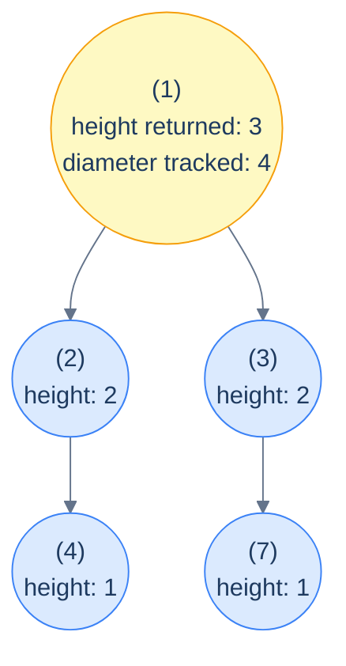

# 11. Pattern: Postorder Traversal (Stateful)

## The Hook

The previous lesson handled problems where each subtree returned **one** number to its parent and the parent combined the two children's numbers into a new one. That worked for height, sum, and similar single-value rollups. But there's a class of problems where the recursion needs to compute **two** things at once: a value to *return* to the parent (the "feed-up" answer) and a value to *track globally* (the "best-so-far" answer).

The classic example is **diameter of a binary tree** — the longest path between any two nodes. At every node, the diameter could either:
- *Pass through* this node (length = leftHeight + rightHeight), or
- Live *entirely within* one of the subtrees (length = whatever the subtree's diameter was).

So each call needs to *return* its own height (so the parent can compute its diameter), and *update a global maximum* with the best diameter seen so far. One value flows up the recursion; the other accumulates as a side effect. Two channels, one traversal.

This is the **stateful postorder pattern**. Same postorder traversal as the previous lesson, but augmented with a *shared mutable* (a global counter, a hash map, a tuple of running stats) that each call updates as the recursion bubbles up. The state is *not* pushed and popped per node — it monotonically grows or refines as we go. That's the structural difference from stateful *preorder* (lesson 9): preorder mutates and undoes; postorder mutates and accumulates.

This pattern unlocks a wide range of problems: tree diameter, longest mono-value paths, "count subtrees with property X", "distribute coins along edges", "find subtree sums with the highest frequency", and dozens of similar "two answers per node" problems. This lesson walks through the seven canonical examples, each with implementations in Python and Java.

---

## Table of contents

1. [The stateful postorder pattern](#the-stateful-postorder-pattern)
2. [How to recognise it](#how-to-recognise-it)
3. [Problem 1 — Diameter of tree](#problem-1--diameter-of-tree)
4. [Problem 2 — Descendants sum count](#problem-2--descendants-sum-count)
5. [Problem 3 — Distribute coins](#problem-3--distribute-coins)
6. [Problem 4 — Most frequent subtree sum](#problem-4--most-frequent-subtree-sum)
7. [Problem 5 — Longest monotonic path](#problem-5--longest-monotonic-path)
8. [Problem 6 — Monotonic subtree count](#problem-6--monotonic-subtree-count)
9. [Problem 7 — Path sum count](#problem-7--path-sum-count)

***

# The stateful postorder pattern

```text
recurse(node):
  if node is null: return baseCase
  leftAnswer  = recurse(node.left)
  rightAnswer = recurse(node.right)

  # ★ side-channel update: refine global state using leftAnswer, rightAnswer, node
  globalState = update(globalState, leftAnswer, rightAnswer, node)

  return feedUp(leftAnswer, rightAnswer, node)
```

Two distinct things happen at each node:

1. **Side-channel update** — refine a global accumulator using the children's results and the current node. This is what your *answer* is built from.
2. **Feed-up** — return some value to the parent. This is what enables the *next* level up to do its own update.

The genius of the pattern is that the value returned to the parent and the value tracked globally **don't have to be the same**. In the diameter problem, the function returns *height* (so the parent can extend the path through it), but it tracks *diameter* (the global best). One traversal, two answers.



<p align="center"><strong>Stateful postorder for diameter — each call returns its <em>height</em> to the parent (so the parent can compute its own); separately, each call updates a global <em>maxDiameter</em> with <code>leftHeight + rightHeight</code>. Two answers per call, one traversal.</strong></p>

> **Why is the global state safe to share?** Because postorder updates are *monotone* — typically a `max` or `min` or a counter `+= 1`. Order of updates doesn't matter, and there's no need for "undo" because no later subtree's result can invalidate an earlier one's. This is the structural difference from stateful preorder (lesson 9), where state had to be pushed and popped to keep sibling subtrees from polluting each other.

## Generic pattern

The template — diameter of a tree, since it's the canonical example.


```python run
from typing import Optional

class TreeNode:
    def __init__(self, val=0, left=None, right=None):
        self.val, self.left, self.right = val, left, right

def diameter(root: Optional[TreeNode]) -> int:
    best = [0]                                      # global state (in a list to mutate from inner fn)
    def height(node):
        if node is None: return 0
        l = height(node.left); r = height(node.right)
        best[0] = max(best[0], l + r)               # update global state (diameter)
        return 1 + max(l, r)                        # return height to parent
    height(root)
    return best[0]
```

```java run
static int best;
static int height(TreeNode n) {
    if (n == null) return 0;
    int l = height(n.left), r = height(n.right);
    best = Math.max(best, l + r);                   // update global state
    return 1 + Math.max(l, r);                      // return height
}
public static int diameter(TreeNode root) {
    best = 0;
    height(root);
    return best;
}
```


***

# How to recognise it

The pattern fits when:

- The answer at each node depends on **both children's results** (postorder), *and*
- The "best result anywhere in the tree" might differ from "the result feeding up to my parent". The two are *related* but not the *same* number.

Concrete cues:

- *"Find the longest / largest / maximum X in the tree"* — track the global best.
- *"Count nodes / subtrees / paths satisfying property Y"* — track a global counter.
- *"The path can start and end anywhere"* — definitely "track best while feeding height up".
- *"Compute X for every subtree, then find the most-frequent / largest / smallest"* — track globals across all subtree computations.

Anti-pattern: if a single returned value suffices (like simple sum-of-leaves or height), use the *stateless* postorder. If you really only need information from above (no global), use the preorder patterns instead.

***

# Problem 1 — Diameter of tree

> The diameter is the longest *path* (in edges) between any two nodes. The path may pass through any node — not necessarily the root.

Already covered in the generic skeleton above. Each call returns *height* (number of nodes downward); each call updates `best = max(best, leftHeight + rightHeight)` (path edges through this node). Final answer is the global `best`.

The implementation is exactly the generic template. The lesson here is *what to choose* as the feed-up vs the global, not how to type the code.

***

# Problem 2 — Descendants sum count

> Count nodes whose value equals the sum of *all* values in their subtree below them (not including themselves).

Each subtree returns its sum (so the parent can compute its own); along the way, each call updates a global counter if `node.val == leftSum + rightSum`.

<details>
<summary><h2>Solution</h2></summary>


```python run
from typing import Optional


class TreeNode:
    def __init__(self, val=0, left=None, right=None):
        self.val = val
        self.left = left
        self.right = right


def from_level_order(values):
    """Build tree from list like [1, 2, 3, None, 4]. None means missing child."""
    if not values:
        return None
    root = TreeNode(values[0])
    queue = [root]
    i = 1
    while queue and i < len(values):
        node = queue.pop(0)
        if i < len(values) and values[i] is not None:
            node.left = TreeNode(values[i])
            queue.append(node.left)
        i += 1
        if i < len(values) and values[i] is not None:
            node.right = TreeNode(values[i])
            queue.append(node.right)
        i += 1
    return root


class Solution:
    def __init__(self):
        self.count: int = 0

    def compute_sum(self, root: Optional[TreeNode]) -> int:

        # Base case: If the current node is NULL, return 0
        if not root:
            return 0

        # Recursively compute the sum of the left and right subtrees
        left_sum = self.compute_sum(root.left)
        right_sum = self.compute_sum(root.right)

        # If the value of the current node is equal to the sum of its
        # descendants, increment the count
        if root.val == left_sum + right_sum:
            self.count += 1

        # Return the sum of the current subtree, including the value
        # of the current node
        return left_sum + right_sum + root.val

    def descendants_sum_count(self, root: Optional[TreeNode]) -> int:

        # Call the compute_sum function to count the number of nodes
        # satisfying the given condition
        self.compute_sum(root)
        return self.count


# Examples from the problem statement
print(Solution().descendants_sum_count(from_level_order([21, 7, 3, 5, 2, None, 4])))   # 2
print(Solution().descendants_sum_count(from_level_order([5, 7, 3, 1, 2, None, 3])))    # 1

# Edge cases
print(Solution().descendants_sum_count(None))                                            # 0
print(Solution().descendants_sum_count(from_level_order([0])))                           # 1 (single leaf: val==0==sum)
print(Solution().descendants_sum_count(from_level_order([1])))                           # 0 (single leaf: 1!=0)
print(Solution().descendants_sum_count(from_level_order([3, 1, 2])))                     # 1 (root: 3==1+2)
print(Solution().descendants_sum_count(from_level_order([1, 2, None, 3, None, 4])))      # 0 (only-left skew)
print(Solution().descendants_sum_count(from_level_order([6, 3, 3, 1, 2, 1, 2])))        # 3 (root + both internal nodes)
```

```java run
import java.util.*;

public class Main {
    static class TreeNode {
        int val;
        TreeNode left;
        TreeNode right;
        TreeNode() {}
        TreeNode(int val) { this.val = val; }
    }

    static TreeNode fromLevelOrder(Integer... values) {
        if (values.length == 0 || values[0] == null) return null;
        TreeNode root = new TreeNode(values[0]);
        java.util.Deque<TreeNode> queue = new java.util.ArrayDeque<>();
        queue.add(root);
        int i = 1;
        while (!queue.isEmpty() && i < values.length) {
            TreeNode node = queue.poll();
            if (i < values.length && values[i] != null) {
                node.left = new TreeNode(values[i]);
                queue.add(node.left);
            }
            i++;
            if (i < values.length && values[i] != null) {
                node.right = new TreeNode(values[i]);
                queue.add(node.right);
            }
            i++;
        }
        return root;
    }

    static class Solution {
        private int count = 0;

        private int computeSum(TreeNode root) {

            // Base case: If the current node is NULL, return 0
            if (root == null) {
                return 0;
            }

            // Recursively compute the sum of the left and right subtrees
            int leftSum = computeSum(root.left);
            int rightSum = computeSum(root.right);

            // If the value of the current node is equal to the sum of its
            // descendants, increment the count
            if (root.val == leftSum + rightSum) {
                count++;
            }

            // Return the sum of the current subtree, including the value
            // of the current node
            return leftSum + rightSum + root.val;
        }

        public int descendantsSumCount(TreeNode root) {

            // Call the computeSum function to count the number of nodes
            // satisfying the given condition
            computeSum(root);
            return count;
        }
    }

    public static void main(String[] args) {
        // Examples from the problem statement
        System.out.println(new Solution().descendantsSumCount(fromLevelOrder(21, 7, 3, 5, 2, null, 4)));   // 2
        System.out.println(new Solution().descendantsSumCount(fromLevelOrder(5, 7, 3, 1, 2, null, 3)));    // 1

        // Edge cases
        System.out.println(new Solution().descendantsSumCount(null));                                       // 0
        System.out.println(new Solution().descendantsSumCount(fromLevelOrder(0)));                          // 1 (single leaf: val==0==sum)
        System.out.println(new Solution().descendantsSumCount(fromLevelOrder(1)));                          // 0 (single leaf: 1!=0)
        System.out.println(new Solution().descendantsSumCount(fromLevelOrder(3, 1, 2)));                    // 1 (root: 3==1+2)
        System.out.println(new Solution().descendantsSumCount(fromLevelOrder(1, 2, null, 3)));              // 0 (only-left skew)
        System.out.println(new Solution().descendantsSumCount(fromLevelOrder(6, 3, 3, 1, 2, 1, 2)));       // 3 (root + both internal nodes)
    }
}
```

</details>


***

# Problem 3 — Distribute coins

> Each node has `node.val` coins. Total coins equal total nodes. A move is moving 1 coin between two adjacent nodes. Return the minimum number of moves so every node ends with exactly 1 coin.

The trick: at every node, define *excess* = `(coins received from below) + node.val - 1`. If excess > 0, that many coins must flow *up* to the parent. If excess < 0, that many coins must flow *down* from the parent. Either way, the *absolute value* of excess equals the number of coin moves on the *edge to the parent*.

So sum `|leftExcess|` and `|rightExcess|` at every node — that's the total moves through this node's two outgoing edges to its children.

<details>
<summary><h2>Solution</h2></summary>


```python run
from typing import List, Optional


class TreeNode:
    def __init__(self, val=0, left=None, right=None):
        self.val = val
        self.left = left
        self.right = right


def from_level_order(values):
    """Build tree from list like [1, 2, 3, None, 4]. None means missing child."""
    if not values:
        return None
    root = TreeNode(values[0])
    queue = [root]
    i = 1
    while queue and i < len(values):
        node = queue.pop(0)
        if i < len(values) and values[i] is not None:
            node.left = TreeNode(values[i])
            queue.append(node.left)
        i += 1
        if i < len(values) and values[i] is not None:
            node.right = TreeNode(values[i])
            queue.append(node.right)
        i += 1
    return root


class Solution:

    # Declare moves as a global variable outside the Solution class
    moves: int = 0

    def balance_coins(self, root: Optional[TreeNode]) -> int:

        # base case: return 0 if the node is None
        if root is None:
            return 0

        # recursively calculate the excess values for the left and
        # right subtrees
        left_excess: int = self.balance_coins(root.left)
        right_excess: int = self.balance_coins(root.right)

        # calculate the excess value for the current node
        excess: int = left_excess + right_excess + root.val - 1

        # add the absolute value of excess values for left and right
        # subtrees to the total moves
        self.moves += abs(left_excess) + abs(right_excess)
        return excess

    def distribute_coins(self, root: Optional[TreeNode]) -> int:

        # call balance_coins function to calculate the excess values and
        # update the global moves variable
        self.balance_coins(root)

        # return the total moves required
        return self.moves


# Examples from the problem statement
print(Solution().distribute_coins(from_level_order([1, 2, 0])))   # 2
print(Solution().distribute_coins(from_level_order([0, 3, 0])))   # 3

# Edge cases
print(Solution().distribute_coins(from_level_order([1])))                         # 0 (single node already balanced)
print(Solution().distribute_coins(from_level_order([2, 0])))                      # 1 (move 1 coin from root to left)
print(Solution().distribute_coins(from_level_order([0, 0, 3])))                   # 3
print(Solution().distribute_coins(from_level_order([3, 0, 0])))                   # 2
print(Solution().distribute_coins(from_level_order([1, 0, 2, None, None, 0, 0])))  # 3
print(Solution().distribute_coins(from_level_order([1, 1, 1, 1, 1, 1, 1])))       # 0 (all balanced)
```

```java run
import java.util.*;

public class Main {
    static class TreeNode {
        int val;
        TreeNode left;
        TreeNode right;
        TreeNode() {}
        TreeNode(int val) { this.val = val; }
    }

    static TreeNode fromLevelOrder(Integer... values) {
        if (values.length == 0 || values[0] == null) return null;
        TreeNode root = new TreeNode(values[0]);
        java.util.Deque<TreeNode> queue = new java.util.ArrayDeque<>();
        queue.add(root);
        int i = 1;
        while (!queue.isEmpty() && i < values.length) {
            TreeNode node = queue.poll();
            if (i < values.length && values[i] != null) {
                node.left = new TreeNode(values[i]);
                queue.add(node.left);
            }
            i++;
            if (i < values.length && values[i] != null) {
                node.right = new TreeNode(values[i]);
                queue.add(node.right);
            }
            i++;
        }
        return root;
    }

    static class Solution {

        // Declare moves as a global variable outside the Solution class
        private int moves = 0;

        private int balanceCoins(TreeNode root) {

            // base case: return 0 if the node is null
            if (root == null) {
                return 0;
            }

            // recursively calculate the excess values for the left and
            // right subtrees
            int leftExcess = balanceCoins(root.left);
            int rightExcess = balanceCoins(root.right);

            // calculate the excess value for the current node
            int excess = leftExcess + rightExcess + root.val - 1;

            // add the absolute value of excess values for left and right
            // subtrees to the total moves
            moves += Math.abs(leftExcess) + Math.abs(rightExcess);
            return excess;
        }

        public int distributeCoins(TreeNode root) {

            // call balanceCoins function to calculate the excess values and
            // update the global moves variable
            balanceCoins(root);

            // return the total moves required
            return moves;
        }
    }

    public static void main(String[] args) {
        // Examples from the problem statement
        System.out.println(new Solution().distributeCoins(fromLevelOrder(1, 2, 0)));   // 2
        System.out.println(new Solution().distributeCoins(fromLevelOrder(0, 3, 0)));   // 3

        // Edge cases
        System.out.println(new Solution().distributeCoins(fromLevelOrder(1)));                          // 0 (single node)
        System.out.println(new Solution().distributeCoins(fromLevelOrder(2, 0)));                       // 1
        System.out.println(new Solution().distributeCoins(fromLevelOrder(0, 0, 3)));                    // 3
        System.out.println(new Solution().distributeCoins(fromLevelOrder(3, 0, 0)));                    // 2
        System.out.println(new Solution().distributeCoins(fromLevelOrder(1, 0, 2, null, null, 0, 0)));  // 3
        System.out.println(new Solution().distributeCoins(fromLevelOrder(1, 1, 1, 1, 1, 1, 1)));        // 0 (all balanced)
    }
}
```

</details>


***

# Problem 4 — Most frequent subtree sum

> The "subtree sum" of a node is the sum of values in its subtree. Return all subtree sums whose frequency in the tree is highest.

Each call returns its subtree sum (so the parent can compute its own); along the way, increment a frequency map and update a `maxFreq` tracker. After the recursion, scan the frequency map for entries equal to `maxFreq`.

<details>
<summary><h2>Solution</h2></summary>


```python run
from typing import Optional, List
from collections import defaultdict


class TreeNode:
    def __init__(self, val=0, left=None, right=None):
        self.val = val
        self.left = left
        self.right = right


def from_level_order(values):
    """Build tree from list like [1, 2, 3, None, 4]. None means missing child."""
    if not values:
        return None
    root = TreeNode(values[0])
    queue = [root]
    i = 1
    while queue and i < len(values):
        node = queue.pop(0)
        if i < len(values) and values[i] is not None:
            node.left = TreeNode(values[i])
            queue.append(node.left)
        i += 1
        if i < len(values) and values[i] is not None:
            node.right = TreeNode(values[i])
            queue.append(node.right)
        i += 1
    return root


class Solution:
    def __init__(self):

        # Stores frequency of each subtree sum
        self.freq: dict[int, int] = defaultdict(int)

        # Tracks the highest frequency
        self.max_freq: int = 0

    def compute_subtree_sum(self, root: Optional[TreeNode]) -> int:

        # Base case: return 0 for null nodes
        if not root:
            return 0

        # Compute subtree sum recursively (postorder)
        left_sum = self.compute_subtree_sum(root.left)
        right_sum = self.compute_subtree_sum(root.right)
        subtree_sum = root.val + left_sum + right_sum

        # Update frequency map
        self.freq[subtree_sum] += 1

        # Track max frequency
        self.max_freq = max(self.max_freq, self.freq[subtree_sum])

        return subtree_sum

    def most_frequent_subtree_sum(
        self, root: Optional[TreeNode]
    ) -> List[int]:

        # Handle empty tree case
        if not root:
            return []

        self.compute_subtree_sum(root)

        # Collect all subtree sums with max frequency
        return [
            sum_
            for sum_, count in self.freq.items()
            if count == self.max_freq
        ]


# Examples from the problem statement
print(sorted(Solution().most_frequent_subtree_sum(from_level_order([1, 2, 3]))))              # [2, 3, 6]
print(sorted(Solution().most_frequent_subtree_sum(from_level_order([3, 8, 2, 1, None, 1, 6]))))  # [1, 9]

# Edge cases
print(Solution().most_frequent_subtree_sum(None))                                              # []
print(Solution().most_frequent_subtree_sum(from_level_order([5])))                             # [5]
print(sorted(Solution().most_frequent_subtree_sum(from_level_order([1, 1, 1]))))               # [1, 3] (1 appears twice)
print(Solution().most_frequent_subtree_sum(from_level_order([1, 2, None, 3])))                 # [6] (root sum is unique max)
print(Solution().most_frequent_subtree_sum(from_level_order([-1, -2, -3])))                    # [-6] all sums freq 1, root sum uniquely -6... actually all freq 1 so all returned
```

```java run
import java.util.*;

public class Main {
    static class TreeNode {
        int val;
        TreeNode left;
        TreeNode right;
        TreeNode() {}
        TreeNode(int val) { this.val = val; }
    }

    static TreeNode fromLevelOrder(Integer... values) {
        if (values.length == 0 || values[0] == null) return null;
        TreeNode root = new TreeNode(values[0]);
        java.util.Deque<TreeNode> queue = new java.util.ArrayDeque<>();
        queue.add(root);
        int i = 1;
        while (!queue.isEmpty() && i < values.length) {
            TreeNode node = queue.poll();
            if (i < values.length && values[i] != null) {
                node.left = new TreeNode(values[i]);
                queue.add(node.left);
            }
            i++;
            if (i < values.length && values[i] != null) {
                node.right = new TreeNode(values[i]);
                queue.add(node.right);
            }
            i++;
        }
        return root;
    }

    static class Solution {

        // Stores frequency of each subtree sum
        private Map<Integer, Integer> freq = new HashMap<>();

        // Tracks the highest frequency
        private int maxFreq = 0;

        private int computeSubtreeSum(TreeNode root) {

            // Base case: return 0 for null nodes
            if (root == null) {
                return 0;
            }

            // Compute subtree sum recursively (postorder)
            int leftSum = computeSubtreeSum(root.left);
            int rightSum = computeSubtreeSum(root.right);
            int subtreeSum = root.val + leftSum + rightSum;

            // Update frequency map
            freq.put(subtreeSum, freq.getOrDefault(subtreeSum, 0) + 1);

            // Track max frequency
            maxFreq = Math.max(maxFreq, freq.get(subtreeSum));

            return subtreeSum;
        }

        public List<Integer> mostFrequentSubtreeSum(TreeNode root) {

            // Handle empty tree case
            if (root == null) {
                return new ArrayList<>();
            }

            computeSubtreeSum(root);

            // Collect all subtree sums with max frequency
            List<Integer> result = new ArrayList<>();
            for (var entry : freq.entrySet()) {
                if (entry.getValue() == maxFreq) {
                    result.add(entry.getKey());
                }
            }

            return result;
        }
    }

    public static void main(String[] args) {
        // Examples from the problem statement
        List<Integer> r1 = new Solution().mostFrequentSubtreeSum(fromLevelOrder(1, 2, 3));
        Collections.sort(r1); System.out.println(r1);              // [2, 3, 6]

        List<Integer> r2 = new Solution().mostFrequentSubtreeSum(fromLevelOrder(3, 8, 2, 1, null, 1, 6));
        Collections.sort(r2); System.out.println(r2);              // [1, 9]

        // Edge cases
        System.out.println(new Solution().mostFrequentSubtreeSum(null));                          // []
        System.out.println(new Solution().mostFrequentSubtreeSum(fromLevelOrder(5)));             // [5]

        List<Integer> r3 = new Solution().mostFrequentSubtreeSum(fromLevelOrder(1, 1, 1));
        Collections.sort(r3); System.out.println(r3);              // [1, 3]

        System.out.println(new Solution().mostFrequentSubtreeSum(fromLevelOrder(1, 2, null, 3))); // [6]
    }
}
```

</details>


***

# Problem 5 — Longest monotonic path

> A *monotonic* path is one where every node has the same value. Return the longest such path's length (number of edges).

Same shape as diameter, with one twist: the height contribution from a child only counts if the child has the same value as the current node.

<details>
<summary><h2>Solution</h2></summary>


```python run
from typing import Optional


class TreeNode:
    def __init__(self, val=0, left=None, right=None):
        self.val = val
        self.left = left
        self.right = right


def from_level_order(values):
    """Build tree from list like [1, 2, 3, None, 4]. None means missing child."""
    if not values:
        return None
    root = TreeNode(values[0])
    queue = [root]
    i = 1
    while queue and i < len(values):
        node = queue.pop(0)
        if i < len(values) and values[i] is not None:
            node.left = TreeNode(values[i])
            queue.append(node.left)
        i += 1
        if i < len(values) and values[i] is not None:
            node.right = TreeNode(values[i])
            queue.append(node.right)
        i += 1
    return root


class Solution:

    # Global variable to keep track of max length
    maxLength: int = 0

    def longest_monotonic_path_helper(
        self, root: Optional[TreeNode]
    ) -> int:
        if not root:
            return 0

        # Recursively calculate the longest univalued path in the left
        # subtree
        leftLength = self.longest_monotonic_path_helper(root.left)

        # Recursively calculate the longest univalued path in the right
        # subtree
        rightLength = self.longest_monotonic_path_helper(root.right)

        leftArrow = 0
        rightArrow = 0

        # If the left child exists and has the same value as the current
        # node, extend the path to the left
        if root.left and root.left.val == root.val:
            leftArrow = leftLength + 1

        # If the right child exists and has the same value as the current
        # node, extend the path to the right
        if root.right and root.right.val == root.val:
            rightArrow = rightLength + 1

        # Update the maxLength if the combined path length is greater
        self.maxLength = max(self.maxLength, leftArrow + rightArrow)

        # Return the longest univalued path from the current node
        return max(leftArrow, rightArrow)

    def longest_monotonic_path(self, root: Optional[TreeNode]) -> int:
        self.longest_monotonic_path_helper(root)
        return self.maxLength


# Examples from the problem statement
print(Solution().longest_monotonic_path(from_level_order([1, 2, 5, 7, None, None, 3])))   # 0
print(Solution().longest_monotonic_path(from_level_order([3, 8, 1, 8, None, 1, 1])))      # 2

# Edge cases
print(Solution().longest_monotonic_path(None))                                             # 0
print(Solution().longest_monotonic_path(from_level_order([1])))                            # 0
print(Solution().longest_monotonic_path(from_level_order([5, 5, 5])))                      # 2 (both children match root)
print(Solution().longest_monotonic_path(from_level_order([5, 5, None, 5])))                # 2 (only-left skew all same)
print(Solution().longest_monotonic_path(from_level_order([1, 1, 1, 1, 1, 1, 1])))         # 4 (full matching tree)
print(Solution().longest_monotonic_path(from_level_order([1, 2, 3])))                      # 0 (no matches)
```

```java run
import java.util.*;

public class Main {
    static class TreeNode {
        int val;
        TreeNode left;
        TreeNode right;
        TreeNode() {}
        TreeNode(int val) { this.val = val; }
    }

    static TreeNode fromLevelOrder(Integer... values) {
        if (values.length == 0 || values[0] == null) return null;
        TreeNode root = new TreeNode(values[0]);
        java.util.Deque<TreeNode> queue = new java.util.ArrayDeque<>();
        queue.add(root);
        int i = 1;
        while (!queue.isEmpty() && i < values.length) {
            TreeNode node = queue.poll();
            if (i < values.length && values[i] != null) {
                node.left = new TreeNode(values[i]);
                queue.add(node.left);
            }
            i++;
            if (i < values.length && values[i] != null) {
                node.right = new TreeNode(values[i]);
                queue.add(node.right);
            }
            i++;
        }
        return root;
    }

    static class Solution {

        // Global variable to keep track of max length
        private int maxLength = 0;

        private int longestMonotonicPathHelper(TreeNode root) {
            if (root == null) {
                return 0;
            }

            // Recursively calculate the longest univalued path in the left
            // subtree
            int leftLength = longestMonotonicPathHelper(root.left);

            // Recursively calculate the longest univalued path in the right
            // subtree
            int rightLength = longestMonotonicPathHelper(root.right);

            int leftArrow = 0;
            int rightArrow = 0;

            // If the left child exists and has the same value as the current
            // node, extend the path to the left
            if (root.left != null && root.left.val == root.val) {
                leftArrow = leftLength + 1;
            }

            // If the right child exists and has the same value as the
            // current node, extend the path to the right
            if (root.right != null && root.right.val == root.val) {
                rightArrow = rightLength + 1;
            }

            // Update the maxLength if the combined path length is greater
            maxLength = Math.max(maxLength, leftArrow + rightArrow);

            // Return the longest univalued path from the current node
            return Math.max(leftArrow, rightArrow);
        }

        public int longestMonotonicPath(TreeNode root) {
            longestMonotonicPathHelper(root);
            return maxLength;
        }
    }

    public static void main(String[] args) {
        // Examples from the problem statement
        System.out.println(new Solution().longestMonotonicPath(fromLevelOrder(1, 2, 5, 7, null, null, 3)));   // 0
        System.out.println(new Solution().longestMonotonicPath(fromLevelOrder(3, 8, 1, 8, null, 1, 1)));      // 2

        // Edge cases
        System.out.println(new Solution().longestMonotonicPath(null));                                         // 0
        System.out.println(new Solution().longestMonotonicPath(fromLevelOrder(1)));                            // 0
        System.out.println(new Solution().longestMonotonicPath(fromLevelOrder(5, 5, 5)));                      // 2
        System.out.println(new Solution().longestMonotonicPath(fromLevelOrder(5, 5, null, 5)));                // 2
        System.out.println(new Solution().longestMonotonicPath(fromLevelOrder(1, 1, 1, 1, 1, 1, 1)));         // 4
        System.out.println(new Solution().longestMonotonicPath(fromLevelOrder(1, 2, 3)));                      // 0
    }
}
```

</details>


***

# Problem 6 — Monotonic subtree count

> Count subtrees that are *entirely* mono-valued — every node in the subtree has the same value.

Each call returns whether *its* subtree is mono-valued; along the way, increment a global counter when it is. A subtree is mono-valued iff: both children's subtrees are mono-valued, *and* both children (if they exist) have the same value as the current node.

<details>
<summary><h2>Solution</h2></summary>


```python run
from typing import Optional, List


class TreeNode:
    def __init__(self, val=0, left=None, right=None):
        self.val = val
        self.left = left
        self.right = right


def from_level_order(values):
    """Build tree from list like [1, 2, 3, None, 4]. None means missing child."""
    if not values:
        return None
    root = TreeNode(values[0])
    queue = [root]
    i = 1
    while queue and i < len(values):
        node = queue.pop(0)
        if i < len(values) and values[i] is not None:
            node.left = TreeNode(values[i])
            queue.append(node.left)
        i += 1
        if i < len(values) and values[i] is not None:
            node.right = TreeNode(values[i])
            queue.append(node.right)
        i += 1
    return root


class Solution:
    def __init__(self):

        # To store the number of monotonic subtrees
        self.subtree_count: int = 0

    def is_monotonic_subtree(self, root: Optional[TreeNode]) -> bool:

        # An empty node is trivially monotonic
        if not root:
            return True

        # Check if the left child is monotonic
        left_monotonic = self.is_monotonic_subtree(root.left)

        # Check if the right child is monotonic
        right_monotonic = self.is_monotonic_subtree(root.right)

        # If either left or right subtree is not monotonic, return False
        if not left_monotonic or not right_monotonic:
            return False

        # If the left child exists and does not have the same value,
        # return False
        if root.left and root.left.val != root.val:
            return False

        # If the right child exists and does not have the same value,
        # return False
        if root.right and root.right.val != root.val:
            return False

        # This node and its children form a monotonic subtree
        self.subtree_count += 1
        return True

    def monotonic_subtree_count(self, root: Optional[TreeNode]) -> int:
        self.is_monotonic_subtree(root)
        return self.subtree_count


# Examples from the problem statement
print(Solution().monotonic_subtree_count(from_level_order([1, 1, 5, 1, None, None, 5])))   # 4
print(Solution().monotonic_subtree_count(from_level_order([3, 8, 1, 8, None, 1, 1])))      # 5

# Edge cases
print(Solution().monotonic_subtree_count(None))                                              # 0
print(Solution().monotonic_subtree_count(from_level_order([7])))                             # 1 (single leaf)
print(Solution().monotonic_subtree_count(from_level_order([1, 2, 3])))                       # 0 (no monotonic subtrees)
print(Solution().monotonic_subtree_count(from_level_order([2, 2, 2])))                       # 3 (all three)
print(Solution().monotonic_subtree_count(from_level_order([1, 1, 1, 1, 1, 1, 1])))          # 7 (all subtrees monotonic)
```

```java run
import java.util.*;

public class Main {
    static class TreeNode {
        int val;
        TreeNode left;
        TreeNode right;
        TreeNode() {}
        TreeNode(int val) { this.val = val; }
    }

    static TreeNode fromLevelOrder(Integer... values) {
        if (values.length == 0 || values[0] == null) return null;
        TreeNode root = new TreeNode(values[0]);
        java.util.Deque<TreeNode> queue = new java.util.ArrayDeque<>();
        queue.add(root);
        int i = 1;
        while (!queue.isEmpty() && i < values.length) {
            TreeNode node = queue.poll();
            if (i < values.length && values[i] != null) {
                node.left = new TreeNode(values[i]);
                queue.add(node.left);
            }
            i++;
            if (i < values.length && values[i] != null) {
                node.right = new TreeNode(values[i]);
                queue.add(node.right);
            }
            i++;
        }
        return root;
    }

    static class Solution {

        // To store the number of monotonic subtrees
        private int subtreeCount = 0;

        private boolean isMonotonicSubtree(TreeNode root) {

            // An empty node is trivially monotonic
            if (root == null) {
                return true;
            }

            // Check if the left child is monotonic
            boolean leftMonotonic = isMonotonicSubtree(root.left);

            // Check if the right child is monotonic
            boolean rightMonotonic = isMonotonicSubtree(root.right);

            // If either left or right subtree is not monotonic, return false
            if (!leftMonotonic || !rightMonotonic) {
                return false;
            }

            // If the left child exists and does not have the same value,
            // return false
            if (root.left != null && root.left.val != root.val) {
                return false;
            }

            // If the right child exists and does not have the same value,
            // return false
            if (root.right != null && root.right.val != root.val) {
                return false;
            }

            // This node and its children form a monotonic subtree
            subtreeCount++;
            return true;
        }

        public int monotonicSubtreeCount(TreeNode root) {
            isMonotonicSubtree(root);
            return subtreeCount;
        }
    }

    public static void main(String[] args) {
        // Examples from the problem statement
        System.out.println(new Solution().monotonicSubtreeCount(fromLevelOrder(1, 1, 5, 1, null, null, 5)));   // 4
        System.out.println(new Solution().monotonicSubtreeCount(fromLevelOrder(3, 8, 1, 8, null, 1, 1)));      // 5

        // Edge cases
        System.out.println(new Solution().monotonicSubtreeCount(null));                                         // 0
        System.out.println(new Solution().monotonicSubtreeCount(fromLevelOrder(7)));                            // 1
        System.out.println(new Solution().monotonicSubtreeCount(fromLevelOrder(1, 2, 3)));                      // 0
        System.out.println(new Solution().monotonicSubtreeCount(fromLevelOrder(2, 2, 2)));                      // 3
        System.out.println(new Solution().monotonicSubtreeCount(fromLevelOrder(1, 1, 1, 1, 1, 1, 1)));         // 7
    }
}
```

</details>


***

# Problem 7 — Path sum count

> Given a `target`, count the number of *downward* paths (parent-to-descendant only) whose values sum to `target`.

This problem is interesting because it combines *both* preorder push-pop *and* postorder accumulation. The classic O(N) trick uses a **prefix-sum hash map**: as you descend, track the running sum from the root; the number of valid paths *ending at the current node* equals `prefixSumCount[currentSum - target]`. As you backtrack (postorder return), undo the prefix-sum count for this node.

This is a hybrid pattern, but it's traditionally taught with the postorder patterns because the *answer accumulates* upward like the others.

<details>
<summary><h2>Solution</h2></summary>


```python run
from collections import defaultdict
from typing import Optional


class TreeNode:
    def __init__(self, val=0, left=None, right=None):
        self.val = val
        self.left = left
        self.right = right


def from_level_order(values):
    """Build tree from list like [1, 2, 3, None, 4]. None means missing child."""
    if not values:
        return None
    root = TreeNode(values[0])
    queue = [root]
    i = 1
    while queue and i < len(values):
        node = queue.pop(0)
        if i < len(values) and values[i] is not None:
            node.left = TreeNode(values[i])
            queue.append(node.left)
        i += 1
        if i < len(values) and values[i] is not None:
            node.right = TreeNode(values[i])
            queue.append(node.right)
        i += 1
    return root


class Solution:
    def __init__(self):

        # Create a map to store the count of prefix sums encountered
        # so far.
        self.prefix_sum_count: defaultdict[int, int] = defaultdict(int)

    def find_paths(
        self, root: Optional[TreeNode], target: int, path_sum: int
    ) -> int:

        # Base case: If the node is None, we've reached the end of a
        # path, so return 0.
        if not root:
            return 0

        # Calculate the current sum by adding the value of the
        # current node to the previous sum.
        path_sum += root.val

        # Check if there is a prefix sum (path_sum - target) in the
        # prefix_sum_count map. If such a prefix sum exists, it means
        # there is a subpath with the target sum ending at the current
        # node. Increment the count of such subpaths.
        num_paths = self.prefix_sum_count.get(path_sum - target, 0)

        # Add the current sum to the prefix_sum_count map to keep track
        # of it. This is to be used by future nodes in the recursive
        # traversal.
        self.prefix_sum_count[path_sum] = (
            self.prefix_sum_count.get(path_sum, 0) + 1
        )

        # Recursively traverse the left and right subtrees, updating the
        # current sum and counting the subpaths.
        num_paths += self.find_paths(root.left, target, path_sum)
        num_paths += self.find_paths(root.right, target, path_sum)

        # Backtrack by removing the current sum from the prefix sum
        # count map. This is to ensure that the prefix sum count is
        # accurate for future nodes.
        self.prefix_sum_count[path_sum] -= 1

        # Return the total number of subpaths with the target sum found
        # so far.
        return num_paths

    def path_sum_count(
        self, root: Optional[TreeNode], target: int
    ) -> int:

        # Add initial prefix sum of 0
        self.prefix_sum_count[0] = 1

        # Start the recursive traversal from the root node with an
        # initial sum of 0.
        return self.find_paths(root, target, 0)


# Examples from the problem statement
print(Solution().path_sum_count(from_level_order([1, 2, 3, 4, None, None, 7]), 11))   # 1
print(Solution().path_sum_count(from_level_order([1, 8, 4, None, None, 2, 7]), 11))   # 1

# Edge cases
print(Solution().path_sum_count(None, 5))                                               # 0
print(Solution().path_sum_count(from_level_order([5]), 5))                              # 1 (root only)
print(Solution().path_sum_count(from_level_order([5]), 1))                              # 0
print(Solution().path_sum_count(from_level_order([1, 2, 3, 4, 5]), 3))                 # 2 (1+2, 3)
print(Solution().path_sum_count(from_level_order([0, 1, -1, None, None, 1, None]), 0)) # 3
print(Solution().path_sum_count(from_level_order([1, 1, 1]), 2))                        # 2
```

```java run
import java.util.*;

public class Main {
    static class TreeNode {
        int val;
        TreeNode left;
        TreeNode right;
        TreeNode() {}
        TreeNode(int val) { this.val = val; }
    }

    static TreeNode fromLevelOrder(Integer... values) {
        if (values.length == 0 || values[0] == null) return null;
        TreeNode root = new TreeNode(values[0]);
        java.util.Deque<TreeNode> queue = new java.util.ArrayDeque<>();
        queue.add(root);
        int i = 1;
        while (!queue.isEmpty() && i < values.length) {
            TreeNode node = queue.poll();
            if (i < values.length && values[i] != null) {
                node.left = new TreeNode(values[i]);
                queue.add(node.left);
            }
            i++;
            if (i < values.length && values[i] != null) {
                node.right = new TreeNode(values[i]);
                queue.add(node.right);
            }
            i++;
        }
        return root;
    }

    static class Solution {

        // Create a map to store the count of prefix sums encountered
        // so far.
        private Map<Integer, Integer> prefixSumCount = new HashMap<>();

        private int findPaths(TreeNode root, int target, int pathSum) {

            // Base case: If the node is null, we've reached the end of a
            // path, so return 0.
            if (root == null) {
                return 0;
            }

            // Calculate the current sum by adding the value of the
            // current node to the previous sum.
            pathSum += root.val;

            // Check if there is a prefix sum (pathSum - target) in the
            // prefixSumCount map. If such a prefix sum exists, it means
            // there is a subpath with the target sum ending at the current
            // node. Increment the count of such subpaths.
            int numPaths = prefixSumCount.getOrDefault(pathSum - target, 0);

            // Add the current sum to the prefixSumCount map to keep track of
            // it. This is to be used by future nodes in the recursive
            // traversal.
            prefixSumCount.put(
                pathSum,
                prefixSumCount.getOrDefault(pathSum, 0) + 1
            );

            // Recursively traverse the left and right subtrees, updating the
            // current sum and counting the subpaths.
            numPaths += findPaths(root.left, target, pathSum);
            numPaths += findPaths(root.right, target, pathSum);

            // Backtrack by removing the current sum from the prefix sum
            // count map. This is to ensure that the prefix sum count is
            // accurate for future nodes.
            prefixSumCount.put(pathSum, prefixSumCount.get(pathSum) - 1);

            // Return the total number of subpaths with the target sum found
            // so far.
            return numPaths;
        }

        public int pathSumCount(TreeNode root, int target) {

            // Add initial prefix sum of 0
            prefixSumCount.put(0, 1);

            // Start the recursive traversal from the root node with an
            // initial sum of 0.
            return findPaths(root, target, 0);
        }
    }

    public static void main(String[] args) {
        // Examples from the problem statement
        System.out.println(new Solution().pathSumCount(fromLevelOrder(1, 2, 3, 4, null, null, 7), 11));   // 1
        System.out.println(new Solution().pathSumCount(fromLevelOrder(1, 8, 4, null, null, 2, 7), 11));   // 1

        // Edge cases
        System.out.println(new Solution().pathSumCount(null, 5));                                          // 0
        System.out.println(new Solution().pathSumCount(fromLevelOrder(5), 5));                             // 1
        System.out.println(new Solution().pathSumCount(fromLevelOrder(5), 1));                             // 0
        System.out.println(new Solution().pathSumCount(fromLevelOrder(1, 2, 3, 4, 5), 3));                // 2
        System.out.println(new Solution().pathSumCount(fromLevelOrder(1, 1, 1), 2));                       // 2
    }
}
```

</details>
<details>
<summary><h2>Final Takeaway</h2></summary>


Stateful postorder is the most *flexible* of the binary-tree patterns — it absorbs almost every "compute X for every subtree, also track a global Y" question. Three things to walk away with:

1. **Two channels per call.** Decide *what to return to the parent* and *what to update globally*. They're rarely the same number. Diameter returns *height*, tracks *diameter*. Distribute coins returns *excess flow*, tracks *moves*. Most-frequent subtree sum returns *sum*, tracks *frequency map + max frequency*. Recognise the duality and the algorithm writes itself.
2. **Globals are safe in postorder, dangerous in preorder.** In stateful preorder you must push/pop because sibling subtrees would otherwise see each other's state. In stateful postorder the global is *monotonically* updated (max, count, accumulate) and order doesn't matter — no undo needed. This is the structural distinction between the two stateful flavours.
3. **Prefix-sum hashing is a force multiplier.** The path-sum-count problem shows how a *combined* preorder-push-pop + postorder-aggregate + prefix-sum-hash can solve in O(N) what a naive O(N²) per-node "look at every ancestor" would do. The same technique recurs in array problems (subarray sum equals K) — internalise the idea.

> *Coming up — the chapter shifts focus from "compute X over the whole tree" to <strong>root-to-leaf path</strong> problems. Where the postorder patterns thought about subtrees, the next two lessons focus on whole paths from the root down to leaves: counting them, listing them, comparing them. The same backtracking template you saw in stateful preorder reappears, but specialised for the path-as-a-unit framing.*

</details>