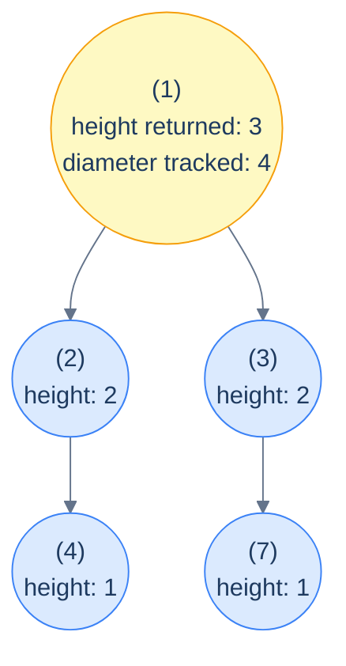

# 11. Pattern: Postorder Traversal (Stateful)

## The Hook

The previous lesson handled problems where each subtree returned **one** number to its parent and the parent combined the two children's numbers into a new one. That worked for height, sum, and similar single-value rollups. But there's a class of problems where the recursion needs to compute **two** things at once: a value to *return* to the parent (the "feed-up" answer) and a value to *track globally* (the "best-so-far" answer).

The classic example is **diameter of a binary tree** — the longest path between any two nodes. At every node, the diameter could either:
- *Pass through* this node (length = leftHeight + rightHeight), or
- Live *entirely within* one of the subtrees (length = whatever the subtree's diameter was).

So each call needs to *return* its own height (so the parent can compute its diameter), and *update a global maximum* with the best diameter seen so far. One value flows up the recursion; the other accumulates as a side effect. Two channels, one traversal.

This is the **stateful postorder pattern**. Same postorder traversal as the previous lesson, but augmented with a *shared mutable* (a global counter, a hash map, a tuple of running stats) that each call updates as the recursion bubbles up. The state is *not* pushed and popped per node — it monotonically grows or refines as we go. That's the structural difference from stateful *preorder* (lesson 9): preorder mutates and undoes; postorder mutates and accumulates.

This pattern unlocks a wide range of problems: tree diameter, longest mono-value paths, "count subtrees with property X", "distribute coins along edges", "find subtree sums with the highest frequency", and dozens of similar "two answers per node" problems. This lesson walks through the seven canonical examples, each with implementations in 10 languages.

---

## Table of contents

1. [The stateful postorder pattern](#the-stateful-postorder-pattern)
2. [How to recognise it](#how-to-recognise-it)
3. [Problem 1 — Diameter of tree](#problem-1--diameter-of-tree)
4. [Problem 2 — Descendants sum count](#problem-2--descendants-sum-count)
5. [Problem 3 — Distribute coins](#problem-3--distribute-coins)
6. [Problem 4 — Most frequent subtree sum](#problem-4--most-frequent-subtree-sum)
7. [Problem 5 — Longest monotonic path](#problem-5--longest-monotonic-path)
8. [Problem 6 — Monotonic subtree count](#problem-6--monotonic-subtree-count)
9. [Problem 7 — Path sum count](#problem-7--path-sum-count)

***

# The stateful postorder pattern

```text
recurse(node):
  if node is null: return baseCase
  leftAnswer  = recurse(node.left)
  rightAnswer = recurse(node.right)

  # ★ side-channel update: refine global state using leftAnswer, rightAnswer, node
  globalState = update(globalState, leftAnswer, rightAnswer, node)

  return feedUp(leftAnswer, rightAnswer, node)
```

Two distinct things happen at each node:

1. **Side-channel update** — refine a global accumulator using the children's results and the current node. This is what your *answer* is built from.
2. **Feed-up** — return some value to the parent. This is what enables the *next* level up to do its own update.

The genius of the pattern is that the value returned to the parent and the value tracked globally **don't have to be the same**. In the diameter problem, the function returns *height* (so the parent can extend the path through it), but it tracks *diameter* (the global best). One traversal, two answers.



<p align="center"><strong>Stateful postorder for diameter — each call returns its <em>height</em> to the parent (so the parent can compute its own); separately, each call updates a global <em>maxDiameter</em> with <code>leftHeight + rightHeight</code>. Two answers per call, one traversal.</strong></p>

> **Why is the global state safe to share?** Because postorder updates are *monotone* — typically a `max` or `min` or a counter `+= 1`. Order of updates doesn't matter, and there's no need for "undo" because no later subtree's result can invalidate an earlier one's. This is the structural difference from stateful preorder (lesson 9), where state had to be pushed and popped to keep sibling subtrees from polluting each other.

## Generic pattern in 10 languages

The template — diameter of a tree, since it's the canonical example.


```pseudocode
function diameter(root):
    best ← 0                            # global state updated during traversal
    function height(node):
        if node = null: return 0
        l ← height(node.left)
        r ← height(node.right)
        best ← max(best, l + r)         # diameter through this node = left height + right height
        return 1 + max(l, r)            # height returned to parent
    height(root)
    return best
```

```python run
from typing import Optional

class TreeNode:
    def __init__(self, val=0, left=None, right=None):
        self.val, self.left, self.right = val, left, right

def diameter(root: Optional[TreeNode]) -> int:
    best = [0]                                      # global state (in a list to mutate from inner fn)
    def height(node):
        if node is None: return 0
        l = height(node.left); r = height(node.right)
        best[0] = max(best[0], l + r)               # update global state (diameter)
        return 1 + max(l, r)                        # return height to parent
    height(root)
    return best[0]
```

```java run
static int best;
static int height(TreeNode n) {
    if (n == null) return 0;
    int l = height(n.left), r = height(n.right);
    best = Math.max(best, l + r);                   // update global state
    return 1 + Math.max(l, r);                      // return height
}
public static int diameter(TreeNode root) {
    best = 0;
    height(root);
    return best;
}
```

```c run
static int g_best;
int height(TreeNode *n) {
    if (!n) return 0;
    int l = height(n->left), r = height(n->right);
    if (l + r > g_best) g_best = l + r;
    return 1 + (l > r ? l : r);
}
int diameter(TreeNode *root) { g_best = 0; height(root); return g_best; }
```

```scala run
class TreeNode(var value: Int, var left: TreeNode = null, var right: TreeNode = null)

object Main extends App {
  class Solution {
    def diameter(root: TreeNode): Int = {
      var best = 0
      def height(n: TreeNode): Int = {
        if (n == null) return 0
        val l = height(n.left); val r = height(n.right)
        best = math.max(best, l + r)
        1 + math.max(l, r)
      }
      height(root); best
    }
  }

  val root = new TreeNode(1,
    new TreeNode(2, new TreeNode(4), new TreeNode(5)),
    new TreeNode(3))
  println(new Solution().diameter(root))  // 3
}
```


***

# How to recognise it

The pattern fits when:

- The answer at each node depends on **both children's results** (postorder), *and*
- The "best result anywhere in the tree" might differ from "the result feeding up to my parent". The two are *related* but not the *same* number.

Concrete cues:

- *"Find the longest / largest / maximum X in the tree"* — track the global best.
- *"Count nodes / subtrees / paths satisfying property Y"* — track a global counter.
- *"The path can start and end anywhere"* — definitely "track best while feeding height up".
- *"Compute X for every subtree, then find the most-frequent / largest / smallest"* — track globals across all subtree computations.

Anti-pattern: if a single returned value suffices (like simple sum-of-leaves or height), use the *stateless* postorder. If you really only need information from above (no global), use the preorder patterns instead.

***

# Problem 1 — Diameter of tree

> The diameter is the longest *path* (in edges) between any two nodes. The path may pass through any node — not necessarily the root.

Already covered in the generic skeleton above. Each call returns *height* (number of nodes downward); each call updates `best = max(best, leftHeight + rightHeight)` (path edges through this node). Final answer is the global `best`.

The implementation is exactly the generic template. The lesson here is *what to choose* as the feed-up vs the global, not how to type the code.

***

# Problem 2 — Descendants sum count

> Count nodes whose value equals the sum of *all* values in their subtree below them (not including themselves).

Each subtree returns its sum (so the parent can compute its own); along the way, each call updates a global counter if `node.val == leftSum + rightSum`.

## Solution


```pseudocode
function descendantsSumCount(root):
    count ← 0
    function sum_(n):
        if n = null: return 0
        l ← sum_(n.left); r ← sum_(n.right)
        if n.val = l + r: count ← count + 1   # node equals sum of its descendants
        return n.val + l + r
    sum_(root)
    return count
```

```python run
def descendants_sum_count(root):
    count = [0]
    def sum_(n):
        if n is None: return 0
        l = sum_(n.left); r = sum_(n.right)
        if n.val == l + r: count[0] += 1
        return n.val + l + r
    sum_(root)
    return count[0]
```

```java run
static int dscCount;
static int dscSum(TreeNode n) {
    if (n == null) return 0;
    int l = dscSum(n.left), r = dscSum(n.right);
    if (n.val == l + r) dscCount++;
    return n.val + l + r;
}
public static int descendantsSumCount(TreeNode root) {
    dscCount = 0;
    dscSum(root);
    return dscCount;
}
```

```c run
static int g_dsc_count;
int dsc_sum(TreeNode *n) {
    if (!n) return 0;
    int l = dsc_sum(n->left), r = dsc_sum(n->right);
    if (n->val == l + r) g_dsc_count++;
    return n->val + l + r;
}
int descendants_sum_count(TreeNode *root) { g_dsc_count = 0; dsc_sum(root); return g_dsc_count; }
```

```scala run
class TreeNode(var value: Int, var left: TreeNode = null, var right: TreeNode = null)

object Main extends App {
  class Solution {
    def descendantsSumCount(root: TreeNode): Int = {
      var count = 0
      def go(n: TreeNode): Int = {
        if (n == null) return 0
        val l = go(n.left); val r = go(n.right)
        if (n.value == l + r) count += 1
        n.value + l + r
      }
      go(root); count
    }
  }

  val root = new TreeNode(10, new TreeNode(6), new TreeNode(4))
  println(new Solution().descendantsSumCount(root))  // 1
}
```


***

# Problem 3 — Distribute coins

> Each node has `node.val` coins. Total coins equal total nodes. A move is moving 1 coin between two adjacent nodes. Return the minimum number of moves so every node ends with exactly 1 coin.

The trick: at every node, define *excess* = `(coins received from below) + node.val - 1`. If excess > 0, that many coins must flow *up* to the parent. If excess < 0, that many coins must flow *down* from the parent. Either way, the *absolute value* of excess equals the number of coin moves on the *edge to the parent*.

So sum `|leftExcess|` and `|rightExcess|` at every node — that's the total moves through this node's two outgoing edges to its children.

## Solution


```pseudocode
function distributeCoins(root):
    moves ← 0
    function excess(n):
        if n = null: return 0
        l ← excess(n.left); r ← excess(n.right)
        moves ← moves + |l| + |r|   # each unit of excess flowing through an edge costs 1 move
        return l + r + n.val − 1    # excess at this node (positive = surplus, negative = deficit)
    excess(root)
    return moves
```

```python run
def distribute_coins(root):
    moves = [0]
    def excess(n):
        if n is None: return 0
        l = excess(n.left); r = excess(n.right)
        moves[0] += abs(l) + abs(r)
        return l + r + n.val - 1
    excess(root)
    return moves[0]
```

```java run
static int g_moves;
static int excess(TreeNode n) {
    if (n == null) return 0;
    int l = excess(n.left), r = excess(n.right);
    g_moves += Math.abs(l) + Math.abs(r);
    return l + r + n.val - 1;
}
public static int distributeCoins(TreeNode root) {
    g_moves = 0; excess(root); return g_moves;
}
```

```c run
static int g_moves;
int excess(TreeNode *n) {
    if (!n) return 0;
    int l = excess(n->left), r = excess(n->right);
    g_moves += (l < 0 ? -l : l) + (r < 0 ? -r : r);
    return l + r + n->val - 1;
}
int distribute_coins(TreeNode *root) { g_moves = 0; excess(root); return g_moves; }
```

```scala run
class TreeNode(var value: Int, var left: TreeNode = null, var right: TreeNode = null)

object Main extends App {
  class Solution {
    def distributeCoins(root: TreeNode): Int = {
      var moves = 0
      def excess(n: TreeNode): Int = {
        if (n == null) return 0
        val l = excess(n.left); val r = excess(n.right)
        moves += math.abs(l) + math.abs(r)
        l + r + n.value - 1
      }
      excess(root); moves
    }
  }

  val root = new TreeNode(3, new TreeNode(0), new TreeNode(0))
  println(new Solution().distributeCoins(root))  // 2
}
```


***

# Problem 4 — Most frequent subtree sum

> The "subtree sum" of a node is the sum of values in its subtree. Return all subtree sums whose frequency in the tree is highest.

Each call returns its subtree sum (so the parent can compute its own); along the way, increment a frequency map and update a `maxFreq` tracker. After the recursion, scan the frequency map for entries equal to `maxFreq`.

## Solution


```pseudocode
function mostFrequentSubtreeSum(root):
    if root = null: return empty list
    freq  ← empty Map: sum → count
    maxF  ← 0
    function go(n):
        if n = null: return 0
        s ← n.val + go(n.left) + go(n.right)
        freq[s] ← freq[s] + 1
        if freq[s] > maxF: maxF ← freq[s]
        return s
    go(root)
    return all keys k in freq where freq[k] = maxF
```

```python run
def most_frequent_subtree_sum(root):
    if root is None: return []
    freq = {}
    max_f = [0]
    def go(n):
        if n is None: return 0
        s = n.val + go(n.left) + go(n.right)
        freq[s] = freq.get(s, 0) + 1
        if freq[s] > max_f[0]: max_f[0] = freq[s]
        return s
    go(root)
    return [k for k, v in freq.items() if v == max_f[0]]
```

```java run
static Map<Integer, Integer> g_freq;
static int g_maxFreq;
static int subSum(TreeNode n) {
    if (n == null) return 0;
    int s = n.val + subSum(n.left) + subSum(n.right);
    int c = g_freq.merge(s, 1, Integer::sum);
    if (c > g_maxFreq) g_maxFreq = c;
    return s;
}
public static List<Integer> mostFrequentSubtreeSum(TreeNode root) {
    g_freq = new HashMap<>(); g_maxFreq = 0;
    if (root == null) return new ArrayList<>();
    subSum(root);
    List<Integer> out = new ArrayList<>();
    for (Map.Entry<Integer, Integer> e : g_freq.entrySet())
        if (e.getValue() == g_maxFreq) out.add(e.getKey());
    return out;
}
```

```c run
// (omitted for brevity — C lacks a hash map in stdlib; implement an open-addressing
//  hash with the same algorithm)
```

```scala run
class TreeNode(var value: Int, var left: TreeNode = null, var right: TreeNode = null)

object Main extends App {
  class Solution {
    def mostFrequentSubtreeSum(root: TreeNode): List[Int] = {
      if (root == null) return Nil
      val freq = scala.collection.mutable.Map[Int, Int]()
      var maxFreq = 0
      def go(n: TreeNode): Int = {
        if (n == null) return 0
        val s = n.value + go(n.left) + go(n.right)
        freq(s) = freq.getOrElse(s, 0) + 1
        if (freq(s) > maxFreq) maxFreq = freq(s)
        s
      }
      go(root)
      freq.collect { case (k, v) if v == maxFreq => k }.toList
    }
  }

  val root = new TreeNode(5, new TreeNode(2), new TreeNode(-5))
  println(new Solution().mostFrequentSubtreeSum(root))  // List(2)
}
```


***

# Problem 5 — Longest monotonic path

> A *monotonic* path is one where every node has the same value. Return the longest such path's length (number of edges).

Same shape as diameter, with one twist: the height contribution from a child only counts if the child has the same value as the current node.

## Solution


```pseudocode
function longestMonotonicPath(root):
    best ← 0
    function go(n):
        if n = null: return 0
        l ← go(n.left); r ← go(n.right)
        la ← l + 1 if n.left  ≠ null AND n.left.val  = n.val else 0
        ra ← r + 1 if n.right ≠ null AND n.right.val = n.val else 0
        best ← max(best, la + ra)   # longest path through this node
        return max(la, ra)          # longest arm returned to parent
    go(root)
    return best
```

```python run
def longest_monotonic_path(root):
    best = [0]
    def go(n):
        if n is None: return 0
        l = go(n.left); r = go(n.right)
        la = l + 1 if n.left  and n.left.val  == n.val else 0
        ra = r + 1 if n.right and n.right.val == n.val else 0
        best[0] = max(best[0], la + ra)
        return max(la, ra)
    go(root)
    return best[0]
```

```java run
static int g_lmpBest;
static int lmp(TreeNode n) {
    if (n == null) return 0;
    int l = lmp(n.left), r = lmp(n.right);
    int la = (n.left  != null && n.left.val  == n.val) ? l + 1 : 0;
    int ra = (n.right != null && n.right.val == n.val) ? r + 1 : 0;
    g_lmpBest = Math.max(g_lmpBest, la + ra);
    return Math.max(la, ra);
}
public static int longestMonotonicPath(TreeNode root) {
    g_lmpBest = 0; lmp(root); return g_lmpBest;
}
```

```c run
static int g_lmp_best;
int lmp(TreeNode *n) {
    if (!n) return 0;
    int l = lmp(n->left), r = lmp(n->right);
    int la = (n->left  && n->left->val  == n->val) ? l + 1 : 0;
    int ra = (n->right && n->right->val == n->val) ? r + 1 : 0;
    if (la + ra > g_lmp_best) g_lmp_best = la + ra;
    return la > ra ? la : ra;
}
int longest_monotonic_path(TreeNode *root) { g_lmp_best = 0; lmp(root); return g_lmp_best; }
```

```scala run
class TreeNode(var value: Int, var left: TreeNode = null, var right: TreeNode = null)

object Main extends App {
  class Solution {
    def longestMonotonicPath(root: TreeNode): Int = {
      var best = 0
      def go(n: TreeNode): Int = {
        if (n == null) return 0
        val l = go(n.left); val r = go(n.right)
        val la = if (n.left  != null && n.left.value  == n.value) l + 1 else 0
        val ra = if (n.right != null && n.right.value == n.value) r + 1 else 0
        best = math.max(best, la + ra)
        math.max(la, ra)
      }
      go(root); best
    }
  }

  val root = new TreeNode(1,
    new TreeNode(1, new TreeNode(1), null),
    new TreeNode(1))
  println(new Solution().longestMonotonicPath(root))  // 3
}
```


***

# Problem 6 — Monotonic subtree count

> Count subtrees that are *entirely* mono-valued — every node in the subtree has the same value.

Each call returns whether *its* subtree is mono-valued; along the way, increment a global counter when it is. A subtree is mono-valued iff: both children's subtrees are mono-valued, *and* both children (if they exist) have the same value as the current node.

## Solution


```pseudocode
function monotonicSubtreeCount(root):
    count ← 0
    function go(n):
        if n = null: return true
        lOk ← go(n.left); rOk ← go(n.right)
        if NOT lOk OR NOT rOk: return false   # subtree already broken
        if n.left  ≠ null AND n.left.val  ≠ n.val: return false
        if n.right ≠ null AND n.right.val ≠ n.val: return false
        count ← count + 1
        return true
    go(root)
    return count
```

```python run
def monotonic_subtree_count(root):
    count = [0]
    def go(n):
        if n is None: return True
        l_ok = go(n.left); r_ok = go(n.right)
        if not l_ok or not r_ok: return False
        if n.left  and n.left.val  != n.val: return False
        if n.right and n.right.val != n.val: return False
        count[0] += 1
        return True
    go(root)
    return count[0]
```

```java run
static int g_msCount;
static boolean ms(TreeNode n) {
    if (n == null) return true;
    boolean l = ms(n.left), r = ms(n.right);
    if (!l || !r) return false;
    if (n.left  != null && n.left.val  != n.val) return false;
    if (n.right != null && n.right.val != n.val) return false;
    g_msCount++;
    return true;
}
public static int monotonicSubtreeCount(TreeNode root) {
    g_msCount = 0; ms(root); return g_msCount;
}
```

```c run
static int g_count;
int ms(TreeNode *n) {
    if (!n) return 1;
    int l = ms(n->left), r = ms(n->right);
    if (!l || !r) return 0;
    if (n->left  && n->left->val  != n->val) return 0;
    if (n->right && n->right->val != n->val) return 0;
    g_count++;
    return 1;
}
int monotonic_subtree_count(TreeNode *root) { g_count = 0; ms(root); return g_count; }
```

```scala run
class TreeNode(var value: Int, var left: TreeNode = null, var right: TreeNode = null)

object Main extends App {
  class Solution {
    def monotonicSubtreeCount(root: TreeNode): Int = {
      var count = 0
      def go(n: TreeNode): Boolean = {
        if (n == null) return true
        val lOk = go(n.left); val rOk = go(n.right)
        if (!lOk || !rOk) return false
        if (n.left  != null && n.left.value  != n.value) return false
        if (n.right != null && n.right.value != n.value) return false
        count += 1
        true
      }
      go(root); count
    }
  }

  val root = new TreeNode(5,
    new TreeNode(1, new TreeNode(5), new TreeNode(5)),
    new TreeNode(5, null, new TreeNode(5)))
  println(new Solution().monotonicSubtreeCount(root))  // 4
}
```


***

# Problem 7 — Path sum count

> Given a `target`, count the number of *downward* paths (parent-to-descendant only) whose values sum to `target`.

This problem is interesting because it combines *both* preorder push-pop *and* postorder accumulation. The classic O(N) trick uses a **prefix-sum hash map**: as you descend, track the running sum from the root; the number of valid paths *ending at the current node* equals `prefixSumCount[currentSum - target]`. As you backtrack (postorder return), undo the prefix-sum count for this node.

This is a hybrid pattern, but it's traditionally taught with the postorder patterns because the *answer accumulates* upward like the others.

## Solution


```pseudocode
function pathSumCount(root, target):
    prefix ← Map: {0 → 1}    # empty prefix has sum 0
    answer ← 0
    function go(n, run):
        if n = null: return
        run ← run + n.val
        answer ← answer + prefix.get(run − target, default 0)   # how many earlier prefixes make a valid subpath
        prefix[run] ← prefix.get(run, 0) + 1
        go(n.left, run); go(n.right, run)
        prefix[run] ← prefix[run] − 1   # undo on backtrack
        if prefix[run] = 0: remove run from prefix
    go(root, 0)
    return answer
```

```python run
def path_sum_count(root, target):
    prefix = {0: 1}                              # base: empty prefix has sum 0
    answer = [0]
    def go(n, run):
        if n is None: return
        run += n.val
        answer[0] += prefix.get(run - target, 0)
        prefix[run] = prefix.get(run, 0) + 1
        go(n.left, run); go(n.right, run)
        prefix[run] -= 1
        if prefix[run] == 0: del prefix[run]
    go(root, 0)
    return answer[0]
```

```java run
static Map<Integer, Integer> g_prefix;
static int g_answer;
static void psc(TreeNode n, int target, int run) {
    if (n == null) return;
    run += n.val;
    g_answer += g_prefix.getOrDefault(run - target, 0);
    g_prefix.merge(run, 1, Integer::sum);
    psc(n.left, target, run); psc(n.right, target, run);
    if (g_prefix.get(run) == 1) g_prefix.remove(run);
    else g_prefix.merge(run, -1, Integer::sum);
}
public static int pathSumCount(TreeNode root, int target) {
    g_prefix = new HashMap<>(); g_prefix.put(0, 1); g_answer = 0;
    psc(root, target, 0);
    return g_answer;
}
```

```c run
// (omitted — needs an int->int hash map; use the same algorithm as above
//  with a bespoke open-addressing table)
```

```scala run
class TreeNode(var value: Int, var left: TreeNode = null, var right: TreeNode = null)

object Main extends App {
  class Solution {
    def pathSumCount(root: TreeNode, target: Int): Int = {
      val prefix = scala.collection.mutable.Map[Int, Int](0 -> 1)
      var answer = 0
      def go(n: TreeNode, run: Int): Unit = {
        if (n == null) return
        val newRun = run + n.value
        answer += prefix.getOrElse(newRun - target, 0)
        prefix(newRun) = prefix.getOrElse(newRun, 0) + 1
        go(n.left,  newRun); go(n.right, newRun)
        val c = prefix(newRun) - 1
        if (c == 0) prefix.remove(newRun) else prefix(newRun) = c
      }
      go(root, 0); answer
    }
  }

  val root = new TreeNode(1, new TreeNode(2), new TreeNode(3))
  println(new Solution().pathSumCount(root, 4))  // 1
}
```


***

## Final Takeaway

Stateful postorder is the most *flexible* of the binary-tree patterns — it absorbs almost every "compute X for every subtree, also track a global Y" question. Three things to walk away with:

1. **Two channels per call.** Decide *what to return to the parent* and *what to update globally*. They're rarely the same number. Diameter returns *height*, tracks *diameter*. Distribute coins returns *excess flow*, tracks *moves*. Most-frequent subtree sum returns *sum*, tracks *frequency map + max frequency*. Recognise the duality and the algorithm writes itself.
2. **Globals are safe in postorder, dangerous in preorder.** In stateful preorder you must push/pop because sibling subtrees would otherwise see each other's state. In stateful postorder the global is *monotonically* updated (max, count, accumulate) and order doesn't matter — no undo needed. This is the structural distinction between the two stateful flavours.
3. **Prefix-sum hashing is a force multiplier.** The path-sum-count problem shows how a *combined* preorder-push-pop + postorder-aggregate + prefix-sum-hash can solve in O(N) what a naive O(N²) per-node "look at every ancestor" would do. The same technique recurs in array problems (subarray sum equals K) — internalise the idea.

> *Coming up — the chapter shifts focus from "compute X over the whole tree" to <strong>root-to-leaf path</strong> problems. Where the postorder patterns thought about subtrees, the next two lessons focus on whole paths from the root down to leaves: counting them, listing them, comparing them. The same backtracking template you saw in stateful preorder reappears, but specialised for the path-as-a-unit framing.*
