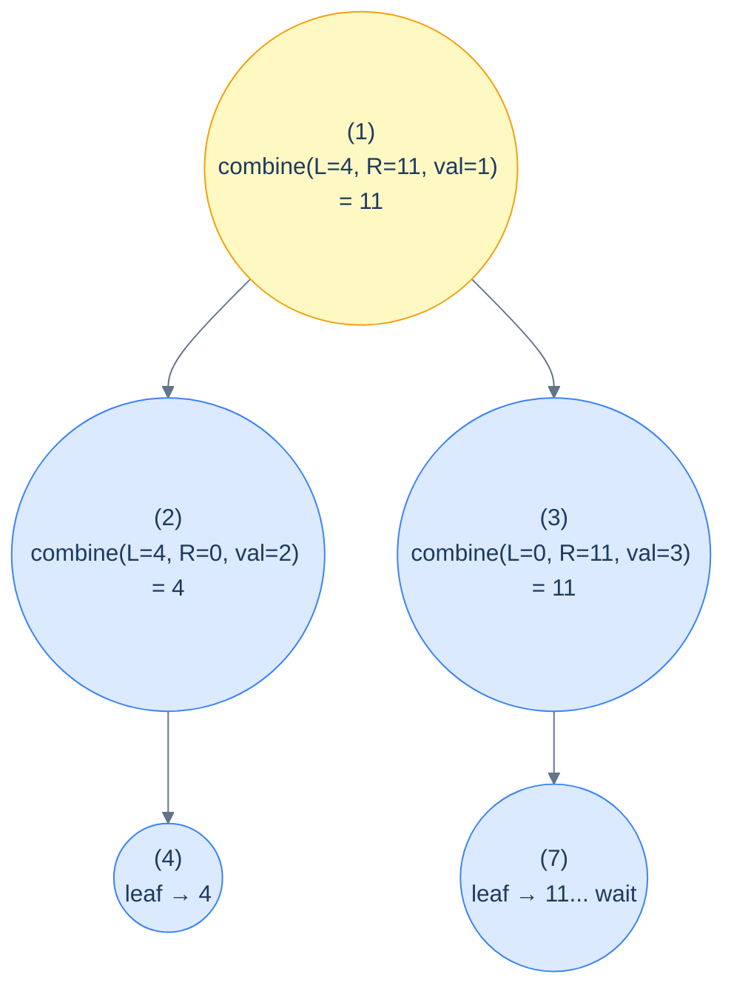

# The stateless postorder pattern

```text
postorder(node):
  if node is null: return baseCase                  # e.g. 0, -1, true, infinity
  leftAnswer  = postorder(node.left)
  rightAnswer = postorder(node.right)
  return combine(leftAnswer, rightAnswer, node.val) # the recurrence
```

The shape is identical for every postorder-stateless problem; only the `baseCase` and the `combine` change. Pick those two correctly and the entire algorithm writes itself.

> 🖼 Diagram — Postorder data flow for max root-to-leaf path sum — leaves return their own value; each internal node returns val + max(L, R); the root ends up with the answer. The arrows that go down are recursive calls; the values that come up are the returns. (Note: in the example, leaf 7 returns its own value 7, not 11; the node's own value adds at the parent.)


<p align="center"><strong>Postorder data flow for max root-to-leaf path sum — leaves return their own value; each internal node returns <code>val + max(L, R)</code>; the root ends up with the answer. The arrows that <em>go down</em> are recursive calls; the values that <em>come up</em> are the returns. (Note: in the example, leaf 7 returns its own value 7, not 11; the node's own value adds at the parent.)</strong></p>

> **Why "stateless"?** No mutable state escapes a stack frame. Each call computes its return value purely from its children's return values and the local node — like a functional fold over the tree. Two calls on the same subtree would return the same thing; there's no global accumulator that could give different answers depending on visit order.

## Generic pattern

Below is a "sum of all node values" template — illustrative; substitute the right base case and combine for your problem.


```python run
from typing import Optional

class TreeNode:
    def __init__(self, val=0, left=None, right=None):
        self.val, self.left, self.right = val, left, right

def stateless_postorder(node: Optional[TreeNode]) -> int:
    if node is None: return 0                      # base case
    left  = stateless_postorder(node.left)
    right = stateless_postorder(node.right)
    return left + right + node.val                 # combine
```

```java run
static int statelessPostorder(TreeNode node) {
    if (node == null) return 0;
    int left  = statelessPostorder(node.left);
    int right = statelessPostorder(node.right);
    return left + right + node.val;
}
```


## Complexity

> **Time:** O(N) — each node visited once. **Space:** O(h) for the recursion stack.

# How to recognise it

The pattern fits when:

- The answer for any subtree can be **computed solely from the answers of its two subtrees** (and the current node's own value).
- The whole-tree answer is the answer at the root.

Concrete cues:

- *"Find the height / depth / size of the tree"* — recurrence on subtree heights/sizes.
- *"Sum / max / min over all nodes / leaves / paths"* — fold over the tree.
- *"Is the tree balanced / full / perfect / a BST?"* — structural validation, both subtrees must satisfy a property *and* the current node fits.
- *"Compute X for every subtree"* — same shape, just record the answer at every node.

Anti-pattern: if the answer depends on the *path from the root* to a node (info from above), use a preorder pattern instead. If sibling subtrees need to report multiple values back (e.g., "the longest path through this node, plus the longest path entirely within this subtree"), you want the *stateful* postorder pattern (next lesson).

<!-- ============================================== -->
<!-- SWEEP 2 — missing sections (placeholders only) -->
<!-- ============================================== -->

<!-- TODO: Understanding the Pattern — missing, needs to be written -->
<!--       Guidance: umbrella H2 with the subsections below -->

<!-- TODO: Why Naive Isn't Enough — missing, needs to be written -->
<!--       Guidance: motivation for why the obvious approach fails -->

<!-- TODO: The Core Idea — missing, needs to be written -->
<!--       Guidance: one paragraph: the central trick -->

<!-- TODO: How the Pointers/Window Move — missing, needs to be written -->
<!--       Guidance: mechanics of the moving parts -->

<!-- TODO: The Generic Algorithm — missing, needs to be written -->
<!--       Guidance: numbered steps, no code -->

<!-- TODO: Generic Implementation — missing, needs to be written -->
<!--       Guidance: Python block + Java block of the skeleton -->

<!-- TODO: Complexity Analysis — missing, needs to be written -->
<!--       Guidance: table -->

<!-- TODO: Variants / Taxonomy — missing, needs to be written -->
<!--       Guidance: enumerate sub-shapes of this pattern -->

<!-- TODO: Identifying — missing, needs to be written -->
<!--       Guidance: per-variant: recognition checklist + canonical example -->

<!-- TODO: Recognition Checklist — missing, needs to be written -->
<!--       Guidance: 4-question diagnostic — the source of the Problem-section Diagnostic Questions -->

<!-- TODO: Canonical Example — missing, needs to be written -->
<!--       Guidance: fully worked example: brute force → optimised → template fit -->

<!-- TODO: Problems in This Category — missing, needs to be written -->
<!--       Guidance: table with links to the 02-problems/ files -->
