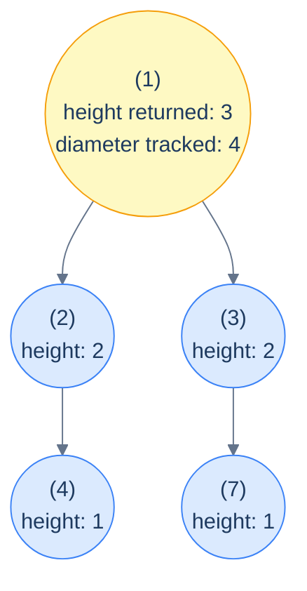

# The stateful postorder pattern

```text
recurse(node):
  if node is null: return baseCase
  leftAnswer  = recurse(node.left)
  rightAnswer = recurse(node.right)

  # ★ side-channel update: refine global state using leftAnswer, rightAnswer, node
  globalState = update(globalState, leftAnswer, rightAnswer, node)

  return feedUp(leftAnswer, rightAnswer, node)
```

Two distinct things happen at each node:

1. **Side-channel update** — refine a global accumulator using the children's results and the current node. This is what your *answer* is built from.
2. **Feed-up** — return some value to the parent. This is what enables the *next* level up to do its own update.

The genius of the pattern is that the value returned to the parent and the value tracked globally **don't have to be the same**. In the diameter problem, the function returns *height* (so the parent can extend the path through it), but it tracks *diameter* (the global best). One traversal, two answers.

> 🖼 Diagram — Stateful postorder for diameter — each call returns its height to the parent (so the parent can compute its own); separately, each call updates a global maxDiameter with leftHeight + rightHeight. Two answers per call, one traversal.


<p align="center"><strong>Stateful postorder for diameter — each call returns its <em>height</em> to the parent (so the parent can compute its own); separately, each call updates a global <em>maxDiameter</em> with <code>leftHeight + rightHeight</code>. Two answers per call, one traversal.</strong></p>

> **Why is the global state safe to share?** Because postorder updates are *monotone* — typically a `max` or `min` or a counter `+= 1`. Order of updates doesn't matter, and there's no need for "undo" because no later subtree's result can invalidate an earlier one's. This is the structural difference from stateful preorder (lesson 9), where state had to be pushed and popped to keep sibling subtrees from polluting each other.

## Generic pattern

The template — diameter of a tree, since it's the canonical example.


```python run viz=binary-tree viz-root=root
from typing import Optional

class TreeNode:
    def __init__(self, val=0, left=None, right=None):
        self.val, self.left, self.right = val, left, right

def diameter(root: Optional[TreeNode]) -> int:
    best = [0]                                      # global state (in a list to mutate from inner fn)
    def height(node):
        if node is None: return 0
        l = height(node.left); r = height(node.right)
        best[0] = max(best[0], l + r)               # update global state (diameter)
        return 1 + max(l, r)                        # return height to parent
    height(root)
    return best[0]
```

```java run viz=binary-tree viz-root=root
static int best;
static int height(TreeNode n) {
    if (n == null) return 0;
    int l = height(n.left), r = height(n.right);
    best = Math.max(best, l + r);                   // update global state
    return 1 + Math.max(l, r);                      // return height
}
public static int diameter(TreeNode root) {
    best = 0;
    height(root);
    return best;
}
```

# How to recognise it

The pattern fits when:

- The answer at each node depends on **both children's results** (postorder), *and*
- The "best result anywhere in the tree" might differ from "the result feeding up to my parent". The two are *related* but not the *same* number.

Concrete cues:

- *"Find the longest / largest / maximum X in the tree"* — track the global best.
- *"Count nodes / subtrees / paths satisfying property Y"* — track a global counter.
- *"The path can start and end anywhere"* — definitely "track best while feeding height up".
- *"Compute X for every subtree, then find the most-frequent / largest / smallest"* — track globals across all subtree computations.

Anti-pattern: if a single returned value suffices (like simple sum-of-leaves or height), use the *stateless* postorder. If you really only need information from above (no global), use the preorder patterns instead.

<!-- ============================================== -->
<!-- SWEEP 2 — missing sections (placeholders only) -->
<!-- ============================================== -->

<!-- TODO: Understanding the Pattern — missing, needs to be written -->
<!--       Guidance: umbrella H2 with the subsections below -->

<!-- TODO: Why Naive Isn't Enough — missing, needs to be written -->
<!--       Guidance: motivation for why the obvious approach fails -->

<!-- TODO: The Core Idea — missing, needs to be written -->
<!--       Guidance: one paragraph: the central trick -->

<!-- TODO: How the Pointers/Window Move — missing, needs to be written -->
<!--       Guidance: mechanics of the moving parts -->

<!-- TODO: The Generic Algorithm — missing, needs to be written -->
<!--       Guidance: numbered steps, no code -->

<!-- TODO: Generic Implementation — missing, needs to be written -->
<!--       Guidance: Python block + Java block of the skeleton -->

<!-- TODO: Complexity Analysis — missing, needs to be written -->
<!--       Guidance: table -->

<!-- TODO: Variants / Taxonomy — missing, needs to be written -->
<!--       Guidance: enumerate sub-shapes of this pattern -->

<!-- TODO: Identifying — missing, needs to be written -->
<!--       Guidance: per-variant: recognition checklist + canonical example -->

<!-- TODO: Recognition Checklist — missing, needs to be written -->
<!--       Guidance: 4-question diagnostic — the source of the Problem-section Diagnostic Questions -->

<!-- TODO: Canonical Example — missing, needs to be written -->
<!--       Guidance: fully worked example: brute force → optimised → template fit -->

<!-- TODO: Problems in This Category — missing, needs to be written -->
<!--       Guidance: table with links to the 02-problems/ files -->
