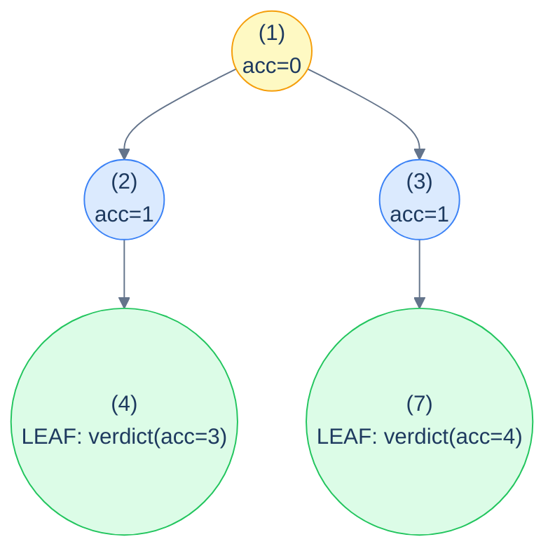
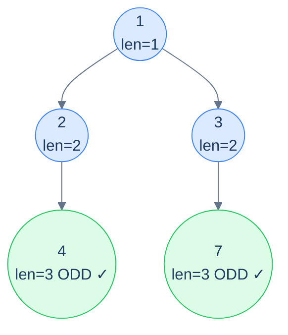

# 12. Pattern: Root-to-Leaf Path (Stateless)

## The Hook

The previous patterns all asked questions about *individual nodes*. The preorder ones gave each node info about its ancestors; the postorder ones gave each node info about its descendants. This lesson zooms out one more level — the **whole root-to-leaf path** is the unit of interest.

A root-to-leaf path is exactly what it sounds like: the sequence of nodes from the root, walking child references, ending at a leaf. Every leaf defines exactly one such path. *"Does any root-to-leaf path sum to N?"* — yes if and only if at least one leaf can be reached with an accumulator that ends up at N. *"How many root-to-leaf paths have an odd length?"* — count the leaves whose path-length is odd. *"Is there a path where every node is even?"* — does a leaf exist whose path was all-even on the way down?

Each of these problems is the *same recipe*: the **accumulator descends preorder-style** from the root, the **answer is decided at leaves** (where the path completes), and **internal nodes combine the children's answers postorder-style**. It's a hybrid of preorder and postorder, written as a single recursive function.

The "stateless" qualifier carries the same meaning as before — the accumulator is a small immutable value (a number, a flag, a count) that's *passed down* the recursion by parameter. No mutable shared state. The recursive shape is unmistakably similar to what you've already seen, but the *interpretation* shifts: each leaf says "here's my path's verdict", and the OR / + / max combiner up the tree decides what the answer for the *whole* tree is.

This lesson sets up the recipe and walks through four canonical problems — *path sum exists*, *binary summation of leaf paths*, *all-even path exists*, and *count of odd-length paths*. Each gets a clean implementation in Python and Java.

---

## Table of contents

1. [The stateless root-to-leaf path pattern](#the-stateless-root-to-leaf-path-pattern)
2. [How to recognise it](#how-to-recognise-it)
3. [Problem 1 — Root to leaf path (sum check)](#problem-1--root-to-leaf-path-sum-check)
4. [Problem 2 — Binary summation of tree](#problem-2--binary-summation-of-tree)
5. [Problem 3 — Even path](#problem-3--even-path)
6. [Problem 4 — Odd count](#problem-4--odd-count)

***

# The stateless root-to-leaf path pattern

```text
recurse(node, accumulator):
  if node is null: return identity            # propagate "no path here"
  newAcc = update(accumulator, node)
  if node is a leaf:                          # path is complete
    return verdict(newAcc)
  leftAnswer  = recurse(node.left,  newAcc)
  rightAnswer = recurse(node.right, newAcc)
  return combine(leftAnswer, rightAnswer)
```

Three pieces to specialise:

1. **`update`** — how the accumulator changes as we descend through the current node (preorder-style).
2. **`verdict`** — at a leaf, what's the answer for *this* root-to-leaf path?
3. **`combine`** — how to combine two children's answers into one parent answer (postorder-style). Common combinators: `OR` for "any path satisfies …", `+` for "count / sum across paths", `max` for "best path".

The *identity* in the base case is whatever value makes `combine` ignore the empty subtree — `false` for OR, `0` for sum, `-∞` for max.



<p align="center"><strong>Stateless root-to-leaf path pattern — accumulator <strong>descends</strong> with updates from each node; leaves <strong>emit</strong> their per-path verdict; internal nodes <strong>combine</strong> their children's verdicts back up. It's preorder going down + postorder coming up, fused into one recursion.</strong></p>

> *Predict before reading on — what's the difference between this pattern and the stateless preorder pattern from lesson 8?*
>
> Stateless preorder *processes every node* — the answer is whatever each node computes from its ancestor chain. Root-to-leaf-path *only emits an answer at leaves* — the answer for an internal node is combined from its descendants' leaf-emissions. They share the "accumulator down" mechanic but differ in *where* the answer is born and how it propagates back up.

## Generic pattern

We'll show "does any root-to-leaf path sum to target?" as the canonical generic example.


```python run
from typing import Optional

class TreeNode:
    def __init__(self, val=0, left=None, right=None):
        self.val, self.left, self.right = val, left, right

def has_path_sum(root: Optional[TreeNode], target: int) -> bool:
    def go(n, remaining):
        if n is None: return False                     # identity for OR
        remaining -= n.val
        if n.left is None and n.right is None:         # leaf
            return remaining == 0                      # verdict
        return go(n.left, remaining) or go(n.right, remaining)
    return go(root, target)
```

```java run
public static boolean hasPathSum(TreeNode root, int target) {
    if (root == null) return false;
    target -= root.val;
    if (root.left == null && root.right == null) return target == 0;
    return hasPathSum(root.left, target) || hasPathSum(root.right, target);
}
```


## Complexity

> **Time:** O(N). **Space:** O(h) for recursion.

***

# How to recognise it

The pattern fits when:

- The unit of interest is a **complete root-to-leaf path** (not an arbitrary path inside the tree).
- The check at each leaf depends on info accumulated *along the way down* (path sum, parity status, depth, concatenated value).
- The whole-tree answer combines per-leaf verdicts via `OR` (does any path …), `AND` (do all paths …), `+` (count / sum), or `max` / `min` (best path).

Concrete cues:

- *"Does any root-to-leaf path …"* → `OR` combiner.
- *"Do all root-to-leaf paths …"* → `AND` combiner.
- *"Count root-to-leaf paths where …"* → `+` combiner.
- *"What's the max / min root-to-leaf path …"* → `max` / `min` combiner.

Anti-pattern: if the path can start or end *anywhere* (not just root and leaf), this isn't the right pattern — use the postorder stateful one (diameter, longest monotonic) instead. If the answer needs the *list of nodes* in each path (not just an aggregate), use the *stateful* root-to-leaf-path pattern (next lesson).

***

# Problem 1 — Root to leaf path (sum check)

> Return `true` if there exists at least one root-to-leaf path whose node values sum to `target`.

Already covered in the generic skeleton. The accumulator is the *remaining target after subtracting nodes seen*; the verdict at a leaf is *"is remaining exactly 0?"*; the combine is `OR`.

The implementation is exactly the generic template — see the code block above.

***

# Problem 2 — Binary summation of tree

> Each node's value is `0` or `1`. Each root-to-leaf path is a binary number (most significant bit at root). Return the sum of these binary numbers, in decimal.
>
> **Example:** `[1, 0, 1, 1, null, null, 1]` → paths `[1,0,1,1]=11(₂)=11(₁₀)`... wait, the example output is 12. Let me recompute. The tree:
> ```
>     1
>    / \
>   0   1
>  / \   \
> 1       1
> ```
> Paths from root to leaves:
> - `1 → 0 → 1` = binary `101` = 5
> - `1 → 1 → 1` = binary `111` = 7
>
> Sum = 5 + 7 = **12**.

The accumulator is the *binary number so far* — at each node, shift left and OR in the current bit (`acc = (acc << 1) | node.val`). At a leaf, *return the accumulator itself*. Internal nodes sum their children.

<details>
<summary><h2>Solution</h2></summary>


```python run
from typing import Optional


class TreeNode:
    def __init__(self, val=0, left=None, right=None):
        self.val = val
        self.left = left
        self.right = right


def from_level_order(values):
    """Build tree from list like [1, 2, 3, None, 4]. None means missing child."""
    if not values:
        return None
    root = TreeNode(values[0])
    queue = [root]
    i = 1
    while queue and i < len(values):
        node = queue.pop(0)
        if i < len(values) and values[i] is not None:
            node.left = TreeNode(values[i])
            queue.append(node.left)
        i += 1
        if i < len(values) and values[i] is not None:
            node.right = TreeNode(values[i])
            queue.append(node.right)
        i += 1
    return root


class Solution:
    def binary_summation_of_tree_helper(
        self, root: Optional[TreeNode], current_sum: int
    ) -> int:
        if not root:
            return 0

        # Update the current sum by shifting left and adding current
        # node's value
        current_sum = (current_sum << 1) | root.val

        # If it's a leaf node, return the current sum
        if not root.left and not root.right:
            return current_sum

        # Recursively sum up the left and right subtrees
        left_sum = self.binary_summation_of_tree_helper(
            root.left, current_sum
        )
        right_sum = self.binary_summation_of_tree_helper(
            root.right, current_sum
        )

        # Return the total sum from both left and right subtrees
        return left_sum + right_sum

    def binary_summation_of_tree(self, root: Optional[TreeNode]) -> int:

        # Start binary_summation_of_tree_helper with current_sum = 0
        return self.binary_summation_of_tree_helper(root, 0)


# Examples from the problem statement
print(Solution().binary_summation_of_tree(from_level_order([1, 0, 1, 1, None, None, 1])))   # 12
print(Solution().binary_summation_of_tree(from_level_order([0, 1, 0, None, None, 1, 0])))   # 2

# Edge cases
print(Solution().binary_summation_of_tree(None))                                              # 0
print(Solution().binary_summation_of_tree(from_level_order([1])))                             # 1
print(Solution().binary_summation_of_tree(from_level_order([0])))                             # 0
print(Solution().binary_summation_of_tree(from_level_order([1, 1])))                          # 3 (11=3)
print(Solution().binary_summation_of_tree(from_level_order([1, 0, 0])))                       # 4 (10 + 10 = 2+2=4)
print(Solution().binary_summation_of_tree(from_level_order([1, 1, 1, 0, 1, 0, 1])))          # 22 (110+111+101+111... = 6+7+5+7...)
```

```java run
import java.util.*;

public class Main {
    static class TreeNode {
        int val;
        TreeNode left;
        TreeNode right;
        TreeNode() {}
        TreeNode(int val) { this.val = val; }
    }

    static TreeNode fromLevelOrder(Integer... values) {
        if (values.length == 0 || values[0] == null) return null;
        TreeNode root = new TreeNode(values[0]);
        java.util.Deque<TreeNode> queue = new java.util.ArrayDeque<>();
        queue.add(root);
        int i = 1;
        while (!queue.isEmpty() && i < values.length) {
            TreeNode node = queue.poll();
            if (i < values.length && values[i] != null) {
                node.left = new TreeNode(values[i]);
                queue.add(node.left);
            }
            i++;
            if (i < values.length && values[i] != null) {
                node.right = new TreeNode(values[i]);
                queue.add(node.right);
            }
            i++;
        }
        return root;
    }

    static class Solution {
        private int binarySummationOfTreeHelper(
            TreeNode root,
            int currentSum
        ) {
            if (root == null) {
                return 0;
            }

            // Update the current sum by shifting left and adding current
            // node's value
            currentSum = (currentSum << 1) | root.val;

            // If it's a leaf node, return the current sum
            if (root.left == null && root.right == null) {
                return currentSum;
            }

            // Recursively sum up the left and right subtrees
            int leftSum = binarySummationOfTreeHelper(root.left, currentSum);
            int rightSum = binarySummationOfTreeHelper(
                root.right,
                currentSum
            );

            // Return the total sum from both left and right subtrees
            return leftSum + rightSum;
        }

        public int binarySummationOfTree(TreeNode root) {

            // Start binarySummationOfTreeHelper with currentSum = 0
            return binarySummationOfTreeHelper(root, 0);
        }
    }

    public static void main(String[] args) {
        // Examples from the problem statement
        System.out.println(new Solution().binarySummationOfTree(fromLevelOrder(1, 0, 1, 1, null, null, 1)));   // 12
        System.out.println(new Solution().binarySummationOfTree(fromLevelOrder(0, 1, 0, null, null, 1, 0)));   // 2

        // Edge cases
        System.out.println(new Solution().binarySummationOfTree(null));                                         // 0
        System.out.println(new Solution().binarySummationOfTree(fromLevelOrder(1)));                            // 1
        System.out.println(new Solution().binarySummationOfTree(fromLevelOrder(0)));                            // 0
        System.out.println(new Solution().binarySummationOfTree(fromLevelOrder(1, 1)));                         // 3
        System.out.println(new Solution().binarySummationOfTree(fromLevelOrder(1, 0, 0)));                      // 4
    }
}
```

</details>


***

# Problem 3 — Even path

> Return `true` if there's at least one root-to-leaf path where *every* value is even.

The accumulator is a *boolean*: "has the path so far been all-even?". Update at each node: `still_even = previously_even AND (current is even)`. At a leaf, return `still_even`. Combine with OR.

<details>
<summary><h2>Solution</h2></summary>


```python run
from typing import Optional


class TreeNode:
    def __init__(self, val=0, left=None, right=None):
        self.val = val
        self.left = left
        self.right = right


def from_level_order(values):
    """Build tree from list like [1, 2, 3, None, 4]. None means missing child."""
    if not values:
        return None
    root = TreeNode(values[0])
    queue = [root]
    i = 1
    while queue and i < len(values):
        node = queue.pop(0)
        if i < len(values) and values[i] is not None:
            node.left = TreeNode(values[i])
            queue.append(node.left)
        i += 1
        if i < len(values) and values[i] is not None:
            node.right = TreeNode(values[i])
            queue.append(node.right)
        i += 1
    return root


class Solution:
    def even_path_helper(
        self, root: Optional[TreeNode], even_so_far: int
    ) -> bool:

        # Base case: if the current node is null, return false
        if root is None:
            return False

        # Update current path status: 1 if path so far is all even and
        # current node is even
        current_status = even_so_far and (root.val % 2 == 0)

        # If this is a leaf, check if current path is valid
        if root.left is None and root.right is None:
            return current_status

        # Check left and right subtrees for valid paths
        left_path = self.even_path_helper(root.left, current_status)
        right_path = self.even_path_helper(root.right, current_status)

        return left_path or right_path

    def even_path(self, root: Optional[TreeNode]) -> bool:
        if root is None:
            return False

        # Root path is valid if root is even
        return self.even_path_helper(root, 1)


# Examples from the problem statement
print(Solution().even_path(from_level_order([2, 4, 6, 8, None, None, 9])))   # True
print(Solution().even_path(from_level_order([1, 8, 4, None, None, 2, 7])))   # False

# Edge cases
print(Solution().even_path(None))                                              # False
print(Solution().even_path(from_level_order([2])))                             # True (single even leaf)
print(Solution().even_path(from_level_order([1])))                             # False (single odd leaf)
print(Solution().even_path(from_level_order([2, 2, 2])))                       # True (balanced all-even)
print(Solution().even_path(from_level_order([2, 4, None, 6])))                 # True (only-left all-even)
print(Solution().even_path(from_level_order([2, 3, 4])))                       # True (right path is 2->4)
print(Solution().even_path(from_level_order([2, 3, 5])))                       # False (both leaves via odd intermediary)
```

```java run
import java.util.*;

public class Main {
    static class TreeNode {
        int val;
        TreeNode left;
        TreeNode right;
        TreeNode() {}
        TreeNode(int val) { this.val = val; }
    }

    static TreeNode fromLevelOrder(Integer... values) {
        if (values.length == 0 || values[0] == null) return null;
        TreeNode root = new TreeNode(values[0]);
        java.util.Deque<TreeNode> queue = new java.util.ArrayDeque<>();
        queue.add(root);
        int i = 1;
        while (!queue.isEmpty() && i < values.length) {
            TreeNode node = queue.poll();
            if (i < values.length && values[i] != null) {
                node.left = new TreeNode(values[i]);
                queue.add(node.left);
            }
            i++;
            if (i < values.length && values[i] != null) {
                node.right = new TreeNode(values[i]);
                queue.add(node.right);
            }
            i++;
        }
        return root;
    }

    static class Solution {
        private boolean evenPathHelper(TreeNode root, int evenSoFar) {

            // Base case: if the current node is null, return false
            if (root == null) {
                return false;
            }

            // Update current path status: 1 if path so far is all even and
            // current node is even
            int currentStatus = evenSoFar & (root.val % 2 == 0 ? 1 : 0);

            // If this is a leaf, check if current path is valid
            if (root.left == null && root.right == null) {
                return currentStatus == 1;
            }

            // Check left and right subtrees for valid paths
            boolean leftPath = evenPathHelper(root.left, currentStatus);
            boolean rightPath = evenPathHelper(root.right, currentStatus);

            return leftPath || rightPath;
        }

        public boolean evenPath(TreeNode root) {
            if (root == null) {
                return false;
            }

            // Root path is valid if root is even
            return evenPathHelper(root, 1);
        }
    }

    public static void main(String[] args) {
        // Examples from the problem statement
        System.out.println(new Solution().evenPath(fromLevelOrder(2, 4, 6, 8, null, null, 9)));   // true
        System.out.println(new Solution().evenPath(fromLevelOrder(1, 8, 4, null, null, 2, 7)));   // false

        // Edge cases
        System.out.println(new Solution().evenPath(null));                                          // false
        System.out.println(new Solution().evenPath(fromLevelOrder(2)));                             // true
        System.out.println(new Solution().evenPath(fromLevelOrder(1)));                             // false
        System.out.println(new Solution().evenPath(fromLevelOrder(2, 2, 2)));                       // true
        System.out.println(new Solution().evenPath(fromLevelOrder(2, 4, null, 6)));                 // true
        System.out.println(new Solution().evenPath(fromLevelOrder(2, 3, 4)));                       // true
        System.out.println(new Solution().evenPath(fromLevelOrder(2, 3, 5)));                       // false
    }
}
```

</details>


***

# Problem 4 — Odd count

> Count the number of root-to-leaf paths whose **length** (number of nodes) is odd.

Accumulator: current path length (just an integer counter). At a leaf, verdict is `1` if length is odd, `0` otherwise. Combine via `+` to count across all paths.



<p align="center"><strong>Odd count — both leaves are at depth 3 (path length 3, which is odd), so the answer is <strong>2</strong>. Each leaf's verdict is bubbled up via <code>+</code>.</strong></p>

<details>
<summary><h2>Solution</h2></summary>


```python run
from typing import Optional


class TreeNode:
    def __init__(self, val=0, left=None, right=None):
        self.val = val
        self.left = left
        self.right = right


def from_level_order(values):
    """Build tree from list like [1, 2, 3, None, 4]. None means missing child."""
    if not values:
        return None
    root = TreeNode(values[0])
    queue = [root]
    i = 1
    while queue and i < len(values):
        node = queue.pop(0)
        if i < len(values) and values[i] is not None:
            node.left = TreeNode(values[i])
            queue.append(node.left)
        i += 1
        if i < len(values) and values[i] is not None:
            node.right = TreeNode(values[i])
            queue.append(node.right)
        i += 1
    return root


class Solution:
    def odd_count_helper(
        self, root: Optional[TreeNode], path_len: int
    ) -> int:

        # Base case: if the current node is null, return 0
        if root is None:
            return 0

        # Include current node in path length
        path_len += 1

        # If this is a leaf, check if path length is odd
        if root.left is None and root.right is None:

            # Return 1 if path length is odd
            if path_len % 2 == 1:
                return 1

            # Return 0 if path length is even
            else:
                return 0

        # Recurse separately into left and right subtrees
        left_count = self.odd_count_helper(root.left, path_len)
        right_count = self.odd_count_helper(root.right, path_len)

        # Return total count of odd-length paths from both subtrees
        return left_count + right_count

    def odd_count(self, root: Optional[TreeNode]) -> int:

        # Start odd_count_helper with path_len = 0
        return self.odd_count_helper(root, 0)


# Examples from the problem statement
print(Solution().odd_count(from_level_order([1, 2, 3, 4, None, None, 7])))   # 2
print(Solution().odd_count(from_level_order([1, 8, 4, None, None, 2, 7])))   # 2

# Edge cases
print(Solution().odd_count(None))                                              # 0
print(Solution().odd_count(from_level_order([1])))                             # 1 (single node, length=1 odd)
print(Solution().odd_count(from_level_order([1, 2])))                          # 0 (length=2 even)
print(Solution().odd_count(from_level_order([1, 2, 3])))                       # 0 (both paths length=2)
print(Solution().odd_count(from_level_order([1, 2, None, 3])))                 # 1 (path 1->2->3 length=3 odd)
print(Solution().odd_count(from_level_order([1, 2, 3, 4, 5, 6, 7])))          # 4 (all leaves at depth 3, odd)
```

```java run
import java.util.*;

public class Main {
    static class TreeNode {
        int val;
        TreeNode left;
        TreeNode right;
        TreeNode() {}
        TreeNode(int val) { this.val = val; }
    }

    static TreeNode fromLevelOrder(Integer... values) {
        if (values.length == 0 || values[0] == null) return null;
        TreeNode root = new TreeNode(values[0]);
        java.util.Deque<TreeNode> queue = new java.util.ArrayDeque<>();
        queue.add(root);
        int i = 1;
        while (!queue.isEmpty() && i < values.length) {
            TreeNode node = queue.poll();
            if (i < values.length && values[i] != null) {
                node.left = new TreeNode(values[i]);
                queue.add(node.left);
            }
            i++;
            if (i < values.length && values[i] != null) {
                node.right = new TreeNode(values[i]);
                queue.add(node.right);
            }
            i++;
        }
        return root;
    }

    static class Solution {
        private int oddCountHelper(TreeNode root, int pathLen) {

            // Base case: if the current node is null, return 0
            if (root == null) {
                return 0;
            }

            // Include current node in path length
            pathLen++;

            // If this is a leaf, check if path length is odd
            if (root.left == null && root.right == null) {

                // Return 1 if path length is odd
                if (pathLen % 2 == 1) {
                    return 1;
                }

                // Return 0 if path length is even
                else {
                    return 0;
                }
            }

            // Recurse separately into left and right subtrees
            int leftCount = oddCountHelper(root.left, pathLen);
            int rightCount = oddCountHelper(root.right, pathLen);

            // Return total count of odd-length paths from both subtrees
            return leftCount + rightCount;
        }

        public int oddCount(TreeNode root) {

            // Start oddCountHelper with pathLen = 0
            return oddCountHelper(root, 0);
        }
    }

    public static void main(String[] args) {
        // Examples from the problem statement
        System.out.println(new Solution().oddCount(fromLevelOrder(1, 2, 3, 4, null, null, 7)));   // 2
        System.out.println(new Solution().oddCount(fromLevelOrder(1, 8, 4, null, null, 2, 7)));   // 2

        // Edge cases
        System.out.println(new Solution().oddCount(null));                                          // 0
        System.out.println(new Solution().oddCount(fromLevelOrder(1)));                             // 1
        System.out.println(new Solution().oddCount(fromLevelOrder(1, 2)));                          // 0
        System.out.println(new Solution().oddCount(fromLevelOrder(1, 2, 3)));                       // 0
        System.out.println(new Solution().oddCount(fromLevelOrder(1, 2, null, 3)));                 // 1
        System.out.println(new Solution().oddCount(fromLevelOrder(1, 2, 3, 4, 5, 6, 7)));          // 4
    }
}
```

</details>
<details>
<summary><h2>Final Takeaway</h2></summary>


The stateless root-to-leaf path pattern fuses preorder and postorder mechanics: **descend with an accumulator, decide at leaves, combine on the way back up**. Three things to walk away with:

1. **The combinator picks the question.** `OR` answers "does *any* path …?". `AND` answers "do *all* paths …?". `+` counts. `max`/`min` find the extreme. The accumulator and verdict change with the problem; the combinator changes with the question.
2. **Leaves are special — internal nodes are not.** Only leaves emit a verdict. Internal nodes are pass-through routers that combine. This is the structural difference from preorder-stateless (where every node is a "process" point) — root-to-leaf-path explicitly waits until the path is *complete*.
3. **The base case identity matters.** When `node` is `null`, return whatever value makes the combine ignore that subtree: `false` for OR, `true` for AND (yes — for AND, an empty subtree should *not* defeat its sibling), `0` for `+`, `-∞` for `max`. Get the identity wrong and you'll silently produce garbage on degenerate trees.

> *Coming up — the <strong>stateful</strong> root-to-leaf path pattern. When you need not just a per-path verdict but the actual <em>nodes</em> in each path (e.g., "list every root-to-leaf path that sums to N"), the accumulator becomes a mutable list with the canonical push-pop discipline. Same recipe, but now we collect actual paths instead of just counting them.*

</details>