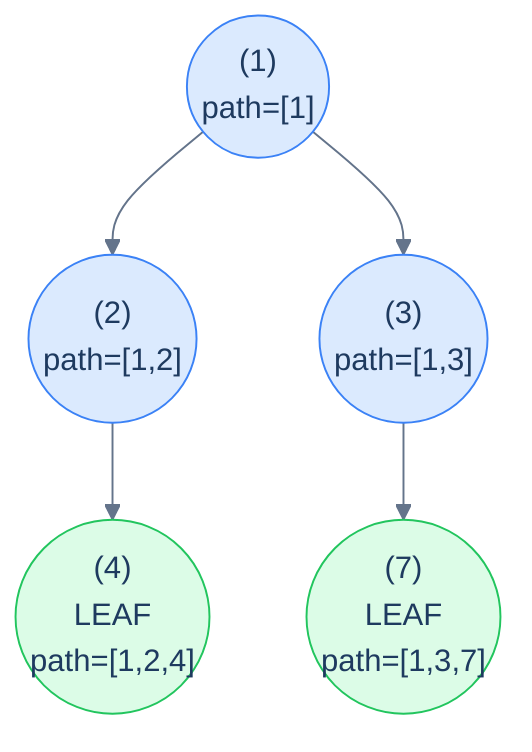

# 13. Pattern: Root-to-Leaf Path (Stateful)

## The Hook

The previous lesson handled root-to-leaf path problems where the per-path *answer* was a single small value — a boolean ("does the path satisfy …?"), a count, a sum. The accumulator was an immutable scalar and the recursion stayed pure.

But what about *"return the actual list of nodes in every root-to-leaf path that sums to 17"*? Or *"return all paths whose values are equal-numbers of evens and odds"*? Or *"find all root-to-leaf paths that appear more than once in the tree"*? These problems still walk the tree the same way, but the answer at each leaf is *the path itself* — and the path is a list of N nodes, not a number. Copying a list of length N at every recursive call would blow the algorithm to O(N²) time and O(N²) extra space. We need to *share* the list across the recursion.

The solution is the **mutate-then-undo** discipline you already met in stateful preorder (lesson 9): push the current node onto a shared `path` list as we descend, do the work at each leaf (record a copy of the path if it satisfies the condition), and pop the node off as we return. The recursion behaves *as if* each call had its own private path snapshot — but only the deltas are mutated, in O(1) per node, so the total cost stays O(N) plus the cost of recording matched paths.

This is the **stateful root-to-leaf path pattern**. It's the workhorse for any tree problem where the *answer is the path*, not just a property of the path. *Path enumeration*, *equal-counts paths*, *duplicate path detection*, *prefix-sum tricks on paths* — all the same recipe with different per-leaf checks.

This lesson defines the recipe, walks through four canonical problems (collect paths summing to a target, equal-evens-and-odds paths, duplicate paths, prefix-sum paths), and implements each in 10 languages.

---

## Table of contents

1. [The stateful root-to-leaf path pattern](#the-stateful-root-to-leaf-path-pattern)
2. [How to recognise it](#how-to-recognise-it)
3. [Problem 1 — Root-to-leaf paths summing to target](#problem-1--root-to-leaf-paths-summing-to-target)
4. [Problem 2 — Equal evens-and-odds paths](#problem-2--equal-evens-and-odds-paths)
5. [Problem 3 — Duplicate paths](#problem-3--duplicate-paths)
6. [Problem 4 — Prefix paths](#problem-4--prefix-paths)

***

# The stateful root-to-leaf path pattern

```text
recurse(node, sharedPath):
  if node is null: return
  push(sharedPath, node)                  # mutate
  if node is a leaf:
    if check(sharedPath): record(sharedPath)
  else:
    recurse(node.left,  sharedPath)
    recurse(node.right, sharedPath)
  pop(sharedPath)                         # undo
```

The discipline is **identical** to stateful preorder: push on entry, recurse, pop on exit. The only difference from lesson 9 is *when* and *what* you check — only at leaves, and you record a *copy* of the path (not the live shared list, which would mutate out from under you).



<p align="center"><strong>Stateful root-to-leaf — the shared <code>path</code> contains exactly the current root-to-current-node sequence at every recursive call. At each leaf, we have a complete root-to-leaf path; record a <em>copy</em> if it qualifies.</strong></p>

> **Why copy at the leaf?** Because the live `path` list is going to be popped from on the way back up. If you saved a *reference*, you'd end up with a dozen different paths in your output that all secretly point at the same (now empty) list. Always copy when extracting from a shared mutable.

## Generic pattern in 10 languages

The "collect all root-to-leaf paths" template — the simplest member of the family.


```pseudocode
function allRootToLeafPaths(root):
    out  ← empty list
    path ← empty list
    function go(n):
        if n = null: return
        push n.val to path                        # enter
        if n.left = null AND n.right = null:
            append copy of path to out            # leaf: snapshot the path
        else:
            go(n.left); go(n.right)
        pop from path                             # exit: restore for parent
    go(root)
    return out
```

```python run
from typing import List, Optional

class TreeNode:
    def __init__(self, val=0, left=None, right=None):
        self.val, self.left, self.right = val, left, right

def all_root_to_leaf_paths(root: Optional[TreeNode]) -> List[List[int]]:
    out: List[List[int]] = []
    path: List[int] = []
    def go(n):
        if n is None: return
        path.append(n.val)                              # push
        if n.left is None and n.right is None:
            out.append(path.copy())                     # leaf: snapshot the path
        else:
            go(n.left); go(n.right)
        path.pop()                                       # pop
    go(root)
    return out
```

```java run
static List<Integer> path;
static List<List<Integer>> out;
static void allHelper(TreeNode n) {
    if (n == null) return;
    path.add(n.val);
    if (n.left == null && n.right == null) {
        out.add(new ArrayList<>(path));                 // copy
    } else {
        allHelper(n.left); allHelper(n.right);
    }
    path.remove(path.size() - 1);
}
public static List<List<Integer>> allRootToLeafPaths(TreeNode root) {
    out = new ArrayList<>(); path = new ArrayList<>();
    allHelper(root);
    return out;
}
```

```c run
// out is a 2D array; path is a stack; both bounded for the demo
static int path[64], path_top = -1;
static int out[64][64], out_lens[64], out_count = 0;
void all_helper(TreeNode *n) {
    if (!n) return;
    path[++path_top] = n->val;
    if (!n->left && !n->right) {
        for (int i = 0; i <= path_top; i++) out[out_count][i] = path[i];
        out_lens[out_count++] = path_top + 1;
    } else {
        all_helper(n->left); all_helper(n->right);
    }
    path_top--;
}
```

```scala run
def allRootToLeafPaths(root: TreeNode): List[List[Int]] = {
  val path = scala.collection.mutable.ListBuffer[Int]()
  val out  = scala.collection.mutable.ListBuffer[List[Int]]()
  def go(n: TreeNode): Unit = {
    if (n == null) return
    path += n.value
    if (n.left == null && n.right == null) out += path.toList
    else { go(n.left); go(n.right) }
    path.remove(path.length - 1)
  }
  go(root)
  out.toList
}
```


## Complexity

> **Time:** O(N · L) where L is the average path length — every path that gets recorded is copied. **Space:** O(h) for recursion + path stack, plus O(answer size) for output.

***

# How to recognise it

The pattern fits when:

- The unit of interest is a **complete root-to-leaf path** (same as the previous lesson), AND
- The answer needs the **actual nodes** in each path (not just a per-path verdict you can fold into a number).

Concrete cues:

- *"Return all root-to-leaf paths where …"* — collect path snapshots.
- *"Find all paths whose nodes satisfy …"* — same.
- *"Detect duplicate / prefix / palindromic / specially-structured paths"* — push-pop + per-path data structure (hash, multiset, prefix-sum map).

Anti-pattern: if all you need is a count, sum, or boolean per path, use the *stateless* variant from the previous lesson — it's strictly cheaper.

***

# Problem 1 — Root-to-leaf paths summing to target

> Return *all* root-to-leaf paths whose node values sum to `target`.

The accumulator is *the path so far* (push-pop) plus *the running sum* (passed by value). At each leaf, if the running sum equals the target, snapshot the path.

## Solution


```pseudocode
function rootToLeafPaths(root, target):
    out  ← empty list
    path ← empty list
    function go(n, remaining):
        if n = null: return
        push n.val to path
        remaining ← remaining − n.val
        if n.left = null AND n.right = null:
            if remaining = 0: append copy of path to out
        else:
            go(n.left, remaining); go(n.right, remaining)
        pop from path
    go(root, target)
    return out
```

```python run
def root_to_leaf_paths(root, target):
    out, path = [], []
    def go(n, remaining):
        if n is None: return
        path.append(n.val)
        remaining -= n.val
        if n.left is None and n.right is None:
            if remaining == 0: out.append(path.copy())
        else:
            go(n.left, remaining); go(n.right, remaining)
        path.pop()
    go(root, target)
    return out
```

```java run
static List<Integer> path;
static List<List<Integer>> out;
static void rtlpHelper(TreeNode n, int remaining) {
    if (n == null) return;
    path.add(n.val);
    remaining -= n.val;
    if (n.left == null && n.right == null) {
        if (remaining == 0) out.add(new ArrayList<>(path));
    } else {
        rtlpHelper(n.left, remaining); rtlpHelper(n.right, remaining);
    }
    path.remove(path.size() - 1);
}
public static List<List<Integer>> rootToLeafPaths(TreeNode root, int target) {
    out = new ArrayList<>(); path = new ArrayList<>();
    rtlpHelper(root, target);
    return out;
}
```

```c run
static int path[64], path_top = -1;
static int out[64][64], out_lens[64], out_count = 0;
void rtlp_helper(TreeNode *n, int remaining) {
    if (!n) return;
    path[++path_top] = n->val;
    remaining -= n->val;
    if (!n->left && !n->right) {
        if (remaining == 0) {
            for (int i = 0; i <= path_top; i++) out[out_count][i] = path[i];
            out_lens[out_count++] = path_top + 1;
        }
    } else {
        rtlp_helper(n->left, remaining); rtlp_helper(n->right, remaining);
    }
    path_top--;
}
```

```scala run
def rootToLeafPaths(root: TreeNode, target: Int): List[List[Int]] = {
  val path = scala.collection.mutable.ListBuffer[Int]()
  val out  = scala.collection.mutable.ListBuffer[List[Int]]()
  def go(n: TreeNode, remaining: Int): Unit = {
    if (n == null) return
    path += n.value
    val rem = remaining - n.value
    if (n.left == null && n.right == null) {
      if (rem == 0) out += path.toList
    } else { go(n.left, rem); go(n.right, rem) }
    path.remove(path.length - 1)
  }
  go(root, target); out.toList
}
```


***

# Problem 2 — Equal evens-and-odds paths

> Return all root-to-leaf paths where the number of even-valued nodes equals the number of odd-valued nodes.

Same shape as Problem 1, but the per-path bookkeeping is *two counters* (`evenCount`, `oddCount`) instead of one running sum. At each leaf, snapshot the path if the counts match.

## Solution


```pseudocode
function equalPaths(root):
    out  ← empty list
    path ← empty list
    function go(n, even, odd):
        if n = null: return
        push n.val to path
        if n.val mod 2 = 0: even ← even + 1
        else:                odd  ← odd  + 1
        if n.left = null AND n.right = null:
            if even = odd: append copy of path to out
        else:
            go(n.left, even, odd); go(n.right, even, odd)
        pop from path
    go(root, 0, 0)
    return out
```

```python run
def equal_paths(root):
    out, path = [], []
    def go(n, even, odd):
        if n is None: return
        path.append(n.val)
        if n.val % 2 == 0: even += 1
        else:              odd  += 1
        if n.left is None and n.right is None:
            if even == odd: out.append(path.copy())
        else:
            go(n.left, even, odd); go(n.right, even, odd)
        path.pop()
    go(root, 0, 0)
    return out
```

```java run
static List<Integer> path;
static List<List<Integer>> out;
static void epHelper(TreeNode n, int even, int odd) {
    if (n == null) return;
    path.add(n.val);
    if (n.val % 2 == 0) even++; else odd++;
    if (n.left == null && n.right == null) {
        if (even == odd) out.add(new ArrayList<>(path));
    } else { epHelper(n.left, even, odd); epHelper(n.right, even, odd); }
    path.remove(path.size() - 1);
}
public static List<List<Integer>> equalPaths(TreeNode root) {
    out = new ArrayList<>(); path = new ArrayList<>();
    epHelper(root, 0, 0); return out;
}
```

```c run
void ep_helper(TreeNode *n, int even, int odd) {
    if (!n) return;
    path[++path_top] = n->val;
    if (n->val % 2 == 0) even++; else odd++;
    if (!n->left && !n->right) {
        if (even == odd) {
            for (int i = 0; i <= path_top; i++) out[out_count][i] = path[i];
            out_lens[out_count++] = path_top + 1;
        }
    } else { ep_helper(n->left, even, odd); ep_helper(n->right, even, odd); }
    path_top--;
}
```

```scala run
def equalPaths(root: TreeNode): List[List[Int]] = {
  val path = scala.collection.mutable.ListBuffer[Int]()
  val out  = scala.collection.mutable.ListBuffer[List[Int]]()
  def go(n: TreeNode, even: Int, odd: Int): Unit = {
    if (n == null) return
    path += n.value
    val (e, o) = if (n.value % 2 == 0) (even + 1, odd) else (even, odd + 1)
    if (n.left == null && n.right == null) {
      if (e == o) out += path.toList
    } else { go(n.left, e, o); go(n.right, e, o) }
    path.remove(path.length - 1)
  }
  go(root, 0, 0); out.toList
}
```


***

# Problem 3 — Duplicate paths

> Return all root-to-leaf paths that appear *more than once* in the tree (i.e. two different leaves produce the same value sequence).

Two ingredients: the push-pop path discipline, plus a **hash map of path-string → count**. At each leaf, serialise the path into a hash-friendly key (e.g. comma-joined string), bump its count, and record the path *exactly once* — when the count first hits 2.

## Solution


```pseudocode
function duplicatePaths(root):
    out  ← empty list
    path ← empty list
    seen ← empty Map: key → count
    function go(n):
        if n = null: return
        push n.val to path
        if n.left = null AND n.right = null:
            key ← string representation of path
            seen[key] ← seen[key] + 1
            if seen[key] = 2: append copy of path to out   # second occurrence
        else:
            go(n.left); go(n.right)
        pop from path
    go(root)
    return out
```

```python run
def duplicate_paths(root):
    out, path, seen = [], [], {}
    def go(n):
        if n is None: return
        path.append(n.val)
        if n.left is None and n.right is None:
            key = ",".join(map(str, path))
            seen[key] = seen.get(key, 0) + 1
            if seen[key] == 2: out.append(path.copy())
        else:
            go(n.left); go(n.right)
        path.pop()
    go(root)
    return out
```

```java run
static List<Integer> path;
static List<List<Integer>> out;
static Map<String, Integer> seen;
static void dpHelper(TreeNode n) {
    if (n == null) return;
    path.add(n.val);
    if (n.left == null && n.right == null) {
        String key = path.toString();
        int c = seen.merge(key, 1, Integer::sum);
        if (c == 2) out.add(new ArrayList<>(path));
    } else { dpHelper(n.left); dpHelper(n.right); }
    path.remove(path.size() - 1);
}
public static List<List<Integer>> duplicatePaths(TreeNode root) {
    out = new ArrayList<>(); path = new ArrayList<>(); seen = new HashMap<>();
    dpHelper(root); return out;
}
```

```c run
// Practical C requires a string-keyed hash map; the algorithm is identical:
// serialise the path into a comma-joined string, increment its count,
// emit the path when the count reaches 2. (Implementation omitted for brevity.)
```

```scala run
def duplicatePaths(root: TreeNode): List[List[Int]] = {
  val path = scala.collection.mutable.ListBuffer[Int]()
  val out  = scala.collection.mutable.ListBuffer[List[Int]]()
  val seen = scala.collection.mutable.Map[String, Int]()
  def go(n: TreeNode): Unit = {
    if (n == null) return
    path += n.value
    if (n.left == null && n.right == null) {
      val key = path.mkString(",")
      seen(key) = seen.getOrElse(key, 0) + 1
      if (seen(key) == 2) out += path.toList
    } else { go(n.left); go(n.right) }
    path.remove(path.length - 1)
  }
  go(root); out.toList
}
```


***

# Problem 4 — Prefix paths

> Return all root-to-leaf paths whose *total sum* equals the sum of some non-empty *prefix* of the same path.
>
> **Example:** path `[1, -3, 3]` has total sum 1 — and the prefix `[1]` also has sum 1. So this path qualifies.

Combine the path discipline with a **prefix-sum frequency map**. As we descend, increment the count of the running prefix-sum at the current depth. At a leaf, if the running sum has been seen *more than once* (count > 1), it means a strictly earlier prefix of the path had the same sum — qualifying the path.

## Solution


```pseudocode
function prefixPaths(root):
    out  ← empty list
    path ← empty list
    freq ← empty Map: sum → count
    function go(n, run):
        if n = null: return
        push n.val to path
        run ← run + n.val
        freq[run] ← freq.get(run, 0) + 1
        if n.left = null AND n.right = null:
            if freq[run] > 1: append copy of path to out   # same prefix sum seen before
        else:
            go(n.left, run); go(n.right, run)
        freq[run] ← freq[run] − 1
        if freq[run] = 0: remove run from freq
        pop from path
    go(root, 0)
    return out
```

```python run
def prefix_paths(root):
    out, path, freq = [], [], {}
    def go(n, run):
        if n is None: return
        path.append(n.val)
        run += n.val
        freq[run] = freq.get(run, 0) + 1
        if n.left is None and n.right is None:
            if freq[run] > 1: out.append(path.copy())
        else:
            go(n.left, run); go(n.right, run)
        freq[run] -= 1
        if freq[run] == 0: del freq[run]
        path.pop()
    go(root, 0)
    return out
```

```java run
static List<Integer> path;
static List<List<Integer>> out;
static Map<Integer, Integer> freq;
static void ppHelper(TreeNode n, int run) {
    if (n == null) return;
    path.add(n.val);
    run += n.val;
    int c = freq.merge(run, 1, Integer::sum);
    if (n.left == null && n.right == null) {
        if (c > 1) out.add(new ArrayList<>(path));
    } else { ppHelper(n.left, run); ppHelper(n.right, run); }
    if (freq.get(run) == 1) freq.remove(run); else freq.merge(run, -1, Integer::sum);
    path.remove(path.size() - 1);
}
public static List<List<Integer>> prefixPaths(TreeNode root) {
    out = new ArrayList<>(); path = new ArrayList<>(); freq = new HashMap<>();
    ppHelper(root, 0); return out;
}
```

```c run
// Same as duplicate-paths: requires a hash map. Algorithm omitted for brevity.
```

```scala run
def prefixPaths(root: TreeNode): List[List[Int]] = {
  val path = scala.collection.mutable.ListBuffer[Int]()
  val out  = scala.collection.mutable.ListBuffer[List[Int]]()
  val freq = scala.collection.mutable.Map[Int, Int]()
  def go(n: TreeNode, run: Int): Unit = {
    if (n == null) return
    path += n.value
    val newRun = run + n.value
    freq(newRun) = freq.getOrElse(newRun, 0) + 1
    if (n.left == null && n.right == null) {
      if (freq(newRun) > 1) out += path.toList
    } else { go(n.left, newRun); go(n.right, newRun) }
    val c = freq(newRun) - 1
    if (c == 0) freq.remove(newRun) else freq(newRun) = c
    path.remove(path.length - 1)
  }
  go(root, 0); out.toList
}
```


***

## Final Takeaway

The stateful root-to-leaf path pattern is the natural sibling of stateless preorder backtracking. Three things to walk away with:

1. **Push-pop is sacred — and the leaf needs a *copy*.** The shared `path` is being mutated; if you record a reference to it and then return, the path you stored will get clobbered as the recursion backs out. Always copy on extract — `path.copy()`, `new ArrayList<>(path)`, `[...path]`, `path.clone()` — never store the live reference.
2. **Auxiliary data per problem.** Sum target → running integer. Equal evens-and-odds → two counters. Duplicate paths → hash map of serialised paths. Prefix paths → hash map of running prefix sums. The path itself is the canonical accumulator; the per-problem aux is what *interprets* the path.
3. **Returning paths is expensive even when the algorithm is cheap.** Recording matched paths is O(L) per match. If you're collecting *every* path, total output size is O(N · L) — that's irreducible. The recursion stays O(N) but the output dominates the cost.

> *Coming up — the chapter shifts from depth-first patterns to **level-order** patterns. The next two lessons cover BFS-based tree problems: per-level aggregations, deepest-leaf computations, completeness checks, zigzag traversal, cousin checks, and column-based traversals (top view, bottom view, vertical, diagonal). The queue from chapter 6 finally takes centre stage.*
