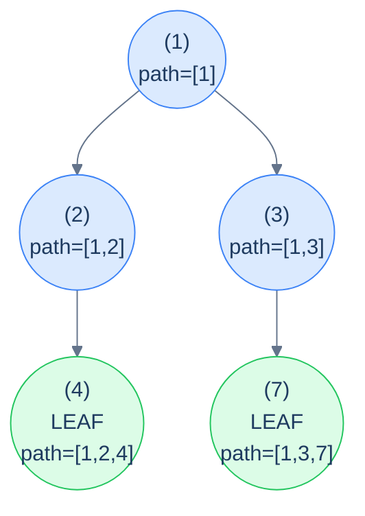

# 13. Pattern: Root-to-Leaf Path (Stateful)

## The Hook

The previous lesson handled root-to-leaf path problems where the per-path *answer* was a single small value — a boolean ("does the path satisfy …?"), a count, a sum. The accumulator was an immutable scalar and the recursion stayed pure.

But what about *"return the actual list of nodes in every root-to-leaf path that sums to 17"*? Or *"return all paths whose values are equal-numbers of evens and odds"*? Or *"find all root-to-leaf paths that appear more than once in the tree"*? These problems still walk the tree the same way, but the answer at each leaf is *the path itself* — and the path is a list of N nodes, not a number. Copying a list of length N at every recursive call would blow the algorithm to O(N²) time and O(N²) extra space. We need to *share* the list across the recursion.

The solution is the **mutate-then-undo** discipline you already met in stateful preorder (lesson 9): push the current node onto a shared `path` list as we descend, do the work at each leaf (record a copy of the path if it satisfies the condition), and pop the node off as we return. The recursion behaves *as if* each call had its own private path snapshot — but only the deltas are mutated, in O(1) per node, so the total cost stays O(N) plus the cost of recording matched paths.

This is the **stateful root-to-leaf path pattern**. It's the workhorse for any tree problem where the *answer is the path*, not just a property of the path. *Path enumeration*, *equal-counts paths*, *duplicate path detection*, *prefix-sum tricks on paths* — all the same recipe with different per-leaf checks.

This lesson defines the recipe, walks through four canonical problems (collect paths summing to a target, equal-evens-and-odds paths, duplicate paths, prefix-sum paths), and implements each in Python and Java.

---

## Table of contents

1. [The stateful root-to-leaf path pattern](#the-stateful-root-to-leaf-path-pattern)
2. [How to recognise it](#how-to-recognise-it)
3. [Problem 1 — Root-to-leaf paths summing to target](#problem-1--root-to-leaf-paths-summing-to-target)
4. [Problem 2 — Equal evens-and-odds paths](#problem-2--equal-evens-and-odds-paths)
5. [Problem 3 — Duplicate paths](#problem-3--duplicate-paths)
6. [Problem 4 — Prefix paths](#problem-4--prefix-paths)

***

# The stateful root-to-leaf path pattern

```text
recurse(node, sharedPath):
  if node is null: return
  push(sharedPath, node)                  # mutate
  if node is a leaf:
    if check(sharedPath): record(sharedPath)
  else:
    recurse(node.left,  sharedPath)
    recurse(node.right, sharedPath)
  pop(sharedPath)                         # undo
```

The discipline is **identical** to stateful preorder: push on entry, recurse, pop on exit. The only difference from lesson 9 is *when* and *what* you check — only at leaves, and you record a *copy* of the path (not the live shared list, which would mutate out from under you).



<p align="center"><strong>Stateful root-to-leaf — the shared <code>path</code> contains exactly the current root-to-current-node sequence at every recursive call. At each leaf, we have a complete root-to-leaf path; record a <em>copy</em> if it qualifies.</strong></p>

> **Why copy at the leaf?** Because the live `path` list is going to be popped from on the way back up. If you saved a *reference*, you'd end up with a dozen different paths in your output that all secretly point at the same (now empty) list. Always copy when extracting from a shared mutable.

## Generic pattern

The "collect all root-to-leaf paths" template — the simplest member of the family.


```python run
from typing import List, Optional

class TreeNode:
    def __init__(self, val=0, left=None, right=None):
        self.val, self.left, self.right = val, left, right

def all_root_to_leaf_paths(root: Optional[TreeNode]) -> List[List[int]]:
    out: List[List[int]] = []
    path: List[int] = []
    def go(n):
        if n is None: return
        path.append(n.val)                              # push
        if n.left is None and n.right is None:
            out.append(path.copy())                     # leaf: snapshot the path
        else:
            go(n.left); go(n.right)
        path.pop()                                       # pop
    go(root)
    return out
```

```java run
static List<Integer> path;
static List<List<Integer>> out;
static void allHelper(TreeNode n) {
    if (n == null) return;
    path.add(n.val);
    if (n.left == null && n.right == null) {
        out.add(new ArrayList<>(path));                 // copy
    } else {
        allHelper(n.left); allHelper(n.right);
    }
    path.remove(path.size() - 1);
}
public static List<List<Integer>> allRootToLeafPaths(TreeNode root) {
    out = new ArrayList<>(); path = new ArrayList<>();
    allHelper(root);
    return out;
}
```


## Complexity

> **Time:** O(N · L) where L is the average path length — every path that gets recorded is copied. **Space:** O(h) for recursion + path stack, plus O(answer size) for output.

***

# How to recognise it

The pattern fits when:

- The unit of interest is a **complete root-to-leaf path** (same as the previous lesson), AND
- The answer needs the **actual nodes** in each path (not just a per-path verdict you can fold into a number).

Concrete cues:

- *"Return all root-to-leaf paths where …"* — collect path snapshots.
- *"Find all paths whose nodes satisfy …"* — same.
- *"Detect duplicate / prefix / palindromic / specially-structured paths"* — push-pop + per-path data structure (hash, multiset, prefix-sum map).

Anti-pattern: if all you need is a count, sum, or boolean per path, use the *stateless* variant from the previous lesson — it's strictly cheaper.

***

# Problem 1 — Root-to-leaf paths summing to target

> Return *all* root-to-leaf paths whose node values sum to `target`.

The accumulator is *the path so far* (push-pop) plus a *countdown of the target* (passed by value). Each call subtracts the current node's value from `target` before recursing; at a leaf the path qualifies when the leaf's own value equals the remaining `target` — i.e. the whole path summed to the original target. Snapshot the path when that holds.

<details>
<summary><h2>Solution</h2></summary>


```python run
from typing import List, Optional


class TreeNode:
    def __init__(self, val=0, left=None, right=None):
        self.val = val
        self.left = left
        self.right = right


def from_level_order(values):
    """Build tree from list like [1, 2, 3, None, 4]. None means missing child."""
    if not values:
        return None
    root = TreeNode(values[0])
    queue = [root]
    i = 1
    while queue and i < len(values):
        node = queue.pop(0)
        if i < len(values) and values[i] is not None:
            node.left = TreeNode(values[i])
            queue.append(node.left)
        i += 1
        if i < len(values) and values[i] is not None:
            node.right = TreeNode(values[i])
            queue.append(node.right)
        i += 1
    return root


class Solution:
    def __init__(self):

        # To store the current path as we traverse
        self.path: List[int] = []

    def root_to_leaf_paths_helper(
        self,
        root: Optional[TreeNode],
        target: int,
        result: List[List[int]],
    ) -> None:

        # If the root is null, there is no path, so return
        if root is None:
            return

        # Add the current node to the path
        self.path.append(root.val)

        # If it is a leaf node and the target matches the node value,
        # add the current path to the result
        if (
            root.left is None
            and root.right is None
            and root.val == target
        ):
            result.append(self.path.copy())

        # Otherwise, subtract the current node's value from target and
        # continue traversal to left and right subtrees
        target -= root.val

        # Recursively search in left and right subtrees with updated
        # target
        self.root_to_leaf_paths_helper(root.left, target, result)
        self.root_to_leaf_paths_helper(root.right, target, result)

        # Backtrack by removing the current node from the path
        self.path.pop()

    def root_to_leaf_paths(
        self, root: Optional[TreeNode], target: int
    ) -> List[List[int]]:

        # To store all valid paths
        result: List[List[int]] = []

        # Start the recursive search from the root node
        self.root_to_leaf_paths_helper(root, target, result)

        # Return the list of all valid paths
        return result


# Examples from the problem statement
print(Solution().root_to_leaf_paths(from_level_order([1, 2, 3, 4, None, None, 7]), 11))   # [[1, 3, 7]]
print(Solution().root_to_leaf_paths(from_level_order([1, 8, 4, None, None, 2, 4]), 13))   # []

# Edge cases
print(Solution().root_to_leaf_paths(None, 0))                                               # []
print(Solution().root_to_leaf_paths(from_level_order([5]), 5))                              # [[5]]
print(Solution().root_to_leaf_paths(from_level_order([5]), 0))                              # []
print(Solution().root_to_leaf_paths(from_level_order([1, 2, 3]), 3))                        # [[1, 2]]
print(Solution().root_to_leaf_paths(from_level_order([1, 2, 3]), 4))                        # [[1, 3]]
print(Solution().root_to_leaf_paths(from_level_order([1, 2, 2]), 3))                        # [[1, 2], [1, 2]] (two identical paths)
```

```java run
import java.util.*;

public class Main {
    static class TreeNode {
        int val;
        TreeNode left;
        TreeNode right;
        TreeNode() {}
        TreeNode(int val) { this.val = val; }
    }

    static TreeNode fromLevelOrder(Integer... values) {
        if (values.length == 0 || values[0] == null) return null;
        TreeNode root = new TreeNode(values[0]);
        java.util.Deque<TreeNode> queue = new java.util.ArrayDeque<>();
        queue.add(root);
        int i = 1;
        while (!queue.isEmpty() && i < values.length) {
            TreeNode node = queue.poll();
            if (i < values.length && values[i] != null) {
                node.left = new TreeNode(values[i]);
                queue.add(node.left);
            }
            i++;
            if (i < values.length && values[i] != null) {
                node.right = new TreeNode(values[i]);
                queue.add(node.right);
            }
            i++;
        }
        return root;
    }

    static class Solution {

        // To store the current path as we traverse
        private List<Integer> path = new ArrayList<>();

        private void rootToLeafPathsHelper(
            TreeNode root,
            int target,
            List<List<Integer>> result
        ) {

            // If the root is null, there is no path, so return
            if (root == null) {
                return;
            }

            // Add the current node to the path
            path.add(root.val);

            // If it is a leaf node and the target matches the node value,
            // add the current path to the result
            if (
                root.left == null && root.right == null && root.val == target
            ) {
                result.add(new ArrayList<>(path));
            }

            // Otherwise, subtract the current node's value from target and
            // continue traversal to left and right subtrees
            target -= root.val;

            // Recursively search in left and right subtrees with updated
            // target
            rootToLeafPathsHelper(root.left, target, result);
            rootToLeafPathsHelper(root.right, target, result);

            // Backtrack by removing the current node from the path
            path.remove(path.size() - 1);
        }

        public List<List<Integer>> rootToLeafPaths(
            TreeNode root,
            int target
        ) {

            // To store all valid paths
            List<List<Integer>> result = new ArrayList<>();

            // Start the recursive search from the root node
            rootToLeafPathsHelper(root, target, result);

            // Return the list of all valid paths
            return result;
        }
    }

    public static void main(String[] args) {
        // Examples from the problem statement
        System.out.println(new Solution().rootToLeafPaths(fromLevelOrder(1, 2, 3, 4, null, null, 7), 11));   // [[1, 3, 7]]
        System.out.println(new Solution().rootToLeafPaths(fromLevelOrder(1, 8, 4, null, null, 2, 4), 13));   // []

        // Edge cases
        System.out.println(new Solution().rootToLeafPaths(null, 0));                                          // []
        System.out.println(new Solution().rootToLeafPaths(fromLevelOrder(5), 5));                             // [[5]]
        System.out.println(new Solution().rootToLeafPaths(fromLevelOrder(5), 0));                             // []
        System.out.println(new Solution().rootToLeafPaths(fromLevelOrder(1, 2, 3), 3));                       // [[1, 2]]
        System.out.println(new Solution().rootToLeafPaths(fromLevelOrder(1, 2, 3), 4));                       // [[1, 3]]
        System.out.println(new Solution().rootToLeafPaths(fromLevelOrder(1, 2, 2), 3));                       // [[1, 2], [1, 2]]
    }
}
```

</details>


***

# Problem 2 — Equal evens-and-odds paths

> Return all root-to-leaf paths where the number of even-valued nodes equals the number of odd-valued nodes.

Same shape as Problem 1, but the per-path bookkeeping is *two counters* (`evenCount`, `oddCount`) instead of one running sum. At each leaf, snapshot the path if the counts match.

<details>
<summary><h2>Solution</h2></summary>


```python run
from typing import List, Optional


class TreeNode:
    def __init__(self, val=0, left=None, right=None):
        self.val = val
        self.left = left
        self.right = right


def from_level_order(values):
    """Build tree from list like [1, 2, 3, None, 4]. None means missing child."""
    if not values:
        return None
    root = TreeNode(values[0])
    queue = [root]
    i = 1
    while queue and i < len(values):
        node = queue.pop(0)
        if i < len(values) and values[i] is not None:
            node.left = TreeNode(values[i])
            queue.append(node.left)
        i += 1
        if i < len(values) and values[i] is not None:
            node.right = TreeNode(values[i])
            queue.append(node.right)
        i += 1
    return root


class Solution:

    # To store the current path as we traverse
    def __init__(self):
        self.path: List[int] = []

    def equal_paths_helper(
        self,
        root: Optional[TreeNode],
        even_count: int,
        odd_count: int,
        result: List[List[int]],
    ) -> None:

        # If the root is null, there is no path, so return
        if root is None:
            return

        # Add the current node to the path
        self.path.append(root.val)

        # If the current node is even, increment even count
        if root.val % 2 == 0:
            even_count += 1

        # Else, increment odd count
        else:
            odd_count += 1

        # If current node is a leaf, check if even and odd counts are
        # equal
        if root.left is None and root.right is None:

            # If the counts are equal, add the current path to the result
            if even_count == odd_count:
                result.append(self.path.copy())

        # Recursively traverse left and right subtrees
        self.equal_paths_helper(
            root.left, even_count, odd_count, result
        )
        self.equal_paths_helper(
            root.right, even_count, odd_count, result
        )

        # Backtrack by removing the current node from the path
        self.path.pop()

    def equal_paths(
        self, root: Optional[TreeNode]
    ) -> List[List[int]]:

        # To store all valid paths
        result: List[List[int]] = []

        # Start the recursive search from the root node with initial even
        # and odd counts as 0
        self.equal_paths_helper(root, 0, 0, result)
        return result


# Examples from the problem statement
print(Solution().equal_paths(from_level_order([1, 2, 4])))                     # [[1, 2], [1, 4]]
print(Solution().equal_paths(from_level_order([1, 8, 4, None, None, 2, 4])))   # [[1, 8]]

# Edge cases
print(Solution().equal_paths(None))                                              # []
print(Solution().equal_paths(from_level_order([1])))                             # [] (odd only, 1 odd 0 even)
print(Solution().equal_paths(from_level_order([2])))                             # [] (even only)
print(Solution().equal_paths(from_level_order([1, 2])))                          # [[1, 2]] (1 odd, 1 even)
print(Solution().equal_paths(from_level_order([1, 2, 3])))                       # [[1, 2]] (1+2: 1 odd 1 even; 1+3: 2 odd 0 even)
print(Solution().equal_paths(from_level_order([2, 1, 3, None, None, None, 4])))  # [[2, 3, 4]] (2+3+4: 2 even 1 odd; 2+1: 1 each yes; 2+3+4: 2 even 1 odd no)
```

```java run
import java.util.*;

public class Main {
    static class TreeNode {
        int val;
        TreeNode left;
        TreeNode right;
        TreeNode() {}
        TreeNode(int val) { this.val = val; }
    }

    static TreeNode fromLevelOrder(Integer... values) {
        if (values.length == 0 || values[0] == null) return null;
        TreeNode root = new TreeNode(values[0]);
        java.util.Deque<TreeNode> queue = new java.util.ArrayDeque<>();
        queue.add(root);
        int i = 1;
        while (!queue.isEmpty() && i < values.length) {
            TreeNode node = queue.poll();
            if (i < values.length && values[i] != null) {
                node.left = new TreeNode(values[i]);
                queue.add(node.left);
            }
            i++;
            if (i < values.length && values[i] != null) {
                node.right = new TreeNode(values[i]);
                queue.add(node.right);
            }
            i++;
        }
        return root;
    }

    static class Solution {

        // To store the current path as we traverse
        private List<Integer> path = new ArrayList<>();

        private void equalPathsHelper(
            TreeNode root,
            int evenCount,
            int oddCount,
            List<List<Integer>> result
        ) {

            // If the root is null, there is no path, so return
            if (root == null) {
                return;
            }

            // Add the current node to the path
            path.add(root.val);

            // If the current node is even, increment even count
            if (root.val % 2 == 0) {
                evenCount++;
            }

            // Else, increment odd count
            else {
                oddCount++;
            }

            // If current node is a leaf, check if even and odd counts are
            // equal
            if (root.left == null && root.right == null) {

                // If the counts are equal, add the current path to the
                // result
                if (evenCount == oddCount) {
                    result.add(new ArrayList<>(path));
                }
            }

            // Recursively traverse left and right subtrees
            equalPathsHelper(root.left, evenCount, oddCount, result);
            equalPathsHelper(root.right, evenCount, oddCount, result);

            // Backtrack by removing the current node from the path
            path.remove(path.size() - 1);
        }

        public List<List<Integer>> equalPaths(TreeNode root) {

            // To store all valid paths
            List<List<Integer>> result = new ArrayList<>();

            // Start the recursive search from the root node with initial
            // even and odd counts as 0
            equalPathsHelper(root, 0, 0, result);
            return result;
        }
    }

    public static void main(String[] args) {
        // Examples from the problem statement
        System.out.println(new Solution().equalPaths(fromLevelOrder(1, 2, 4)));                     // [[1, 2], [1, 4]]
        System.out.println(new Solution().equalPaths(fromLevelOrder(1, 8, 4, null, null, 2, 4)));   // [[1, 8]]

        // Edge cases
        System.out.println(new Solution().equalPaths(null));                                         // []
        System.out.println(new Solution().equalPaths(fromLevelOrder(1)));                            // []
        System.out.println(new Solution().equalPaths(fromLevelOrder(2)));                            // []
        System.out.println(new Solution().equalPaths(fromLevelOrder(1, 2)));                         // [[1, 2]]
        System.out.println(new Solution().equalPaths(fromLevelOrder(1, 2, 3)));                      // [[1, 2]]
    }
}
```

</details>


***

# Problem 3 — Duplicate paths

> Return all root-to-leaf paths that appear *more than once* in the tree (i.e. two different leaves produce the same value sequence).

Two ingredients: the push-pop path discipline, plus a **hash map of path-string → count**. At each leaf, serialise the path into a hash-friendly key (e.g. comma-joined string), bump its count, and record the path *exactly once* — when the count first hits 2.

<details>
<summary><h2>Solution</h2></summary>


```python run
from typing import List, Optional, Dict


class TreeNode:
    def __init__(self, val=0, left=None, right=None):
        self.val = val
        self.left = left
        self.right = right


def from_level_order(values):
    """Build tree from list like [1, 2, 3, None, 4]. None means missing child."""
    if not values:
        return None
    root = TreeNode(values[0])
    queue = [root]
    i = 1
    while queue and i < len(values):
        node = queue.pop(0)
        if i < len(values) and values[i] is not None:
            node.left = TreeNode(values[i])
            queue.append(node.left)
        i += 1
        if i < len(values) and values[i] is not None:
            node.right = TreeNode(values[i])
            queue.append(node.right)
        i += 1
    return root


class Solution:
    def __init__(self):

        # To store the current path as we traverse
        self.path: List[int] = []

        # To store frequency of each root-to-leaf path (serialized as a
        # string)
        self.path_count: Dict[str, int] = {}

    def serialize_path(self, path: List[int]) -> str:

        # Join all elements of the path with commas
        return ",".join(map(str, path))

    def duplicate_paths_helper(
        self, root: Optional[TreeNode], result: List[List[int]]
    ) -> None:

        # If the root is null, there is no path, so return
        if root is None:
            return

        # Add the current node to the path
        self.path.append(root.val)

        # If it's a leaf, serialize and check frequency
        if root.left is None and root.right is None:

            # Serialize current path
            serialized_path = self.serialize_path(self.path)

            # Increment frequency count for this path
            self.path_count[serialized_path] = (
                self.path_count.get(serialized_path, 0) + 1
            )

            # If path occurs exactly twice, record it as duplicate
            if self.path_count[serialized_path] == 2:
                result.append(self.path.copy())

        # Recursively traverse left and right subtrees
        self.duplicate_paths_helper(root.left, result)
        self.duplicate_paths_helper(root.right, result)

        # Backtrack by removing the current node from the path
        self.path.pop()

    def duplicate_paths(
        self, root: Optional[TreeNode]
    ) -> List[List[int]]:

        # To store all valid paths
        result: List[List[int]] = []

        # Start the recursive search from the root node
        self.duplicate_paths_helper(root, result)

        # Return the list of all valid paths
        return result


# Examples from the problem statement
print(Solution().duplicate_paths(from_level_order([1, 2, 2])))                     # [[1, 2]]
print(Solution().duplicate_paths(from_level_order([1, 8, 4, None, None, 2, 4])))   # []

# Edge cases
print(Solution().duplicate_paths(None))                                              # []
print(Solution().duplicate_paths(from_level_order([5])))                             # [] (single node, can't duplicate)
print(Solution().duplicate_paths(from_level_order([1, 1, 1])))                       # [[1, 1]] (both paths are [1,1])
print(Solution().duplicate_paths(from_level_order([1, 2, 3])))                       # [] (different paths)
print(Solution().duplicate_paths(from_level_order([1, 2, 2, 3, None, None, 3])))     # [[1, 2, 3]] (left and right paths match)
```

```java run
import java.util.*;
import java.util.stream.Collectors;

public class Main {
    static class TreeNode {
        int val;
        TreeNode left;
        TreeNode right;
        TreeNode() {}
        TreeNode(int val) { this.val = val; }
    }

    static TreeNode fromLevelOrder(Integer... values) {
        if (values.length == 0 || values[0] == null) return null;
        TreeNode root = new TreeNode(values[0]);
        java.util.Deque<TreeNode> queue = new java.util.ArrayDeque<>();
        queue.add(root);
        int i = 1;
        while (!queue.isEmpty() && i < values.length) {
            TreeNode node = queue.poll();
            if (i < values.length && values[i] != null) {
                node.left = new TreeNode(values[i]);
                queue.add(node.left);
            }
            i++;
            if (i < values.length && values[i] != null) {
                node.right = new TreeNode(values[i]);
                queue.add(node.right);
            }
            i++;
        }
        return root;
    }

    static class Solution {

        // To store the current path as we traverse
        private List<Integer> path = new ArrayList<>();

        // To store frequency of each root-to-leaf path (serialized as a
        // string)
        private Map<String, Integer> pathCount = new HashMap<>();

        private String serializePath(List<Integer> path) {

            // Join all elements of the path with commas
            return path
                .stream()
                .map(Object::toString)
                .collect(Collectors.joining(","));
        }

        private void duplicatePathsHelper(
            TreeNode root,
            List<List<Integer>> result
        ) {

            // If the root is null, there is no path, so return
            if (root == null) {
                return;
            }

            // Add the current node to the path
            path.add(root.val);

            // If it's a leaf, serialize and check frequency
            if (root.left == null && root.right == null) {

                // Serialize current path
                String serializedPath = serializePath(path);

                // Increment frequency count for this path
                pathCount.put(
                    serializedPath,
                    pathCount.getOrDefault(serializedPath, 0) + 1
                );

                // If path occurs exactly twice, record it as duplicate
                if (pathCount.get(serializedPath) == 2) {
                    result.add(new ArrayList<>(path));
                }
            }

            // Recursively traverse left and right subtrees
            duplicatePathsHelper(root.left, result);
            duplicatePathsHelper(root.right, result);

            // Backtrack by removing the current node from the path
            path.remove(path.size() - 1);
        }

        public List<List<Integer>> duplicatePaths(TreeNode root) {

            // To store all valid paths
            List<List<Integer>> result = new ArrayList<>();

            // Start the recursive search from the root node
            duplicatePathsHelper(root, result);

            // Return the list of all valid paths
            return result;
        }
    }

    public static void main(String[] args) {
        // Examples from the problem statement
        System.out.println(new Solution().duplicatePaths(fromLevelOrder(1, 2, 2)));                     // [[1, 2]]
        System.out.println(new Solution().duplicatePaths(fromLevelOrder(1, 8, 4, null, null, 2, 4)));   // []

        // Edge cases
        System.out.println(new Solution().duplicatePaths(null));                                         // []
        System.out.println(new Solution().duplicatePaths(fromLevelOrder(5)));                            // []
        System.out.println(new Solution().duplicatePaths(fromLevelOrder(1, 1, 1)));                      // [[1, 1]]
        System.out.println(new Solution().duplicatePaths(fromLevelOrder(1, 2, 3)));                      // []
        System.out.println(new Solution().duplicatePaths(fromLevelOrder(1, 2, 2, 3, null, null, 3)));    // [[1, 2, 3]]
    }
}
```

</details>


***

# Problem 4 — Prefix paths

> Return all root-to-leaf paths whose *total sum* equals the sum of some non-empty *prefix* of the same path.
>
> **Example:** path `[1, -3, 3]` has total sum 1 — and the prefix `[1]` also has sum 1. So this path qualifies.

Combine the path discipline with a **prefix-sum frequency map**. As we descend, increment the count of the running prefix-sum at the current depth. At a leaf, if the running sum has been seen *more than once* (count > 1), it means a strictly earlier prefix of the path had the same sum — qualifying the path.

<details>
<summary><h2>Solution</h2></summary>


```python run
from typing import List, Optional
from collections import defaultdict


class TreeNode:
    def __init__(self, val=0, left=None, right=None):
        self.val = val
        self.left = left
        self.right = right


def from_level_order(values):
    """Build tree from list like [1, 2, 3, None, 4]. None means missing child."""
    if not values:
        return None
    root = TreeNode(values[0])
    queue = [root]
    i = 1
    while queue and i < len(values):
        node = queue.pop(0)
        if i < len(values) and values[i] is not None:
            node.left = TreeNode(values[i])
            queue.append(node.left)
        i += 1
        if i < len(values) and values[i] is not None:
            node.right = TreeNode(values[i])
            queue.append(node.right)
        i += 1
    return root


class Solution:
    def __init__(self):

        # To store the current path as we traverse
        self.path: List[int] = []

        # To store prefix sum counts for paths using defaultdict
        self.prefix_sum_count: defaultdict[int, int] = defaultdict(int)

    def prefix_paths_helper(
        self,
        root: Optional[TreeNode],
        path_sum: int,
        result: List[List[int]],
    ) -> None:

        # If the root is null, there is no path, so return
        if root is None:
            return

        # Add the current node to the path
        self.path.append(root.val)

        # Calculate the current sum by adding the value of the
        # current node to the previous sum.
        path_sum += root.val

        # Add the current sum to the prefix_sum_count map
        self.prefix_sum_count[path_sum] += 1

        # If it's a leaf node, check if the total sum has occurred
        if root.left is None and root.right is None:

            # Check if total sum already exists as a prefix (excluding
            # last occurrence)
            if self.prefix_sum_count[path_sum] > 1:
                result.append(self.path.copy())

        # Recursively traverse left and right subtrees
        self.prefix_paths_helper(root.left, path_sum, result)
        self.prefix_paths_helper(root.right, path_sum, result)

        # Backtrack by removing the current sum from the prefix sum count
        self.prefix_sum_count[path_sum] -= 1

        # Backtrack by removing the current node from the path
        self.path.pop()

    def prefix_paths(self, root: Optional[TreeNode]) -> List[List[int]]:

        # To store all valid paths
        result: List[List[int]] = []

        # Start the recursive search from the root node
        self.prefix_paths_helper(root, 0, result)

        # Return the list of all valid paths
        return result


# Examples from the problem statement
print(Solution().prefix_paths(from_level_order([1, -3, None, None, 3])))  # [[1, -3, 3]]
print(Solution().prefix_paths(from_level_order([1, 8, 4, None, None, 2, 4])))  # []

# Edge cases
print(Solution().prefix_paths(None))                                       # []
print(Solution().prefix_paths(TreeNode(5)))                                # [] (single node, sum=5 first time)
print(Solution().prefix_paths(from_level_order([0, 0])))                   # [[0, 0]] (0+0=0, prefix [0]=0)
print(Solution().prefix_paths(from_level_order([1, 2, 3])))               # []
print(Solution().prefix_paths(from_level_order([2, 2, None, None, -2])))  # [] (path 2,-2 sum=0 != prefix sums 2,0... wait prefix sum 0 occurs once at node -2)
```

```java run
import java.util.*;

public class Main {
    static class TreeNode {
        int val;
        TreeNode left;
        TreeNode right;
        TreeNode() {}
        TreeNode(int val) { this.val = val; }
    }

    static TreeNode fromLevelOrder(Integer... values) {
        if (values.length == 0 || values[0] == null) return null;
        TreeNode root = new TreeNode(values[0]);
        java.util.Deque<TreeNode> queue = new java.util.ArrayDeque<>();
        queue.add(root);
        int i = 1;
        while (!queue.isEmpty() && i < values.length) {
            TreeNode node = queue.poll();
            if (i < values.length && values[i] != null) {
                node.left = new TreeNode(values[i]);
                queue.add(node.left);
            }
            i++;
            if (i < values.length && values[i] != null) {
                node.right = new TreeNode(values[i]);
                queue.add(node.right);
            }
            i++;
        }
        return root;
    }

    static class Solution {

        // To store the current path as we traverse
        private List<Integer> path = new ArrayList<>();

        // To store prefix sum counts for paths
        private Map<Integer, Integer> prefixSumCount = new HashMap<>();

        private void prefixPathsHelper(
            TreeNode root,
            int pathSum,
            List<List<Integer>> result
        ) {

            // If the root is null, there is no path, so return
            if (root == null) return;

            // Add the current node to the path
            path.add(root.val);

            // Calculate the current sum by adding the value of the
            // current node to the previous sum.
            pathSum += root.val;

            // Add the current sum to the prefixSumCount map to keep track of
            // it. This is to be used by future nodes in the recursive
            // traversal.
            prefixSumCount.put(
                pathSum,
                prefixSumCount.getOrDefault(pathSum, 0) + 1
            );

            // If it's a leaf node, check if the total sum has occurred
            if (root.left == null && root.right == null) {

                // Check if total sum already exists as a prefix (excluding
                // last occurrence)
                if (prefixSumCount.get(pathSum) > 1) {
                    result.add(new ArrayList<>(path));
                }
            }

            // Recursively traverse left and right subtrees
            prefixPathsHelper(root.left, pathSum, result);
            prefixPathsHelper(root.right, pathSum, result);

            // Backtrack by removing the current sum from the prefix sum
            // count map. This is to ensure that the prefix sum count is
            // accurate for future nodes.
            prefixSumCount.put(pathSum, prefixSumCount.get(pathSum) - 1);

            // Backtrack by removing the current node from the path
            path.remove(path.size() - 1);
        }

        public List<List<Integer>> prefixPaths(TreeNode root) {

            // To store all valid paths
            List<List<Integer>> result = new ArrayList<>();

            // Start the recursive search from the root node
            prefixPathsHelper(root, 0, result);

            // Return the list of all valid paths
            return result;
        }
    }

    public static void main(String[] args) {
        // Examples from the problem statement
        System.out.println(new Solution().prefixPaths(fromLevelOrder(1, -3, null, null, 3)));  // [[1, -3, 3]]
        System.out.println(new Solution().prefixPaths(fromLevelOrder(1, 8, 4, null, null, 2, 4)));  // []

        // Edge cases
        System.out.println(new Solution().prefixPaths(null));               // []
        System.out.println(new Solution().prefixPaths(new TreeNode(5)));    // []
        System.out.println(new Solution().prefixPaths(fromLevelOrder(0, 0)));  // [[0, 0]]
        System.out.println(new Solution().prefixPaths(fromLevelOrder(1, 2, 3)));  // []
        System.out.println(new Solution().prefixPaths(fromLevelOrder(2, 2, null, null, -2)));  // []
    }
}
```

</details>
<details>
<summary><h2>Final Takeaway</h2></summary>


The stateful root-to-leaf path pattern is the natural sibling of stateless preorder backtracking. Three things to walk away with:

1. **Push-pop is sacred — and the leaf needs a *copy*.** The shared `path` is being mutated; if you record a reference to it and then return, the path you stored will get clobbered as the recursion backs out. Always copy on extract — `path.copy()`, `new ArrayList<>(path)`, `[...path]`, `path.clone()` — never store the live reference.
2. **Auxiliary data per problem.** Sum target → running integer. Equal evens-and-odds → two counters. Duplicate paths → hash map of serialised paths. Prefix paths → hash map of running prefix sums. The path itself is the canonical accumulator; the per-problem aux is what *interprets* the path.
3. **Returning paths is expensive even when the algorithm is cheap.** Recording matched paths is O(L) per match. If you're collecting *every* path, total output size is O(N · L) — that's irreducible. The recursion stays O(N) but the output dominates the cost.

> *Coming up — the chapter shifts from depth-first patterns to **level-order** patterns. The next two lessons cover BFS-based tree problems: per-level aggregations, deepest-leaf computations, completeness checks, zigzag traversal, cousin checks, and column-based traversals (top view, bottom view, vertical, diagonal). The queue from chapter 6 finally takes centre stage.*

</details>