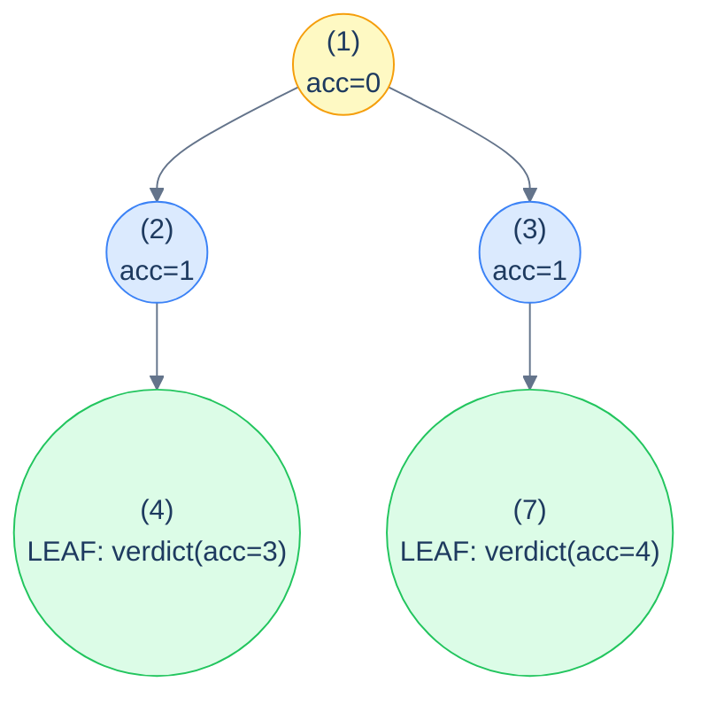

# The stateless root-to-leaf path pattern

```text
recurse(node, accumulator):
  if node is null: return identity            # propagate "no path here"
  newAcc = update(accumulator, node)
  if node is a leaf:                          # path is complete
    return verdict(newAcc)
  leftAnswer  = recurse(node.left,  newAcc)
  rightAnswer = recurse(node.right, newAcc)
  return combine(leftAnswer, rightAnswer)
```

Three pieces to specialise:

1. **`update`** — how the accumulator changes as we descend through the current node (preorder-style).
2. **`verdict`** — at a leaf, what's the answer for *this* root-to-leaf path?
3. **`combine`** — how to combine two children's answers into one parent answer (postorder-style). Common combinators: `OR` for "any path satisfies …", `+` for "count / sum across paths", `max` for "best path".

The *identity* in the base case is whatever value makes `combine` ignore the empty subtree — `false` for OR, `0` for sum, `-∞` for max.

> 🖼 Diagram — Stateless root-to-leaf path pattern — accumulator descends with updates from each node; leaves emit their per-path verdict; internal nodes combine their children's verdicts back up. It's preorder going down + postorder coming up, fused into one recursion.


<p align="center"><strong>Stateless root-to-leaf path pattern — accumulator <strong>descends</strong> with updates from each node; leaves <strong>emit</strong> their per-path verdict; internal nodes <strong>combine</strong> their children's verdicts back up. It's preorder going down + postorder coming up, fused into one recursion.</strong></p>

> *Predict before reading on — what's the difference between this pattern and the stateless preorder pattern from lesson 8?*
>
> Stateless preorder *processes every node* — the answer is whatever each node computes from its ancestor chain. Root-to-leaf-path *only emits an answer at leaves* — the answer for an internal node is combined from its descendants' leaf-emissions. They share the "accumulator down" mechanic but differ in *where* the answer is born and how it propagates back up.

## Generic pattern

We'll show "does any root-to-leaf path sum to target?" as the canonical generic example.


```python run
from typing import Optional

class TreeNode:
    def __init__(self, val=0, left=None, right=None):
        self.val, self.left, self.right = val, left, right

def has_path_sum(root: Optional[TreeNode], target: int) -> bool:
    def go(n, remaining):
        if n is None: return False                     # identity for OR
        remaining -= n.val
        if n.left is None and n.right is None:         # leaf
            return remaining == 0                      # verdict
        return go(n.left, remaining) or go(n.right, remaining)
    return go(root, target)
```

```java run
public static boolean hasPathSum(TreeNode root, int target) {
    if (root == null) return false;
    target -= root.val;
    if (root.left == null && root.right == null) return target == 0;
    return hasPathSum(root.left, target) || hasPathSum(root.right, target);
}
```


## Complexity

> **Time:** O(N). **Space:** O(h) for recursion.

# How to recognise it

The pattern fits when:

- The unit of interest is a **complete root-to-leaf path** (not an arbitrary path inside the tree).
- The check at each leaf depends on info accumulated *along the way down* (path sum, parity status, depth, concatenated value).
- The whole-tree answer combines per-leaf verdicts via `OR` (does any path …), `AND` (do all paths …), `+` (count / sum), or `max` / `min` (best path).

Concrete cues:

- *"Does any root-to-leaf path …"* → `OR` combiner.
- *"Do all root-to-leaf paths …"* → `AND` combiner.
- *"Count root-to-leaf paths where …"* → `+` combiner.
- *"What's the max / min root-to-leaf path …"* → `max` / `min` combiner.

Anti-pattern: if the path can start or end *anywhere* (not just root and leaf), this isn't the right pattern — use the postorder stateful one (diameter, longest monotonic) instead. If the answer needs the *list of nodes* in each path (not just an aggregate), use the *stateful* root-to-leaf-path pattern (next lesson).

<!-- ============================================== -->
<!-- SWEEP 2 — missing sections (placeholders only) -->
<!-- ============================================== -->

<!-- TODO: Understanding the Pattern — missing, needs to be written -->
<!--       Guidance: umbrella H2 with the subsections below -->

<!-- TODO: Why Naive Isn't Enough — missing, needs to be written -->
<!--       Guidance: motivation for why the obvious approach fails -->

<!-- TODO: The Core Idea — missing, needs to be written -->
<!--       Guidance: one paragraph: the central trick -->

<!-- TODO: How the Pointers/Window Move — missing, needs to be written -->
<!--       Guidance: mechanics of the moving parts -->

<!-- TODO: The Generic Algorithm — missing, needs to be written -->
<!--       Guidance: numbered steps, no code -->

<!-- TODO: Generic Implementation — missing, needs to be written -->
<!--       Guidance: Python block + Java block of the skeleton -->

<!-- TODO: Complexity Analysis — missing, needs to be written -->
<!--       Guidance: table -->

<!-- TODO: Variants / Taxonomy — missing, needs to be written -->
<!--       Guidance: enumerate sub-shapes of this pattern -->

<!-- TODO: Identifying — missing, needs to be written -->
<!--       Guidance: per-variant: recognition checklist + canonical example -->

<!-- TODO: Recognition Checklist — missing, needs to be written -->
<!--       Guidance: 4-question diagnostic — the source of the Problem-section Diagnostic Questions -->

<!-- TODO: Canonical Example — missing, needs to be written -->
<!--       Guidance: fully worked example: brute force → optimised → template fit -->

<!-- TODO: Problems in This Category — missing, needs to be written -->
<!--       Guidance: table with links to the 02-problems/ files -->
