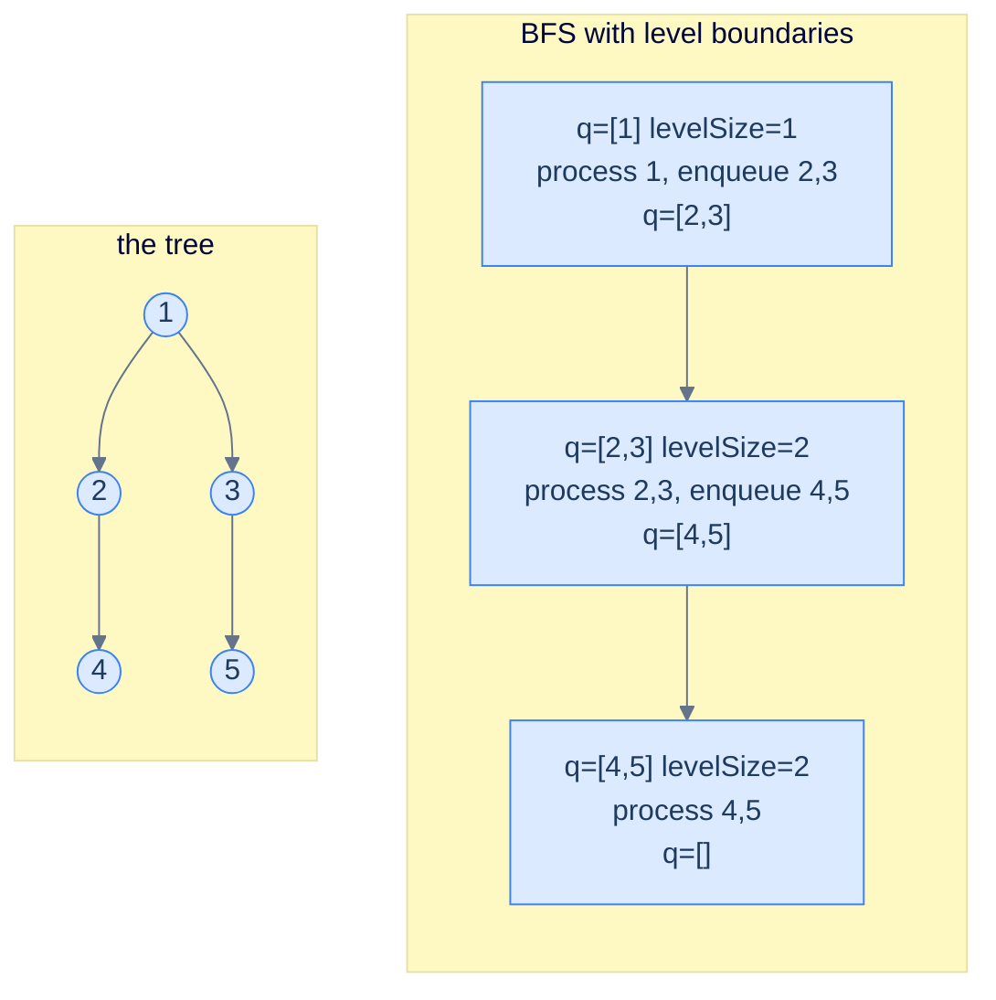
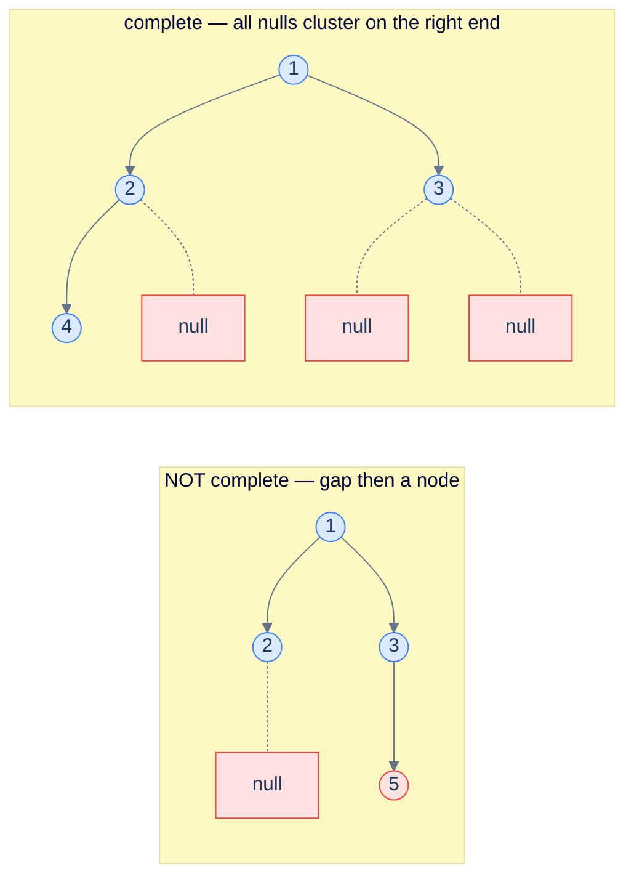

# 14. Pattern: Level-Order Traversal

## The Hook

Every pattern in the chapter so far has been **depth-first**. The recursion barrels down one branch all the way to a leaf, then unwinds, then plunges down the next. That's a beautifully recursive shape, and it's what makes preorder, inorder, and postorder all natural fits for the recursive structure of a tree.

But many real questions about trees aren't *vertical* — they're **horizontal**. *"What's the largest value at each level?"* requires you to fan out across all the nodes at depth 0, then all at depth 1, then all at depth 2. *"Is this a complete binary tree?"* requires walking left-to-right across each level, looking for gaps. *"What does the tree look like from the top? from the side?"* requires processing nodes level by level. None of these questions can be answered cleanly by depth-first traversal — you'd have to do all the depth-first work, then group your results by depth as a post-processing step.

The natural fit for these *horizontal* questions is **breadth-first search** — the level-order traversal you saw in lesson 5, powered by a *queue* instead of a stack. The recursion is replaced by an explicit loop: dequeue a node, do something with it, enqueue its children. The FIFO discipline naturally produces level-by-level visit order. Once you augment the loop to track *level boundaries* — a small trick where you record `queue.size()` at the start of each iteration to know how many nodes belong to the current level — you can compute *anything per level*: sums, maxes, lists, leftmost or rightmost nodes, you name it.

This lesson defines the level-boundary template, walks through five canonical problems (per-level sum, deepest-leaves sum, completeness check, zigzag traversal, cousin check), and implements each in 10 languages.

---

## Table of contents

1. [The level-order pattern](#the-level-order-pattern)
2. [How to recognise it](#how-to-recognise-it)
3. [Problem 1 — Level sum](#problem-1--level-sum)
4. [Problem 2 — Deepest leaves sum](#problem-2--deepest-leaves-sum)
5. [Problem 3 — Complete binary tree check](#problem-3--complete-binary-tree-check)
6. [Problem 4 — Zigzag traversal](#problem-4--zigzag-traversal)
7. [Problem 5 — Cousin check](#problem-5--cousin-check)

***

# The level-order pattern

The classic level-order traversal from lesson 5 dequeues *one node at a time*. That visits everything in the right *order* but loses the *level boundaries* — once you've dequeued five nodes, you have no easy way to know which were on level 1 and which on level 2.

The fix is one of the most important small tricks in tree algorithms:

```text
while queue is non-empty:
  levelSize = queue.size()                       # snapshot how many nodes are on the current level
  for i in 0..levelSize:
    n = queue.pop()
    process(n)                                   # all work for THIS level happens here
    if n.left:  queue.push(n.left)               # enqueueing children populates the NEXT level
    if n.right: queue.push(n.right)
  # any per-level summary (sum, max, snapshot) goes here, after the inner loop
```

The genius is the **`levelSize = queue.size()`** snapshot. At the moment the outer loop's body starts, the queue holds exactly the nodes of the current level — *and nothing else*. So `queue.size()` is the number of nodes on this level, and the inner loop processes precisely that many. By the time the inner loop ends, the queue holds exactly the *next* level (because every dequeued node enqueued its children, who all live on the next level). The boundary is preserved without any per-node bookkeeping.



<p align="center"><strong>BFS with level boundaries — at each iteration of the outer loop, the queue holds exactly one level. The snapshot <code>levelSize = queue.size()</code> at the top of the loop is the entire trick that keeps levels separate.</strong></p>

> *Predict before reading on — what would happen if you forgot the <code>levelSize</code> snapshot and just kept dequeueing?*
>
> You'd flatten everything into a single global stream and lose the level boundaries — exactly what the basic level-order traversal from lesson 5 produces. Forgetting the snapshot is fine when you only need a flat list. It's catastrophic when you need *per-level* aggregates.

## Generic pattern in 10 languages

The "list each level's values" template — the simplest member of the family.


```pseudocode
function levels(root):
    if root = null: return empty list
    out ← empty list
    q   ← empty queue; enqueue root to q
    while q is not empty:
        levelSize ← size of q
        level     ← empty list
        for _ from 1 to levelSize:
            n ← dequeue from q
            append n.val to level
            if n.left  ≠ null: enqueue n.left  to q
            if n.right ≠ null: enqueue n.right to q
        append level to out
    return out
```

```python run
from collections import deque
from typing import List, Optional

class TreeNode:
    def __init__(self, val=0, left=None, right=None):
        self.val, self.left, self.right = val, left, right

def levels(root: Optional[TreeNode]) -> List[List[int]]:
    out: List[List[int]] = []
    if root is None: return out
    q = deque([root])
    while q:
        level_size = len(q)
        level: List[int] = []
        for _ in range(level_size):
            n = q.popleft()
            level.append(n.val)
            if n.left:  q.append(n.left)
            if n.right: q.append(n.right)
        out.append(level)
    return out
```

```java run
public static List<List<Integer>> levels(TreeNode root) {
    List<List<Integer>> out = new ArrayList<>();
    if (root == null) return out;
    Queue<TreeNode> q = new ArrayDeque<>();
    q.offer(root);
    while (!q.isEmpty()) {
        int levelSize = q.size();
        List<Integer> level = new ArrayList<>();
        for (int i = 0; i < levelSize; i++) {
            TreeNode n = q.poll();
            level.add(n.val);
            if (n.left  != null) q.offer(n.left);
            if (n.right != null) q.offer(n.right);
        }
        out.add(level);
    }
    return out;
}
```

```c run
// Output is allocated dynamically; for brevity we assume a fixed cap.
int** levels(TreeNode *root, int *out_levels, int **out_sizes) {
    static int *out[64]; static int sizes[64]; int level_count = 0;
    if (!root) { *out_levels = 0; *out_sizes = sizes; return out; }
    TreeNode *q[1024]; int head = 0, tail = 0;
    q[tail++] = root;
    while (head < tail) {
        int level_size = tail - head;
        out[level_count] = malloc(sizeof(int) * level_size);
        sizes[level_count] = level_size;
        for (int i = 0; i < level_size; i++) {
            TreeNode *n = q[head++];
            out[level_count][i] = n->val;
            if (n->left)  q[tail++] = n->left;
            if (n->right) q[tail++] = n->right;
        }
        level_count++;
    }
    *out_levels = level_count; *out_sizes = sizes;
    return out;
}
```

```scala run
def levels(root: TreeNode): List[List[Int]] = {
  val out = scala.collection.mutable.ListBuffer[List[Int]]()
  if (root == null) return Nil
  val q = scala.collection.mutable.Queue[TreeNode](root)
  while (q.nonEmpty) {
    val levelSize = q.size
    val level = scala.collection.mutable.ListBuffer[Int]()
    for (_ <- 0 until levelSize) {
      val n = q.dequeue()
      level += n.value
      if (n.left  != null) q.enqueue(n.left)
      if (n.right != null) q.enqueue(n.right)
    }
    out += level.toList
  }
  out.toList
}
```


## Complexity

> **Time:** O(N). **Space:** O(W) for the queue, where W is the maximum width (worst case ~N/2 on a perfect tree).

***

# How to recognise it

The pattern fits when:

- The answer at any node depends on its **level** (depth from root) — sum per level, max per level, leftmost per level, etc.
- You need to compute something *per level* and the result is a list-of-things-by-level, or
- Structural completeness needs a *left-to-right* sweep across each level (e.g. "is this tree complete?")

Concrete cues:

- *"… per level"* — almost always BFS with the snapshot trick.
- *"deepest / shallowest level …"* — track the *last* (or first) level's data.
- *"complete / perfect / balanced check (with row-major fill)"* — left-to-right sweep checks for gaps.
- *"zigzag / spiral / boustrophedon"* — alternate direction per level.
- *"width / cousins / left view / right view"* — per-level positional questions.

Anti-pattern: if there's no notion of "level" in the question (path sums, subtree sizes, ancestry checks), depth-first patterns will be cleaner.

***

# Problem 1 — Level sum

> Return a list where the *i*-th entry is the sum of all node values at level *i*.

Apply the template directly: at the top of each outer-loop iteration, accumulate `levelSum = 0`; in the inner loop, add each node's value; after the inner loop, append `levelSum` to the output.

## Solution


```pseudocode
function levelSum(root):
    if root = null: return empty list
    out ← empty list; q ← empty queue; enqueue root to q
    while q is not empty:
        sz ← size of q; s ← 0
        for _ from 1 to sz:
            n ← dequeue from q
            s ← s + n.val
            if n.left  ≠ null: enqueue n.left  to q
            if n.right ≠ null: enqueue n.right to q
        append s to out
    return out
```

```python run
def level_sum(root):
    out = []
    if root is None: return out
    q = deque([root])
    while q:
        sz = len(q); s = 0
        for _ in range(sz):
            n = q.popleft()
            s += n.val
            if n.left:  q.append(n.left)
            if n.right: q.append(n.right)
        out.append(s)
    return out
```

```java run
public static List<Integer> levelSum(TreeNode root) {
    List<Integer> out = new ArrayList<>();
    if (root == null) return out;
    Queue<TreeNode> q = new ArrayDeque<>(); q.offer(root);
    while (!q.isEmpty()) {
        int sz = q.size(), s = 0;
        for (int i = 0; i < sz; i++) {
            TreeNode n = q.poll();
            s += n.val;
            if (n.left  != null) q.offer(n.left);
            if (n.right != null) q.offer(n.right);
        }
        out.add(s);
    }
    return out;
}
```

```c run
int* level_sum(TreeNode *root, int *count) {
    static int out[64]; *count = 0;
    if (!root) return out;
    TreeNode *q[1024]; int h = 0, t = 0;
    q[t++] = root;
    while (h < t) {
        int sz = t - h, s = 0;
        for (int i = 0; i < sz; i++) {
            TreeNode *n = q[h++];
            s += n->val;
            if (n->left)  q[t++] = n->left;
            if (n->right) q[t++] = n->right;
        }
        out[(*count)++] = s;
    }
    return out;
}
```

```scala run
def levelSum(root: TreeNode): List[Int] = {
  if (root == null) return Nil
  val out = scala.collection.mutable.ListBuffer[Int]()
  val q = scala.collection.mutable.Queue[TreeNode](root)
  while (q.nonEmpty) {
    val sz = q.size; var s = 0
    for (_ <- 0 until sz) {
      val n = q.dequeue()
      s += n.value
      if (n.left  != null) q.enqueue(n.left)
      if (n.right != null) q.enqueue(n.right)
    }
    out += s
  }
  out.toList
}
```


***

# Problem 2 — Deepest leaves sum

> Return the sum of the values of the leaves on the deepest level of the tree.

Same shape as level-sum, but instead of recording every level we just *overwrite* a single `levelSum` variable each iteration. After the loop ends, `levelSum` holds the sum of the deepest level. (Note: every node on the deepest level is a leaf.)

## Solution


```pseudocode
function deepestLeavesSum(root):
    if root = null: return 0
    q ← empty queue; enqueue root to q; s ← 0
    while q is not empty:
        s ← 0                              # reset each level; last iteration = deepest
        for _ from 1 to size of q:
            n ← dequeue from q
            s ← s + n.val
            if n.left  ≠ null: enqueue n.left  to q
            if n.right ≠ null: enqueue n.right to q
    return s
```

```python run
def deepest_leaves_sum(root):
    if root is None: return 0
    q = deque([root]); s = 0
    while q:
        s = 0
        for _ in range(len(q)):
            n = q.popleft()
            s += n.val
            if n.left:  q.append(n.left)
            if n.right: q.append(n.right)
    return s
```

```java run
public static int deepestLeavesSum(TreeNode root) {
    if (root == null) return 0;
    Queue<TreeNode> q = new ArrayDeque<>(); q.offer(root);
    int s = 0;
    while (!q.isEmpty()) {
        int sz = q.size(); s = 0;
        for (int i = 0; i < sz; i++) {
            TreeNode n = q.poll();
            s += n.val;
            if (n.left  != null) q.offer(n.left);
            if (n.right != null) q.offer(n.right);
        }
    }
    return s;
}
```

```c run
int deepest_leaves_sum(TreeNode *root) {
    if (!root) return 0;
    TreeNode *q[1024]; int h = 0, t = 0; q[t++] = root;
    int s = 0;
    while (h < t) {
        int sz = t - h; s = 0;
        for (int i = 0; i < sz; i++) {
            TreeNode *n = q[h++];
            s += n->val;
            if (n->left)  q[t++] = n->left;
            if (n->right) q[t++] = n->right;
        }
    }
    return s;
}
```

```scala run
def deepestLeavesSum(root: TreeNode): Int = {
  if (root == null) return 0
  val q = scala.collection.mutable.Queue[TreeNode](root); var s = 0
  while (q.nonEmpty) {
    val sz = q.size; s = 0
    for (_ <- 0 until sz) {
      val n = q.dequeue()
      s += n.value
      if (n.left  != null) q.enqueue(n.left)
      if (n.right != null) q.enqueue(n.right)
    }
  }
  s
}
```


***

# Problem 3 — Complete binary tree check

> Return `true` iff the tree is *complete* — every level full except possibly the last, which is filled left-to-right with no gaps.

Trick: do a level-order traversal that **enqueues `null` children too** (don't skip them). Walk the queue; the moment you see a `null`, set a flag; if you ever see a *non-null* node *after* the flag is set, the tree is not complete (gap detected). If you finish without that happening, it's complete.



<p align="center"><strong>Completeness check — enqueue every child including nulls. Walk the resulting queue; once you've seen a null, no real node may follow. The left tree fails because node 5 follows a null.</strong></p>

## Solution


```pseudocode
function isComplete(root):
    if root = null: return true
    q ← empty queue; enqueue root to q; seenNull ← false
    while q is not empty:
        n ← dequeue from q
        if n = null:
            seenNull ← true
        else:
            if seenNull: return false   # non-null after null → gap → not complete
            enqueue n.left  to q        # enqueue even if null (sentinel check)
            enqueue n.right to q
    return true
```

```python run
def is_complete(root):
    if root is None: return True
    q = deque([root]); seen_null = False
    while q:
        n = q.popleft()
        if n is None:
            seen_null = True
        else:
            if seen_null: return False
            q.append(n.left); q.append(n.right)
    return True
```

```java run
public static boolean isComplete(TreeNode root) {
    if (root == null) return true;
    Deque<TreeNode> q = new ArrayDeque<>();
    // ArrayDeque can't store null; use LinkedList for null support, OR use a sentinel.
    Queue<TreeNode> qq = new java.util.LinkedList<>();
    qq.offer(root);
    boolean seenNull = false;
    while (!qq.isEmpty()) {
        TreeNode n = qq.poll();
        if (n == null) seenNull = true;
        else {
            if (seenNull) return false;
            qq.offer(n.left); qq.offer(n.right);
        }
    }
    return true;
}
```

```c run
int is_complete(TreeNode *root) {
    if (!root) return 1;
    TreeNode *q[1024]; int h = 0, t = 0;
    q[t++] = root;
    int seen_null = 0;
    while (h < t) {
        TreeNode *n = q[h++];
        if (!n) seen_null = 1;
        else {
            if (seen_null) return 0;
            q[t++] = n->left; q[t++] = n->right;
        }
    }
    return 1;
}
```

```scala run
def isComplete(root: TreeNode): Boolean = {
  if (root == null) return true
  val q = scala.collection.mutable.Queue[TreeNode](root)
  var seenNull = false
  while (q.nonEmpty) {
    val n = q.dequeue()
    if (n == null) seenNull = true
    else {
      if (seenNull) return false
      q.enqueue(n.left); q.enqueue(n.right)
    }
  }
  true
}
```


***

# Problem 4 — Zigzag traversal

> Return the level-order traversal where the *direction* alternates per level: level 0 left-to-right, level 1 right-to-left, level 2 left-to-right, …

Same template, but pre-allocate the level array and *write into it from either end* depending on a `reverse` boolean that flips each iteration. Avoids per-level reversal at the cost of one extra index.

## Solution


```pseudocode
function zigzagTraversal(root):
    if root = null: return empty list
    out ← empty list; q ← empty queue; enqueue root to q; reverse ← false
    while q is not empty:
        sz    ← size of q
        level ← array of size sz
        for i from 0 to sz − 1:
            n ← dequeue from q
            level[sz − 1 − i if reverse else i] ← n.val   # fill from end on odd levels
            if n.left  ≠ null: enqueue n.left  to q
            if n.right ≠ null: enqueue n.right to q
        append level to out
        reverse ← NOT reverse
    return out
```

```python run
def zigzag_traversal(root):
    out = []
    if root is None: return out
    q = deque([root]); reverse = False
    while q:
        sz = len(q)
        level = [0] * sz
        for i in range(sz):
            n = q.popleft()
            level[sz - 1 - i if reverse else i] = n.val
            if n.left:  q.append(n.left)
            if n.right: q.append(n.right)
        out.append(level)
        reverse = not reverse
    return out
```

```java run
public static List<List<Integer>> zigzagTraversal(TreeNode root) {
    List<List<Integer>> out = new ArrayList<>();
    if (root == null) return out;
    Queue<TreeNode> q = new ArrayDeque<>(); q.offer(root);
    boolean reverse = false;
    while (!q.isEmpty()) {
        int sz = q.size();
        Integer[] level = new Integer[sz];
        for (int i = 0; i < sz; i++) {
            TreeNode n = q.poll();
            level[reverse ? sz - 1 - i : i] = n.val;
            if (n.left  != null) q.offer(n.left);
            if (n.right != null) q.offer(n.right);
        }
        out.add(Arrays.asList(level));
        reverse = !reverse;
    }
    return out;
}
```

```c run
// (omitted — output is a 2D array; algorithm same as above)
```

```scala run
def zigzagTraversal(root: TreeNode): List[List[Int]] = {
  val out = scala.collection.mutable.ListBuffer[List[Int]]()
  if (root == null) return Nil
  val q = scala.collection.mutable.Queue[TreeNode](root)
  var reverse = false
  while (q.nonEmpty) {
    val sz = q.size
    val level = Array.ofDim[Int](sz)
    for (i <- 0 until sz) {
      val n = q.dequeue()
      level(if (reverse) sz - 1 - i else i) = n.value
      if (n.left  != null) q.enqueue(n.left)
      if (n.right != null) q.enqueue(n.right)
    }
    out += level.toList
    reverse = !reverse
  }
  out.toList
}
```


***

# Problem 5 — Cousin check

> Two nodes are *cousins* if they're at the same depth and have *different* parents. Given two values `valA` and `valB`, return `true` iff their nodes are cousins.

Augment the BFS so each enqueued item carries *both* the node and its parent. As we walk a level, look for the two target values; if both are found on the same level *and* they have different parents, return `true`. If only one is found on a level, they're not at the same depth, return `false`.

## Solution


```pseudocode
function cousinCheck(root, valA, valB):
    if root = null: return false
    q ← empty queue; enqueue (root, null) to q   # (node, parent) pairs
    while q is not empty:
        sz ← size of q; pa ← null; pb ← null
        for _ from 1 to sz:
            (n, p) ← dequeue from q
            if n.val = valA: pa ← p
            if n.val = valB: pb ← p
            if n.left  ≠ null: enqueue (n.left,  n) to q
            if n.right ≠ null: enqueue (n.right, n) to q
        if pa ≠ null AND pb ≠ null: return pa ≠ pb   # same depth, different parents
        if pa ≠ null OR  pb ≠ null: return false      # different depths
    return false
```

```python run
def cousin_check(root, val_a, val_b):
    if root is None: return False
    q = deque([(root, None)])
    while q:
        sz = len(q); pa, pb = None, None
        for _ in range(sz):
            n, p = q.popleft()
            if n.val == val_a: pa = p
            if n.val == val_b: pb = p
            if n.left:  q.append((n.left,  n))
            if n.right: q.append((n.right, n))
        if pa and pb: return pa is not pb
        if pa or  pb: return False
    return False
```

```java run
static class NP { TreeNode n, p; NP(TreeNode n, TreeNode p){ this.n=n; this.p=p; } }
public static boolean cousinCheck(TreeNode root, int valA, int valB) {
    if (root == null) return false;
    Queue<NP> q = new ArrayDeque<>(); q.offer(new NP(root, null));
    while (!q.isEmpty()) {
        int sz = q.size();
        TreeNode pa = null, pb = null;
        for (int i = 0; i < sz; i++) {
            NP cur = q.poll();
            if (cur.n.val == valA) pa = cur.p;
            if (cur.n.val == valB) pb = cur.p;
            if (cur.n.left  != null) q.offer(new NP(cur.n.left,  cur.n));
            if (cur.n.right != null) q.offer(new NP(cur.n.right, cur.n));
        }
        if (pa != null && pb != null) return pa != pb;
        if (pa != null || pb != null) return false;
    }
    return false;
}
```

```c run
typedef struct { TreeNode *n; TreeNode *p; } NP;
int cousin_check(TreeNode *root, int valA, int valB) {
    if (!root) return 0;
    NP q[1024]; int h = 0, t = 0;
    q[t++] = (NP){root, NULL};
    while (h < t) {
        int sz = t - h;
        TreeNode *pa = NULL, *pb = NULL;
        for (int i = 0; i < sz; i++) {
            NP cur = q[h++];
            if (cur.n->val == valA) pa = cur.p;
            if (cur.n->val == valB) pb = cur.p;
            if (cur.n->left)  q[t++] = (NP){cur.n->left,  cur.n};
            if (cur.n->right) q[t++] = (NP){cur.n->right, cur.n};
        }
        if (pa && pb) return pa != pb;
        if (pa || pb) return 0;
    }
    return 0;
}
```

```scala run
def cousinCheck(root: TreeNode, valA: Int, valB: Int): Boolean = {
  if (root == null) return false
  case class NP(n: TreeNode, p: TreeNode)
  val q = scala.collection.mutable.Queue[NP](NP(root, null))
  while (q.nonEmpty) {
    val sz = q.size
    var pa: TreeNode = null; var pb: TreeNode = null
    for (_ <- 0 until sz) {
      val cur = q.dequeue()
      if (cur.n.value == valA) pa = cur.p
      if (cur.n.value == valB) pb = cur.p
      if (cur.n.left  != null) q.enqueue(NP(cur.n.left,  cur.n))
      if (cur.n.right != null) q.enqueue(NP(cur.n.right, cur.n))
    }
    if (pa != null && pb != null) return pa ne pb
    if (pa != null || pb != null) return false
  }
  false
}
```


***

## Final Takeaway

Level-order is your hammer for any *horizontal* question about a tree. Three things to walk away with:

1. **`levelSize = queue.size()` is the entire trick.** That single snapshot at the top of each outer-loop iteration is what separates "flat BFS" from "BFS with level boundaries". Once it's muscle memory, every per-level question becomes mechanical.
2. **Enqueue children, not always non-null.** For most problems (sum, max, list per level) you skip null children. For *completeness* checks you enqueue them deliberately so you can spot gaps. The choice depends on the question.
3. **Augment the queue when you need parents.** The cousin-check trick — enqueueing `(node, parent)` pairs — generalises: any per-node side-info you need (depth, column, path-from-root, sibling) can travel alongside the node. Don't try to retrofit it; bake it into the queue's element type.

> *Coming up — the next lesson takes level-order to <strong>two dimensions</strong>. Instead of grouping nodes by their <em>level</em>, we'll group by their <em>horizontal column</em> — yielding the tree's "top view", "bottom view", and "vertical traversal". Same BFS engine, an extra coordinate per queue entry.*
