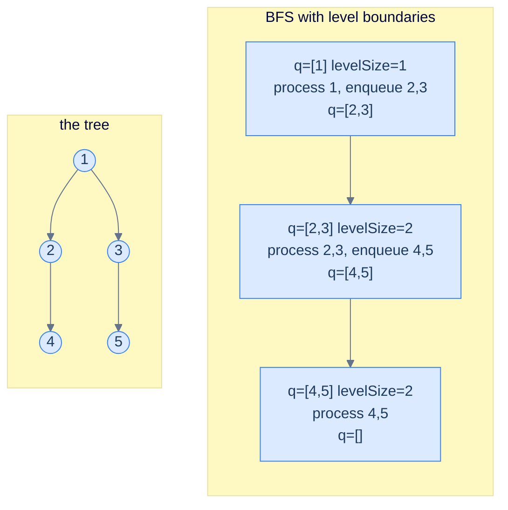
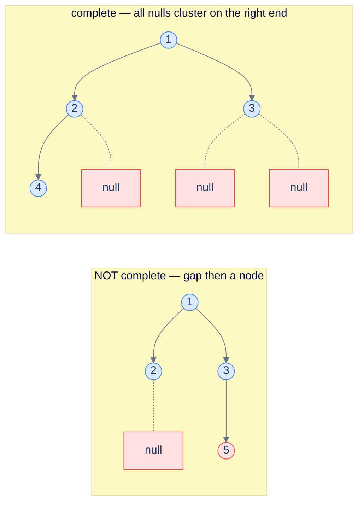

# 14. Pattern: Level-Order Traversal

## The Hook

Every pattern in the chapter so far has been **depth-first**. The recursion barrels down one branch all the way to a leaf, then unwinds, then plunges down the next. That's a beautifully recursive shape, and it's what makes preorder, inorder, and postorder all natural fits for the recursive structure of a tree.

But many real questions about trees aren't *vertical* — they're **horizontal**. *"What's the largest value at each level?"* requires you to fan out across all the nodes at depth 0, then all at depth 1, then all at depth 2. *"Is this a complete binary tree?"* requires walking left-to-right across each level, looking for gaps. *"What does the tree look like from the top? from the side?"* requires processing nodes level by level. None of these questions can be answered cleanly by depth-first traversal — you'd have to do all the depth-first work, then group your results by depth as a post-processing step.

The natural fit for these *horizontal* questions is **breadth-first search** — the level-order traversal you saw in lesson 5, powered by a *queue* instead of a stack. The recursion is replaced by an explicit loop: dequeue a node, do something with it, enqueue its children. The FIFO discipline naturally produces level-by-level visit order. Once you augment the loop to track *level boundaries* — a small trick where you record `queue.size()` at the start of each iteration to know how many nodes belong to the current level — you can compute *anything per level*: sums, maxes, lists, leftmost or rightmost nodes, you name it.

This lesson defines the level-boundary template, walks through five canonical problems (per-level sum, deepest-leaves sum, completeness check, zigzag traversal, cousin check), and implements each in Python and Java.

---

## Table of contents

1. [The level-order pattern](#the-level-order-pattern)
2. [How to recognise it](#how-to-recognise-it)
3. [Problem 1 — Level sum](#problem-1--level-sum)
4. [Problem 2 — Deepest leaves sum](#problem-2--deepest-leaves-sum)
5. [Problem 3 — Complete binary tree check](#problem-3--complete-binary-tree-check)
6. [Problem 4 — Zigzag traversal](#problem-4--zigzag-traversal)
7. [Problem 5 — Cousin check](#problem-5--cousin-check)

***

# The level-order pattern

The classic level-order traversal from lesson 5 dequeues *one node at a time*. That visits everything in the right *order* but loses the *level boundaries* — once you've dequeued five nodes, you have no easy way to know which were on level 1 and which on level 2.

The fix is one of the most important small tricks in tree algorithms:

```text
while queue is non-empty:
  levelSize = queue.size()                       # snapshot how many nodes are on the current level
  for i in 0..levelSize:
    n = queue.pop()
    process(n)                                   # all work for THIS level happens here
    if n.left:  queue.push(n.left)               # enqueueing children populates the NEXT level
    if n.right: queue.push(n.right)
  # any per-level summary (sum, max, snapshot) goes here, after the inner loop
```

The genius is the **`levelSize = queue.size()`** snapshot. At the moment the outer loop's body starts, the queue holds exactly the nodes of the current level — *and nothing else*. So `queue.size()` is the number of nodes on this level, and the inner loop processes precisely that many. By the time the inner loop ends, the queue holds exactly the *next* level (because every dequeued node enqueued its children, who all live on the next level). The boundary is preserved without any per-node bookkeeping.



<p align="center"><strong>BFS with level boundaries — at each iteration of the outer loop, the queue holds exactly one level. The snapshot <code>levelSize = queue.size()</code> at the top of the loop is the entire trick that keeps levels separate.</strong></p>

> *Predict before reading on — what would happen if you forgot the <code>levelSize</code> snapshot and just kept dequeueing?*
>
> You'd flatten everything into a single global stream and lose the level boundaries — exactly what the basic level-order traversal from lesson 5 produces. Forgetting the snapshot is fine when you only need a flat list. It's catastrophic when you need *per-level* aggregates.

## Generic pattern

The "list each level's values" template — the simplest member of the family.


```python run
from collections import deque
from typing import List, Optional

class TreeNode:
    def __init__(self, val=0, left=None, right=None):
        self.val, self.left, self.right = val, left, right

def levels(root: Optional[TreeNode]) -> List[List[int]]:
    out: List[List[int]] = []
    if root is None: return out
    q = deque([root])
    while q:
        level_size = len(q)
        level: List[int] = []
        for _ in range(level_size):
            n = q.popleft()
            level.append(n.val)
            if n.left:  q.append(n.left)
            if n.right: q.append(n.right)
        out.append(level)
    return out
```

```java run
public static List<List<Integer>> levels(TreeNode root) {
    List<List<Integer>> out = new ArrayList<>();
    if (root == null) return out;
    Queue<TreeNode> q = new ArrayDeque<>();
    q.offer(root);
    while (!q.isEmpty()) {
        int levelSize = q.size();
        List<Integer> level = new ArrayList<>();
        for (int i = 0; i < levelSize; i++) {
            TreeNode n = q.poll();
            level.add(n.val);
            if (n.left  != null) q.offer(n.left);
            if (n.right != null) q.offer(n.right);
        }
        out.add(level);
    }
    return out;
}
```


## Complexity

> **Time:** O(N). **Space:** O(W) for the queue, where W is the maximum width (worst case ~N/2 on a perfect tree).

***

# How to recognise it

The pattern fits when:

- The answer at any node depends on its **level** (depth from root) — sum per level, max per level, leftmost per level, etc.
- You need to compute something *per level* and the result is a list-of-things-by-level, or
- Structural completeness needs a *left-to-right* sweep across each level (e.g. "is this tree complete?")

Concrete cues:

- *"… per level"* — almost always BFS with the snapshot trick.
- *"deepest / shallowest level …"* — track the *last* (or first) level's data.
- *"complete / perfect / balanced check (with row-major fill)"* — left-to-right sweep checks for gaps.
- *"zigzag / spiral / boustrophedon"* — alternate direction per level.
- *"width / cousins / left view / right view"* — per-level positional questions.

Anti-pattern: if there's no notion of "level" in the question (path sums, subtree sizes, ancestry checks), depth-first patterns will be cleaner.

***

# Problem 1 — Level sum

> Return a list where the *i*-th entry is the sum of all node values at level *i*.

Apply the template directly: at the top of each outer-loop iteration, accumulate `levelSum = 0`; in the inner loop, add each node's value; after the inner loop, append `levelSum` to the output.

<details>
<summary><h2>Solution</h2></summary>


```python run
from queue import Queue
from typing import List, Optional


class TreeNode:
    def __init__(self, val=0, left=None, right=None):
        self.val = val
        self.left = left
        self.right = right


def from_level_order(values):
    """Build tree from list like [1, 2, 3, None, 4]. None means missing child."""
    if not values:
        return None
    root = TreeNode(values[0])
    queue = [root]
    i = 1
    while queue and i < len(values):
        node = queue.pop(0)
        if i < len(values) and values[i] is not None:
            node.left = TreeNode(values[i])
            queue.append(node.left)
        i += 1
        if i < len(values) and values[i] is not None:
            node.right = TreeNode(values[i])
            queue.append(node.right)
        i += 1
    return root


class Solution:
    def level_sum(self, root: Optional[TreeNode]) -> List[int]:
        level_sums: List[int] = []
        if not root:
            return level_sums

        queue = Queue()
        queue.put(root)

        # Loop through each level in the tree
        while not queue.empty():

            # Get the size of the current level
            level_size = queue.qsize()
            level_sum = 0

            # Loop through each node in the current level
            for _ in range(level_size):

                # Get the front node in the queue and remove it
                node = queue.get()

                # Add the node's value to the current level sum
                level_sum += node.val

                # Add the node's children to the queue if they exist
                if node.left:
                    queue.put(node.left)

                if node.right:
                    queue.put(node.right)

            # Add the current level sum to the level_sums list
            level_sums.append(level_sum)

        return level_sums


# Examples from the problem statement
print(Solution().level_sum(from_level_order([1, 2, 3, 4, None, None, 7])))   # [1, 5, 11]
print(Solution().level_sum(from_level_order([1, 8, 4, None, None, 2, 7])))   # [1, 12, 9]

# Edge cases
print(Solution().level_sum(None))                                             # []
print(Solution().level_sum(TreeNode(42)))                                     # [42]
print(Solution().level_sum(from_level_order([1, 2, None, 3, None, 4])))      # [1, 2, 3, 4] left skew
print(Solution().level_sum(from_level_order([1, None, 2, None, None, None, 3])))  # [1, 2, 3] right skew
print(Solution().level_sum(from_level_order([5, 5, 5, 5, 5, 5, 5])))         # [5, 10, 20] full balanced
```

```java run
import java.util.*;

public class Main {
    static class TreeNode {
        int val;
        TreeNode left;
        TreeNode right;
        TreeNode() {}
        TreeNode(int val) { this.val = val; }
    }

    static TreeNode fromLevelOrder(Integer... values) {
        if (values.length == 0 || values[0] == null) return null;
        TreeNode root = new TreeNode(values[0]);
        java.util.Deque<TreeNode> queue = new java.util.ArrayDeque<>();
        queue.add(root);
        int i = 1;
        while (!queue.isEmpty() && i < values.length) {
            TreeNode node = queue.poll();
            if (i < values.length && values[i] != null) {
                node.left = new TreeNode(values[i]);
                queue.add(node.left);
            }
            i++;
            if (i < values.length && values[i] != null) {
                node.right = new TreeNode(values[i]);
                queue.add(node.right);
            }
            i++;
        }
        return root;
    }

    static class Solution {
        public List<Integer> levelSum(TreeNode root) {
            List<Integer> levelSums = new ArrayList<>();
            if (root == null) {
                return levelSums;
            }

            Queue<TreeNode> queue = new LinkedList<>();
            queue.add(root);

            // Loop through each level in the tree
            while (!queue.isEmpty()) {

                // Get the size of the current level
                int levelSize = queue.size();
                int levelSum = 0;

                // Loop through each node in the current level
                for (int i = 0; i < levelSize; i++) {

                    // Get the front node in the queue and remove it
                    TreeNode node = queue.poll();

                    // Add the node's value to the current level sum
                    levelSum += node.val;

                    // Add the node's children to the queue if they exist
                    if (node.left != null) {
                        queue.add(node.left);
                    }

                    if (node.right != null) {
                        queue.add(node.right);
                    }
                }

                // Add the current level sum to the levelSums list
                levelSums.add(levelSum);
            }

            return levelSums;
        }
    }

    public static void main(String[] args) {
        // Examples from the problem statement
        System.out.println(new Solution().levelSum(fromLevelOrder(1, 2, 3, 4, null, null, 7)));   // [1, 5, 11]
        System.out.println(new Solution().levelSum(fromLevelOrder(1, 8, 4, null, null, 2, 7)));   // [1, 12, 9]

        // Edge cases
        System.out.println(new Solution().levelSum(null));                                         // []
        System.out.println(new Solution().levelSum(new TreeNode(42)));                             // [42]
        System.out.println(new Solution().levelSum(fromLevelOrder(1, 2, null, 3)));               // [1, 2, 3] left skew
        System.out.println(new Solution().levelSum(fromLevelOrder(1, null, 2, null, null, null, 3)));  // [1, 2, 3] right skew
        System.out.println(new Solution().levelSum(fromLevelOrder(5, 5, 5, 5, 5, 5, 5)));         // [5, 10, 20] full balanced
    }
}
```

</details>


***

# Problem 2 — Deepest leaves sum

> Return the sum of the values of the leaves on the deepest level of the tree.

Same shape as level-sum, but instead of recording every level we just *overwrite* a single `levelSum` variable each iteration. After the loop ends, `levelSum` holds the sum of the deepest level. (Note: every node on the deepest level is a leaf.)

<details>
<summary><h2>Solution</h2></summary>


```python run
from queue import Queue
from typing import Optional


class TreeNode:
    def __init__(self, val=0, left=None, right=None):
        self.val = val
        self.left = left
        self.right = right


def from_level_order(values):
    """Build tree from list like [1, 2, 3, None, 4]. None means missing child."""
    if not values:
        return None
    root = TreeNode(values[0])
    queue = [root]
    i = 1
    while queue and i < len(values):
        node = queue.pop(0)
        if i < len(values) and values[i] is not None:
            node.left = TreeNode(values[i])
            queue.append(node.left)
        i += 1
        if i < len(values) and values[i] is not None:
            node.right = TreeNode(values[i])
            queue.append(node.right)
        i += 1
    return root


class Solution:
    def deepest_leaves_sum(self, root: Optional[TreeNode]) -> int:

        # If the tree is empty, return 0
        if not root:
            return 0

        queue = Queue()
        queue.put(root)

        # Variable to store the level_sum of the deepest leaves
        level_sum = 0

        # Loop through each level in the tree
        while not queue.empty():

            # Get the size of the current level
            level_size = queue.qsize()

            # Reset level_sum for the current level
            level_sum = 0

            # Loop through each node in the current level
            for _ in range(level_size):

                # Get the front node in the queue and remove it
                node = queue.get()

                # Add its value to the level_sum
                level_sum += node.val

                # Add the node's children to the queue if they exist
                if node.left:
                    queue.put(node.left)

                if node.right:
                    queue.put(node.right)

        # The last computed level_sum is for the deepest level
        return level_sum


# Examples from the problem statement
print(Solution().deepest_leaves_sum(from_level_order([1, 2, 1, 7, None, None, 1])))  # 8
print(Solution().deepest_leaves_sum(from_level_order([1, 6, 5, None, None, 2, 7])))  # 9

# Edge cases
print(Solution().deepest_leaves_sum(None))                                            # 0
print(Solution().deepest_leaves_sum(TreeNode(7)))                                     # 7
print(Solution().deepest_leaves_sum(from_level_order([1, 2, None, 3, None, 4])))     # 4 left skew
print(Solution().deepest_leaves_sum(from_level_order([1, None, 2, None, None, None, 3])))  # 3 right skew
print(Solution().deepest_leaves_sum(from_level_order([1, 2, 3])))                    # 5 balanced two children
```

```java run
import java.util.*;

public class Main {
    static class TreeNode {
        int val;
        TreeNode left;
        TreeNode right;
        TreeNode() {}
        TreeNode(int val) { this.val = val; }
    }

    static TreeNode fromLevelOrder(Integer... values) {
        if (values.length == 0 || values[0] == null) return null;
        TreeNode root = new TreeNode(values[0]);
        java.util.Deque<TreeNode> queue = new java.util.ArrayDeque<>();
        queue.add(root);
        int i = 1;
        while (!queue.isEmpty() && i < values.length) {
            TreeNode node = queue.poll();
            if (i < values.length && values[i] != null) {
                node.left = new TreeNode(values[i]);
                queue.add(node.left);
            }
            i++;
            if (i < values.length && values[i] != null) {
                node.right = new TreeNode(values[i]);
                queue.add(node.right);
            }
            i++;
        }
        return root;
    }

    static class Solution {
        public int deepestLeavesSum(TreeNode root) {

            // If the tree is empty, return 0
            if (root == null) {
                return 0;
            }

            Queue<TreeNode> queue = new LinkedList<>();
            queue.add(root);

            // Variable to store the levelSum of the deepest leaves
            int levelSum = 0;

            // Loop through each level in the tree
            while (!queue.isEmpty()) {

                // Get the size of the current level
                int levelSize = queue.size();

                // Reset levelSum for the current level
                levelSum = 0;

                // Loop through each node in the current level
                for (int i = 0; i < levelSize; ++i) {

                    // Get the front node in the queue and remove it
                    TreeNode node = queue.poll();

                    // Add its value to the levelSum
                    levelSum += node.val;

                    // Add the node's children to the queue if they exist
                    if (node.left != null) {
                        queue.add(node.left);
                    }

                    if (node.right != null) {
                        queue.add(node.right);
                    }
                }
            }

            // The last computed levelSum is for the deepest level
            return levelSum;
        }
    }

    public static void main(String[] args) {
        // Examples from the problem statement
        System.out.println(new Solution().deepestLeavesSum(fromLevelOrder(1, 2, 1, 7, null, null, 1)));  // 8
        System.out.println(new Solution().deepestLeavesSum(fromLevelOrder(1, 6, 5, null, null, 2, 7)));  // 9

        // Edge cases
        System.out.println(new Solution().deepestLeavesSum(null));                                        // 0
        System.out.println(new Solution().deepestLeavesSum(new TreeNode(7)));                             // 7
        System.out.println(new Solution().deepestLeavesSum(fromLevelOrder(1, 2, null, 3)));              // 4 left skew
        System.out.println(new Solution().deepestLeavesSum(fromLevelOrder(1, null, 2, null, null, null, 3)));  // 3 right skew
        System.out.println(new Solution().deepestLeavesSum(fromLevelOrder(1, 2, 3)));                    // 5 balanced two children
    }
}
```

</details>


***

# Problem 3 — Complete binary tree check

> Return `true` iff the tree is *complete* — every level full except possibly the last, which is filled left-to-right with no gaps.

Trick: do a level-order traversal that **enqueues `null` children too** (don't skip them). Walk the queue; the moment you see a `null`, set a flag; if you ever see a *non-null* node *after* the flag is set, the tree is not complete (gap detected). If you finish without that happening, it's complete.



<p align="center"><strong>Completeness check — enqueue every child including nulls. Walk the resulting queue; once you've seen a null, no real node may follow. The left tree fails because node 5 follows a null.</strong></p>

<details>
<summary><h2>Solution</h2></summary>


```python run
def is_complete(root):
    if root is None: return True
    q = deque([root]); seen_null = False
    while q:
        n = q.popleft()
        if n is None:
            seen_null = True
        else:
            if seen_null: return False
            q.append(n.left); q.append(n.right)
    return True
```

```java run
public static boolean isComplete(TreeNode root) {
    if (root == null) return true;
    Deque<TreeNode> q = new ArrayDeque<>();
    // ArrayDeque can't store null; use LinkedList for null support, OR use a sentinel.
    Queue<TreeNode> qq = new java.util.LinkedList<>();
    qq.offer(root);
    boolean seenNull = false;
    while (!qq.isEmpty()) {
        TreeNode n = qq.poll();
        if (n == null) seenNull = true;
        else {
            if (seenNull) return false;
            qq.offer(n.left); qq.offer(n.right);
        }
    }
    return true;
}
```

</details>


***

# Problem 4 — Zigzag traversal

> Return the level-order traversal where the *direction* alternates per level: level 0 left-to-right, level 1 right-to-left, level 2 left-to-right, …

Same template, but pre-allocate the level array and *write into it from either end* depending on a `reverse` boolean that flips each iteration. Avoids per-level reversal at the cost of one extra index.

<details>
<summary><h2>Solution</h2></summary>


```python run
from queue import Queue
from typing import Optional, List


class TreeNode:
    def __init__(self, val=0, left=None, right=None):
        self.val = val
        self.left = left
        self.right = right


def from_level_order(values):
    """Build tree from list like [1, 2, 3, None, 4]. None means missing child."""
    if not values:
        return None
    root = TreeNode(values[0])
    queue = [root]
    i = 1
    while queue and i < len(values):
        node = queue.pop(0)
        if i < len(values) and values[i] is not None:
            node.left = TreeNode(values[i])
            queue.append(node.left)
        i += 1
        if i < len(values) and values[i] is not None:
            node.right = TreeNode(values[i])
            queue.append(node.right)
        i += 1
    return root


class Solution:
    def zigzag_traversal(
        self, root: Optional[TreeNode]
    ) -> List[List[int]]:
        zigzag_levels: List[List[int]] = []
        if not root:
            return zigzag_levels

        queue = Queue()
        queue.put(root)

        # Flag to indicate the direction of traversal
        reverse = False

        # Loop through each level in the tree
        while not queue.empty():

            # Get the size of the current level
            level_size = queue.qsize()

            # Initialize the list to store the nodes in the current
            # level. The size of the list is equal to the number of
            # nodes in the current level.
            level = [0] * level_size

            # Loop through each node in the current level
            for i in range(level_size):

                # Get the front node in the queue and remove it
                node = queue.get()

                # Fill level list based on the direction of traversal
                if reverse:
                    level[level_size - i - 1] = node.val
                else:
                    level[i] = node.val

                # Add the node's children to the queue if they exist
                if node.left:
                    queue.put(node.left)

                if node.right:
                    queue.put(node.right)

            # Add the current level list to the levels list
            zigzag_levels.append(level)

            # Flip the direction for the next level
            reverse = not reverse

        return zigzag_levels


# Examples from the problem statement
print(Solution().zigzag_traversal(from_level_order([1, 2, 3, 4, None, None, 7])))   # [[1], [3, 2], [4, 7]]
print(Solution().zigzag_traversal(from_level_order([1, 8, 4, None, None, 2, 7])))   # [[1], [4, 8], [2, 7]]

# Edge cases
print(Solution().zigzag_traversal(None))                                             # []
print(Solution().zigzag_traversal(TreeNode(1)))                                      # [[1]]
print(Solution().zigzag_traversal(from_level_order([1, 2, None, 3])))               # [[1], [2], [3]] left skew
print(Solution().zigzag_traversal(from_level_order([1, None, 2, None, None, None, 3])))  # [[1], [2], [3]] right skew
print(Solution().zigzag_traversal(from_level_order([1, 2, 3, 4, 5, 6, 7])))         # [[1], [3, 2], [4, 5, 6, 7]]
```

```java run
import java.util.*;

public class Main {
    static class TreeNode {
        int val;
        TreeNode left;
        TreeNode right;
        TreeNode() {}
        TreeNode(int val) { this.val = val; }
    }

    static TreeNode fromLevelOrder(Integer... values) {
        if (values.length == 0 || values[0] == null) return null;
        TreeNode root = new TreeNode(values[0]);
        java.util.Deque<TreeNode> queue = new java.util.ArrayDeque<>();
        queue.add(root);
        int i = 1;
        while (!queue.isEmpty() && i < values.length) {
            TreeNode node = queue.poll();
            if (i < values.length && values[i] != null) {
                node.left = new TreeNode(values[i]);
                queue.add(node.left);
            }
            i++;
            if (i < values.length && values[i] != null) {
                node.right = new TreeNode(values[i]);
                queue.add(node.right);
            }
            i++;
        }
        return root;
    }

    static class Solution {
        public List<List<Integer>> zigzagTraversal(TreeNode root) {
            List<List<Integer>> zigzagLevels = new ArrayList<>();
            if (root == null) {
                return zigzagLevels;
            }

            Queue<TreeNode> queue = new LinkedList<>();
            queue.add(root);

            // Flag to indicate the direction of traversal
            boolean reverse = false;

            // Loop through each level in the tree
            while (!queue.isEmpty()) {

                // Get the size of the current level
                int levelSize = queue.size();

                // Initialize the list to store the nodes in the current
                // level. The size of the list is equal to the number of
                // nodes in the current level.
                List<Integer> level = new ArrayList<>(levelSize);

                // Loop through each node in the current level
                for (int i = 0; i < levelSize; i++) {
                    TreeNode node = queue.poll();

                    // Fill level list based on the direction of traversal
                    if (reverse) {

                        // Insert at the beginning
                        level.add(0, node.val);
                    } else {
                        level.add(node.val);
                    }

                    // Add the node's children to the queue if they exist
                    if (node.left != null) {
                        queue.add(node.left);
                    }

                    if (node.right != null) {
                        queue.add(node.right);
                    }
                }

                // Add the current level list to the levels list
                zigzagLevels.add(level);

                // Flip the direction for the next level
                reverse = !reverse;
            }

            return zigzagLevels;
        }
    }

    public static void main(String[] args) {
        // Examples from the problem statement
        System.out.println(new Solution().zigzagTraversal(fromLevelOrder(1, 2, 3, 4, null, null, 7)));   // [[1], [3, 2], [4, 7]]
        System.out.println(new Solution().zigzagTraversal(fromLevelOrder(1, 8, 4, null, null, 2, 7)));   // [[1], [4, 8], [2, 7]]

        // Edge cases
        System.out.println(new Solution().zigzagTraversal(null));                                         // []
        System.out.println(new Solution().zigzagTraversal(new TreeNode(1)));                              // [[1]]
        System.out.println(new Solution().zigzagTraversal(fromLevelOrder(1, 2, null, 3)));               // [[1], [2], [3]] left skew
        System.out.println(new Solution().zigzagTraversal(fromLevelOrder(1, null, 2, null, null, null, 3)));  // [[1], [2], [3]] right skew
        System.out.println(new Solution().zigzagTraversal(fromLevelOrder(1, 2, 3, 4, 5, 6, 7)));         // [[1], [3, 2], [4, 5, 6, 7]]
    }
}
```

</details>


***

# Problem 5 — Cousin check

> Two nodes are *cousins* if they're at the same depth and have *different* parents. Given two values `valA` and `valB`, return `true` iff their nodes are cousins.

Augment the BFS so each enqueued item carries *both* the node and its parent. As we walk a level, look for the two target values; if both are found on the same level *and* they have different parents, return `true`. If only one is found on a level, they're not at the same depth, return `false`.

<details>
<summary><h2>Solution</h2></summary>


```python run
from queue import Queue
from typing import Optional


class TreeNode:
    def __init__(self, val=0, left=None, right=None):
        self.val = val
        self.left = left
        self.right = right


def from_level_order(values):
    """Build tree from list like [1, 2, 3, None, 4]. None means missing child."""
    if not values:
        return None
    root = TreeNode(values[0])
    queue = [root]
    i = 1
    while queue and i < len(values):
        node = queue.pop(0)
        if i < len(values) and values[i] is not None:
            node.left = TreeNode(values[i])
            queue.append(node.left)
        i += 1
        if i < len(values) and values[i] is not None:
            node.right = TreeNode(values[i])
            queue.append(node.right)
        i += 1
    return root


# Define a class to store the node and its parent
class NodeInfo:
    def __init__(self, node, parent):
        self.node = node
        self.parent = parent


class Solution:
    def cousin_check(
        self, root: Optional[TreeNode], val_a: int, val_b: int
    ) -> bool:
        if not root:
            return False

        # Use a queue to store the nodes and their parents
        queue = Queue()
        queue.put(NodeInfo(root, None))

        # Loop through each level in the tree
        while not queue.empty():

            # Get the size of the current level
            level_size = queue.qsize()

            # Initialize the parent nodes for A and B
            parent_a, parent_b = None, None

            # Loop through each node in the current level
            for _ in range(level_size):

                # Get the node and the parent node for the first node
                # in the queue
                current = queue.get()
                node, parent = current.node, current.parent

                # Check and assign parents for A and B
                if node.val == val_a:
                    parent_a = parent

                if node.val == val_b:
                    parent_b = parent

                # Add the node's children to the queue if they exist
                if node.left:
                    queue.put(NodeInfo(node.left, node))

                if node.right:
                    queue.put(NodeInfo(node.right, node))

            # If both nodes found at the same level
            if parent_a and parent_b:
                return parent_a != parent_b

            # If only one is found, return false (not same depth)
            if parent_a or parent_b:
                return False

        # If neither node is found, return false
        return False


# Examples from the problem statement
print(Solution().cousin_check(from_level_order([1, 2, 3, 4, None, None, 7]), 4, 7))       # True
print(Solution().cousin_check(from_level_order([1, 8, 4, None, None, 2, 7, None, 9]), 2, 8))  # False

# Edge cases
print(Solution().cousin_check(None, 1, 2))                                                  # False
print(Solution().cousin_check(TreeNode(1), 1, 2))                                          # False
print(Solution().cousin_check(from_level_order([1, 2, 3]), 2, 3))                          # False (siblings not cousins)
print(Solution().cousin_check(from_level_order([1, 2, 3, 4, 5, 6, 7]), 4, 7))             # True (level 3, different parents)
print(Solution().cousin_check(from_level_order([1, 2, 3, 4, None, None, 7]), 2, 3))       # False (different depths)
```

```java run
import java.util.*;

public class Main {
    static class TreeNode {
        int val;
        TreeNode left;
        TreeNode right;
        TreeNode() {}
        TreeNode(int val) { this.val = val; }
    }

    static TreeNode fromLevelOrder(Integer... values) {
        if (values.length == 0 || values[0] == null) return null;
        TreeNode root = new TreeNode(values[0]);
        java.util.Deque<TreeNode> queue = new java.util.ArrayDeque<>();
        queue.add(root);
        int i = 1;
        while (!queue.isEmpty() && i < values.length) {
            TreeNode node = queue.poll();
            if (i < values.length && values[i] != null) {
                node.left = new TreeNode(values[i]);
                queue.add(node.left);
            }
            i++;
            if (i < values.length && values[i] != null) {
                node.right = new TreeNode(values[i]);
                queue.add(node.right);
            }
            i++;
        }
        return root;
    }

    // Define a class to store the node and its parent
    static class NodeInfo {
        TreeNode node;
        TreeNode parent;
        NodeInfo(TreeNode node, TreeNode parent) {
            this.node = node;
            this.parent = parent;
        }
    }

    static class Solution {
        public boolean cousinCheck(TreeNode root, int valA, int valB) {
            if (root == null) {
                return false;
            }

            // Use a queue to store the nodes and their parents
            Queue<NodeInfo> queue = new LinkedList<>();
            queue.add(new NodeInfo(root, null));

            // Loop through each level in the tree
            while (!queue.isEmpty()) {

                // Get the size of the current level
                int levelSize = queue.size();

                // Initialize the parent nodes for A and B
                TreeNode parentA = null;
                TreeNode parentB = null;

                // Loop through each node in the current level
                for (int i = 0; i < levelSize; ++i) {

                    // Get the node and the parent node for the first node
                    // in the queue
                    NodeInfo current = queue.poll();
                    TreeNode node = current.node;
                    TreeNode parent = current.parent;

                    // Check and assign parents for A and B
                    if (node.val == valA) {
                        parentA = parent;
                    }

                    if (node.val == valB) {
                        parentB = parent;
                    }

                    // Add the node's children to the queue if they exist
                    if (node.left != null) {
                        queue.add(new NodeInfo(node.left, node));
                    }

                    if (node.right != null) {
                        queue.add(new NodeInfo(node.right, node));
                    }
                }

                // If both nodes found at the same level
                if (parentA != null && parentB != null) {
                    return parentA != parentB;
                }

                // If only one is found, return false (not same depth)
                if (parentA != null || parentB != null) {
                    return false;
                }
            }

            // If neither node is found, return false
            return false;
        }
    }

    public static void main(String[] args) {
        // Examples from the problem statement
        System.out.println(new Solution().cousinCheck(fromLevelOrder(1, 2, 3, 4, null, null, 7), 4, 7));       // true
        System.out.println(new Solution().cousinCheck(fromLevelOrder(1, 8, 4, null, null, 2, 7, null, 9), 2, 8));  // false

        // Edge cases
        System.out.println(new Solution().cousinCheck(null, 1, 2));                                              // false
        System.out.println(new Solution().cousinCheck(new TreeNode(1), 1, 2));                                  // false
        System.out.println(new Solution().cousinCheck(fromLevelOrder(1, 2, 3), 2, 3));                          // false (siblings not cousins)
        System.out.println(new Solution().cousinCheck(fromLevelOrder(1, 2, 3, 4, 5, 6, 7), 4, 7));             // true
        System.out.println(new Solution().cousinCheck(fromLevelOrder(1, 2, 3, 4, null, null, 7), 2, 3));       // false (different depths)
    }
}
```

</details>
<details>
<summary><h2>Final Takeaway</h2></summary>


Level-order is your hammer for any *horizontal* question about a tree. Three things to walk away with:

1. **`levelSize = queue.size()` is the entire trick.** That single snapshot at the top of each outer-loop iteration is what separates "flat BFS" from "BFS with level boundaries". Once it's muscle memory, every per-level question becomes mechanical.
2. **Enqueue children, not always non-null.** For most problems (sum, max, list per level) you skip null children. For *completeness* checks you enqueue them deliberately so you can spot gaps. The choice depends on the question.
3. **Augment the queue when you need parents.** The cousin-check trick — enqueueing `(node, parent)` pairs — generalises: any per-node side-info you need (depth, column, path-from-root, sibling) can travel alongside the node. Don't try to retrofit it; bake it into the queue's element type.

> *Coming up — the next lesson takes level-order to <strong>two dimensions</strong>. Instead of grouping nodes by their <em>level</em>, we'll group by their <em>horizontal column</em> — yielding the tree's "top view", "bottom view", and "vertical traversal". Same BFS engine, an extra coordinate per queue entry.*

</details>