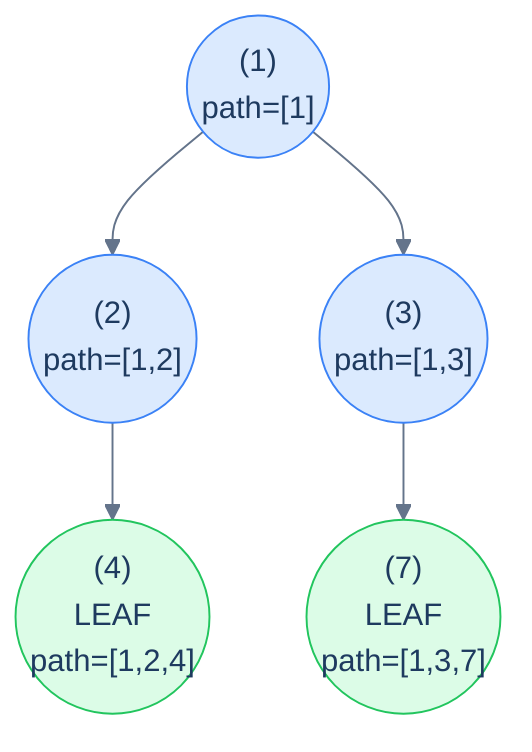

# The stateful root-to-leaf path pattern

```text
recurse(node, sharedPath):
  if node is null: return
  push(sharedPath, node)                  # mutate
  if node is a leaf:
    if check(sharedPath): record(sharedPath)
  else:
    recurse(node.left,  sharedPath)
    recurse(node.right, sharedPath)
  pop(sharedPath)                         # undo
```

The discipline is **identical** to stateful preorder: push on entry, recurse, pop on exit. The only difference from lesson 9 is *when* and *what* you check — only at leaves, and you record a *copy* of the path (not the live shared list, which would mutate out from under you).

> 🖼 Diagram — Stateful root-to-leaf — the shared path contains exactly the current root-to-current-node sequence at every recursive call. At each leaf, we have a complete root-to-leaf path; record a copy if it qualifies.


<p align="center"><strong>Stateful root-to-leaf — the shared <code>path</code> contains exactly the current root-to-current-node sequence at every recursive call. At each leaf, we have a complete root-to-leaf path; record a <em>copy</em> if it qualifies.</strong></p>

> **Why copy at the leaf?** Because the live `path` list is going to be popped from on the way back up. If you saved a *reference*, you'd end up with a dozen different paths in your output that all secretly point at the same (now empty) list. Always copy when extracting from a shared mutable.

## Generic pattern

The "collect all root-to-leaf paths" template — the simplest member of the family.


```python run
from typing import List, Optional

class TreeNode:
    def __init__(self, val=0, left=None, right=None):
        self.val, self.left, self.right = val, left, right

def all_root_to_leaf_paths(root: Optional[TreeNode]) -> List[List[int]]:
    out: List[List[int]] = []
    path: List[int] = []
    def go(n):
        if n is None: return
        path.append(n.val)                              # push
        if n.left is None and n.right is None:
            out.append(path.copy())                     # leaf: snapshot the path
        else:
            go(n.left); go(n.right)
        path.pop()                                       # pop
    go(root)
    return out
```

```java run
static List<Integer> path;
static List<List<Integer>> out;
static void allHelper(TreeNode n) {
    if (n == null) return;
    path.add(n.val);
    if (n.left == null && n.right == null) {
        out.add(new ArrayList<>(path));                 // copy
    } else {
        allHelper(n.left); allHelper(n.right);
    }
    path.remove(path.size() - 1);
}
public static List<List<Integer>> allRootToLeafPaths(TreeNode root) {
    out = new ArrayList<>(); path = new ArrayList<>();
    allHelper(root);
    return out;
}
```


## Complexity

> **Time:** O(N · L) where L is the average path length — every path that gets recorded is copied. **Space:** O(h) for recursion + path stack, plus O(answer size) for output.

# How to recognise it

The pattern fits when:

- The unit of interest is a **complete root-to-leaf path** (same as the previous lesson), AND
- The answer needs the **actual nodes** in each path (not just a per-path verdict you can fold into a number).

Concrete cues:

- *"Return all root-to-leaf paths where …"* — collect path snapshots.
- *"Find all paths whose nodes satisfy …"* — same.
- *"Detect duplicate / prefix / palindromic / specially-structured paths"* — push-pop + per-path data structure (hash, multiset, prefix-sum map).

Anti-pattern: if all you need is a count, sum, or boolean per path, use the *stateless* variant from the previous lesson — it's strictly cheaper.

<!-- ============================================== -->
<!-- SWEEP 2 — missing sections (placeholders only) -->
<!-- ============================================== -->

<!-- TODO: Understanding the Pattern — missing, needs to be written -->
<!--       Guidance: umbrella H2 with the subsections below -->

<!-- TODO: Why Naive Isn't Enough — missing, needs to be written -->
<!--       Guidance: motivation for why the obvious approach fails -->

<!-- TODO: The Core Idea — missing, needs to be written -->
<!--       Guidance: one paragraph: the central trick -->

<!-- TODO: How the Pointers/Window Move — missing, needs to be written -->
<!--       Guidance: mechanics of the moving parts -->

<!-- TODO: The Generic Algorithm — missing, needs to be written -->
<!--       Guidance: numbered steps, no code -->

<!-- TODO: Generic Implementation — missing, needs to be written -->
<!--       Guidance: Python block + Java block of the skeleton -->

<!-- TODO: Complexity Analysis — missing, needs to be written -->
<!--       Guidance: table -->

<!-- TODO: Variants / Taxonomy — missing, needs to be written -->
<!--       Guidance: enumerate sub-shapes of this pattern -->

<!-- TODO: Identifying — missing, needs to be written -->
<!--       Guidance: per-variant: recognition checklist + canonical example -->

<!-- TODO: Recognition Checklist — missing, needs to be written -->
<!--       Guidance: 4-question diagnostic — the source of the Problem-section Diagnostic Questions -->

<!-- TODO: Canonical Example — missing, needs to be written -->
<!--       Guidance: fully worked example: brute force → optimised → template fit -->

<!-- TODO: Problems in This Category — missing, needs to be written -->
<!--       Guidance: table with links to the 02-problems/ files -->
