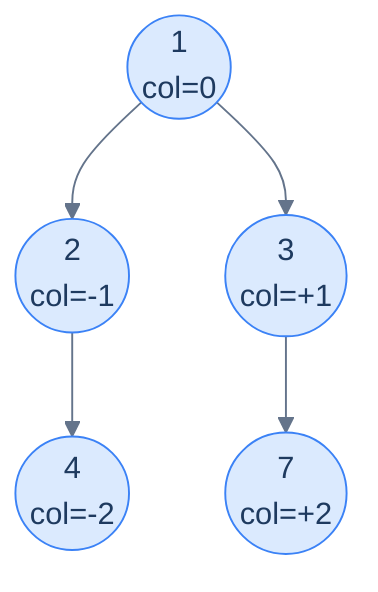
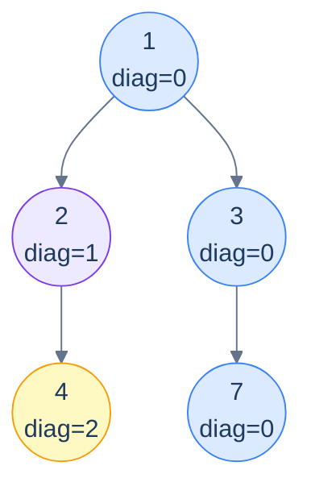

# 15. Pattern: Level-Order Traversal (Columns)

## The Hook

The previous lesson grouped tree nodes by their **horizontal slices** — level 0, level 1, level 2, .... This lesson rotates the perspective ninety degrees and groups nodes by their **vertical columns**.

Imagine standing *above* the tree and looking straight down. The root sits at column 0. Every left edge nudges the next node one column to the *left* (column −1, −2, …); every right edge nudges it one column to the *right* (+1, +2, …). After all the edges are walked, each node has an assigned (level, column) pair — and grouping by column reveals all sorts of useful pictures: the **top view** (the topmost node visible in each column), the **bottom view** (the bottommost), the **vertical traversal** (every node in each column, top-to-bottom), and the **diagonal traversal** (where left-edges count as "+1 diagonal" and right-edges stay put).

The mechanism is the same level-order BFS as the last lesson, but the queue carries an extra coordinate per entry: **(node, column)**. A `Map<column, …>` then collects whatever per-column data the question wants. The `column` key is computed from the parent's column with a simple offset; the value depends on which view we're computing.

This lesson packs the four canonical column-based problems into a tight set of variations on one template — top view, bottom view, vertical, diagonal — implemented in Python and Java.

---

## Table of contents

1. [The column-coordinate template](#the-column-coordinate-template)
2. [Problem 1 — Top view](#problem-1--top-view)
3. [Problem 2 — Bottom view](#problem-2--bottom-view)
4. [Problem 3 — Vertical traversal](#problem-3--vertical-traversal)
5. [Problem 4 — Diagonal traversal](#problem-4--diagonal-traversal)

***

# The column-coordinate template

```text
queue = [(root, column=0)]
columns = sorted_map<int, value_for_this_view>
while queue is non-empty:
  (n, c) = queue.pop_front()
  apply_per_view_update(columns, c, n.val)        # ← differs per problem
  if n.left:  queue.push((n.left,  c - 1))
  if n.right: queue.push((n.right, c + 1))
return columns.values_in_column_order()
```

Two things change between the four problems:

1. **The `column` arithmetic for children.** For top/bottom/vertical: `left → c-1`, `right → c+1`. For diagonal: `left → c+1`, `right → c` (a left-edge starts a new diagonal; a right-edge stays on the current one).
2. **What we put into `columns[c]`.** Top view: only the *first* node ever to land in this column (since BFS visits topmost first). Bottom view: *overwrite* with each new node (the last one wins → the bottommost). Vertical: *append* to a list per column. Diagonal: *append* to a list per diagonal.



<p align="center"><strong>Column coordinates assigned by BFS — root at 0, each left-edge subtracts 1, each right-edge adds 1. Group by column and you can answer any "looking from above / from the side" question about the tree.</strong></p>

> *Why a sorted map (TreeMap / std::map) and not a hash map?* Because at the end we need to iterate columns from leftmost to rightmost. A hash map would force an O(K log K) sort on output. A sorted map keeps everything in column order automatically. (Alternative: hash map plus tracking `min_col`/`max_col` and iterating the integer range — same idea, more bookkeeping.)

***

# Problem 1 — Top view

> Return the values of nodes visible *from above*, ordered left-to-right by column.
>
> A column's "top" is the *first* node BFS encounters in that column (BFS processes shallower nodes before deeper ones, so the first node in any column is its highest one).

The trick: when we visit a node and its column is **not yet** in the map, record it; otherwise skip. BFS guarantees the first arrival at any column is the topmost one.

> *Predict before reading on — would a depth-first traversal work for top view?*
>
> Not directly. DFS visits nodes in *recursion order*, not depth order, so the first node DFS hits in column −1 isn't necessarily the topmost. You'd need to remember each node's *depth* and only update the per-column entry when you find a *shallower* node — which is more work than just using BFS, where the first arrival is automatically the topmost.

<details>
<summary><h2>Solution</h2></summary>


```python run
from queue import Queue
from typing import List, Optional


class TreeNode:
    def __init__(self, val=0, left=None, right=None):
        self.val = val
        self.left = left
        self.right = right


def from_level_order(values):
    """Build tree from list like [1, 2, 3, None, 4]. None means missing child."""
    if not values:
        return None
    root = TreeNode(values[0])
    queue = [root]
    i = 1
    while queue and i < len(values):
        node = queue.pop(0)
        if i < len(values) and values[i] is not None:
            node.left = TreeNode(values[i])
            queue.append(node.left)
        i += 1
        if i < len(values) and values[i] is not None:
            node.right = TreeNode(values[i])
            queue.append(node.right)
        i += 1
    return root


# Define a class to store the node and its column index
class NodeInfo:
    def __init__(self, node: TreeNode, column: int) -> None:
        self.node = node
        self.column = column


class Solution:
    def top_view(self, root: Optional[TreeNode]) -> List[int]:
        result: List[int] = []
        if not root:
            return result

        # Hash map to store columns and their corresponding nodes
        columns: dict[int, int] = {}

        # Use a queue to perform a level-order traversal of the tree
        queue = Queue()
        queue.put(NodeInfo(root, 0))

        # Loop through each level in the tree
        while not queue.empty():
            current = queue.get()
            node = current.node
            column = current.column

            # Add the current node if it's the first node in the column
            if column not in columns:
                columns[column] = node.val

            # Enqueue the left child with column - 1
            if node.left:
                queue.put(NodeInfo(node.left, column - 1))

            # Enqueue the right child with column + 1
            if node.right:
                queue.put(NodeInfo(node.right, column + 1))

        # Iterate over the columns in the hash map and add them to the
        # result
        for column in sorted(columns):
            result.append(columns[column])

        return result


# Examples from the problem statement
print(Solution().top_view(from_level_order([1, 2, 3, 4, None, None, 7, 9])))              # [9, 4, 2, 1, 3, 7]
print(Solution().top_view(from_level_order([1, 8, 4, None, 6, None, None, None, 2, None, 9])))  # [8, 1, 4, 9]

# Edge cases
print(Solution().top_view(None))                                                           # []
print(Solution().top_view(TreeNode(1)))                                                    # [1]
print(Solution().top_view(from_level_order([1, 2, None, 3, None, 4])))                   # [3, 2, 1] left skew
print(Solution().top_view(from_level_order([1, None, 2, None, None, None, 3])))          # [1, 2, 3] right skew
print(Solution().top_view(from_level_order([1, 2, 3])))                                  # [2, 1, 3] balanced
```

```java run
import java.util.*;

public class Main {
    static class TreeNode {
        int val;
        TreeNode left;
        TreeNode right;
        TreeNode() {}
        TreeNode(int val) { this.val = val; }
    }

    static TreeNode fromLevelOrder(Integer... values) {
        if (values.length == 0 || values[0] == null) return null;
        TreeNode root = new TreeNode(values[0]);
        java.util.Deque<TreeNode> queue = new java.util.ArrayDeque<>();
        queue.add(root);
        int i = 1;
        while (!queue.isEmpty() && i < values.length) {
            TreeNode node = queue.poll();
            if (i < values.length && values[i] != null) {
                node.left = new TreeNode(values[i]);
                queue.add(node.left);
            }
            i++;
            if (i < values.length && values[i] != null) {
                node.right = new TreeNode(values[i]);
                queue.add(node.right);
            }
            i++;
        }
        return root;
    }

    // Define a class to store the node and its column index
    static class NodeInfo {
        TreeNode node;
        int column;
        NodeInfo(TreeNode node, int column) {
            this.node = node;
            this.column = column;
        }
    }

    static class Solution {
        public List<Integer> topView(TreeNode root) {
            List<Integer> result = new ArrayList<>();
            if (root == null) {
                return result;
            }

            // Hash map to store columns and their corresponding nodes
            Map<Integer, Integer> columns = new TreeMap<>();

            // Use a queue to perform a level-order traversal of the tree
            Queue<NodeInfo> queue = new LinkedList<>();

            // Push the root node onto the queue with column index 0
            queue.add(new NodeInfo(root, 0));

            // Loop through each level in the tree
            while (!queue.isEmpty()) {
                NodeInfo current = queue.poll();
                TreeNode node = current.node;
                int column = current.column;

                // Add the current node if it's the first node in the column
                if (!columns.containsKey(column)) {
                    columns.put(column, node.val);
                }

                // Enqueue the left child with column - 1
                if (node.left != null) {
                    queue.add(new NodeInfo(node.left, column - 1));
                }

                // Enqueue the right child with column + 1
                if (node.right != null) {
                    queue.add(new NodeInfo(node.right, column + 1));
                }
            }

            // Iterate over the columns in the hash map and add them to the
            // result
            for (int column : columns.keySet()) {
                result.add(columns.get(column));
            }

            return result;
        }
    }

    public static void main(String[] args) {
        // Examples from the problem statement
        System.out.println(new Solution().topView(fromLevelOrder(1, 2, 3, 4, null, null, 7, 9)));              // [9, 4, 2, 1, 3, 7]
        System.out.println(new Solution().topView(fromLevelOrder(1, 8, 4, null, 6, null, null, null, 2, null, 9)));  // [8, 1, 4, 9]

        // Edge cases
        System.out.println(new Solution().topView(null));                                                       // []
        System.out.println(new Solution().topView(new TreeNode(1)));                                           // [1]
        System.out.println(new Solution().topView(fromLevelOrder(1, 2, null, 3)));                            // [3, 2, 1] left skew
        System.out.println(new Solution().topView(fromLevelOrder(1, null, 2, null, null, null, 3)));          // [1, 2, 3] right skew
        System.out.println(new Solution().topView(fromLevelOrder(1, 2, 3)));                                  // [2, 1, 3]
    }
}
```

</details>


***

# Problem 2 — Bottom view

> Same shape as top view, but return the values visible *from below* — i.e. the bottommost node in each column.

Trick: instead of "first wins" (`putIfAbsent`), use "**last wins**" (`put` unconditionally). BFS visits column entries in depth order; the *last* assignment wins, and that's the lowest node in that column.

The implementation is *one line* different from top view: replace the `if c not in cols` guard with an unconditional `cols[c] = n.val`. Apply that one change to each of the 10 implementations above and you have bottom view.

<details>
<summary><h2>Solution</h2></summary>


```python run
from queue import Queue
from typing import List, Optional


class TreeNode:
    def __init__(self, val=0, left=None, right=None):
        self.val = val
        self.left = left
        self.right = right


def from_level_order(values):
    """Build tree from list like [1, 2, 3, None, 4]. None means missing child."""
    if not values:
        return None
    root = TreeNode(values[0])
    queue = [root]
    i = 1
    while queue and i < len(values):
        node = queue.pop(0)
        if i < len(values) and values[i] is not None:
            node.left = TreeNode(values[i])
            queue.append(node.left)
        i += 1
        if i < len(values) and values[i] is not None:
            node.right = TreeNode(values[i])
            queue.append(node.right)
        i += 1
    return root


# Define a class to store the node and its column index
class NodeInfo:
    def __init__(self, node: TreeNode, column: int):
        self.node = node
        self.column = column


class Solution:
    def bottom_view(self, root: Optional[TreeNode]) -> List[int]:
        result: List[int] = []
        if not root:
            return result

        # Hash table to store columns and their corresponding nodes
        columns: dict[int, int] = {}

        # Use a queue to perform a level-order traversal of the tree
        queue = Queue()
        queue.put(NodeInfo(root, 0))

        # Loop through each level in the tree
        while not queue.empty():
            current = queue.get()
            node = current.node
            column = current.column

            # Keep updating the column value for each node, at the end
            # we will have the bottom view of the tree for that column
            columns[column] = node.val

            # Enqueue the left child with column - 1
            if node.left:
                queue.put(NodeInfo(node.left, column - 1))

            # Enqueue the right child with column + 1
            if node.right:
                queue.put(NodeInfo(node.right, column + 1))

        # Iterate over the columns in the hash table and add them to the
        # result
        for column in sorted(columns):
            result.append(columns[column])

        return result


# Examples from the problem statement
print(Solution().bottom_view(from_level_order([1, 2, 3, 4, None, None, 7, 9])))              # [9, 4, 2, 1, 3, 7]
print(Solution().bottom_view(from_level_order([1, 8, 4, None, 6, None, None, None, 2, None, 9])))  # [8, 6, 2, 9]

# Edge cases
print(Solution().bottom_view(None))                                                           # []
print(Solution().bottom_view(TreeNode(1)))                                                    # [1]
print(Solution().bottom_view(from_level_order([1, 2, None, 3, None, 4])))                   # [4, 3, 1] left skew
print(Solution().bottom_view(from_level_order([1, None, 2, None, None, None, 3])))          # [1, 2, 3] right skew
print(Solution().bottom_view(from_level_order([1, 2, 3])))                                  # [2, 1, 3]
```

```java run
import java.util.*;

public class Main {
    static class TreeNode {
        int val;
        TreeNode left;
        TreeNode right;
        TreeNode() {}
        TreeNode(int val) { this.val = val; }
    }

    static TreeNode fromLevelOrder(Integer... values) {
        if (values.length == 0 || values[0] == null) return null;
        TreeNode root = new TreeNode(values[0]);
        java.util.Deque<TreeNode> queue = new java.util.ArrayDeque<>();
        queue.add(root);
        int i = 1;
        while (!queue.isEmpty() && i < values.length) {
            TreeNode node = queue.poll();
            if (i < values.length && values[i] != null) {
                node.left = new TreeNode(values[i]);
                queue.add(node.left);
            }
            i++;
            if (i < values.length && values[i] != null) {
                node.right = new TreeNode(values[i]);
                queue.add(node.right);
            }
            i++;
        }
        return root;
    }

    // Define a class to store the node and its column index
    static class NodeInfo {
        TreeNode node;
        int column;
        NodeInfo(TreeNode node, int column) {
            this.node = node;
            this.column = column;
        }
    }

    static class Solution {
        public List<Integer> bottomView(TreeNode root) {
            List<Integer> result = new ArrayList<>();
            if (root == null) {
                return result;
            }

            // Hash table to store columns and their corresponding nodes
            Map<Integer, Integer> columns = new TreeMap<>();

            // Use a queue to perform a level-order traversal of the tree
            Queue<NodeInfo> queue = new LinkedList<>();

            // Push the root node onto the queue with column index 0
            queue.add(new NodeInfo(root, 0));

            // Loop through each level in the tree
            while (!queue.isEmpty()) {
                NodeInfo current = queue.poll();
                TreeNode node = current.node;
                int column = current.column;

                // Keep updating the column value for each node, at the end
                // we will have the bottom view of the tree for that column
                columns.put(column, node.val);

                // Enqueue the left child with column - 1
                if (node.left != null) {
                    queue.add(new NodeInfo(node.left, column - 1));
                }

                // Enqueue the right child with column + 1
                if (node.right != null) {
                    queue.add(new NodeInfo(node.right, column + 1));
                }
            }

            // Iterate over the columns in the hash map and add them to
            // the result
            for (int column : columns.keySet()) {
                result.add(columns.get(column));
            }

            return result;
        }
    }

    public static void main(String[] args) {
        // Examples from the problem statement
        System.out.println(new Solution().bottomView(fromLevelOrder(1, 2, 3, 4, null, null, 7, 9)));              // [9, 4, 2, 1, 3, 7]
        System.out.println(new Solution().bottomView(fromLevelOrder(1, 8, 4, null, 6, null, null, null, 2, null, 9)));  // [8, 6, 2, 9]

        // Edge cases
        System.out.println(new Solution().bottomView(null));                                                       // []
        System.out.println(new Solution().bottomView(new TreeNode(1)));                                           // [1]
        System.out.println(new Solution().bottomView(fromLevelOrder(1, 2, null, 3)));                            // left skew
        System.out.println(new Solution().bottomView(fromLevelOrder(1, null, 2, null, null, null, 3)));          // right skew
        System.out.println(new Solution().bottomView(fromLevelOrder(1, 2, 3)));                                  // [2, 1, 3]
    }
}
```

</details>


***

# Problem 3 — Vertical traversal

> Return *all* nodes grouped by column (top-to-bottom within each column), as a list-of-lists ordered by column from left to right.

Trick: instead of storing one value per column (top or bottom view), *append* to a list per column. BFS top-to-bottom order means the per-column list is already sorted top-to-bottom for free.

<details>
<summary><h2>Solution</h2></summary>


```python run
from queue import Queue
from collections import defaultdict
from typing import List, Optional


class TreeNode:
    def __init__(self, val=0, left=None, right=None):
        self.val = val
        self.left = left
        self.right = right


def from_level_order(values):
    """Build tree from list like [1, 2, 3, None, 4]. None means missing child."""
    if not values:
        return None
    root = TreeNode(values[0])
    queue = [root]
    i = 1
    while queue and i < len(values):
        node = queue.pop(0)
        if i < len(values) and values[i] is not None:
            node.left = TreeNode(values[i])
            queue.append(node.left)
        i += 1
        if i < len(values) and values[i] is not None:
            node.right = TreeNode(values[i])
            queue.append(node.right)
        i += 1
    return root


# Define a class to store the node and its column index
class NodeInfo:
    def __init__(self, node: TreeNode, column: int):
        self.node = node
        self.column = column


class Solution:
    def vertical_traversal(
        self, root: Optional[TreeNode]
    ) -> List[List[int]]:
        result: List[List[int]] = []
        if not root:
            return result

        # HashMap to store columns and their corresponding nodes
        columns = defaultdict(list)

        # Queue to perform level-order traversal
        queue = Queue()
        queue.put(NodeInfo(root, 0))

        # Loop through each level in the tree
        while not queue.empty():
            current = queue.get()
            node = current.node
            column = current.column

            # Add the current node to its corresponding column
            columns[column].append(node.val)

            # Enqueue the left child with column - 1
            if node.left:
                queue.put(NodeInfo(node.left, column - 1))

            # Enqueue the right child with column + 1
            if node.right:
                queue.put(NodeInfo(node.right, column + 1))

        # Sort columns by their column index and add them to the result
        for column in sorted(columns.keys()):
            result.append(columns[column])

        return result


# Examples from the problem statement
print(Solution().vertical_traversal(from_level_order([1, 2, 3, 4, None, None, 7])))        # [[4], [2], [1], [3], [7]]
print(Solution().vertical_traversal(from_level_order([1, 8, 4, None, 6, None, None, 3, 2])))  # [[8, 3], [1, 6], [4, 2]]

# Edge cases
print(Solution().vertical_traversal(None))                                                   # []
print(Solution().vertical_traversal(TreeNode(1)))                                            # [[1]]
print(Solution().vertical_traversal(from_level_order([1, 2, None, 3, None, 4])))           # [[4], [3], [2], [1]] left skew
print(Solution().vertical_traversal(from_level_order([1, None, 2, None, None, None, 3])))  # [[1], [2], [3]] right skew
print(Solution().vertical_traversal(from_level_order([1, 2, 3])))                          # [[2], [1], [3]]
```

```java run
import java.util.*;

public class Main {
    static class TreeNode {
        int val;
        TreeNode left;
        TreeNode right;
        TreeNode() {}
        TreeNode(int val) { this.val = val; }
    }

    static TreeNode fromLevelOrder(Integer... values) {
        if (values.length == 0 || values[0] == null) return null;
        TreeNode root = new TreeNode(values[0]);
        java.util.Deque<TreeNode> queue = new java.util.ArrayDeque<>();
        queue.add(root);
        int i = 1;
        while (!queue.isEmpty() && i < values.length) {
            TreeNode node = queue.poll();
            if (i < values.length && values[i] != null) {
                node.left = new TreeNode(values[i]);
                queue.add(node.left);
            }
            i++;
            if (i < values.length && values[i] != null) {
                node.right = new TreeNode(values[i]);
                queue.add(node.right);
            }
            i++;
        }
        return root;
    }

    // Define a class to store the node and its column index
    static class NodeInfo {
        TreeNode node;
        int column;
        NodeInfo(TreeNode node, int column) {
            this.node = node;
            this.column = column;
        }
    }

    static class Solution {
        public List<List<Integer>> verticalTraversal(TreeNode root) {
            List<List<Integer>> result = new ArrayList<>();
            if (root == null) {
                return result;
            }

            // HashMap to store columns and their corresponding nodes
            Map<Integer, List<Integer>> columns = new TreeMap<>();

            // Queue to perform level-order traversal
            Queue<NodeInfo> queue = new LinkedList<>();
            queue.add(new NodeInfo(root, 0));

            // Loop through each level in the tree
            while (!queue.isEmpty()) {
                NodeInfo current = queue.poll();
                TreeNode node = current.node;
                int column = current.column;

                // Add the current node to its corresponding column
                columns.putIfAbsent(column, new ArrayList<>());
                columns.get(column).add(node.val);

                // Enqueue the left child with column - 1
                if (node.left != null) {
                    queue.add(new NodeInfo(node.left, column - 1));
                }

                // Enqueue the right child with column + 1
                if (node.right != null) {
                    queue.add(new NodeInfo(node.right, column + 1));
                }
            }

            // Iterate over the columns in the hash table and add them to the
            // result
            for (List<Integer> column : columns.values()) {
                result.add(column);
            }

            return result;
        }
    }

    public static void main(String[] args) {
        // Examples from the problem statement
        System.out.println(new Solution().verticalTraversal(fromLevelOrder(1, 2, 3, 4, null, null, 7)));        // [[4], [2], [1], [3], [7]]
        System.out.println(new Solution().verticalTraversal(fromLevelOrder(1, 8, 4, null, 6, null, null, 3, 2)));  // [[8, 3], [1, 6], [4, 2]]

        // Edge cases
        System.out.println(new Solution().verticalTraversal(null));                                               // []
        System.out.println(new Solution().verticalTraversal(new TreeNode(1)));                                   // [[1]]
        System.out.println(new Solution().verticalTraversal(fromLevelOrder(1, 2, null, 3)));                    // left skew
        System.out.println(new Solution().verticalTraversal(fromLevelOrder(1, null, 2, null, null, null, 3)));  // right skew
        System.out.println(new Solution().verticalTraversal(fromLevelOrder(1, 2, 3)));                          // [[2], [1], [3]]
    }
}
```

</details>


***

# Problem 4 — Diagonal traversal

> Return groups of nodes on the same *diagonal*. A diagonal starts at any node and follows the right-spine; left-edges start a *new* diagonal.

The coordinate change: `right → same diagonal`, `left → diagonal + 1`. Otherwise the template is identical to vertical traversal.



<p align="center"><strong>Diagonal traversal — same-color nodes share a diagonal. The blue diagonal <code>(1, 3, 7)</code> stays "right" the whole way. Going left jumps to a new diagonal.</strong></p>

<details>
<summary><h2>Solution</h2></summary>


```python run
from queue import Queue
from collections import defaultdict
from typing import List, Optional


class TreeNode:
    def __init__(self, val=0, left=None, right=None):
        self.val = val
        self.left = left
        self.right = right


def from_level_order(values):
    """Build tree from list like [1, 2, 3, None, 4]. None means missing child."""
    if not values:
        return None
    root = TreeNode(values[0])
    queue = [root]
    i = 1
    while queue and i < len(values):
        node = queue.pop(0)
        if i < len(values) and values[i] is not None:
            node.left = TreeNode(values[i])
            queue.append(node.left)
        i += 1
        if i < len(values) and values[i] is not None:
            node.right = TreeNode(values[i])
            queue.append(node.right)
        i += 1
    return root


# Define a class to store the node and its diagonal index
class NodeInfo:
    def __init__(self, node: TreeNode, diagonal: int):
        self.node = node
        self.diagonal = diagonal


class Solution:
    def diagonal_traversal(
        self, root: Optional[TreeNode]
    ) -> List[List[int]]:
        result: List[List[int]] = []
        if not root:
            return result

        # HashMap to store diagonals and their corresponding nodes
        diagonals = defaultdict(list)

        # Queue to perform level-order traversal
        queue = Queue()
        queue.put(NodeInfo(root, 0))

        # Loop through each level in the tree
        while not queue.empty():
            current = queue.get()
            node = current.node
            diagonal = current.diagonal

            # Add the current node to its corresponding diagonal
            diagonals[diagonal].append(node.val)

            # Left child goes to next diagonal (diagonal + 1)
            if node.left:
                queue.put(NodeInfo(node.left, diagonal + 1))

            # Right child stays on same diagonal (diagonal)
            if node.right:
                queue.put(NodeInfo(node.right, diagonal))

        # Sort diagonals by their diagonal index and add them to the
        # result
        for diagonal in sorted(diagonals.keys()):
            result.append(diagonals[diagonal])

        return result


# Examples from the problem statement
print(Solution().diagonal_traversal(from_level_order([1, 2, 3, 4, None, None, 7])))        # [[1, 3, 7], [2], [4]]
print(Solution().diagonal_traversal(from_level_order([1, 8, 4, None, 6, None, None, 3, 2])))  # [[1, 4], [8, 6, 2], [3]]

# Edge cases
print(Solution().diagonal_traversal(None))                                                   # []
print(Solution().diagonal_traversal(TreeNode(1)))                                            # [[1]]
print(Solution().diagonal_traversal(from_level_order([1, 2, None, 3, None, 4])))           # left skew: [[1], [2], [3], [4]]
print(Solution().diagonal_traversal(from_level_order([1, None, 2, None, None, None, 3])))  # right skew: [[1, 2, 3]]
print(Solution().diagonal_traversal(from_level_order([1, 2, 3])))                          # [[1, 3], [2]]
```

```java run
import java.util.*;

public class Main {
    static class TreeNode {
        int val;
        TreeNode left;
        TreeNode right;
        TreeNode() {}
        TreeNode(int val) { this.val = val; }
    }

    static TreeNode fromLevelOrder(Integer... values) {
        if (values.length == 0 || values[0] == null) return null;
        TreeNode root = new TreeNode(values[0]);
        java.util.Deque<TreeNode> queue = new java.util.ArrayDeque<>();
        queue.add(root);
        int i = 1;
        while (!queue.isEmpty() && i < values.length) {
            TreeNode node = queue.poll();
            if (i < values.length && values[i] != null) {
                node.left = new TreeNode(values[i]);
                queue.add(node.left);
            }
            i++;
            if (i < values.length && values[i] != null) {
                node.right = new TreeNode(values[i]);
                queue.add(node.right);
            }
            i++;
        }
        return root;
    }

    // Define a class to store the node and its diagonal index
    static class NodeInfo {
        TreeNode node;
        int diagonal;
        NodeInfo(TreeNode node, int diagonal) {
            this.node = node;
            this.diagonal = diagonal;
        }
    }

    static class Solution {
        public List<List<Integer>> diagonalTraversal(TreeNode root) {
            List<List<Integer>> result = new ArrayList<>();
            if (root == null) {
                return result;
            }

            // HashMap to store diagonals and their corresponding nodes
            Map<Integer, List<Integer>> diagonals = new TreeMap<>();

            // Queue to perform level-order traversal
            Queue<NodeInfo> queue = new LinkedList<>();
            queue.add(new NodeInfo(root, 0));

            // Loop through each level in the tree
            while (!queue.isEmpty()) {
                NodeInfo current = queue.poll();
                TreeNode node = current.node;
                int diagonal = current.diagonal;

                // Add the current node to its corresponding diagonal
                diagonals.putIfAbsent(diagonal, new ArrayList<>());
                diagonals.get(diagonal).add(node.val);

                // Enqueue the left child with diagonal + 1
                if (node.left != null) {
                    queue.add(new NodeInfo(node.left, diagonal + 1));
                }

                // Enqueue the right child with diagonal
                if (node.right != null) {
                    queue.add(new NodeInfo(node.right, diagonal));
                }
            }

            // Add all diagonals to the vertical order result
            for (List<Integer> diagonal : diagonals.values()) {
                result.add(diagonal);
            }

            return result;
        }
    }

    public static void main(String[] args) {
        // Examples from the problem statement
        System.out.println(new Solution().diagonalTraversal(fromLevelOrder(1, 2, 3, 4, null, null, 7)));        // [[1, 3, 7], [2], [4]]
        System.out.println(new Solution().diagonalTraversal(fromLevelOrder(1, 8, 4, null, 6, null, null, 3, 2)));  // [[1, 4], [8, 6, 2], [3]]

        // Edge cases
        System.out.println(new Solution().diagonalTraversal(null));                                               // []
        System.out.println(new Solution().diagonalTraversal(new TreeNode(1)));                                   // [[1]]
        System.out.println(new Solution().diagonalTraversal(fromLevelOrder(1, 2, null, 3)));                    // left skew
        System.out.println(new Solution().diagonalTraversal(fromLevelOrder(1, null, 2, null, null, null, 3)));  // right skew: [[1, 2, 3]]
        System.out.println(new Solution().diagonalTraversal(fromLevelOrder(1, 2, 3)));                          // [[1, 3], [2]]
    }
}
```

</details>
<details>
<summary><h2>Final Takeaway</h2></summary>


Column-based traversals are tiny variations on one BFS template. Three things to walk away with:

1. **Augment the queue with coordinates.** When a question needs nodes grouped by anything other than visit order — column, diagonal, depth+column, distance from a target — the right move is to enqueue `(node, coord)` pairs and let a sorted map collect by coordinate.
2. **Top vs bottom is one line.** Top view: `putIfAbsent` (first wins). Bottom view: `put` (last wins). Both leverage BFS's depth-first ordering of arrivals at each column.
3. **Sorted map = output already in order.** Using a `TreeMap`/`std::map`/`BTreeMap` instead of a hash map means iterating the values directly gives them in column order — no post-sorting needed. Reach for the sorted variant whenever the output has a numerical ordering.

> *Coming up — the chapter pivots from traversals to a more <em>relational</em> question: <strong>given two nodes, where do they meet?</strong> The lowest common ancestor (LCA) is one of the most important tree primitives — used in network routing, version-control merges, phylogenetics, and dozens of LeetCode "what's the closest common point" problems. The next lesson covers the canonical recursive LCA algorithm and four related variants.*

</details>