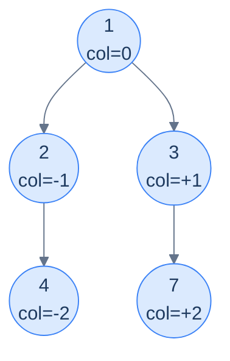
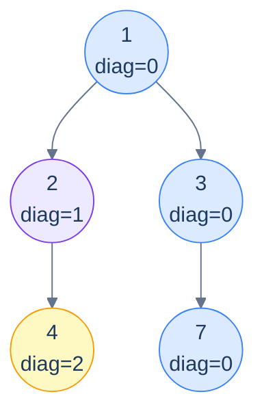

# 15. Pattern: Level-Order Traversal (Columns)

## The Hook

The previous lesson grouped tree nodes by their **horizontal slices** — level 0, level 1, level 2, .... This lesson rotates the perspective ninety degrees and groups nodes by their **vertical columns**.

Imagine standing *above* the tree and looking straight down. The root sits at column 0. Every left edge nudges the next node one column to the *left* (column −1, −2, …); every right edge nudges it one column to the *right* (+1, +2, …). After all the edges are walked, each node has an assigned (level, column) pair — and grouping by column reveals all sorts of useful pictures: the **top view** (the topmost node visible in each column), the **bottom view** (the bottommost), the **vertical traversal** (every node in each column, top-to-bottom), and the **diagonal traversal** (where left-edges count as "+1 diagonal" and right-edges stay put).

The mechanism is the same level-order BFS as the last lesson, but the queue carries an extra coordinate per entry: **(node, column)**. A `Map<column, …>` then collects whatever per-column data the question wants. The `column` key is computed from the parent's column with a simple offset; the value depends on which view we're computing.

This lesson packs the four canonical column-based problems into a tight set of variations on one template — top view, bottom view, vertical, diagonal — implemented in 10 languages each.

---

## Table of contents

1. [The column-coordinate template](#the-column-coordinate-template)
2. [Problem 1 — Top view](#problem-1--top-view)
3. [Problem 2 — Bottom view](#problem-2--bottom-view)
4. [Problem 3 — Vertical traversal](#problem-3--vertical-traversal)
5. [Problem 4 — Diagonal traversal](#problem-4--diagonal-traversal)

***

# The column-coordinate template

```text
queue = [(root, column=0)]
columns = sorted_map<int, value_for_this_view>
while queue is non-empty:
  (n, c) = queue.pop_front()
  apply_per_view_update(columns, c, n.val)        # ← differs per problem
  if n.left:  queue.push((n.left,  c - 1))
  if n.right: queue.push((n.right, c + 1))
return columns.values_in_column_order()
```

Two things change between the four problems:

1. **The `column` arithmetic for children.** For top/bottom/vertical: `left → c-1`, `right → c+1`. For diagonal: `left → c+1`, `right → c` (a left-edge starts a new diagonal; a right-edge stays on the current one).
2. **What we put into `columns[c]`.** Top view: only the *first* node ever to land in this column (since BFS visits topmost first). Bottom view: *overwrite* with each new node (the last one wins → the bottommost). Vertical: *append* to a list per column. Diagonal: *append* to a list per diagonal.



<p align="center"><strong>Column coordinates assigned by BFS — root at 0, each left-edge subtracts 1, each right-edge adds 1. Group by column and you can answer any "looking from above / from the side" question about the tree.</strong></p>

> *Why a sorted map (TreeMap / std::map) and not a hash map?* Because at the end we need to iterate columns from leftmost to rightmost. A hash map would force an O(K log K) sort on output. A sorted map keeps everything in column order automatically. (Alternative: hash map plus tracking `min_col`/`max_col` and iterating the integer range — same idea, more bookkeeping.)

***

# Problem 1 — Top view

> Return the values of nodes visible *from above*, ordered left-to-right by column.
>
> A column's "top" is the *first* node BFS encounters in that column (BFS processes shallower nodes before deeper ones, so the first node in any column is its highest one).

The trick: when we visit a node and its column is **not yet** in the map, record it; otherwise skip. BFS guarantees the first arrival at any column is the topmost one.

> *Predict before reading on — would a depth-first traversal work for top view?*
>
> Not directly. DFS visits nodes in *recursion order*, not depth order, so the first node DFS hits in column −1 isn't necessarily the topmost. You'd need to remember each node's *depth* and only update the per-column entry when you find a *shallower* node — which is more work than just using BFS, where the first arrival is automatically the topmost.

## Solution


```pseudocode
function topView(root):
    if root = null: return empty list
    cols ← empty sorted Map: column → value
    q    ← empty queue; enqueue (root, 0) to q
    minC ← 0; maxC ← 0
    while q is not empty:
        (n, c) ← dequeue from q
        if c not in cols: cols[c] ← n.val      # first arrival = topmost node in this column
        minC ← min(minC, c); maxC ← max(maxC, c)
        if n.left  ≠ null: enqueue (n.left,  c − 1) to q
        if n.right ≠ null: enqueue (n.right, c + 1) to q
    return [cols[c] for c from minC to maxC]
```

```python run
from collections import deque
from typing import List, Optional

class TreeNode:
    def __init__(self, val=0, left=None, right=None):
        self.val, self.left, self.right = val, left, right

def top_view(root: Optional[TreeNode]) -> List[int]:
    if root is None: return []
    cols = {}
    q = deque([(root, 0)])
    min_c, max_c = 0, 0
    while q:
        n, c = q.popleft()
        if c not in cols: cols[c] = n.val
        min_c, max_c = min(min_c, c), max(max_c, c)
        if n.left:  q.append((n.left,  c - 1))
        if n.right: q.append((n.right, c + 1))
    return [cols[c] for c in range(min_c, max_c + 1)]
```

```java run
public static List<Integer> topView(TreeNode root) {
    if (root == null) return new ArrayList<>();
    TreeMap<Integer, Integer> cols = new TreeMap<>();
    Queue<Object[]> q = new ArrayDeque<>(); q.offer(new Object[]{root, 0});
    while (!q.isEmpty()) {
        Object[] cur = q.poll();
        TreeNode n = (TreeNode) cur[0]; int c = (int) cur[1];
        cols.putIfAbsent(c, n.val);
        if (n.left  != null) q.offer(new Object[]{n.left,  c - 1});
        if (n.right != null) q.offer(new Object[]{n.right, c + 1});
    }
    return new ArrayList<>(cols.values());
}
```

```c run
// Use a balanced BST or a fixed-range int->int array if columns fit in [-512, 511].
typedef struct { TreeNode *n; int c; } NC;
int* top_view(TreeNode *root, int *count) {
    static int cols[1024];   // index = c + 512
    static int seen[1024];
    static int out[1024];
    *count = 0;
    if (!root) return out;
    for (int i = 0; i < 1024; i++) seen[i] = 0;
    NC q[1024]; int h = 0, t = 0; q[t++] = (NC){root, 0};
    int min_c = 0, max_c = 0;
    while (h < t) {
        NC cur = q[h++]; int idx = cur.c + 512;
        if (!seen[idx]) { seen[idx] = 1; cols[idx] = cur.n->val; }
        if (cur.c < min_c) min_c = cur.c;
        if (cur.c > max_c) max_c = cur.c;
        if (cur.n->left)  q[t++] = (NC){cur.n->left,  cur.c - 1};
        if (cur.n->right) q[t++] = (NC){cur.n->right, cur.c + 1};
    }
    for (int c = min_c; c <= max_c; c++) out[(*count)++] = cols[c + 512];
    return out;
}
```

```scala run
def topView(root: TreeNode): List[Int] = {
  if (root == null) return Nil
  val cols = scala.collection.mutable.TreeMap[Int, Int]()
  val q = scala.collection.mutable.Queue[(TreeNode, Int)]((root, 0))
  while (q.nonEmpty) {
    val (n, c) = q.dequeue()
    if (!cols.contains(c)) cols(c) = n.value
    if (n.left  != null) q.enqueue((n.left,  c - 1))
    if (n.right != null) q.enqueue((n.right, c + 1))
  }
  cols.values.toList
}
```


***

# Problem 2 — Bottom view

> Same shape as top view, but return the values visible *from below* — i.e. the bottommost node in each column.

Trick: instead of "first wins" (`putIfAbsent`), use "**last wins**" (`put` unconditionally). BFS visits column entries in depth order; the *last* assignment wins, and that's the lowest node in that column.

The implementation is *one line* different from top view: replace the `if c not in cols` guard with an unconditional `cols[c] = n.val`. Apply that one change to each of the 10 implementations above and you have bottom view.

## Solution


```pseudocode
function bottomView(root):
    if root = null: return empty list
    cols ← empty sorted Map: column → value
    q    ← empty queue; enqueue (root, 0) to q
    minC ← 0; maxC ← 0
    while q is not empty:
        (n, c) ← dequeue from q
        cols[c] ← n.val                           # unconditional overwrite: last = bottommost
        minC ← min(minC, c); maxC ← max(maxC, c)
        if n.left  ≠ null: enqueue (n.left,  c − 1) to q
        if n.right ≠ null: enqueue (n.right, c + 1) to q
    return [cols[c] for c from minC to maxC]
```

```python run
def bottom_view(root):
    if root is None: return []
    cols = {}; q = deque([(root, 0)])
    min_c, max_c = 0, 0
    while q:
        n, c = q.popleft()
        cols[c] = n.val                               # last write wins
        min_c, max_c = min(min_c, c), max(max_c, c)
        if n.left:  q.append((n.left,  c - 1))
        if n.right: q.append((n.right, c + 1))
    return [cols[c] for c in range(min_c, max_c + 1) if c in cols]
```

```java run
public static List<Integer> bottomView(TreeNode root) {
    if (root == null) return new ArrayList<>();
    TreeMap<Integer, Integer> cols = new TreeMap<>();
    Queue<Object[]> q = new ArrayDeque<>(); q.offer(new Object[]{root, 0});
    while (!q.isEmpty()) {
        Object[] cur = q.poll();
        TreeNode n = (TreeNode) cur[0]; int c = (int) cur[1];
        cols.put(c, n.val);                           // unconditional overwrite
        if (n.left  != null) q.offer(new Object[]{n.left,  c - 1});
        if (n.right != null) q.offer(new Object[]{n.right, c + 1});
    }
    return new ArrayList<>(cols.values());
}
```

```c run
int* bottom_view(TreeNode *root, int *count) {
    static int cols[1024], seen[1024], out[1024];
    *count = 0;
    if (!root) return out;
    for (int i = 0; i < 1024; i++) seen[i] = 0;
    NC q[1024]; int h = 0, t = 0; q[t++] = (NC){root, 0};
    int min_c = 0, max_c = 0;
    while (h < t) {
        NC cur = q[h++]; int idx = cur.c + 512;
        cols[idx] = cur.n->val; seen[idx] = 1;
        if (cur.c < min_c) min_c = cur.c;
        if (cur.c > max_c) max_c = cur.c;
        if (cur.n->left)  q[t++] = (NC){cur.n->left,  cur.c - 1};
        if (cur.n->right) q[t++] = (NC){cur.n->right, cur.c + 1};
    }
    for (int c = min_c; c <= max_c; c++) if (seen[c + 512]) out[(*count)++] = cols[c + 512];
    return out;
}
```

```scala run
def bottomView(root: TreeNode): List[Int] = {
  if (root == null) return Nil
  val cols = scala.collection.mutable.TreeMap[Int, Int]()
  val q = scala.collection.mutable.Queue[(TreeNode, Int)]((root, 0))
  while (q.nonEmpty) {
    val (n, c) = q.dequeue()
    cols(c) = n.value
    if (n.left  != null) q.enqueue((n.left,  c - 1))
    if (n.right != null) q.enqueue((n.right, c + 1))
  }
  cols.values.toList
}
```


***

# Problem 3 — Vertical traversal

> Return *all* nodes grouped by column (top-to-bottom within each column), as a list-of-lists ordered by column from left to right.

Trick: instead of storing one value per column (top or bottom view), *append* to a list per column. BFS top-to-bottom order means the per-column list is already sorted top-to-bottom for free.

## Solution


```pseudocode
function verticalTraversal(root):
    if root = null: return empty list
    cols ← empty sorted Map: column → list
    q    ← empty queue; enqueue (root, 0) to q
    minC ← 0; maxC ← 0
    while q is not empty:
        (n, c) ← dequeue from q
        append n.val to cols[c]                   # collect all nodes per column
        minC ← min(minC, c); maxC ← max(maxC, c)
        if n.left  ≠ null: enqueue (n.left,  c − 1) to q
        if n.right ≠ null: enqueue (n.right, c + 1) to q
    return [cols[c] for c from minC to maxC]
```

```python run
def vertical_traversal(root):
    if root is None: return []
    cols = {}; q = deque([(root, 0)])
    min_c, max_c = 0, 0
    while q:
        n, c = q.popleft()
        cols.setdefault(c, []).append(n.val)
        min_c, max_c = min(min_c, c), max(max_c, c)
        if n.left:  q.append((n.left,  c - 1))
        if n.right: q.append((n.right, c + 1))
    return [cols[c] for c in range(min_c, max_c + 1) if c in cols]
```

```java run
public static List<List<Integer>> verticalTraversal(TreeNode root) {
    List<List<Integer>> out = new ArrayList<>();
    if (root == null) return out;
    TreeMap<Integer, List<Integer>> cols = new TreeMap<>();
    Queue<Object[]> q = new ArrayDeque<>(); q.offer(new Object[]{root, 0});
    while (!q.isEmpty()) {
        Object[] cur = q.poll();
        TreeNode n = (TreeNode) cur[0]; int c = (int) cur[1];
        cols.computeIfAbsent(c, k -> new ArrayList<>()).add(n.val);
        if (n.left  != null) q.offer(new Object[]{n.left,  c - 1});
        if (n.right != null) q.offer(new Object[]{n.right, c + 1});
    }
    out.addAll(cols.values()); return out;
}
```

```c run
// (omitted — store per-column dynamic arrays. Algorithm same as above.)
```

```scala run
def verticalTraversal(root: TreeNode): List[List[Int]] = {
  if (root == null) return Nil
  val cols = scala.collection.mutable.TreeMap[Int, scala.collection.mutable.ListBuffer[Int]]()
  val q = scala.collection.mutable.Queue[(TreeNode, Int)]((root, 0))
  while (q.nonEmpty) {
    val (n, c) = q.dequeue()
    cols.getOrElseUpdate(c, scala.collection.mutable.ListBuffer[Int]()) += n.value
    if (n.left  != null) q.enqueue((n.left,  c - 1))
    if (n.right != null) q.enqueue((n.right, c + 1))
  }
  cols.values.map(_.toList).toList
}
```


***

# Problem 4 — Diagonal traversal

> Return groups of nodes on the same *diagonal*. A diagonal starts at any node and follows the right-spine; left-edges start a *new* diagonal.

The coordinate change: `right → same diagonal`, `left → diagonal + 1`. Otherwise the template is identical to vertical traversal.



<p align="center"><strong>Diagonal traversal — same-color nodes share a diagonal. The blue diagonal <code>(1, 3, 7)</code> stays "right" the whole way. Going left jumps to a new diagonal.</strong></p>

## Solution


```pseudocode
function diagonalTraversal(root):
    if root = null: return empty list
    diags ← empty sorted Map: diagonal → list
    q     ← empty queue; enqueue (root, 0) to q
    maxD  ← 0
    while q is not empty:
        (n, d) ← dequeue from q
        append n.val to diags[d]
        maxD ← max(maxD, d)
        if n.left  ≠ null: enqueue (n.left,  d + 1) to q   # left edge → new diagonal
        if n.right ≠ null: enqueue (n.right, d)     to q   # right edge → same diagonal
    return [diags[d] for d from 0 to maxD]
```

```python run
def diagonal_traversal(root):
    if root is None: return []
    diags = {}
    q = deque([(root, 0)])
    max_d = 0
    while q:
        n, d = q.popleft()
        diags.setdefault(d, []).append(n.val)
        max_d = max(max_d, d)
        if n.left:  q.append((n.left,  d + 1))           # new diagonal
        if n.right: q.append((n.right, d))               # same diagonal
    return [diags[d] for d in range(max_d + 1) if d in diags]
```

```java run
public static List<List<Integer>> diagonalTraversal(TreeNode root) {
    List<List<Integer>> out = new ArrayList<>();
    if (root == null) return out;
    TreeMap<Integer, List<Integer>> diags = new TreeMap<>();
    Queue<Object[]> q = new ArrayDeque<>(); q.offer(new Object[]{root, 0});
    while (!q.isEmpty()) {
        Object[] cur = q.poll();
        TreeNode n = (TreeNode) cur[0]; int d = (int) cur[1];
        diags.computeIfAbsent(d, k -> new ArrayList<>()).add(n.val);
        if (n.left  != null) q.offer(new Object[]{n.left,  d + 1});
        if (n.right != null) q.offer(new Object[]{n.right, d});
    }
    out.addAll(diags.values()); return out;
}
```

```c run
// (omitted — same shape as vertical)
```

```scala run
def diagonalTraversal(root: TreeNode): List[List[Int]] = {
  if (root == null) return Nil
  val diags = scala.collection.mutable.TreeMap[Int, scala.collection.mutable.ListBuffer[Int]]()
  val q = scala.collection.mutable.Queue[(TreeNode, Int)]((root, 0))
  while (q.nonEmpty) {
    val (n, d) = q.dequeue()
    diags.getOrElseUpdate(d, scala.collection.mutable.ListBuffer[Int]()) += n.value
    if (n.left  != null) q.enqueue((n.left,  d + 1))
    if (n.right != null) q.enqueue((n.right, d))
  }
  diags.values.map(_.toList).toList
}
```


***

## Final Takeaway

Column-based traversals are tiny variations on one BFS template. Three things to walk away with:

1. **Augment the queue with coordinates.** When a question needs nodes grouped by anything other than visit order — column, diagonal, depth+column, distance from a target — the right move is to enqueue `(node, coord)` pairs and let a sorted map collect by coordinate.
2. **Top vs bottom is one line.** Top view: `putIfAbsent` (first wins). Bottom view: `put` (last wins). Both leverage BFS's depth-first ordering of arrivals at each column.
3. **Sorted map = output already in order.** Using a `TreeMap`/`std::map`/`BTreeMap` instead of a hash map means iterating the values directly gives them in column order — no post-sorting needed. Reach for the sorted variant whenever the output has a numerical ordering.

> *Coming up — the chapter pivots from traversals to a more <em>relational</em> question: <strong>given two nodes, where do they meet?</strong> The lowest common ancestor (LCA) is one of the most important tree primitives — used in network routing, version-control merges, phylogenetics, and dozens of LeetCode "what's the closest common point" problems. The next lesson covers the canonical recursive LCA algorithm and four related variants.*
