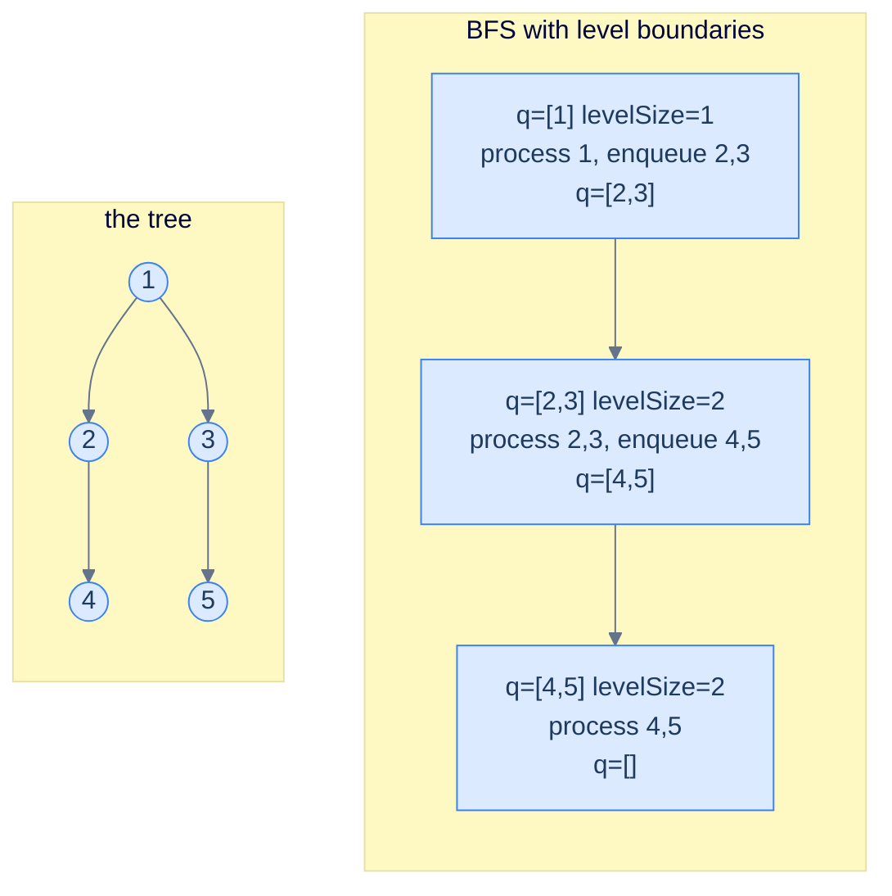

# The level-order pattern

The classic level-order traversal from lesson 5 dequeues *one node at a time*. That visits everything in the right *order* but loses the *level boundaries* — once you've dequeued five nodes, you have no easy way to know which were on level 1 and which on level 2.

The fix is one of the most important small tricks in tree algorithms:

```text
while queue is non-empty:
  levelSize = queue.size()                       # snapshot how many nodes are on the current level
  for i in 0..levelSize:
    n = queue.pop()
    process(n)                                   # all work for THIS level happens here
    if n.left:  queue.push(n.left)               # enqueueing children populates the NEXT level
    if n.right: queue.push(n.right)
  # any per-level summary (sum, max, snapshot) goes here, after the inner loop
```

The genius is the **`levelSize = queue.size()`** snapshot. At the moment the outer loop's body starts, the queue holds exactly the nodes of the current level — *and nothing else*. So `queue.size()` is the number of nodes on this level, and the inner loop processes precisely that many. By the time the inner loop ends, the queue holds exactly the *next* level (because every dequeued node enqueued its children, who all live on the next level). The boundary is preserved without any per-node bookkeeping.

> 🖼 Diagram — BFS with level boundaries — at each iteration of the outer loop, the queue holds exactly one level. The snapshot levelSize = queue.size() at the top of the loop is the entire trick that keeps levels separate.


<p align="center"><strong>BFS with level boundaries — at each iteration of the outer loop, the queue holds exactly one level. The snapshot <code>levelSize = queue.size()</code> at the top of the loop is the entire trick that keeps levels separate.</strong></p>

> *Predict before reading on — what would happen if you forgot the <code>levelSize</code> snapshot and just kept dequeueing?*
>
> You'd flatten everything into a single global stream and lose the level boundaries — exactly what the basic level-order traversal from lesson 5 produces. Forgetting the snapshot is fine when you only need a flat list. It's catastrophic when you need *per-level* aggregates.

## Generic pattern

The "list each level's values" template — the simplest member of the family.


```python run
from collections import deque
from typing import List, Optional

class TreeNode:
    def __init__(self, val=0, left=None, right=None):
        self.val, self.left, self.right = val, left, right

def levels(root: Optional[TreeNode]) -> List[List[int]]:
    out: List[List[int]] = []
    if root is None: return out
    q = deque([root])
    while q:
        level_size = len(q)
        level: List[int] = []
        for _ in range(level_size):
            n = q.popleft()
            level.append(n.val)
            if n.left:  q.append(n.left)
            if n.right: q.append(n.right)
        out.append(level)
    return out
```

```java run
public static List<List<Integer>> levels(TreeNode root) {
    List<List<Integer>> out = new ArrayList<>();
    if (root == null) return out;
    Queue<TreeNode> q = new ArrayDeque<>();
    q.offer(root);
    while (!q.isEmpty()) {
        int levelSize = q.size();
        List<Integer> level = new ArrayList<>();
        for (int i = 0; i < levelSize; i++) {
            TreeNode n = q.poll();
            level.add(n.val);
            if (n.left  != null) q.offer(n.left);
            if (n.right != null) q.offer(n.right);
        }
        out.add(level);
    }
    return out;
}
```


## Complexity

> **Time:** O(N). **Space:** O(W) for the queue, where W is the maximum width (worst case ~N/2 on a perfect tree).

# How to recognise it

The pattern fits when:

- The answer at any node depends on its **level** (depth from root) — sum per level, max per level, leftmost per level, etc.
- You need to compute something *per level* and the result is a list-of-things-by-level, or
- Structural completeness needs a *left-to-right* sweep across each level (e.g. "is this tree complete?")

Concrete cues:

- *"… per level"* — almost always BFS with the snapshot trick.
- *"deepest / shallowest level …"* — track the *last* (or first) level's data.
- *"complete / perfect / balanced check (with row-major fill)"* — left-to-right sweep checks for gaps.
- *"zigzag / spiral / boustrophedon"* — alternate direction per level.
- *"width / cousins / left view / right view"* — per-level positional questions.

Anti-pattern: if there's no notion of "level" in the question (path sums, subtree sizes, ancestry checks), depth-first patterns will be cleaner.

<!-- ============================================== -->
<!-- SWEEP 2 — missing sections (placeholders only) -->
<!-- ============================================== -->

<!-- TODO: Understanding the Pattern — missing, needs to be written -->
<!--       Guidance: umbrella H2 with the subsections below -->

<!-- TODO: Why Naive Isn't Enough — missing, needs to be written -->
<!--       Guidance: motivation for why the obvious approach fails -->

<!-- TODO: The Core Idea — missing, needs to be written -->
<!--       Guidance: one paragraph: the central trick -->

<!-- TODO: How the Pointers/Window Move — missing, needs to be written -->
<!--       Guidance: mechanics of the moving parts -->

<!-- TODO: The Generic Algorithm — missing, needs to be written -->
<!--       Guidance: numbered steps, no code -->

<!-- TODO: Generic Implementation — missing, needs to be written -->
<!--       Guidance: Python block + Java block of the skeleton -->

<!-- TODO: Complexity Analysis — missing, needs to be written -->
<!--       Guidance: table -->

<!-- TODO: Variants / Taxonomy — missing, needs to be written -->
<!--       Guidance: enumerate sub-shapes of this pattern -->

<!-- TODO: Identifying — missing, needs to be written -->
<!--       Guidance: per-variant: recognition checklist + canonical example -->

<!-- TODO: Recognition Checklist — missing, needs to be written -->
<!--       Guidance: 4-question diagnostic — the source of the Problem-section Diagnostic Questions -->

<!-- TODO: Canonical Example — missing, needs to be written -->
<!--       Guidance: fully worked example: brute force → optimised → template fit -->

<!-- TODO: Problems in This Category — missing, needs to be written -->
<!--       Guidance: table with links to the 02-problems/ files -->
