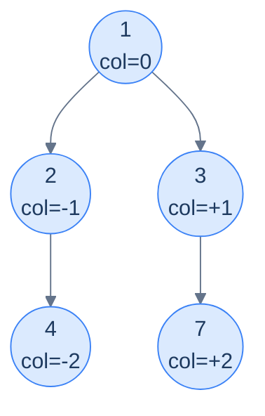

# The column-coordinate template

```text
queue = [(root, column=0)]
columns = sorted_map<int, value_for_this_view>
while queue is non-empty:
  (n, c) = queue.pop_front()
  apply_per_view_update(columns, c, n.val)        # ← differs per problem
  if n.left:  queue.push((n.left,  c - 1))
  if n.right: queue.push((n.right, c + 1))
return columns.values_in_column_order()
```

Two things change between the four problems:

1. **The `column` arithmetic for children.** For top/bottom/vertical: `left → c-1`, `right → c+1`. For diagonal: `left → c+1`, `right → c` (a left-edge starts a new diagonal; a right-edge stays on the current one).
2. **What we put into `columns[c]`.** Top view: only the *first* node ever to land in this column (since BFS visits topmost first). Bottom view: *overwrite* with each new node (the last one wins → the bottommost). Vertical: *append* to a list per column. Diagonal: *append* to a list per diagonal.

> 🖼 Diagram — Column coordinates assigned by BFS — root at 0, each left-edge subtracts 1, each right-edge adds 1. Group by column and you can answer any "looking from above / from the side" question about the tree.


<p align="center"><strong>Column coordinates assigned by BFS — root at 0, each left-edge subtracts 1, each right-edge adds 1. Group by column and you can answer any "looking from above / from the side" question about the tree.</strong></p>

> *Why a sorted map (TreeMap / std::map) and not a hash map?* Because at the end we need to iterate columns from leftmost to rightmost. A hash map would force an O(K log K) sort on output. A sorted map keeps everything in column order automatically. (Alternative: hash map plus tracking `min_col`/`max_col` and iterating the integer range — same idea, more bookkeeping.)

<!-- ============================================== -->
<!-- SWEEP 2 — missing sections (placeholders only) -->
<!-- ============================================== -->

<!-- TODO: Understanding the Pattern — missing, needs to be written -->
<!--       Guidance: umbrella H2 with the subsections below -->

<!-- TODO: Why Naive Isn't Enough — missing, needs to be written -->
<!--       Guidance: motivation for why the obvious approach fails -->

<!-- TODO: The Core Idea — missing, needs to be written -->
<!--       Guidance: one paragraph: the central trick -->

<!-- TODO: How the Pointers/Window Move — missing, needs to be written -->
<!--       Guidance: mechanics of the moving parts -->

<!-- TODO: The Generic Algorithm — missing, needs to be written -->
<!--       Guidance: numbered steps, no code -->

<!-- TODO: Generic Implementation — missing, needs to be written -->
<!--       Guidance: Python block + Java block of the skeleton -->

<!-- TODO: Complexity Analysis — missing, needs to be written -->
<!--       Guidance: table -->

<!-- TODO: Variants / Taxonomy — missing, needs to be written -->
<!--       Guidance: enumerate sub-shapes of this pattern -->

<!-- TODO: Identifying — missing, needs to be written -->
<!--       Guidance: per-variant: recognition checklist + canonical example -->

<!-- TODO: Recognition Checklist — missing, needs to be written -->
<!--       Guidance: 4-question diagnostic — the source of the Problem-section Diagnostic Questions -->

<!-- TODO: Canonical Example — missing, needs to be written -->
<!--       Guidance: fully worked example: brute force → optimised → template fit -->

<!-- TODO: Problems in This Category — missing, needs to be written -->
<!--       Guidance: table with links to the 02-problems/ files -->
