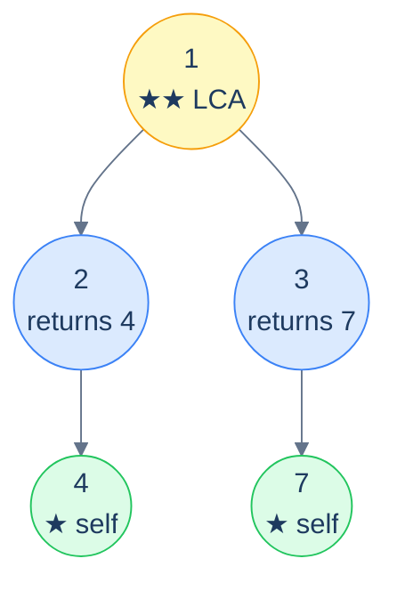
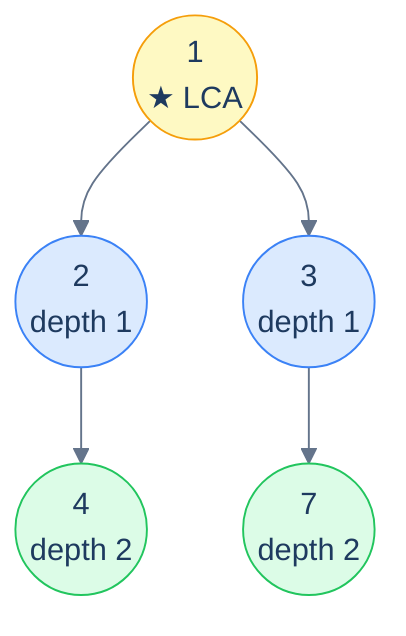

# 16. Pattern: Lowest Common Ancestor

## The Hook

Take any two leaves in a binary tree. Trace the path from each one back up to the root. The two paths *meet* at some specific node — and that meeting node is, by definition, the **lowest common ancestor** (LCA) of the two leaves: the deepest node that has both as descendants. Every node above the LCA is also a common ancestor, but the LCA is the *closest* — the most informative one.

LCA is one of the most important *relational* questions you can ask about a tree. Network routing protocols compute LCAs to find the shortest path between two routers in a routing tree. Version-control merges (Git, Mercurial) compute the LCA of two commits to find the *base* for a three-way merge. Phylogenetics uses LCA on a tree of life to find the *most recent common ancestor* of two species. Even in plain old data-structure interviews, LCA shows up constantly because it's a versatile primitive — many other tree problems (distance between nodes, deepest-shared-subtree, "are these two nodes related?") reduce to LCA in O(N).

The classical recursive LCA algorithm is one of the most elegant pieces of code in the chapter. Three lines:

> 1. If the current node is one of the two targets, *return it*.
> 2. Recurse into both subtrees.
> 3. If *both* recursive calls returned a node, the current node is the LCA. If only one did, propagate it up. If neither, return null.

That's it. The recursion does all the work — there's no need to compute paths, store maps, or backtrack. The "deepest meeting point" emerges naturally from the way the recursion combines child answers.

This lesson covers the canonical algorithm and four common variants: LCA with existence check, LCA of N nodes, LCA of all deepest leaves, and distance between two nodes (computed via LCA + depths). Each in Python and Java.

---

## Table of contents

1. [The classical LCA recursion](#the-classical-lca-recursion)
2. [How to recognise it](#how-to-recognise-it)
3. [Problem 1 — Lowest Common Ancestor](#problem-1--lowest-common-ancestor)
4. [Problem 2 — LCA with existence check](#problem-2--lca-with-existence-check)
5. [Problem 3 — LCA of N random nodes](#problem-3--lca-of-n-random-nodes)
6. [Problem 4 — LCA of the deepest leaves](#problem-4--lca-of-the-deepest-leaves)
7. [Problem 5 — Distance between two nodes](#problem-5--distance-between-two-nodes)

***

# The classical LCA recursion

```text
LCA(node, A, B):
  if node is null:           return null
  if node == A or node == B: return node          # ★ found one — propagate it up
  leftAnswer  = LCA(node.left,  A, B)
  rightAnswer = LCA(node.right, A, B)
  if leftAnswer and rightAnswer: return node      # ★★ both sides returned — this IS the LCA
  return leftAnswer or rightAnswer                # only one side hit; propagate that
```

The two starred lines do all the heavy lifting:

- **★** When the recursion *finds* one of the targets, it returns *that node*. From the parent's perspective, this is "yes, A is somewhere down here". The parent then waits for the other recursion call to come back.
- **★★** When *both* of the parent's recursion calls returned a node, that means A is on one side and B is on the other — so the *current node* is their lowest common ancestor. Bubble it up unchanged.

The "only one returned" case is what propagates the LCA up to the root after it's been found. Once a deeper node has identified itself as the LCA, every ancestor's left/right answer pair will be (LCA, null) or (null, LCA), which is exactly what makes the third line propagate it untouched.



<p align="center"><strong>LCA recursion in action — leaf 4 returns itself; leaf 7 returns itself; nodes 2 and 3 each propagate their finding upward; root 1 sees <em>both</em> children returned non-null, so it identifies itself as the LCA and propagates that up.</strong></p>

> *Predict before reading on — what does the algorithm return when one of the targets is an <em>ancestor</em> of the other?*
>
> The ancestor itself. Say the targets are `2` and `4`, and `2` is the parent of `4`. The recursion at node `2` triggers the `node == A or node == B` early-exit (returning `2`) *before* it ever recurses to find `4`. From `2`'s parent's perspective, the left side returned `2` and the right side returned null — so `2` propagates up untouched. The algorithm correctly identifies `2` as the LCA. *No special case needed* — it falls out of the structure.

## Generic pattern


```python run
from typing import Optional


class TreeNode:
    def __init__(self, val=0, left=None, right=None):
        self.val = val
        self.left = left
        self.right = right


def from_level_order(values):
    """Build tree from list like [1, 2, 3, None, 4]. None means missing child."""
    if not values:
        return None
    root = TreeNode(values[0])
    queue = [root]
    i = 1
    while queue and i < len(values):
        node = queue.pop(0)
        if i < len(values) and values[i] is not None:
            node.left = TreeNode(values[i])
            queue.append(node.left)
        i += 1
        if i < len(values) and values[i] is not None:
            node.right = TreeNode(values[i])
            queue.append(node.right)
        i += 1
    return root


def find(root, val):
    """Locate a node by value."""
    if root is None:
        return None
    if root.val == val:
        return root
    return find(root.left, val) or find(root.right, val)


class Solution:
    def lowest_common_ancestor(
        self,
        root: Optional[TreeNode],
        node_a: Optional[TreeNode],
        node_b: Optional[TreeNode],
    ) -> Optional[TreeNode]:

        # If the root is null, return null
        if root is None:
            return None

        # If the current node is equal to either nodeA or nodeB
        # return the current node
        if root == node_a or root == node_b:
            return root

        # Recursively search in the left and right subtrees
        left_lca = self.lowest_common_ancestor(root.left, node_a, node_b)
        right_lca = self.lowest_common_ancestor(
            root.right, node_a, node_b
        )

        # If both subtrees return a non-null value
        # the current node is the lowest common ancestor
        if left_lca and right_lca:
            return root

        # If only one subtree returns a non-null value, return that value
        return left_lca if left_lca else right_lca


# Examples from the problem statement
root1 = from_level_order([1, 2, 3, 4, None, None, 7])
lca1 = Solution().lowest_common_ancestor(root1, find(root1, 4), find(root1, 7))
print(lca1.val)   # 1

root2 = from_level_order([1, 8, 4, None, None, 2, 7])
lca2 = Solution().lowest_common_ancestor(root2, find(root2, 2), find(root2, 7))
print(lca2.val)   # 4

# Edge cases
print(Solution().lowest_common_ancestor(None, None, None))  # None

root3 = from_level_order([1, 2, 3, 4, None, None, 7])      # LCA is root itself
lca3 = Solution().lowest_common_ancestor(root3, find(root3, 2), find(root3, 3))
print(lca3.val)   # 1

root4 = from_level_order([1, 2, 3, 4, None, None, 7])      # one node is ancestor of the other
lca4 = Solution().lowest_common_ancestor(root4, find(root4, 2), find(root4, 4))
print(lca4.val)   # 2

root5 = from_level_order([1, 8, 4, None, None, 2, 7])      # deep internal node
lca5 = Solution().lowest_common_ancestor(root5, find(root5, 8), find(root5, 4))
print(lca5.val)   # 1

root6 = TreeNode(1)                                         # single node
print(Solution().lowest_common_ancestor(root6, root6, root6).val)  # 1
```

```java run
import java.util.*;

public class Main {
    static class TreeNode {
        int val;
        TreeNode left;
        TreeNode right;
        TreeNode() {}
        TreeNode(int val) { this.val = val; }
    }

    static TreeNode fromLevelOrder(Integer... values) {
        if (values.length == 0 || values[0] == null) return null;
        TreeNode root = new TreeNode(values[0]);
        java.util.Deque<TreeNode> queue = new java.util.ArrayDeque<>();
        queue.add(root);
        int i = 1;
        while (!queue.isEmpty() && i < values.length) {
            TreeNode node = queue.poll();
            if (i < values.length && values[i] != null) {
                node.left = new TreeNode(values[i]);
                queue.add(node.left);
            }
            i++;
            if (i < values.length && values[i] != null) {
                node.right = new TreeNode(values[i]);
                queue.add(node.right);
            }
            i++;
        }
        return root;
    }

    static TreeNode find(TreeNode root, int val) {
        if (root == null) return null;
        if (root.val == val) return root;
        TreeNode left = find(root.left, val);
        return left != null ? left : find(root.right, val);
    }

    static class Solution {
        public TreeNode lowestCommonAncestor(
            TreeNode root,
            TreeNode nodeA,
            TreeNode nodeB
        ) {

            // If the root is null, return null
            if (root == null) {
                return null;
            }

            // If the current node is equal to either nodeA or nodeB
            // return the current node
            if (root == nodeA || root == nodeB) {
                return root;
            }

            // Recursively search in the left and right subtrees
            TreeNode leftLCA = lowestCommonAncestor(root.left, nodeA, nodeB);
            TreeNode rightLCA = lowestCommonAncestor(
                root.right,
                nodeA,
                nodeB
            );

            // If both subtrees return a non-null value
            // the current node is the lowest common ancestor
            if (leftLCA != null && rightLCA != null) {
                return root;
            }

            // If only one subtree returns a non-null value, return that
            // value
            if (leftLCA != null) {
                return leftLCA;
            }

            return rightLCA;
        }
    }

    public static void main(String[] args) {
        // Examples from the problem statement
        TreeNode root1 = fromLevelOrder(1, 2, 3, 4, null, null, 7);
        System.out.println(new Solution().lowestCommonAncestor(root1, find(root1, 4), find(root1, 7)).val);  // 1

        TreeNode root2 = fromLevelOrder(1, 8, 4, null, null, 2, 7);
        System.out.println(new Solution().lowestCommonAncestor(root2, find(root2, 2), find(root2, 7)).val);  // 4

        // Edge cases
        System.out.println(new Solution().lowestCommonAncestor(null, null, null));  // null

        TreeNode root3 = fromLevelOrder(1, 2, 3, 4, null, null, 7);               // LCA is root
        System.out.println(new Solution().lowestCommonAncestor(root3, find(root3, 2), find(root3, 3)).val);  // 1

        TreeNode root4 = fromLevelOrder(1, 2, 3, 4, null, null, 7);               // one is ancestor of other
        System.out.println(new Solution().lowestCommonAncestor(root4, find(root4, 2), find(root4, 4)).val);  // 2

        TreeNode root5 = fromLevelOrder(1, 8, 4, null, null, 2, 7);               // deep internal node
        System.out.println(new Solution().lowestCommonAncestor(root5, find(root5, 8), find(root5, 4)).val);  // 1

        TreeNode root6 = new TreeNode(1);                                          // single node
        System.out.println(new Solution().lowestCommonAncestor(root6, root6, root6).val);  // 1
    }
}
```


## Complexity

> **Time:** O(N) — every node is visited at most once. **Space:** O(h) for recursion stack.

***

# How to recognise it

The pattern fits when:

- The question asks about the **closest shared ancestor** of two (or more) nodes.
- The answer can be derived by *combining left and right subtree results*: if both returned non-null targets, the current node is the meeting point; otherwise propagate.

Concrete cues:

- *"Lowest common ancestor of …"* — directly.
- *"Distance between two nodes"* — LCA + depths (Problem 5).
- *"Closest shared subtree containing …"* — restate as LCA.
- *"Find the deepest node that contains both X and Y"* — same.

Anti-pattern: if the tree is a *binary search tree*, there's an O(log N) BST-specialised LCA that beats this O(N) algorithm — covered in the BST chapter.

***

# Problem 1 — Lowest Common Ancestor

> Given a tree and two nodes `nodeA` and `nodeB`, find their LCA. Assume both nodes exist in the tree.

This *is* the generic algorithm — see the code block above. No further specialisation needed.

***

# Problem 2 — LCA with existence check

> Same as Problem 1, except now there's no guarantee that *both* nodes are actually in the tree. If either is missing, return `null`.

The classical algorithm has a subtle pitfall here: if only `nodeA` exists in the tree (and `nodeB` doesn't), the algorithm returns `nodeA` — which is *wrong* (the answer should be `null`). The fix: do a *separate existence pass* for both nodes first, then run the LCA only if both exist.

This adds one O(N) pre-pass, keeping overall complexity at O(N).

<details>
<summary><h2>Solution</h2></summary>


```python run
from typing import Optional


class TreeNode:
    def __init__(self, val=0, left=None, right=None):
        self.val = val
        self.left = left
        self.right = right


def from_level_order(values):
    """Build tree from list like [1, 2, 3, None, 4]. None means missing child."""
    if not values:
        return None
    root = TreeNode(values[0])
    queue = [root]
    i = 1
    while queue and i < len(values):
        node = queue.pop(0)
        if i < len(values) and values[i] is not None:
            node.left = TreeNode(values[i])
            queue.append(node.left)
        i += 1
        if i < len(values) and values[i] is not None:
            node.right = TreeNode(values[i])
            queue.append(node.right)
        i += 1
    return root


def find(root, val):
    """Locate a node by value."""
    if root is None:
        return None
    if root.val == val:
        return root
    return find(root.left, val) or find(root.right, val)


class Solution:
    def node_exists(
        self, root: Optional[TreeNode], target: Optional[TreeNode]
    ) -> bool:

        # If the root is null, the target node does not exist
        if not root:
            return False

        # If the current node is the target node, return true
        if root == target:
            return True

        # Recursively search in the left and right subtrees
        node_exists_in_left_subtree = self.node_exists(root.left, target)
        node_exists_in_right_subtree = self.node_exists(
            root.right, target
        )

        # Return true if the target node exists in either subtree
        return (
            node_exists_in_left_subtree or node_exists_in_right_subtree
        )

    def lowest_common_ancestor(
        self,
        root: Optional[TreeNode],
        node_a: Optional[TreeNode],
        node_b: Optional[TreeNode],
    ) -> Optional[TreeNode]:

        # If the root is null, return null
        if not root:
            return None

        # If the current node is equal to either nodeA or nodeB
        # return the current node
        if root == node_a or root == node_b:
            return root

        # Recursively search in the left and right subtrees
        left_lca = self.lowest_common_ancestor(root.left, node_a, node_b)
        right_lca = self.lowest_common_ancestor(
            root.right, node_a, node_b
        )

        # If both subtrees return a non-null value
        # the current node is the lowest common ancestor
        if left_lca and right_lca:
            return root

        # If only one subtree returns a non-null value, return that value
        return left_lca if left_lca else right_lca

    def lowest_common_ancestor_ii(
        self,
        root: Optional[TreeNode],
        node_a: Optional[TreeNode],
        node_b: Optional[TreeNode],
    ) -> Optional[TreeNode]:

        # If any input is null, return null
        if not root or not node_a or not node_b:
            return None

        # Check if both nodes exist in the tree
        if not self.node_exists(root, node_a) or not self.node_exists(
            root, node_b
        ):
            return None

        return self.lowest_common_ancestor(root, node_a, node_b)


# Examples from the problem statement
root1 = from_level_order([1, 2, 3, 4, None, None, 7])
lca1 = Solution().lowest_common_ancestor_ii(root1, find(root1, 4), find(root1, 7))
print(lca1.val)   # 1

root2 = from_level_order([1, 8, 4, None, None, 2, 7])
ghost = TreeNode(9)  # node not in tree
print(Solution().lowest_common_ancestor_ii(root2, find(root2, 2), ghost))  # None

# Edge cases
print(Solution().lowest_common_ancestor_ii(None, None, None))              # None

root3 = from_level_order([1, 2, 3, 4, None, None, 7])                     # LCA is root
lca3 = Solution().lowest_common_ancestor_ii(root3, find(root3, 2), find(root3, 3))
print(lca3.val)   # 1

root4 = from_level_order([1, 2, 3, 4, None, None, 7])                     # one is ancestor of the other
lca4 = Solution().lowest_common_ancestor_ii(root4, find(root4, 2), find(root4, 4))
print(lca4.val)   # 2

root5 = from_level_order([1, 8, 4, None, None, 2, 7])                     # leaf siblings
lca5 = Solution().lowest_common_ancestor_ii(root5, find(root5, 2), find(root5, 7))
print(lca5.val)   # 4

root6 = TreeNode(1)                                                         # single node, both same
print(Solution().lowest_common_ancestor_ii(root6, root6, root6).val)       # 1
```

```java run
import java.util.*;

public class Main {
    static class TreeNode {
        int val;
        TreeNode left;
        TreeNode right;
        TreeNode() {}
        TreeNode(int val) { this.val = val; }
    }

    static TreeNode fromLevelOrder(Integer... values) {
        if (values.length == 0 || values[0] == null) return null;
        TreeNode root = new TreeNode(values[0]);
        java.util.Deque<TreeNode> queue = new java.util.ArrayDeque<>();
        queue.add(root);
        int i = 1;
        while (!queue.isEmpty() && i < values.length) {
            TreeNode node = queue.poll();
            if (i < values.length && values[i] != null) {
                node.left = new TreeNode(values[i]);
                queue.add(node.left);
            }
            i++;
            if (i < values.length && values[i] != null) {
                node.right = new TreeNode(values[i]);
                queue.add(node.right);
            }
            i++;
        }
        return root;
    }

    static TreeNode find(TreeNode root, int val) {
        if (root == null) return null;
        if (root.val == val) return root;
        TreeNode left = find(root.left, val);
        return left != null ? left : find(root.right, val);
    }

    static class Solution {
        private boolean nodeExists(TreeNode root, TreeNode target) {

            // If the root is null, the target node does not exist
            if (root == null) {
                return false;
            }

            // If the current node is the target node, return true
            if (root == target) {
                return true;
            }

            // Recursively search in the left and right subtrees
            boolean nodeExistsInLeftSubtree = nodeExists(root.left, target);
            boolean nodeExistsInRightSubtree = nodeExists(
                root.right,
                target
            );

            // Return true if the target node exists in either subtree
            return nodeExistsInLeftSubtree || nodeExistsInRightSubtree;
        }

        private TreeNode lowestCommonAncestor(
            TreeNode root,
            TreeNode nodeA,
            TreeNode nodeB
        ) {

            // If the root is null, return null
            if (root == null) {
                return null;
            }

            // If the current node is equal to either nodeA or nodeB
            // return the current node
            if (root == nodeA || root == nodeB) {
                return root;
            }

            // Recursively search in the left and right subtrees
            TreeNode leftLCA = lowestCommonAncestor(root.left, nodeA, nodeB);
            TreeNode rightLCA = lowestCommonAncestor(
                root.right,
                nodeA,
                nodeB
            );

            // If both subtrees return a non-null value
            // the current node is the lowest common ancestor
            if (leftLCA != null && rightLCA != null) {
                return root;
            }

            // If only one subtree returns a non-null value, return that
            // value
            if (leftLCA != null) {
                return leftLCA;
            }

            return rightLCA;
        }

        public TreeNode lowestCommonAncestorII(
            TreeNode root,
            TreeNode nodeA,
            TreeNode nodeB
        ) {

            // If any input is null, return null
            if (root == null || nodeA == null || nodeB == null) {
                return null;
            }

            // Check if both nodes exist in the tree
            if (!nodeExists(root, nodeA) || !nodeExists(root, nodeB)) {
                return null;
            }

            return lowestCommonAncestor(root, nodeA, nodeB);
        }
    }

    public static void main(String[] args) {
        // Examples from the problem statement
        TreeNode root1 = fromLevelOrder(1, 2, 3, 4, null, null, 7);
        System.out.println(new Solution().lowestCommonAncestorII(root1, find(root1, 4), find(root1, 7)).val);  // 1

        TreeNode root2 = fromLevelOrder(1, 8, 4, null, null, 2, 7);
        TreeNode ghost = new TreeNode(9);  // node not in tree
        System.out.println(new Solution().lowestCommonAncestorII(root2, find(root2, 2), ghost));  // null

        // Edge cases
        System.out.println(new Solution().lowestCommonAncestorII(null, null, null));               // null

        TreeNode root3 = fromLevelOrder(1, 2, 3, 4, null, null, 7);                               // LCA is root
        System.out.println(new Solution().lowestCommonAncestorII(root3, find(root3, 2), find(root3, 3)).val);  // 1

        TreeNode root4 = fromLevelOrder(1, 2, 3, 4, null, null, 7);                               // one is ancestor
        System.out.println(new Solution().lowestCommonAncestorII(root4, find(root4, 2), find(root4, 4)).val);  // 2

        TreeNode root5 = fromLevelOrder(1, 8, 4, null, null, 2, 7);                               // leaf siblings
        System.out.println(new Solution().lowestCommonAncestorII(root5, find(root5, 2), find(root5, 7)).val);  // 4

        TreeNode root6 = new TreeNode(1);                                                          // single node
        System.out.println(new Solution().lowestCommonAncestorII(root6, root6, root6).val);       // 1
    }
}
```

</details>


***

# Problem 3 — LCA of N random nodes

> Given a list of nodes (possibly more than two), find the LCA of *all* of them.

Generalise the algorithm: instead of "is this node `A` or `B`?", check "is this node *in the set of targets*?". Use a hash set for O(1) lookup. The combine logic stays exactly the same.

<details>
<summary><h2>Solution</h2></summary>


```python run
from typing import Optional, List


class TreeNode:
    def __init__(self, val=0, left=None, right=None):
        self.val = val
        self.left = left
        self.right = right


def from_level_order(values):
    """Build tree from list like [1, 2, 3, None, 4]. None means missing child."""
    if not values:
        return None
    root = TreeNode(values[0])
    queue = [root]
    i = 1
    while queue and i < len(values):
        node = queue.pop(0)
        if i < len(values) and values[i] is not None:
            node.left = TreeNode(values[i])
            queue.append(node.left)
        i += 1
        if i < len(values) and values[i] is not None:
            node.right = TreeNode(values[i])
            queue.append(node.right)
        i += 1
    return root


def find(root, val):
    """Locate a node by value."""
    if root is None:
        return None
    if root.val == val:
        return root
    return find(root.left, val) or find(root.right, val)


class Solution:
    def lowest_common_ancestor(
        self, root: Optional[TreeNode], nodes: set
    ) -> Optional[TreeNode]:

        # If the root is null, return null
        if not root:
            return None

        # If the current node is part of the nodes set, return it
        if root in nodes:
            return root

        # Recursively search in the left and right subtrees
        left_lca = self.lowest_common_ancestor(root.left, nodes)
        right_lca = self.lowest_common_ancestor(root.right, nodes)

        # If both subtrees return a non-null value
        # the current node is the lowest common ancestor
        if left_lca and right_lca:
            return root

        # If only one subtree returns a non-null value, return that value
        return left_lca if left_lca else right_lca

    def random_lowest_common_ancestor(
        self, root: Optional[TreeNode], nodes: List[Optional[TreeNode]]
    ) -> Optional[TreeNode]:

        # Convert the list to a set for faster lookup
        nodeSet = set(nodes)

        # Find and return the lowest common ancestor
        return self.lowest_common_ancestor(root, nodeSet)


# Examples from the problem statement
root1 = from_level_order([1, 2, 3, 4, None, None, 7])
lca1 = Solution().random_lowest_common_ancestor(
    root1, [find(root1, 2), find(root1, 4), find(root1, 7)]
)
print(lca1.val)   # 1

root2 = from_level_order([1, 8, 4, None, None, 2, 7])
lca2 = Solution().random_lowest_common_ancestor(
    root2, [find(root2, 2), find(root2, 7)]
)
print(lca2.val)   # 4

# Edge cases
print(Solution().random_lowest_common_ancestor(None, []))              # None

root3 = from_level_order([1, 2, 3, 4, None, None, 7])                 # single node in list
lca3 = Solution().random_lowest_common_ancestor(root3, [find(root3, 4)])
print(lca3.val)   # 4

root4 = from_level_order([1, 2, 3, 4, None, None, 7])                 # all leaf nodes → LCA is root
lca4 = Solution().random_lowest_common_ancestor(
    root4, [find(root4, 4), find(root4, 7)]
)
print(lca4.val)   # 1

root5 = from_level_order([1, 8, 4, None, None, 2, 7])                 # three nodes, deep LCA
lca5 = Solution().random_lowest_common_ancestor(
    root5, [find(root5, 8), find(root5, 2), find(root5, 7)]
)
print(lca5.val)   # 1

root6 = from_level_order([1, 2, 3])
lca6 = Solution().random_lowest_common_ancestor(
    root6, [find(root6, 2), find(root6, 3)]
)
print(lca6.val)   # 1 (root)
```

```java run
import java.util.*;

public class Main {
    static class TreeNode {
        int val;
        TreeNode left;
        TreeNode right;
        TreeNode() {}
        TreeNode(int val) { this.val = val; }
    }

    static TreeNode fromLevelOrder(Integer... values) {
        if (values.length == 0 || values[0] == null) return null;
        TreeNode root = new TreeNode(values[0]);
        java.util.Deque<TreeNode> queue = new java.util.ArrayDeque<>();
        queue.add(root);
        int i = 1;
        while (!queue.isEmpty() && i < values.length) {
            TreeNode node = queue.poll();
            if (i < values.length && values[i] != null) {
                node.left = new TreeNode(values[i]);
                queue.add(node.left);
            }
            i++;
            if (i < values.length && values[i] != null) {
                node.right = new TreeNode(values[i]);
                queue.add(node.right);
            }
            i++;
        }
        return root;
    }

    static TreeNode find(TreeNode root, int val) {
        if (root == null) return null;
        if (root.val == val) return root;
        TreeNode left = find(root.left, val);
        return left != null ? left : find(root.right, val);
    }

    static class Solution {
        private TreeNode lowestCommonAncestor(
            TreeNode root,
            Set<TreeNode> nodes
        ) {

            // If the root is null, return null
            if (root == null) {
                return null;
            }

            // If the current node is part of the nodes set, return it
            if (nodes.contains(root)) {
                return root;
            }

            // Recursively search in the left and right subtrees
            TreeNode leftLCA = lowestCommonAncestor(root.left, nodes);
            TreeNode rightLCA = lowestCommonAncestor(root.right, nodes);

            // If both subtrees return a non-null value
            // the current node is the lowest common ancestor
            if (leftLCA != null && rightLCA != null) {
                return root;
            }

            // If only one subtree returns a non-null value, return that
            // value
            if (leftLCA != null) {
                return leftLCA;
            }

            return rightLCA;
        }

        public TreeNode randomLowestCommonAncestor(
            TreeNode root,
            List<TreeNode> nodes
        ) {

            // Convert the array to a HashSet for faster lookup
            Set<TreeNode> nodeSet = new HashSet<>();
            for (TreeNode node : nodes) {
                nodeSet.add(node);
            }

            // Find and return the lowest common ancestor
            return lowestCommonAncestor(root, nodeSet);
        }
    }

    public static void main(String[] args) {
        // Examples from the problem statement
        TreeNode root1 = fromLevelOrder(1, 2, 3, 4, null, null, 7);
        System.out.println(new Solution().randomLowestCommonAncestor(
            root1, Arrays.asList(find(root1, 2), find(root1, 4), find(root1, 7))).val);  // 1

        TreeNode root2 = fromLevelOrder(1, 8, 4, null, null, 2, 7);
        System.out.println(new Solution().randomLowestCommonAncestor(
            root2, Arrays.asList(find(root2, 2), find(root2, 7))).val);  // 4

        // Edge cases
        System.out.println(new Solution().randomLowestCommonAncestor(null, new ArrayList<>()));  // null

        TreeNode root3 = fromLevelOrder(1, 2, 3, 4, null, null, 7);                             // single node
        System.out.println(new Solution().randomLowestCommonAncestor(
            root3, Arrays.asList(find(root3, 4))).val);  // 4

        TreeNode root4 = fromLevelOrder(1, 2, 3, 4, null, null, 7);                             // leaf nodes
        System.out.println(new Solution().randomLowestCommonAncestor(
            root4, Arrays.asList(find(root4, 4), find(root4, 7))).val);  // 1

        TreeNode root5 = fromLevelOrder(1, 8, 4, null, null, 2, 7);                             // three nodes
        System.out.println(new Solution().randomLowestCommonAncestor(
            root5, Arrays.asList(find(root5, 8), find(root5, 2), find(root5, 7))).val);  // 1

        TreeNode root6 = fromLevelOrder(1, 2, 3);
        System.out.println(new Solution().randomLowestCommonAncestor(
            root6, Arrays.asList(find(root6, 2), find(root6, 3))).val);  // 1
    }
}
```

</details>


***

# Problem 4 — LCA of the deepest leaves

> Find the LCA of all the *deepest leaves* in the tree.

Two-pass: first do a level-order traversal to find the deepest leaves; then run the N-node LCA on that set.

A more elegant *one-pass* solution exists using the stateful postorder pattern from lesson 11 — return `(deepest depth, LCA so far)` from each subtree, and combine at each node. We'll stick with the two-pass version for clarity; the one-pass version is a good exercise.

<details>
<summary><h2>Solution</h2></summary>


```python run
from queue import Queue
from typing import Optional


class TreeNode:
    def __init__(self, val=0, left=None, right=None):
        self.val = val
        self.left = left
        self.right = right


def from_level_order(values):
    """Build tree from list like [1, 2, 3, None, 4]. None means missing child."""
    if not values:
        return None
    root = TreeNode(values[0])
    queue = [root]
    i = 1
    while queue and i < len(values):
        node = queue.pop(0)
        if i < len(values) and values[i] is not None:
            node.left = TreeNode(values[i])
            queue.append(node.left)
        i += 1
        if i < len(values) and values[i] is not None:
            node.right = TreeNode(values[i])
            queue.append(node.right)
        i += 1
    return root


class Solution:
    def find_deepest_leaves(self, root: Optional[TreeNode]) -> list:

        # Variable to store the deepest leaves
        deepest_leaves = []

        if not root:
            return deepest_leaves

        queue = Queue()
        queue.put(root)

        # Loop through each level in the tree
        while not queue.empty():

            # Get the size of the current level
            level_size = queue.qsize()

            # Reset deepestLeaves for the current level
            deepest_leaves.clear()

            # Loop through each node in the current level
            for _ in range(level_size):

                # Get the front node in the queue and remove it
                node = queue.get()

                # Add its value to the deepestLeaves
                deepest_leaves.append(node)

                # Add the node's children to the queue if they exist
                if node.left:
                    queue.put(node.left)

                if node.right:
                    queue.put(node.right)

        # The last computed deepestLeaves is for the deepest level
        return deepest_leaves

    def random_lowest_common_ancestor(
        self, root: Optional[TreeNode], nodes: set
    ) -> Optional[TreeNode]:

        # If the root is null, return null
        if not root:
            return None

        # If the current node is part of the nodes set, return it
        if root in nodes:
            return root

        # Recursively search in the left and right subtrees
        leftLCA = self.random_lowest_common_ancestor(root.left, nodes)
        rightLCA = self.random_lowest_common_ancestor(root.right, nodes)

        # If both subtrees return a non-null value
        # the current node is the lowest common ancestor
        if leftLCA and rightLCA:
            return root

        # If only one subtree returns a non-null value, return that value
        return leftLCA if leftLCA else rightLCA

    def deepest_lowest_common_ancestor(
        self, root: Optional[TreeNode]
    ) -> Optional[TreeNode]:
        deepest_leaves = self.find_deepest_leaves(root)

        # Convert the list to a set for faster lookup
        node_set = set(deepest_leaves)

        # Find and return the lowest common ancestor
        return self.random_lowest_common_ancestor(root, node_set)


# Examples from the problem statement
root1 = from_level_order([1, 2, 3, 4, 6, None, 7])
print(Solution().deepest_lowest_common_ancestor(root1).val)   # 1

root2 = from_level_order([1, 8, 4, None, None, 2, 7])
print(Solution().deepest_lowest_common_ancestor(root2).val)   # 4

# Edge cases
print(Solution().deepest_lowest_common_ancestor(None))        # None

root3 = TreeNode(1)                                           # single node
print(Solution().deepest_lowest_common_ancestor(root3).val)   # 1

root4 = from_level_order([1, 2, None, 3])                    # left skew, deepest = 3
print(Solution().deepest_lowest_common_ancestor(root4).val)   # 3

root5 = from_level_order([1, 2, 3])                          # balanced, two leaves at same depth
print(Solution().deepest_lowest_common_ancestor(root5).val)   # 1

root6 = from_level_order([1, 2, 3, 4, 5, None, None])       # one side deeper
print(Solution().deepest_lowest_common_ancestor(root6).val)   # 2
```

```java run
import java.util.*;

public class Main {
    static class TreeNode {
        int val;
        TreeNode left;
        TreeNode right;
        TreeNode() {}
        TreeNode(int val) { this.val = val; }
    }

    static TreeNode fromLevelOrder(Integer... values) {
        if (values.length == 0 || values[0] == null) return null;
        TreeNode root = new TreeNode(values[0]);
        java.util.Deque<TreeNode> queue = new java.util.ArrayDeque<>();
        queue.add(root);
        int i = 1;
        while (!queue.isEmpty() && i < values.length) {
            TreeNode node = queue.poll();
            if (i < values.length && values[i] != null) {
                node.left = new TreeNode(values[i]);
                queue.add(node.left);
            }
            i++;
            if (i < values.length && values[i] != null) {
                node.right = new TreeNode(values[i]);
                queue.add(node.right);
            }
            i++;
        }
        return root;
    }

    static class Solution {
        private List<TreeNode> findDeepestLeaves(TreeNode root) {
            List<TreeNode> deepestLeaves = new ArrayList<>();
            if (root == null) {
                return deepestLeaves;
            }

            Queue<TreeNode> queue = new LinkedList<>();
            queue.add(root);

            // Loop through each level in the tree
            while (!queue.isEmpty()) {
                int levelSize = queue.size();

                // Reset the deepestLeaves list for the current level
                deepestLeaves.clear();

                // Loop through each node in the current level
                for (int i = 0; i < levelSize; i++) {
                    TreeNode node = queue.poll();
                    deepestLeaves.add(node);

                    // Add the node's children to the queue if they exist
                    if (node.left != null) {
                        queue.add(node.left);
                    }

                    if (node.right != null) {
                        queue.add(node.right);
                    }
                }
            }

            // The last computed deepestLeaves is for the deepest level
            return deepestLeaves;
        }

        private TreeNode randomLowestCommonAncestor(
            TreeNode root,
            Set<TreeNode> nodes
        ) {
            if (root == null) {
                return null;
            }

            // If the current node is part of the nodes set, return it
            if (nodes.contains(root)) {
                return root;
            }

            // Recursively search in the left and right subtrees
            TreeNode leftLCA = randomLowestCommonAncestor(root.left, nodes);
            TreeNode rightLCA = randomLowestCommonAncestor(
                root.right,
                nodes
            );

            // If both subtrees return a non-null value
            // the current node is the lowest common ancestor
            if (leftLCA != null && rightLCA != null) {
                return root;
            }

            // If only one subtree returns a non-null value, return that
            // value
            if (leftLCA != null) {
                return leftLCA;
            }

            return rightLCA;
        }

        public TreeNode deepestLowestCommonAncestor(TreeNode root) {
            List<TreeNode> deepestLeaves = findDeepestLeaves(root);

            // Convert the list to a set for faster lookup
            Set<TreeNode> nodeSet = new HashSet<>(deepestLeaves);

            // Find and return the lowest common ancestor
            return randomLowestCommonAncestor(root, nodeSet);
        }
    }

    public static void main(String[] args) {
        // Examples from the problem statement
        TreeNode root1 = fromLevelOrder(1, 2, 3, 4, 6, null, 7);
        System.out.println(new Solution().deepestLowestCommonAncestor(root1).val);   // 1

        TreeNode root2 = fromLevelOrder(1, 8, 4, null, null, 2, 7);
        System.out.println(new Solution().deepestLowestCommonAncestor(root2).val);   // 4

        // Edge cases
        System.out.println(new Solution().deepestLowestCommonAncestor(null));        // null

        TreeNode root3 = new TreeNode(1);                                            // single node
        System.out.println(new Solution().deepestLowestCommonAncestor(root3).val);   // 1

        TreeNode root4 = fromLevelOrder(1, 2, null, 3);                             // left skew
        System.out.println(new Solution().deepestLowestCommonAncestor(root4).val);   // 3

        TreeNode root5 = fromLevelOrder(1, 2, 3);                                   // balanced two leaves
        System.out.println(new Solution().deepestLowestCommonAncestor(root5).val);   // 1

        TreeNode root6 = fromLevelOrder(1, 2, 3, 4, 5, null, null);                // one side deeper
        System.out.println(new Solution().deepestLowestCommonAncestor(root6).val);   // 2
    }
}
```

</details>


***

# Problem 5 — Distance between two nodes

> Given two values, return the number of edges on the path between the two nodes carrying those values.

Three steps:

1. Find the LCA of the two nodes.
2. Compute the depth of each target *measured from the LCA*.
3. Sum the two depths — that's the number of edges in the path.



<p align="center"><strong>Distance between 4 and 7 — LCA is 1; 4 is 2 edges down, 7 is 2 edges down. Total path length = 2 + 2 = <strong>4 edges</strong>.</strong></p>

<details>
<summary><h2>Solution</h2></summary>


```python run
from typing import Optional


class TreeNode:
    def __init__(self, val=0, left=None, right=None):
        self.val = val
        self.left = left
        self.right = right


def from_level_order(values):
    """Build tree from list like [1, 2, 3, None, 4]. None means missing child."""
    if not values:
        return None
    root = TreeNode(values[0])
    queue = [root]
    i = 1
    while queue and i < len(values):
        node = queue.pop(0)
        if i < len(values) and values[i] is not None:
            node.left = TreeNode(values[i])
            queue.append(node.left)
        i += 1
        if i < len(values) and values[i] is not None:
            node.right = TreeNode(values[i])
            queue.append(node.right)
        i += 1
    return root


class Solution:
    def lowest_common_ancestor(
        self, root: Optional[TreeNode], val_a: int, val_b: int
    ) -> Optional[TreeNode]:

        # If the root is null, return null
        if not root:
            return None

        # If the value of the current node is equal to either valA or
        # valB return the current node
        if root.val == val_a or root.val == val_b:
            return root

        # Recursively search in the left and right subtrees
        left_lca = self.lowest_common_ancestor(root.left, val_a, val_b)
        right_lca = self.lowest_common_ancestor(root.right, val_a, val_b)

        # If both subtrees return a non-null value
        # the current node is the lowest common ancestor
        if left_lca and right_lca:
            return root

        # If only one subtree returns a non-null value, return that value
        return left_lca if left_lca else right_lca

    def find_depth(
        self, root: Optional[TreeNode], val: int, depth: int
    ) -> int:

        # Base case: if the root is null, return -1
        if not root:
            return -1

        # If the current node is the target node, return the depth
        if root.val == val:
            return depth

        left_depth = self.find_depth(root.left, val, depth + 1)

        # If left_depth is not -1, the target node is in the left subtree
        if left_depth != -1:
            return left_depth

        # If left_depth is -1, search in the right subtree
        return self.find_depth(root.right, val, depth + 1)

    def distance_between_nodes(
        self, root: Optional[TreeNode], val_a: int, val_b: int
    ) -> int:

        # If the root is null, return -1
        if not root:
            return -1

        # Step 1: Find the LCA of valA and valB
        lca = self.lowest_common_ancestor(root, val_a, val_b)

        # If either node is missing, return -1
        if not lca:
            return -1

        # Step 2: Find the depths of valA, valB from LCA
        depth_a = self.find_depth(lca, val_a, 0)
        depth_b = self.find_depth(lca, val_b, 0)

        # Step 3: Compute the distance
        return depth_a + depth_b


# Examples from the problem statement
print(Solution().distance_between_nodes(from_level_order([1, 2, 3, 4, None, None, 7]), 4, 7))         # 4
print(Solution().distance_between_nodes(from_level_order([1, 8, 4, None, None, 2, 7, None, 9]), 2, 8))  # 3

# Edge cases
print(Solution().distance_between_nodes(None, 1, 2))                                                    # -1
print(Solution().distance_between_nodes(TreeNode(1), 1, 1))                                            # 0 (same node)
print(Solution().distance_between_nodes(from_level_order([1, 2, 3]), 2, 3))                            # 2 (siblings)
print(Solution().distance_between_nodes(from_level_order([1, 2, 3, 4, None, None, 7]), 1, 4))         # 2 (root to leaf)
print(Solution().distance_between_nodes(from_level_order([1, 2, 3, 4, None, None, 7]), 4, 2))         # 1 (parent-child)
```

```java run
import java.util.*;

public class Main {
    static class TreeNode {
        int val;
        TreeNode left;
        TreeNode right;
        TreeNode() {}
        TreeNode(int val) { this.val = val; }
    }

    static TreeNode fromLevelOrder(Integer... values) {
        if (values.length == 0 || values[0] == null) return null;
        TreeNode root = new TreeNode(values[0]);
        java.util.Deque<TreeNode> queue = new java.util.ArrayDeque<>();
        queue.add(root);
        int i = 1;
        while (!queue.isEmpty() && i < values.length) {
            TreeNode node = queue.poll();
            if (i < values.length && values[i] != null) {
                node.left = new TreeNode(values[i]);
                queue.add(node.left);
            }
            i++;
            if (i < values.length && values[i] != null) {
                node.right = new TreeNode(values[i]);
                queue.add(node.right);
            }
            i++;
        }
        return root;
    }

    static class Solution {
        private TreeNode lowestCommonAncestor(
            TreeNode root,
            int valA,
            int valB
        ) {

            // If the root is null, return null
            if (root == null) {
                return null;
            }

            // If the value of the current node is equal to either valA or
            // valB return the current node
            if (root.val == valA || root.val == valB) {
                return root;
            }

            // Recursively search in the left and right subtrees
            TreeNode leftLCA = lowestCommonAncestor(root.left, valA, valB);
            TreeNode rightLCA = lowestCommonAncestor(root.right, valA, valB);

            // If both subtrees return a non-null value
            // the current node is the lowest common ancestor
            if (leftLCA != null && rightLCA != null) {
                return root;
            }

            // If only one subtree returns a non-null value, return that
            // value
            if (leftLCA != null) {
                return leftLCA;
            }

            return rightLCA;
        }

        private int findDepth(TreeNode root, int val, int depth) {

            // Base case: if the root is null, return -1
            if (root == null) {
                return -1;
            }

            // If the current node is the target node, return the depth
            if (root.val == val) {
                return depth;
            }

            int leftDepth = findDepth(root.left, val, depth + 1);

            // If leftDepth is not -1, the target node is in the left subtree
            if (leftDepth != -1) {
                return leftDepth;
            }

            // If leftDepth is -1, search in the right subtree
            return findDepth(root.right, val, depth + 1);
        }

        public int distanceBetweenNodes(TreeNode root, int valA, int valB) {

            // If the root is null, return -1
            if (root == null) {
                return -1;
            }

            // Step 1: Find the LCA of valA and valB
            TreeNode lca = lowestCommonAncestor(root, valA, valB);

            // If either node is missing, return -1
            if (lca == null) {
                return -1;
            }

            // Step 2: Find the depths of valA, valB from LCA
            int depthA = findDepth(lca, valA, 0);
            int depthB = findDepth(lca, valB, 0);

            // Step 3: Compute the distance
            return depthA + depthB;
        }
    }

    public static void main(String[] args) {
        // Examples from the problem statement
        System.out.println(new Solution().distanceBetweenNodes(fromLevelOrder(1, 2, 3, 4, null, null, 7), 4, 7));         // 4
        System.out.println(new Solution().distanceBetweenNodes(fromLevelOrder(1, 8, 4, null, null, 2, 7, null, 9), 2, 8));  // 3

        // Edge cases
        System.out.println(new Solution().distanceBetweenNodes(null, 1, 2));                                                // -1
        System.out.println(new Solution().distanceBetweenNodes(new TreeNode(1), 1, 1));                                    // 0 (same node)
        System.out.println(new Solution().distanceBetweenNodes(fromLevelOrder(1, 2, 3), 2, 3));                            // 2 (siblings)
        System.out.println(new Solution().distanceBetweenNodes(fromLevelOrder(1, 2, 3, 4, null, null, 7), 1, 4));         // 2 (root to leaf)
        System.out.println(new Solution().distanceBetweenNodes(fromLevelOrder(1, 2, 3, 4, null, null, 7), 4, 2));         // 1 (parent-child)
    }
}
```

</details>
<details>
<summary><h2>Final Takeaway</h2></summary>


LCA is the single most useful tree primitive after height/depth. Three things to walk away with:

1. **The recursion is the algorithm.** "If I am one of the targets, return me. If both children returned a target, I am the LCA. Otherwise propagate the non-null one up." That's the entire algorithm. There's no smarter version for general binary trees — this *is* O(N) optimal.
2. **Existence checks first if uncertain.** The classical algorithm assumes both targets are present. If they might be missing, prepend an explicit existence pass — otherwise the algorithm will silently return a wrong answer (the present target instead of `null`).
3. **LCA reduces other problems.** Distance between nodes? LCA + depths. "Are X and Y in the same subtree of root R?" LCA(X, Y) descends from R. "Closest node sharing both X and Y as descendants?" That *is* LCA. Internalise the LCA primitive and dozens of "relational" tree questions become two-line wrappers.

> *Coming up — the next lesson covers the **simultaneous traversal** pattern: walking *two* trees in parallel, comparing them node-by-node. The recurring structure handles "are these two trees identical?", "is this tree symmetric to itself?", "is X a subtree of Y?", and "merge two trees node-by-node". Same recursive shape as a single-tree traversal, but with an extra parameter for the second tree.*

</details>