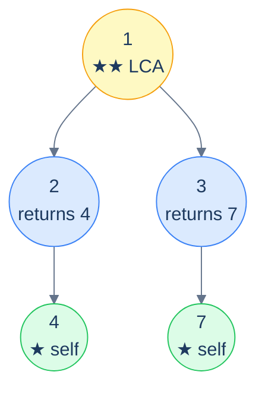

# The classical LCA recursion

```text
LCA(node, A, B):
  if node is null:           return null
  if node == A or node == B: return node          # ★ found one — propagate it up
  leftAnswer  = LCA(node.left,  A, B)
  rightAnswer = LCA(node.right, A, B)
  if leftAnswer and rightAnswer: return node      # ★★ both sides returned — this IS the LCA
  return leftAnswer or rightAnswer                # only one side hit; propagate that
```

The two starred lines do all the heavy lifting:

- **★** When the recursion *finds* one of the targets, it returns *that node*. From the parent's perspective, this is "yes, A is somewhere down here". The parent then waits for the other recursion call to come back.
- **★★** When *both* of the parent's recursion calls returned a node, that means A is on one side and B is on the other — so the *current node* is their lowest common ancestor. Bubble it up unchanged.

The "only one returned" case is what propagates the LCA up to the root after it's been found. Once a deeper node has identified itself as the LCA, every ancestor's left/right answer pair will be (LCA, null) or (null, LCA), which is exactly what makes the third line propagate it untouched.

> 🖼 Diagram — LCA recursion in action — leaf 4 returns itself; leaf 7 returns itself; nodes 2 and 3 each propagate their finding upward; root 1 sees both children returned non-null, so it identifies itself as the LCA and propagates that up.


<p align="center"><strong>LCA recursion in action — leaf 4 returns itself; leaf 7 returns itself; nodes 2 and 3 each propagate their finding upward; root 1 sees <em>both</em> children returned non-null, so it identifies itself as the LCA and propagates that up.</strong></p>

> *Predict before reading on — what does the algorithm return when one of the targets is an <em>ancestor</em> of the other?*
>
> The ancestor itself. Say the targets are `2` and `4`, and `2` is the parent of `4`. The recursion at node `2` triggers the `node == A or node == B` early-exit (returning `2`) *before* it ever recurses to find `4`. From `2`'s parent's perspective, the left side returned `2` and the right side returned null — so `2` propagates up untouched. The algorithm correctly identifies `2` as the LCA. *No special case needed* — it falls out of the structure.

## Generic pattern


```python run
from typing import Optional


class TreeNode:
    def __init__(self, val=0, left=None, right=None):
        self.val = val
        self.left = left
        self.right = right


def from_level_order(values):
    """Build tree from list like [1, 2, 3, None, 4]. None means missing child."""
    if not values:
        return None
    root = TreeNode(values[0])
    queue = [root]
    i = 1
    while queue and i < len(values):
        node = queue.pop(0)
        if i < len(values) and values[i] is not None:
            node.left = TreeNode(values[i])
            queue.append(node.left)
        i += 1
        if i < len(values) and values[i] is not None:
            node.right = TreeNode(values[i])
            queue.append(node.right)
        i += 1
    return root


def find(root, val):
    """Locate a node by value."""
    if root is None:
        return None
    if root.val == val:
        return root
    return find(root.left, val) or find(root.right, val)


class Solution:
    def lowest_common_ancestor(
        self,
        root: Optional[TreeNode],
        node_a: Optional[TreeNode],
        node_b: Optional[TreeNode],
    ) -> Optional[TreeNode]:

        # If the root is null, return null
        if root is None:
            return None

        # If the current node is equal to either nodeA or nodeB
        # return the current node
        if root == node_a or root == node_b:
            return root

        # Recursively search in the left and right subtrees
        left_lca = self.lowest_common_ancestor(root.left, node_a, node_b)
        right_lca = self.lowest_common_ancestor(
            root.right, node_a, node_b
        )

        # If both subtrees return a non-null value
        # the current node is the lowest common ancestor
        if left_lca and right_lca:
            return root

        # If only one subtree returns a non-null value, return that value
        return left_lca if left_lca else right_lca


# Examples from the problem statement
root1 = from_level_order([1, 2, 3, 4, None, None, 7])
lca1 = Solution().lowest_common_ancestor(root1, find(root1, 4), find(root1, 7))
print(lca1.val)   # 1

root2 = from_level_order([1, 8, 4, None, None, 2, 7])
lca2 = Solution().lowest_common_ancestor(root2, find(root2, 2), find(root2, 7))
print(lca2.val)   # 4

# Edge cases
print(Solution().lowest_common_ancestor(None, None, None))  # None

root3 = from_level_order([1, 2, 3, 4, None, None, 7])      # LCA is root itself
lca3 = Solution().lowest_common_ancestor(root3, find(root3, 2), find(root3, 3))
print(lca3.val)   # 1

root4 = from_level_order([1, 2, 3, 4, None, None, 7])      # one node is ancestor of the other
lca4 = Solution().lowest_common_ancestor(root4, find(root4, 2), find(root4, 4))
print(lca4.val)   # 2

root5 = from_level_order([1, 8, 4, None, None, 2, 7])      # deep internal node
lca5 = Solution().lowest_common_ancestor(root5, find(root5, 8), find(root5, 4))
print(lca5.val)   # 1

root6 = TreeNode(1)                                         # single node
print(Solution().lowest_common_ancestor(root6, root6, root6).val)  # 1
```

```java run
import java.util.*;

public class Main {
    static class TreeNode {
        int val;
        TreeNode left;
        TreeNode right;
        TreeNode() {}
        TreeNode(int val) { this.val = val; }
    }

    static TreeNode fromLevelOrder(Integer... values) {
        if (values.length == 0 || values[0] == null) return null;
        TreeNode root = new TreeNode(values[0]);
        java.util.Deque<TreeNode> queue = new java.util.ArrayDeque<>();
        queue.add(root);
        int i = 1;
        while (!queue.isEmpty() && i < values.length) {
            TreeNode node = queue.poll();
            if (i < values.length && values[i] != null) {
                node.left = new TreeNode(values[i]);
                queue.add(node.left);
            }
            i++;
            if (i < values.length && values[i] != null) {
                node.right = new TreeNode(values[i]);
                queue.add(node.right);
            }
            i++;
        }
        return root;
    }

    static TreeNode find(TreeNode root, int val) {
        if (root == null) return null;
        if (root.val == val) return root;
        TreeNode left = find(root.left, val);
        return left != null ? left : find(root.right, val);
    }

    static class Solution {
        public TreeNode lowestCommonAncestor(
            TreeNode root,
            TreeNode nodeA,
            TreeNode nodeB
        ) {

            // If the root is null, return null
            if (root == null) {
                return null;
            }

            // If the current node is equal to either nodeA or nodeB
            // return the current node
            if (root == nodeA || root == nodeB) {
                return root;
            }

            // Recursively search in the left and right subtrees
            TreeNode leftLCA = lowestCommonAncestor(root.left, nodeA, nodeB);
            TreeNode rightLCA = lowestCommonAncestor(
                root.right,
                nodeA,
                nodeB
            );

            // If both subtrees return a non-null value
            // the current node is the lowest common ancestor
            if (leftLCA != null && rightLCA != null) {
                return root;
            }

            // If only one subtree returns a non-null value, return that
            // value
            if (leftLCA != null) {
                return leftLCA;
            }

            return rightLCA;
        }
    }

    public static void main(String[] args) {
        // Examples from the problem statement
        TreeNode root1 = fromLevelOrder(1, 2, 3, 4, null, null, 7);
        System.out.println(new Solution().lowestCommonAncestor(root1, find(root1, 4), find(root1, 7)).val);  // 1

        TreeNode root2 = fromLevelOrder(1, 8, 4, null, null, 2, 7);
        System.out.println(new Solution().lowestCommonAncestor(root2, find(root2, 2), find(root2, 7)).val);  // 4

        // Edge cases
        System.out.println(new Solution().lowestCommonAncestor(null, null, null));  // null

        TreeNode root3 = fromLevelOrder(1, 2, 3, 4, null, null, 7);               // LCA is root
        System.out.println(new Solution().lowestCommonAncestor(root3, find(root3, 2), find(root3, 3)).val);  // 1

        TreeNode root4 = fromLevelOrder(1, 2, 3, 4, null, null, 7);               // one is ancestor of other
        System.out.println(new Solution().lowestCommonAncestor(root4, find(root4, 2), find(root4, 4)).val);  // 2

        TreeNode root5 = fromLevelOrder(1, 8, 4, null, null, 2, 7);               // deep internal node
        System.out.println(new Solution().lowestCommonAncestor(root5, find(root5, 8), find(root5, 4)).val);  // 1

        TreeNode root6 = new TreeNode(1);                                          // single node
        System.out.println(new Solution().lowestCommonAncestor(root6, root6, root6).val);  // 1
    }
}
```


## Complexity

> **Time:** O(N) — every node is visited at most once. **Space:** O(h) for recursion stack.

# How to recognise it

The pattern fits when:

- The question asks about the **closest shared ancestor** of two (or more) nodes.
- The answer can be derived by *combining left and right subtree results*: if both returned non-null targets, the current node is the meeting point; otherwise propagate.

Concrete cues:

- *"Lowest common ancestor of …"* — directly.
- *"Distance between two nodes"* — LCA + depths (Problem 5).
- *"Closest shared subtree containing …"* — restate as LCA.
- *"Find the deepest node that contains both X and Y"* — same.

Anti-pattern: if the tree is a *binary search tree*, there's an O(log N) BST-specialised LCA that beats this O(N) algorithm — covered in the BST chapter.

<!-- ============================================== -->
<!-- SWEEP 2 — missing sections (placeholders only) -->
<!-- ============================================== -->

<!-- TODO: Understanding the Pattern — missing, needs to be written -->
<!--       Guidance: umbrella H2 with the subsections below -->

<!-- TODO: Why Naive Isn't Enough — missing, needs to be written -->
<!--       Guidance: motivation for why the obvious approach fails -->

<!-- TODO: The Core Idea — missing, needs to be written -->
<!--       Guidance: one paragraph: the central trick -->

<!-- TODO: How the Pointers/Window Move — missing, needs to be written -->
<!--       Guidance: mechanics of the moving parts -->

<!-- TODO: The Generic Algorithm — missing, needs to be written -->
<!--       Guidance: numbered steps, no code -->

<!-- TODO: Generic Implementation — missing, needs to be written -->
<!--       Guidance: Python block + Java block of the skeleton -->

<!-- TODO: Complexity Analysis — missing, needs to be written -->
<!--       Guidance: table -->

<!-- TODO: Variants / Taxonomy — missing, needs to be written -->
<!--       Guidance: enumerate sub-shapes of this pattern -->

<!-- TODO: Identifying — missing, needs to be written -->
<!--       Guidance: per-variant: recognition checklist + canonical example -->

<!-- TODO: Recognition Checklist — missing, needs to be written -->
<!--       Guidance: 4-question diagnostic — the source of the Problem-section Diagnostic Questions -->

<!-- TODO: Canonical Example — missing, needs to be written -->
<!--       Guidance: fully worked example: brute force → optimised → template fit -->

<!-- TODO: Problems in This Category — missing, needs to be written -->
<!--       Guidance: table with links to the 02-problems/ files -->
