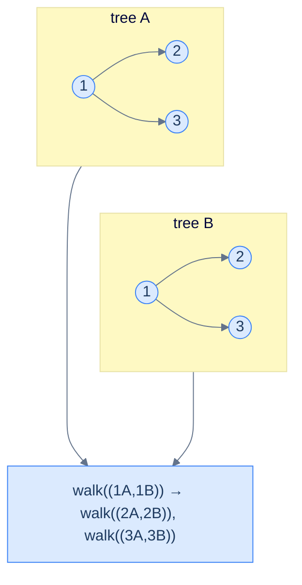
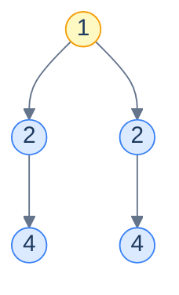

# 17. Pattern: Simultaneous Traversal

## The Hook

Every pattern in the chapter so far has worked on **one** tree at a time. But many real questions are *binary* — they take *two* trees and ask about the relationship between them. *Are these two trees identical?* *Is one a subtree of the other?* *Is this tree a mirror image of itself (its own left subtree against its own right subtree)?* *Merge these two trees node-by-node into a third one.*

The unifying insight: we can walk both trees **in lockstep**. Pass *both* current nodes into the recursion, do the per-node check on the pair, then recurse into the corresponding *pairs* of children — `(a.left, b.left)` and `(a.right, b.right)` — or, for mirror-flavoured problems, into the swapped pairs `(a.left, b.right)` and `(a.right, b.left)`. Same recursive shape as a single-tree traversal, just with one more parameter.

The base case is where the two-tree pattern earns its keep: there are now *three* possibilities at every step instead of two. (1) Both nodes are null — vacuously identical, return `true`. (2) Exactly one is null — structural mismatch, return `false`. (3) Both are non-null — compare them and recurse. Forgetting the "exactly one is null" case is the canonical bug.

This pattern handles a surprisingly wide range of problems with one template: **identical-trees**, **symmetry detection** (a tree against itself, with mirrored recursion), **subtree detection** (search for trees identical to the second one anywhere in the first), and **merge** (zip two trees node-by-node into a new one). All four in 10 languages each.

---

## Table of contents

1. [The simultaneous traversal pattern](#the-simultaneous-traversal-pattern)
2. [How to recognise it](#how-to-recognise-it)
3. [Problem 1 — Identical trees](#problem-1--identical-trees)
4. [Problem 2 — Symmetry detection](#problem-2--symmetry-detection)
5. [Problem 3 — Subtree detection](#problem-3--subtree-detection)
6. [Problem 4 — Merge trees](#problem-4--merge-trees)

***

# The simultaneous traversal pattern

```text
walk(a, b):
  if a is null and b is null:    return baseCase
  if a is null or  b is null:    return mismatch
  process(a, b)                                     # the per-node check
  walk(a.left,  b.left)                             # recurse on corresponding pairs
  walk(a.right, b.right)
  return combine(...)
```

The recursion descends *both* trees at the same time. Every step you visit one node in each tree and decide what to do based on the *pair*. There's no need for two separate traversals — the lockstep walk does it in one pass.



<p align="center"><strong>Lockstep traversal — at every step the recursion holds <em>both</em> current nodes; recursion fans out to the corresponding pairs of children. The two trees are walked in perfect synchronisation.</strong></p>

> *Predict before reading on — what's the difference between simultaneous traversal and "traverse tree A, then traverse tree B"?*
>
> The simultaneous version sees the *pair* at every step. That lets it short-circuit the moment a difference shows up — no need to traverse the rest of either tree. Two-pass approaches must materialise both traversals fully before comparing — that's also O(N) but uses O(N) extra memory and can't bail out early.

## Generic pattern in 10 languages

The "are these two trees identical?" template — the simplest member of the family.


```pseudocode
function identical(a, b):
    if a = null AND b = null: return true    # both absent → match
    if a = null OR  b = null: return false   # exactly one absent → mismatch
    if a.val ≠ b.val:         return false
    return identical(a.left, b.left) AND identical(a.right, b.right)
```

```python run
from typing import Optional

class TreeNode:
    def __init__(self, val=0, left=None, right=None):
        self.val, self.left, self.right = val, left, right

def identical(a: Optional[TreeNode], b: Optional[TreeNode]) -> bool:
    if a is None and b is None: return True
    if a is None or  b is None: return False
    if a.val != b.val:          return False
    return identical(a.left, b.left) and identical(a.right, b.right)
```

```java run
public static boolean identical(TreeNode a, TreeNode b) {
    if (a == null && b == null) return true;
    if (a == null || b == null) return false;
    if (a.val != b.val)         return false;
    return identical(a.left, b.left) && identical(a.right, b.right);
}
```

```c run
int identical(TreeNode *a, TreeNode *b) {
    if (!a && !b)         return 1;
    if (!a ||  !b)        return 0;
    if (a->val != b->val) return 0;
    return identical(a->left, b->left) && identical(a->right, b->right);
}
```

```scala run
def identical(a: TreeNode, b: TreeNode): Boolean = {
  if (a == null && b == null) return true
  if (a == null || b == null) return false
  if (a.value != b.value)     return false
  identical(a.left, b.left) && identical(a.right, b.right)
}
```


## Complexity

> **Time:** O(min(|A|, |B|)) — the recursion stops at the first difference, so it traverses no more than the smaller tree. **Space:** O(min(h_A, h_B)) for recursion.

***

# How to recognise it

The pattern fits when:

- The question takes **two trees** and asks about a per-node relationship, OR
- The question takes **one tree** but asks something that compares parts of it against itself (symmetry, mirror, etc.), where the obvious framing is "two trees".

Concrete cues:

- *"Are these two trees …?"* — directly two trees.
- *"Is X a subtree of Y?"* — one tree, plus a recursive search using the two-tree comparison as a primitive.
- *"Is this tree symmetric / mirror image of itself?"* — one tree, treated as two (its left and right children).
- *"Merge / combine / overlap two trees"* — produces a new tree from a paired walk.

Anti-pattern: if the question is about a single tree's intrinsic property (height, sum, balance), depth-first single-tree patterns are simpler.

***

# Problem 1 — Identical trees

> Return `true` iff two trees have the same shape and the same value at every position.

This is the generic algorithm — see the 10-language code block above. No specialisation needed.

***

# Problem 2 — Symmetry detection

> Return `true` iff a tree is a mirror image of itself.

The trick: a tree is symmetric iff its *left subtree* is a mirror image of its *right subtree*. That's a two-tree question. The mirror-image relation is *almost* identical to identical-trees — same value, same overall shape — except the recursion descends into **swapped** pairs of children: left-of-the-left compared with right-of-the-right, right-of-the-left compared with left-of-the-right.



<p align="center"><strong>A symmetric tree — root <code>1</code>, two children both <code>2</code>, two grandchildren both <code>4</code>. The left subtree's <em>left</em> child mirrors the right subtree's <em>right</em> child.</strong></p>

## Solution


```pseudocode
function isSymmetric(root):
    function mirror(a, b):
        if a = null AND b = null: return true
        if a = null OR  b = null: return false
        if a.val ≠ b.val:         return false
        return mirror(a.left, b.right) AND mirror(a.right, b.left)   # swapped children
    if root = null: return true
    return mirror(root.left, root.right)
```

```python run
def is_symmetric(root):
    def mirror(a, b):
        if a is None and b is None: return True
        if a is None or  b is None: return False
        if a.val != b.val:           return False
        return mirror(a.left, b.right) and mirror(a.right, b.left)
    if root is None: return True
    return mirror(root.left, root.right)
```

```java run
static boolean mirror(TreeNode a, TreeNode b) {
    if (a == null && b == null) return true;
    if (a == null || b == null) return false;
    if (a.val != b.val)         return false;
    return mirror(a.left, b.right) && mirror(a.right, b.left);
}
public static boolean isSymmetric(TreeNode root) {
    return root == null || mirror(root.left, root.right);
}
```

```c run
int mirror(TreeNode *a, TreeNode *b) {
    if (!a && !b)         return 1;
    if (!a ||  !b)        return 0;
    if (a->val != b->val) return 0;
    return mirror(a->left, b->right) && mirror(a->right, b->left);
}
int is_symmetric(TreeNode *root) { return !root || mirror(root->left, root->right); }
```

```scala run
class TreeNode(var value: Int, var left: TreeNode = null, var right: TreeNode = null)

object Main extends App {
  class Solution {
    def isSymmetric(root: TreeNode): Boolean = {
      def mirror(a: TreeNode, b: TreeNode): Boolean = {
        if (a == null && b == null) return true
        if (a == null || b == null) return false
        if (a.value != b.value)     return false
        mirror(a.left, b.right) && mirror(a.right, b.left)
      }
      root == null || mirror(root.left, root.right)
    }
  }

  val root = new TreeNode(1,
    new TreeNode(2, new TreeNode(3), new TreeNode(4)),
    new TreeNode(2, new TreeNode(4), new TreeNode(3)))
  println(new Solution().isSymmetric(root))  // true
}
```


***

# Problem 3 — Subtree detection

> Given trees A and B, return `true` iff the *whole* of B occurs somewhere inside A as an exact subtree.

Combine two patterns: an *outer* recursion walking A (looking for a place where the comparison succeeds), and an *inner* recursion that runs the identical-trees check between the current A-node and B's root.

The complexity is **O(|A| · |B|)** worst case — every node in A might be the start of an identical-check that walks the whole of B. Faster O(|A| + |B|) algorithms exist using string-hashing on serialised trees, but the naive recursive version is the right interview answer for clarity.

## Solution


```pseudocode
function isSubtree(rootA, rootB):
    if rootA = null: return rootB = null
    if identical(rootA, rootB): return true
    return isSubtree(rootA.left, rootB) OR isSubtree(rootA.right, rootB)
```

```python run
def is_subtree(root_a, root_b):
    if root_a is None: return root_b is None
    if identical(root_a, root_b): return True
    return is_subtree(root_a.left, root_b) or is_subtree(root_a.right, root_b)
```

```java run
public static boolean isSubtree(TreeNode rootA, TreeNode rootB) {
    if (rootA == null) return rootB == null;
    if (identical(rootA, rootB)) return true;
    return isSubtree(rootA.left, rootB) || isSubtree(rootA.right, rootB);
}
```

```c run
int is_subtree(TreeNode *a, TreeNode *b) {
    if (!a) return b == NULL;
    if (identical(a, b)) return 1;
    return is_subtree(a->left, b) || is_subtree(a->right, b);
}
```

```scala run
def isSubtree(rootA: TreeNode, rootB: TreeNode): Boolean = {
  if (rootA == null) return rootB == null
  if (identical(rootA, rootB)) return true
  isSubtree(rootA.left, rootB) || isSubtree(rootA.right, rootB)
}
```


***

# Problem 4 — Merge trees

> Overlay two trees. At every position where both trees have a node, sum the values. Where only one has a node, keep that node. Return the merged tree.

A *constructive* simultaneous traversal — instead of returning a verdict, return a *new node* built from the two inputs at each step.

## Solution


```pseudocode
function mergeTrees(a, b):
    if a = null: return b
    if b = null: return a
    n ← TreeNode(a.val + b.val)
    n.left  ← mergeTrees(a.left,  b.left)
    n.right ← mergeTrees(a.right, b.right)
    return n
```

```python run
def merge_trees(a, b):
    if a is None: return b
    if b is None: return a
    n = TreeNode(a.val + b.val)
    n.left  = merge_trees(a.left,  b.left)
    n.right = merge_trees(a.right, b.right)
    return n
```

```java run
public static TreeNode mergeTrees(TreeNode a, TreeNode b) {
    if (a == null) return b;
    if (b == null) return a;
    TreeNode n = new TreeNode(a.val + b.val);
    n.left  = mergeTrees(a.left,  b.left);
    n.right = mergeTrees(a.right, b.right);
    return n;
}
```

```c run
TreeNode* merge_trees(TreeNode *a, TreeNode *b) {
    if (!a) return b;
    if (!b) return a;
    TreeNode *n = malloc(sizeof(*n));
    n->val = a->val + b->val;
    n->left  = merge_trees(a->left,  b->left);
    n->right = merge_trees(a->right, b->right);
    return n;
}
```

```scala run
def mergeTrees(a: TreeNode, b: TreeNode): TreeNode = {
  if (a == null) return b
  if (b == null) return a
  val n = new TreeNode(a.value + b.value)
  n.left  = mergeTrees(a.left,  b.left)
  n.right = mergeTrees(a.right, b.right)
  n
}
```


***

## Final Takeaway

Simultaneous traversal extends every single-tree recursive shape to a two-tree shape. Three things to walk away with:

1. **Three null cases, not two.** Both null = base case. Exactly one null = mismatch. Both non-null = recurse. Handle them in *exactly* that order at the top of the function and the rest of the algorithm is mechanical.
2. **Mirror is identical with swapped children.** Swap which children you recurse into and the algorithm shifts from "are these the same?" to "are these mirror images of each other?". Same recipe; a single line difference.
3. **Compose patterns to climb up.** Subtree detection nests `identical` *inside* a single-tree DFS — two patterns stacked. Most "advanced" tree problems are composed of two or three patterns this way; once each individual pattern is muscle memory, the compositions become natural.

> *Coming up — the chapter closes with a **practice mix-traversals** lesson — a single problem (the *boundary traversal*) that requires you to combine three of the patterns you've learned (root-to-leaf for the leaf row; left-spine and right-spine walks for the two sides) into a single coherent answer. It's the chapter's capstone.*
