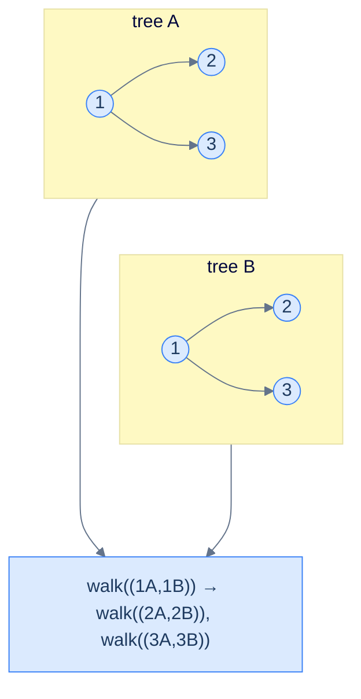
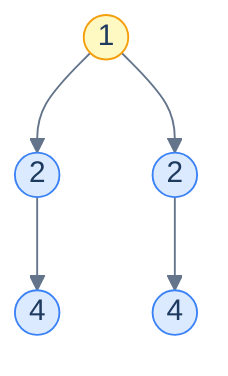

# 17. Pattern: Simultaneous Traversal

## The Hook

Every pattern in the chapter so far has worked on **one** tree at a time. But many real questions are *binary* — they take *two* trees and ask about the relationship between them. *Are these two trees identical?* *Is one a subtree of the other?* *Is this tree a mirror image of itself (its own left subtree against its own right subtree)?* *Merge these two trees node-by-node into a third one.*

The unifying insight: we can walk both trees **in lockstep**. Pass *both* current nodes into the recursion, do the per-node check on the pair, then recurse into the corresponding *pairs* of children — `(a.left, b.left)` and `(a.right, b.right)` — or, for mirror-flavoured problems, into the swapped pairs `(a.left, b.right)` and `(a.right, b.left)`. Same recursive shape as a single-tree traversal, just with one more parameter.

The base case is where the two-tree pattern earns its keep: there are now *three* possibilities at every step instead of two. (1) Both nodes are null — vacuously identical, return `true`. (2) Exactly one is null — structural mismatch, return `false`. (3) Both are non-null — compare them and recurse. Forgetting the "exactly one is null" case is the canonical bug.

This pattern handles a surprisingly wide range of problems with one template: **identical-trees**, **symmetry detection** (a tree against itself, with mirrored recursion), **subtree detection** (search for trees identical to the second one anywhere in the first), and **merge** (zip two trees node-by-node into a new one). All four in Python and Java.

---

## Table of contents

1. [The simultaneous traversal pattern](#the-simultaneous-traversal-pattern)
2. [How to recognise it](#how-to-recognise-it)
3. [Problem 1 — Identical trees](#problem-1--identical-trees)
4. [Problem 2 — Symmetry detection](#problem-2--symmetry-detection)
5. [Problem 3 — Subtree detection](#problem-3--subtree-detection)
6. [Problem 4 — Merge trees](#problem-4--merge-trees)

***

# The simultaneous traversal pattern

```text
walk(a, b):
  if a is null and b is null:    return baseCase
  if a is null or  b is null:    return mismatch
  process(a, b)                                     # the per-node check
  walk(a.left,  b.left)                             # recurse on corresponding pairs
  walk(a.right, b.right)
  return combine(...)
```

The recursion descends *both* trees at the same time. Every step you visit one node in each tree and decide what to do based on the *pair*. There's no need for two separate traversals — the lockstep walk does it in one pass.



<p align="center"><strong>Lockstep traversal — at every step the recursion holds <em>both</em> current nodes; recursion fans out to the corresponding pairs of children. The two trees are walked in perfect synchronisation.</strong></p>

> *Predict before reading on — what's the difference between simultaneous traversal and "traverse tree A, then traverse tree B"?*
>
> The simultaneous version sees the *pair* at every step. That lets it short-circuit the moment a difference shows up — no need to traverse the rest of either tree. Two-pass approaches must materialise both traversals fully before comparing — that's also O(N) but uses O(N) extra memory and can't bail out early.

## Generic pattern

The "are these two trees identical?" template — the simplest member of the family.


```python run
from typing import Optional

class TreeNode:
    def __init__(self, val=0, left=None, right=None):
        self.val, self.left, self.right = val, left, right

def identical(a: Optional[TreeNode], b: Optional[TreeNode]) -> bool:
    if a is None and b is None: return True
    if a is None or  b is None: return False
    if a.val != b.val:          return False
    return identical(a.left, b.left) and identical(a.right, b.right)
```

```java run
public static boolean identical(TreeNode a, TreeNode b) {
    if (a == null && b == null) return true;
    if (a == null || b == null) return false;
    if (a.val != b.val)         return false;
    return identical(a.left, b.left) && identical(a.right, b.right);
}
```


## Complexity

> **Time:** O(min(|A|, |B|)) — the recursion stops at the first difference, so it traverses no more than the smaller tree. **Space:** O(min(h_A, h_B)) for recursion.

***

# How to recognise it

The pattern fits when:

- The question takes **two trees** and asks about a per-node relationship, OR
- The question takes **one tree** but asks something that compares parts of it against itself (symmetry, mirror, etc.), where the obvious framing is "two trees".

Concrete cues:

- *"Are these two trees …?"* — directly two trees.
- *"Is X a subtree of Y?"* — one tree, plus a recursive search using the two-tree comparison as a primitive.
- *"Is this tree symmetric / mirror image of itself?"* — one tree, treated as two (its left and right children).
- *"Merge / combine / overlap two trees"* — produces a new tree from a paired walk.

Anti-pattern: if the question is about a single tree's intrinsic property (height, sum, balance), depth-first single-tree patterns are simpler.

***

# Problem 1 — Identical trees

> Return `true` iff two trees have the same shape and the same value at every position.

This is the generic algorithm — see the code block above. No specialisation needed.

***

# Problem 2 — Symmetry detection

> Return `true` iff a tree is a mirror image of itself.

The trick: a tree is symmetric iff its *left subtree* is a mirror image of its *right subtree*. That's a two-tree question. The mirror-image relation is *almost* identical to identical-trees — same value, same overall shape — except the recursion descends into **swapped** pairs of children: left-of-the-left compared with right-of-the-right, right-of-the-left compared with left-of-the-right.



<p align="center"><strong>A symmetric tree — root <code>1</code>, two children both <code>2</code>, two grandchildren both <code>4</code>. The left subtree's <em>left</em> child mirrors the right subtree's <em>right</em> child.</strong></p>

<details>
<summary><h2>Solution</h2></summary>


```python run
from typing import Optional


class TreeNode:
    def __init__(self, val=0, left=None, right=None):
        self.val = val
        self.left = left
        self.right = right


def from_level_order(values):
    """Build tree from list like [1, 2, 3, None, 4]. None means missing child."""
    if not values:
        return None
    root = TreeNode(values[0])
    queue = [root]
    i = 1
    while queue and i < len(values):
        node = queue.pop(0)
        if i < len(values) and values[i] is not None:
            node.left = TreeNode(values[i])
            queue.append(node.left)
        i += 1
        if i < len(values) and values[i] is not None:
            node.right = TreeNode(values[i])
            queue.append(node.right)
        i += 1
    return root


class Solution:
    def is_mirror(
        self, left: Optional[TreeNode], right: Optional[TreeNode]
    ) -> bool:

        # If both trees are empty, they are considered mirror images
        if not left and not right:
            return True

        # If only one tree is empty, they are not mirror images
        if not left or not right:
            return False

        # If the values of the current nodes are different, they are not
        # mirror images
        if left.val != right.val:
            return False

        # Recursively check if the left subtree of the left tree is the
        # mirror image of the right subtree of the right tree and vice
        # versa
        left_and_right_subtree_are_mirrors = self.is_mirror(
            left.left, right.right
        )
        right_and_left_subtree_are_mirrors = self.is_mirror(
            left.right, right.left
        )

        # Return true if both subtrees are mirror images
        return (
            left_and_right_subtree_are_mirrors
            and right_and_left_subtree_are_mirrors
        )

    def symmetry_detection(self, root: Optional[TreeNode]) -> bool:

        # If the tree is empty, it is considered symmetric
        if root is None:
            return True

        # Check if the left and right subtrees are mirror images
        return self.is_mirror(root.left, root.right)


# Examples from the problem statement
print(Solution().symmetry_detection(from_level_order([1, 2, 2, 4, None, None, 4])))  # True
print(Solution().symmetry_detection(from_level_order([1, 8, 4, None, None, 2, 7])))  # False

# Edge cases
print(Solution().symmetry_detection(None))                                            # True
print(Solution().symmetry_detection(TreeNode(1)))                                    # True (single node)
print(Solution().symmetry_detection(from_level_order([1, 2, 2])))                   # True (balanced same children)
print(Solution().symmetry_detection(from_level_order([1, 2, None])))                # False (only left child)
print(Solution().symmetry_detection(from_level_order([1, 2, 2, 3, 4, 4, 3])))      # True (full symmetric)
print(Solution().symmetry_detection(from_level_order([1, 2, 2, None, 3, None, 3])))  # False (structure differs)
```

```java run
import java.util.*;

public class Main {
    static class TreeNode {
        int val;
        TreeNode left;
        TreeNode right;
        TreeNode() {}
        TreeNode(int val) { this.val = val; }
    }

    static TreeNode fromLevelOrder(Integer... values) {
        if (values.length == 0 || values[0] == null) return null;
        TreeNode root = new TreeNode(values[0]);
        java.util.Deque<TreeNode> queue = new java.util.ArrayDeque<>();
        queue.add(root);
        int i = 1;
        while (!queue.isEmpty() && i < values.length) {
            TreeNode node = queue.poll();
            if (i < values.length && values[i] != null) {
                node.left = new TreeNode(values[i]);
                queue.add(node.left);
            }
            i++;
            if (i < values.length && values[i] != null) {
                node.right = new TreeNode(values[i]);
                queue.add(node.right);
            }
            i++;
        }
        return root;
    }

    static class Solution {
        private boolean isMirror(TreeNode left, TreeNode right) {

            // If both trees are empty, they are considered mirror images
            if (left == null && right == null) {
                return true;
            }

            // If only one tree is empty, they are not mirror images
            if (left == null || right == null) {
                return false;
            }

            // If the values of the current nodes are different, they are not
            // mirror images
            if (left.val != right.val) {
                return false;
            }

            // Recursively check if the left subtree of the left tree is the
            // mirror image of the right subtree of the right tree and vice
            // versa
            boolean leftAndRightSubtreeAreMirrors = isMirror(
                left.left,
                right.right
            );
            boolean rightAndLeftSubtreeAreMirrors = isMirror(
                left.right,
                right.left
            );

            // Return true if both subtrees are mirror images
            return (
                leftAndRightSubtreeAreMirrors &&
                rightAndLeftSubtreeAreMirrors
            );
        }

        public boolean symmetryDetection(TreeNode root) {

            // If the tree is empty, it is considered symmetric
            if (root == null) {
                return true;
            }

            // Check if the left and right subtrees are mirror images
            return isMirror(root.left, root.right);
        }
    }

    public static void main(String[] args) {
        // Examples from the problem statement
        System.out.println(new Solution().symmetryDetection(fromLevelOrder(1, 2, 2, 4, null, null, 4)));  // true
        System.out.println(new Solution().symmetryDetection(fromLevelOrder(1, 8, 4, null, null, 2, 7)));  // false

        // Edge cases
        System.out.println(new Solution().symmetryDetection(null));                                        // true
        System.out.println(new Solution().symmetryDetection(new TreeNode(1)));                            // true
        System.out.println(new Solution().symmetryDetection(fromLevelOrder(1, 2, 2)));                   // true
        System.out.println(new Solution().symmetryDetection(fromLevelOrder(1, 2, null)));                // false
        System.out.println(new Solution().symmetryDetection(fromLevelOrder(1, 2, 2, 3, 4, 4, 3)));      // true
        System.out.println(new Solution().symmetryDetection(fromLevelOrder(1, 2, 2, null, 3, null, 3)));  // false
    }
}
```

</details>


***

# Problem 3 — Subtree detection

> Given trees A and B, return `true` iff the *whole* of B occurs somewhere inside A as an exact subtree.

Combine two patterns: an *outer* recursion walking A (looking for a place where the comparison succeeds), and an *inner* recursion that runs the identical-trees check between the current A-node and B's root.

The complexity is **O(|A| · |B|)** worst case — every node in A might be the start of an identical-check that walks the whole of B. Faster O(|A| + |B|) algorithms exist using string-hashing on serialised trees, but the naive recursive version is the right interview answer for clarity.

<details>
<summary><h2>Solution</h2></summary>


```python run
from typing import Optional, List


class TreeNode:
    def __init__(self, val=0, left=None, right=None):
        self.val = val
        self.left = left
        self.right = right


def from_level_order(values):
    """Build tree from list like [1, 2, 3, None, 4]. None means missing child."""
    if not values:
        return None
    root = TreeNode(values[0])
    queue = [root]
    i = 1
    while queue and i < len(values):
        node = queue.pop(0)
        if i < len(values) and values[i] is not None:
            node.left = TreeNode(values[i])
            queue.append(node.left)
        i += 1
        if i < len(values) and values[i] is not None:
            node.right = TreeNode(values[i])
            queue.append(node.right)
        i += 1
    return root


class Solution:
    def identical_trees(
        self, root_a: Optional[TreeNode], root_b: Optional[TreeNode]
    ) -> bool:

        # If both trees are empty, they are identical
        if not root_a and not root_b:
            return True

        # If only one tree is empty, they are not identical
        if not root_a or not root_b:
            return False

        # If the values of the current nodes are different, they are not
        # identical
        if root_a.val != root_b.val:
            return False

        # Recursively check if the left and right subtrees are identical
        left_subtrees_are_identical = self.identical_trees(
            root_a.left, root_b.left
        )
        right_subtrees_are_identical = self.identical_trees(
            root_a.right, root_b.right
        )

        # Return True if both subtrees are identical
        return (
            left_subtrees_are_identical and right_subtrees_are_identical
        )

    def subtree_detection(
        self, root_a: Optional[TreeNode], root_b: Optional[TreeNode]
    ) -> bool:

        # If the main tree is empty, root_b cannot be a subtree
        if not root_a:
            return False

        # If the trees are identical, root_b is a subtree
        if self.identical_trees(root_a, root_b):
            return True

        # Recursively check if root_b is a subtree of the left or right
        # subtree
        is_a_subtree_of_left_subtree = self.subtree_detection(
            root_a.left, root_b
        )
        is_a_subtree_of_right_subtree = self.subtree_detection(
            root_a.right, root_b
        )

        # Return true if root_b is a subtree of the left or right subtree
        return (
            is_a_subtree_of_left_subtree or is_a_subtree_of_right_subtree
        )


# Examples from the problem statement
print(Solution().subtree_detection(
    from_level_order([1, 8, 5, 4, 2, 3, 9]),
    from_level_order([5, 3, 9])
))   # True

print(Solution().subtree_detection(
    from_level_order([1, 8, 4, None, None, 2, 7]),
    from_level_order([1, 8, 4])
))   # False

# Edge cases
print(Solution().subtree_detection(None, None))                              # False (empty main)
print(Solution().subtree_detection(TreeNode(1), None))                       # True (empty subB matches nothing... actually identical_trees(1,None)=False, recurse left/right=False... returns False) — wait: identical_trees(TreeNode(1), None) = False since root_b is falsy and root_a is not. Then recurse left(None,None)→ identical_trees(None,None)=True → subtree_detection returns True)
print(Solution().subtree_detection(TreeNode(1), TreeNode(1)))                # True (identical single nodes)
print(Solution().subtree_detection(
    from_level_order([1, 2, 3, 4, 5]),
    from_level_order([2, 4, 5])
))   # True (left subtree match)
print(Solution().subtree_detection(
    from_level_order([1, 2, 3]),
    from_level_order([4])
))   # False (value not found)
```

```java run
import java.util.*;

public class Main {
    static class TreeNode {
        int val;
        TreeNode left;
        TreeNode right;
        TreeNode() {}
        TreeNode(int val) { this.val = val; }
    }

    static TreeNode fromLevelOrder(Integer... values) {
        if (values.length == 0 || values[0] == null) return null;
        TreeNode root = new TreeNode(values[0]);
        java.util.Deque<TreeNode> queue = new java.util.ArrayDeque<>();
        queue.add(root);
        int i = 1;
        while (!queue.isEmpty() && i < values.length) {
            TreeNode node = queue.poll();
            if (i < values.length && values[i] != null) {
                node.left = new TreeNode(values[i]);
                queue.add(node.left);
            }
            i++;
            if (i < values.length && values[i] != null) {
                node.right = new TreeNode(values[i]);
                queue.add(node.right);
            }
            i++;
        }
        return root;
    }

    static class Solution {
        private boolean identicalTrees(TreeNode rootA, TreeNode rootB) {

            // If both trees are empty, they are identical
            if (rootA == null && rootB == null) {
                return true;
            }

            // If only one tree is empty, they are not identical
            if (rootA == null || rootB == null) {
                return false;
            }

            // If the values of the current nodes are different, they are not
            // identical
            if (rootA.val != rootB.val) {
                return false;
            }

            // Recursively check the left and right subtrees are identical
            boolean leftSubtreesAreIdentical = identicalTrees(
                rootA.left,
                rootB.left
            );
            boolean rightSubtreesAreIdentical = identicalTrees(
                rootA.right,
                rootB.right
            );

            // Return true if both subtrees are identical
            return leftSubtreesAreIdentical && rightSubtreesAreIdentical;
        }

        public boolean subtreeDetection(TreeNode rootA, TreeNode rootB) {

            // If the main tree is empty, rootB cannot be a subtree
            if (rootA == null) {
                return false;
            }

            // If the trees are identical, rootB is a subtree
            if (identicalTrees(rootA, rootB)) {
                return true;
            }

            // Recursively check if rootB is a subtree of the left or right
            // subtree
            boolean isASubtreeOfLeftSubtree = subtreeDetection(
                rootA.left,
                rootB
            );
            boolean isASubtreeOfRightSubtree = subtreeDetection(
                rootA.right,
                rootB
            );

            // Return true if rootB is a subtree of the left or right subtree
            return isASubtreeOfLeftSubtree || isASubtreeOfRightSubtree;
        }
    }

    public static void main(String[] args) {
        // Examples from the problem statement
        System.out.println(new Solution().subtreeDetection(
            fromLevelOrder(1, 8, 5, 4, 2, 3, 9),
            fromLevelOrder(5, 3, 9)
        ));   // true

        System.out.println(new Solution().subtreeDetection(
            fromLevelOrder(1, 8, 4, null, null, 2, 7),
            fromLevelOrder(1, 8, 4)
        ));   // false

        // Edge cases
        System.out.println(new Solution().subtreeDetection(null, null));                              // false
        System.out.println(new Solution().subtreeDetection(new TreeNode(1), new TreeNode(1)));        // true
        System.out.println(new Solution().subtreeDetection(
            fromLevelOrder(1, 2, 3, 4, 5),
            fromLevelOrder(2, 4, 5)
        ));   // true (left subtree match)
        System.out.println(new Solution().subtreeDetection(
            fromLevelOrder(1, 2, 3),
            fromLevelOrder(4)
        ));   // false (value not found)
        System.out.println(new Solution().subtreeDetection(
            fromLevelOrder(1, 2, 3),
            fromLevelOrder(1, 2, 3)
        ));   // true (identical trees)
    }
}
```

</details>


***

# Problem 4 — Merge trees

> Overlay two trees. At every position where both trees have a node, sum the values. Where only one has a node, keep that node. Return the merged tree.

A *constructive* simultaneous traversal — instead of returning a verdict, return a *new node* built from the two inputs at each step.

<details>
<summary><h2>Solution</h2></summary>


```python run
from typing import Optional


class TreeNode:
    def __init__(self, val=0, left=None, right=None):
        self.val = val
        self.left = left
        self.right = right


def from_level_order(values):
    """Build tree from list like [1, 2, 3, None, 4]. None means missing child."""
    if not values:
        return None
    root = TreeNode(values[0])
    queue = [root]
    i = 1
    while queue and i < len(values):
        node = queue.pop(0)
        if i < len(values) and values[i] is not None:
            node.left = TreeNode(values[i])
            queue.append(node.left)
        i += 1
        if i < len(values) and values[i] is not None:
            node.right = TreeNode(values[i])
            queue.append(node.right)
        i += 1
    return root


def to_level_order(root):
    """Serialize tree back to level-order list for easy comparison."""
    if not root:
        return []
    result, queue = [], [root]
    while queue:
        node = queue.pop(0)
        if node:
            result.append(node.val)
            queue.append(node.left)
            queue.append(node.right)
        else:
            result.append(None)
    while result and result[-1] is None:
        result.pop()
    return result


class Solution:
    def merge_trees(
        self, rootA: Optional[TreeNode], rootB: Optional[TreeNode]
    ) -> Optional[TreeNode]:

        # If either of the trees is None, return the other tree
        if rootA is None:
            return rootB

        if rootB is None:
            return rootA

        # Create a new node with the sum of values from rootA and rootB
        merged_node = TreeNode(rootA.val + rootB.val)

        # Recursively merge the left subtrees of rootA and rootB
        merged_node.left = self.merge_trees(rootA.left, rootB.left)

        # Recursively merge the right subtrees of rootA and rootB
        merged_node.right = self.merge_trees(rootA.right, rootB.right)

        # Return the merged tree
        return merged_node


# Examples from the problem statement
r1 = Solution().merge_trees(
    from_level_order([1, 2, 3, 4, None, 5, 6]),
    from_level_order([7, 8, 9, 10, 11, None, 12])
)
print(to_level_order(r1))   # [8, 10, 12, 14, 11, 5, 18]

r2 = Solution().merge_trees(
    from_level_order([1, 8, 4, None, None, 2, 7]),
    from_level_order([1, 2, 3, 4, None, None, 7])
)
print(to_level_order(r2))   # [2, 10, 7, 4, None, 2, 14]

# Edge cases
print(to_level_order(Solution().merge_trees(None, None)))              # []
print(to_level_order(Solution().merge_trees(TreeNode(5), None)))       # [5]
print(to_level_order(Solution().merge_trees(None, TreeNode(3))))       # [3]
print(to_level_order(Solution().merge_trees(TreeNode(1), TreeNode(2))))  # [3]
print(to_level_order(Solution().merge_trees(
    from_level_order([1, 3, 2, 5]),
    from_level_order([2, 1, 3, None, 4, None, 7])
)))   # [3, 4, 5, 5, 4, None, 7]
```

```java run
import java.util.*;

public class Main {
    static class TreeNode {
        int val;
        TreeNode left;
        TreeNode right;
        TreeNode() {}
        TreeNode(int val) { this.val = val; }
    }

    static TreeNode fromLevelOrder(Integer... values) {
        if (values.length == 0 || values[0] == null) return null;
        TreeNode root = new TreeNode(values[0]);
        java.util.Deque<TreeNode> queue = new java.util.ArrayDeque<>();
        queue.add(root);
        int i = 1;
        while (!queue.isEmpty() && i < values.length) {
            TreeNode node = queue.poll();
            if (i < values.length && values[i] != null) {
                node.left = new TreeNode(values[i]);
                queue.add(node.left);
            }
            i++;
            if (i < values.length && values[i] != null) {
                node.right = new TreeNode(values[i]);
                queue.add(node.right);
            }
            i++;
        }
        return root;
    }

    static List<Integer> toLevelOrder(TreeNode root) {
        List<Integer> result = new ArrayList<>();
        if (root == null) return result;
        Queue<TreeNode> q = new LinkedList<>();
        q.add(root);
        while (!q.isEmpty()) {
            TreeNode n = q.poll();
            if (n != null) {
                result.add(n.val);
                q.add(n.left);
                q.add(n.right);
            } else {
                result.add(null);
            }
        }
        while (!result.isEmpty() && result.get(result.size() - 1) == null)
            result.remove(result.size() - 1);
        return result;
    }

    static class Solution {
        public TreeNode mergeTrees(TreeNode rootA, TreeNode rootB) {

            // If either of the trees is null, return the other tree
            if (rootA == null) {
                return rootB;
            }

            if (rootB == null) {
                return rootA;
            }

            // Create a new node with the sum of values from rootA and rootB
            TreeNode mergedNode = new TreeNode(rootA.val + rootB.val);

            // Recursively merge the left subtrees of rootA and rootB
            mergedNode.left = mergeTrees(rootA.left, rootB.left);

            // Recursively merge the right subtrees of rootA and rootB
            mergedNode.right = mergeTrees(rootA.right, rootB.right);

            // Return the merged tree
            return mergedNode;
        }
    }

    public static void main(String[] args) {
        // Examples from the problem statement
        System.out.println(toLevelOrder(new Solution().mergeTrees(
            fromLevelOrder(1, 2, 3, 4, null, 5, 6),
            fromLevelOrder(7, 8, 9, 10, 11, null, 12)
        )));   // [8, 10, 12, 14, 11, 5, 18]

        System.out.println(toLevelOrder(new Solution().mergeTrees(
            fromLevelOrder(1, 8, 4, null, null, 2, 7),
            fromLevelOrder(1, 2, 3, 4, null, null, 7)
        )));   // [2, 10, 7, 4, null, 2, 14]

        // Edge cases
        System.out.println(toLevelOrder(new Solution().mergeTrees(null, null)));              // []
        System.out.println(toLevelOrder(new Solution().mergeTrees(new TreeNode(5), null)));   // [5]
        System.out.println(toLevelOrder(new Solution().mergeTrees(null, new TreeNode(3))));   // [3]
        System.out.println(toLevelOrder(new Solution().mergeTrees(new TreeNode(1), new TreeNode(2))));  // [3]
        System.out.println(toLevelOrder(new Solution().mergeTrees(
            fromLevelOrder(1, 3, 2, 5),
            fromLevelOrder(2, 1, 3, null, 4, null, 7)
        )));   // [3, 4, 5, 5, 4, null, 7]
    }
}
```

</details>
<details>
<summary><h2>Final Takeaway</h2></summary>


Simultaneous traversal extends every single-tree recursive shape to a two-tree shape. Three things to walk away with:

1. **Three null cases, not two.** Both null = base case. Exactly one null = mismatch. Both non-null = recurse. Handle them in *exactly* that order at the top of the function and the rest of the algorithm is mechanical.
2. **Mirror is identical with swapped children.** Swap which children you recurse into and the algorithm shifts from "are these the same?" to "are these mirror images of each other?". Same recipe; a single line difference.
3. **Compose patterns to climb up.** Subtree detection nests `identical` *inside* a single-tree DFS — two patterns stacked. Most "advanced" tree problems are composed of two or three patterns this way; once each individual pattern is muscle memory, the compositions become natural.

> *Coming up — the chapter closes with a **practice mix-traversals** lesson — a single problem (the *boundary traversal*) that requires you to combine three of the patterns you've learned (root-to-leaf for the leaf row; left-spine and right-spine walks for the two sides) into a single coherent answer. It's the chapter's capstone.*

</details>