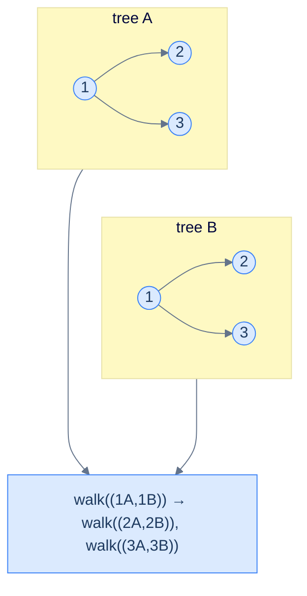

# The simultaneous traversal pattern

```text
walk(a, b):
  if a is null and b is null:    return baseCase
  if a is null or  b is null:    return mismatch
  process(a, b)                                     # the per-node check
  walk(a.left,  b.left)                             # recurse on corresponding pairs
  walk(a.right, b.right)
  return combine(...)
```

The recursion descends *both* trees at the same time. Every step you visit one node in each tree and decide what to do based on the *pair*. There's no need for two separate traversals — the lockstep walk does it in one pass.

> 🖼 Diagram — Lockstep traversal — at every step the recursion holds both current nodes; recursion fans out to the corresponding pairs of children. The two trees are walked in perfect synchronisation.


<p align="center"><strong>Lockstep traversal — at every step the recursion holds <em>both</em> current nodes; recursion fans out to the corresponding pairs of children. The two trees are walked in perfect synchronisation.</strong></p>

> *Predict before reading on — what's the difference between simultaneous traversal and "traverse tree A, then traverse tree B"?*
>
> The simultaneous version sees the *pair* at every step. That lets it short-circuit the moment a difference shows up — no need to traverse the rest of either tree. Two-pass approaches must materialise both traversals fully before comparing — that's also O(N) but uses O(N) extra memory and can't bail out early.

## Generic pattern

The "are these two trees identical?" template — the simplest member of the family.


```python run
from typing import Optional

class TreeNode:
    def __init__(self, val=0, left=None, right=None):
        self.val, self.left, self.right = val, left, right

def identical(a: Optional[TreeNode], b: Optional[TreeNode]) -> bool:
    if a is None and b is None: return True
    if a is None or  b is None: return False
    if a.val != b.val:          return False
    return identical(a.left, b.left) and identical(a.right, b.right)
```

```java run
public static boolean identical(TreeNode a, TreeNode b) {
    if (a == null && b == null) return true;
    if (a == null || b == null) return false;
    if (a.val != b.val)         return false;
    return identical(a.left, b.left) && identical(a.right, b.right);
}
```


## Complexity

> **Time:** O(min(|A|, |B|)) — the recursion stops at the first difference, so it traverses no more than the smaller tree. **Space:** O(min(h_A, h_B)) for recursion.

# How to recognise it

The pattern fits when:

- The question takes **two trees** and asks about a per-node relationship, OR
- The question takes **one tree** but asks something that compares parts of it against itself (symmetry, mirror, etc.), where the obvious framing is "two trees".

Concrete cues:

- *"Are these two trees …?"* — directly two trees.
- *"Is X a subtree of Y?"* — one tree, plus a recursive search using the two-tree comparison as a primitive.
- *"Is this tree symmetric / mirror image of itself?"* — one tree, treated as two (its left and right children).
- *"Merge / combine / overlap two trees"* — produces a new tree from a paired walk.

Anti-pattern: if the question is about a single tree's intrinsic property (height, sum, balance), depth-first single-tree patterns are simpler.

<!-- ============================================== -->
<!-- SWEEP 2 — missing sections (placeholders only) -->
<!-- ============================================== -->

<!-- TODO: Understanding the Pattern — missing, needs to be written -->
<!--       Guidance: umbrella H2 with the subsections below -->

<!-- TODO: Why Naive Isn't Enough — missing, needs to be written -->
<!--       Guidance: motivation for why the obvious approach fails -->

<!-- TODO: The Core Idea — missing, needs to be written -->
<!--       Guidance: one paragraph: the central trick -->

<!-- TODO: How the Pointers/Window Move — missing, needs to be written -->
<!--       Guidance: mechanics of the moving parts -->

<!-- TODO: The Generic Algorithm — missing, needs to be written -->
<!--       Guidance: numbered steps, no code -->

<!-- TODO: Generic Implementation — missing, needs to be written -->
<!--       Guidance: Python block + Java block of the skeleton -->

<!-- TODO: Complexity Analysis — missing, needs to be written -->
<!--       Guidance: table -->

<!-- TODO: Variants / Taxonomy — missing, needs to be written -->
<!--       Guidance: enumerate sub-shapes of this pattern -->

<!-- TODO: Identifying — missing, needs to be written -->
<!--       Guidance: per-variant: recognition checklist + canonical example -->

<!-- TODO: Recognition Checklist — missing, needs to be written -->
<!--       Guidance: 4-question diagnostic — the source of the Problem-section Diagnostic Questions -->

<!-- TODO: Canonical Example — missing, needs to be written -->
<!--       Guidance: fully worked example: brute force → optimised → template fit -->

<!-- TODO: Problems in This Category — missing, needs to be written -->
<!--       Guidance: table with links to the 02-problems/ files -->
