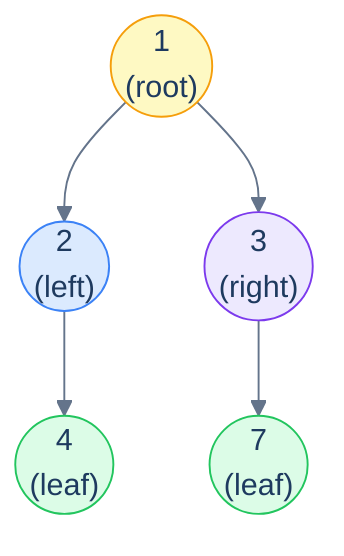
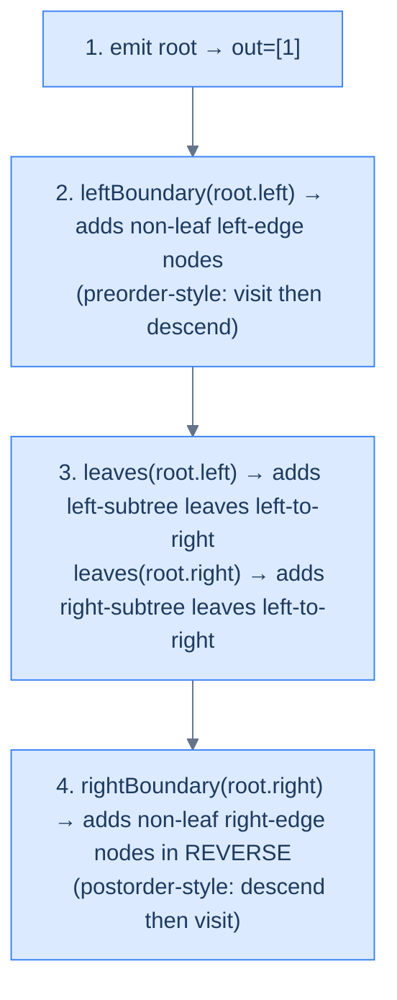

# 18. Practice: Mix Traversals

## The Hook

Eleven patterns into the chapter, you've learned every recursion shape that binary trees need: preorder (stateless and stateful), postorder (stateless and stateful), root-to-leaf (stateless and stateful), level-order (one-dimensional and column-based), LCA, and simultaneous traversal. Each pattern by itself answers a class of problems with one cohesive recipe.

But interview questions and production code rarely fit a single pattern *cleanly*. The interesting problems are usually *compositions* — they take a piece of one pattern, glue it to a piece of another, and ask you to produce a single coherent answer that no individual pattern could give in one pass. The skill at this level isn't memorising more patterns — it's *recognising* which patterns combine, in what order, to solve a question you've never seen before.

This capstone lesson works through one such problem — the **boundary traversal** of a binary tree — to demonstrate the composition mindset. The boundary traversal asks you to walk *anticlockwise around the outside of the tree*, returning the root, then everything on the left edge top-to-bottom, then every leaf left-to-right, then everything on the right edge bottom-to-top. There's no single pattern that does this — but the problem decomposes cleanly into *three* sub-walks, each a tiny variation of patterns you already know. Stitch the three together and you have a single linear-time, single-pass-equivalent algorithm.

This kind of decomposition is what separates "I know binary trees" from "I can solve any binary-tree question I've never seen before". Practice it on this problem and the skill transfers to dozens of other multi-pattern compositions.

---

## Table of contents

1. [Boundary traversal — the problem](#boundary-traversal--the-problem)
2. [Decomposing into three pieces](#decomposing-into-three-pieces)
3. [Solution](#solution)

***

# Boundary traversal — the problem

> Given the root of a binary tree, return the *boundary* of the tree — the values you'd encounter walking anticlockwise around the outside of the tree, starting from the root.
>
> The boundary consists of:
>
> 1. The **root**.
> 2. The **left boundary** — every node on the leftmost path from the root downward, *excluding* leaves (we'll catch them in step 3). The leftmost path is "go left if left child exists, else right" — so it threads down even when the strict left-child runs out.
> 3. All **leaves**, left-to-right.
> 4. The **right boundary** in *reverse* — every node on the rightmost path from the root downward (excluding leaves), then bottom-to-top.



<p align="center"><strong>Example tree — boundary (anticlockwise from root): <strong><code>1 → 2 → 4 → 7 → 3</code></strong>. Yellow root, blue left edge, green leaves left-to-right, purple right edge in reverse.</strong></p>

The challenge is that *the same node should not appear twice*. The root is *not* on the left or right boundary. A leaf that happens to be on the left boundary should be reported in the leaves step, not the left-boundary step. So the four pieces have to be carved out carefully to avoid double-counting.

> *Predict before reading on — for a single-node tree (just the root), what should the boundary be?*
>
> Just the root, `[1]`. The left and right boundaries are empty (no left or right edge to walk); the leaves step would visit the root, but we've already added it. *Edge cases like this are exactly where compositions break*; check that your solution handles single-node, all-left-skew, all-right-skew, and an empty tree correctly.

***

# Decomposing into three pieces

Each piece is a tiny variation of a pattern you've already seen.

## Piece 1 — Left boundary (preorder-style descent, skip leaves)

A modified preorder: visit the node *before* descending, descend left if possible else right, stop when we hit a leaf.

This is essentially the **stateless preorder** pattern (lesson 8) with two tweaks: we don't visit leaves (they'll be picked up by piece 3), and the descent isn't into both children — it's "left if exists, else right".

```text
leftBoundary(node, out):
  if node is null or node is a leaf: return
  out.push(node.val)
  if node.left:  leftBoundary(node.left,  out)
  else:          leftBoundary(node.right, out)
```

## Piece 2 — Leaves (stateless preorder, leaves only)

A standard depth-first walk that emits only at leaves — the **stateless postorder** pattern (lesson 10) specialised to "do work only at leaves".

```text
leaves(node, out):
  if node is null: return
  if node is a leaf: out.push(node.val); return
  leaves(node.left,  out)
  leaves(node.right, out)
```

## Piece 3 — Right boundary in reverse (postorder-style descent)

A modified *post*order: descend right if possible else left, *then* visit on the way back up. By visiting after descending, we naturally produce the right edge in reverse order without needing a separate reversal pass.

```text
rightBoundary(node, out):
  if node is null or node is a leaf: return
  if node.right: rightBoundary(node.right, out)
  else:          rightBoundary(node.left,  out)
  out.push(node.val)             # post-order visit gives reverse order for free
```

## Piece 4 — Stitching it together

```text
boundary(root):
  if root is null: return []
  out = [root.val]
  leftBoundary(root.left, out)         # left edge, top-to-bottom, no leaves
  leaves(root.left,  out)              # leaves of the left subtree
  leaves(root.right, out)              # leaves of the right subtree
  rightBoundary(root.right, out)       # right edge, bottom-to-top
  return out
```

The careful choice of *what to start each piece on* is what avoids double-counting. The root is added explicitly. The left/right boundaries start at `root.left` / `root.right` (so they don't re-add the root). The leaves walk both subtrees in order (so they don't double-count and they appear in left-to-right order).



<p align="center"><strong>Four ordered pieces — each is a familiar pattern, specialised to one slice of the perimeter. Together they walk the boundary anticlockwise without revisiting any node.</strong></p>

***

# Solution

A single pass requires three helpers and one driver. Implementations follow.


```python run
from typing import Optional, List


class TreeNode:
    def __init__(self, val=0, left=None, right=None):
        self.val = val
        self.left = left
        self.right = right


def from_level_order(values):
    """Build tree from list like [1, 2, 3, None, 4]. None means missing child."""
    if not values:
        return None
    root = TreeNode(values[0])
    queue = [root]
    i = 1
    while queue and i < len(values):
        node = queue.pop(0)
        if i < len(values) and values[i] is not None:
            node.left = TreeNode(values[i])
            queue.append(node.left)
        i += 1
        if i < len(values) and values[i] is not None:
            node.right = TreeNode(values[i])
            queue.append(node.right)
        i += 1
    return root


class Solution:
    def left_boundary(
        self, node: Optional[TreeNode], left_bd: List[int]
    ) -> None:
        """
        Helper function to get the left boundary
        """

        # If the current node is None or is a leaf node, return
        if not node or (not node.left and not node.right):
            return

        # Add the current node's value to the left boundary list
        left_bd.append(node.val)

        # Traverse the left subtree if it exists, otherwise traverse the
        # right subtree
        if node.left:
            self.left_boundary(node.left, left_bd)
        else:
            self.left_boundary(node.right, left_bd)

    def right_boundary(
        self, node: Optional[TreeNode], right_bd: List[int]
    ) -> None:
        """
        Helper function to get the right boundary
        """

        # If the current node is None or is a leaf node, return
        if not node or (not node.left and not node.right):
            return

        # Traverse the right subtree if it exists, otherwise traverse the
        # left subtree
        if node.right:
            self.right_boundary(node.right, right_bd)
        else:
            self.right_boundary(node.left, right_bd)

        # Add the current node's value to the right boundary list
        right_bd.append(node.val)

    def leaf_nodes(
        self, node: Optional[TreeNode], leaves: List[int]
    ) -> None:
        """
        Helper function to get the leaf nodes
        """

        # If the current node is None, return
        if not node:
            return

        # If the current node is a leaf node, add its value to the leaves
        # list
        if not node.left and not node.right:
            leaves.append(node.val)
            return

        # Traverse the left and right subtrees
        self.leaf_nodes(node.left, leaves)
        self.leaf_nodes(node.right, leaves)

    def boundary_traversal(self, root: Optional[TreeNode]) -> List[int]:
        """
        Define the main function to find the boundary of a binary tree
        """

        # Create a list to store the boundary nodes
        boundary: List[int] = []

        # If the root is empty, return an empty list
        if not root:
            return boundary

        # Add the root value to the boundary
        boundary.append(root.val)

        # Add the left boundary nodes
        self.left_boundary(root.left, boundary)

        # Add the leaf nodes from the left subtree and the right subtree
        self.leaf_nodes(root.left, boundary)
        self.leaf_nodes(root.right, boundary)

        # Add the right boundary nodes (in reverse order)
        self.right_boundary(root.right, boundary)

        return boundary


# Examples from the problem statement
print(Solution().boundary_traversal(from_level_order([1, 2, 3, 4, None, None, 7])))   # [1, 2, 4, 7, 3]
print(Solution().boundary_traversal(from_level_order([1, 8, 4, None, None, 2, 7])))   # [1, 8, 2, 7, 4]

# Edge cases
print(Solution().boundary_traversal(None))                                             # []
print(Solution().boundary_traversal(TreeNode(1)))                                      # [1]
print(Solution().boundary_traversal(from_level_order([1, 2, None, 3, None, 4])))     # [1, 2, 3, 4] left skew
print(Solution().boundary_traversal(from_level_order([1, None, 2, None, None, None, 3])))  # [1, 3, 2] right skew
print(Solution().boundary_traversal(from_level_order([1, 2, 3])))                    # [1, 2, 3, 3] root + left + leaves + right
```

```java run
import java.util.*;

public class Main {
    static class TreeNode {
        int val;
        TreeNode left;
        TreeNode right;
        TreeNode() {}
        TreeNode(int val) { this.val = val; }
    }

    static TreeNode fromLevelOrder(Integer... values) {
        if (values.length == 0 || values[0] == null) return null;
        TreeNode root = new TreeNode(values[0]);
        java.util.Deque<TreeNode> queue = new java.util.ArrayDeque<>();
        queue.add(root);
        int i = 1;
        while (!queue.isEmpty() && i < values.length) {
            TreeNode node = queue.poll();
            if (i < values.length && values[i] != null) {
                node.left = new TreeNode(values[i]);
                queue.add(node.left);
            }
            i++;
            if (i < values.length && values[i] != null) {
                node.right = new TreeNode(values[i]);
                queue.add(node.right);
            }
            i++;
        }
        return root;
    }

    static class Solution {

        // Helper function to get the left boundary
        private void leftBoundary(TreeNode node, List<Integer> leftBd) {

            // If the current node is null or is a leaf node, return
            if (node == null || (node.left == null && node.right == null)) {
                return;
            }

            // Add the current node's value to the left boundary list
            leftBd.add(node.val);

            // Traverse the left subtree if it exists, otherwise traverse the
            // right subtree
            if (node.left != null) {
                leftBoundary(node.left, leftBd);
            } else {
                leftBoundary(node.right, leftBd);
            }
        }

        // Helper function to get the right boundary
        private void rightBoundary(TreeNode node, List<Integer> rightBd) {

            // If the current node is null or is a leaf node, return
            if (node == null || (node.left == null && node.right == null)) {
                return;
            }

            // Traverse the right subtree if it exists, otherwise traverse
            // the left subtree
            if (node.right != null) {
                rightBoundary(node.right, rightBd);
            } else {
                rightBoundary(node.left, rightBd);
            }

            // Add the current node's value to the right boundary list
            rightBd.add(node.val);
        }

        // Helper function to get the leaf nodes
        private void leafNodes(TreeNode node, List<Integer> leaves) {

            // If the current node is null, return
            if (node == null) {
                return;
            }

            // If the current node is a leaf node, add its value to the
            // leaves list
            if (node.left == null && node.right == null) {
                leaves.add(node.val);
                return;
            }

            // Traverse the left and right subtrees
            leafNodes(node.left, leaves);
            leafNodes(node.right, leaves);
        }

        // Define the main function to find the boundary of a binary tree
        public List<Integer> boundaryTraversal(TreeNode root) {

            // Create a list to store the boundary nodes
            List<Integer> boundary = new ArrayList<Integer>();

            // If the root is empty, return an empty list
            if (root == null) {
                return boundary;
            }

            // Add the root value to the boundary
            boundary.add(root.val);

            // Add the left boundary nodes
            leftBoundary(root.left, boundary);

            // Add the leaf nodes from the left subtree and the right subtree
            leafNodes(root.left, boundary);
            leafNodes(root.right, boundary);

            // Add the right boundary nodes (in reverse order)
            rightBoundary(root.right, boundary);

            return boundary;
        }
    }

    public static void main(String[] args) {
        // Examples from the problem statement
        System.out.println(new Solution().boundaryTraversal(fromLevelOrder(1, 2, 3, 4, null, null, 7)));   // [1, 2, 4, 7, 3]
        System.out.println(new Solution().boundaryTraversal(fromLevelOrder(1, 8, 4, null, null, 2, 7)));   // [1, 8, 2, 7, 4]

        // Edge cases
        System.out.println(new Solution().boundaryTraversal(null));                                         // []
        System.out.println(new Solution().boundaryTraversal(new TreeNode(1)));                             // [1]
        System.out.println(new Solution().boundaryTraversal(fromLevelOrder(1, 2, null, 3)));              // left skew
        System.out.println(new Solution().boundaryTraversal(fromLevelOrder(1, null, 2, null, null, null, 3)));  // right skew
        System.out.println(new Solution().boundaryTraversal(fromLevelOrder(1, 2, 3)));                    // [1, 2, 3, 3]
    }
}
```


## Complexity

> **Time:** O(N) — each node is visited at most twice (once by a boundary helper, possibly once by `leaf_nodes`). **Space:** O(h) for recursion stack.

***

## Final Takeaway — and a chapter close

The boundary traversal is *one* problem that needs *three* patterns stitched together. There are dozens of similar problems across the binary-tree interview canon — they all look intimidating until you decompose them into pieces you already know. Three things to walk away with:

1. **Decompose first, code second.** Before writing a line, name the slices of the answer and which pattern each slice fits. Once the decomposition is written down, the implementation is mechanical. *"What slice am I computing? Which pattern?"* — say it out loud for each piece.
2. **Avoid double-counting by careful boundaries.** Every composed solution has overlap risks at the seams. The boundary problem makes you confront this directly: the root, the left-boundary, the leaves, and the right-boundary all have potential overlap with each other, and the cure is to start each helper at the right node (not the root) and exclude the right cases (leaves from boundaries, root from leaves).
3. **The chapter is a toolkit, not a checklist.** Eleven patterns sounds like a lot, but each is a five-line skeleton that you can write from memory once it's internalised. The hard part of "binary-tree interview problems" isn't *knowing* the patterns — it's recognising which one (or which combination) the problem in front of you needs. That recognition only comes with practice, and this lesson's boundary traversal is a good first composition to chew on.

> *Chapter end.* The next chapter (**Binary Search Trees**) builds on everything from this one — every algorithm here generalises naturally to a BST, and the BST's invariant gives us *additional* algorithmic leverage (O(log N) lookups, sorted iteration, predecessor/successor in O(h)) on top of what you've already learned. The patterns from this chapter will carry forward — the next chapter teaches you when the BST shape lets you go faster.
