# 2. Height & Balance in Binary Search Trees

## The Hook

In the previous lesson we said BST operations run in **O(log n)**. That number is a *promise* — and it is one a BST keeps **only when the tree is short and bushy**. Insert the values `1, 2, 3, 4, 5` into an empty BST in that order, and you don't get a tree at all. You get a *vine*: every node leaning right, depth equal to the number of values, search cost equal to a linear scan. The same data, same code, same rule — but the geometry collapses, and your O(log n) lookup becomes O(n).

So performance in a BST is not really about *the* tree — it's about the **shape** of the tree. Two numbers describe that shape: the **height** (how tall it is) and the **balance factor** (how lopsided it is at every node). This lesson formalises both, shows why a complete tree would be the dream-but-impractical ideal, and lands on the working compromise — the **height-balanced** tree — that real systems actually maintain.

---

## Table of Contents

1. [Understanding the impact of height on performance](#understanding-the-impact-of-height-on-performance)
2. [Understanding the impact of balance on performance](#understanding-the-impact-of-balance-on-performance)
3. [Balance factor](#balance-factor)
4. [Balance of subtree](#balance-of-subtree)
5. [Challenges in implementing complete binary search trees](#challenges-in-implementing-complete-binary-search-trees)
6. [Understanding height balanced binary trees](#understanding-height-balanced-binary-trees)
7. [Height balanced tree](#height-balanced-tree)

***

# Understanding the impact of height on performance

The **height** of a BST is the length of the longest root-to-leaf path. Every operation we'll write in this chapter — search, insert, delete — descends from the root, takes one decision at each node, and stops when it either finds the value or falls off the tree. The height is therefore the *worst-case number of comparisons* any of those operations can perform. Cut the height in half, you cut the work in half. Double the height, you double the work.

For a fixed number of nodes, *many* tree shapes are possible. With just `4` nodes, for example, you can build all of these — and they are emphatically not equally fast.

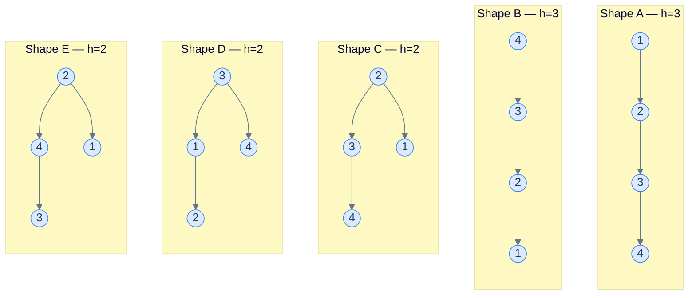

<p align="center"><strong>Five different BSTs holding the same four values <code>{1, 2, 3, 4}</code>. The two skew shapes (A, B) have height 3; the three balanced-ish shapes (C, D, E) have height 2. Same data, different geometries, different speeds.</strong></p>

Some shapes — the skewed ones — give you a worst-case path of `3` for `4` nodes. Other shapes give you `2`. Scale this up to a million nodes and the gap explodes: a balanced tree gives ~20 hops, a skewed tree gives a million.

## Most performant binary trees

The fastest BSTs are the **shortest** ones. For a given number of nodes, the minimum possible height is achieved when every level is completely filled — except possibly the last, which fills from left to right. That shape is called a **complete binary tree**, and it gives the tightest possible height: `⌊log₂(n)⌋ + 1`.

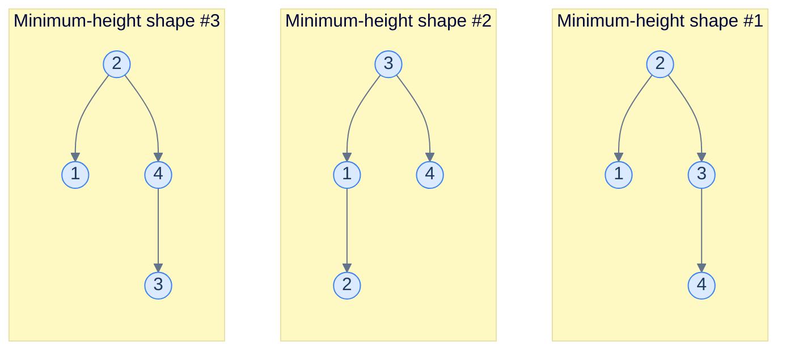

<p align="center"><strong>All BSTs of 4 nodes that have the minimum possible height (h = 2). Each has every level filled before any deeper level is started.</strong></p>

These trees are *as good as it gets*. If you could keep your BST in this shape forever, every operation would run in pure O(log n) and there would be nothing more to discuss. The rest of this lesson is about the fact that you can't — at least, not without some help.

## Least performant binary trees

The slowest BSTs are the **tallest** — the **skew trees**, where every node has only a left child or only a right child. With `n` nodes, the height is `n`, the worst case for a path through the tree.


<p align="center"><strong>A right-skew BST with 4 nodes. Height = 4 = number of nodes. Operations on this tree degrade from O(log n) to O(n) — exactly as bad as a linked list.</strong></p>

You produce this tree by inserting *already-sorted* data into an empty BST: `1, 2, 3, 4` go right, right, right, right. Sorted input is the worst-case adversary for a naive BST — and unfortunately, sorted input shows up *constantly* in the real world (chronologically ordered records, monotone IDs, alphabetised keys). This is the failure case the rest of the chapter is engineered to avoid.

## Limitation in using height for performance

Height is the **dominant** factor in BST performance, but it is not the *only* one. The big-O bound `O(h)` describes a *worst-case path* — the longest one. It does not describe the *average* path, which is what you experience over many lookups. Two trees with identical heights can still differ in *average* search depth, and over millions of operations that constant-factor difference is real.

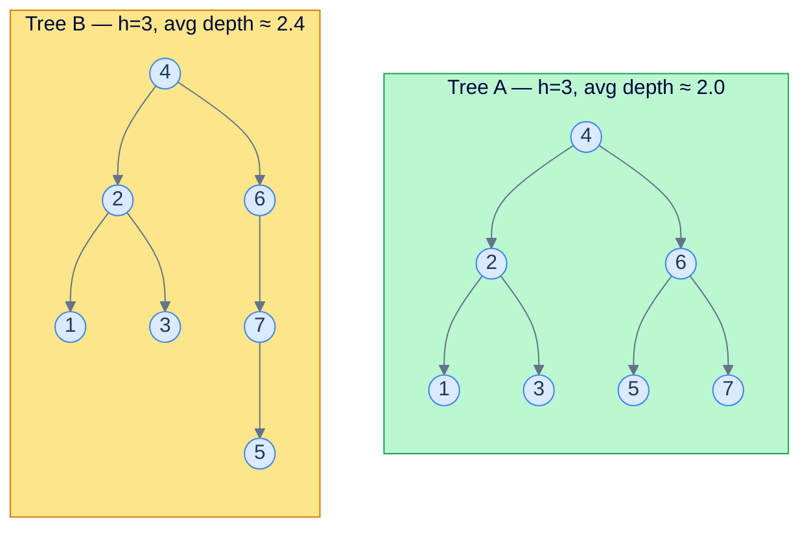

<p align="center"><strong>Both trees have the same height. Tree A is perfectly balanced and reaches every node with an average of ~2 hops. Tree B has the same worst-case height but a slightly skewed right side, costing more hops on average. Big-O hides this — but real workloads feel it.</strong></p>

So height alone is necessary but not sufficient to judge a BST. We need a finer-grained metric — one that asks not just *how tall* the tree is, but *how lopsided* it is at each node. That is the **balance factor**, and it is the subject of the next section.

***

# Understanding the impact of balance on performance

The metric that captures *how evenly distributed* a tree's nodes are is the **balance factor**. It is computed at every node, from that node's two subtrees.

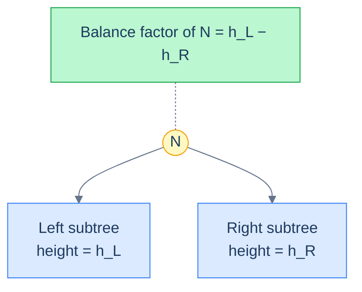

<p align="center"><strong>The balance factor of a node is the height of its left subtree minus the height of its right subtree.</strong></p>

> The balance factor for a node is the difference between the height of its left and right subtree.

A node with balance factor `0` is perfectly balanced — its two subtrees are the same height. A factor of `+1` means the left subtree is one level taller; `-1` means the right subtree is one level taller. The further from zero the factor, the more lopsided the node — and the more wasted depth your tree carries on one side.

## Balance factor of a subtree

The same definition extends to any node in the tree, not just the root. The balance factor *at a node* is computed using only the subtree rooted at that node — its own left subtree's height minus its own right subtree's height. Different nodes in the same tree can therefore have very different balance factors.

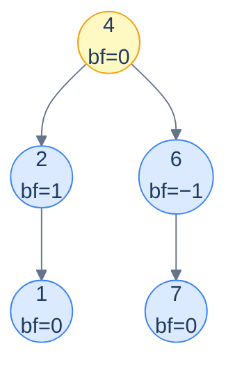

<p align="center"><strong>Each node carries its own balance factor: <code>4</code> is balanced, <code>2</code> leans left by 1, <code>6</code> leans right by 1. The tree as a whole has many balance factors — one per node.</strong></p>

Now look at all five 4-node trees again, this time annotated with the balance factor at the root.

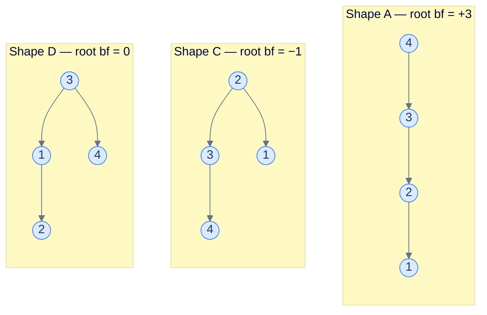

<p align="center"><strong>Three BSTs of 4 nodes with very different balance factors at the root: skew (+3), gentle lean (−1), and perfectly balanced (0).</strong></p>

The sign of the balance factor tells you *which* side leans, but for performance reasoning we usually only care *how much* it leans. That motivates one final notion.

## Absolute balance factor

> The absolute value of the balance factor is called the **absolute balance factor**.

A node with absolute balance factor `0` has identically tall subtrees. `1` means one side is one level taller — barely lopsided. Anything `≥ 2` means the tree has a meaningfully wasted side, and operations descending into the taller side will pay for it.

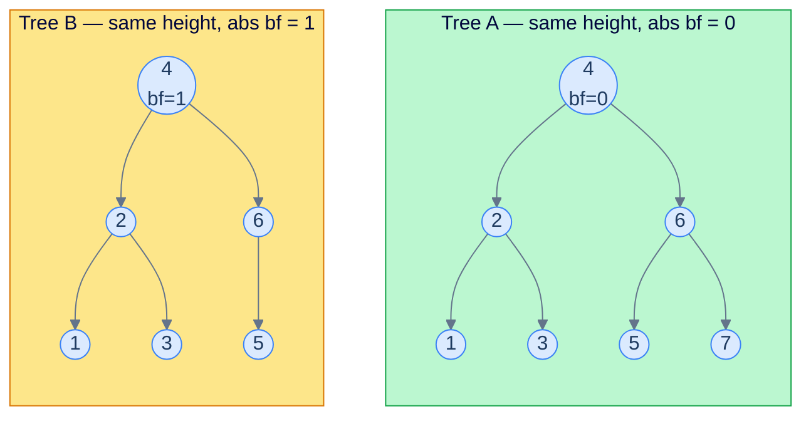

<p align="center"><strong>Both trees are 3 levels tall, but Tree A is perfectly balanced (abs bf = 0 everywhere) while Tree B is one node short on the right. Average lookup depth is lower in Tree A — same big-O, but better constants.</strong></p>

A tree with low absolute balance factors at every node is a tree whose work is spread evenly. That's the regime where BSTs sing.

## Characteristics of optimal binary search trees

The optimal BST is the one with **minimum possible height** *and* **minimum possible absolute balance factor at every node**. These two are not independent — keeping the absolute balance factor at most `1` at every node *forces* the height to be minimal.

The proof is constructive. Build a 5-node BST node by node, always keeping the absolute balance factor of every node ≤ 1, and you'll see you have no choice but to fill each level completely before starting the next.

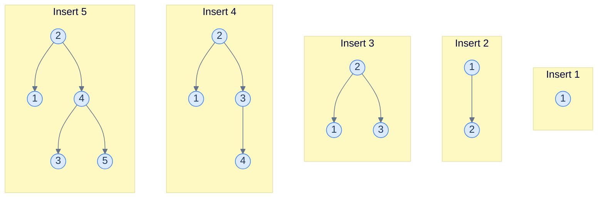

<p align="center"><strong>Building a 5-node BST with absolute balance factor ≤ 1 at every step. The constraint forces each level to fill completely before the next is started — so the result is a complete binary tree.</strong></p>

The constraint forced the result. **A BST in which every node has absolute balance factor ≤ 1, with the strictest interpretation, is a complete binary tree** — the most optimal structure for `n` nodes.

***

# Balance factor

## Problem Statement

Given the **root** of a binary search tree, write a function to calculate and return its balance factor.

> The balance factor of a binary tree is the difference between the height of the left and right subtree of the root node.

### Example 1

> - **Input:** `root = [4, 2, 6, 1, null, null, 7]`
> - **Output:** `0`
> - **Explanation:**
>   - height of left subtree = 2
>   - height of right subtree = 2
>   - balance factor = 2 − 2 = 0

### Example 2

> - **Input:** `root = [2, 1, 4, null, null, 3, 7]`
> - **Output:** `-1`
> - **Explanation:**
>   - height of left subtree = 1
>   - height of right subtree = 2
>   - balance factor = 1 − 2 = −1

## The Strategy

Two pieces. Both are tiny on their own; the trick is composing them.

1. A helper `height(node)` that returns the height of the subtree at `node`. Recurse down both sides, take the bigger one, add `1` for the current level. An empty subtree contributes `0`.
2. The main function calls `height(root.left)` and `height(root.right)` and returns their difference.

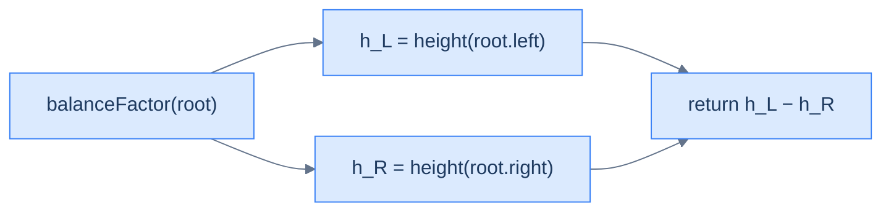

<p align="center"><strong>Compute each side's height once, subtract, return.</strong></p>

## The Solution


```pseudocode
function findHeight(root):
    if root is null:
        return 0
    leftH ← findHeight(root.left)
    rightH ← findHeight(root.right)
    return max(leftH, rightH) + 1

function balanceFactor(root):
    if root is null:
        return 0
    return findHeight(root.left) − findHeight(root.right)
```

```python run
# Definition for a binary tree node.
# class TreeNode:
#     def __init__(self, val=0, left=None, right=None):
#         self.val = val
#         self.left = left
#         self.right = right

class Solution:
    def find_height(self, root):
        # An empty subtree contributes nothing to height.
        if root is None:
            return 0
        # Recurse into both children — height is decided by the deeper side.
        left_height = self.find_height(root.left)
        right_height = self.find_height(root.right)
        # +1 accounts for the current node's own level.
        return max(left_height, right_height) + 1

    def balance_factor(self, root):
        # Conventionally, an empty tree has balance factor 0.
        if root is None:
            return 0
        # Compute the height of each side independently...
        left_height = self.find_height(root.left)
        right_height = self.find_height(root.right)
        # ...and return left − right (positive = left-leaning, negative = right).
        return left_height - right_height
```

```java run
public class Main {
    static class TreeNode { int val; TreeNode left, right; TreeNode(int v){val=v;} }

    static class Solution {
        int findHeight(TreeNode root) {
            // Empty subtree has height 0.
            if (root == null) return 0;
            // Recurse into both children to find the deeper side.
            int leftHeight  = findHeight(root.left);
            int rightHeight = findHeight(root.right);
            // +1 accounts for the current node's level.
            return Math.max(leftHeight, rightHeight) + 1;
        }

        public int balanceFactor(TreeNode root) {
            if (root == null) return 0;                   // empty tree → 0 by convention
            int leftHeight  = findHeight(root.left);      // height of left subtree
            int rightHeight = findHeight(root.right);     // height of right subtree
            return leftHeight - rightHeight;              // sign tells which side leans
        }
    }

    public static void main(String[] args) {
        TreeNode root = new TreeNode(4);
        root.left  = new TreeNode(2); root.right = new TreeNode(6);
        root.left.left  = new TreeNode(1);
        root.right.right = new TreeNode(7);
        System.out.println(new Solution().balanceFactor(root));  // 0
    }
}
```

```c run
/**
 * struct TreeNode {
 *     int val;
 *     struct TreeNode *left;
 *     struct TreeNode *right;
 * };
 */
#include <stdlib.h>

static int max_int(int a, int b) { return a > b ? a : b; }

int findHeight(struct TreeNode *root) {
    if (root == NULL) return 0;                        // empty subtree
    int leftHeight  = findHeight(root->left);          // recurse left
    int rightHeight = findHeight(root->right);         // recurse right
    return max_int(leftHeight, rightHeight) + 1;       // +1 for this level
}

int balanceFactor(struct TreeNode *root) {
    if (root == NULL) return 0;                        // 0 by convention
    int leftHeight  = findHeight(root->left);
    int rightHeight = findHeight(root->right);
    return leftHeight - rightHeight;                   // > 0 = left-heavy
}
```

```scala run
class TreeNode(var value: Int, var left: TreeNode = null, var right: TreeNode = null)

object Main extends App {
  class Solution {
    def findHeight(root: TreeNode): Int =
      if (root == null) 0                                  // empty contributes nothing
      else 1 + math.max(findHeight(root.left),             // +1 for current level
                        findHeight(root.right))

    def balanceFactor(root: TreeNode): Int =
      if (root == null) 0
      else findHeight(root.left) - findHeight(root.right)  // > 0 means left-heavier
  }

  val root = new TreeNode(4,
    new TreeNode(2, new TreeNode(1), null),
    new TreeNode(6, null, new TreeNode(7)))
  println(new Solution().balanceFactor(root))  // 0
}
```


***

# Balance of subtree

## Problem Statement

Given the **root** of a binary search tree and the **value** of a node, write a function to find and return the balance factor of the subtree at that node. Return `0` if the node with the given value does not exist.

The balance factor of a subtree is the difference between the height of its left and right subtree.

### Example 1

> - **Input:** `root = [4, 2, 6, 1, null, null, 7]`, `value = 2`
> - **Output:** `1`
> - **Explanation:**
>   - height of left subtree = 1
>   - height of right subtree = 0
>   - balance factor = 1 − 0 = 1

### Example 2

> - **Input:** `root = [2, 1, 4, null, null, 3, 7]`, `value = 4`
> - **Output:** `0`
> - **Explanation:**
>   - height of left subtree = 1
>   - height of right subtree = 1
>   - balance factor = 1 − 1 = 0

## The Strategy

This is the previous problem, plus a *find* step at the front. We must locate the target node first, then run the same balance-factor calculation on it.

1. **Find** — recursively search for a node whose value equals `value`. We don't yet know the BST search rule by name (next lessons), so we treat the tree as a generic binary tree and search both subtrees.
2. **Compute** — once we have the node, run `height(node.left) − height(node.right)`.

If the value isn't in the tree, the find returns `null`/`None`, and we return `0` per the problem spec.

## The Solution


```pseudocode
function findNode(root, value):
    if root is null OR root.val = value:
        return root
    found ← findNode(root.left, value)
    if found is NOT null:
        return found
    return findNode(root.right, value)

function balanceOfSubtree(root, value):
    node ← findNode(root, value)
    if node is null:
        return 0
    return findHeight(node.left) − findHeight(node.right)
```

```python run
class Solution:
    def find_node(self, root, value):
        # Empty subtree, or this is the node we wanted.
        if root is None or root.val == value:
            return root
        # Search the left subtree first; if found, return early.
        left_node = self.find_node(root.left, value)
        if left_node is not None:
            return left_node
        # Otherwise, the answer (or None) is in the right subtree.
        return self.find_node(root.right, value)

    def find_height(self, root):
        if root is None:
            return 0
        return max(self.find_height(root.left),
                   self.find_height(root.right)) + 1

    def balance_of_subtree(self, root, value):
        node = self.find_node(root, value)
        if node is None:                              # value not present → 0 by spec
            return 0
        return self.find_height(node.left) - self.find_height(node.right)
```

```java run
public class Main {
    static class TreeNode { int val; TreeNode left, right; TreeNode(int v){val=v;} }

    static class Solution {
        TreeNode findNode(TreeNode root, int value) {
            if (root == null || root.val == value) return root;       // base cases
            TreeNode left = findNode(root.left, value);
            if (left != null) return left;                            // short-circuit on hit
            return findNode(root.right, value);
        }

        int findHeight(TreeNode root) {
            if (root == null) return 0;
            return Math.max(findHeight(root.left), findHeight(root.right)) + 1;
        }

        public int balanceOfSubtree(TreeNode root, int value) {
            TreeNode node = findNode(root, value);
            if (node == null) return 0;                               // value not present
            return findHeight(node.left) - findHeight(node.right);
        }
    }

    public static void main(String[] args) {
        TreeNode root = new TreeNode(4);
        root.left  = new TreeNode(2); root.right = new TreeNode(6);
        root.left.left  = new TreeNode(1);
        root.right.right = new TreeNode(7);
        System.out.println(new Solution().balanceOfSubtree(root, 2));  // 1
    }
}
```

```c run
#include <stdlib.h>
static int max_int(int a, int b) { return a > b ? a : b; }

struct TreeNode *findNode(struct TreeNode *root, int value) {
    if (root == NULL || root->val == value) return root;          // base cases
    struct TreeNode *left = findNode(root->left, value);
    if (left != NULL) return left;                                // hit — short-circuit
    return findNode(root->right, value);
}

int findHeight(struct TreeNode *root) {
    if (root == NULL) return 0;
    return max_int(findHeight(root->left), findHeight(root->right)) + 1;
}

int balanceOfSubtree(struct TreeNode *root, int value) {
    struct TreeNode *node = findNode(root, value);
    if (node == NULL) return 0;                                   // not present → 0
    return findHeight(node->left) - findHeight(node->right);
}
```

```scala run
class TreeNode(var value: Int, var left: TreeNode = null, var right: TreeNode = null)

object Main extends App {
  class Solution {
    def findNode(root: TreeNode, value: Int): TreeNode = {
      if (root == null || root.value == value) root                 // base cases
      else {
        val left = findNode(root.left, value)
        if (left != null) left                                      // hit — short-circuit
        else findNode(root.right, value)
      }
    }

    def findHeight(root: TreeNode): Int =
      if (root == null) 0
      else 1 + math.max(findHeight(root.left), findHeight(root.right))

    def balanceOfSubtree(root: TreeNode, value: Int): Int = {
      val node = findNode(root, value)
      if (node == null) 0
      else findHeight(node.left) - findHeight(node.right)
    }
  }

  val root = new TreeNode(4,
    new TreeNode(2, new TreeNode(1), null),
    new TreeNode(6, null, new TreeNode(7)))
  println(new Solution().balanceOfSubtree(root, 2))  // 1
}
```


***

# Challenges in implementing complete binary search trees

The previous section ended on a triumphant note: complete BSTs are optimal. So why don't we just *use* them?

Because the moment you modify the tree, completeness breaks.

## Modifications

If your data is fixed — built once, never updated — keeping the BST complete forever is easy. You build it once and walk away.

The problem is that real BSTs are inserted into and deleted from constantly. Any single insert can land a new node in the wrong slot to keep the tree complete; any single delete can leave a "hole" that breaks the level-by-level filling rule.

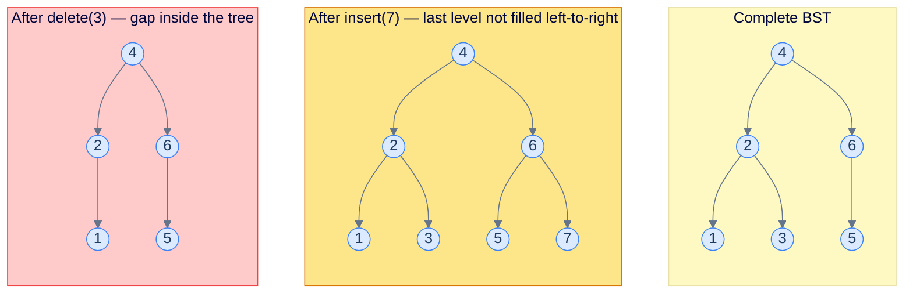

<p align="center"><strong>Even a single insert or delete can violate completeness — the rule is too rigid for a structure that changes shape often.</strong></p>

To keep using a complete BST as your live data structure, every modification must be followed by two repair steps.

### Step 1: Verify the completeness

Walk the tree and check that every level except possibly the last is full, and that the last level is filled left-to-right with no internal gaps. This is essentially a level-order traversal that tracks the first time it sees a missing child and fails if any subsequent node has a child after that.

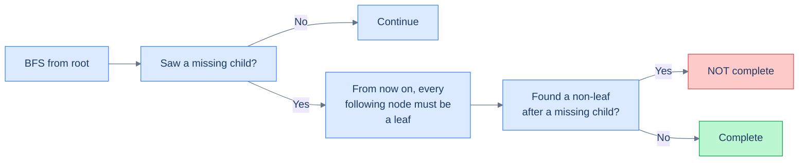

<p align="center"><strong>Verifying completeness via level-order traversal — once a missing child appears, every later node must be a leaf.</strong></p>

### Step 2: Rebalance the tree

If the tree is no longer complete, we have to repair it. That means moving values around — potentially across the entire tree — until completeness is restored *and* the BST property still holds.

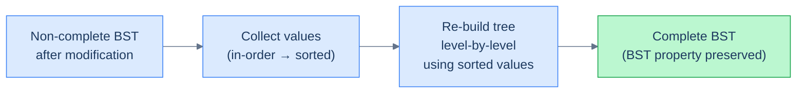

<p align="center"><strong>Rebalancing a complete BST in the worst case requires reading out all values and reconstructing the tree from scratch.</strong></p>

So in principle: insert → repair, delete → repair. The structure stays optimal *if* you can pay the repair cost.

## Limitations of rebalancing complete binary search trees

The repair cost is the killer.

Restoring completeness while preserving the BST property typically requires moving many nodes — often *most* of them. In the worst case, you have to flatten the tree, sort the values, and rebuild it. That is **O(n)** work after every single insert or delete.

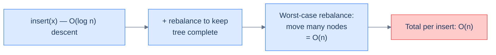

<p align="center"><strong>Forcing the tree to remain complete drags every insert and delete to O(n) — defeating the entire reason we wanted a BST.</strong></p>

A BST whose lookup is O(log n) but whose insert is O(n) is no better than a sorted array. We need a **weaker** definition of "balanced" — one we can *cheaply* maintain — that still gives us logarithmic operations.

***

# Understanding height balanced binary trees

The compromise is to relax the rule. Instead of demanding *perfect* completeness, we demand only that **no node is too lopsided**. That is the definition of a **height-balanced binary tree**:

> A height-balanced binary tree is a tree where, for every node in the tree, the absolute difference between the height of the left and right subtree is at most `1`.

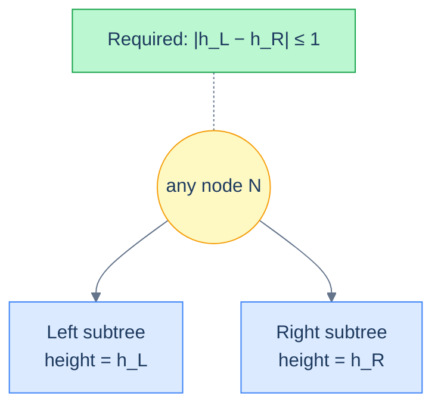

<p align="center"><strong>The height-balanced rule, applied at every node — not just the root.</strong></p>

This is *strictly weaker* than completeness. Plenty of height-balanced trees are not complete, but every complete tree is height-balanced. The relaxation buys us cheap repair without sacrificing logarithmic operations.

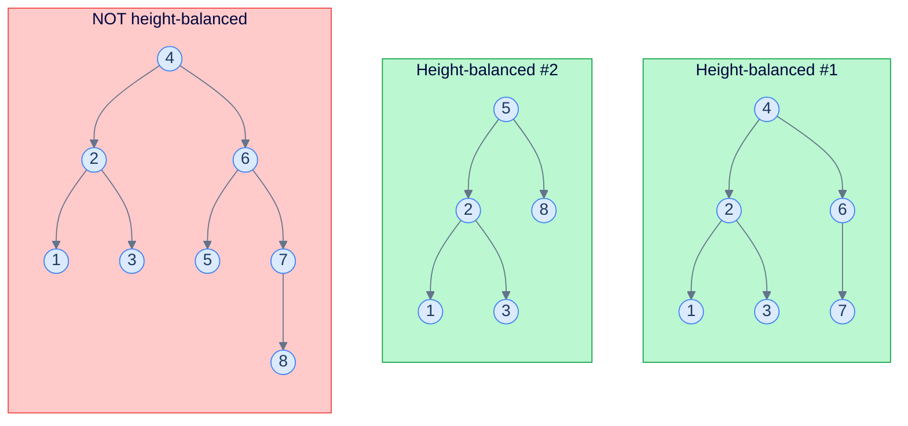

<p align="center"><strong>Two height-balanced trees on the left (every node's subtrees differ in height by at most 1). On the right: at node <code>4</code>, the right subtree has height 3 and the left has height 2 — difference 1, fine — but at node <code>6</code>, the right subtree (height 2) is two taller than the left (height 0). Rule violated.</strong></p>

## Modifications

Just like the complete tree, a height-balanced tree can become unbalanced after an insert or delete. The difference is that *fixing* it is cheap.


<p align="center"><strong>The repair pipeline: detect imbalance, rotate locally, done. No full reconstruction needed.</strong></p>

### Step 1: Verify the balance

Verifying height-balance is a recursive walk: compute the height of each subtree, return early if any node violates the rule. This runs in O(n) (once at the end of an operation), but the verification *during* a self-balancing operation is local — only the path from root to the modified node needs re-checking.

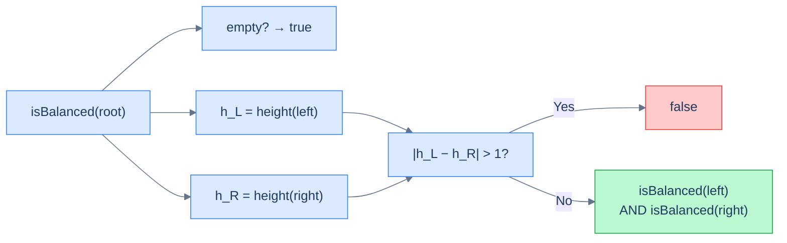

<p align="center"><strong>Verifying that a tree is height-balanced — recurse, check the local rule, return false on the first violation.</strong></p>

### Step 2: Rebalance the tree

Self-balancing BSTs (AVL trees, red-black trees, treaps, splay trees) all repair imbalance using a small set of **rotations** — local pointer rewires that change the tree's shape without violating the BST property. A rotation is O(1), and any single insert or delete needs at most O(log n) of them along the root-path. Detailed rotation algorithms are beyond this lesson, but the takeaway is clear:

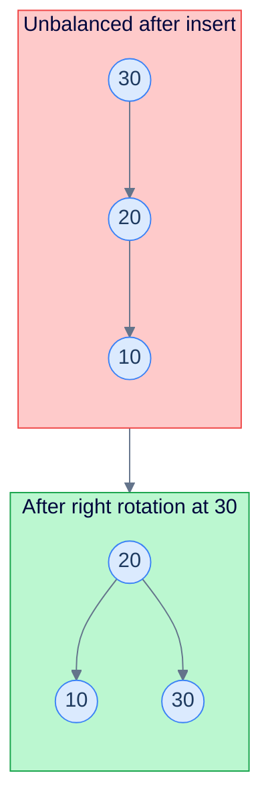

<p align="center"><strong>A single rotation flips a left-leaning chain into a balanced tree — O(1) pointer surgery, BST property preserved.</strong></p>

## Complexity analysis

Height-balanced binary search trees offer a guaranteed logarithmic height. Even though they're not as tight as complete trees, they're still tight enough — and they're the cheapest balance you can buy.

| Case | Time | Space |
|---|---|---|
| Best | O(log n) | O(log n) |
| Worst | O(log n) | O(log n) |

The space is O(log n) because that's the recursion depth needed to walk a balanced tree. Production systems lean on these structures heavily — Java's `TreeMap`, C++'s `std::map`, Linux's CFS scheduler, and most database B-tree variants are all instances of this same idea.

***

# Height balanced tree

## Problem Statement

Given the **root** of a binary search tree, write a function to check if it is height-balanced. If it is height-balanced, return `true`; otherwise return `false`.

A height-balanced tree is a tree where the balance factor for every node in the tree is in the range `[-1, 1]` inclusive.

### Example 1

> - **Input:** `root = [4, 2, 6, 1, null, null, 7]`
> - **Output:** `true`
> - **Explanation:** Every node's subtrees differ in height by at most 1.

### Example 2

> - **Input:** `root = [1, null, 4, 2, 7]`
> - **Output:** `false`
> - **Explanation:** At the root, the left subtree has height 0 and the right has height 2 — difference 2, rule violated.

## The Strategy

Recursion all the way down: a tree is height-balanced if **all three** of these hold simultaneously:

1. The current node's `|h_L − h_R| ≤ 1`.
2. The left subtree is height-balanced.
3. The right subtree is height-balanced.

The empty tree is balanced by definition. Any node that fails check 1 short-circuits the whole thing to `false`.

> *Friction prompt — predict before reading the code: what happens to the running time if we use this naive recursive approach? At every node we call `findHeight` (which itself walks the subtree) AND we recurse on the children. Is the work O(n), O(n log n), or worse?*

The answer is **O(n²)** in the worst case (a skew tree), because `findHeight` re-walks each subtree from scratch at every level. There's a classic O(n) optimisation that returns height *and* the balanced-flag in one bottom-up pass — we'll meet that idiom many times in this course. Keeping the simpler form here makes the structure crystal clear.

## The Solution


```pseudocode
function heightBalancedTree(root):
    if root is null:
        return true
    lh ← findHeight(root.left)
    rh ← findHeight(root.right)
    if |lh − rh| > 1:
        return false
    return heightBalancedTree(root.left) AND heightBalancedTree(root.right)
```

```python run
class Solution:
    def find_height(self, root):
        if root is None:
            return 0
        return max(self.find_height(root.left),
                   self.find_height(root.right)) + 1

    def height_balanced_tree(self, root):
        # Empty tree is trivially height-balanced.
        if root is None:
            return True

        left_height  = self.find_height(root.left)
        right_height = self.find_height(root.right)

        # Local rule: this node's two subtrees differ by at most 1 in height.
        if abs(left_height - right_height) <= 1:
            # Local rule holds — now both subtrees must also be balanced themselves.
            return (self.height_balanced_tree(root.left) and
                    self.height_balanced_tree(root.right))
        # Local rule failed — short-circuit the whole tree to False.
        return False
```

```java run
public class Main {
    static class TreeNode { int val; TreeNode left, right; TreeNode(int v){val=v;} }

    static class Solution {
        int findHeight(TreeNode root) {
            if (root == null) return 0;
            return Math.max(findHeight(root.left), findHeight(root.right)) + 1;
        }

        public boolean heightBalancedTree(TreeNode root) {
            if (root == null) return true;                                        // empty → balanced

            int leftHeight  = findHeight(root.left);
            int rightHeight = findHeight(root.right);

            if (Math.abs(leftHeight - rightHeight) <= 1) {                        // local rule holds...
                return heightBalancedTree(root.left)                              // ...check both
                    && heightBalancedTree(root.right);                            //    subtrees
            }
            return false;                                                          // local rule failed
        }
    }

    public static void main(String[] args) {
        TreeNode root = new TreeNode(4);
        root.left  = new TreeNode(2); root.right = new TreeNode(6);
        root.left.left  = new TreeNode(1);
        root.right.right = new TreeNode(7);
        System.out.println(new Solution().heightBalancedTree(root));  // true
    }
}
```

```c run
#include <stdlib.h>
#include <stdbool.h>
static int max_int(int a, int b) { return a > b ? a : b; }
static int abs_int(int x) { return x < 0 ? -x : x; }

int findHeight(struct TreeNode *root) {
    if (root == NULL) return 0;
    return max_int(findHeight(root->left), findHeight(root->right)) + 1;
}

bool heightBalancedTree(struct TreeNode *root) {
    if (root == NULL) return true;                                           // empty → balanced

    int leftHeight  = findHeight(root->left);
    int rightHeight = findHeight(root->right);

    if (abs_int(leftHeight - rightHeight) <= 1) {                            // local rule holds
        return heightBalancedTree(root->left) &&
               heightBalancedTree(root->right);                              // recurse both sides
    }
    return false;                                                            // local rule failed
}
```

```scala run
class TreeNode(var value: Int, var left: TreeNode = null, var right: TreeNode = null)

object Main extends App {
  class Solution {
    def findHeight(root: TreeNode): Int =
      if (root == null) 0
      else 1 + math.max(findHeight(root.left), findHeight(root.right))

    def heightBalancedTree(root: TreeNode): Boolean = {
      if (root == null) return true                                              // empty → balanced
      val l = findHeight(root.left)
      val r = findHeight(root.right)
      if (math.abs(l - r) <= 1)
        heightBalancedTree(root.left) && heightBalancedTree(root.right)          // recurse
      else false                                                                 // local rule failed
    }
  }

  val root = new TreeNode(4,
    new TreeNode(2, new TreeNode(1), null),
    new TreeNode(6, null, new TreeNode(7)))
  println(new Solution().heightBalancedTree(root))  // true
}
```


***

## Final Takeaway

Two numbers govern every BST's performance: its **height** (worst-case path length) and its **absolute balance factor** (how lopsided each node is). Complete trees minimise both, but they're too rigid to maintain under live mutation. Height-balanced trees relax the rule just enough to be cheap to repair *and* still guarantee logarithmic operations. Every self-balancing BST you'll ever use — AVL, red-black, treap — is a different recipe for keeping that absolute balance factor `≤ 1` after each modification.

The next lesson zooms back in to the basic operation that justifies all of this engineering: **search**. We'll first do it recursively, leaning on the BST property at every step to halve the remaining tree.
