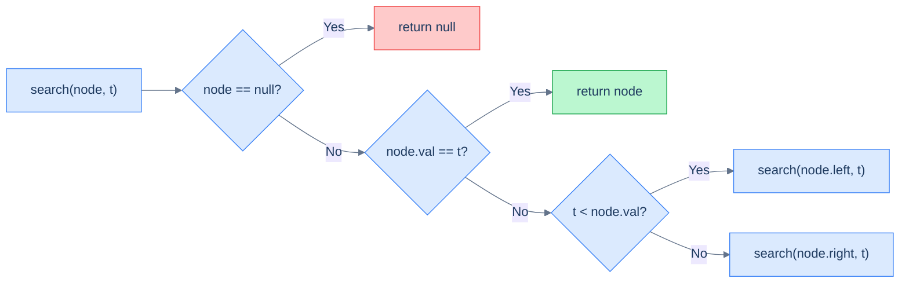
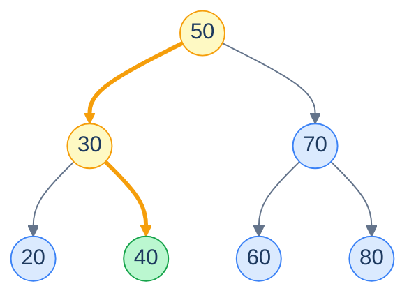
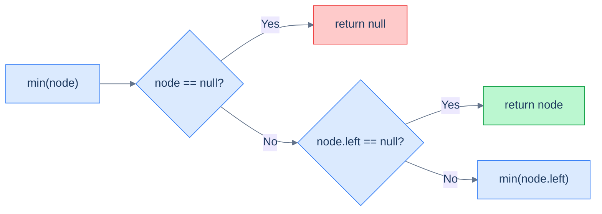
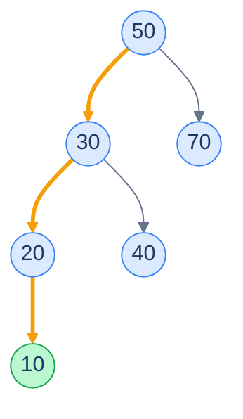
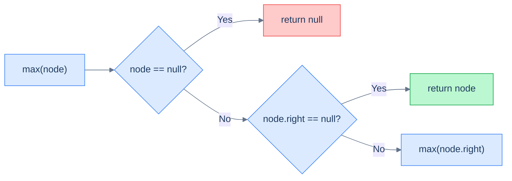
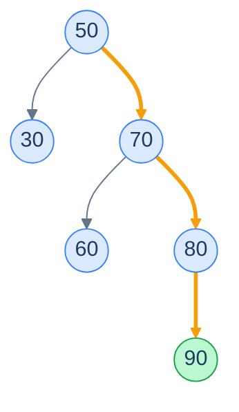
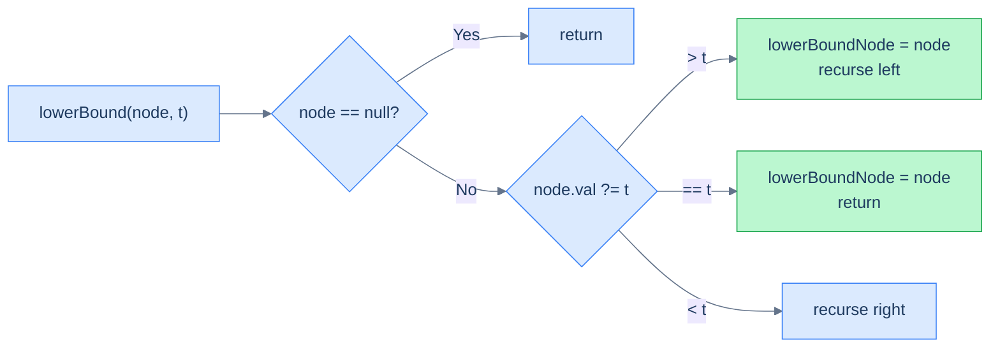
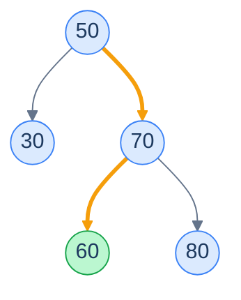
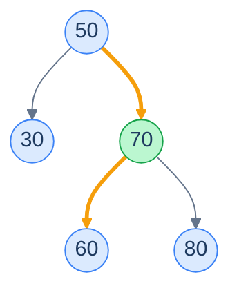
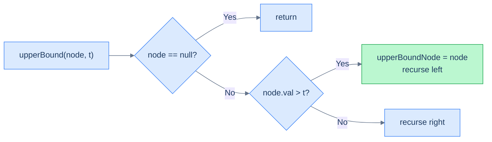

# 3. Recursive Searching in Binary Search Trees

## The Hook

Search a generic binary tree of a million nodes for one value, and you might be looking at *every* node — there's no rule telling you where the value lives, so you must check everywhere. A million comparisons. A million pointer follows. Linear scan, no shortcut.

Search the *same* million values arranged as a balanced BST and you do roughly **twenty** comparisons. Twenty. The trick? At every step, the BST property tells you *exactly which half of the remaining tree to throw away*. Each comparison kills half the work. That's binary search — turned into a tree.

This lesson uses recursion to make the idea click. Five problems, all variants of the same descent: **search** for an exact value, find the **minimum**, find the **maximum**, find the **lower bound** (≥ target), find the **upper bound** (> target). Each is the same one-decision-per-node walk; only the rule for "which side, and when do I stop" changes.

---

## Table of Contents

1. [Understanding recursive search](#understanding-recursive-search)
2. [Recursive search](#recursive-search)
3. [Understanding recursive minimum search](#understanding-recursive-minimum-search)
4. [Recursively find minimum](#recursively-find-minimum)
5. [Understanding recursive maximum search](#understanding-recursive-maximum-search)
6. [Recursively find maximum](#recursively-find-maximum)
7. [Understanding recursive lower bound search](#understanding-recursive-lower-bound-search)
8. [Recursively find lower bound](#recursively-find-lower-bound)
9. [Understanding recursive upper bound search](#understanding-recursive-upper-bound-search)
10. [Recursively find upper bound](#recursively-find-upper-bound)

***

# Understanding recursive search

You *could* search a BST by walking the entire tree like any binary tree — but that ignores the one rule that makes a BST special:

> - All nodes in a node's `left` subtree are **less in value** than the node's value.
> - All nodes in a node's `right` subtree are **greater in value** than the node's value.

That rule is a giant *sign post*. If you're at a node holding `50` and you want `73`, you don't even need to look at the left subtree — every value there is `< 50 < 73`, so the answer can't be on the left. Throw it away. **The rule turns a search into a guided descent.**

## Algorithm

At each step:

- If the current node is empty, the value isn't in the tree.
- If the current node holds the target, you're done.
- If the target is less than the current node's value, the target — if it exists — must be in the left subtree.
- If the target is greater than the current node's value, it must be in the right subtree.

That's the recursive equation. Pin it visually first.



<p align="center"><strong>The recursive equation for searching a BST: at every node, do one comparison and either stop or recurse into exactly one subtree.</strong></p>

The crucial property is that we recurse into **only one** of the subtrees at every step — never both. A normal binary-tree search has to fall back to checking both sides, paying O(n). The BST rule turns that branching factor of 2 into a branching factor of *1*, so we walk a single root-to-leaf path.

## A worked example

Take the tree below and search for `40`.



<p align="center"><strong>Searching for <code>40</code> in a BST. Step 1: at <code>50</code>, target <code>40 &lt; 50</code> → go left. Step 2: at <code>30</code>, target <code>40 &gt; 30</code> → go right. Step 3: at <code>40</code>, match — return.</strong></p>

> **Algorithm**
>
> - **Step 1:** If the `current` node is `null`, return it (base case).
> - **Step 2:** If the `current` node's value equals the `target`, return it.
> - **Step 3:** Else, if the `current` node's value exceeds the `target`, recursively call the search operation on the `left` subtree.
> - **Step 4:** Else, if the `current` node's value is less than the `target`, recursively call the search operation on the `right` subtree.

## What happens if the node is *not* found?

The recursion keeps descending — left, right, left, right, guided by the comparisons — until it walks off a leaf into a `null` child. That's the base case: return `null`. The path it followed was the *attempted slot* for the target. The last leaf node touched is either the largest value smaller than the target, or the smallest value larger than the target. We'll exploit this fact in the lower-bound and upper-bound problems later.

## Complexity

Search descends one root-to-leaf path. The path length is bounded by the **height** of the tree. So:

- **Time:** O(h) — and h = O(log n) on a balanced tree, h = O(n) on a skewed one.
- **Space:** O(h) for the recursion call stack.

| Case | Time | Space |
|---|---|---|
| Best (balanced) | O(log n) | O(log n) |
| Worst (skewed) | O(n) | O(n) |

Now do this on a million-node balanced BST: ~20 comparisons. On a million-node skew BST: a million comparisons. **Same algorithm. The shape of the tree is what decides whether you're getting binary-search performance or a linear scan in disguise.**

***

# Recursive search

## Problem Statement

Given the **root** of a binary search tree and a **target** value, write a function to return the node with the given value. If there is no such node return `null`.

You must do this **recursively**.

### Example 1

> - **Input:** `root = [4, 2, 5, 1, 3, null, 6]`, `target = 3`
> - **Output:** `3`
> - **Explanation:** The given binary search tree has a node with the value 3.

### Example 2

> - **Input:** `root = [5, 4, 10, null, null, 9, 11]`, `target = 20`
> - **Output:** `null`
> - **Explanation:** The given binary search tree has no node with the value 20.

## The Solution


```pseudocode
function recursiveSearch(root, target):
    if root is null:
        return null
    if root.val = target:
        return root
    if target < root.val:
        return recursiveSearch(root.left, target)
    return recursiveSearch(root.right, target)
```

```python run
class Solution:
    def recursive_search(self, root, target):
        # Base case 1 — empty subtree means the target isn't in the tree.
        if root is None:
            return None
        # Base case 2 — match: return the node directly.
        if root.val == target:
            return root
        # BST rule: target < node → answer (if any) is in the left subtree.
        if target < root.val:
            return self.recursive_search(root.left, target)
        # Otherwise target > node → answer (if any) is in the right subtree.
        return self.recursive_search(root.right, target)
```

```java run
class Solution {
    public TreeNode recursiveSearch(TreeNode root, int target) {
        if (root == null) return null;                               // empty subtree
        if (root.val == target) return root;                         // match
        if (target < root.val)                                       // BST rule:
            return recursiveSearch(root.left, target);               //   left half
        return recursiveSearch(root.right, target);                  //   right half
    }
}
```

```c run
struct TreeNode *recursiveSearch(struct TreeNode *root, int target) {
    if (root == NULL) return NULL;                                   // empty subtree
    if (root->val == target) return root;                            // match
    if (target < root->val)                                          // BST rule
        return recursiveSearch(root->left, target);                  //   go left
    return recursiveSearch(root->right, target);                     //   go right
}
```

```scala run
object Solution {
  def recursiveSearch(root: TreeNode, target: Int): TreeNode = {
    if (root == null) null                                            // empty subtree
    else if (root.value == target) root                               // match
    else if (target < root.value) recursiveSearch(root.left,  target) // BST rule: left
    else                          recursiveSearch(root.right, target) //          right
  }
}
```


<details>
<summary><strong>Trace — root = [50, 30, 70, 20, 40, 60, 80], target = 40</strong></summary>

```
Step 1 │ at 50 │ 40 < 50 → recurse on left subtree
Step 2 │ at 30 │ 40 > 30 → recurse on right subtree
Step 3 │ at 40 │ 40 == 40 → MATCH → return node 40
Result: node 40 ✓ (3 comparisons in a 7-node tree)
```

</details>

***

# Understanding recursive minimum search

The minimum value in a BST is the value you reach by walking *as far left as you can*. Why? Because everything to the left of any node is smaller. Cross enough of those "left" decisions and you converge on the smallest value the tree contains — the **leftmost** node.

## Algorithm



<p align="center"><strong>Recursive equation for the minimum: keep stepping into the left child; the moment there is no left child, you've found the smallest value.</strong></p>



<p align="center"><strong>Walking left repeatedly: <code>50 → 30 → 20 → 10</code>. <code>10</code> has no left child, so it is the minimum.</strong></p>

> **Algorithm**
>
> - **Step 1:** If the `current` node is `null`, return it (base case).
> - **Step 2:** If the `current` node does not have a `left` subtree, return the node.
> - **Step 3:** Else, recursively call the search operation on the `left` subtree.

## Complexity

Like search, this descends one root-to-leaf path — specifically the *leftmost* path. Path length is bounded by the height.

| Case | Time | Space |
|---|---|---|
| Best (right-skew, left child of root absent) | O(1) | O(1) |
| Average (balanced) | O(log n) | O(log n) |
| Worst (left-skew) | O(n) | O(n) |

Recursion stack mirrors the path length.

***

# Recursively find minimum

## Problem Statement

Given the **root** of a binary search tree, write a function to return the node with the minimum value in it.

You must do this **recursively**.

### Example 1

> - **Input:** `root = [4, 2, 5, 1, 3, null, 6]`
> - **Output:** `1`

### Example 2

> - **Input:** `root = [5, 4, 10, null, null, 9, 11]`
> - **Output:** `4`

## The Solution


```pseudocode
function recursivelyFindMinimum(root):
    if root is null:
        return null
    if root.left is null:
        return root
    return recursivelyFindMinimum(root.left)
```

```python run
class Solution:
    def recursively_find_minimum(self, root):
        # Base case: an empty tree has no minimum.
        if root is None:
            return None
        # No left child means we've gone as far left as possible — this is the min.
        if root.left is None:
            return root
        # Otherwise the minimum lives somewhere in the left subtree; recurse.
        return self.recursively_find_minimum(root.left)
```

```java run
class Solution {
    public TreeNode recursivelyFindMinimum(TreeNode root) {
        if (root == null)      return null;                          // empty tree
        if (root.left == null) return root;                          // leftmost reached
        return recursivelyFindMinimum(root.left);                    // keep going left
    }
}
```

```c run
struct TreeNode *recursivelyFindMinimum(struct TreeNode *root) {
    if (root == NULL)        return NULL;                            // empty tree
    if (root->left == NULL)  return root;                            // leftmost reached
    return recursivelyFindMinimum(root->left);                       // keep going left
}
```

```scala run
object Solution {
  def recursivelyFindMinimum(root: TreeNode): TreeNode = {
    if (root == null)      null                                       // empty tree
    else if (root.left == null) root                                  // leftmost reached
    else recursivelyFindMinimum(root.left)                            // keep going left
  }
}
```


***

# Understanding recursive maximum search

By symmetry: the **maximum** is the value you reach by walking *as far right as you can*. Everything to the right of any node is larger; chase the rightmost path and you converge on the largest value in the tree.

## Algorithm



<p align="center"><strong>Recursive equation for the maximum: keep stepping into the right child; the moment there is no right child, you've found the largest value.</strong></p>



<p align="center"><strong>Walking right repeatedly: <code>50 → 70 → 80 → 90</code>. <code>90</code> has no right child, so it is the maximum.</strong></p>

> **Algorithm**
>
> - **Step 1:** If the `current` node is `null`, return it (base case).
> - **Step 2:** If the `current` node does not have a `right` subtree, return the node.
> - **Step 3:** Else, recursively call the search operation on the `right` subtree.

## Complexity

| Case | Time | Space |
|---|---|---|
| Best (left-skew, right child of root absent) | O(1) | O(1) |
| Average (balanced) | O(log n) | O(log n) |
| Worst (right-skew) | O(n) | O(n) |

***

# Recursively find maximum

## Problem Statement

Given the **root** of a binary search tree, write a function to return the maximum value in it.

You must do this **recursively**.

### Example 1

> - **Input:** `root = [4, 2, 5, 1, 3, null, 6]`
> - **Output:** `6`

### Example 2

> - **Input:** `root = [5, 4, 10, null, null, 9, 11]`
> - **Output:** `11`

## The Solution


```pseudocode
function recursivelyFindMaximum(root):
    if root is null:
        return null
    if root.right is null:
        return root
    return recursivelyFindMaximum(root.right)
```

```python run
class Solution:
    def recursively_find_maximum(self, root):
        # Base case: empty tree has no maximum.
        if root is None:
            return None
        # No right child means we've gone as far right as possible — this is the max.
        if root.right is None:
            return root
        # Otherwise the maximum lives somewhere in the right subtree; recurse.
        return self.recursively_find_maximum(root.right)
```

```java run
class Solution {
    public TreeNode recursivelyFindMaximum(TreeNode root) {
        if (root == null)        return null;                          // empty tree
        if (root.right == null)  return root;                          // rightmost reached
        return recursivelyFindMaximum(root.right);                     // keep going right
    }
}
```

```c run
struct TreeNode *recursivelyFindMaximum(struct TreeNode *root) {
    if (root == NULL)         return NULL;                              // empty tree
    if (root->right == NULL)  return root;                              // rightmost reached
    return recursivelyFindMaximum(root->right);                         // keep going right
}
```

```scala run
object Solution {
  def recursivelyFindMaximum(root: TreeNode): TreeNode = {
    if (root == null)            null                                    // empty tree
    else if (root.right == null) root                                    // rightmost reached
    else recursivelyFindMaximum(root.right)                              // keep going right
  }
}
```


***

# Understanding recursive lower bound search

The **lower bound** of a target `t` is the smallest value in the tree that is **greater than or equal to** `t`. (This is exactly what `std::lower_bound` and `Collections.ceiling` do.)

The catch is that the target itself may not exist in the tree. So we cannot just search for `t` and return what we find. We have to *track the best candidate we've seen so far* as we descend, then return that candidate when the descent ends.

## Algorithm

> *Friction prompt — predict before reading on. Imagine you are at a node holding `60`, your target is `54`. Do you go left or right? And — once you make that move — should you remember `60` for later? Why?*

You go **left** (since `54 < 60`), and yes, you should remember `60`: it's the smallest value `≥ 54` you've seen so far. If the entire left subtree turns out to hold no value `≥ 54`, then `60` is the answer.

This gives the rule: **whenever the current node's value is `≥ target`, it is a candidate** — record it, then look left for something even smaller-but-still-`≥ target`. When the value is `< target`, no candidate; go right.



<p align="center"><strong>Recursive equation for the lower bound. Update the candidate whenever the current value is ≥ target.</strong></p>

### Case 1 — the value is present

If the target exists in the tree, search reaches it and *the target is the lower bound* (since `target ≥ target`). We update the candidate and stop.

### Case 2 — the value is not present

The descent walks off a leaf into a `null`. The candidate now holds the *closest value ≥ target* the descent encountered. Two sub-cases worth seeing:

#### 2.1 Lower bound is a leaf



<p align="center"><strong>Searching for the lower bound of <code>54</code>. At <code>50</code>: 50 &lt; 54 → go right. At <code>70</code>: 70 ≥ 54 → record candidate, go left. At <code>60</code>: 60 ≥ 54 → record candidate, go left. <code>60.left</code> is null → stop. Lower bound = <code>60</code>.</strong></p>

#### 2.2 Lower bound is an internal node



<p align="center"><strong>Searching for the lower bound of <code>63</code>. At <code>50</code>: go right (50 &lt; 63). At <code>70</code>: 70 ≥ 63 → record candidate, go left. At <code>60</code>: 60 &lt; 63 → go right. <code>60.right</code> is null → stop. Lower bound = <code>70</code>.</strong></p>

> **Algorithm**
>
> - **Step 1:** If the `current` node is `null`, return (base case).
> - **Step 2:** If the `current` node's value exceeds the `target`, update the `lowerBoundNode` and recurse left.
> - **Step 3:** Else, if the `current` node's value equals the `target`, update the `lowerBoundNode` and return.
> - **Step 4:** Else, recurse right.

## Complexity

Same as plain search — one root-to-leaf path. O(log n) on a balanced tree; O(n) worst-case skewed.

***

# Recursively find lower bound

## Problem Statement

Given the **root** of a binary search tree and a **target**, return the node that is the lower bound for the target. Return `null` if no such node exists. You must do this **recursively**.

> Lower bound returns the first element **≥** target.

### Example 1

> - **Input:** `root = [4, 2, 5, 1, 3, null, 6]`, `target = 3`
> - **Output:** `3`

### Example 2

> - **Input:** `root = [5, 4, 10, null, null, 9, 11]`, `target = 7`
> - **Output:** `9`

## The Solution


```pseudocode
# lbNode is module-level state reset before each call
function lbHelper(root, target):
    if root is null:
        return
    if target ≤ root.val:
        lbNode ← root           # candidate: root.val ≥ target
        lbHelper(root.left, target)
    else:
        lbHelper(root.right, target)

function recursivelyFindLowerBound(root, target):
    lbNode ← null
    lbHelper(root, target)
    return lbNode
```

```python run
class Solution:
    def __init__(self):
        self.lower_bound_node = None  # state shared across recursive calls

    def helper(self, root, target):
        if root is None:
            return                                       # walked off the tree — stop
        if target < root.val:
            # Current node ≥ target → it's a candidate. Record it, then search left
            # for an even tighter (smaller) candidate that's still ≥ target.
            self.lower_bound_node = root
            self.helper(root.left, target)
        elif root.val == target:
            # Exact match — target itself is the lower bound; no need to look further.
            self.lower_bound_node = root
            return
        else:
            # Current node < target → not a candidate; everything to the left is even
            # smaller, so the answer (if any) lives in the right subtree.
            self.helper(root.right, target)

    def recursively_find_lower_bound(self, root, target):
        self.lower_bound_node = None    # reset — important for repeated calls
        self.helper(root, target)
        return self.lower_bound_node
```

```java run
class Solution {
    TreeNode lowerBoundNode = null;                                          // shared state

    void helper(TreeNode root, int target) {
        if (root == null) return;                                             // walked off
        if (target < root.val) {                                              // node ≥ target
            lowerBoundNode = root;                                            //   candidate
            helper(root.left, target);                                        //   tighten left
        } else if (root.val == target) {                                      // exact match
            lowerBoundNode = root;                                            //   final answer
            return;
        } else {                                                              // node < target
            helper(root.right, target);                                       //   search right
        }
    }

    public TreeNode recursivelyFindLowerBound(TreeNode root, int target) {
        lowerBoundNode = null;                                                // reset
        helper(root, target);
        return lowerBoundNode;
    }
}
```

```c run
static struct TreeNode *lowerBoundNode = NULL;

static void helper(struct TreeNode *root, int target) {
    if (root == NULL) return;                                                  // walked off
    if (target < root->val) {                                                  // node ≥ target
        lowerBoundNode = root;                                                 //   candidate
        helper(root->left, target);                                            //   tighten left
    } else if (root->val == target) {                                          // exact match
        lowerBoundNode = root;
        return;
    } else {                                                                   // node < target
        helper(root->right, target);                                           //   search right
    }
}

struct TreeNode *recursivelyFindLowerBound(struct TreeNode *root, int target) {
    lowerBoundNode = NULL;                                                     // reset
    helper(root, target);
    return lowerBoundNode;
}
```

```scala run
class Solution {
  private var lowerBoundNode: TreeNode = null

  private def helper(root: TreeNode, target: Int): Unit = {
    if (root == null) return                                                    // walked off
    if (target < root.value) {                                                  // node ≥ target
      lowerBoundNode = root                                                     //   candidate
      helper(root.left, target)                                                 //   tighten left
    } else if (root.value == target) {                                          // exact match
      lowerBoundNode = root
    } else {                                                                    // node < target
      helper(root.right, target)                                                //   search right
    }
  }

  def recursivelyFindLowerBound(root: TreeNode, target: Int): TreeNode = {
    lowerBoundNode = null                                                       // reset
    helper(root, target)
    lowerBoundNode
  }
}
```


<details>
<summary><strong>Trace — root = [50, 30, 70, null, null, 60, 80], target = 54</strong></summary>

```
candidate = null
Step 1 │ at 50 │ 50 < 54  → go right
Step 2 │ at 70 │ 70 ≥ 54  → candidate = 70 → go left
Step 3 │ at 60 │ 60 ≥ 54  → candidate = 60 → go left
Step 4 │ 60.left == null  → stop
Result: candidate = 60 ✓
```

</details>

***

# Understanding recursive upper bound search

The **upper bound** of a target `t` is the smallest value in the tree **strictly greater than** `t`. It is the lower bound's slightly stricter cousin: equality does *not* count.

The only change from the lower-bound algorithm is the equality case: when `current.val == target`, we treat it as "less than" (skip it, go right), not "candidate found".

## Algorithm



<p align="center"><strong>Upper-bound recursive equation. The strict inequality <code>node.val &gt; t</code> means we go right whenever node.val ≤ t — including the equality case.</strong></p>


<p align="center"><strong>Upper bound of <code>54</code>: at <code>50</code> go right (50 ≤ 54). At <code>70</code> record candidate (70 &gt; 54), go left. At <code>60</code> record candidate (60 &gt; 54), go left. <code>60.left == null</code> → stop. Upper bound = <code>60</code>.</strong></p>

> **Algorithm**
>
> - **Step 1:** If the `current` node is `null`, return (base case).
> - **Step 2:** If the `current` node's value exceeds the `target`, update the `upperBoundNode` and recurse left.
> - **Step 3:** Else, recurse right.

## Complexity

Same as lower bound — one root-to-leaf path: O(log n) balanced, O(n) worst-case skewed.

***

# Recursively find upper bound

## Problem Statement

Given the **root** of a binary search tree and a **target**, return the node that is the upper bound for the target. Return `null` if no such node exists. You must do this **recursively**.

> Upper bound returns the first element **>** target.

### Example 1

> - **Input:** `root = [4, 2, 5, 1, 3, null, 6]`, `target = 3`
> - **Output:** `4`

### Example 2

> - **Input:** `root = [5, 4, 10, null, null, 9, 11]`, `target = 7`
> - **Output:** `9`

## The Solution


```pseudocode
# ubNode is module-level state reset before each call
function ubHelper(root, target):
    if root is null:
        return
    if target < root.val:
        ubNode ← root           # candidate: root.val > target
        ubHelper(root.left, target)
    else:
        ubHelper(root.right, target)   # equality not a candidate for upper bound

function recursivelyFindUpperBound(root, target):
    ubNode ← null
    ubHelper(root, target)
    return ubNode
```

```python run
class Solution:
    def __init__(self):
        self.upper_bound_node = None  # shared state across recursive calls

    def helper(self, root, target):
        if root is None:
            return                                       # walked off the tree — stop
        if target < root.val:
            # Current node > target → it's a candidate. Record, look left for tighter.
            self.upper_bound_node = root
            self.helper(root.left, target)
        else:
            # Current node ≤ target → equality NOT enough for upper bound; go right.
            self.helper(root.right, target)

    def recursively_find_upper_bound(self, root, target):
        self.upper_bound_node = None                     # reset
        self.helper(root, target)
        return self.upper_bound_node
```

```java run
class Solution {
    TreeNode upperBoundNode = null;

    void helper(TreeNode root, int target) {
        if (root == null) return;                                                  // walked off
        if (target < root.val) {                                                   // node > target
            upperBoundNode = root;                                                 //   candidate
            helper(root.left, target);                                             //   tighten left
        } else {                                                                   // node ≤ target
            helper(root.right, target);                                            //   search right
        }
    }

    public TreeNode recursivelyFindUpperBound(TreeNode root, int target) {
        upperBoundNode = null;                                                     // reset
        helper(root, target);
        return upperBoundNode;
    }
}
```

```c run
static struct TreeNode *upperBoundNode = NULL;

static void helper(struct TreeNode *root, int target) {
    if (root == NULL) return;                                                      // walked off
    if (target < root->val) {                                                      // node > target
        upperBoundNode = root;                                                     //   candidate
        helper(root->left, target);                                                //   tighten left
    } else {                                                                       // node ≤ target
        helper(root->right, target);                                               //   search right
    }
}

struct TreeNode *recursivelyFindUpperBound(struct TreeNode *root, int target) {
    upperBoundNode = NULL;                                                         // reset
    helper(root, target);
    return upperBoundNode;
}
```

```scala run
class Solution {
  private var upperBoundNode: TreeNode = null

  private def helper(root: TreeNode, target: Int): Unit = {
    if (root == null) return                                                        // walked off
    if (target < root.value) {                                                      // node > target
      upperBoundNode = root                                                         //   candidate
      helper(root.left, target)                                                     //   tighten left
    } else {                                                                        // node ≤ target
      helper(root.right, target)                                                    //   search right
    }
  }

  def recursivelyFindUpperBound(root: TreeNode, target: Int): TreeNode = {
    upperBoundNode = null                                                           // reset
    helper(root, target)
    upperBoundNode
  }
}
```


<details>
<summary><strong>Trace — root = [4, 2, 5, 1, 3, null, 6], target = 3</strong></summary>

```
candidate = null
Step 1 │ at 4 │ 3 < 4  → candidate = 4 → go left
Step 2 │ at 2 │ 3 ≥ 2  → go right
Step 3 │ at 3 │ 3 ≥ 3  → go right (equality is NOT enough for upper bound)
Step 4 │ 3.right == null → stop
Result: candidate = 4 ✓
```

</details>

***

## Final Takeaway

Five problems, one shape: **at every node, do one comparison and recurse into exactly one subtree.** That's the lever the BST property gives you — turning the branching factor of a tree search from 2 into 1, and time complexity from O(n) into O(h). On a balanced BST, h = O(log n) — the fastest known structure for this many operations on dynamic data.

Three idioms that we'll reuse forever:

1. **Discard half the tree at every step** — the core trick, used by every BST operation.
2. **Track the best candidate seen during descent** — the key to lower/upper bounds, predecessors, successors, and floor/ceiling queries.
3. **Tail-recursive descent** — every algorithm in this lesson recurses only once per node, so it's a single chain of stack frames. Convert that chain to a loop and you get the *iterative* versions of these algorithms — the subject of the next lesson.

The next lesson rewrites every one of these five algorithms iteratively. The mental model stays the same — the implementation drops the recursion and uses constant extra space.
