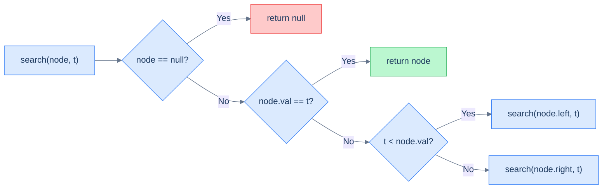
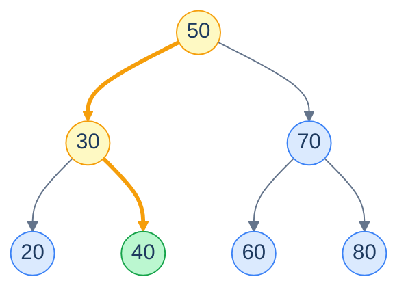
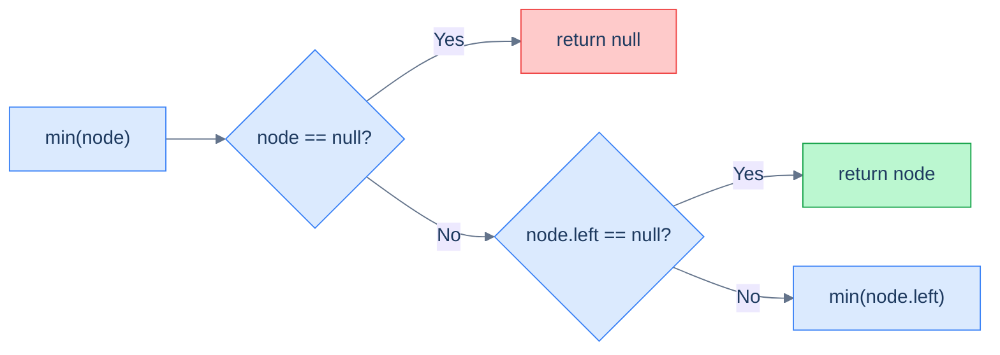
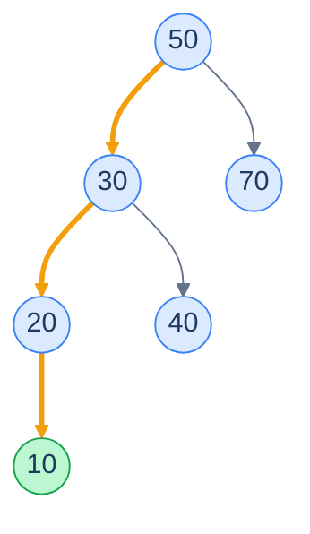
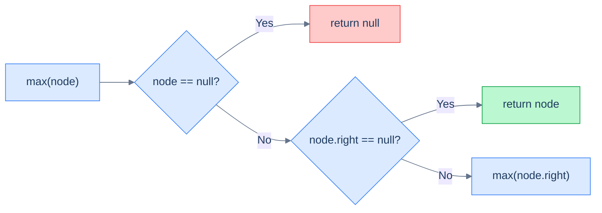
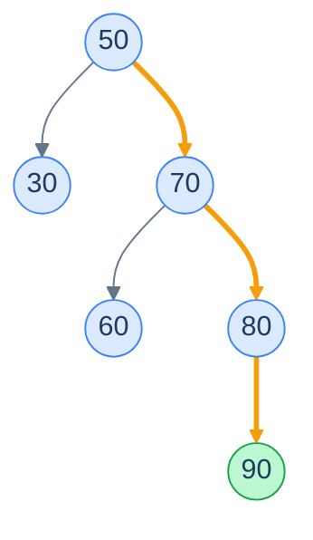
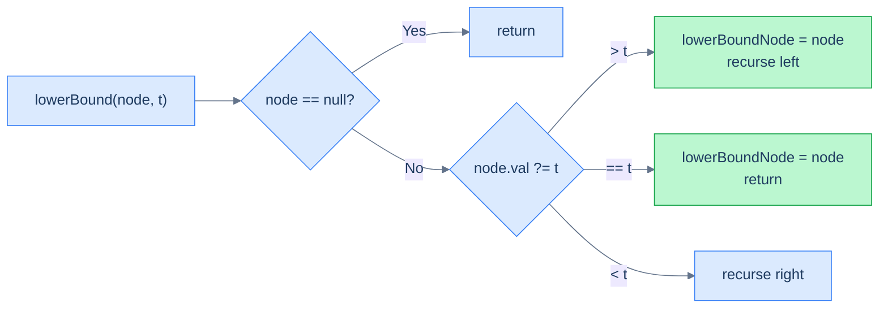
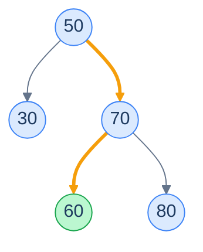
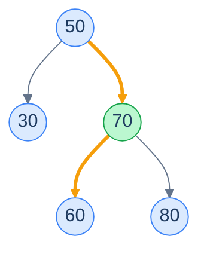
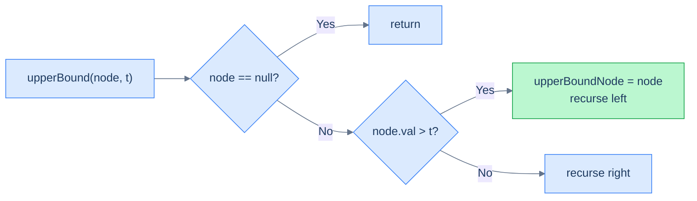

# 3. Recursive Searching in Binary Search Trees

## The Hook

Search a generic binary tree of a million nodes for one value, and you might be looking at *every* node — there's no rule telling you where the value lives, so you must check everywhere. A million comparisons. A million pointer follows. Linear scan, no shortcut.

Search the *same* million values arranged as a balanced BST and you do roughly **twenty** comparisons. Twenty. The trick? At every step, the BST property tells you *exactly which half of the remaining tree to throw away*. Each comparison kills half the work. That's binary search — turned into a tree.

This lesson uses recursion to make the idea click. Five problems, all variants of the same descent: **search** for an exact value, find the **minimum**, find the **maximum**, find the **lower bound** (≥ target), find the **upper bound** (> target). Each is the same one-decision-per-node walk; only the rule for "which side, and when do I stop" changes.

---

## Table of Contents

1. [Understanding recursive search](#understanding-recursive-search)
2. [Recursive search](#recursive-search)
3. [Understanding recursive minimum search](#understanding-recursive-minimum-search)
4. [Recursively find minimum](#recursively-find-minimum)
5. [Understanding recursive maximum search](#understanding-recursive-maximum-search)
6. [Recursively find maximum](#recursively-find-maximum)
7. [Understanding recursive lower bound search](#understanding-recursive-lower-bound-search)
8. [Recursively find lower bound](#recursively-find-lower-bound)
9. [Understanding recursive upper bound search](#understanding-recursive-upper-bound-search)
10. [Recursively find upper bound](#recursively-find-upper-bound)

***

# Understanding recursive search

You *could* search a BST by walking the entire tree like any binary tree — but that ignores the one rule that makes a BST special:

> - All nodes in a node's `left` subtree are **less in value** than the node's value.
> - All nodes in a node's `right` subtree are **greater in value** than the node's value.

That rule is a giant *sign post*. If you're at a node holding `50` and you want `73`, you don't even need to look at the left subtree — every value there is `< 50 < 73`, so the answer can't be on the left. Throw it away. **The rule turns a search into a guided descent.**

## Algorithm

At each step:

- If the current node is empty, the value isn't in the tree.
- If the current node holds the target, you're done.
- If the target is less than the current node's value, the target — if it exists — must be in the left subtree.
- If the target is greater than the current node's value, it must be in the right subtree.

That's the recursive equation. Pin it visually first.



<p align="center"><strong>The recursive equation for searching a BST: at every node, do one comparison and either stop or recurse into exactly one subtree.</strong></p>

The crucial property is that we recurse into **only one** of the subtrees at every step — never both. A normal binary-tree search has to fall back to checking both sides, paying O(n). The BST rule turns that branching factor of 2 into a branching factor of *1*, so we walk a single root-to-leaf path.

## A worked example

Take the tree below and search for `40`.



<p align="center"><strong>Searching for <code>40</code> in a BST. Step 1: at <code>50</code>, target <code>40 &lt; 50</code> → go left. Step 2: at <code>30</code>, target <code>40 &gt; 30</code> → go right. Step 3: at <code>40</code>, match — return.</strong></p>

> **Algorithm**
>
> - **Step 1:** If the `current` node is `null`, return it (base case).
> - **Step 2:** If the `current` node's value equals the `target`, return it.
> - **Step 3:** Else, if the `current` node's value exceeds the `target`, recursively call the search operation on the `left` subtree.
> - **Step 4:** Else, if the `current` node's value is less than the `target`, recursively call the search operation on the `right` subtree.

## What happens if the node is *not* found?

The recursion keeps descending — left, right, left, right, guided by the comparisons — until it walks off a leaf into a `null` child. That's the base case: return `null`. The path it followed was the *attempted slot* for the target. The last leaf node touched is either the largest value smaller than the target, or the smallest value larger than the target. We'll exploit this fact in the lower-bound and upper-bound problems later.

## Complexity

Search descends one root-to-leaf path. The path length is bounded by the **height** of the tree. So:

- **Time:** O(h) — and h = O(log n) on a balanced tree, h = O(n) on a skewed one.
- **Space:** O(h) for the recursion call stack.

| Case | Time | Space |
|---|---|---|
| Best (balanced) | O(log n) | O(log n) |
| Worst (skewed) | O(n) | O(n) |

Now do this on a million-node balanced BST: ~20 comparisons. On a million-node skew BST: a million comparisons. **Same algorithm. The shape of the tree is what decides whether you're getting binary-search performance or a linear scan in disguise.**

***

# Recursive search

## Problem Statement

Given the **root** of a binary search tree and a **target** value, write a function to return the node with the given value. If there is no such node return `null`.

You must do this **recursively**.

### Example 1

> - **Input:** `root = [4, 2, 5, 1, 3, null, 6]`, `target = 3`
> - **Output:** `3`
> - **Explanation:** The given binary search tree has a node with the value 3.

### Example 2

> - **Input:** `root = [5, 4, 10, null, null, 9, 11]`, `target = 20`
> - **Output:** `null`
> - **Explanation:** The given binary search tree has no node with the value 20.

<details>
<summary><h2>The Solution</h2></summary>


```python run
from typing import Optional


class TreeNode:
    def __init__(self, val=0, left=None, right=None):
        self.val = val
        self.left = left
        self.right = right


def from_level_order(values):
    """Build tree from list like [1, 2, 3, None, 4]. None means missing child."""
    if not values:
        return None
    root = TreeNode(values[0])
    queue = [root]
    i = 1
    while queue and i < len(values):
        node = queue.pop(0)
        if i < len(values) and values[i] is not None:
            node.left = TreeNode(values[i])
            queue.append(node.left)
        i += 1
        if i < len(values) and values[i] is not None:
            node.right = TreeNode(values[i])
            queue.append(node.right)
        i += 1
    return root


class Solution:
    def recursive_search(
        self, root: Optional[TreeNode], target: int
    ) -> Optional[TreeNode]:

        # If the root is null, the tree is empty, and we can't find
        # the target
        if root is None:
            return None

        # If the root's value matches the target we are looking for,
        # we found the node
        if root.val == target:
            return root

        # If the target is less than the current root's value, search in
        # the left subtree
        if target < root.val:
            return self.recursive_search(root.left, target)

        # If the target is greater than the current root's value, search
        # in the right subtree
        return self.recursive_search(root.right, target)


# Examples from the problem statement
t1 = from_level_order([4, 2, 5, 1, 3, None, 6])
r1 = Solution().recursive_search(t1, 3)
print(r1.val if r1 else None)                      # 3

t2 = from_level_order([5, 4, 10, None, None, 9, 11])
r2 = Solution().recursive_search(t2, 20)
print(r2.val if r2 else None)                      # None

# Edge cases
print(Solution().recursive_search(None, 5))        # None  — empty tree

t4 = TreeNode(5)                                   # single node, found
r4 = Solution().recursive_search(t4, 5)
print(r4.val if r4 else None)                      # 5

r5 = Solution().recursive_search(t4, 10)           # single node, not found
print(r5.val if r5 else None)                      # None

t6 = from_level_order([4, 2, 5, 1, 3, None, 6])
r6 = Solution().recursive_search(t6, 1)            # leftmost node
print(r6.val if r6 else None)                      # 1

t7 = from_level_order([4, 2, 5, 1, 3, None, 6])
r7 = Solution().recursive_search(t7, 6)            # rightmost node
print(r7.val if r7 else None)                      # 6
```

```java run
import java.util.*;

public class Main {
    static class TreeNode {
        int val;
        TreeNode left;
        TreeNode right;
        TreeNode() {}
        TreeNode(int val) { this.val = val; }
    }

    static TreeNode fromLevelOrder(Integer... values) {
        if (values.length == 0 || values[0] == null) return null;
        TreeNode root = new TreeNode(values[0]);
        Deque<TreeNode> queue = new ArrayDeque<>();
        queue.add(root);
        int i = 1;
        while (!queue.isEmpty() && i < values.length) {
            TreeNode node = queue.poll();
            if (i < values.length && values[i] != null) {
                node.left = new TreeNode(values[i]);
                queue.add(node.left);
            }
            i++;
            if (i < values.length && values[i] != null) {
                node.right = new TreeNode(values[i]);
                queue.add(node.right);
            }
            i++;
        }
        return root;
    }

    static class Solution {
        public TreeNode recursiveSearch(TreeNode root, int target) {

            // If the root is null, the tree is empty, and we can't find
            // the target
            if (root == null) {
                return null;
            }

            // If the root's value matches the target we are looking for,
            // we found the node
            if (root.val == target) {
                return root;
            }

            // If the target is less than the current root's value, search in
            // the left subtree
            else if (target < root.val) {
                return recursiveSearch(root.left, target);
            }

            // If the target is greater than the current root's value, search
            // in the right subtree
            else {
                return recursiveSearch(root.right, target);
            }
        }
    }

    static String val(TreeNode n) { return n == null ? "null" : String.valueOf(n.val); }

    public static void main(String[] args) {
        // Examples from the problem statement
        TreeNode t1 = fromLevelOrder(4, 2, 5, 1, 3, null, 6);
        System.out.println(val(new Solution().recursiveSearch(t1, 3)));    // 3

        TreeNode t2 = fromLevelOrder(5, 4, 10, null, null, 9, 11);
        System.out.println(val(new Solution().recursiveSearch(t2, 20)));   // null

        // Edge cases
        System.out.println(val(new Solution().recursiveSearch(null, 5)));  // null — empty tree

        TreeNode t4 = new TreeNode(5);                                     // single node, found
        System.out.println(val(new Solution().recursiveSearch(t4, 5)));    // 5

        System.out.println(val(new Solution().recursiveSearch(t4, 10)));   // null — single node, not found

        TreeNode t6 = fromLevelOrder(4, 2, 5, 1, 3, null, 6);
        System.out.println(val(new Solution().recursiveSearch(t6, 1)));    // 1  — leftmost node

        System.out.println(val(new Solution().recursiveSearch(t6, 6)));    // 6  — rightmost node
    }
}
```


<details>
<summary><strong>Trace — root = [50, 30, 70, 20, 40, 60, 80], target = 40</strong></summary>

```
Step 1 │ at 50 │ 40 < 50 → recurse on left subtree
Step 2 │ at 30 │ 40 > 30 → recurse on right subtree
Step 3 │ at 40 │ 40 == 40 → MATCH → return node 40
Result: node 40 ✓ (3 comparisons in a 7-node tree)
```

</details>

</details>

***

# Understanding recursive minimum search

The minimum value in a BST is the value you reach by walking *as far left as you can*. Why? Because everything to the left of any node is smaller. Cross enough of those "left" decisions and you converge on the smallest value the tree contains — the **leftmost** node.

## Algorithm



<p align="center"><strong>Recursive equation for the minimum: keep stepping into the left child; the moment there is no left child, you've found the smallest value.</strong></p>



<p align="center"><strong>Walking left repeatedly: <code>50 → 30 → 20 → 10</code>. <code>10</code> has no left child, so it is the minimum.</strong></p>

> **Algorithm**
>
> - **Step 1:** If the `current` node is `null`, return it (base case).
> - **Step 2:** If the `current` node does not have a `left` subtree, return the node.
> - **Step 3:** Else, recursively call the search operation on the `left` subtree.

## Complexity

Like search, this descends one root-to-leaf path — specifically the *leftmost* path. Path length is bounded by the height.

| Case | Time | Space |
|---|---|---|
| Best (right-skew, left child of root absent) | O(1) | O(1) |
| Average (balanced) | O(log n) | O(log n) |
| Worst (left-skew) | O(n) | O(n) |

Recursion stack mirrors the path length.

***

# Recursively find minimum

## Problem Statement

Given the **root** of a binary search tree, write a function to return the node with the minimum value in it.

You must do this **recursively**.

### Example 1

> - **Input:** `root = [4, 2, 5, 1, 3, null, 6]`
> - **Output:** `1`

### Example 2

> - **Input:** `root = [5, 4, 10, null, null, 9, 11]`
> - **Output:** `4`

<details>
<summary><h2>The Solution</h2></summary>


```python run
from typing import Optional


class TreeNode:
    def __init__(self, val=0, left=None, right=None):
        self.val = val
        self.left = left
        self.right = right


def from_level_order(values):
    """Build tree from list like [1, 2, 3, None, 4]. None means missing child."""
    if not values:
        return None
    root = TreeNode(values[0])
    queue = [root]
    i = 1
    while queue and i < len(values):
        node = queue.pop(0)
        if i < len(values) and values[i] is not None:
            node.left = TreeNode(values[i])
            queue.append(node.left)
        i += 1
        if i < len(values) and values[i] is not None:
            node.right = TreeNode(values[i])
            queue.append(node.right)
        i += 1
    return root


class Solution:
    def recursively_find_minimum(
        self, root: Optional[TreeNode]
    ) -> Optional[TreeNode]:

        # Base case: If the root is null (empty tree or leaf node)
        # return None
        if root is None:
            return None

        # If the left child of the current node is null, then this node
        # is the minimum value node. Return the current node, which is
        # the minimum value node
        if root.left is None:
            return root

        # If the left child is not None, recursively traverse to the
        # left subtree as the minimum value node will be in the left
        # subtree
        return self.recursively_find_minimum(root.left)


# Examples from the problem statement
t1 = from_level_order([4, 2, 5, 1, 3, None, 6])
r1 = Solution().recursively_find_minimum(t1)
print(r1.val if r1 else None)                      # 1

t2 = from_level_order([5, 4, 10, None, None, 9, 11])
r2 = Solution().recursively_find_minimum(t2)
print(r2.val if r2 else None)                      # 4

# Edge cases
print(Solution().recursively_find_minimum(None))   # None  — empty tree

t4 = TreeNode(7)                                   # single node
r4 = Solution().recursively_find_minimum(t4)
print(r4.val if r4 else None)                      # 7

t5 = from_level_order([5, 4, 6, 3, None, None, 7])  # min is deeper left
r5 = Solution().recursively_find_minimum(t5)
print(r5.val if r5 else None)                      # 3

t6 = from_level_order([1, None, 2, None, None, None, 3])  # right-skewed
r6 = Solution().recursively_find_minimum(t6)
print(r6.val if r6 else None)                      # 1  — root is minimum

t7 = from_level_order([5, 3, 7, 1, 4, 6, 9])      # balanced BST
r7 = Solution().recursively_find_minimum(t7)
print(r7.val if r7 else None)                      # 1
```

```java run
import java.util.*;

public class Main {
    static class TreeNode {
        int val;
        TreeNode left;
        TreeNode right;
        TreeNode() {}
        TreeNode(int val) { this.val = val; }
    }

    static TreeNode fromLevelOrder(Integer... values) {
        if (values.length == 0 || values[0] == null) return null;
        TreeNode root = new TreeNode(values[0]);
        Deque<TreeNode> queue = new ArrayDeque<>();
        queue.add(root);
        int i = 1;
        while (!queue.isEmpty() && i < values.length) {
            TreeNode node = queue.poll();
            if (i < values.length && values[i] != null) {
                node.left = new TreeNode(values[i]);
                queue.add(node.left);
            }
            i++;
            if (i < values.length && values[i] != null) {
                node.right = new TreeNode(values[i]);
                queue.add(node.right);
            }
            i++;
        }
        return root;
    }

    static class Solution {
        public TreeNode recursivelyFindMinimum(TreeNode root) {

            // Base case: If the root is null (empty tree or leaf node)
            // return null
            if (root == null) {
                return null;
            }

            // If the left child of the current node is null, then this node
            // is the minimum value node. Return the current node, which is
            // the minimum value node
            if (root.left == null) {
                return root;
            }

            // If the left child is not null, recursively traverse to the
            // left subtree as the minimum value node will be in the left
            // subtree
            else {
                return recursivelyFindMinimum(root.left);
            }
        }
    }

    static String val(TreeNode n) { return n == null ? "null" : String.valueOf(n.val); }

    public static void main(String[] args) {
        // Examples from the problem statement
        TreeNode t1 = fromLevelOrder(4, 2, 5, 1, 3, null, 6);
        System.out.println(val(new Solution().recursivelyFindMinimum(t1)));    // 1

        TreeNode t2 = fromLevelOrder(5, 4, 10, null, null, 9, 11);
        System.out.println(val(new Solution().recursivelyFindMinimum(t2)));    // 4

        // Edge cases
        System.out.println(val(new Solution().recursivelyFindMinimum(null)));  // null — empty tree

        TreeNode t4 = new TreeNode(7);                                         // single node
        System.out.println(val(new Solution().recursivelyFindMinimum(t4)));    // 7

        TreeNode t5 = fromLevelOrder(5, 4, 6, 3, null, null, 7);              // min is deeper left
        System.out.println(val(new Solution().recursivelyFindMinimum(t5)));    // 3

        TreeNode t6 = new TreeNode(1);                                         // right-skewed
        t6.right = new TreeNode(2); t6.right.right = new TreeNode(3);
        System.out.println(val(new Solution().recursivelyFindMinimum(t6)));    // 1  — root is minimum

        TreeNode t7 = fromLevelOrder(5, 3, 7, 1, 4, 6, 9);                   // balanced BST
        System.out.println(val(new Solution().recursivelyFindMinimum(t7)));    // 1
    }
}
```

</details>


***

# Understanding recursive maximum search

By symmetry: the **maximum** is the value you reach by walking *as far right as you can*. Everything to the right of any node is larger; chase the rightmost path and you converge on the largest value in the tree.

## Algorithm



<p align="center"><strong>Recursive equation for the maximum: keep stepping into the right child; the moment there is no right child, you've found the largest value.</strong></p>



<p align="center"><strong>Walking right repeatedly: <code>50 → 70 → 80 → 90</code>. <code>90</code> has no right child, so it is the maximum.</strong></p>

> **Algorithm**
>
> - **Step 1:** If the `current` node is `null`, return it (base case).
> - **Step 2:** If the `current` node does not have a `right` subtree, return the node.
> - **Step 3:** Else, recursively call the search operation on the `right` subtree.

## Complexity

| Case | Time | Space |
|---|---|---|
| Best (left-skew, right child of root absent) | O(1) | O(1) |
| Average (balanced) | O(log n) | O(log n) |
| Worst (right-skew) | O(n) | O(n) |

***

# Recursively find maximum

## Problem Statement

Given the **root** of a binary search tree, write a function to return the maximum value in it.

You must do this **recursively**.

### Example 1

> - **Input:** `root = [4, 2, 5, 1, 3, null, 6]`
> - **Output:** `6`

### Example 2

> - **Input:** `root = [5, 4, 10, null, null, 9, 11]`
> - **Output:** `11`

<details>
<summary><h2>The Solution</h2></summary>


```python run
from typing import Optional


class TreeNode:
    def __init__(self, val=0, left=None, right=None):
        self.val = val
        self.left = left
        self.right = right


def from_level_order(values):
    """Build tree from list like [1, 2, 3, None, 4]. None means missing child."""
    if not values:
        return None
    root = TreeNode(values[0])
    queue = [root]
    i = 1
    while queue and i < len(values):
        node = queue.pop(0)
        if i < len(values) and values[i] is not None:
            node.left = TreeNode(values[i])
            queue.append(node.left)
        i += 1
        if i < len(values) and values[i] is not None:
            node.right = TreeNode(values[i])
            queue.append(node.right)
        i += 1
    return root


class Solution:
    def recursively_find_maximum(
        self, root: Optional[TreeNode]
    ) -> Optional[TreeNode]:

        # Base case: If the root is null (empty tree or leaf node)
        # return None.
        if root is None:
            return None

        # If the right child of the current node is null, then this node
        # is the maximum value node. Return the current node, which is
        # the maximum value node.
        if root.right is None:
            return root

        # If the right child is not None, recursively traverse to the
        # right subtree as the maximum value node will be in the right
        # subtree.
        return self.recursively_find_maximum(root.right)


# Examples from the problem statement
t1 = from_level_order([4, 2, 5, 1, 3, None, 6])
r1 = Solution().recursively_find_maximum(t1)
print(r1.val if r1 else None)                      # 6

t2 = from_level_order([5, 4, 10, None, None, 9, 11])
r2 = Solution().recursively_find_maximum(t2)
print(r2.val if r2 else None)                      # 11

# Edge cases
print(Solution().recursively_find_maximum(None))   # None  — empty tree

t4 = TreeNode(7)                                   # single node
r4 = Solution().recursively_find_maximum(t4)
print(r4.val if r4 else None)                      # 7

t5 = from_level_order([5, 4, None, 3])            # left-skewed
r5 = Solution().recursively_find_maximum(t5)
print(r5.val if r5 else None)                      # 5  — root is maximum

t6 = from_level_order([1, None, 2, None, None, None, 3])  # right-skewed
r6 = Solution().recursively_find_maximum(t6)
print(r6.val if r6 else None)                      # 2

t7 = from_level_order([5, 3, 7, 1, 4, 6, 9])      # balanced BST
r7 = Solution().recursively_find_maximum(t7)
print(r7.val if r7 else None)                      # 9
```

```java run
import java.util.*;

public class Main {
    static class TreeNode {
        int val;
        TreeNode left;
        TreeNode right;
        TreeNode() {}
        TreeNode(int val) { this.val = val; }
    }

    static TreeNode fromLevelOrder(Integer... values) {
        if (values.length == 0 || values[0] == null) return null;
        TreeNode root = new TreeNode(values[0]);
        Deque<TreeNode> queue = new ArrayDeque<>();
        queue.add(root);
        int i = 1;
        while (!queue.isEmpty() && i < values.length) {
            TreeNode node = queue.poll();
            if (i < values.length && values[i] != null) {
                node.left = new TreeNode(values[i]);
                queue.add(node.left);
            }
            i++;
            if (i < values.length && values[i] != null) {
                node.right = new TreeNode(values[i]);
                queue.add(node.right);
            }
            i++;
        }
        return root;
    }

    static class Solution {
        public TreeNode recursivelyFindMaximum(TreeNode root) {

            // Base case: If the root is null (empty tree or leaf node)
            // return null.
            if (root == null) {
                return null;
            }

            // If the right child of the current node is null, then this node
            // is the maximum value node. Return the current node, which is
            // the maximum value node.
            if (root.right == null) {
                return root;
            }

            // If the right child is not null, recursively traverse to the
            // right subtree as the maximum value node will be in the right
            // subtree.
            else {
                return recursivelyFindMaximum(root.right);
            }
        }
    }

    static String val(TreeNode n) { return n == null ? "null" : String.valueOf(n.val); }

    public static void main(String[] args) {
        // Examples from the problem statement
        TreeNode t1 = fromLevelOrder(4, 2, 5, 1, 3, null, 6);
        System.out.println(val(new Solution().recursivelyFindMaximum(t1)));    // 6

        TreeNode t2 = fromLevelOrder(5, 4, 10, null, null, 9, 11);
        System.out.println(val(new Solution().recursivelyFindMaximum(t2)));    // 11

        // Edge cases
        System.out.println(val(new Solution().recursivelyFindMaximum(null)));  // null — empty tree

        TreeNode t4 = new TreeNode(7);                                         // single node
        System.out.println(val(new Solution().recursivelyFindMaximum(t4)));    // 7

        TreeNode t5 = fromLevelOrder(5, 4, null, 3);                          // left-skewed
        System.out.println(val(new Solution().recursivelyFindMaximum(t5)));    // 5  — root is maximum

        TreeNode t6 = new TreeNode(1);                                         // right-skewed
        t6.right = new TreeNode(2); t6.right.right = new TreeNode(3);
        System.out.println(val(new Solution().recursivelyFindMaximum(t6)));    // 3

        TreeNode t7 = fromLevelOrder(5, 3, 7, 1, 4, 6, 9);                   // balanced BST
        System.out.println(val(new Solution().recursivelyFindMaximum(t7)));    // 9
    }
}
```

</details>


***

# Understanding recursive lower bound search

The **lower bound** of a target `t` is the smallest value in the tree that is **greater than or equal to** `t`. (This is exactly what `std::lower_bound` and `Collections.ceiling` do.)

The catch is that the target itself may not exist in the tree. So we cannot just search for `t` and return what we find. We have to *track the best candidate we've seen so far* as we descend, then return that candidate when the descent ends.

## Algorithm

> *Friction prompt — predict before reading on. Imagine you are at a node holding `60`, your target is `54`. Do you go left or right? And — once you make that move — should you remember `60` for later? Why?*

You go **left** (since `54 < 60`), and yes, you should remember `60`: it's the smallest value `≥ 54` you've seen so far. If the entire left subtree turns out to hold no value `≥ 54`, then `60` is the answer.

This gives the rule: **whenever the current node's value is `≥ target`, it is a candidate** — record it, then look left for something even smaller-but-still-`≥ target`. When the value is `< target`, no candidate; go right.



<p align="center"><strong>Recursive equation for the lower bound. Update the candidate whenever the current value is ≥ target.</strong></p>

### Case 1 — the value is present

If the target exists in the tree, search reaches it and *the target is the lower bound* (since `target ≥ target`). We update the candidate and stop.

### Case 2 — the value is not present

The descent walks off a leaf into a `null`. The candidate now holds the *closest value ≥ target* the descent encountered. Two sub-cases worth seeing:

#### 2.1 Lower bound is a leaf



<p align="center"><strong>Searching for the lower bound of <code>54</code>. At <code>50</code>: 50 &lt; 54 → go right. At <code>70</code>: 70 ≥ 54 → record candidate, go left. At <code>60</code>: 60 ≥ 54 → record candidate, go left. <code>60.left</code> is null → stop. Lower bound = <code>60</code>.</strong></p>

#### 2.2 Lower bound is an internal node



<p align="center"><strong>Searching for the lower bound of <code>63</code>. At <code>50</code>: go right (50 &lt; 63). At <code>70</code>: 70 ≥ 63 → record candidate, go left. At <code>60</code>: 60 &lt; 63 → go right. <code>60.right</code> is null → stop. Lower bound = <code>70</code>.</strong></p>

> **Algorithm**
>
> - **Step 1:** If the `current` node is `null`, return (base case).
> - **Step 2:** If the `current` node's value exceeds the `target`, update the `lowerBoundNode` and recurse left.
> - **Step 3:** Else, if the `current` node's value equals the `target`, update the `lowerBoundNode` and return.
> - **Step 4:** Else, recurse right.

## Complexity

Same as plain search — one root-to-leaf path. O(log n) on a balanced tree; O(n) worst-case skewed.

***

# Recursively find lower bound

## Problem Statement

Given the **root** of a binary search tree and a **target**, return the node that is the lower bound for the target. Return `null` if no such node exists. You must do this **recursively**.

> Lower bound returns the first element **≥** target.

### Example 1

> - **Input:** `root = [4, 2, 5, 1, 3, null, 6]`, `target = 3`
> - **Output:** `3`

### Example 2

> - **Input:** `root = [5, 4, 10, null, null, 9, 11]`, `target = 7`
> - **Output:** `9`

<details>
<summary><h2>The Solution</h2></summary>


```python run
from typing import Optional


class TreeNode:
    def __init__(self, val=0, left=None, right=None):
        self.val = val
        self.left = left
        self.right = right


def from_level_order(values):
    """Build tree from list like [1, 2, 3, None, 4]. None means missing child."""
    if not values:
        return None
    root = TreeNode(values[0])
    queue = [root]
    i = 1
    while queue and i < len(values):
        node = queue.pop(0)
        if i < len(values) and values[i] is not None:
            node.left = TreeNode(values[i])
            queue.append(node.left)
        i += 1
        if i < len(values) and values[i] is not None:
            node.right = TreeNode(values[i])
            queue.append(node.right)
        i += 1
    return root


class Solution:

    # Global variable to store the lower bound node found during the
    # traversal
    lowerBoundNode: Optional[TreeNode] = None

    def helper(self, root: Optional[TreeNode], target: int) -> None:

        # Base case: If the current node is null, return
        if root is None:
            return

        # If the target is less than the value in the current node,
        # update the lower bound node to the current node and
        # continue searching in the left subtree
        if target < root.val:
            self.lowerBoundNode = root
            self.helper(root.left, target)

        # If the target is equal to the value in the current node,
        # update the lower bound node to the current node and return,
        # as there is no need to search further in this case.
        elif root.val == target:
            self.lowerBoundNode = root
            return

        # If the target is greater than the value in the current node,
        # continue searching in the right subtree
        else:
            self.helper(root.right, target)

    def recursively_find_lower_bound(
        self, root: Optional[TreeNode], target: int
    ) -> Optional[TreeNode]:

        # Initialize the lower bound node to null
        self.lowerBoundNode = None

        # Find the lower bound node in the binary search tree
        self.helper(root, target)

        # Return the lower bound node found during the search
        return self.lowerBoundNode


# Examples from the problem statement
t1 = from_level_order([4, 2, 5, 1, 3, None, 6])
r1 = Solution().recursively_find_lower_bound(t1, 3)
print(r1.val if r1 else None)                      # 3

t2 = from_level_order([5, 4, 10, None, None, 9, 11])
r2 = Solution().recursively_find_lower_bound(t2, 7)
print(r2.val if r2 else None)                      # 9

# Edge cases
print(Solution().recursively_find_lower_bound(None, 5))  # None — empty tree

t4 = TreeNode(5)
r4 = Solution().recursively_find_lower_bound(t4, 5)  # exact match on single node
print(r4.val if r4 else None)                      # 5

t5 = from_level_order([4, 2, 5, 1, 3, None, 6])
r5 = Solution().recursively_find_lower_bound(t5, 7)  # target > all values
print(r5.val if r5 else None)                      # None

t6 = from_level_order([4, 2, 5, 1, 3, None, 6])
r6 = Solution().recursively_find_lower_bound(t6, 0)  # target < all values
print(r6.val if r6 else None)                      # 1

t7 = from_level_order([4, 2, 5, 1, 3, None, 6])
r7 = Solution().recursively_find_lower_bound(t7, 4)  # exact match on root
print(r7.val if r7 else None)                      # 4
```

```java run
import java.util.*;

public class Main {
    static class TreeNode {
        int val;
        TreeNode left;
        TreeNode right;
        TreeNode() {}
        TreeNode(int val) { this.val = val; }
    }

    static TreeNode fromLevelOrder(Integer... values) {
        if (values.length == 0 || values[0] == null) return null;
        TreeNode root = new TreeNode(values[0]);
        Deque<TreeNode> queue = new ArrayDeque<>();
        queue.add(root);
        int i = 1;
        while (!queue.isEmpty() && i < values.length) {
            TreeNode node = queue.poll();
            if (i < values.length && values[i] != null) {
                node.left = new TreeNode(values[i]);
                queue.add(node.left);
            }
            i++;
            if (i < values.length && values[i] != null) {
                node.right = new TreeNode(values[i]);
                queue.add(node.right);
            }
            i++;
        }
        return root;
    }

    static class Solution {

        // Global variable to store the lower bound node found during the
        // traversal
        private TreeNode lowerBoundNode = null;

        private void helper(TreeNode root, int target) {

            // Base case: If the current node is null, return
            if (root == null) {
                return;
            }

            // If the target is less than the value in the current node,
            // update the lower bound node to the current node and
            // continue searching in the left subtree
            if (target < root.val) {
                lowerBoundNode = root;
                helper(root.left, target);
            }

            // If the target is equal to the value in the current node,
            // update the lower bound node to the current node and return,
            // as there is no need to search further in this case.
            else if (root.val == target) {
                lowerBoundNode = root;
                return;
            }

            // If the target is greater than the value in the current node,
            // continue searching in the right subtree
            else {
                helper(root.right, target);
            }
        }

        public TreeNode recursivelyFindLowerBound(TreeNode root, int target) {

            // Initialize the lower bound node to null
            lowerBoundNode = null;

            // Find the lower bound node in the binary search tree
            helper(root, target);

            // Return the lower bound node found during the search
            return lowerBoundNode;
        }
    }

    static String val(TreeNode n) { return n == null ? "null" : String.valueOf(n.val); }

    public static void main(String[] args) {
        // Examples from the problem statement
        TreeNode t1 = fromLevelOrder(4, 2, 5, 1, 3, null, 6);
        System.out.println(val(new Solution().recursivelyFindLowerBound(t1, 3)));    // 3

        TreeNode t2 = fromLevelOrder(5, 4, 10, null, null, 9, 11);
        System.out.println(val(new Solution().recursivelyFindLowerBound(t2, 7)));    // 9

        // Edge cases
        System.out.println(val(new Solution().recursivelyFindLowerBound(null, 5)));  // null — empty tree

        TreeNode t4 = new TreeNode(5);
        System.out.println(val(new Solution().recursivelyFindLowerBound(t4, 5)));    // 5  — exact match

        TreeNode t5 = fromLevelOrder(4, 2, 5, 1, 3, null, 6);
        System.out.println(val(new Solution().recursivelyFindLowerBound(t5, 7)));    // null — target > all

        TreeNode t6 = fromLevelOrder(4, 2, 5, 1, 3, null, 6);
        System.out.println(val(new Solution().recursivelyFindLowerBound(t6, 0)));    // 1  — target < all

        TreeNode t7 = fromLevelOrder(4, 2, 5, 1, 3, null, 6);
        System.out.println(val(new Solution().recursivelyFindLowerBound(t7, 4)));    // 4  — exact match on root
    }
}
```


<details>
<summary><strong>Trace — root = [50, 30, 70, null, null, 60, 80], target = 54</strong></summary>

```
candidate = null
Step 1 │ at 50 │ 50 < 54  → go right
Step 2 │ at 70 │ 70 ≥ 54  → candidate = 70 → go left
Step 3 │ at 60 │ 60 ≥ 54  → candidate = 60 → go left
Step 4 │ 60.left == null  → stop
Result: candidate = 60 ✓
```

</details>

</details>

***

# Understanding recursive upper bound search

The **upper bound** of a target `t` is the smallest value in the tree **strictly greater than** `t`. It is the lower bound's slightly stricter cousin: equality does *not* count.

The only change from the lower-bound algorithm is the equality case: when `current.val == target`, we treat it as "less than" (skip it, go right), not "candidate found".

## Algorithm



<p align="center"><strong>Upper-bound recursive equation. The strict inequality <code>node.val &gt; t</code> means we go right whenever node.val ≤ t — including the equality case.</strong></p>


<p align="center"><strong>Upper bound of <code>54</code>: at <code>50</code> go right (50 ≤ 54). At <code>70</code> record candidate (70 &gt; 54), go left. At <code>60</code> record candidate (60 &gt; 54), go left. <code>60.left == null</code> → stop. Upper bound = <code>60</code>.</strong></p>

> **Algorithm**
>
> - **Step 1:** If the `current` node is `null`, return (base case).
> - **Step 2:** If the `current` node's value exceeds the `target`, update the `upperBoundNode` and recurse left.
> - **Step 3:** Else, recurse right.

## Complexity

Same as lower bound — one root-to-leaf path: O(log n) balanced, O(n) worst-case skewed.

***

# Recursively find upper bound

## Problem Statement

Given the **root** of a binary search tree and a **target**, return the node that is the upper bound for the target. Return `null` if no such node exists. You must do this **recursively**.

> Upper bound returns the first element **>** target.

### Example 1

> - **Input:** `root = [4, 2, 5, 1, 3, null, 6]`, `target = 3`
> - **Output:** `4`

### Example 2

> - **Input:** `root = [5, 4, 10, null, null, 9, 11]`, `target = 7`
> - **Output:** `9`

<details>
<summary><h2>The Solution</h2></summary>


```python run
from typing import Optional


class TreeNode:
    def __init__(self, val=0, left=None, right=None):
        self.val = val
        self.left = left
        self.right = right


def from_level_order(values):
    """Build tree from list like [1, 2, 3, None, 4]. None means missing child."""
    if not values:
        return None
    root = TreeNode(values[0])
    queue = [root]
    i = 1
    while queue and i < len(values):
        node = queue.pop(0)
        if i < len(values) and values[i] is not None:
            node.left = TreeNode(values[i])
            queue.append(node.left)
        i += 1
        if i < len(values) and values[i] is not None:
            node.right = TreeNode(values[i])
            queue.append(node.right)
        i += 1
    return root


class Solution:

    # Global variable to store the upper bound node found during the
    # traversal
    upperBoundNode: Optional[TreeNode] = None

    def helper(self, root: Optional[TreeNode], target: int) -> None:

        # Base case: If the current node is null, return
        if root is None:
            return

        # If the target is less than the value in the current node,
        # update the upper bound node to the current node and
        # continue searching in the left subtree
        if target < root.val:
            self.upperBoundNode = root
            self.helper(root.left, target)

        # If the target is greater than or equal to the value in the
        # current node, continue searching in the right subtree
        else:
            self.helper(root.right, target)

    def recursively_find_upper_bound(
        self, root: Optional[TreeNode], target: int
    ) -> Optional[TreeNode]:

        # Initialize the upper bound node to null
        self.upperBoundNode = None

        # Find the upper bound in the binary search tree
        self.helper(root, target)

        # Return the upper bound node found during the search
        return self.upperBoundNode


# Examples from the problem statement
t1 = from_level_order([4, 2, 5, 1, 3, None, 6])
r1 = Solution().recursively_find_upper_bound(t1, 3)
print(r1.val if r1 else None)                      # 4

t2 = from_level_order([5, 4, 10, None, None, 9, 11])
r2 = Solution().recursively_find_upper_bound(t2, 7)
print(r2.val if r2 else None)                      # 9

# Edge cases
print(Solution().recursively_find_upper_bound(None, 5))  # None — empty tree

t4 = TreeNode(5)
r4 = Solution().recursively_find_upper_bound(t4, 5)  # exact match — no strict upper
print(r4.val if r4 else None)                      # None

t5 = from_level_order([4, 2, 5, 1, 3, None, 6])
r5 = Solution().recursively_find_upper_bound(t5, 6)  # target = max value
print(r5.val if r5 else None)                      # None

t6 = from_level_order([4, 2, 5, 1, 3, None, 6])
r6 = Solution().recursively_find_upper_bound(t6, 0)  # target < all values
print(r6.val if r6 else None)                      # 1

t7 = from_level_order([5, 4, 10, None, None, 9, 11])
r7 = Solution().recursively_find_upper_bound(t7, 4)  # target = left-child value
print(r7.val if r7 else None)                      # 5
```

```java run
import java.util.*;

public class Main {
    static class TreeNode {
        int val;
        TreeNode left;
        TreeNode right;
        TreeNode() {}
        TreeNode(int val) { this.val = val; }
    }

    static TreeNode fromLevelOrder(Integer... values) {
        if (values.length == 0 || values[0] == null) return null;
        TreeNode root = new TreeNode(values[0]);
        Deque<TreeNode> queue = new ArrayDeque<>();
        queue.add(root);
        int i = 1;
        while (!queue.isEmpty() && i < values.length) {
            TreeNode node = queue.poll();
            if (i < values.length && values[i] != null) {
                node.left = new TreeNode(values[i]);
                queue.add(node.left);
            }
            i++;
            if (i < values.length && values[i] != null) {
                node.right = new TreeNode(values[i]);
                queue.add(node.right);
            }
            i++;
        }
        return root;
    }

    static class Solution {

        // Global variable to store the upper bound node found during the
        // traversal
        private TreeNode upperBoundNode = null;

        private void helper(TreeNode root, int target) {

            // Base case: If the current node is null, return
            if (root == null) {
                return;
            }

            // If the target is less than the value in the current node,
            // update the upper bound node to the current node and
            // continue searching in the left subtree
            if (target < root.val) {
                upperBoundNode = root;
                helper(root.left, target);
            }

            // If the target is greater than or equal to the value in the
            // current node, continue searching in the right subtree
            else {
                helper(root.right, target);
            }
        }

        public TreeNode recursivelyFindUpperBound(TreeNode root, int target) {

            // Initialize the upper bound node to null
            upperBoundNode = null;

            // Find the upper bound in the binary search tree
            helper(root, target);

            // Return the upper bound node found during the search
            return upperBoundNode;
        }
    }

    static String val(TreeNode n) { return n == null ? "null" : String.valueOf(n.val); }

    public static void main(String[] args) {
        // Examples from the problem statement
        TreeNode t1 = fromLevelOrder(4, 2, 5, 1, 3, null, 6);
        System.out.println(val(new Solution().recursivelyFindUpperBound(t1, 3)));    // 4

        TreeNode t2 = fromLevelOrder(5, 4, 10, null, null, 9, 11);
        System.out.println(val(new Solution().recursivelyFindUpperBound(t2, 7)));    // 9

        // Edge cases
        System.out.println(val(new Solution().recursivelyFindUpperBound(null, 5)));  // null — empty tree

        TreeNode t4 = new TreeNode(5);
        System.out.println(val(new Solution().recursivelyFindUpperBound(t4, 5)));    // null — exact match, no strict upper

        TreeNode t5 = fromLevelOrder(4, 2, 5, 1, 3, null, 6);
        System.out.println(val(new Solution().recursivelyFindUpperBound(t5, 6)));    // null — target = max value

        TreeNode t6 = fromLevelOrder(4, 2, 5, 1, 3, null, 6);
        System.out.println(val(new Solution().recursivelyFindUpperBound(t6, 0)));    // 1  — target < all values

        TreeNode t7 = fromLevelOrder(5, 4, 10, null, null, 9, 11);
        System.out.println(val(new Solution().recursivelyFindUpperBound(t7, 4)));    // 5  — target = left-child value
    }
}
```


<details>
<summary><strong>Trace — root = [4, 2, 5, 1, 3, null, 6], target = 3</strong></summary>

```
candidate = null
Step 1 │ at 4 │ 3 < 4  → candidate = 4 → go left
Step 2 │ at 2 │ 3 ≥ 2  → go right
Step 3 │ at 3 │ 3 ≥ 3  → go right (equality is NOT enough for upper bound)
Step 4 │ 3.right == null → stop
Result: candidate = 4 ✓
```

</details>

</details>
<details>
<summary><h2>Final Takeaway</h2></summary>


Five problems, one shape: **at every node, do one comparison and recurse into exactly one subtree.** That's the lever the BST property gives you — turning the branching factor of a tree search from 2 into 1, and time complexity from O(n) into O(h). On a balanced BST, h = O(log n) — the fastest known structure for this many operations on dynamic data.

Three idioms that we'll reuse forever:

1. **Discard half the tree at every step** — the core trick, used by every BST operation.
2. **Track the best candidate seen during descent** — the key to lower/upper bounds, predecessors, successors, and floor/ceiling queries.
3. **Tail-recursive descent** — every algorithm in this lesson recurses only once per node, so it's a single chain of stack frames. Convert that chain to a loop and you get the *iterative* versions of these algorithms — the subject of the next lesson.

The next lesson rewrites every one of these five algorithms iteratively. The mental model stays the same — the implementation drops the recursion and uses constant extra space.

</details>