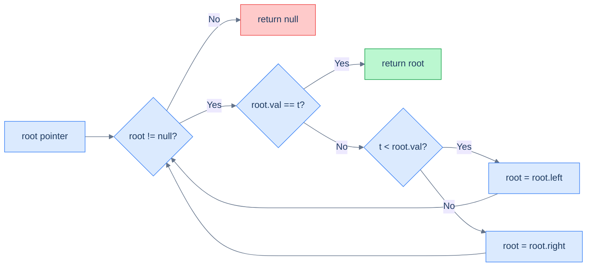
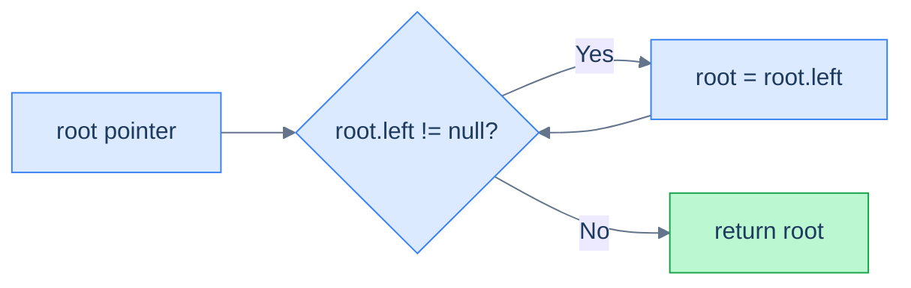
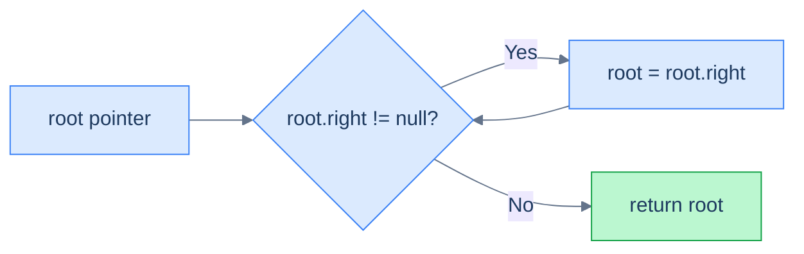
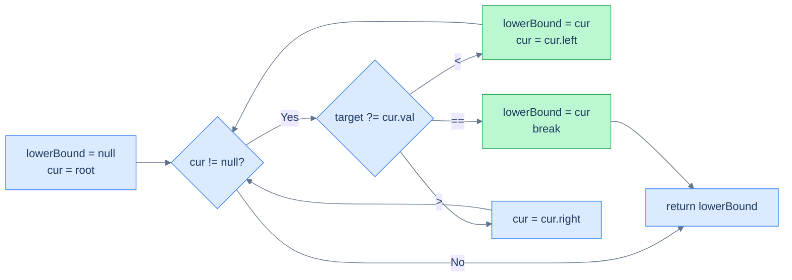
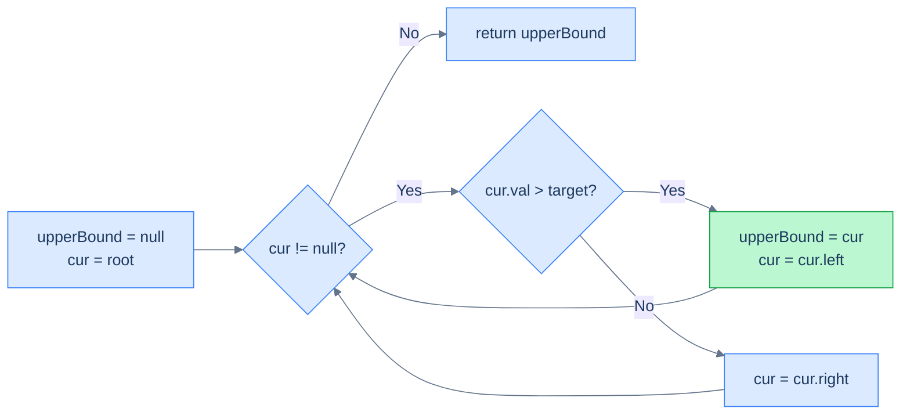
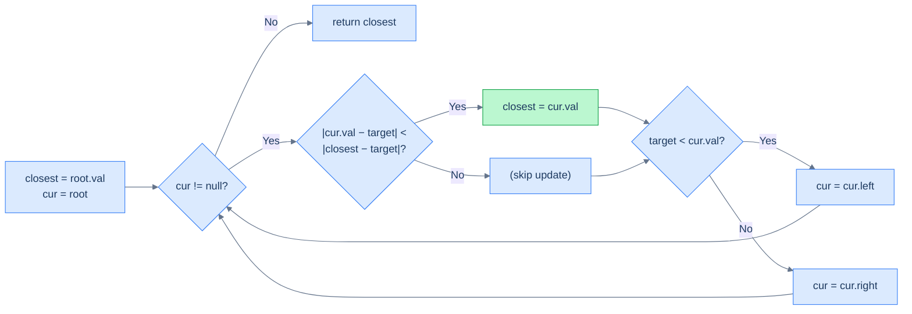

# 4. Iterative Searching in Binary Search Trees

## The Hook

The recursive search algorithms in the previous lesson have a beautiful structure — but every recursive call costs a stack frame, and on a deep tree, that bill adds up. A million-node skewed BST will produce a million stack frames before it can return, often hitting your runtime's stack-overflow ceiling.

There's a clean way out. Look back at every recursive function we wrote: each one ends with a single recursive call into *one* subtree, and nothing happens after that call returns. That's a **tail-recursive descent**, and tail recursion is just a loop in disguise. We can replace it with a `while` loop that *moves the pointer down* each iteration, getting **O(1) extra space** for free — no stack, no frames, no overflow.

This lesson rewrites every search from lesson 3 in iterative form: search, min, max, lower bound, upper bound. Same algorithm, same complexity, dramatically smaller memory footprint. We finish with one new problem — **closest value** — that's also a single descent, with one twist: at every step you keep the *best so far*, even if the search has to keep going.

---

## Table of Contents

1. [Understanding iterative search](#understanding-iterative-search)
2. [Iterative search](#iterative-search)
3. [Understanding iterative minimum search](#understanding-iterative-minimum-search)
4. [Iteratively find minimum](#iteratively-find-minimum)
5. [Understanding iterative maximum search](#understanding-iterative-maximum-search)
6. [Iteratively find maximum](#iteratively-find-maximum)
7. [Understanding iterative lower bound search](#understanding-iterative-lower-bound-search)
8. [Iteratively find lower bound](#iteratively-find-lower-bound)
9. [Understanding iterative upper bound search](#understanding-iterative-upper-bound-search)
10. [Iteratively find upper bound](#iteratively-find-upper-bound)
11. [Closest value](#closest-value)

***

# Understanding iterative search

The recursive search descended along a single root-to-leaf path. Iterative search does the *exact same descent* — except instead of letting the call stack track our position, we do it explicitly with a pointer variable.

## Why no explicit stack is needed

When you convert a recursive tree algorithm into an iterative one, the standard playbook says: replace the call stack with an *explicit* stack (`std::stack`, `Deque`, `ArrayDeque`, etc.). That's because most tree recursion has *two* recursive calls per node — one for each subtree — so the algorithm needs to remember "after I'm done with the left subtree, come back and do the right one too".

> *Friction prompt — predict before reading on. Why does BST search not need an explicit stack?*

Because BST search recurses into **only one** subtree per node. Once you decide which side to descend into, you never come back. There is nothing to remember. So the stack is empty — and we replace it with a single pointer.



<p align="center"><strong>Iterative BST search: a single pointer descends the tree, choosing left or right at every step. No stack, constant extra space.</strong></p>

## Algorithm

> **Algorithm**
>
> - **Step 1:** While `root` is not `null`:
>   - **Step 1.1:** If `root.val == target`, return `root`.
>   - **Step 1.2:** Else if `target < root.val`, move `root` to its left child.
>   - **Step 1.3:** Else move `root` to its right child.
> - **Step 2:** Return `null` (target not found).

## Complexity

| Case | Time | Space |
|---|---|---|
| Best (balanced) | O(log n) | **O(1)** |
| Worst (skewed) | O(n) | **O(1)** |

The space win over recursion is the whole point: the recursive version was O(h) on the stack; this version is O(1) on the heap and the stack combined.

***

# Iterative search

## Problem Statement

Given the **root** of a binary search tree and a **target** value, return the node with the given value, or `null` if no such node exists. You must do this **iteratively**.

### Example 1

> - **Input:** `root = [4, 2, 5, 1, 3, null, 6]`, `target = 3`
> - **Output:** `3`

### Example 2

> - **Input:** `root = [5, 4, 10, null, null, 9, 11]`, `target = 20`
> - **Output:** `null`

## The Solution


```pseudocode
function iterativeSearch(root, target):
    while root is NOT null:
        if root.val = target:
            return root
        if target < root.val:
            root ← root.left
        else:
            root ← root.right
    return null
```

```python run
class Solution:
    def iterative_search(self, root, target):
        # Walk down the tree until we either find the target or fall off.
        while root is not None:
            if root.val == target:
                return root                              # match — done
            if target < root.val:
                root = root.left                         # BST rule: target < node → go left
            else:
                root = root.right                        # otherwise go right
        return None                                       # walked off → not in tree
```

```java run
public class Main {
    static class TreeNode { int val; TreeNode left, right; TreeNode(int v){val=v;} }

    static class Solution {
        public TreeNode iterativeSearch(TreeNode root, int target) {
            while (root != null) {                                              // walk down
                if (root.val == target) return root;                            // match
                if (target < root.val) root = root.left;                        // BST rule: left
                else                   root = root.right;                       //          right
            }
            return null;                                                        // not found
        }
    }

    public static void main(String[] args) {
        TreeNode root = new TreeNode(4);
        root.left  = new TreeNode(2); root.right = new TreeNode(5);
        root.left.left  = new TreeNode(1); root.left.right = new TreeNode(3);
        root.right.right = new TreeNode(6);
        System.out.println(new Solution().iterativeSearch(root, 3).val);  // 3
    }
}
```

```c run
struct TreeNode *iterativeSearch(struct TreeNode *root, int target) {
    while (root != NULL) {                                                  // walk down
        if (root->val == target) return root;                               // match
        if (target < root->val) root = root->left;                          // BST rule: left
        else                    root = root->right;                         //          right
    }
    return NULL;                                                            // not found
}
```

```scala run
class TreeNode(var value: Int, var left: TreeNode = null, var right: TreeNode = null)

object Main extends App {
  class Solution {
    def iterativeSearch(root: TreeNode, target: Int): TreeNode = {
      var cur = root
      while (cur != null) {                                                   // walk down
        if (cur.value == target) return cur                                   // match
        cur = if (target < cur.value) cur.left else cur.right                 // BST rule
      }
      null                                                                     // not found
    }
  }

  val root = new TreeNode(4,
    new TreeNode(2, new TreeNode(1), new TreeNode(3)),
    new TreeNode(5, null, new TreeNode(6)))
  println(new Solution().iterativeSearch(root, 3).value)  // 3
}
```


<details>
<summary><strong>Trace — root = [50, 30, 70, 20, 40, 60, 80], target = 40</strong></summary>

```
Step 1 │ root = 50 │ 40 < 50  → root = root.left  (now 30)
Step 2 │ root = 30 │ 40 > 30  → root = root.right (now 40)
Step 3 │ root = 40 │ 40 == 40 → return root
Result: node 40 ✓ (3 hops, O(1) extra space)
```

</details>

***

# Understanding iterative minimum search

The minimum is the leftmost node. The recursive version chased `node.left` until it ran out; the iterative version does exactly the same with a `while` loop.

## Algorithm

> **Algorithm**
>
> - **Step 1:** If `root` is `null`, return `null`.
> - **Step 2:** While `root.left != null`, set `root = root.left`.
> - **Step 3:** Return `root`.



<p align="center"><strong>The iterative minimum walk: keep moving to the left child until there is none.</strong></p>

## Complexity

| Case | Time | Space |
|---|---|---|
| Best | O(1) | O(1) |
| Worst (left-skew) | O(n) | O(1) |

***

# Iteratively find minimum

## Problem Statement

Given the **root** of a binary search tree, return the node with the minimum value. You must do this **iteratively**.

### Example 1

> - **Input:** `root = [4, 2, 5, 1, 3, null, 6]`
> - **Output:** `1`

### Example 2

> - **Input:** `root = [5, 4, 10, null, null, 9, 11]`
> - **Output:** `4`

## The Solution


```pseudocode
function iterativelyFindMinimum(root):
    if root is null:
        return null
    while root.left is NOT null:
        root ← root.left
    return root
```

```python run
class Solution:
    def iteratively_find_minimum(self, root):
        if root is None:                              # empty tree → no minimum
            return None
        # Keep walking left until there's no left child — that's the minimum.
        while root.left is not None:
            root = root.left
        return root
```

```java run
public class Main {
    static class TreeNode { int val; TreeNode left, right; TreeNode(int v){val=v;} }

    static class Solution {
        public TreeNode iterativelyFindMinimum(TreeNode root) {
            if (root == null) return null;                // empty tree
            while (root.left != null) root = root.left;   // walk to leftmost
            return root;
        }
    }

    public static void main(String[] args) {
        TreeNode root = new TreeNode(4);
        root.left  = new TreeNode(2); root.right = new TreeNode(5);
        root.left.left  = new TreeNode(1); root.left.right = new TreeNode(3);
        root.right.right = new TreeNode(6);
        System.out.println(new Solution().iterativelyFindMinimum(root).val);  // 1
    }
}
```

```c run
struct TreeNode *iterativelyFindMinimum(struct TreeNode *root) {
    if (root == NULL) return NULL;                     // empty tree
    while (root->left != NULL) root = root->left;      // walk to leftmost
    return root;
}
```

```scala run
class TreeNode(var value: Int, var left: TreeNode = null, var right: TreeNode = null)

object Main extends App {
  class Solution {
    def iterativelyFindMinimum(root: TreeNode): TreeNode = {
      if (root == null) return null                       // empty tree
      var cur = root
      while (cur.left != null) cur = cur.left             // walk to leftmost
      cur
    }
  }

  val root = new TreeNode(4,
    new TreeNode(2, new TreeNode(1), new TreeNode(3)),
    new TreeNode(5, null, new TreeNode(6)))
  println(new Solution().iterativelyFindMinimum(root).value)  // 1
}
```


***

# Understanding iterative maximum search

By symmetry with minimum: the maximum is the rightmost node. Walk right until you can't.

## Algorithm

> **Algorithm**
>
> - **Step 1:** If `root` is `null`, return `null`.
> - **Step 2:** While `root.right != null`, set `root = root.right`.
> - **Step 3:** Return `root`.



<p align="center"><strong>Walking to the rightmost node — the largest value.</strong></p>

## Complexity

| Case | Time | Space |
|---|---|---|
| Best | O(1) | O(1) |
| Worst (right-skew) | O(n) | O(1) |

***

# Iteratively find maximum

## Problem Statement

Given the **root** of a binary search tree, return the node with the maximum value. You must do this **iteratively**.

### Example 1

> - **Input:** `root = [4, 2, 5, 1, 3, null, 6]`
> - **Output:** `6`

### Example 2

> - **Input:** `root = [5, 4, 10, null, null, 9, 11]`
> - **Output:** `11`

## The Solution


```pseudocode
function iterativelyFindMaximum(root):
    if root is null:
        return null
    while root.right is NOT null:
        root ← root.right
    return root
```

```python run
class Solution:
    def iteratively_find_maximum(self, root):
        if root is None:                                  # empty tree → no maximum
            return None
        # Keep walking right until there's no right child — that's the maximum.
        while root.right is not None:
            root = root.right
        return root
```

```java run
public class Main {
    static class TreeNode { int val; TreeNode left, right; TreeNode(int v){val=v;} }

    static class Solution {
        public TreeNode iterativelyFindMaximum(TreeNode root) {
            if (root == null) return null;                    // empty tree
            while (root.right != null) root = root.right;     // walk to rightmost
            return root;
        }
    }

    public static void main(String[] args) {
        TreeNode root = new TreeNode(4);
        root.left  = new TreeNode(2); root.right = new TreeNode(5);
        root.left.left  = new TreeNode(1); root.left.right = new TreeNode(3);
        root.right.right = new TreeNode(6);
        System.out.println(new Solution().iterativelyFindMaximum(root).val);  // 6
    }
}
```

```c run
struct TreeNode *iterativelyFindMaximum(struct TreeNode *root) {
    if (root == NULL) return NULL;                         // empty tree
    while (root->right != NULL) root = root->right;        // walk to rightmost
    return root;
}
```

```scala run
class TreeNode(var value: Int, var left: TreeNode = null, var right: TreeNode = null)

object Main extends App {
  class Solution {
    def iterativelyFindMaximum(root: TreeNode): TreeNode = {
      if (root == null) return null                           // empty tree
      var cur = root
      while (cur.right != null) cur = cur.right               // walk to rightmost
      cur
    }
  }

  val root = new TreeNode(4,
    new TreeNode(2, new TreeNode(1), new TreeNode(3)),
    new TreeNode(5, null, new TreeNode(6)))
  println(new Solution().iterativelyFindMaximum(root).value)  // 6
}
```


***

# Understanding iterative lower bound search

Recall: lower bound = smallest value `≥ target`. The recursive version kept a global `lowerBoundNode` and updated it every time it descended into the left subtree. The iterative version stores it as a *local variable* — even simpler.

## Algorithm

At every step, look at the current node:

- If `target < node.val`, the node is a candidate (since `node.val > target ⇒ node.val ≥ target`). Save it, then go left to look for an even *tighter* candidate.
- If `target == node.val`, the node is *the* lower bound (you can't beat equality). Save it and stop.
- If `target > node.val`, the node is too small — go right.



<p align="center"><strong>Iterative lower-bound walk. Update <code>lowerBound</code> whenever <code>cur.val ≥ target</code>; recurse left to tighten or right to keep searching.</strong></p>

## Complexity

| Case | Time | Space |
|---|---|---|
| Best (balanced) | O(log n) | O(1) |
| Worst (skewed) | O(n) | O(1) |

***

# Iteratively find lower bound

## Problem Statement

Given the **root** of a binary search tree and a **target**, return the node that is the lower bound for the target — the first element **≥ target**. Return `null` if no such node exists. You must do this **iteratively**.

### Example 1

> - **Input:** `root = [4, 2, 5, 1, 3, null, 6]`, `target = 3`
> - **Output:** `3`

### Example 2

> - **Input:** `root = [5, 4, 10, null, null, 9, 11]`, `target = 7`
> - **Output:** `9`

## The Solution


```pseudocode
function iterativelyFindLowerBound(root, target):
    lbNode ← null
    while root is NOT null:
        if target ≤ root.val:
            lbNode ← root
            root ← root.left
        else:
            root ← root.right
    return lbNode
```

```python run
class Solution:
    def iteratively_find_lower_bound(self, root, target):
        lower_bound_node = None  # best candidate seen so far
        while root is not None:
            if target < root.val:
                # root.val > target → it's a candidate; tighten by going left.
                lower_bound_node = root
                root = root.left
            elif root.val == target:
                # Exact match — can't beat equality. Record and stop.
                lower_bound_node = root
                break
            else:
                # root.val < target → not a candidate. Look right for larger values.
                root = root.right
        return lower_bound_node
```

```java run
public class Main {
    static class TreeNode { int val; TreeNode left, right; TreeNode(int v){val=v;} }

    static class Solution {
        public TreeNode iterativelyFindLowerBound(TreeNode root, int target) {
            TreeNode lowerBoundNode = null;                                       // best so far
            while (root != null) {
                if (target < root.val) {                                          // node ≥ target
                    lowerBoundNode = root;                                        //   candidate
                    root = root.left;                                             //   tighten left
                } else if (root.val == target) {                                  // exact match
                    lowerBoundNode = root;
                    break;
                } else {                                                          // node < target
                    root = root.right;                                            //   search right
                }
            }
            return lowerBoundNode;
        }
    }

    public static void main(String[] args) {
        TreeNode root = new TreeNode(4);
        root.left  = new TreeNode(2); root.right = new TreeNode(5);
        root.left.left  = new TreeNode(1); root.left.right = new TreeNode(3);
        root.right.right = new TreeNode(6);
        System.out.println(new Solution().iterativelyFindLowerBound(root, 3).val);  // 3
    }
}
```

```c run
struct TreeNode *iterativelyFindLowerBound(struct TreeNode *root, int target) {
    struct TreeNode *lowerBoundNode = NULL;                                    // best so far
    while (root != NULL) {
        if (target < root->val) {                                              // node ≥ target
            lowerBoundNode = root;                                             //   candidate
            root = root->left;                                                 //   tighten left
        } else if (root->val == target) {                                      // exact match
            lowerBoundNode = root;
            break;
        } else {                                                               // node < target
            root = root->right;                                                //   search right
        }
    }
    return lowerBoundNode;
}
```

```scala run
class TreeNode(var value: Int, var left: TreeNode = null, var right: TreeNode = null)

object Main extends App {
  class Solution {
    def iterativelyFindLowerBound(root: TreeNode, target: Int): TreeNode = {
      var cur = root
      var lowerBoundNode: TreeNode = null                                          // best so far
      var done = false
      while (cur != null && !done) {
        if (target < cur.value) {                                                  // node ≥ target
          lowerBoundNode = cur                                                     //   candidate
          cur = cur.left                                                           //   tighten
        } else if (cur.value == target) {                                          // exact match
          lowerBoundNode = cur
          done = true
        } else cur = cur.right                                                     // node < target
      }
      lowerBoundNode
    }
  }

  val root = new TreeNode(4,
    new TreeNode(2, new TreeNode(1), new TreeNode(3)),
    new TreeNode(5, null, new TreeNode(6)))
  println(new Solution().iterativelyFindLowerBound(root, 3).value)  // 3
}
```


<details>
<summary><strong>Trace — root = [50, 30, 70, null, null, 60, 80], target = 54</strong></summary>

```
candidate = null
Step 1 │ cur = 50 │ 50 < 54  → cur = cur.right (now 70)
Step 2 │ cur = 70 │ 54 < 70  → candidate = 70 → cur = cur.left  (now 60)
Step 3 │ cur = 60 │ 54 < 60  → candidate = 60 → cur = cur.left  (now null)
Step 4 │ cur = null  → loop exits
Result: candidate = 60 ✓
```

</details>

***

# Understanding iterative upper bound search

Upper bound = smallest value **strictly greater than** target. Same descent as lower bound — but the equality case is no longer a "match". When `node.val == target`, treat it as `node.val ≤ target` (skip, go right).

## Algorithm

> **Algorithm**
>
> - **Step 1:** Initialise `upperBoundNode = null`, `cur = root`.
> - **Step 2:** While `cur != null`:
>   - If `cur.val > target`, set `upperBoundNode = cur` and `cur = cur.left`.
>   - Else, set `cur = cur.right`.
> - **Step 3:** Return `upperBoundNode`.



<p align="center"><strong>Iterative upper-bound walk. The strict <code>cur.val &gt; target</code> means equal values get skipped to the right subtree.</strong></p>

## Complexity

| Case | Time | Space |
|---|---|---|
| Best (balanced) | O(log n) | O(1) |
| Worst (skewed) | O(n) | O(1) |

***

# Iteratively find upper bound

## Problem Statement

Given the **root** of a binary search tree and a **target**, return the node that is the upper bound for the target — the first element **> target**. Return `null` if no such node exists. You must do this **iteratively**.

### Example 1

> - **Input:** `root = [4, 2, 5, 1, 3, null, 6]`, `target = 3`
> - **Output:** `4`

### Example 2

> - **Input:** `root = [5, 4, 10, null, null, 9, 11]`, `target = 7`
> - **Output:** `9`

## The Solution


```pseudocode
function iterativelyFindUpperBound(root, target):
    ubNode ← null
    while root is NOT null:
        if target < root.val:
            ubNode ← root
            root ← root.left
        else:
            root ← root.right   # equality not a candidate for upper bound
    return ubNode
```

```python run
class Solution:
    def iteratively_find_upper_bound(self, root, target):
        upper_bound_node = None       # best candidate (strictly > target) so far
        while root is not None:
            if target < root.val:
                # root.val > target → candidate; tighten by descending left.
                upper_bound_node = root
                root = root.left
            else:
                # root.val ≤ target → not a candidate (equality not enough). Go right.
                root = root.right
        return upper_bound_node
```

```java run
public class Main {
    static class TreeNode { int val; TreeNode left, right; TreeNode(int v){val=v;} }

    static class Solution {
        public TreeNode iterativelyFindUpperBound(TreeNode root, int target) {
            TreeNode upperBoundNode = null;                                                 // best so far
            while (root != null) {
                if (target < root.val) {                                                    // node > target
                    upperBoundNode = root;                                                  //   candidate
                    root = root.left;                                                       //   tighten
                } else {                                                                    // node ≤ target
                    root = root.right;                                                      //   go right
                }
            }
            return upperBoundNode;
        }
    }

    public static void main(String[] args) {
        TreeNode root = new TreeNode(4);
        root.left  = new TreeNode(2); root.right = new TreeNode(5);
        root.left.left  = new TreeNode(1); root.left.right = new TreeNode(3);
        root.right.right = new TreeNode(6);
        System.out.println(new Solution().iterativelyFindUpperBound(root, 3).val);  // 4
    }
}
```

```c run
struct TreeNode *iterativelyFindUpperBound(struct TreeNode *root, int target) {
    struct TreeNode *upperBoundNode = NULL;                                              // best so far
    while (root != NULL) {
        if (target < root->val) {                                                        // node > target
            upperBoundNode = root;                                                       //   candidate
            root = root->left;                                                           //   tighten
        } else {                                                                         // node ≤ target
            root = root->right;                                                          //   go right
        }
    }
    return upperBoundNode;
}
```

```scala run
class TreeNode(var value: Int, var left: TreeNode = null, var right: TreeNode = null)

object Main extends App {
  class Solution {
    def iterativelyFindUpperBound(root: TreeNode, target: Int): TreeNode = {
      var cur = root
      var upperBoundNode: TreeNode = null                                                    // best so far
      while (cur != null) {
        if (target < cur.value) {                                                            // node > target
          upperBoundNode = cur                                                               //   candidate
          cur = cur.left                                                                     //   tighten
        } else cur = cur.right                                                               // node ≤ target
      }
      upperBoundNode
    }
  }

  val root = new TreeNode(4,
    new TreeNode(2, new TreeNode(1), new TreeNode(3)),
    new TreeNode(5, null, new TreeNode(6)))
  println(new Solution().iterativelyFindUpperBound(root, 3).value)  // 4
}
```


<details>
<summary><strong>Trace — root = [4, 2, 5, 1, 3, null, 6], target = 3</strong></summary>

```
candidate = null
Step 1 │ cur = 4 │ 3 < 4  → candidate = 4 → cur = cur.left  (now 2)
Step 2 │ cur = 2 │ 3 ≥ 2  → cur = cur.right (now 3)
Step 3 │ cur = 3 │ 3 ≥ 3  → cur = cur.right (now null)  ← equality is NOT a match for upper bound
Step 4 │ cur = null  → loop exits
Result: candidate = 4 ✓
```

</details>

***

# Closest value

## Problem Statement

Given the **root** of a binary search tree and a **target** value (a real number, possibly non-integer), return the value in the BST closest to the target. The BST is guaranteed to contain exactly one such closest value.

### Example 1

> - **Input:** `root = [4, 2, 6, 1, null, null, 7]`, `target = 4.63`
> - **Output:** `4`
> - **Explanation:** The closest value in the tree to `4.63` is `4` (distance `0.63`); `6` is farther (distance `1.37`).

### Example 2

> - **Input:** `root = [2, 1, 4, null, null, 3, 7]`, `target = 7.49`
> - **Output:** `7`
> - **Explanation:** The closest value to `7.49` in the tree is `7` (distance `0.49`).

## The Strategy

This is a hybrid: it's *exactly* a search-style descent, but every node we touch is a candidate worth comparing — even if we keep walking afterwards. So we maintain a `closest` value alongside the descent and update it whenever the current node beats it.

The descent direction is the same as plain search: if `target < current.val`, the answer (if any closer one exists) must be in the left subtree (everything in the right is larger and therefore even farther in the *positive* direction). If `target > current.val`, go right.

> *Friction prompt — predict before reading the code: when target equals `current.val`, can a closer value possibly exist deeper in the tree?*

No — distance is `0`, the absolute minimum. We could short-circuit, but the loop's natural termination handles it cleanly without an extra branch.



<p align="center"><strong>Closest-value walk. At every node, compare distance to the running best; then descend in the BST direction.</strong></p>

Why is the descent direction safe? Because of the BST property. Suppose you're at node `v` with target `t < v`. The right subtree contains only values `> v > t`, so each of those has distance `> v − t`. Meanwhile node `v` itself sits at distance `v − t`. So the right subtree cannot possibly contain anything closer than `v` — and `v` is already in `closest`. Discarding the right subtree is provably safe.

## The Solution


```pseudocode
function closestValue(root, target):
    closest ← root.val
    while root is NOT null:
        if |root.val − target| < |closest − target|:
            closest ← root.val
        if target < root.val:
            root ← root.left
        else:
            root ← root.right
    return closest
```

```python run
class Solution:
    def closest_value(self, root, target: float) -> int:
        # Initialise with the root's value — guaranteed non-null per problem.
        closest = root.val
        while root is not None:
            # Update best if this node is closer to target than the current best.
            if abs(root.val - target) < abs(closest - target):
                closest = root.val
            # Descend in the BST direction. Smaller target → answer (if any) is left.
            root = root.left if target < root.val else root.right
        return closest
```

```java run
public class Main {
    static class TreeNode { int val; TreeNode left, right; TreeNode(int v){val=v;} }

    static class Solution {
        public int closestValue(TreeNode root, double target) {
            int closest = root.val;                                          // root is non-null
            while (root != null) {
                if (Math.abs(root.val - target) < Math.abs(closest - target)) {
                    closest = root.val;                                      // beat the current best
                }
                root = (target < root.val) ? root.left : root.right;          // BST descent
            }
            return closest;
        }
    }

    public static void main(String[] args) {
        TreeNode root = new TreeNode(4);
        root.left  = new TreeNode(2); root.right = new TreeNode(6);
        root.left.left  = new TreeNode(1);
        root.right.right = new TreeNode(7);
        System.out.println(new Solution().closestValue(root, 4.63));  // 4
    }
}
```

```c run
#include <math.h>
int closestValue(struct TreeNode *root, double target) {
    int closest = root->val;                                              // root is non-null
    while (root != NULL) {
        if (fabs(root->val - target) < fabs(closest - target)) {
            closest = root->val;                                          // new best
        }
        root = (target < root->val) ? root->left : root->right;            // BST descent
    }
    return closest;
}
```

```scala run
class TreeNode(var value: Int, var left: TreeNode = null, var right: TreeNode = null)

object Main extends App {
  class Solution {
    def closestValue(root: TreeNode, target: Double): Int = {
      var cur = root
      var closest = root.value                                                  // root non-null
      while (cur != null) {
        if (math.abs(cur.value - target) < math.abs(closest - target)) {
          closest = cur.value                                                   // new best
        }
        cur = if (target < cur.value) cur.left else cur.right                   // BST descent
      }
      closest
    }
  }

  val root = new TreeNode(4,
    new TreeNode(2, new TreeNode(1), null),
    new TreeNode(6, null, new TreeNode(7)))
  println(new Solution().closestValue(root, 4.63))  // 4
}
```


<details>
<summary><strong>Trace — root = [4, 2, 6, 1, null, null, 7], target = 4.63</strong></summary>

```
closest = 4 (initial), |4 − 4.63| = 0.63
Step 1 │ cur = 4 │ |4 − 4.63| = 0.63 (not better) │ 4.63 ≥ 4 → cur = cur.right (now 6)
Step 2 │ cur = 6 │ |6 − 4.63| = 1.37 (not better) │ 4.63 < 6 → cur = cur.left  (now null)
Step 3 │ cur = null → loop exits
Result: closest = 4 ✓
```

</details>

***

## Final Takeaway

Every search algorithm in the recursive lesson collapses to a `while` loop the moment you notice the recursion is tail-shaped — one descent, no return. The pay-off is real: **O(1) extra space**, no stack overhead, no risk of stack overflow on deep trees. For interview code, library code, or hot paths in a database engine, the iterative form is what you want.

Three idioms you'll keep using:

1. **A single pointer descending the tree** — replaces an entire stack frame with a `cur` variable.
2. **A "best-so-far" local variable** — for lower bound, upper bound, closest value, predecessors, successors.
3. **The BST-direction step is provably safe** — the elimination argument we made for closest value is the *same* argument behind insert, delete, and every range/floor/ceiling query.

The next lesson moves from observation to *modification*: how do you **insert** a new value into a BST while preserving the property? Spoiler — it's another single descent, and the slot you've been "falling off into" all this lesson is exactly where the new node goes.
