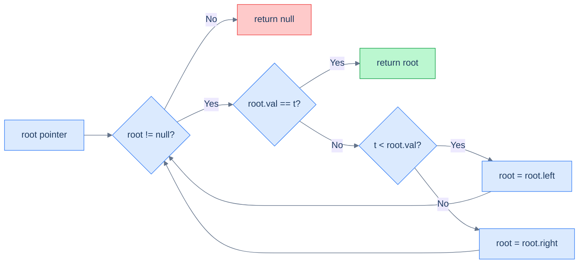
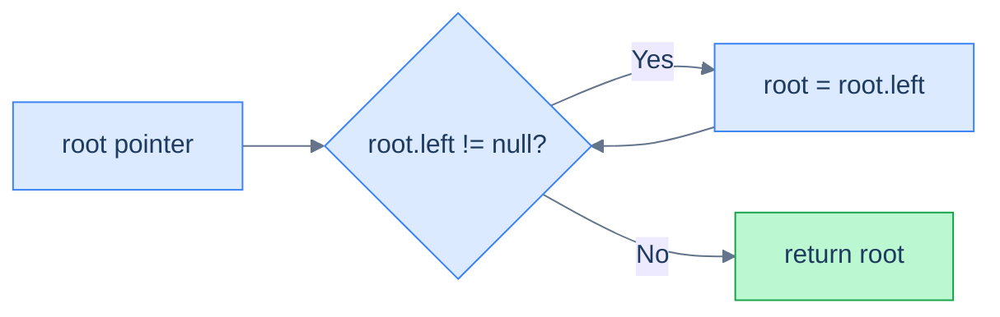
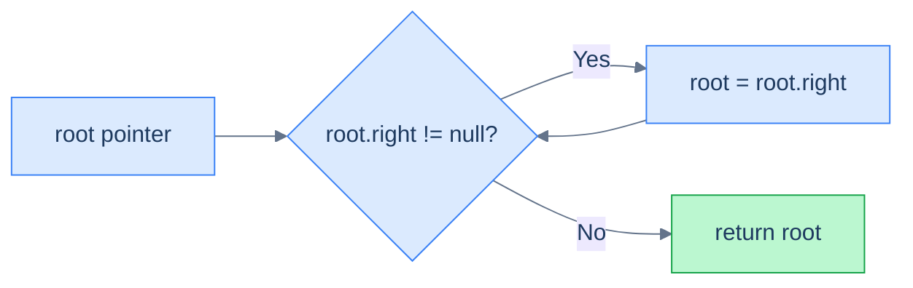
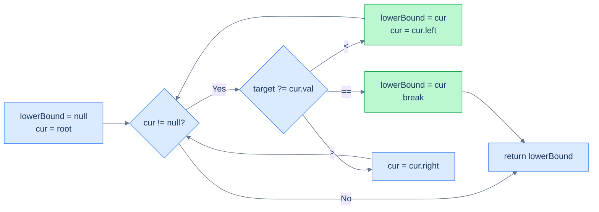
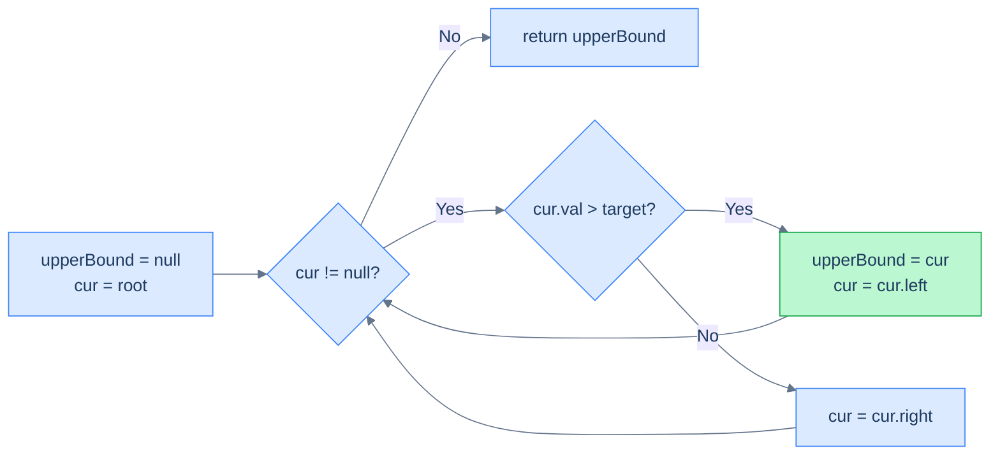
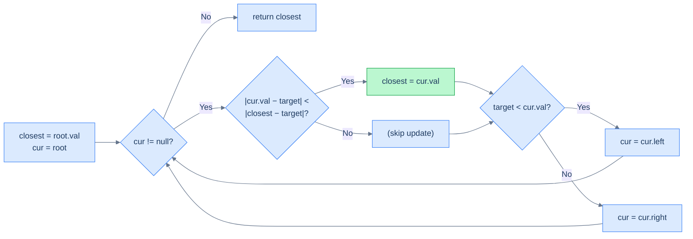

# 4. Iterative Searching in Binary Search Trees

## The Hook

The recursive search algorithms in the previous lesson have a beautiful structure — but every recursive call costs a stack frame, and on a deep tree, that bill adds up. A million-node skewed BST will produce a million stack frames before it can return, often hitting your runtime's stack-overflow ceiling.

There's a clean way out. Look back at every recursive function we wrote: each one ends with a single recursive call into *one* subtree, and nothing happens after that call returns. That's a **tail-recursive descent**, and tail recursion is just a loop in disguise. We can replace it with a `while` loop that *moves the pointer down* each iteration, getting **O(1) extra space** for free — no stack, no frames, no overflow.

This lesson rewrites every search from lesson 3 in iterative form: search, min, max, lower bound, upper bound. Same algorithm, same complexity, dramatically smaller memory footprint. We finish with one new problem — **closest value** — that's also a single descent, with one twist: at every step you keep the *best so far*, even if the search has to keep going.

---

## Table of Contents

1. [Understanding iterative search](#understanding-iterative-search)
2. [Iterative search](#iterative-search)
3. [Understanding iterative minimum search](#understanding-iterative-minimum-search)
4. [Iteratively find minimum](#iteratively-find-minimum)
5. [Understanding iterative maximum search](#understanding-iterative-maximum-search)
6. [Iteratively find maximum](#iteratively-find-maximum)
7. [Understanding iterative lower bound search](#understanding-iterative-lower-bound-search)
8. [Iteratively find lower bound](#iteratively-find-lower-bound)
9. [Understanding iterative upper bound search](#understanding-iterative-upper-bound-search)
10. [Iteratively find upper bound](#iteratively-find-upper-bound)
11. [Closest value](#closest-value)

***

# Understanding iterative search

The recursive search descended along a single root-to-leaf path. Iterative search does the *exact same descent* — except instead of letting the call stack track our position, we do it explicitly with a pointer variable.

## Why no explicit stack is needed

When you convert a recursive tree algorithm into an iterative one, the standard playbook says: replace the call stack with an *explicit* stack (`std::stack`, `Deque`, `ArrayDeque`, etc.). That's because most tree recursion has *two* recursive calls per node — one for each subtree — so the algorithm needs to remember "after I'm done with the left subtree, come back and do the right one too".

> *Friction prompt — predict before reading on. Why does BST search not need an explicit stack?*

Because BST search recurses into **only one** subtree per node. Once you decide which side to descend into, you never come back. There is nothing to remember. So the stack is empty — and we replace it with a single pointer.



<p align="center"><strong>Iterative BST search: a single pointer descends the tree, choosing left or right at every step. No stack, constant extra space.</strong></p>

## Algorithm

> **Algorithm**
>
> - **Step 1:** While `root` is not `null`:
>   - **Step 1.1:** If `root.val == target`, return `root`.
>   - **Step 1.2:** Else if `target < root.val`, move `root` to its left child.
>   - **Step 1.3:** Else move `root` to its right child.
> - **Step 2:** Return `null` (target not found).

## Complexity

| Case | Time | Space |
|---|---|---|
| Best (balanced) | O(log n) | **O(1)** |
| Worst (skewed) | O(n) | **O(1)** |

The space win over recursion is the whole point: the recursive version was O(h) on the stack; this version is O(1) on the heap and the stack combined.

***

# Iterative search

## Problem Statement

Given the **root** of a binary search tree and a **target** value, return the node with the given value, or `null` if no such node exists. You must do this **iteratively**.

### Example 1

> - **Input:** `root = [4, 2, 5, 1, 3, null, 6]`, `target = 3`
> - **Output:** `3`

### Example 2

> - **Input:** `root = [5, 4, 10, null, null, 9, 11]`, `target = 20`
> - **Output:** `null`

<details>
<summary><h2>The Solution</h2></summary>


```python run viz=binary-tree viz-root=root
from typing import Optional


class TreeNode:
    def __init__(self, val=0, left=None, right=None):
        self.val = val
        self.left = left
        self.right = right


def from_level_order(values):
    """Build tree from list like [1, 2, 3, None, 4]. None means missing child."""
    if not values:
        return None
    root = TreeNode(values[0])
    queue = [root]
    i = 1
    while queue and i < len(values):
        node = queue.pop(0)
        if i < len(values) and values[i] is not None:
            node.left = TreeNode(values[i])
            queue.append(node.left)
        i += 1
        if i < len(values) and values[i] is not None:
            node.right = TreeNode(values[i])
            queue.append(node.right)
        i += 1
    return root


class Solution:
    def iterative_search(
        self, root: Optional[TreeNode], target: int
    ) -> Optional[TreeNode]:

        # Loop until we reach the end of the tree (or find the desired
        # node)
        while root:

            # Check if the current node's value matches the target data
            if root.val == target:

                # Return the node since we found it
                return root

            # If the target data is smaller, move to the left subtree
            elif target < root.val:
                root = root.left

            # If the target data is larger, move to the right subtree
            else:
                root = root.right

        # If the while loop ends without finding the node, return None
        return None


# Examples from the problem statement
t1 = from_level_order([4, 2, 5, 1, 3, None, 6])
r1 = Solution().iterative_search(t1, 3)
print(r1.val if r1 else None)                      # 3

t2 = from_level_order([5, 4, 10, None, None, 9, 11])
r2 = Solution().iterative_search(t2, 20)
print(r2.val if r2 else None)                      # None

# Edge cases
print(Solution().iterative_search(None, 5))        # None  — empty tree

t4 = TreeNode(5)                                   # single node, found
r4 = Solution().iterative_search(t4, 5)
print(r4.val if r4 else None)                      # 5

r5 = Solution().iterative_search(t4, 10)           # single node, not found
print(r5.val if r5 else None)                      # None

t6 = from_level_order([4, 2, 5, 1, 3, None, 6])
r6 = Solution().iterative_search(t6, 1)            # leftmost node
print(r6.val if r6 else None)                      # 1

t7 = from_level_order([4, 2, 5, 1, 3, None, 6])
r7 = Solution().iterative_search(t7, 6)            # rightmost node
print(r7.val if r7 else None)                      # 6
```

```java run viz=binary-tree viz-root=root
import java.util.*;

public class Main {
    static class TreeNode {
        int val;
        TreeNode left;
        TreeNode right;
        TreeNode() {}
        TreeNode(int val) { this.val = val; }
    }

    static TreeNode fromLevelOrder(Integer... values) {
        if (values.length == 0 || values[0] == null) return null;
        TreeNode root = new TreeNode(values[0]);
        Deque<TreeNode> queue = new ArrayDeque<>();
        queue.add(root);
        int i = 1;
        while (!queue.isEmpty() && i < values.length) {
            TreeNode node = queue.poll();
            if (i < values.length && values[i] != null) {
                node.left = new TreeNode(values[i]);
                queue.add(node.left);
            }
            i++;
            if (i < values.length && values[i] != null) {
                node.right = new TreeNode(values[i]);
                queue.add(node.right);
            }
            i++;
        }
        return root;
    }

    static class Solution {
        public TreeNode iterativeSearch(TreeNode root, int target) {

            // Loop until we reach the end of the tree (or find the desired
            // node)
            while (root != null) {

                // Check if the current node's value matches the target data
                if (root.val == target) {

                    // Return the node since we found it
                    return root;
                }

                // If the target data is smaller, move to the left subtree
                else if (target < root.val) {
                    root = root.left;
                }

                // If the target data is larger, move to the right subtree
                else {
                    root = root.right;
                }
            }

            // If the while loop ends without finding the node, return null
            return null;
        }
    }

    static String val(TreeNode n) { return n == null ? "null" : String.valueOf(n.val); }

    public static void main(String[] args) {
        // Examples from the problem statement
        TreeNode t1 = fromLevelOrder(4, 2, 5, 1, 3, null, 6);
        System.out.println(val(new Solution().iterativeSearch(t1, 3)));    // 3

        TreeNode t2 = fromLevelOrder(5, 4, 10, null, null, 9, 11);
        System.out.println(val(new Solution().iterativeSearch(t2, 20)));   // null

        // Edge cases
        System.out.println(val(new Solution().iterativeSearch(null, 5)));  // null — empty tree

        TreeNode t4 = new TreeNode(5);                                     // single node, found
        System.out.println(val(new Solution().iterativeSearch(t4, 5)));    // 5

        System.out.println(val(new Solution().iterativeSearch(t4, 10)));   // null — single node, not found

        TreeNode t6 = fromLevelOrder(4, 2, 5, 1, 3, null, 6);
        System.out.println(val(new Solution().iterativeSearch(t6, 1)));    // 1  — leftmost node

        System.out.println(val(new Solution().iterativeSearch(t6, 6)));    // 6  — rightmost node
    }
}
```


<details>
<summary><strong>Trace — root = [50, 30, 70, 20, 40, 60, 80], target = 40</strong></summary>

```
Step 1 │ root = 50 │ 40 < 50  → root = root.left  (now 30)
Step 2 │ root = 30 │ 40 > 30  → root = root.right (now 40)
Step 3 │ root = 40 │ 40 == 40 → return root
Result: node 40 ✓ (3 hops, O(1) extra space)
```

</details>

</details>

***

# Understanding iterative minimum search

The minimum is the leftmost node. The recursive version chased `node.left` until it ran out; the iterative version does exactly the same with a `while` loop.

## Algorithm

> **Algorithm**
>
> - **Step 1:** If `root` is `null`, return `null`.
> - **Step 2:** While `root.left != null`, set `root = root.left`.
> - **Step 3:** Return `root`.



<p align="center"><strong>The iterative minimum walk: keep moving to the left child until there is none.</strong></p>

## Complexity

| Case | Time | Space |
|---|---|---|
| Best | O(1) | O(1) |
| Worst (left-skew) | O(n) | O(1) |

***

# Iteratively find minimum

## Problem Statement

Given the **root** of a binary search tree, return the node with the minimum value. You must do this **iteratively**.

### Example 1

> - **Input:** `root = [4, 2, 5, 1, 3, null, 6]`
> - **Output:** `1`

### Example 2

> - **Input:** `root = [5, 4, 10, null, null, 9, 11]`
> - **Output:** `4`

<details>
<summary><h2>The Solution</h2></summary>


```python run viz=binary-tree viz-root=root
from typing import Optional


class TreeNode:
    def __init__(self, val=0, left=None, right=None):
        self.val = val
        self.left = left
        self.right = right


def from_level_order(values):
    """Build tree from list like [1, 2, 3, None, 4]. None means missing child."""
    if not values:
        return None
    root = TreeNode(values[0])
    queue = [root]
    i = 1
    while queue and i < len(values):
        node = queue.pop(0)
        if i < len(values) and values[i] is not None:
            node.left = TreeNode(values[i])
            queue.append(node.left)
        i += 1
        if i < len(values) and values[i] is not None:
            node.right = TreeNode(values[i])
            queue.append(node.right)
        i += 1
    return root


class Solution:
    def iteratively_find_minimum(
        self, root: Optional[TreeNode]
    ) -> Optional[TreeNode]:

        # Start from the given root node and iterate until we reach
        # the leftmost node
        while root:

            # If the left child of the current node is null, it means
            # we have reached the leftmost node, which contains the
            # minimum value in the binary search tree
            if root.left is None:
                return root

            # If the left child is not null, move to the left child
            # to continue the search for the minimum value.
            else:
                root = root.left

        # If the tree is empty (root is null), or for some reason,
        # the while loop exits without finding the minimum node, we
        # return the current root
        return root


# Examples from the problem statement
t1 = from_level_order([4, 2, 5, 1, 3, None, 6])
r1 = Solution().iteratively_find_minimum(t1)
print(r1.val if r1 else None)                      # 1

t2 = from_level_order([5, 4, 10, None, None, 9, 11])
r2 = Solution().iteratively_find_minimum(t2)
print(r2.val if r2 else None)                      # 4

# Edge cases
print(Solution().iteratively_find_minimum(None))   # None  — empty tree

t4 = TreeNode(7)                                   # single node
r4 = Solution().iteratively_find_minimum(t4)
print(r4.val if r4 else None)                      # 7

t5 = from_level_order([1, None, 2, None, None, None, 3])  # right-skewed
r5 = Solution().iteratively_find_minimum(t5)
print(r5.val if r5 else None)                      # 1  — root is minimum

t6 = from_level_order([5, 4, 6, 3, None, None, 7])
r6 = Solution().iteratively_find_minimum(t6)
print(r6.val if r6 else None)                      # 3

t7 = from_level_order([5, 3, 7, 1, 4, 6, 9])      # balanced BST
r7 = Solution().iteratively_find_minimum(t7)
print(r7.val if r7 else None)                      # 1
```

```java run viz=binary-tree viz-root=root
import java.util.*;

public class Main {
    static class TreeNode {
        int val;
        TreeNode left;
        TreeNode right;
        TreeNode() {}
        TreeNode(int val) { this.val = val; }
    }

    static TreeNode fromLevelOrder(Integer... values) {
        if (values.length == 0 || values[0] == null) return null;
        TreeNode root = new TreeNode(values[0]);
        Deque<TreeNode> queue = new ArrayDeque<>();
        queue.add(root);
        int i = 1;
        while (!queue.isEmpty() && i < values.length) {
            TreeNode node = queue.poll();
            if (i < values.length && values[i] != null) {
                node.left = new TreeNode(values[i]);
                queue.add(node.left);
            }
            i++;
            if (i < values.length && values[i] != null) {
                node.right = new TreeNode(values[i]);
                queue.add(node.right);
            }
            i++;
        }
        return root;
    }

    static class Solution {
        public TreeNode iterativelyFindMinimum(TreeNode root) {

            // Start from the given root node and iterate until we reach
            // the leftmost node
            while (root != null) {

                // If the left child of the current node is null, it means
                // we have reached the leftmost node, which contains the
                // minimum value in the binary search tree
                if (root.left == null) {
                    return root;
                }

                // If the left child is not null, move to the left child
                // to continue the search for the minimum value.
                else {
                    root = root.left;
                }
            }

            // If the tree is empty (root is null), or for some reason,
            // the while loop exits without finding the minimum node, we
            // return the current root
            return root;
        }
    }

    static String val(TreeNode n) { return n == null ? "null" : String.valueOf(n.val); }

    public static void main(String[] args) {
        // Examples from the problem statement
        TreeNode t1 = fromLevelOrder(4, 2, 5, 1, 3, null, 6);
        System.out.println(val(new Solution().iterativelyFindMinimum(t1)));    // 1

        TreeNode t2 = fromLevelOrder(5, 4, 10, null, null, 9, 11);
        System.out.println(val(new Solution().iterativelyFindMinimum(t2)));    // 4

        // Edge cases
        System.out.println(val(new Solution().iterativelyFindMinimum(null)));  // null — empty tree

        TreeNode t4 = new TreeNode(7);                                         // single node
        System.out.println(val(new Solution().iterativelyFindMinimum(t4)));    // 7

        TreeNode t5 = new TreeNode(1);                                         // right-skewed
        t5.right = new TreeNode(2); t5.right.right = new TreeNode(3);
        System.out.println(val(new Solution().iterativelyFindMinimum(t5)));    // 1  — root is minimum

        TreeNode t6 = fromLevelOrder(5, 4, 6, 3, null, null, 7);
        System.out.println(val(new Solution().iterativelyFindMinimum(t6)));    // 3

        TreeNode t7 = fromLevelOrder(5, 3, 7, 1, 4, 6, 9);                   // balanced BST
        System.out.println(val(new Solution().iterativelyFindMinimum(t7)));    // 1
    }
}
```

</details>


***

# Understanding iterative maximum search

By symmetry with minimum: the maximum is the rightmost node. Walk right until you can't.

## Algorithm

> **Algorithm**
>
> - **Step 1:** If `root` is `null`, return `null`.
> - **Step 2:** While `root.right != null`, set `root = root.right`.
> - **Step 3:** Return `root`.



<p align="center"><strong>Walking to the rightmost node — the largest value.</strong></p>

## Complexity

| Case | Time | Space |
|---|---|---|
| Best | O(1) | O(1) |
| Worst (right-skew) | O(n) | O(1) |

***

# Iteratively find maximum

## Problem Statement

Given the **root** of a binary search tree, return the node with the maximum value. You must do this **iteratively**.

### Example 1

> - **Input:** `root = [4, 2, 5, 1, 3, null, 6]`
> - **Output:** `6`

### Example 2

> - **Input:** `root = [5, 4, 10, null, null, 9, 11]`
> - **Output:** `11`

<details>
<summary><h2>The Solution</h2></summary>


```python run viz=binary-tree viz-root=root
from typing import Optional


class TreeNode:
    def __init__(self, val=0, left=None, right=None):
        self.val = val
        self.left = left
        self.right = right


def from_level_order(values):
    """Build tree from list like [1, 2, 3, None, 4]. None means missing child."""
    if not values:
        return None
    root = TreeNode(values[0])
    queue = [root]
    i = 1
    while queue and i < len(values):
        node = queue.pop(0)
        if i < len(values) and values[i] is not None:
            node.left = TreeNode(values[i])
            queue.append(node.left)
        i += 1
        if i < len(values) and values[i] is not None:
            node.right = TreeNode(values[i])
            queue.append(node.right)
        i += 1
    return root


class Solution:
    def iteratively_find_maximum(
        self, root: Optional[TreeNode]
    ) -> Optional[TreeNode]:

        # Start from the given root node and iterate until we reach
        # the rightmost node
        while root:

            # If the right child of the current node is null, it means
            # we have reached the rightmost node, which contains the
            # maximum value in the binary search tree
            if root.right is None:
                return root

            # If the right child is not null, move to the right child
            # to continue the search for the maximum value.
            else:
                root = root.right

        # If the tree is empty (root is null), or for some reason,
        # the while loop exits without finding the maximum node, we
        # return the current root
        return root


# Examples from the problem statement
t1 = from_level_order([4, 2, 5, 1, 3, None, 6])
r1 = Solution().iteratively_find_maximum(t1)
print(r1.val if r1 else None)                      # 6

t2 = from_level_order([5, 4, 10, None, None, 9, 11])
r2 = Solution().iteratively_find_maximum(t2)
print(r2.val if r2 else None)                      # 11

# Edge cases
print(Solution().iteratively_find_maximum(None))   # None  — empty tree

t4 = TreeNode(7)                                   # single node
r4 = Solution().iteratively_find_maximum(t4)
print(r4.val if r4 else None)                      # 7

t5 = from_level_order([5, 4, None, 3])            # left-skewed
r5 = Solution().iteratively_find_maximum(t5)
print(r5.val if r5 else None)                      # 5  — root is maximum

t6 = from_level_order([1, None, 2, None, None, None, 3])  # right-skewed
r6 = Solution().iteratively_find_maximum(t6)
print(r6.val if r6 else None)                      # 2

t7 = from_level_order([5, 3, 7, 1, 4, 6, 9])      # balanced BST
r7 = Solution().iteratively_find_maximum(t7)
print(r7.val if r7 else None)                      # 9
```

```java run viz=binary-tree viz-root=root
import java.util.*;

public class Main {
    static class TreeNode {
        int val;
        TreeNode left;
        TreeNode right;
        TreeNode() {}
        TreeNode(int val) { this.val = val; }
    }

    static TreeNode fromLevelOrder(Integer... values) {
        if (values.length == 0 || values[0] == null) return null;
        TreeNode root = new TreeNode(values[0]);
        Deque<TreeNode> queue = new ArrayDeque<>();
        queue.add(root);
        int i = 1;
        while (!queue.isEmpty() && i < values.length) {
            TreeNode node = queue.poll();
            if (i < values.length && values[i] != null) {
                node.left = new TreeNode(values[i]);
                queue.add(node.left);
            }
            i++;
            if (i < values.length && values[i] != null) {
                node.right = new TreeNode(values[i]);
                queue.add(node.right);
            }
            i++;
        }
        return root;
    }

    static class Solution {
        public TreeNode iterativelyFindMaximum(TreeNode root) {

            // Start from the given root node and iterate until we reach
            // the rightmost node
            while (root != null) {

                // If the right child of the current node is null, it means
                // we have reached the rightmost node, which contains the
                // maximum value in the binary search tree
                if (root.right == null) {
                    return root;
                }

                // If the right child is not null, move to the right child
                // to continue the search for the maximum value.
                else {
                    root = root.right;
                }
            }

            // If the tree is empty (root is null), or for some reason,
            // the while loop exits without finding the maximum node, we
            // return the current root
            return root;
        }
    }

    static String val(TreeNode n) { return n == null ? "null" : String.valueOf(n.val); }

    public static void main(String[] args) {
        // Examples from the problem statement
        TreeNode t1 = fromLevelOrder(4, 2, 5, 1, 3, null, 6);
        System.out.println(val(new Solution().iterativelyFindMaximum(t1)));    // 6

        TreeNode t2 = fromLevelOrder(5, 4, 10, null, null, 9, 11);
        System.out.println(val(new Solution().iterativelyFindMaximum(t2)));    // 11

        // Edge cases
        System.out.println(val(new Solution().iterativelyFindMaximum(null)));  // null — empty tree

        TreeNode t4 = new TreeNode(7);                                         // single node
        System.out.println(val(new Solution().iterativelyFindMaximum(t4)));    // 7

        TreeNode t5 = fromLevelOrder(5, 4, null, 3);                          // left-skewed
        System.out.println(val(new Solution().iterativelyFindMaximum(t5)));    // 5  — root is maximum

        TreeNode t6 = new TreeNode(1);                                         // right-skewed
        t6.right = new TreeNode(2); t6.right.right = new TreeNode(3);
        System.out.println(val(new Solution().iterativelyFindMaximum(t6)));    // 3

        TreeNode t7 = fromLevelOrder(5, 3, 7, 1, 4, 6, 9);                   // balanced BST
        System.out.println(val(new Solution().iterativelyFindMaximum(t7)));    // 9
    }
}
```

</details>


***

# Understanding iterative lower bound search

Recall: lower bound = smallest value `≥ target`. The recursive version kept a global `lowerBoundNode` and updated it every time it descended into the left subtree. The iterative version stores it as a *local variable* — even simpler.

## Algorithm

At every step, look at the current node:

- If `target < node.val`, the node is a candidate (since `node.val > target ⇒ node.val ≥ target`). Save it, then go left to look for an even *tighter* candidate.
- If `target == node.val`, the node is *the* lower bound (you can't beat equality). Save it and stop.
- If `target > node.val`, the node is too small — go right.



<p align="center"><strong>Iterative lower-bound walk. Update <code>lowerBound</code> whenever <code>cur.val ≥ target</code>; recurse left to tighten or right to keep searching.</strong></p>

## Complexity

| Case | Time | Space |
|---|---|---|
| Best (balanced) | O(log n) | O(1) |
| Worst (skewed) | O(n) | O(1) |

***

# Iteratively find lower bound

## Problem Statement

Given the **root** of a binary search tree and a **target**, return the node that is the lower bound for the target — the first element **≥ target**. Return `null` if no such node exists. You must do this **iteratively**.

### Example 1

> - **Input:** `root = [4, 2, 5, 1, 3, null, 6]`, `target = 3`
> - **Output:** `3`

### Example 2

> - **Input:** `root = [5, 4, 10, null, null, 9, 11]`, `target = 7`
> - **Output:** `9`

<details>
<summary><h2>The Solution</h2></summary>


```python run viz=binary-tree viz-root=root
from typing import Optional


class TreeNode:
    def __init__(self, val=0, left=None, right=None):
        self.val = val
        self.left = left
        self.right = right


def from_level_order(values):
    """Build tree from list like [1, 2, 3, None, 4]. None means missing child."""
    if not values:
        return None
    root = TreeNode(values[0])
    queue = [root]
    i = 1
    while queue and i < len(values):
        node = queue.pop(0)
        if i < len(values) and values[i] is not None:
            node.left = TreeNode(values[i])
            queue.append(node.left)
        i += 1
        if i < len(values) and values[i] is not None:
            node.right = TreeNode(values[i])
            queue.append(node.right)
        i += 1
    return root


class Solution:
    def iteratively_find_lower_bound(
        self, root: Optional[TreeNode], target: int
    ) -> Optional[TreeNode]:

        # Initialize a pointer to the lower bound node as None
        lower_bound_node = None

        # Traverse the binary search tree iteratively until root becomes
        # None.
        while root:

            # If the target is less than the current node's value, move
            # to the left subtree
            if target < root.val:

                # Update the lower bound node to the current node as it
                # is the potential lower bound
                lower_bound_node = root

                # Move to the left subtree to find a closer lower bound
                root = root.left

            # If the target is equal to the current node's value, we
            # found an exact match
            elif root.val == target:

                # Update the lower bound node to the current node
                # (exact match is also a lower bound)
                lower_bound_node = root

                # Return the node as we have found an exact match for
                # the given target
                return lower_bound_node

            # If the target is greater than the current node's value,
            # move to the right subtree.
            else:

                # We are not updating the lower bound node in this case
                # as the current node is not a lower bound continue
                # searching in the right subtree to find a closer lower
                # bound
                root = root.right

        # Return the lower bound node
        return lower_bound_node


# Examples from the problem statement
t1 = from_level_order([4, 2, 5, 1, 3, None, 6])
r1 = Solution().iteratively_find_lower_bound(t1, 3)
print(r1.val if r1 else None)                      # 3

t2 = from_level_order([5, 4, 10, None, None, 9, 11])
r2 = Solution().iteratively_find_lower_bound(t2, 7)
print(r2.val if r2 else None)                      # 9

# Edge cases
print(Solution().iteratively_find_lower_bound(None, 5))  # None — empty tree

t4 = TreeNode(5)
r4 = Solution().iteratively_find_lower_bound(t4, 5)  # exact match
print(r4.val if r4 else None)                      # 5

t5 = from_level_order([4, 2, 5, 1, 3, None, 6])
r5 = Solution().iteratively_find_lower_bound(t5, 7)  # target > all values
print(r5.val if r5 else None)                      # None

t6 = from_level_order([4, 2, 5, 1, 3, None, 6])
r6 = Solution().iteratively_find_lower_bound(t6, 0)  # target < all values
print(r6.val if r6 else None)                      # 1

t7 = from_level_order([4, 2, 5, 1, 3, None, 6])
r7 = Solution().iteratively_find_lower_bound(t7, 4)  # exact match on root
print(r7.val if r7 else None)                      # 4
```

```java run viz=binary-tree viz-root=root
import java.util.*;

public class Main {
    static class TreeNode {
        int val;
        TreeNode left;
        TreeNode right;
        TreeNode() {}
        TreeNode(int val) { this.val = val; }
    }

    static TreeNode fromLevelOrder(Integer... values) {
        if (values.length == 0 || values[0] == null) return null;
        TreeNode root = new TreeNode(values[0]);
        Deque<TreeNode> queue = new ArrayDeque<>();
        queue.add(root);
        int i = 1;
        while (!queue.isEmpty() && i < values.length) {
            TreeNode node = queue.poll();
            if (i < values.length && values[i] != null) {
                node.left = new TreeNode(values[i]);
                queue.add(node.left);
            }
            i++;
            if (i < values.length && values[i] != null) {
                node.right = new TreeNode(values[i]);
                queue.add(node.right);
            }
            i++;
        }
        return root;
    }

    static class Solution {
        public TreeNode iterativelyFindLowerBound(TreeNode root, int target) {

            // Initialize a pointer to the lower bound node as null
            TreeNode lowerBoundNode = null;

            // Traverse the binary search tree iteratively until root becomes
            // null.
            while (root != null) {

                // If the target is less than the current node's value, move
                // to the left subtree
                if (target < root.val) {

                    // Update the lower bound node to the current node as it
                    // is the potential lower bound
                    lowerBoundNode = root;

                    // Move to the left subtree to find a closer lower bound
                    root = root.left;
                }

                // If the target is equal to the current node's value, we
                // found an exact match
                else if (root.val == target) {

                    // Update the lower bound node to the current node
                    // (exact match is also a lower bound)
                    lowerBoundNode = root;

                    // Return the node as we have found an exact match for
                    // the given target
                    return lowerBoundNode;
                }

                // If the target is greater than the current node's value,
                // move to the right subtree.
                else {

                    // We are not updating the lower bound node in this case
                    // as the current node is not a lower bound continue
                    // searching in the right subtree to find a closer lower
                    // bound
                    root = root.right;
                }
            }

            // Return the lower bound node
            return lowerBoundNode;
        }
    }

    static String val(TreeNode n) { return n == null ? "null" : String.valueOf(n.val); }

    public static void main(String[] args) {
        // Examples from the problem statement
        TreeNode t1 = fromLevelOrder(4, 2, 5, 1, 3, null, 6);
        System.out.println(val(new Solution().iterativelyFindLowerBound(t1, 3)));    // 3

        TreeNode t2 = fromLevelOrder(5, 4, 10, null, null, 9, 11);
        System.out.println(val(new Solution().iterativelyFindLowerBound(t2, 7)));    // 9

        // Edge cases
        System.out.println(val(new Solution().iterativelyFindLowerBound(null, 5)));  // null — empty tree

        TreeNode t4 = new TreeNode(5);
        System.out.println(val(new Solution().iterativelyFindLowerBound(t4, 5)));    // 5  — exact match

        TreeNode t5 = fromLevelOrder(4, 2, 5, 1, 3, null, 6);
        System.out.println(val(new Solution().iterativelyFindLowerBound(t5, 7)));    // null — target > all

        TreeNode t6 = fromLevelOrder(4, 2, 5, 1, 3, null, 6);
        System.out.println(val(new Solution().iterativelyFindLowerBound(t6, 0)));    // 1  — target < all

        TreeNode t7 = fromLevelOrder(4, 2, 5, 1, 3, null, 6);
        System.out.println(val(new Solution().iterativelyFindLowerBound(t7, 4)));    // 4  — exact match on root
    }
}
```


<details>
<summary><strong>Trace — root = [50, 30, 70, null, null, 60, 80], target = 54</strong></summary>

```
candidate = null
Step 1 │ cur = 50 │ 50 < 54  → cur = cur.right (now 70)
Step 2 │ cur = 70 │ 54 < 70  → candidate = 70 → cur = cur.left  (now 60)
Step 3 │ cur = 60 │ 54 < 60  → candidate = 60 → cur = cur.left  (now null)
Step 4 │ cur = null  → loop exits
Result: candidate = 60 ✓
```

</details>

</details>

***

# Understanding iterative upper bound search

Upper bound = smallest value **strictly greater than** target. Same descent as lower bound — but the equality case is no longer a "match". When `node.val == target`, treat it as `node.val ≤ target` (skip, go right).

## Algorithm

> **Algorithm**
>
> - **Step 1:** Initialise `upperBoundNode = null`, `cur = root`.
> - **Step 2:** While `cur != null`:
>   - If `cur.val > target`, set `upperBoundNode = cur` and `cur = cur.left`.
>   - Else, set `cur = cur.right`.
> - **Step 3:** Return `upperBoundNode`.



<p align="center"><strong>Iterative upper-bound walk. The strict <code>cur.val &gt; target</code> means equal values get skipped to the right subtree.</strong></p>

## Complexity

| Case | Time | Space |
|---|---|---|
| Best (balanced) | O(log n) | O(1) |
| Worst (skewed) | O(n) | O(1) |

***

# Iteratively find upper bound

## Problem Statement

Given the **root** of a binary search tree and a **target**, return the node that is the upper bound for the target — the first element **> target**. Return `null` if no such node exists. You must do this **iteratively**.

### Example 1

> - **Input:** `root = [4, 2, 5, 1, 3, null, 6]`, `target = 3`
> - **Output:** `4`

### Example 2

> - **Input:** `root = [5, 4, 10, null, null, 9, 11]`, `target = 7`
> - **Output:** `9`

<details>
<summary><h2>The Solution</h2></summary>


```python run viz=binary-tree viz-root=root
from typing import Optional


class TreeNode:
    def __init__(self, val=0, left=None, right=None):
        self.val = val
        self.left = left
        self.right = right


def from_level_order(values):
    """Build tree from list like [1, 2, 3, None, 4]. None means missing child."""
    if not values:
        return None
    root = TreeNode(values[0])
    queue = [root]
    i = 1
    while queue and i < len(values):
        node = queue.pop(0)
        if i < len(values) and values[i] is not None:
            node.left = TreeNode(values[i])
            queue.append(node.left)
        i += 1
        if i < len(values) and values[i] is not None:
            node.right = TreeNode(values[i])
            queue.append(node.right)
        i += 1
    return root


class Solution:
    def iteratively_find_upper_bound(
        self, root: Optional[TreeNode], target: int
    ) -> Optional[TreeNode]:

        # Initialize a pointer to the upper bound node as None
        upper_bound_node = None

        # Traverse the binary search tree iteratively until root becomes
        # None
        while root:

            # If the target is less than the current node's value, move
            # to the left subtree
            if target < root.val:

                # Update the upper bound node to the current node as it
                # is the potential upper bound
                upper_bound_node = root

                # Move to the left subtree to find a closer upper bound
                root = root.left

            # If the target is greater than or equal to the current
            # node's value, move to the right subtree
            else:

                # We are not updating the upper bound node in this case
                # as the current node is not an upper bound continue
                # searching in the right subtree to find a closer upper
                # bound.
                root = root.right

        # Return the upper bound node
        return upper_bound_node


# Examples from the problem statement
t1 = from_level_order([4, 2, 5, 1, 3, None, 6])
r1 = Solution().iteratively_find_upper_bound(t1, 3)
print(r1.val if r1 else None)                      # 4

t2 = from_level_order([5, 4, 10, None, None, 9, 11])
r2 = Solution().iteratively_find_upper_bound(t2, 7)
print(r2.val if r2 else None)                      # 9

# Edge cases
print(Solution().iteratively_find_upper_bound(None, 5))  # None — empty tree

t4 = TreeNode(5)
r4 = Solution().iteratively_find_upper_bound(t4, 5)  # exact match — no strict upper
print(r4.val if r4 else None)                      # None

t5 = from_level_order([4, 2, 5, 1, 3, None, 6])
r5 = Solution().iteratively_find_upper_bound(t5, 6)  # target = max value
print(r5.val if r5 else None)                      # None

t6 = from_level_order([4, 2, 5, 1, 3, None, 6])
r6 = Solution().iteratively_find_upper_bound(t6, 0)  # target < all values
print(r6.val if r6 else None)                      # 1

t7 = from_level_order([5, 4, 10, None, None, 9, 11])
r7 = Solution().iteratively_find_upper_bound(t7, 4)  # target = left-child value
print(r7.val if r7 else None)                      # 5
```

```java run viz=binary-tree viz-root=root
import java.util.*;

public class Main {
    static class TreeNode {
        int val;
        TreeNode left;
        TreeNode right;
        TreeNode() {}
        TreeNode(int val) { this.val = val; }
    }

    static TreeNode fromLevelOrder(Integer... values) {
        if (values.length == 0 || values[0] == null) return null;
        TreeNode root = new TreeNode(values[0]);
        Deque<TreeNode> queue = new ArrayDeque<>();
        queue.add(root);
        int i = 1;
        while (!queue.isEmpty() && i < values.length) {
            TreeNode node = queue.poll();
            if (i < values.length && values[i] != null) {
                node.left = new TreeNode(values[i]);
                queue.add(node.left);
            }
            i++;
            if (i < values.length && values[i] != null) {
                node.right = new TreeNode(values[i]);
                queue.add(node.right);
            }
            i++;
        }
        return root;
    }

    static class Solution {
        public TreeNode iterativelyFindUpperBound(TreeNode root, int target) {

            // Initialize a pointer to the upper bound node as null
            TreeNode upperBoundNode = null;

            // Traverse the binary search tree iteratively until root becomes
            // null
            while (root != null) {

                // If the target is less than the current node's value, move
                // to the left subtree
                if (target < root.val) {

                    // Update the upper bound node to the current node as it
                    // is the potential upper bound
                    upperBoundNode = root;

                    // Move to the left subtree to find a closer upper bound
                    root = root.left;
                }

                // If the target is greater than or equal to the current
                // node's value, move to the right subtree
                else {

                    // We are not updating the upper bound node in this case
                    // as the current node is not an upper bound continue
                    // searching in the right subtree to find a closer upper
                    // bound.
                    root = root.right;
                }
            }

            // Return the upper bound node
            return upperBoundNode;
        }
    }

    static String val(TreeNode n) { return n == null ? "null" : String.valueOf(n.val); }

    public static void main(String[] args) {
        // Examples from the problem statement
        TreeNode t1 = fromLevelOrder(4, 2, 5, 1, 3, null, 6);
        System.out.println(val(new Solution().iterativelyFindUpperBound(t1, 3)));    // 4

        TreeNode t2 = fromLevelOrder(5, 4, 10, null, null, 9, 11);
        System.out.println(val(new Solution().iterativelyFindUpperBound(t2, 7)));    // 9

        // Edge cases
        System.out.println(val(new Solution().iterativelyFindUpperBound(null, 5)));  // null — empty tree

        TreeNode t4 = new TreeNode(5);
        System.out.println(val(new Solution().iterativelyFindUpperBound(t4, 5)));    // null — exact match, no strict upper

        TreeNode t5 = fromLevelOrder(4, 2, 5, 1, 3, null, 6);
        System.out.println(val(new Solution().iterativelyFindUpperBound(t5, 6)));    // null — target = max value

        TreeNode t6 = fromLevelOrder(4, 2, 5, 1, 3, null, 6);
        System.out.println(val(new Solution().iterativelyFindUpperBound(t6, 0)));    // 1  — target < all values

        TreeNode t7 = fromLevelOrder(5, 4, 10, null, null, 9, 11);
        System.out.println(val(new Solution().iterativelyFindUpperBound(t7, 4)));    // 5  — target = left-child value
    }
}
```


<details>
<summary><strong>Trace — root = [4, 2, 5, 1, 3, null, 6], target = 3</strong></summary>

```
candidate = null
Step 1 │ cur = 4 │ 3 < 4  → candidate = 4 → cur = cur.left  (now 2)
Step 2 │ cur = 2 │ 3 ≥ 2  → cur = cur.right (now 3)
Step 3 │ cur = 3 │ 3 ≥ 3  → cur = cur.right (now null)  ← equality is NOT a match for upper bound
Step 4 │ cur = null  → loop exits
Result: candidate = 4 ✓
```

</details>

</details>

***

# Closest value

## Problem Statement

Given the **root** of a binary search tree and a **target** value (a real number, possibly non-integer), return the value in the BST closest to the target. The BST is guaranteed to contain exactly one such closest value.

### Example 1

> - **Input:** `root = [4, 2, 6, 1, null, null, 7]`, `target = 4.63`
> - **Output:** `4`
> - **Explanation:** The closest value in the tree to `4.63` is `4` (distance `0.63`); `6` is farther (distance `1.37`).

### Example 2

> - **Input:** `root = [2, 1, 4, null, null, 3, 7]`, `target = 7.49`
> - **Output:** `7`
> - **Explanation:** The closest value to `7.49` in the tree is `7` (distance `0.49`).

<details>
<summary><h2>The Strategy</h2></summary>


This is a hybrid: it's *exactly* a search-style descent, but every node we touch is a candidate worth comparing — even if we keep walking afterwards. So we maintain a `closest` value alongside the descent and update it whenever the current node beats it.

The descent direction is the same as plain search: if `target < current.val`, the answer (if any closer one exists) must be in the left subtree (everything in the right is larger and therefore even farther in the *positive* direction). If `target > current.val`, go right.

> *Friction prompt — predict before reading the code: when target equals `current.val`, can a closer value possibly exist deeper in the tree?*

No — distance is `0`, the absolute minimum. We could short-circuit, but the loop's natural termination handles it cleanly without an extra branch.



<p align="center"><strong>Closest-value walk. At every node, compare distance to the running best; then descend in the BST direction.</strong></p>

Why is the descent direction safe? Because of the BST property. Suppose you're at node `v` with target `t < v`. The right subtree contains only values `> v > t`, so each of those has distance `> v − t`. Meanwhile node `v` itself sits at distance `v − t`. So the right subtree cannot possibly contain anything closer than `v` — and `v` is already in `closest`. Discarding the right subtree is provably safe.

</details>
<details>
<summary><h2>The Solution</h2></summary>


```python run viz=binary-tree viz-root=root
from typing import Optional


class TreeNode:
    def __init__(self, val=0, left=None, right=None):
        self.val = val
        self.left = left
        self.right = right


def from_level_order(values):
    """Build tree from list like [1, 2, 3, None, 4]. None means missing child."""
    if not values:
        return None
    root = TreeNode(values[0])
    queue = [root]
    i = 1
    while queue and i < len(values):
        node = queue.pop(0)
        if i < len(values) and values[i] is not None:
            node.left = TreeNode(values[i])
            queue.append(node.left)
        i += 1
        if i < len(values) and values[i] is not None:
            node.right = TreeNode(values[i])
            queue.append(node.right)
        i += 1
    return root


class Solution:
    def closest_value(
        self, root: Optional[TreeNode], target: float
    ) -> int:

        # Start with the root as the closest value
        closest = root.val

        while root:

            # Update closest if the current node is closer to the target
            if abs(root.val - target) < abs(closest - target):
                closest = root.val

            # Traverse to the left subtree if the target is smaller
            if target < root.val:
                root = root.left

            # Traverse to the right subtree if the target is larger
            else:
                root = root.right

        return closest


# Examples from the problem statement
t1 = from_level_order([4, 2, 6, 1, None, None, 7])
print(Solution().closest_value(t1, 4.63))          # 4 (note: 5 not in tree)

t2 = from_level_order([2, 1, 4, None, None, 3, 7])
print(Solution().closest_value(t2, 7.49))          # 7

# Edge cases
t3 = TreeNode(5)                                   # single node
print(Solution().closest_value(t3, 99.9))          # 5

t4 = from_level_order([4, 2, 6, 1, None, None, 7])
print(Solution().closest_value(t4, 4.0))           # 4  — exact match

t5 = from_level_order([4, 2, 6, 1, None, None, 7])
print(Solution().closest_value(t5, 0.5))           # 1  — target below min

t6 = from_level_order([4, 2, 6, 1, None, None, 7])
print(Solution().closest_value(t6, 10.0))          # 7  — target above max

t7 = from_level_order([5, 3, 7, 2, 4, 6, 8])
print(Solution().closest_value(t7, 6.4))           # 6
```

```java run viz=binary-tree viz-root=root
import java.util.*;

public class Main {
    static class TreeNode {
        int val;
        TreeNode left;
        TreeNode right;
        TreeNode() {}
        TreeNode(int val) { this.val = val; }
    }

    static TreeNode fromLevelOrder(Integer... values) {
        if (values.length == 0 || values[0] == null) return null;
        TreeNode root = new TreeNode(values[0]);
        Deque<TreeNode> queue = new ArrayDeque<>();
        queue.add(root);
        int i = 1;
        while (!queue.isEmpty() && i < values.length) {
            TreeNode node = queue.poll();
            if (i < values.length && values[i] != null) {
                node.left = new TreeNode(values[i]);
                queue.add(node.left);
            }
            i++;
            if (i < values.length && values[i] != null) {
                node.right = new TreeNode(values[i]);
                queue.add(node.right);
            }
            i++;
        }
        return root;
    }

    static class Solution {
        public int closestValue(TreeNode root, double target) {

            // Start with the root as the closest value
            int closest = root.val;

            while (root != null) {

                // Update closest if the current node is closer to the target
                if (
                    Math.abs(root.val - target) < Math.abs(closest - target)
                ) {
                    closest = root.val;
                }

                // Traverse to the left subtree if the target is smaller
                if (target < root.val) {
                    root = root.left;
                }

                // Traverse to the right subtree if the target is larger
                else {
                    root = root.right;
                }
            }

            return closest;
        }
    }

    public static void main(String[] args) {
        // Examples from the problem statement
        TreeNode t1 = fromLevelOrder(4, 2, 6, 1, null, null, 7);
        System.out.println(new Solution().closestValue(t1, 4.63));         // 4

        TreeNode t2 = fromLevelOrder(2, 1, 4, null, null, 3, 7);
        System.out.println(new Solution().closestValue(t2, 7.49));         // 7

        // Edge cases
        TreeNode t3 = new TreeNode(5);                                     // single node
        System.out.println(new Solution().closestValue(t3, 99.9));         // 5

        TreeNode t4 = fromLevelOrder(4, 2, 6, 1, null, null, 7);
        System.out.println(new Solution().closestValue(t4, 4.0));          // 4  — exact match

        System.out.println(new Solution().closestValue(t4, 0.5));          // 1  — target below min

        System.out.println(new Solution().closestValue(t4, 10.0));         // 7  — target above max

        TreeNode t7 = fromLevelOrder(5, 3, 7, 2, 4, 6, 8);
        System.out.println(new Solution().closestValue(t7, 6.4));          // 6
    }
}
```


<details>
<summary><strong>Trace — root = [4, 2, 6, 1, null, null, 7], target = 4.63</strong></summary>

```
closest = 4 (initial), |4 − 4.63| = 0.63
Step 1 │ cur = 4 │ |4 − 4.63| = 0.63 (not better) │ 4.63 ≥ 4 → cur = cur.right (now 6)
Step 2 │ cur = 6 │ |6 − 4.63| = 1.37 (not better) │ 4.63 < 6 → cur = cur.left  (now null)
Step 3 │ cur = null → loop exits
Result: closest = 4 ✓
```

</details>

</details>
<details>
<summary><h2>Final Takeaway</h2></summary>


Every search algorithm in the recursive lesson collapses to a `while` loop the moment you notice the recursion is tail-shaped — one descent, no return. The pay-off is real: **O(1) extra space**, no stack overhead, no risk of stack overflow on deep trees. For interview code, library code, or hot paths in a database engine, the iterative form is what you want.

Three idioms you'll keep using:

1. **A single pointer descending the tree** — replaces an entire stack frame with a `cur` variable.
2. **A "best-so-far" local variable** — for lower bound, upper bound, closest value, predecessors, successors.
3. **The BST-direction step is provably safe** — the elimination argument we made for closest value is the *same* argument behind insert, delete, and every range/floor/ceiling query.

The next lesson moves from observation to *modification*: how do you **insert** a new value into a BST while preserving the property? Spoiler — it's another single descent, and the slot you've been "falling off into" all this lesson is exactly where the new node goes.

</details>

<!-- ============================================== -->
<!-- SWEEP 2 — missing sections (placeholders only) -->
<!-- ============================================== -->

<!-- TODO: Understanding the Problem — missing, needs to be written -->
<!--       Guidance: frame the gap the structure/algorithm fills -->

<!-- TODO: Supported Operations — missing, needs to be written -->
<!--       Guidance: table: operation / time / notes -->

<!-- TODO: Internal Mechanics — missing, needs to be written -->
<!--       Guidance: how it actually works under the hood -->

<!-- TODO: Working Example — missing, needs to be written -->
<!--       Guidance: one fully worked end-to-end example -->

<!-- TODO: Edge Cases & Pitfalls — missing, needs to be written -->
<!--       Guidance: bulleted list of gotchas -->

<!-- TODO: Production Reality — missing, needs to be written -->
<!--       Guidance: 4–6 entries: System — uses X — because Y -->

<!-- TODO: Quiz — missing, needs to be written -->
<!--       Guidance: 3–5 questions, each labeled [Recall]/[Reasoning]/[Tradeoff] -->

<!-- TODO: Practice Ladder — missing, needs to be written -->
<!--       Guidance: table: 5 links into pattern problems + hints -->

<!-- TODO: Further Reading — missing, needs to be written -->
<!--       Guidance: annotated: ★ Essential / ◆ Advanced / → Reference -->

<!-- TODO: Cross-Links — missing, needs to be written -->
<!--       Guidance: Prerequisites | What comes next -->

<!-- TODO: Final Takeaway — missing, needs to be written -->
<!--       Guidance: exactly 3 typed bullets: Core mechanic / Dominant tradeoff / One thing to remember -->
