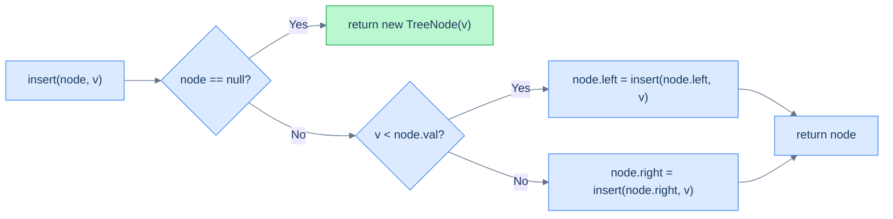
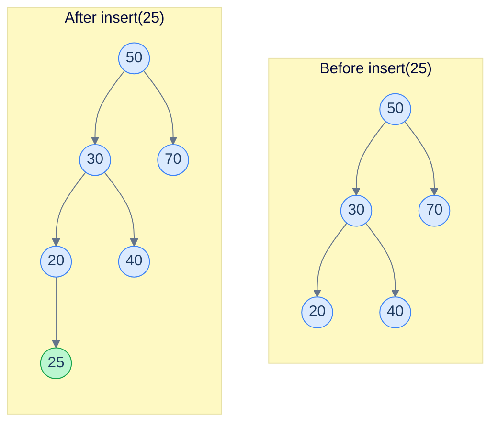
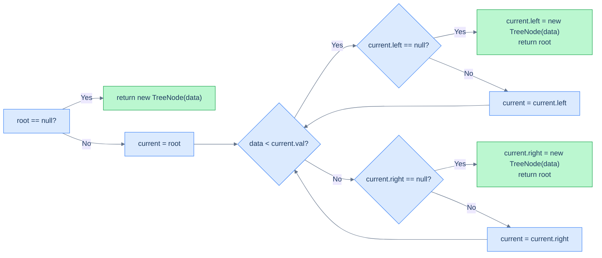

# 5. Insertion in Binary Search Trees

## The Hook

So far, we've only *read* from a BST — search, min, max, lower bound, upper bound. The tree was a fixed object we descended into. Now we make it **alive**: every insertion has to slot a new value into the tree *while preserving* the binary search property at every node it touches.

Here's the beautiful part: insertion is *almost free*. We've already done the hard work in lessons 3 and 4. Searching for a value that *isn't* there walks all the way down to a `null` leaf — and **that is the exact slot the new node belongs in**. So insertion = search + one pointer assignment.

This lesson covers the recursive and iterative versions. Both run in O(h), both touch a single root-to-leaf path, and both let us turn a static structure into a dynamic one.

---

## Table of Contents

1. [Understanding recursive insertion](#understanding-recursive-insertion)
2. [Recursive insertion](#recursive-insertion)
3. [Understanding iterative insertion](#understanding-iterative-insertion)
4. [Iterative insertion](#iterative-insertion)

***

# Understanding recursive insertion

To insert a value `v` into a BST, do the following thought experiment: *pretend* `v` is already in the tree, and search for it. Where does the search end? At a `null` child of some node — the *only* place `v` could legally live without breaking the BST rule. That's where you create the new node.

> Insertion = search + create new node at the slot where the search runs out.

## Algorithm

The recursive version is a two-step process expressed as a single function:

> **Algorithm**
>
> - **Step 1:** If the `current` node is `null`, create a new node with the given value and return it.
> - **Step 2:** If the new value is less than `current.val`, recurse on the **left** subtree, then store the result back into `current.left`.
> - **Step 3:** Else recurse on the **right** subtree, store the result back into `current.right`.
> - **Step 4:** Return `current`.

The "store the result back" step is the key trick: every recursive call returns *the (possibly new) subtree*, and the parent uses that return value to update its child pointer. When we hit the null slot, we return a freshly allocated node — and the parent's `current.left = ...` (or `.right = ...`) wires it in.



<p align="center"><strong>The recursive insertion equation. The base case <em>creates</em> the new node; every other case wires the returned subtree back into the parent.</strong></p>

## A worked example

Insert `25` into the tree below.



<p align="center"><strong>Walk: <code>50</code> (25 &lt; 50, go left) → <code>30</code> (25 &lt; 30, go left) → <code>20</code> (25 &gt; 20, go right) → <code>null</code>. Allocate <code>25</code> as the right child of <code>20</code>.</strong></p>

The path the search would have taken — `50, 30, 20` — and the side it tried to step into — *right of 20* — together specify the exact insertion slot.

## Complexity

| Case | Time | Space |
|---|---|---|
| Best (balanced) | O(log n) | O(log n) |
| Worst (skewed) | O(n) | O(n) |

The space cost is the recursion stack along the descent path.

***

# Recursive insertion

## Problem Statement

Given the **root** of a binary search tree and a **data** value, insert a new node with the given value and return the root of the updated tree.

You must do this **recursively**.

### Example 1

> - **Input:** `root = [5, 4, 6, 2, null, null, 7]`, `data = 10`
> - **Output:** `[5, 4, 6, 2, null, null, 7, null, null, null, 10]`
> - **Explanation:** Walk: 5 (10 > 5, right) → 6 (10 > 6, right) → 7 (10 > 7, right) → null. Insert 10 as right child of 7.

### Example 2

> - **Input:** `root = [10, 8, 14, 5, null, 12, 17]`, `data = 9`
> - **Output:** `[10, 8, 14, 5, 9, 12, 17]`
> - **Explanation:** Walk: 10 (9 < 10, left) → 8 (9 > 8, right) → null. Insert 9 as right child of 8.

## The Solution


```pseudocode
function recursiveInsert(root, data):
    if root is null:
        return new TreeNode(data)     # empty slot — this is exactly where data belongs
    if data < root.val:
        root.left ← recursiveInsert(root.left, data)   # BST rule: smaller goes left
    else:
        root.right ← recursiveInsert(root.right, data) # equal-or-greater goes right
    return root                       # re-attach the (possibly new) subtree to the parent
```

```python run
class Solution:
    def recursive_insertion(self, root, data):
        # Base case: empty slot — this is where data belongs.
        if root is None:
            return TreeNode(data)
        # BST rule: smaller values live in the left subtree.
        if data < root.val:
            root.left = self.recursive_insertion(root.left, data)
        else:
            # Equal-or-greater goes right. (Many libraries reject duplicates instead;
            # this version permits them by sending equality to the right subtree.)
            root.right = self.recursive_insertion(root.right, data)
        # Return the (possibly unchanged) subtree so the parent can re-attach it.
        return root
```

```java run
public class Main {
    static class TreeNode { int val; TreeNode left, right; TreeNode(int v){val=v;} }

    static class Solution {
        public TreeNode recursiveInsertion(TreeNode root, int data) {
            if (root == null) return new TreeNode(data);                            // empty slot
            if (data < root.val)
                root.left  = recursiveInsertion(root.left,  data);                  // BST rule: left
            else
                root.right = recursiveInsertion(root.right, data);                  //          right
            return root;                                                            // re-attach
        }
    }

    public static void main(String[] args) {
        TreeNode root = new TreeNode(5);
        root.left  = new TreeNode(4); root.right = new TreeNode(6);
        root.left.left  = new TreeNode(2);
        root.right.right = new TreeNode(7);
        TreeNode result = new Solution().recursiveInsertion(root, 10);
        System.out.println(result.right.right.right.val);  // 10
    }
}
```

```c run
#include <stdlib.h>

struct TreeNode *recursiveInsertion(struct TreeNode *root, int data) {
    if (root == NULL) {                                                         // empty slot
        struct TreeNode *node = malloc(sizeof(*node));
        node->val = data; node->left = node->right = NULL;
        return node;
    }
    if (data < root->val)
        root->left  = recursiveInsertion(root->left,  data);                    // BST rule: left
    else
        root->right = recursiveInsertion(root->right, data);                    //          right
    return root;                                                                // re-attach
}
```

```scala run
class TreeNode(var value: Int, var left: TreeNode = null, var right: TreeNode = null)

object Main extends App {
  class Solution {
    def recursiveInsertion(root: TreeNode, data: Int): TreeNode = {
      if (root == null) new TreeNode(data)                                          // empty slot
      else {
        if (data < root.value) root.left  = recursiveInsertion(root.left,  data)    // BST rule: left
        else                   root.right = recursiveInsertion(root.right, data)    //          right
        root                                                                        // re-attach
      }
    }
  }

  val root = new TreeNode(5,
    new TreeNode(4, new TreeNode(2), null),
    new TreeNode(6, null, new TreeNode(7)))
  val result = new Solution().recursiveInsertion(root, 10)
  println(result.right.right.right.value)  // 10
}
```


***

# Understanding iterative insertion

The iterative version is the same descent, but instead of letting recursion remember the parent pointer, we keep a `current` pointer and look one step ahead before descending.

## Algorithm

> **Algorithm**
>
> - **Step 1:** If `root` is `null`, create and return a new node — done.
> - **Step 2:** Let `current = root`.
> - **Step 3:** Loop:
>   - If `data < current.val`:
>     - If `current.left == null`, set `current.left = new TreeNode(data)`, return root.
>     - Else `current = current.left`.
>   - Else:
>     - If `current.right == null`, set `current.right = new TreeNode(data)`, return root.
>     - Else `current = current.right`.
> - **Step 4:** Return `root`.

The trick is checking the *child* before stepping into it. If the child is `null`, that's the slot — attach the new node and return. Otherwise, descend.



<p align="center"><strong>Iterative insertion descends until it finds a null child. The new node attaches to the current node directly — no extra memory beyond a single pointer.</strong></p>

## Complexity

| Case | Time | Space |
|---|---|---|
| Best (balanced) | O(log n) | **O(1)** |
| Worst (skewed) | O(n) | **O(1)** |

Same time as recursive, but constant extra space — no call stack to worry about.

***

# Iterative insertion

## Problem Statement

Given the **root** of a binary search tree and a **data** value, insert a new node with the given value and return the root of the updated tree.

You must do this **iteratively**.

### Example 1

> - **Input:** `root = [5, 4, 6, 2, null, null, 7]`, `data = 10`
> - **Output:** `[5, 4, 6, 2, null, null, 7, null, null, null, 10]`

### Example 2

> - **Input:** `root = [10, 8, 14, 5, null, 12, 17]`, `data = 9`
> - **Output:** `[10, 8, 14, 5, 9, 12, 17]`

## The Solution


```pseudocode
function iterativeInsert(root, data):
    newNode ← new TreeNode(data)
    if root is null:
        return newNode                # empty tree — new node becomes root
    cur ← root
    while true:
        if data < cur.val:
            if cur.left is null:
                cur.left ← newNode   # found the empty slot on the left
                return root
            cur ← cur.left           # not null — keep descending
        else:
            if cur.right is null:
                cur.right ← newNode  # found the empty slot on the right
                return root
            cur ← cur.right          # not null — keep descending
```

```python run
class Solution:
    def iterative_insertion(self, root, data):
        # Empty tree → the new node becomes the root.
        if root is None:
            return TreeNode(data)

        current = root
        while True:
            # Descend in the BST direction; check the child *before* stepping in.
            if data < current.val:
                if current.left is None:
                    # Found an empty slot on the left — wire the new node in.
                    current.left = TreeNode(data)
                    return root
                current = current.left            # otherwise descend left
            else:
                if current.right is None:
                    # Empty slot on the right — wire it in.
                    current.right = TreeNode(data)
                    return root
                current = current.right           # otherwise descend right
```

```java run
public class Main {
    static class TreeNode { int val; TreeNode left, right; TreeNode(int v){val=v;} }

    static class Solution {
        public TreeNode iterativeInsertion(TreeNode root, int data) {
            if (root == null) return new TreeNode(data);                                // empty tree
            TreeNode current = root;
            while (true) {
                if (data < current.val) {                                               // go left
                    if (current.left == null) {                                         // empty slot
                        current.left = new TreeNode(data);
                        return root;
                    }
                    current = current.left;                                             // descend left
                } else {                                                                // go right
                    if (current.right == null) {                                        // empty slot
                        current.right = new TreeNode(data);
                        return root;
                    }
                    current = current.right;                                            // descend right
                }
            }
        }
    }

    public static void main(String[] args) {
        TreeNode root = new TreeNode(5);
        root.left  = new TreeNode(4); root.right = new TreeNode(6);
        root.left.left  = new TreeNode(2);
        root.right.right = new TreeNode(7);
        TreeNode result = new Solution().iterativeInsertion(root, 10);
        System.out.println(result.right.right.right.val);  // 10
    }
}
```

```c run
#include <stdlib.h>

static struct TreeNode *make_node(int v) {
    struct TreeNode *node = malloc(sizeof(*node));
    node->val = v; node->left = node->right = NULL;
    return node;
}

struct TreeNode *iterativeInsertion(struct TreeNode *root, int data) {
    if (root == NULL) return make_node(data);                                        // empty tree
    struct TreeNode *current = root;
    for (;;) {
        if (data < current->val) {                                                   // go left
            if (current->left == NULL) {                                             // empty slot
                current->left = make_node(data);
                return root;
            }
            current = current->left;                                                 // descend left
        } else {                                                                     // go right
            if (current->right == NULL) {                                            // empty slot
                current->right = make_node(data);
                return root;
            }
            current = current->right;                                                // descend right
        }
    }
}
```

```scala run
class TreeNode(var value: Int, var left: TreeNode = null, var right: TreeNode = null)

object Main extends App {
  class Solution {
    def iterativeInsertion(root: TreeNode, data: Int): TreeNode = {
      if (root == null) return new TreeNode(data)                                          // empty tree
      var current = root
      while (true) {
        if (data < current.value) {                                                        // go left
          if (current.left == null) {                                                      // empty slot
            current.left = new TreeNode(data)
            return root
          }
          current = current.left                                                           // descend left
        } else {                                                                           // go right
          if (current.right == null) {                                                     // empty slot
            current.right = new TreeNode(data)
            return root
          }
          current = current.right                                                          // descend right
        }
      }
      root  // unreachable; appeases the compiler
    }
  }

  val root = new TreeNode(5,
    new TreeNode(4, new TreeNode(2), null),
    new TreeNode(6, null, new TreeNode(7)))
  val result = new Solution().iterativeInsertion(root, 10)
  println(result.right.right.right.value)  // 10
}
```


<details>
<summary><strong>Trace — root = [50, 30, 70, 20, 40], data = 25</strong></summary>

```
Step 1 │ current = 50 │ 25 < 50  → check current.left (30) → not null → current = 30
Step 2 │ current = 30 │ 25 < 30  → check current.left (20) → not null → current = 20
Step 3 │ current = 20 │ 25 ≥ 20  → check current.right (null) → SLOT FOUND
        attach: 20.right = new TreeNode(25)
Result: tree now has 25 as the right child of 20 ✓
```

</details>

***

## Final Takeaway

Insertion in a BST is just **search that doesn't fail** — instead of returning `null` when the descent walks off the tree, we *create a node* and wire it into the parent's child pointer. Single root-to-leaf path. O(h) time. The recursive version returns the (possibly new) subtree at every level so the parent can re-attach it; the iterative version peeks at the child before descending so it can attach in-place.

Two patterns worth keeping:

1. **Search that creates on miss** — the same shape powers insert in tries, hash chains, and even disk B-trees.
2. **"Return the subtree, parent re-attaches"** — a recursion idiom you'll use again in deletion (next lesson) and in tree-reshaping problems generally.

Two non-obvious points to remember:

- **Insertion order matters.** Inserting the same set of values in different orders gives different tree shapes — *and* different heights. Sorted input → skewed disaster. Random input → roughly balanced. We'll quantify this in the next lesson on construction.
- **Duplicates have no canonical home.** Some libraries reject them, some send them right (this lesson), some send them left, some allow multi-sets. Whichever rule you pick, *be consistent* — every operation (insert, delete, search) must agree.

Now that we can grow a BST, the next reasonable question is: how do we *shrink* it? Removing a value is much trickier than adding one — especially when the doomed node has two children. That's the next lesson.
