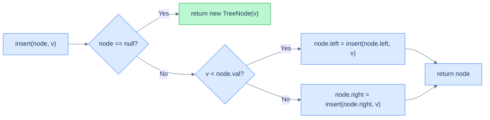
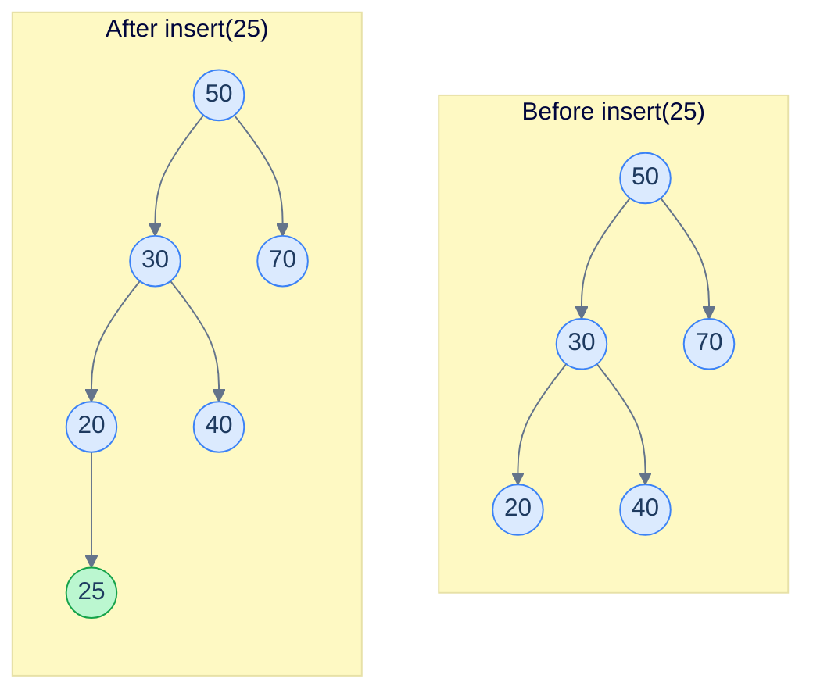
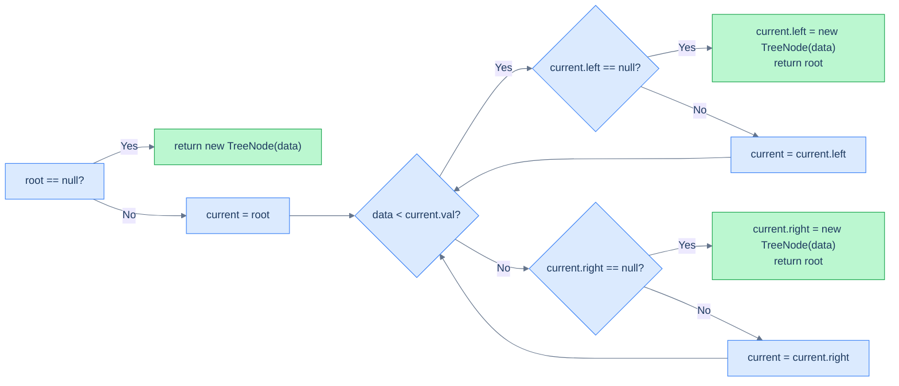

# 5. Insertion in Binary Search Trees

## The Hook

So far, we've only *read* from a BST — search, min, max, lower bound, upper bound. The tree was a fixed object we descended into. Now we make it **alive**: every insertion has to slot a new value into the tree *while preserving* the binary search property at every node it touches.

Here's the beautiful part: insertion is *almost free*. We've already done the hard work in lessons 3 and 4. Searching for a value that *isn't* there walks all the way down to a `null` leaf — and **that is the exact slot the new node belongs in**. So insertion = search + one pointer assignment.

This lesson covers the recursive and iterative versions. Both run in O(h), both touch a single root-to-leaf path, and both let us turn a static structure into a dynamic one.

---

## Table of Contents

1. [Understanding recursive insertion](#understanding-recursive-insertion)
2. [Recursive insertion](#recursive-insertion)
3. [Understanding iterative insertion](#understanding-iterative-insertion)
4. [Iterative insertion](#iterative-insertion)

***

# Understanding recursive insertion

To insert a value `v` into a BST, do the following thought experiment: *pretend* `v` is already in the tree, and search for it. Where does the search end? At a `null` child of some node — the *only* place `v` could legally live without breaking the BST rule. That's where you create the new node.

> Insertion = search + create new node at the slot where the search runs out.

## Algorithm

The recursive version is a two-step process expressed as a single function:

> **Algorithm**
>
> - **Step 1:** If the `current` node is `null`, create a new node with the given value and return it.
> - **Step 2:** If the new value is less than `current.val`, recurse on the **left** subtree, then store the result back into `current.left`.
> - **Step 3:** Else recurse on the **right** subtree, store the result back into `current.right`.
> - **Step 4:** Return `current`.

The "store the result back" step is the key trick: every recursive call returns *the (possibly new) subtree*, and the parent uses that return value to update its child pointer. When we hit the null slot, we return a freshly allocated node — and the parent's `current.left = ...` (or `.right = ...`) wires it in.



<p align="center"><strong>The recursive insertion equation. The base case <em>creates</em> the new node; every other case wires the returned subtree back into the parent.</strong></p>

## A worked example

Insert `25` into the tree below.



<p align="center"><strong>Walk: <code>50</code> (25 &lt; 50, go left) → <code>30</code> (25 &lt; 30, go left) → <code>20</code> (25 &gt; 20, go right) → <code>null</code>. Allocate <code>25</code> as the right child of <code>20</code>.</strong></p>

The path the search would have taken — `50, 30, 20` — and the side it tried to step into — *right of 20* — together specify the exact insertion slot.

## Complexity

| Case | Time | Space |
|---|---|---|
| Best (balanced) | O(log n) | O(log n) |
| Worst (skewed) | O(n) | O(n) |

The space cost is the recursion stack along the descent path.

***

# Recursive insertion

## Problem Statement

Given the **root** of a binary search tree and a **data** value, insert a new node with the given value and return the root of the updated tree.

You must do this **recursively**.

### Example 1

> - **Input:** `root = [5, 4, 6, 2, null, null, 7]`, `data = 10`
> - **Output:** `[5, 4, 6, 2, null, null, 7, null, null, null, 10]`
> - **Explanation:** Walk: 5 (10 > 5, right) → 6 (10 > 6, right) → 7 (10 > 7, right) → null. Insert 10 as right child of 7.

### Example 2

> - **Input:** `root = [10, 8, 14, 5, null, 12, 17]`, `data = 9`
> - **Output:** `[10, 8, 14, 5, 9, 12, 17]`
> - **Explanation:** Walk: 10 (9 < 10, left) → 8 (9 > 8, right) → null. Insert 9 as right child of 8.

<details>
<summary><h2>The Solution</h2></summary>


```python run
from typing import Optional, List
from collections import deque


class TreeNode:
    def __init__(self, val=0, left=None, right=None):
        self.val = val
        self.left = left
        self.right = right


def from_level_order(values):
    """Build tree from list like [1, 2, 3, None, 4]. None means missing child."""
    if not values:
        return None
    root = TreeNode(values[0])
    queue = [root]
    i = 1
    while queue and i < len(values):
        node = queue.pop(0)
        if i < len(values) and values[i] is not None:
            node.left = TreeNode(values[i])
            queue.append(node.left)
        i += 1
        if i < len(values) and values[i] is not None:
            node.right = TreeNode(values[i])
            queue.append(node.right)
        i += 1
    return root


def to_level_order(root):
    if not root:
        return []
    result, q = [], deque([root])
    while q:
        node = q.popleft()
        result.append(node.val)
        if node.left:
            q.append(node.left)
        if node.right:
            q.append(node.right)
    return result


class Solution:
    def recursive_insertion(
        self, root: Optional[TreeNode], data: int
    ) -> Optional[TreeNode]:

        # If the root is None, it means the tree is empty,
        # so create a new node and return it as the new root
        if root is None:
            return TreeNode(data)

        # If the data is less than the value of the current root node,
        # it should be inserted in the left subtree of the current root
        if data < root.val:
            root.left = self.recursive_insertion(root.left, data)

        # If the data is greater than or equal to the value of the
        # current root node,it should be inserted in the right subtree
        # of the current root
        else:
            root.right = self.recursive_insertion(root.right, data)

        # Return the root of the tree after insertion
        return root


# Examples from the problem statement
t1 = from_level_order([5, 4, 6, 2, None, None, 7])
r1 = Solution().recursive_insertion(t1, 10)
print(to_level_order(r1))                          # [5, 4, 6, 2, 7, 10]

t2 = from_level_order([10, 8, 14, 5, None, 12, 17])
r2 = Solution().recursive_insertion(t2, 9)
print(to_level_order(r2))                          # [10, 8, 14, 5, 9, 12, 17]

# Edge cases
r3 = Solution().recursive_insertion(None, 5)       # insert into empty tree
print(to_level_order(r3))                          # [5]

t4 = TreeNode(10)                                  # single node, insert smaller
r4 = Solution().recursive_insertion(t4, 5)
print(to_level_order(r4))                          # [10, 5]

t5 = TreeNode(10)                                  # single node, insert larger
r5 = Solution().recursive_insertion(t5, 15)
print(to_level_order(r5))                          # [10, 15]

t6 = from_level_order([5, 3, 7])
r6 = Solution().recursive_insertion(t6, 1)         # insert at leftmost position
print(to_level_order(r6))                          # [5, 3, 7, 1]

t7 = from_level_order([5, 3, 7])
r7 = Solution().recursive_insertion(t7, 5)         # insert duplicate (goes right)
print(to_level_order(r7))                          # [5, 3, 7, 5]
```

```java run
import java.util.*;

public class Main {
    static class TreeNode {
        int val;
        TreeNode left;
        TreeNode right;
        TreeNode() {}
        TreeNode(int val) { this.val = val; }
    }

    static TreeNode fromLevelOrder(Integer... values) {
        if (values.length == 0 || values[0] == null) return null;
        TreeNode root = new TreeNode(values[0]);
        Deque<TreeNode> queue = new ArrayDeque<>();
        queue.add(root);
        int i = 1;
        while (!queue.isEmpty() && i < values.length) {
            TreeNode node = queue.poll();
            if (i < values.length && values[i] != null) {
                node.left = new TreeNode(values[i]);
                queue.add(node.left);
            }
            i++;
            if (i < values.length && values[i] != null) {
                node.right = new TreeNode(values[i]);
                queue.add(node.right);
            }
            i++;
        }
        return root;
    }

    static List<Integer> toLevelOrder(TreeNode root) {
        List<Integer> result = new ArrayList<>();
        if (root == null) return result;
        Deque<TreeNode> q = new ArrayDeque<>();
        q.add(root);
        while (!q.isEmpty()) {
            TreeNode node = q.poll();
            result.add(node.val);
            if (node.left != null) q.add(node.left);
            if (node.right != null) q.add(node.right);
        }
        return result;
    }

    static class Solution {
        public TreeNode recursiveInsertion(TreeNode root, int data) {

            // If the root is null, it means the tree is empty,
            // so create a new node and return it as the new root
            if (root == null) {
                return new TreeNode(data);
            }

            // If the data is less than the value of the current root node,
            // it should be inserted in the left subtree of the current root
            if (data < root.val) {
                root.left = recursiveInsertion(root.left, data);
            }

            // If the data is greater than or equal to the value of the
            // current root node,it should be inserted in the right subtree
            // of the current root
            else {
                root.right = recursiveInsertion(root.right, data);
            }

            // Return the root of the tree after insertion
            return root;
        }
    }

    public static void main(String[] args) {
        // Examples from the problem statement
        TreeNode t1 = fromLevelOrder(5, 4, 6, 2, null, null, 7);
        System.out.println(toLevelOrder(new Solution().recursiveInsertion(t1, 10)));  // [5, 4, 6, 2, 7, 10]

        TreeNode t2 = fromLevelOrder(10, 8, 14, 5, null, 12, 17);
        System.out.println(toLevelOrder(new Solution().recursiveInsertion(t2, 9)));   // [10, 8, 14, 5, 9, 12, 17]

        // Edge cases
        System.out.println(toLevelOrder(new Solution().recursiveInsertion(null, 5))); // [5]

        TreeNode t4 = new TreeNode(10);                                               // insert smaller
        System.out.println(toLevelOrder(new Solution().recursiveInsertion(t4, 5)));   // [10, 5]

        TreeNode t5 = new TreeNode(10);                                               // insert larger
        System.out.println(toLevelOrder(new Solution().recursiveInsertion(t5, 15)));  // [10, 15]

        TreeNode t6 = fromLevelOrder(5, 3, 7);
        System.out.println(toLevelOrder(new Solution().recursiveInsertion(t6, 1)));   // [5, 3, 7, 1]

        TreeNode t7 = fromLevelOrder(5, 3, 7);
        System.out.println(toLevelOrder(new Solution().recursiveInsertion(t7, 5)));   // [5, 3, 7, 5]
    }
}
```

</details>


***

# Understanding iterative insertion

The iterative version is the same descent, but instead of letting recursion remember the parent pointer, we keep a `current` pointer and look one step ahead before descending.

## Algorithm

> **Algorithm**
>
> - **Step 1:** If `root` is `null`, create and return a new node — done.
> - **Step 2:** Let `current = root`.
> - **Step 3:** Loop:
>   - If `data < current.val`:
>     - If `current.left == null`, set `current.left = new TreeNode(data)`, return root.
>     - Else `current = current.left`.
>   - Else:
>     - If `current.right == null`, set `current.right = new TreeNode(data)`, return root.
>     - Else `current = current.right`.
> - **Step 4:** Return `root`.

The trick is checking the *child* before stepping into it. If the child is `null`, that's the slot — attach the new node and return. Otherwise, descend.



<p align="center"><strong>Iterative insertion descends until it finds a null child. The new node attaches to the current node directly — no extra memory beyond a single pointer.</strong></p>

## Complexity

| Case | Time | Space |
|---|---|---|
| Best (balanced) | O(log n) | **O(1)** |
| Worst (skewed) | O(n) | **O(1)** |

Same time as recursive, but constant extra space — no call stack to worry about.

***

# Iterative insertion

## Problem Statement

Given the **root** of a binary search tree and a **data** value, insert a new node with the given value and return the root of the updated tree.

You must do this **iteratively**.

### Example 1

> - **Input:** `root = [5, 4, 6, 2, null, null, 7]`, `data = 10`
> - **Output:** `[5, 4, 6, 2, null, null, 7, null, null, null, 10]`

### Example 2

> - **Input:** `root = [10, 8, 14, 5, null, 12, 17]`, `data = 9`
> - **Output:** `[10, 8, 14, 5, 9, 12, 17]`

<details>
<summary><h2>The Solution</h2></summary>


```python run
from typing import Optional
from collections import deque


class TreeNode:
    def __init__(self, val=0, left=None, right=None):
        self.val = val
        self.left = left
        self.right = right


def from_level_order(values):
    """Build tree from list like [1, 2, 3, None, 4]. None means missing child."""
    if not values:
        return None
    root = TreeNode(values[0])
    queue = [root]
    i = 1
    while queue and i < len(values):
        node = queue.pop(0)
        if i < len(values) and values[i] is not None:
            node.left = TreeNode(values[i])
            queue.append(node.left)
        i += 1
        if i < len(values) and values[i] is not None:
            node.right = TreeNode(values[i])
            queue.append(node.right)
        i += 1
    return root


def to_level_order(root):
    if not root:
        return []
    result, queue = [], deque([root])
    while queue:
        node = queue.popleft()
        result.append(node.val)
        if node.left:
            queue.append(node.left)
        if node.right:
            queue.append(node.right)
    return result


class Solution:
    def iterative_insertion(
        self, root: Optional[TreeNode], data: int
    ) -> Optional[TreeNode]:

        # If the root is None, create a new node with data and make it
        # the root
        if root is None:
            return TreeNode(data)

        # Initialize a pointer current to traverse the tree starting
        # from the root
        current = root

        # Traverse the tree until we find the appropriate position to
        # insert the data
        while current:

            # If the data is less than the current node's value, move to
            # the left subtree
            if data < current.val:

                # If the left child of the current node is None, insert
                # data as the left child. Otherwise, move to the left
                # child and continue searching
                if current.left is None:
                    current.left = TreeNode(data)
                    return root

                # Move to the left child
                else:
                    current = current.left

            # If data is greater than or equal to the current node's
            # valueIf the right child of the current node is None,
            # insert data as the right child. Otherwise, move to the
            # right child and continue searching.
            else:
                if current.right is None:
                    current.right = TreeNode(data)
                    return root

                # Move to the right child
                else:
                    current = current.right

        # Return the root of the tree after all insertions
        return root


# Example 1: insert 10 into [5, 4, 6, 2, null, null, 7]
t1 = from_level_order([5, 4, 6, 2, None, None, 7])
print(to_level_order(Solution().iterative_insertion(t1, 10)))  # [5, 4, 6, 2, 7, 10]

# Example 2: insert 9 into [10, 8, 14, 5, null, 12, 17]
t2 = from_level_order([10, 8, 14, 5, None, 12, 17])
print(to_level_order(Solution().iterative_insertion(t2, 9)))   # [10, 8, 14, 5, 9, 12, 17]

# Insert into empty tree
print(to_level_order(Solution().iterative_insertion(None, 5))) # [5]

# Insert into single-node tree
t3 = TreeNode(10)
print(to_level_order(Solution().iterative_insertion(t3, 3)))   # [10, 3]

# Insert larger value into single-node tree
t4 = TreeNode(10)
print(to_level_order(Solution().iterative_insertion(t4, 15)))  # [10, 15]

# Insert into left-skew tree (all lefts)
t5 = from_level_order([10, 8, None, 6, None, 4])
print(to_level_order(Solution().iterative_insertion(t5, 5)))   # [10, 8, 6, 4, 5]

# Insert duplicate (goes right)
t6 = from_level_order([5, 3, 7])
print(to_level_order(Solution().iterative_insertion(t6, 5)))   # [5, 3, 7, 5]
```

```java run
import java.util.*;

public class Main {
    static class TreeNode {
        int val;
        TreeNode left;
        TreeNode right;
        TreeNode() {}
        TreeNode(int val) { this.val = val; }
    }

    static TreeNode fromLevelOrder(Integer... values) {
        if (values.length == 0 || values[0] == null) return null;
        TreeNode root = new TreeNode(values[0]);
        Deque<TreeNode> queue = new ArrayDeque<>();
        queue.add(root);
        int i = 1;
        while (!queue.isEmpty() && i < values.length) {
            TreeNode node = queue.poll();
            if (i < values.length && values[i] != null) {
                node.left = new TreeNode(values[i]);
                queue.add(node.left);
            }
            i++;
            if (i < values.length && values[i] != null) {
                node.right = new TreeNode(values[i]);
                queue.add(node.right);
            }
            i++;
        }
        return root;
    }

    static List<Integer> toLevelOrder(TreeNode root) {
        if (root == null) return new ArrayList<>();
        List<Integer> result = new ArrayList<>();
        Deque<TreeNode> queue = new ArrayDeque<>();
        queue.add(root);
        while (!queue.isEmpty()) {
            TreeNode node = queue.poll();
            result.add(node.val);
            if (node.left != null) queue.add(node.left);
            if (node.right != null) queue.add(node.right);
        }
        return result;
    }

    static class Solution {
        public TreeNode iterativeInsertion(TreeNode root, int data) {

            // If the root is null, create a new node with data and make it
            // the root
            if (root == null) {
                return new TreeNode(data);
            }

            // Initialize a pointer current to traverse the tree starting
            // from the root
            TreeNode current = root;

            // Traverse the tree until we find the appropriate position to
            // insert the data
            while (current != null) {

                // If the data is less than the current node's value, move to
                // the left subtree
                if (data < current.val) {

                    // If the left child of the current node is null, insert
                    // data as the left child. Otherwise, move to the left
                    // child and continue searching
                    if (current.left == null) {
                        current.left = new TreeNode(data);
                        return root;
                    }

                    // Move to the left child
                    else {
                        current = current.left;
                    }
                }

                // If data is greater than or equal to the current node's
                // valueIf the right child of the current node is null,
                // insert data as the right child. Otherwise, move to the
                // right child and continue searching.
                else {
                    if (current.right == null) {
                        current.right = new TreeNode(data);
                        return root;
                    }

                    // Move to the right child
                    else {
                        current = current.right;
                    }
                }
            }

            // Return the root of the tree after all insertions
            return root;
        }
    }

    public static void main(String[] args) {
        // Example 1: insert 10 into [5, 4, 6, 2, null, null, 7]
        TreeNode t1 = fromLevelOrder(5, 4, 6, 2, null, null, 7);
        System.out.println(toLevelOrder(new Solution().iterativeInsertion(t1, 10)));  // [5, 4, 6, 2, 7, 10]

        // Example 2: insert 9 into [10, 8, 14, 5, null, 12, 17]
        TreeNode t2 = fromLevelOrder(10, 8, 14, 5, null, 12, 17);
        System.out.println(toLevelOrder(new Solution().iterativeInsertion(t2, 9)));   // [10, 8, 14, 5, 9, 12, 17]

        // Insert into empty tree
        System.out.println(toLevelOrder(new Solution().iterativeInsertion(null, 5))); // [5]

        // Insert into single-node tree
        TreeNode t3 = new TreeNode(10);
        System.out.println(toLevelOrder(new Solution().iterativeInsertion(t3, 3)));   // [10, 3]

        // Insert larger value into single-node tree
        TreeNode t4 = new TreeNode(10);
        System.out.println(toLevelOrder(new Solution().iterativeInsertion(t4, 15)));  // [10, 15]

        // Insert into left-skew tree (all lefts)
        TreeNode t5 = fromLevelOrder(10, 8, null, 6, null, 4);
        System.out.println(toLevelOrder(new Solution().iterativeInsertion(t5, 5)));   // [10, 8, 6, 4, 5]

        // Insert duplicate (goes right)
        TreeNode t6 = fromLevelOrder(5, 3, 7);
        System.out.println(toLevelOrder(new Solution().iterativeInsertion(t6, 5)));   // [5, 3, 7, 5]
    }
}
```


<details>
<summary><strong>Trace — root = [50, 30, 70, 20, 40], data = 25</strong></summary>

```
Step 1 │ current = 50 │ 25 < 50  → check current.left (30) → not null → current = 30
Step 2 │ current = 30 │ 25 < 30  → check current.left (20) → not null → current = 20
Step 3 │ current = 20 │ 25 ≥ 20  → check current.right (null) → SLOT FOUND
        attach: 20.right = new TreeNode(25)
Result: tree now has 25 as the right child of 20 ✓
```

</details>

</details>
<details>
<summary><h2>Final Takeaway</h2></summary>


Insertion in a BST is just **search that doesn't fail** — instead of returning `null` when the descent walks off the tree, we *create a node* and wire it into the parent's child pointer. Single root-to-leaf path. O(h) time. The recursive version returns the (possibly new) subtree at every level so the parent can re-attach it; the iterative version peeks at the child before descending so it can attach in-place.

Two patterns worth keeping:

1. **Search that creates on miss** — the same shape powers insert in tries, hash chains, and even disk B-trees.
2. **"Return the subtree, parent re-attaches"** — a recursion idiom you'll use again in deletion (next lesson) and in tree-reshaping problems generally.

Two non-obvious points to remember:

- **Insertion order matters.** Inserting the same set of values in different orders gives different tree shapes — *and* different heights. Sorted input → skewed disaster. Random input → roughly balanced. We'll quantify this in the next lesson on construction.
- **Duplicates have no canonical home.** Some libraries reject them, some send them right (this lesson), some send them left, some allow multi-sets. Whichever rule you pick, *be consistent* — every operation (insert, delete, search) must agree.

Now that we can grow a BST, the next reasonable question is: how do we *shrink* it? Removing a value is much trickier than adding one — especially when the doomed node has two children. That's the next lesson.

</details>