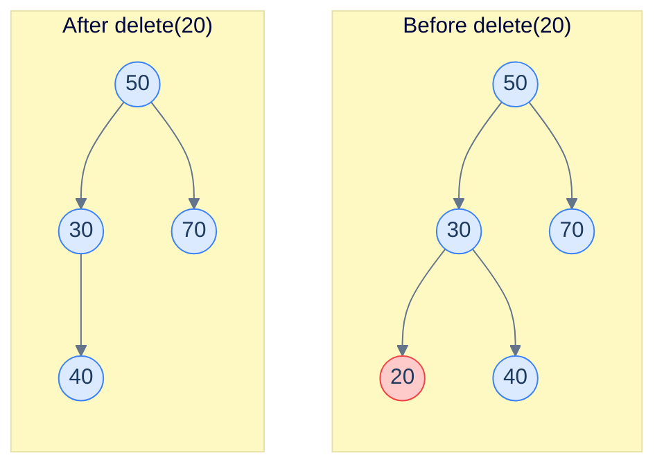
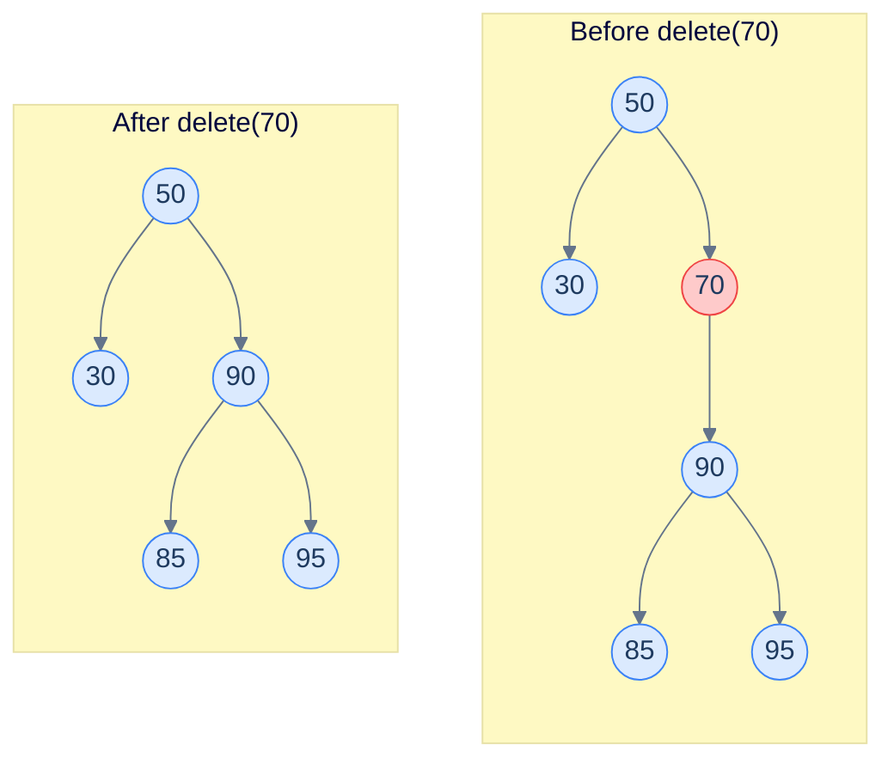
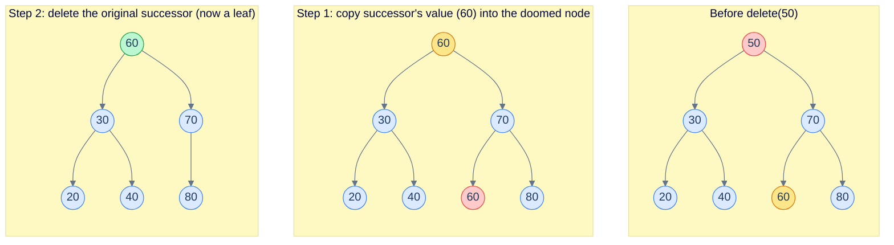
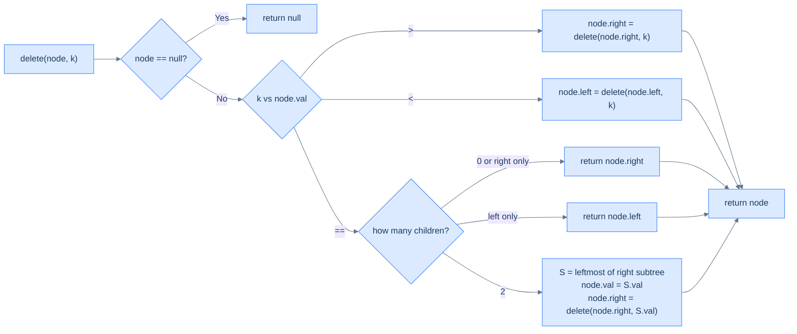
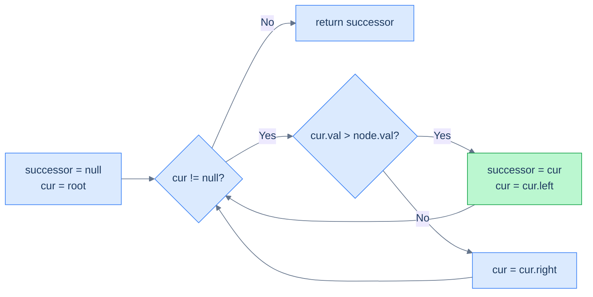
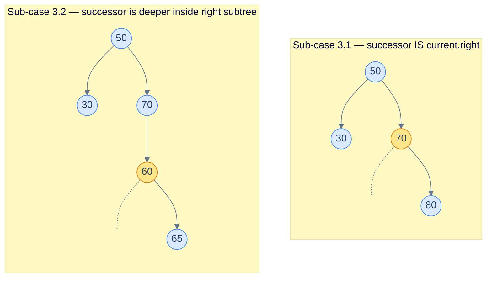

# 6. Deletion in Binary Search Trees

## The Hook

Inserting into a BST was almost free — the BST property pointed at one specific empty slot, and we put the new node there. **Deletion is harder, and dramatically more interesting.**

Pull a leaf out of a BST and nothing breaks. Pull a node with one child, and you can promote the child up one level. But pull a node with *two* children, and you've punched a hole in the middle of the tree — two orphaned subtrees, no obvious way to wire them back together while keeping the BST property intact.

The trick is gorgeous. Instead of physically removing the doomed node, we **swap its value with its in-order successor** (the next-larger value in the tree) and then delete *that* node from the right subtree — which is provably easier, because the in-order successor is always at most a one-child case in disguise.

This lesson works through all three cases (leaf / one child / two children), in both recursive and iterative form. By the end, you'll be able to remove any value from a BST and convince yourself the BST property still holds at every node.

---

## Table of Contents

1. [Understanding recursive deletion](#understanding-recursive-deletion)
2. [Inorder successor](#inorder-successor)
3. [Recursive deletion](#recursive-deletion)
4. [Understanding iterative deletion](#understanding-iterative-deletion)
5. [Iterative deletion](#iterative-deletion)

***

# Understanding recursive deletion

Like insertion, deletion is a two-step process: find the node, then remove it. The "find" step is the same descent we've used five times now. The "remove" step is the new content of this lesson, and it splits into three cases based on how many children the doomed node has.

## Case 1 — Node to be deleted is a leaf

A leaf node has no children. Cutting it off is trivial: set the parent's pointer to `null` (or, equivalently, return `null` to the parent's recursive call) and the BST property is preserved everywhere else.



<p align="center"><strong>Removing a leaf is just removing one pointer. The BST property holds everywhere else by inheritance.</strong></p>

## Case 2 — Node to be deleted has exactly one child

If the doomed node has only one child, we **promote** the child up one level: the parent's link to the doomed node becomes a link to the child instead. The BST property is preserved because the child's subtree was already entirely on the correct side of the parent.



<p align="center"><strong>Removing <code>70</code> (which has only a right child <code>90</code>): re-wire <code>50.right</code> directly to <code>90</code>. The whole subtree under <code>90</code> was already legal w.r.t. <code>50</code>, so nothing else needs to change.</strong></p>

## Case 3 — Node to be deleted has two children

This is the genuinely interesting case. The doomed node has two non-empty subtrees, and removing it would orphan both. We can't promote both, and we can't pick one without losing the other.

The trick: don't physically delete the node. Replace its **value** with the value that should logically come next in sorted order — its **in-order successor** — and then delete *the successor's original position* from the right subtree. Because the in-order successor is always the leftmost node of the right subtree, it has *at most one child* (a right child, or no child at all), so deleting it falls back to Case 1 or Case 2.

> **Key fact:** the in-order successor of a node `N` with two children is always the **smallest node in `N`'s right subtree** — i.e. the leftmost node of the right subtree. And that leftmost node has no left child (otherwise it wouldn't be leftmost), so it falls into Case 1 or Case 2 — never another Case 3.



<p align="center"><strong>Deleting <code>50</code> (two children): copy in-order successor <code>60</code>'s value over <code>50</code>, then delete the original <code>60</code> from the right subtree. The original <code>60</code> was a leaf — Case 1 — so the recursive delete is trivial.</strong></p>

> **Why delete from the right subtree after swapping?**
> Because that's where the duplicate now lives. After we copy the successor's value into the doomed node, the *value* we want to delete still exists once in the tree — at the successor's original position. We recursively delete it from the right subtree, where it's guaranteed to be in Case 1 or Case 2.

## Algorithm

> **Algorithm**
>
> - **Step 1:** If the `current` node is `null`, return `null`.
> - **Step 2:** If `key > current.val`, recurse on the right subtree.
> - **Step 3:** Else if `key < current.val`, recurse on the left subtree.
> - **Step 4:** Else (`key == current.val`):
>   - **4.1.** If `current.left == null`, return `current.right` (Case 1 or 2).
>   - **4.2.** Else if `current.right == null`, return `current.left` (Case 2).
>   - **4.3.** Else (Case 3):
>     - Find the in-order successor `S` (smallest node in the right subtree).
>     - Copy `S.val` into `current.val`.
>     - Recursively delete `S.val` from the right subtree.
> - **Step 5:** Return `current` (or its replacement).



<p align="center"><strong>Recursive deletion: descend like search, then handle 3 cases at the matching node. Each recursive call returns the (possibly replaced) subtree, which the parent re-attaches.</strong></p>

## Complexity

| Case | Time | Space |
|---|---|---|
| Best (balanced) | O(log n) | O(log n) |
| Worst (skewed) | O(n) | O(n) |

Time is dominated by the descent + the in-order-successor walk in Case 3, both of which are bounded by the tree height. Space is the recursion stack.

***

# Inorder successor

The in-order successor problem appears as a sub-problem in deletion, and it is also useful in its own right (cursor "next" operations on a BST iterator).

## Problem Statement

Given the **root** of a binary search tree and a random **node** in the tree, find and return the inorder successor of the node. Return `null` if no in-order successor exists.

> The inorder successor of a node is the node that comes just after the given node in the inorder traversal sequence of the binary tree.

### Example 1

> - **Input:** `root = [5, 4, 6, 2, null, null, 7]`, `node = 4`
> - **Output:** `5`

### Example 2

> - **Input:** `root = [10, 8, 14, 5, null, 12, 17]`, `node = 10`
> - **Output:** `12`

<details>
<summary><h2>The Strategy</h2></summary>


Two cases:

1. **The given node has a right subtree.** The successor is the leftmost node of that right subtree (it's the smallest value greater than `node.val`).
2. **The given node has no right subtree.** The successor is the lowest *ancestor* `A` such that `A.val > node.val` — the first time you turned *left* on the way down to the node.

The clean implementation handles *both* cases in a single descent from the root: at each step, if the current node's value is `> node.val`, record it as a candidate and go left; otherwise go right. When the descent ends, the recorded candidate is the answer.



<p align="center"><strong>Single-pass in-order successor: same shape as upper bound — track the smallest value strictly greater than the given one.</strong></p>

</details>
<details>
<summary><h2>The Solution</h2></summary>


```python run
from typing import Optional
from collections import deque


class TreeNode:
    def __init__(self, val=0, left=None, right=None):
        self.val = val
        self.left = left
        self.right = right


def from_level_order(values):
    """Build tree from list like [1, 2, 3, None, 4]. None means missing child."""
    if not values:
        return None
    root = TreeNode(values[0])
    queue = [root]
    i = 1
    while queue and i < len(values):
        node = queue.pop(0)
        if i < len(values) and values[i] is not None:
            node.left = TreeNode(values[i])
            queue.append(node.left)
        i += 1
        if i < len(values) and values[i] is not None:
            node.right = TreeNode(values[i])
            queue.append(node.right)
        i += 1
    return root


def find_node(root, val):
    while root:
        if val == root.val:
            return root
        elif val < root.val:
            root = root.left
        else:
            root = root.right
    return None


class Solution:
    def inorder_successor(
        self, root: Optional[TreeNode], node: Optional[TreeNode]
    ) -> Optional[TreeNode]:

        # Initialize the successor as None
        successor = None

        while root is not None:

            # If the current node's value is greater than the given
            # node's value
            if root.val > node.val:

                # Set the current node as the potential successor
                successor = root

                # Move to the left subtree since the successor will be
                # in the left subtree
                root = root.left

            # If the current node's value is less than or equal to the
            # given node's value, move to the right subtree as the
            # successor cannot be in the current node
            else:
                root = root.right

        # Return the found successor
        return successor


# Example 1: successor of node 4 in [5, 4, 6, 2, null, null, 7]
t1 = from_level_order([5, 4, 6, 2, None, None, 7])
n1 = find_node(t1, 4)
res = Solution().inorder_successor(t1, n1)
print(res.val if res else None)   # 5

# Example 2: successor of node 10 in [10, 8, 14, 5, null, 12, 17]
t2 = from_level_order([10, 8, 14, 5, None, 12, 17])
n2 = find_node(t2, 10)
res2 = Solution().inorder_successor(t2, n2)
print(res2.val if res2 else None)  # 12

# Successor of the maximum node (no successor)
t3 = from_level_order([5, 4, 6, 2, None, None, 7])
n3 = find_node(t3, 7)
res3 = Solution().inorder_successor(t3, n3)
print(res3.val if res3 else None)  # None

# Successor of root in a 3-node tree [5, 3, 7]
t4 = from_level_order([5, 3, 7])
n4 = find_node(t4, 5)
res4 = Solution().inorder_successor(t4, n4)
print(res4.val if res4 else None)  # 7

# Successor of a leaf that has an ancestor as successor
t5 = from_level_order([10, 8, 14, 5, None, 12, 17])
n5 = find_node(t5, 8)
res5 = Solution().inorder_successor(t5, n5)
print(res5.val if res5 else None)  # 10

# Successor in right-skew tree
t6 = from_level_order([1, None, 3, None, 5])
n6 = find_node(t6, 3)
res6 = Solution().inorder_successor(t6, n6)
print(res6.val if res6 else None)  # 5

# Single-node tree — no successor
t7 = TreeNode(42)
n7 = find_node(t7, 42)
res7 = Solution().inorder_successor(t7, n7)
print(res7.val if res7 else None)  # None
```

```java run
import java.util.*;

public class Main {
    static class TreeNode {
        int val;
        TreeNode left;
        TreeNode right;
        TreeNode() {}
        TreeNode(int val) { this.val = val; }
    }

    static TreeNode fromLevelOrder(Integer... values) {
        if (values.length == 0 || values[0] == null) return null;
        TreeNode root = new TreeNode(values[0]);
        Deque<TreeNode> queue = new ArrayDeque<>();
        queue.add(root);
        int i = 1;
        while (!queue.isEmpty() && i < values.length) {
            TreeNode node = queue.poll();
            if (i < values.length && values[i] != null) {
                node.left = new TreeNode(values[i]);
                queue.add(node.left);
            }
            i++;
            if (i < values.length && values[i] != null) {
                node.right = new TreeNode(values[i]);
                queue.add(node.right);
            }
            i++;
        }
        return root;
    }

    static TreeNode findNode(TreeNode root, int val) {
        while (root != null) {
            if (val == root.val) return root;
            else if (val < root.val) root = root.left;
            else root = root.right;
        }
        return null;
    }

    static class Solution {
        public TreeNode inorderSuccessor(TreeNode root, TreeNode node) {

            // Initialize the successor as null
            TreeNode successor = null;

            while (root != null) {

                // If the current node's value is greater than the given
                // node's value
                if (root.val > node.val) {

                    // Set the current node as the potential successor
                    successor = root;

                    // Move to the left subtree since the successor will be
                    // in the left subtree
                    root = root.left;
                }

                // If the current node's value is less than or equal to the
                // given node's value, move to the right subtree as the
                // successor cannot be in the current node
                else {
                    root = root.right;
                }
            }

            // Return the found successor
            return successor;
        }
    }

    public static void main(String[] args) {
        // Example 1: successor of node 4 in [5, 4, 6, 2, null, null, 7]
        TreeNode t1 = fromLevelOrder(5, 4, 6, 2, null, null, 7);
        TreeNode n1 = findNode(t1, 4);
        TreeNode r1 = new Solution().inorderSuccessor(t1, n1);
        System.out.println(r1 != null ? r1.val : null);   // 5

        // Example 2: successor of node 10 in [10, 8, 14, 5, null, 12, 17]
        TreeNode t2 = fromLevelOrder(10, 8, 14, 5, null, 12, 17);
        TreeNode n2 = findNode(t2, 10);
        TreeNode r2 = new Solution().inorderSuccessor(t2, n2);
        System.out.println(r2 != null ? r2.val : null);   // 12

        // Successor of the maximum node (no successor)
        TreeNode t3 = fromLevelOrder(5, 4, 6, 2, null, null, 7);
        TreeNode n3 = findNode(t3, 7);
        TreeNode r3 = new Solution().inorderSuccessor(t3, n3);
        System.out.println(r3 != null ? r3.val : null);   // null

        // Successor of root in a 3-node tree [5, 3, 7]
        TreeNode t4 = fromLevelOrder(5, 3, 7);
        TreeNode n4 = findNode(t4, 5);
        TreeNode r4 = new Solution().inorderSuccessor(t4, n4);
        System.out.println(r4 != null ? r4.val : null);   // 7

        // Successor of a leaf that has an ancestor as successor
        TreeNode t5 = fromLevelOrder(10, 8, 14, 5, null, 12, 17);
        TreeNode n5 = findNode(t5, 8);
        TreeNode r5 = new Solution().inorderSuccessor(t5, n5);
        System.out.println(r5 != null ? r5.val : null);   // 10

        // Successor in right-skew tree
        TreeNode t6 = fromLevelOrder(1, null, 3, null, 5);
        TreeNode n6 = findNode(t6, 3);
        TreeNode r6 = new Solution().inorderSuccessor(t6, n6);
        System.out.println(r6 != null ? r6.val : null);   // 5

        // Single-node tree — no successor
        TreeNode t7 = new TreeNode(42);
        TreeNode r7 = new Solution().inorderSuccessor(t7, t7);
        System.out.println(r7 != null ? r7.val : null);   // null
    }
}
```

</details>


***

# Recursive deletion

## Problem Statement

Given the **root** of a binary search tree and an integer **key**, delete the node with the given value from the tree and return the modified root.

You must do this **recursively**.

### Example 1

> - **Input:** `root = [5, 4, 6, 2, null, null, 7]`, `key = 6`
> - **Output:** `[5, 4, 7, 2]`

### Example 2

> - **Input:** `root = [10, 8, 14, 5, null, 12, 17]`, `key = 14`
> - **Output:** `[10, 8, 17, 5, null, 12]`

<details>
<summary><h2>The Solution</h2></summary>


```python run
from typing import Optional
from collections import deque


class TreeNode:
    def __init__(self, val=0, left=None, right=None):
        self.val = val
        self.left = left
        self.right = right


def from_level_order(values):
    """Build tree from list like [1, 2, 3, None, 4]. None means missing child."""
    if not values:
        return None
    root = TreeNode(values[0])
    queue = [root]
    i = 1
    while queue and i < len(values):
        node = queue.pop(0)
        if i < len(values) and values[i] is not None:
            node.left = TreeNode(values[i])
            queue.append(node.left)
        i += 1
        if i < len(values) and values[i] is not None:
            node.right = TreeNode(values[i])
            queue.append(node.right)
        i += 1
    return root


def to_level_order(root):
    if not root:
        return []
    result, queue = [], deque([root])
    while queue:
        node = queue.popleft()
        result.append(node.val)
        if node.left:
            queue.append(node.left)
        if node.right:
            queue.append(node.right)
    return result


class Solution:
    def inorder_successor(
        self, root: Optional[TreeNode], node: Optional[TreeNode]
    ) -> Optional[TreeNode]:
        successor = None

        while root is not None:
            if root.val > node.val:
                successor = root
                root = root.left
            else:
                root = root.right

        return successor

    def recursive_deletion(
        self, root: Optional[TreeNode], key: int
    ) -> Optional[TreeNode]:

        # Base case: if the root is null, return null
        if root is None:
            return None

        # If the key is greater than the current node's value, search in
        # the right subtree
        if key > root.val:
            root.right = self.recursive_deletion(root.right, key)

        # If the key is smaller than the current node's value, search in
        # the left subtree
        elif key < root.val:
            root.left = self.recursive_deletion(root.left, key)

        # If the key matches the current node's value, found the node
        # to delete
        else:

            # Case 1: Node has no left child
            if root.left is None:

                # Save the right child of the current node
                temp = root.right

                # Delete the current node
                root = None

                # Return the right child to reconnect it with the parent
                return temp

            # Case 2: Node has no right child
            elif root.right is None:

                # Save the left child of the current node
                temp = root.left

                # Delete the current node
                root = None

                # Return the left child to reconnect it with the parent
                return temp

            # Case 3: Node has both left and right children
            else:

                # Find inorder successor of the node (smallest value in
                # right subtree)
                successor = self.inorder_successor(root.right, root)

                # Copy successor's value to current node
                root.val = successor.val

                # Delete successor
                root.right = self.recursive_deletion(
                    root.right, successor.val
                )

        # Return the updated root node of the binary search tree
        return root


# Example 1: delete 6 from [5, 4, 6, 2, null, null, 7]
t1 = from_level_order([5, 4, 6, 2, None, None, 7])
print(to_level_order(Solution().recursive_deletion(t1, 6)))    # [5, 4, 7, 2]

# Example 2: delete 14 from [10, 8, 14, 5, null, 12, 17]
t2 = from_level_order([10, 8, 14, 5, None, 12, 17])
print(to_level_order(Solution().recursive_deletion(t2, 14)))   # [10, 8, 17, 5, 12]

# Delete leaf node
t3 = from_level_order([5, 3, 7])
print(to_level_order(Solution().recursive_deletion(t3, 3)))    # [5, 7]

# Delete node with only right child
t4 = from_level_order([5, 3, 7, None, 4])
print(to_level_order(Solution().recursive_deletion(t4, 3)))    # [5, 4, 7]

# Delete root of single-node tree
t5 = TreeNode(5)
print(to_level_order(Solution().recursive_deletion(t5, 5)))    # []

# Delete non-existent key (tree unchanged)
t6 = from_level_order([5, 3, 7])
print(to_level_order(Solution().recursive_deletion(t6, 99)))   # [5, 3, 7]

# Delete root when it has two children
t7 = from_level_order([5, 3, 7, 1, 4])
print(to_level_order(Solution().recursive_deletion(t7, 5)))    # [7, 3, 1, 4]
```

```java run
import java.util.*;

public class Main {
    static class TreeNode {
        int val;
        TreeNode left;
        TreeNode right;
        TreeNode() {}
        TreeNode(int val) { this.val = val; }
    }

    static TreeNode fromLevelOrder(Integer... values) {
        if (values.length == 0 || values[0] == null) return null;
        TreeNode root = new TreeNode(values[0]);
        Deque<TreeNode> queue = new ArrayDeque<>();
        queue.add(root);
        int i = 1;
        while (!queue.isEmpty() && i < values.length) {
            TreeNode node = queue.poll();
            if (i < values.length && values[i] != null) {
                node.left = new TreeNode(values[i]);
                queue.add(node.left);
            }
            i++;
            if (i < values.length && values[i] != null) {
                node.right = new TreeNode(values[i]);
                queue.add(node.right);
            }
            i++;
        }
        return root;
    }

    static List<Integer> toLevelOrder(TreeNode root) {
        if (root == null) return new ArrayList<>();
        List<Integer> result = new ArrayList<>();
        Deque<TreeNode> queue = new ArrayDeque<>();
        queue.add(root);
        while (!queue.isEmpty()) {
            TreeNode node = queue.poll();
            result.add(node.val);
            if (node.left != null) queue.add(node.left);
            if (node.right != null) queue.add(node.right);
        }
        return result;
    }

    static class Solution {
        private TreeNode inorderSuccessor(TreeNode root, TreeNode node) {
            TreeNode successor = null;

            while (root != null) {
                if (root.val > node.val) {
                    successor = root;
                    root = root.left;
                } else {
                    root = root.right;
                }
            }

            return successor;
        }

        public TreeNode recursiveDeletion(TreeNode root, int key) {

            // Base case: if the root is null, return null
            if (root == null) {
                return null;
            }

            // If the key is greater than the current node's value, search in
            // the right subtree
            if (root.val < key) {
                root.right = recursiveDeletion(root.right, key);
            }

            // If the key is smaller than the current node's value, search in
            // the left subtree
            else if (root.val > key) {
                root.left = recursiveDeletion(root.left, key);
            }

            // If the key matches the current node's value, found the node
            // to delete
            else {

                // Case 1: Node has no left child
                if (root.left == null) {

                    // Save the right child of the current node
                    TreeNode temp = root.right;

                    // Delete the current node
                    root = null;

                    // Return the right child to reconnect it with the parent
                    return temp;
                }

                // Case 2: Node has no right child
                else if (root.right == null) {

                    // Save the left child of the current node
                    TreeNode temp = root.left;

                    // Delete the current node
                    root = null;

                    // Return the left child to reconnect it with the parent
                    return temp;
                }

                // Case 3: Node has both left and right children
                else {

                    // Find inorder successor of the node
                    TreeNode successor = inorderSuccessor(root.right, root);

                    // Copy successor's value to current node
                    root.val = successor.val;

                    // Delete successor
                    root.right = recursiveDeletion(
                        root.right,
                        successor.val
                    );
                }
            }

            // Return the updated root node of the binary search tree
            return root;
        }
    }

    public static void main(String[] args) {
        // Example 1: delete 6 from [5, 4, 6, 2, null, null, 7]
        TreeNode t1 = fromLevelOrder(5, 4, 6, 2, null, null, 7);
        System.out.println(toLevelOrder(new Solution().recursiveDeletion(t1, 6)));    // [5, 4, 7, 2]

        // Example 2: delete 14 from [10, 8, 14, 5, null, 12, 17]
        TreeNode t2 = fromLevelOrder(10, 8, 14, 5, null, 12, 17);
        System.out.println(toLevelOrder(new Solution().recursiveDeletion(t2, 14)));   // [10, 8, 17, 5, 12]

        // Delete leaf node
        TreeNode t3 = fromLevelOrder(5, 3, 7);
        System.out.println(toLevelOrder(new Solution().recursiveDeletion(t3, 3)));    // [5, 7]

        // Delete node with only right child
        TreeNode t4 = fromLevelOrder(5, 3, 7, null, 4);
        System.out.println(toLevelOrder(new Solution().recursiveDeletion(t4, 3)));    // [5, 4, 7]

        // Delete root of single-node tree
        TreeNode t5 = new TreeNode(5);
        System.out.println(toLevelOrder(new Solution().recursiveDeletion(t5, 5)));    // []

        // Delete non-existent key (tree unchanged)
        TreeNode t6 = fromLevelOrder(5, 3, 7);
        System.out.println(toLevelOrder(new Solution().recursiveDeletion(t6, 99)));   // [5, 3, 7]

        // Delete root when it has two children
        TreeNode t7 = fromLevelOrder(5, 3, 7, 1, 4);
        System.out.println(toLevelOrder(new Solution().recursiveDeletion(t7, 5)));    // [7, 3, 1, 4]
    }
}
```


<details>
<summary><strong>Trace — root = [50, 30, 70, 20, 40, 60, 80], key = 50</strong></summary>

```
Step 1 │ at 50 │ 50 == 50 → MATCH, both children present → Case 3
Step 2 │ findMin(50.right) → walks 70 → 60. successor = 60.
Step 3 │ copy 60 into root: root.val = 60
Step 4 │ recursiveDeletion(50.right, 60):
        │   at 70 → 60 < 70 → recurse left
        │   at 60 → 60 == 60 → MATCH, no left child (Case 1/2a) → return 60.right = null
        │   → 70.left becomes null
Result: [60, 30, 70, 20, 40, null, 80] ✓
```

</details>

</details>

***

# Understanding iterative deletion

The iterative version of deletion does the same descent, but instead of letting the recursion remember the parent, we keep an explicit `parent` pointer alongside `current`. When we land on the node to delete, the same three cases apply — except the *re-attachment* now happens by mutating `parent.left` or `parent.right` directly.

## Algorithm

The three cases reduce to two when written iteratively:

- **Zero or one child:** pick the surviving child (or `null`), and rewire the parent's pointer to it.
- **Two children:** find the in-order successor in the right subtree, copy its value, then remove the successor node from the tree (it has at most a right child, so it falls into the "zero or one child" case).

Because the in-order successor for Case 3 may be either the *direct right child* of the doomed node or *deeper inside* the right subtree, we have to handle two sub-cases when re-wiring:

- **3.1 — successor is the doomed node's direct right child** (i.e. its right child has no left child): the successor's left was empty by definition; just attach `successor.right` in place of the successor.
- **3.2 — successor is deeper** (we walked left some number of times to reach it): cut the successor out from its own parent's left pointer.



<p align="center"><strong>The two flavours of "find the in-order successor". On the left the successor is the immediate right child of the doomed node; on the right we walked left several times to reach it. The re-wiring differs in each case.</strong></p>

## Algorithm

> **Algorithm**
>
> - **Step 1:** If `root` is `null`, return `null`.
> - **Step 2:** Walk down with `current` and `parent` pointers until `current.val == key` or `current` is `null`.
> - **Step 3:** If `current` is `null`, the key isn't in the tree — return root.
> - **Step 4:** Case 1/2 — `current` has zero or one child:
>   - Pick the surviving child (right if left is null, else left).
>   - If `current` is the root, that child becomes the new root.
>   - Else rewire `parent`'s left or right pointer to that child.
> - **Step 5:** Case 3 — `current` has two children:
>   - Walk to leftmost of `current.right`, tracking `inParent`.
>   - If `inParent != current`, set `inParent.left = successor.right`.
>   - Else set `current.right = successor.right`.
>   - Copy `successor.val` into `current.val`.
> - **Step 6:** Return `root`.

## Complexity

| Case | Time | Space |
|---|---|---|
| Best (balanced) | O(log n) | **O(1)** |
| Worst (skewed) | O(n) | **O(1)** |

Same time as the recursive version; constant extra space because we never use a call stack.

***

# Iterative deletion

## Problem Statement

Given the **root** of a binary search tree and an integer **key**, delete the node with the given value from the tree and return the modified root. You must do this **iteratively**.

### Example 1

> - **Input:** `root = [5, 4, 6, 2, null, null, 7]`, `key = 6`
> - **Output:** `[5, 4, 7, 2]`

### Example 2

> - **Input:** `root = [10, 8, 14, 5, null, 12, 17]`, `key = 14`
> - **Output:** `[10, 8, 17, 5, null, 12]`

<details>
<summary><h2>The Solution</h2></summary>


```python run
from typing import Optional
from collections import deque


class TreeNode:
    def __init__(self, val=0, left=None, right=None):
        self.val = val
        self.left = left
        self.right = right


def from_level_order(values):
    """Build tree from list like [1, 2, 3, None, 4]. None means missing child."""
    if not values:
        return None
    root = TreeNode(values[0])
    queue = [root]
    i = 1
    while queue and i < len(values):
        node = queue.pop(0)
        if i < len(values) and values[i] is not None:
            node.left = TreeNode(values[i])
            queue.append(node.left)
        i += 1
        if i < len(values) and values[i] is not None:
            node.right = TreeNode(values[i])
            queue.append(node.right)
        i += 1
    return root


def to_level_order(root):
    if not root:
        return []
    result, queue = [], deque([root])
    while queue:
        node = queue.popleft()
        result.append(node.val)
        if node.left:
            queue.append(node.left)
        if node.right:
            queue.append(node.right)
    return result


class Solution:
    def iterative_deletion(
        self, root: Optional[TreeNode], key: int
    ) -> Optional[TreeNode]:

        # If the root is null, return null (no node to delete)
        if root is None:
            return None

        parent = None
        current = root

        while current is not None and current.val != key:

            # Keep track of the parent of the current node
            parent = current

            # Search in the left subtree
            if key < current.val:
                current = current.left

            # Search in the right subtree
            else:
                current = current.right

        # If the key was not found, return null (no node to delete)
        if current is None:
            return None

        # Case 1: Node has zero or one child.
        if current.left is None or current.right is None:
            new_current = None

            # Choose the right child if it exists
            if current.left is None:
                new_current = current.right

            # Choose the left child if it exists
            else:
                new_current = current.left

            # If the current node is the root, return the new current
            # node.
            if parent is None:
                return new_current

            # Reconnect the left child of the parent to the new current
            # node.
            if current == parent.left:
                parent.left = new_current

            # Reconnect the right child of the parent to the new current
            # node.
            else:
                parent.right = new_current

            # Delete the current node
            current = None

        # Case 2: Node has both left and right children
        else:

            # Keep track of the parent of the in-order successor
            in_parent = current

            # Find the in-order successor (the smallest node in the right
            # subtree)
            successor = current.right

            while successor and successor.left:

                # Traverse to the leftmost node of the right subtree
                in_parent = successor
                successor = successor.left

            # If the parent of the in-order successor is not the current
            # node
            if in_parent != current:

                # Reconnect the parent of the in-order successor to its
                # right child
                in_parent.left = successor.right

            # If the in-order successor is the right child of the
            # current node
            else:

                # Reconnect the current node to the right child of the
                # in-order successor
                current.right = successor.right

            # Copy the value of the in-order successor to the current
            # node
            current.val = successor.val

            # Delete the in-order successor node
            successor = None

        # Return the updated root node of the binary search tree
        return root


# Example 1: delete 6 from [5, 4, 6, 2, null, null, 7]
t1 = from_level_order([5, 4, 6, 2, None, None, 7])
print(to_level_order(Solution().iterative_deletion(t1, 6)))    # [5, 4, 7, 2]

# Example 2: delete 14 from [10, 8, 14, 5, null, 12, 17]
t2 = from_level_order([10, 8, 14, 5, None, 12, 17])
print(to_level_order(Solution().iterative_deletion(t2, 14)))   # [10, 8, 17, 5, 12]

# Delete leaf node
t3 = from_level_order([5, 3, 7])
print(to_level_order(Solution().iterative_deletion(t3, 3)))    # [5, 7]

# Delete node with only right child
t4 = from_level_order([5, 3, 7, None, 4])
print(to_level_order(Solution().iterative_deletion(t4, 3)))    # [5, 4, 7]

# Delete root of single-node tree
t5 = TreeNode(5)
print(to_level_order(Solution().iterative_deletion(t5, 5)))    # []

# Delete non-existent key — returns None
t6 = from_level_order([5, 3, 7])
print(Solution().iterative_deletion(t6, 99))                   # None

# Delete root when it has two children
t7 = from_level_order([5, 3, 7, 1, 4])
print(to_level_order(Solution().iterative_deletion(t7, 5)))    # [7, 3, 1, 4]
```

```java run
import java.util.*;

public class Main {
    static class TreeNode {
        int val;
        TreeNode left;
        TreeNode right;
        TreeNode() {}
        TreeNode(int val) { this.val = val; }
    }

    static TreeNode fromLevelOrder(Integer... values) {
        if (values.length == 0 || values[0] == null) return null;
        TreeNode root = new TreeNode(values[0]);
        Deque<TreeNode> queue = new ArrayDeque<>();
        queue.add(root);
        int i = 1;
        while (!queue.isEmpty() && i < values.length) {
            TreeNode node = queue.poll();
            if (i < values.length && values[i] != null) {
                node.left = new TreeNode(values[i]);
                queue.add(node.left);
            }
            i++;
            if (i < values.length && values[i] != null) {
                node.right = new TreeNode(values[i]);
                queue.add(node.right);
            }
            i++;
        }
        return root;
    }

    static List<Integer> toLevelOrder(TreeNode root) {
        if (root == null) return new ArrayList<>();
        List<Integer> result = new ArrayList<>();
        Deque<TreeNode> queue = new ArrayDeque<>();
        queue.add(root);
        while (!queue.isEmpty()) {
            TreeNode node = queue.poll();
            result.add(node.val);
            if (node.left != null) queue.add(node.left);
            if (node.right != null) queue.add(node.right);
        }
        return result;
    }

    static class Solution {
        public TreeNode iterativeDeletion(TreeNode root, int key) {

            // If the root is null, return null (no node to delete)
            if (root == null) {
                return null;
            }

            TreeNode parent = null;
            TreeNode current = root;

            while (current != null && current.val != key) {

                // Keep track of the parent of the current node
                parent = current;

                // Search in the left subtree
                if (key < current.val) {
                    current = current.left;
                }

                // Search in the right subtree
                else {
                    current = current.right;
                }
            }

            // If the key was not found, return null (no node to delete)
            if (current == null) {
                return null;
            }

            // Case 1: Node has zero or one child.
            if (current.left == null || current.right == null) {
                TreeNode newCurrent = null;

                // Choose the right child if it exists
                if (current.left == null) {
                    newCurrent = current.right;
                }

                // Choose the left child if it exists
                else {
                    newCurrent = current.left;
                }

                // If the current node is the root, return the new current
                // node.
                if (parent == null) {
                    return newCurrent;
                }

                // Reconnect the left child of the parent to the new current
                // node.
                if (current == parent.left) {
                    parent.left = newCurrent;
                }

                // Reconnect the right child of the parent to the new current
                // node.
                else {
                    parent.right = newCurrent;
                }

                // Delete the current node
                current = null;
            }

            // Case 2: Node has both left and right children
            else {

                // Keep track of the parent of the in-order successor
                TreeNode inParent = current;

                // Find the in-order successor (the smallest node in the
                // right subtree)
                TreeNode successor = current.right;

                while (successor != null && successor.left != null) {

                    // Traverse to the leftmost node of the right subtree
                    inParent = successor;
                    successor = successor.left;
                }

                // If the parent of the in-order successor is not the current
                // node
                if (inParent != current) {

                    // Reconnect the parent of the in-order successor to its
                    // right child
                    inParent.left = successor.right;
                }

                // If the in-order successor is the right child of the
                // current node
                else {

                    // Reconnect the current node to the right child of the
                    // in-order successor
                    current.right = successor.right;
                }

                // Copy the value of the in-order successor to the current
                // node
                current.val = successor.val;

                // Delete the in-order successor node
                successor = null;
            }

            // Return the updated root node of the binary search tree
            return root;
        }
    }

    public static void main(String[] args) {
        // Example 1: delete 6 from [5, 4, 6, 2, null, null, 7]
        TreeNode t1 = fromLevelOrder(5, 4, 6, 2, null, null, 7);
        System.out.println(toLevelOrder(new Solution().iterativeDeletion(t1, 6)));    // [5, 4, 7, 2]

        // Example 2: delete 14 from [10, 8, 14, 5, null, 12, 17]
        TreeNode t2 = fromLevelOrder(10, 8, 14, 5, null, 12, 17);
        System.out.println(toLevelOrder(new Solution().iterativeDeletion(t2, 14)));   // [10, 8, 17, 5, 12]

        // Delete leaf node
        TreeNode t3 = fromLevelOrder(5, 3, 7);
        System.out.println(toLevelOrder(new Solution().iterativeDeletion(t3, 3)));    // [5, 7]

        // Delete node with only right child
        TreeNode t4 = fromLevelOrder(5, 3, 7, null, 4);
        System.out.println(toLevelOrder(new Solution().iterativeDeletion(t4, 3)));    // [5, 4, 7]

        // Delete root of single-node tree
        TreeNode t5 = new TreeNode(5);
        System.out.println(toLevelOrder(new Solution().iterativeDeletion(t5, 5)));    // []

        // Delete non-existent key — returns null
        TreeNode t6 = fromLevelOrder(5, 3, 7);
        System.out.println(new Solution().iterativeDeletion(t6, 99));                 // null

        // Delete root when it has two children
        TreeNode t7 = fromLevelOrder(5, 3, 7, 1, 4);
        System.out.println(toLevelOrder(new Solution().iterativeDeletion(t7, 5)));    // [7, 3, 1, 4]
    }
}
```


<details>
<summary><strong>Trace — root = [50, 30, 70, 20, 40, 60, 80], key = 50</strong></summary>

```
Step 1 │ search: parent = null, current = 50 → 50 == 50 → match
Step 2 │ Case 3 (two children): inParent = 50, successor = 50.right = 70
Step 3 │ successor.left = 60 ≠ null → inParent = 70, successor = 60
Step 4 │ successor.left = null → loop ends
        │ inParent = 70 (≠ current = 50), so sub-case 3.2 applies
        │ inParent.left = successor.right = null → 70.left becomes null
Step 5 │ copy value: current.val (was 50) ← successor.val (60)
Result: [60, 30, 70, 20, 40, null, 80] ✓
```

</details>

</details>
<details>
<summary><h2>Final Takeaway</h2></summary>


Deletion in a BST is *search + a 3-case repair*. The first two cases (zero or one child) are easy: rewire the parent. The third case (two children) is the genius move — instead of trying to merge two subtrees, we **swap the doomed value with its in-order successor** and then delete that smaller, simpler node from the right subtree, where it's guaranteed to be a Case-1-or-2 deletion.

Three patterns to take with you:

1. **"Replace the value, delete the duplicate"** — used in deletion, Morris traversal, and many tree-rebalancing algorithms.
2. **In-order successor in a BST** — leftmost node of the right subtree if there is one; otherwise the lowest ancestor that is greater. The second form is identical to the upper-bound walk we've used since lesson 3.
3. **Parent-pointer tracking in iterative tree code** — the iterative analogue of "the call stack remembers the parent". Keep `parent` next to `current`, mutate the parent's child pointer when needed.

The next lesson zooms out: instead of inserting one value at a time, what does it take to *construct* an entire BST from scratch — from an array, from a stream of values, from a sorted source? Spoiler: insertion order is destiny.

</details>

<!-- ============================================== -->
<!-- SWEEP 2 — missing sections (placeholders only) -->
<!-- ============================================== -->

<!-- TODO: Understanding the Problem — missing, needs to be written -->
<!--       Guidance: frame the gap the structure/algorithm fills -->

<!-- TODO: Supported Operations — missing, needs to be written -->
<!--       Guidance: table: operation / time / notes -->

<!-- TODO: Internal Mechanics — missing, needs to be written -->
<!--       Guidance: how it actually works under the hood -->

<!-- TODO: Working Example — missing, needs to be written -->
<!--       Guidance: one fully worked end-to-end example -->

<!-- TODO: Edge Cases & Pitfalls — missing, needs to be written -->
<!--       Guidance: bulleted list of gotchas -->

<!-- TODO: Production Reality — missing, needs to be written -->
<!--       Guidance: 4–6 entries: System — uses X — because Y -->

<!-- TODO: Quiz — missing, needs to be written -->
<!--       Guidance: 3–5 questions, each labeled [Recall]/[Reasoning]/[Tradeoff] -->

<!-- TODO: Practice Ladder — missing, needs to be written -->
<!--       Guidance: table: 5 links into pattern problems + hints -->

<!-- TODO: Further Reading — missing, needs to be written -->
<!--       Guidance: annotated: ★ Essential / ◆ Advanced / → Reference -->

<!-- TODO: Cross-Links — missing, needs to be written -->
<!--       Guidance: Prerequisites | What comes next -->

<!-- TODO: Final Takeaway — missing, needs to be written -->
<!--       Guidance: exactly 3 typed bullets: Core mechanic / Dominant tradeoff / One thing to remember -->
