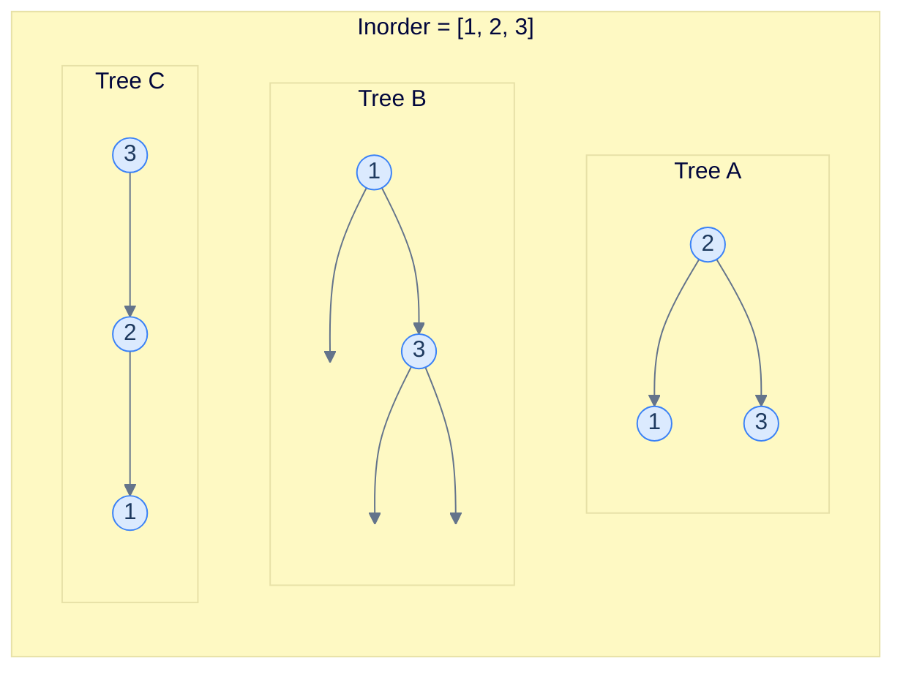
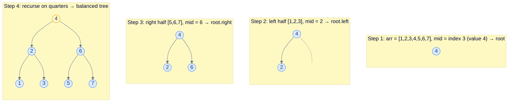
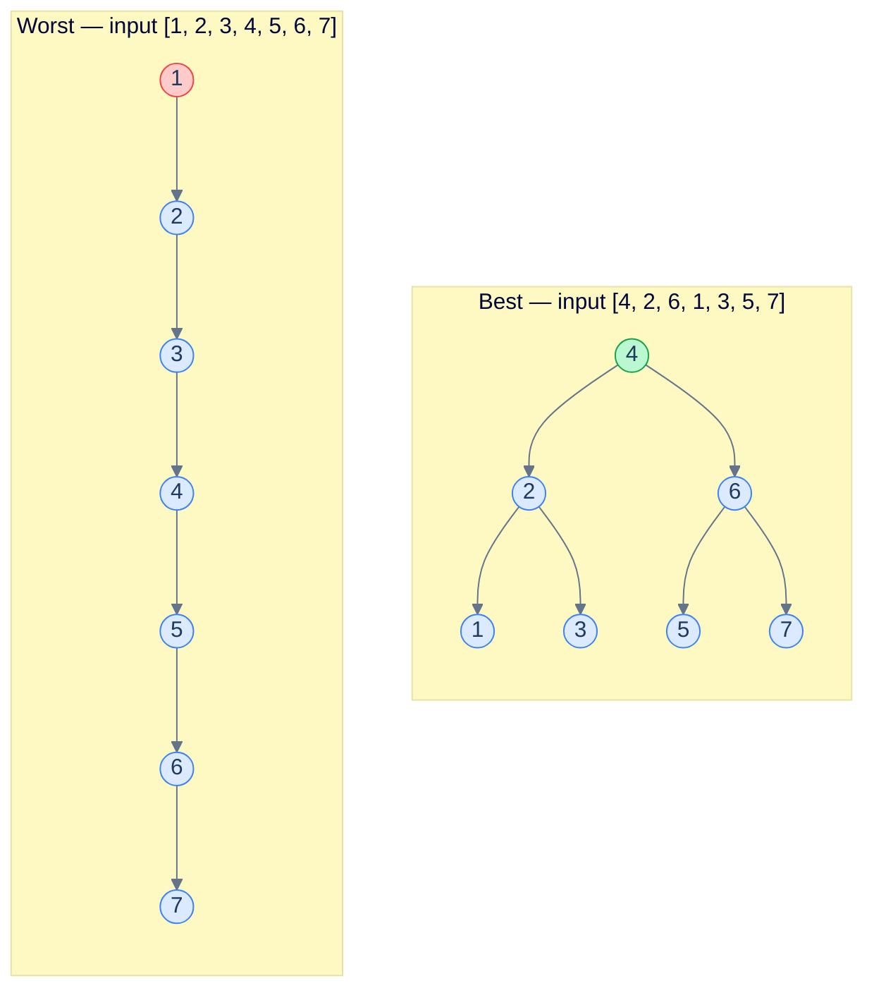
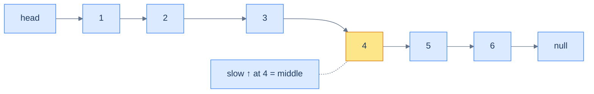

# 7. Constructing a Binary Search Tree

## The Hook

You've been searching, inserting, and deleting one node at a time. Now zoom out: how do you build the *entire* tree in the first place?

This is where the previous lesson's quiet warning comes due. Insertion order is destiny. Hand a BST a sorted array `[1, 2, 3, 4, 5, …, n]` and call `insert` once per element, and you get a **right-skewed vine** of depth `n` — a tree with O(n) operations baked in. The same `n` values, rebuilt with a smarter strategy, can give you a perfectly balanced O(log n) tree.

This lesson covers three constructions: the smart one (sorted array → balanced BST in O(n)), the lazy one (unsorted array → BST via repeated insertion, fast on lucky inputs and quadratic on cursed ones), and a slightly trickier variant of the smart one for sorted **linked lists**, where you don't have random access to the middle.

---

## Table of Contents

1. [Understanding construction from a sorted array](#understanding-construction-from-a-sorted-array)
2. [Sorted array to BST](#sorted-array-to-bst)
3. [Understanding construction from an unsorted array](#understanding-construction-from-an-unsorted-array)
4. [Unsorted array to BST](#unsorted-array-to-bst)
5. [Sorted linked list to BST](#sorted-linked-list-to-bst)

***

# Understanding construction from a sorted array

A sorted array is the *in-order traversal* of some BST. So in principle, you can rebuild a BST from it. The only question is *which* BST.

## Resolving ambiguity

In a generic binary tree, the in-order traversal alone is *not* enough to reconstruct the tree — there are infinitely many trees with the same in-order sequence. That's why standard "rebuild a binary tree" problems also give you the pre-order or post-order traversal: the pre/post sequence pins down the root at every level, breaking the ambiguity.



<p align="center"><strong>Three different binary trees, all with in-order traversal <code>[1, 2, 3]</code>. Without extra information you cannot tell which one to rebuild.</strong></p>

For BSTs we have a *different* tie-breaker available: instead of demanding the pre-order, we can demand that the result is **height-balanced**. That single constraint forces a unique answer for every level: the *middle* of the current range becomes the root. The left half builds the left subtree, the right half builds the right subtree.

## Construction

The recipe is:

1. Take the middle of the sorted array. Make it the root.
2. The left half (everything before the middle) is the in-order traversal of the **left subtree**. Recurse on it.
3. The right half (everything after the middle) is the in-order traversal of the **right subtree**. Recurse on it.



<p align="center"><strong>Building a height-balanced BST from a sorted array. Each recursive call picks the midpoint of its subarray as the subtree root.</strong></p>

By always picking the middle, the left and right subtrees end up with sizes differing by at most 1, which forces height-balance at every node. And it does this in **a single linear pass** — no comparisons, no per-element insertion, no logarithmic factor.

## Algorithm

The recursive function is parameterised by `start` and `end` indices into the sorted array, and never copies the array.

> **Algorithm**
>
> - **Step 1:** If `start > end`, return `null`.
> - **Step 2:** Let `mid = (start + end) / 2`.
> - **Step 3:** Create a new node with value `arr[mid]`.
> - **Step 4:** Recursively build the left subtree from `arr[start..mid-1]`, attach as `node.left`.
> - **Step 5:** Recursively build the right subtree from `arr[mid+1..end]`, attach as `node.right`.
> - **Step 6:** Return the new node.

## Complexity

| Case | Time | Space |
|---|---|---|
| All cases | O(n) | O(n) |

Time is linear because every element is visited exactly once. Space is linear because we allocate `n` nodes; the recursion stack adds an additional O(log n) which is dominated by the node space.

***

# Sorted array to BST

## Problem Statement

Given a sorted array `arr`, construct a height-balanced binary search tree from it and return the root of the constructed tree.

### Example 1

> - **Input:** `arr = [1, 2, 3, 4, 5, 6]`
> - **Output:** `[3, 1, 5, null, 2, 4, 6]`

### Example 2

> - **Input:** `arr = [4, 5, 9, 10, 11]`
> - **Output:** `[9, 4, 10, null, 5, null, 11]`

<details>
<summary><h2>The Solution</h2></summary>


```python run
from typing import Optional, List
from collections import deque


class TreeNode:
    def __init__(self, val=0, left=None, right=None):
        self.val = val
        self.left = left
        self.right = right


def to_level_order(root):
    if not root:
        return []
    result, queue = [], deque([root])
    while queue:
        node = queue.popleft()
        result.append(node.val)
        if node.left:
            queue.append(node.left)
        if node.right:
            queue.append(node.right)
    return result


def inorder(root):
    if not root:
        return []
    return inorder(root.left) + [root.val] + inorder(root.right)


class Solution:
    def build_tree(
        self, arr: List[int], st: int, en: int
    ) -> Optional[TreeNode]:

        # Base case: If the start index is greater than
        # the end index, there are no elements in this subarray
        # In this case, return None to indicate an empty subtree
        if st > en:
            return None

        # Calculate the middle index of the current subarray.
        mid: int = (st + en) // 2

        # Create a new TreeNode using the value at the middle index.
        node: TreeNode = TreeNode(arr[mid])

        # Recursively build the left subtree using the elements to the
        # left of the middle index.
        node.left = self.build_tree(arr, st, mid - 1)

        # Recursively build the right subtree using the elements to the
        # right of the middle index.
        node.right = self.build_tree(arr, mid + 1, en)

        # Return the root of the constructed binary search tree.
        return node

    def sorted_array_to_bst(self, arr: List[int]) -> Optional[TreeNode]:

        # Call the buildTree function with the start index as 0 and the
        # end index as the last index of the array.
        return self.build_tree(arr, 0, len(arr) - 1)


# Example 1: [1, 2, 3, 4, 5, 6]
r1 = Solution().sorted_array_to_bst([1, 2, 3, 4, 5, 6])
print(to_level_order(r1))          # [3, 1, 5, 2, 4, 6]
print(inorder(r1))                 # [1, 2, 3, 4, 5, 6]

# Example 2: [4, 5, 9, 10, 11]
r2 = Solution().sorted_array_to_bst([4, 5, 9, 10, 11])
print(to_level_order(r2))          # [9, 4, 10, 5, 11]
print(inorder(r2))                 # [4, 5, 9, 10, 11]

# Empty array
r3 = Solution().sorted_array_to_bst([])
print(to_level_order(r3))          # []

# Single element
r4 = Solution().sorted_array_to_bst([7])
print(to_level_order(r4))          # [7]

# Two elements
r5 = Solution().sorted_array_to_bst([3, 8])
print(to_level_order(r5))          # [3, 8] or [8, 3] depending on mid
print(inorder(r5))                 # [3, 8]

# Odd-length array
r6 = Solution().sorted_array_to_bst([1, 2, 3, 4, 5])
print(inorder(r6))                 # [1, 2, 3, 4, 5]
```

```java run
import java.util.*;

public class Main {
    static class TreeNode {
        int val;
        TreeNode left;
        TreeNode right;
        TreeNode() {}
        TreeNode(int val) { this.val = val; }
    }

    static List<Integer> toLevelOrder(TreeNode root) {
        if (root == null) return new ArrayList<>();
        List<Integer> result = new ArrayList<>();
        Deque<TreeNode> queue = new ArrayDeque<>();
        queue.add(root);
        while (!queue.isEmpty()) {
            TreeNode node = queue.poll();
            result.add(node.val);
            if (node.left != null) queue.add(node.left);
            if (node.right != null) queue.add(node.right);
        }
        return result;
    }

    static List<Integer> inorder(TreeNode root) {
        if (root == null) return new ArrayList<>();
        List<Integer> result = new ArrayList<>(inorder(root.left));
        result.add(root.val);
        result.addAll(inorder(root.right));
        return result;
    }

    static class Solution {
        private TreeNode buildTree(int[] arr, int st, int en) {

            // Base case: If the start index is greater than
            // the end index, there are no elements in this subarray
            // In this case, return null to indicate an empty subtree
            if (st > en) {
                return null;
            }

            // Calculate the middle index of the current subarray
            int mid = (st + en) / 2;

            // Create a new TreeNode using the value at the middle index
            TreeNode node = new TreeNode(arr[mid]);

            // Recursively build the left subtree using the elements to the
            // left of the middle index
            node.left = buildTree(arr, st, mid - 1);

            // Recursively build the right subtree using the elements to the
            // right of the middle index
            node.right = buildTree(arr, mid + 1, en);

            // Return the root of the constructed binary search tree
            return node;
        }

        public TreeNode sortedArrayToBST(int[] arr) {

            // Call the buildTree function with the start index as 0 and the
            // end index as the last index of the array
            return buildTree(arr, 0, arr.length - 1);
        }
    }

    public static void main(String[] args) {
        // Example 1: [1, 2, 3, 4, 5, 6]
        TreeNode r1 = new Solution().sortedArrayToBST(new int[]{1, 2, 3, 4, 5, 6});
        System.out.println(toLevelOrder(r1));   // [3, 1, 5, 2, 4, 6]
        System.out.println(inorder(r1));        // [1, 2, 3, 4, 5, 6]

        // Example 2: [4, 5, 9, 10, 11]
        TreeNode r2 = new Solution().sortedArrayToBST(new int[]{4, 5, 9, 10, 11});
        System.out.println(toLevelOrder(r2));   // [9, 4, 10, 5, 11]
        System.out.println(inorder(r2));        // [4, 5, 9, 10, 11]

        // Empty array
        TreeNode r3 = new Solution().sortedArrayToBST(new int[]{});
        System.out.println(toLevelOrder(r3));   // []

        // Single element
        TreeNode r4 = new Solution().sortedArrayToBST(new int[]{7});
        System.out.println(toLevelOrder(r4));   // [7]

        // Two elements
        TreeNode r5 = new Solution().sortedArrayToBST(new int[]{3, 8});
        System.out.println(inorder(r5));        // [3, 8]

        // Odd-length array
        TreeNode r6 = new Solution().sortedArrayToBST(new int[]{1, 2, 3, 4, 5});
        System.out.println(inorder(r6));        // [1, 2, 3, 4, 5]
    }
}
```

</details>


***

# Understanding construction from an unsorted array

If the input is unsorted, the elegant midpoint trick is gone — there's no `mid` that means "middle in sorted order" without first sorting. The simplest fallback is to **insert the values one at a time** into an initially empty BST.

## Algorithm

> **Algorithm**
>
> - **Step 1:** Initialise `root = null`.
> - **Step 2:** For each element `v` in the input array, set `root = insert(root, v)`.
> - **Step 3:** Return `root`.

That's it. Every insert is the same recursive descent we wrote in lesson 5.

## Complexity — best vs worst

This is where insertion order becomes consequential.

> *Friction prompt — predict before reading on. Given the same set of values, what input order makes this construction fast? What order makes it slow? Why?*

**Best case** — every insert lands in O(log n). This requires the tree to *stay* balanced after every insertion. Inputs that achieve this look exactly like the **level-order traversal of a balanced BST**: insert the median first, then the medians of the left/right halves, then the medians of the quarters, etc. Each insert hits a nearly-full tree's lowest empty level, never extending the height.

**Worst case** — every insert lands in O(n). This happens when the input is *monotonic* (sorted ascending or descending). Each new value is bigger than everything in the tree (or smaller), so every insert walks the full current depth and adds one to it. The tree becomes a vine.



<p align="center"><strong>Same 7 values, two input orders. The level-order order produces a balanced tree (height 3); the sorted order produces a vine (height 7).</strong></p>

| Case | Time | Space |
|---|---|---|
| Best (level-order of a balanced BST) | O(n log n) | O(n) |
| Worst (monotonic input) | **O(n²)** | O(n) |

The total time is `n` insertions × `O(log n)` per insertion in the best case = `O(n log n)`. In the worst case, every insertion walks deeper than the last one (depths `1, 2, 3, ..., n`), giving the classic `1 + 2 + … + n = O(n²)` total.

This is why production code rarely uses naive BSTs for unknown inputs — and why **self-balancing** BSTs (AVL, red-black) exist: they perform a small repair after every insert that keeps the tree height ≤ O(log n) regardless of input order.

***

# Unsorted array to BST

## Problem Statement

Given an unsorted array `arr`, construct a binary search tree by inserting nodes in the order given in the array, and return the root.

### Example 1

> - **Input:** `arr = [2, 1, 6, 5, 3, 4]`
> - **Output:** `[2, 1, 6, null, null, 5, null, 3, null, null, 4]`

### Example 2

> - **Input:** `arr = [10, 5, 9, 4, 11]`
> - **Output:** `[10, 5, 11, 4, 9]`

<details>
<summary><h2>The Solution</h2></summary>


```python run
from typing import Optional, List
from collections import deque


class TreeNode:
    def __init__(self, val=0, left=None, right=None):
        self.val = val
        self.left = left
        self.right = right


def to_level_order(root):
    if not root:
        return []
    result, queue = [], deque([root])
    while queue:
        node = queue.popleft()
        result.append(node.val)
        if node.left:
            queue.append(node.left)
        if node.right:
            queue.append(node.right)
    return result


def inorder(root):
    if not root:
        return []
    return inorder(root.left) + [root.val] + inorder(root.right)


class Solution:
    def insert(
        self, root: Optional[TreeNode], data: int
    ) -> Optional[TreeNode]:

        # If the root is null, create a new node with data and return it
        # as the new root
        if not root:
            return TreeNode(data)

        # If data is less than the current root's value, insert it in
        # the left subtree
        if data < root.val:
            root.left = self.insert(root.left, data)

        # If data is greater than or equal to the current root's value,
        # insert it in the right subtree
        else:
            root.right = self.insert(root.right, data)

        # Return the updated root of the BST after insertion
        return root

    def unsorted_array_to_bst(
        self, arr: List[int]
    ) -> Optional[TreeNode]:

        # Initialize the root of the BST as None (empty tree)
        root = None

        # Iterate through the elements of the input array
        for num in arr:

            # Insert the current element into the BST rooted at root
            root = self.insert(root, num)

        # Return the root of the BST, which represents the root of the
        # constructed BST
        return root


# Example 1: [2, 1, 6, 5, 3, 4]
r1 = Solution().unsorted_array_to_bst([2, 1, 6, 5, 3, 4])
print(to_level_order(r1))          # [2, 1, 6, 5, 3, 4]
print(inorder(r1))                 # [1, 2, 3, 4, 5, 6]

# Example 2: [10, 5, 9, 4, 11]
r2 = Solution().unsorted_array_to_bst([10, 5, 9, 4, 11])
print(to_level_order(r2))          # [10, 5, 11, 4, 9]
print(inorder(r2))                 # [4, 5, 9, 10, 11]

# Empty array
r3 = Solution().unsorted_array_to_bst([])
print(to_level_order(r3))          # []

# Single element
r4 = Solution().unsorted_array_to_bst([7])
print(to_level_order(r4))          # [7]

# Already sorted — right-skew
r5 = Solution().unsorted_array_to_bst([1, 2, 3, 4])
print(inorder(r5))                 # [1, 2, 3, 4]

# Reverse sorted — left-skew
r6 = Solution().unsorted_array_to_bst([4, 3, 2, 1])
print(inorder(r6))                 # [1, 2, 3, 4]
```

```java run
import java.util.*;

public class Main {
    static class TreeNode {
        int val;
        TreeNode left;
        TreeNode right;
        TreeNode() {}
        TreeNode(int val) { this.val = val; }
    }

    static List<Integer> toLevelOrder(TreeNode root) {
        if (root == null) return new ArrayList<>();
        List<Integer> result = new ArrayList<>();
        Deque<TreeNode> queue = new ArrayDeque<>();
        queue.add(root);
        while (!queue.isEmpty()) {
            TreeNode node = queue.poll();
            result.add(node.val);
            if (node.left != null) queue.add(node.left);
            if (node.right != null) queue.add(node.right);
        }
        return result;
    }

    static List<Integer> inorder(TreeNode root) {
        if (root == null) return new ArrayList<>();
        List<Integer> result = new ArrayList<>(inorder(root.left));
        result.add(root.val);
        result.addAll(inorder(root.right));
        return result;
    }

    static class Solution {
        private TreeNode insert(TreeNode root, int data) {

            // If the root is null, create a new node with data and return it
            // as the new root
            if (root == null) {
                return new TreeNode(data);
            }

            // If data is less than the current root's value, insert it in
            // the left subtree
            if (data < root.val) {
                root.left = insert(root.left, data);
            }

            // If data is greater than or equal to the current root's value,
            // insert it in the right subtree
            else {
                root.right = insert(root.right, data);
            }

            // Return the updated root of the BST after insertion
            return root;
        }

        public TreeNode unsortedArrayToBST(int[] arr) {

            // Initialize the root of the BST as null (empty tree)
            TreeNode root = null;

            // Iterate through the elements of the input array
            for (int i = 0; i < arr.length; i++) {

                // Insert the current element into the BST rooted at root
                root = insert(root, arr[i]);
            }

            // Return the root of the BST, which represents the root of the
            // constructed BST
            return root;
        }
    }

    public static void main(String[] args) {
        // Example 1: [2, 1, 6, 5, 3, 4]
        TreeNode r1 = new Solution().unsortedArrayToBST(new int[]{2, 1, 6, 5, 3, 4});
        System.out.println(toLevelOrder(r1));   // [2, 1, 6, 5, 3, 4]
        System.out.println(inorder(r1));        // [1, 2, 3, 4, 5, 6]

        // Example 2: [10, 5, 9, 4, 11]
        TreeNode r2 = new Solution().unsortedArrayToBST(new int[]{10, 5, 9, 4, 11});
        System.out.println(toLevelOrder(r2));   // [10, 5, 11, 4, 9]
        System.out.println(inorder(r2));        // [4, 5, 9, 10, 11]

        // Empty array
        TreeNode r3 = new Solution().unsortedArrayToBST(new int[]{});
        System.out.println(toLevelOrder(r3));   // []

        // Single element
        TreeNode r4 = new Solution().unsortedArrayToBST(new int[]{7});
        System.out.println(toLevelOrder(r4));   // [7]

        // Already sorted — right-skew
        TreeNode r5 = new Solution().unsortedArrayToBST(new int[]{1, 2, 3, 4});
        System.out.println(inorder(r5));        // [1, 2, 3, 4]

        // Reverse sorted — left-skew
        TreeNode r6 = new Solution().unsortedArrayToBST(new int[]{4, 3, 2, 1});
        System.out.println(inorder(r6));        // [1, 2, 3, 4]
    }
}
```

</details>


***

# Sorted linked list to BST

## Problem Statement

Given the **head** of a sorted singly linked list, construct a height-balanced binary search tree from it and return the root of the constructed tree.

### Example 1

> - **Input:** `head = [1, 2, 3, 4, 5, 6]`
> - **Output:** `[4, 2, 6, 1, 3, 5]`

### Example 2

> - **Input:** `head = [4, 5, 9, 10, 11]`
> - **Output:** `[9, 5, 11, 4, null, 10]`

<details>
<summary><h2>The Strategy</h2></summary>


The high-level idea is identical to the sorted-array case: pick the middle element as the root, recurse on the two halves. The wrinkle is that **a singly linked list does not support O(1) random access**. To find the middle of an `n`-element list we need an O(n) walk — once per recursive call.

The classic trick to find the middle of a linked list is the **slow/fast pointer** (Floyd's "tortoise and hare") technique: a slow pointer moves one step per iteration, a fast pointer moves two. When fast falls off the end, slow is sitting on the middle.

To keep the recursion tidy, we also **split the list** at that middle: cut the link from the previous node, so the left half ends at the node just before the middle, and the right half starts at `middle.next`.



<p align="center"><strong>Slow/fast walk on a 6-element sorted list. When fast reaches the end, slow has reached the middle (<code>4</code>). The list is then split into <code>[1,2,3]</code> and <code>[5,6]</code>, and the algorithm recurses.</strong></p>

The total work per recursion level is O(n) (the slow/fast walk over n nodes), and there are O(log n) levels, so the total time is **O(n log n)**.

> *Aside — there's an O(n) version that walks the list once and builds the tree in-order using a closure that advances the head pointer as it consumes nodes. It's a beautiful trick but harder to read; we'll use the cleaner O(n log n) version here.*

</details>
<details>
<summary><h2>Solution &amp; Analysis</h2></summary>

### Complexity

| Case | Time | Space |
|---|---|---|
| All cases | O(n log n) | O(n) |

`n` is the number of list nodes; the resulting tree has the same number of nodes.

### The Solution

```python run
from typing import Optional, List, Any
from collections import deque


class ListNode:
    def __init__(self, val=0, nxt=None):
        self.val = val
        self.next = nxt


def from_list(values):
    if not values:
        return None
    head = ListNode(values[0])
    cur = head
    for v in values[1:]:
        cur.next = ListNode(v)
        cur = cur.next
    return head


class TreeNode:
    def __init__(self, val=0, left=None, right=None):
        self.val = val
        self.left = left
        self.right = right


def to_level_order(root):
    if not root:
        return []
    result, queue = [], deque([root])
    while queue:
        node = queue.popleft()
        result.append(node.val)
        if node.left:
            queue.append(node.left)
        if node.right:
            queue.append(node.right)
    return result


def inorder(root):
    if not root:
        return []
    return inorder(root.left) + [root.val] + inorder(root.right)


class Solution:
    def find_middle_node_and_split(
        self, head: Optional[ListNode]
    ) -> Optional[ListNode]:

        # Initialize slow pointer to the head of the list
        slow = head

        # Initialize fast pointer to the head of the list
        fast = head

        # Previous pointer
        previous = None

        # Iterate until fast pointer reaches the end of the list
        while fast and fast.next:
            previous = slow

            # Move slow pointer one step forward
            slow = slow.next

            # Move fast pointer two steps forward
            fast = fast.next.next

        # Split the list into two halves
        if previous:
            previous.next = None

        # Return the middle node or the second middle node
        # (in case of even number of nodes)
        return slow

    def sorted_linked_list_to_bst(
        self, head: Optional[ListNode]
    ) -> Optional[TreeNode]:
        if not head:
            return None

        # Find the middle element of the list
        middle_node = self.find_middle_node_and_split(head)

        # Create a new TreeNode using the value at the middle node
        root = TreeNode(middle_node.val)

        # Base case when there's only one element in the list
        if head == middle_node:
            return root

        # Recursively build the left subtree using the elements to the
        # left of the middle node
        root.left = self.sorted_linked_list_to_bst(head)

        # Recursively build the right subtree using the elements to the
        # right of the middle node
        root.right = self.sorted_linked_list_to_bst(middle_node.next)

        # Return the root of the constructed binary search tree
        return root


# Example 1: [1, 2, 3, 4, 5, 6]
r1 = Solution().sorted_linked_list_to_bst(from_list([1, 2, 3, 4, 5, 6]))
print(to_level_order(r1))          # [4, 2, 6, 1, 3, 5]
print(inorder(r1))                 # [1, 2, 3, 4, 5, 6]

# Example 2: [4, 5, 9, 10, 11]
r2 = Solution().sorted_linked_list_to_bst(from_list([4, 5, 9, 10, 11]))
print(to_level_order(r2))          # [9, 5, 11, 4, 10]
print(inorder(r2))                 # [4, 5, 9, 10, 11]

# Empty list
r3 = Solution().sorted_linked_list_to_bst(None)
print(to_level_order(r3))          # []

# Single element
r4 = Solution().sorted_linked_list_to_bst(from_list([7]))
print(to_level_order(r4))          # [7]

# Two elements
r5 = Solution().sorted_linked_list_to_bst(from_list([3, 8]))
print(inorder(r5))                 # [3, 8]

# Odd-length list
r6 = Solution().sorted_linked_list_to_bst(from_list([1, 2, 3, 4, 5]))
print(inorder(r6))                 # [1, 2, 3, 4, 5]
```

```java run
import java.util.*;

public class Main {
    static class ListNode {
        int val;
        ListNode next;
        ListNode() {}
        ListNode(int val) { this.val = val; }
        ListNode(int val, ListNode next) { this.val = val; this.next = next; }
    }

    static ListNode fromList(int... values) {
        if (values.length == 0) return null;
        ListNode head = new ListNode(values[0]);
        ListNode cur = head;
        for (int i = 1; i < values.length; i++) {
            cur.next = new ListNode(values[i]);
            cur = cur.next;
        }
        return head;
    }

    static class TreeNode {
        int val;
        TreeNode left;
        TreeNode right;
        TreeNode() {}
        TreeNode(int val) { this.val = val; }
    }

    static List<Integer> toLevelOrder(TreeNode root) {
        if (root == null) return new ArrayList<>();
        List<Integer> result = new ArrayList<>();
        Deque<TreeNode> queue = new ArrayDeque<>();
        queue.add(root);
        while (!queue.isEmpty()) {
            TreeNode node = queue.poll();
            result.add(node.val);
            if (node.left != null) queue.add(node.left);
            if (node.right != null) queue.add(node.right);
        }
        return result;
    }

    static List<Integer> inorder(TreeNode root) {
        if (root == null) return new ArrayList<>();
        List<Integer> result = new ArrayList<>(inorder(root.left));
        result.add(root.val);
        result.addAll(inorder(root.right));
        return result;
    }

    static class Solution {
        private ListNode findMiddleNodeAndSplit(ListNode head) {

            // Initialize slow pointer to the head of the list
            ListNode slow = head;

            // Initialize fast pointer to the head of the list
            ListNode fast = head;

            // Previous pointer
            ListNode previous = null;

            // Iterate until fast pointer reaches the end of the list
            while (fast != null && fast.next != null) {
                previous = slow;

                // Move slow pointer one step forward
                slow = slow.next;

                // Move fast pointer two steps forward
                fast = fast.next.next;
            }

            // Split the list into two halves
            if (previous != null) {
                previous.next = null;
            }

            // Return the middle node or the second middle node
            // (in case of even number of nodes)
            return slow;
        }

        public TreeNode sortedLinkedListToBST(ListNode head) {
            if (head == null) {
                return null;
            }

            // Find the middle element of the list
            ListNode middleNode = findMiddleNodeAndSplit(head);

            // Create a new TreeNode using the value at the middle node
            TreeNode root = new TreeNode(middleNode.val);

            // Base case when there's only one element in the list
            if (head == middleNode) {
                return root;
            }

            // Recursively build the left subtree using the elements to the
            // left of the middle node
            root.left = sortedLinkedListToBST(head);

            // Recursively build the right subtree using the elements to the
            // right of the middle node
            root.right = sortedLinkedListToBST(middleNode.next);

            // Return the root of the constructed binary search tree
            return root;
        }
    }

    public static void main(String[] args) {
        // Example 1: [1, 2, 3, 4, 5, 6]
        TreeNode r1 = new Solution().sortedLinkedListToBST(fromList(1, 2, 3, 4, 5, 6));
        System.out.println(toLevelOrder(r1));   // [4, 2, 6, 1, 3, 5]
        System.out.println(inorder(r1));        // [1, 2, 3, 4, 5, 6]

        // Example 2: [4, 5, 9, 10, 11]
        TreeNode r2 = new Solution().sortedLinkedListToBST(fromList(4, 5, 9, 10, 11));
        System.out.println(toLevelOrder(r2));   // [9, 5, 11, 4, 10]
        System.out.println(inorder(r2));        // [4, 5, 9, 10, 11]

        // Empty list
        TreeNode r3 = new Solution().sortedLinkedListToBST(null);
        System.out.println(toLevelOrder(r3));   // []

        // Single element
        TreeNode r4 = new Solution().sortedLinkedListToBST(fromList(7));
        System.out.println(toLevelOrder(r4));   // [7]

        // Two elements
        TreeNode r5 = new Solution().sortedLinkedListToBST(fromList(3, 8));
        System.out.println(inorder(r5));        // [3, 8]

        // Odd-length list
        TreeNode r6 = new Solution().sortedLinkedListToBST(fromList(1, 2, 3, 4, 5));
        System.out.println(inorder(r6));        // [1, 2, 3, 4, 5]
    }
}
```


<details>
<summary><strong>Trace — head = [1, 2, 3, 4, 5, 6]</strong></summary>

```
Call 1 │ list = [1,2,3,4,5,6] → middle = 4 → split into [1,2,3] | [5,6]
        │ root = TreeNode(4)
Call 2 │ list = [1,2,3]       → middle = 2 → split into [1]     | [3]
        │ root = TreeNode(2)
Call 3 │ list = [1]           → middle = 1 → root = TreeNode(1) (single-element shortcut)
Call 4 │ list = [3]           → middle = 3 → root = TreeNode(3)
Call 5 │ list = [5,6]         → middle = 6 → split into [5]     | []
        │ root = TreeNode(6)
Call 6 │ list = [5]           → middle = 5 → root = TreeNode(5)
Call 7 │ list = empty         → returns null
Result: tree = [4, 2, 6, 1, 3, 5] ✓
```

</details>

</details>
<details>
<summary><h2>Final Takeaway</h2></summary>


Three constructions, three different cost profiles:

| Source | Strategy | Time | Output |
|---|---|---|---|
| Sorted array | "midpoint as root" recursion | **O(n)** | guaranteed balanced BST |
| Unsorted array | repeated insert into empty BST | O(n log n) best, **O(n²)** worst | shape depends on input order |
| Sorted linked list | midpoint-split with slow/fast pointer | O(n log n) | guaranteed balanced BST |

Two ideas worth banking:

1. **The midpoint-as-root idea is what gives BSTs their best-case shape.** Self-balancing BSTs (AVL, red-black) effectively re-create this shape *incrementally*, after every insert and delete, by performing local rotations to restore balance. The same midpoint instinct is what powers segment trees and merge-sort trees in competitive programming.
2. **Insertion order is destiny for naive BSTs.** Sorted input is the adversarial worst case — and unfortunately, sorted input shows up everywhere in the real world (chronological IDs, alphabetised keys, monotone counters). Production code should either pre-shuffle input or use a self-balancing BST.

The next lesson finally puts our shiny new BST to work on a classic interview problem: the **Lowest Common Ancestor**. The BST property turns what would be an O(n) traversal in a generic binary tree into a one-pass O(h) descent.

</details>

<!-- ============================================== -->
<!-- SWEEP 2 — missing sections (placeholders only) -->
<!-- ============================================== -->

<!-- TODO: Understanding the Problem — missing, needs to be written -->
<!--       Guidance: frame the gap the structure/algorithm fills -->

<!-- TODO: Supported Operations — missing, needs to be written -->
<!--       Guidance: table: operation / time / notes -->

<!-- TODO: Internal Mechanics — missing, needs to be written -->
<!--       Guidance: how it actually works under the hood -->

<!-- TODO: Working Example — missing, needs to be written -->
<!--       Guidance: one fully worked end-to-end example -->

<!-- TODO: Edge Cases & Pitfalls — missing, needs to be written -->
<!--       Guidance: bulleted list of gotchas -->

<!-- TODO: Production Reality — missing, needs to be written -->
<!--       Guidance: 4–6 entries: System — uses X — because Y -->

<!-- TODO: Quiz — missing, needs to be written -->
<!--       Guidance: 3–5 questions, each labeled [Recall]/[Reasoning]/[Tradeoff] -->

<!-- TODO: Practice Ladder — missing, needs to be written -->
<!--       Guidance: table: 5 links into pattern problems + hints -->

<!-- TODO: Further Reading — missing, needs to be written -->
<!--       Guidance: annotated: ★ Essential / ◆ Advanced / → Reference -->

<!-- TODO: Cross-Links — missing, needs to be written -->
<!--       Guidance: Prerequisites | What comes next -->

<!-- TODO: Final Takeaway — missing, needs to be written -->
<!--       Guidance: exactly 3 typed bullets: Core mechanic / Dominant tradeoff / One thing to remember -->
