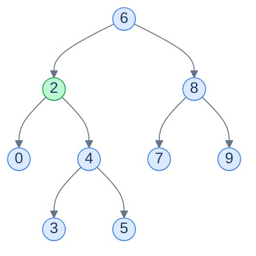
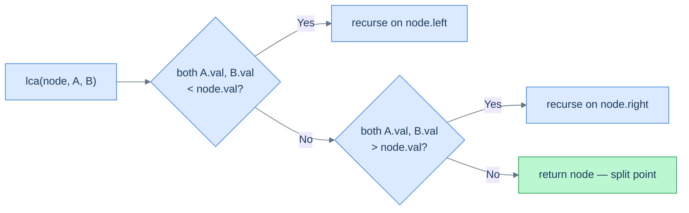
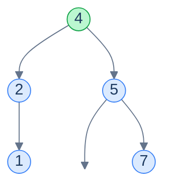

# 8. Lowest Common Ancestor in Binary Search Trees

## The Hook

You're sitting in a meeting room called *Engineering* on the 3rd floor of building *B*. Your colleague Priya is in *Lounge*, on the 1st floor of the same building. To meet, you both walk down to the **lowest common building** — the lowest point in the company's "org tree of physical spaces" that contains *both* of your locations. From there, going further down splits the tree (different rooms), and going further up wastes time (you're already inside the same building).

The **lowest common ancestor** in a tree is exactly that intuition: given two nodes, find the lowest node such that both targets are in its subtree. In a generic binary tree, you have to search both subtrees and combine results — O(n). In a BST, the **values themselves tell you which way to go**: if both targets are smaller than the current node, both live in the left subtree; if both are larger, both live in the right subtree; if one is smaller and one is larger, you've **landed on the LCA**. One descent. O(h). Done.

This lesson is short — the BST property cuts straight to the answer.

---

## Table of Contents

1. [Understanding the lowest common ancestor](#understanding-the-lowest-common-ancestor)
2. [Lowest common ancestor](#lowest-common-ancestor)

***

# Understanding the lowest common ancestor

> The **lowest common ancestor (LCA)** of two nodes `A` and `B` in a binary tree is the lowest node from the root that has both `A` and `B` as descendants. A node may be its own ancestor — so if `A` is itself an ancestor of `B`, then `A` is the LCA.



<p align="center"><strong>The LCA of <code>0</code> and <code>5</code> is <code>2</code> — the lowest node whose subtree contains both. (LCA of <code>0</code> and <code>9</code> would be the root <code>6</code>; LCA of <code>2</code> and <code>5</code> would be <code>2</code> itself.)</strong></p>

In a generic binary tree, finding the LCA requires a postorder-ish search of both subtrees — every node is potentially the answer, and you can't decide without visiting the entire subtree below. That's O(n).

A BST's *values* let us short-circuit the search.

## Algorithm

Three cases. At every node `cur` on the descent:

1. **Both `A.val` and `B.val` are less than `cur.val`** → both nodes live in the left subtree → the LCA lives in the left subtree. Recurse left.
2. **Both `A.val` and `B.val` are greater than `cur.val`** → both nodes live in the right subtree → recurse right.
3. **One value is `< cur.val`, the other is `≥ cur.val`** (or one of them *equals* `cur.val`, meaning `cur` itself is `A` or `B`) → `A` and `B` are *split* by `cur`. There is no node deeper than `cur` that has both as descendants — `cur` is the LCA.



<p align="center"><strong>The decision tree at every node: descend to the side that contains both targets, or stop at the split point.</strong></p>

> *Friction prompt — predict before reading on. What happens if `A` is itself an ancestor of `B`? E.g. <code>A = 2, B = 5</code> in the tree above. Walk through the recursion mentally — what's the LCA, and how does the algorithm reach it?*

At the root `6`: `2 < 6` and `5 < 6` → both targets are smaller → recurse left to node `2`. At node `2`: `2.val == 2`, which means we've hit `A` itself. The condition `both > node.val` is false (since `2 == node.val`, not strictly greater), and `both < node.val` is also false (same reason). So we return `node` — that's `A`. **`A` is its own ancestor, and the LCA.**

This is why the implementation typically also has a base case `node == A || node == B → return node` for clarity, even though the value-comparison logic handles it correctly when values are unique.

> **Algorithm**
>
> **lowestCommonAncestor(node, A, B):**
>
> - **Step 1:** If `node == null`, `node == A`, or `node == B`, return `node`.
> - **Step 2:** If `node.val > A.val` AND `node.val > B.val`, recurse on `node.left`.
> - **Step 3:** If `node.val < A.val` AND `node.val < B.val`, recurse on `node.right`.
> - **Step 4:** Otherwise — the targets are split — return `node`.

## A worked example

Find the LCA of `1` and `7` in:



<p align="center"><strong>At root <code>4</code>: <code>1 &lt; 4</code> but <code>7 &gt; 4</code> → targets split → return <code>4</code>. The LCA of <code>1</code> and <code>7</code> is <code>4</code>.</strong></p>

A single comparison at the root resolved the entire problem.

## Complexity

| Case | Time | Space |
|---|---|---|
| Best (balanced) | O(log n) | O(log n) |
| Worst (skewed) | O(n) | O(n) |

Time is the same as a single search descent. Space is the recursion stack, which mirrors the descent depth. (An iterative version trivially achieves O(1) space — same shape, while loop instead of recursion.)

***

# Lowest common ancestor

## Problem Statement

Given the **root** of a binary search tree and two random nodes, `nodeA` and `nodeB`, find and return the node that is the lowest common ancestor of `nodeA` and `nodeB`.

> The lowest common ancestor is the lowest node in the tree that has both `nodeA` and `nodeB` as descendants (where a node is allowed to be a descendant of itself).

### Example 1

> - **Input:** `root = [4, 2, 5, 1, null, null, 7]`, `nodeA = 1`, `nodeB = 7`
> - **Output:** `4`

### Example 2

> - **Input:** `root = [5, 1, 8, null, null, 6, 9]`, `nodeA = 6`, `nodeB = 9`
> - **Output:** `8`

<details>
<summary><h2>The Solution</h2></summary>


```python run
from typing import Optional, List
from collections import deque


class TreeNode:
    def __init__(self, val=0, left=None, right=None):
        self.val = val
        self.left = left
        self.right = right


def from_level_order(values):
    """Build tree from list like [1, 2, 3, None, 4]. None means missing child."""
    if not values:
        return None
    root = TreeNode(values[0])
    queue = [root]
    i = 1
    while queue and i < len(values):
        node = queue.pop(0)
        if i < len(values) and values[i] is not None:
            node.left = TreeNode(values[i])
            queue.append(node.left)
        i += 1
        if i < len(values) and values[i] is not None:
            node.right = TreeNode(values[i])
            queue.append(node.right)
        i += 1
    return root


def find_node(root, val):
    while root:
        if val == root.val:
            return root
        elif val < root.val:
            root = root.left
        else:
            root = root.right
    return None


class Solution:
    def lowest_common_ancestor(
        self,
        root: Optional[TreeNode],
        node_a: Optional[TreeNode],
        node_b: Optional[TreeNode],
    ) -> Optional[TreeNode]:

        # If the root is None or one of the nodes is the root, return
        # the root
        if root is None or root == node_a or root == node_b:
            return root

        if node_a is not None and node_b is not None:

            # If both nodes are in the left subtree, recursively search
            # in the left subtree
            if root.val > node_a.val and root.val > node_b.val:
                return self.lowest_common_ancestor(
                    root.left, node_a, node_b
                )

            # If both nodes are in the right subtree, recursively search
            # in the right subtree
            if root.val < node_a.val and root.val < node_b.val:
                return self.lowest_common_ancestor(
                    root.right, node_a, node_b
                )

        # If one node is in the left subtree and the other is in the
        # right subtree, return the root
        return root


# Example 1: LCA of 1 and 7 in [4, 2, 5, 1, null, null, 7]
t1 = from_level_order([4, 2, 5, 1, None, None, 7])
a1, b1 = find_node(t1, 1), find_node(t1, 7)
res = Solution().lowest_common_ancestor(t1, a1, b1)
print(res.val if res else None)    # 4

# Example 2: LCA of 6 and 9 in [5, 1, 8, null, null, 6, 9]
t2 = from_level_order([5, 1, 8, None, None, 6, 9])
a2, b2 = find_node(t2, 6), find_node(t2, 9)
res2 = Solution().lowest_common_ancestor(t2, a2, b2)
print(res2.val if res2 else None)  # 8

# Both nodes in left subtree
t3 = from_level_order([10, 5, 15, 2, 7])
a3, b3 = find_node(t3, 2), find_node(t3, 7)
res3 = Solution().lowest_common_ancestor(t3, a3, b3)
print(res3.val if res3 else None)  # 5

# One node is the ancestor of the other
t4 = from_level_order([10, 5, 15, 2, 7])
a4, b4 = find_node(t4, 5), find_node(t4, 2)
res4 = Solution().lowest_common_ancestor(t4, a4, b4)
print(res4.val if res4 else None)  # 5

# LCA is the root itself
t5 = from_level_order([10, 5, 15])
a5, b5 = find_node(t5, 5), find_node(t5, 15)
res5 = Solution().lowest_common_ancestor(t5, a5, b5)
print(res5.val if res5 else None)  # 10

# Single-node tree — nodeA is root
t6 = TreeNode(42)
res6 = Solution().lowest_common_ancestor(t6, t6, None)
print(res6.val if res6 else None)  # 42

# Both nodes in right subtree
t7 = from_level_order([10, 5, 20, None, None, 15, 25])
a7, b7 = find_node(t7, 15), find_node(t7, 25)
res7 = Solution().lowest_common_ancestor(t7, a7, b7)
print(res7.val if res7 else None)  # 20
```

```java run
import java.util.*;

public class Main {
    static class TreeNode {
        int val;
        TreeNode left;
        TreeNode right;
        TreeNode() {}
        TreeNode(int val) { this.val = val; }
    }

    static TreeNode fromLevelOrder(Integer... values) {
        if (values.length == 0 || values[0] == null) return null;
        TreeNode root = new TreeNode(values[0]);
        Deque<TreeNode> queue = new ArrayDeque<>();
        queue.add(root);
        int i = 1;
        while (!queue.isEmpty() && i < values.length) {
            TreeNode node = queue.poll();
            if (i < values.length && values[i] != null) {
                node.left = new TreeNode(values[i]);
                queue.add(node.left);
            }
            i++;
            if (i < values.length && values[i] != null) {
                node.right = new TreeNode(values[i]);
                queue.add(node.right);
            }
            i++;
        }
        return root;
    }

    static TreeNode findNode(TreeNode root, int val) {
        while (root != null) {
            if (val == root.val) return root;
            else if (val < root.val) root = root.left;
            else root = root.right;
        }
        return null;
    }

    static class Solution {
        public TreeNode lowestCommonAncestor(
            TreeNode root,
            TreeNode nodeA,
            TreeNode nodeB
        ) {

            // If the root is null or one of the nodes is the root, return
            // the root
            if (root == null || root == nodeA || root == nodeB) {
                return root;
            }

            // If both nodes are in the left subtree, recursively search in
            // the left subtree
            if (root.val > nodeA.val && root.val > nodeB.val) {
                return lowestCommonAncestor(root.left, nodeA, nodeB);
            }

            // If both nodes are in the right subtree, recursively search in
            // the right subtree
            if (root.val < nodeA.val && root.val < nodeB.val) {
                return lowestCommonAncestor(root.right, nodeA, nodeB);
            }

            // If one node is in the left subtree and the other is in the
            // right subtree, return the root
            return root;
        }
    }

    public static void main(String[] args) {
        // Example 1: LCA of 1 and 7 in [4, 2, 5, 1, null, null, 7]
        TreeNode t1 = fromLevelOrder(4, 2, 5, 1, null, null, 7);
        TreeNode r1 = new Solution().lowestCommonAncestor(t1, findNode(t1, 1), findNode(t1, 7));
        System.out.println(r1 != null ? r1.val : null);    // 4

        // Example 2: LCA of 6 and 9 in [5, 1, 8, null, null, 6, 9]
        TreeNode t2 = fromLevelOrder(5, 1, 8, null, null, 6, 9);
        TreeNode r2 = new Solution().lowestCommonAncestor(t2, findNode(t2, 6), findNode(t2, 9));
        System.out.println(r2 != null ? r2.val : null);    // 8

        // Both nodes in left subtree
        TreeNode t3 = fromLevelOrder(10, 5, 15, 2, 7);
        TreeNode r3 = new Solution().lowestCommonAncestor(t3, findNode(t3, 2), findNode(t3, 7));
        System.out.println(r3 != null ? r3.val : null);    // 5

        // One node is the ancestor of the other
        TreeNode t4 = fromLevelOrder(10, 5, 15, 2, 7);
        TreeNode r4 = new Solution().lowestCommonAncestor(t4, findNode(t4, 5), findNode(t4, 2));
        System.out.println(r4 != null ? r4.val : null);    // 5

        // LCA is the root itself
        TreeNode t5 = fromLevelOrder(10, 5, 15);
        TreeNode r5 = new Solution().lowestCommonAncestor(t5, findNode(t5, 5), findNode(t5, 15));
        System.out.println(r5 != null ? r5.val : null);    // 10

        // Single-node tree — nodeA is root
        TreeNode t6 = new TreeNode(42);
        TreeNode r6 = new Solution().lowestCommonAncestor(t6, t6, null);
        System.out.println(r6 != null ? r6.val : null);    // 42

        // Both nodes in right subtree
        TreeNode t7 = fromLevelOrder(10, 5, 20, null, null, 15, 25);
        TreeNode r7 = new Solution().lowestCommonAncestor(t7, findNode(t7, 15), findNode(t7, 25));
        System.out.println(r7 != null ? r7.val : null);    // 20
    }
}
```


<details>
<summary><strong>Trace — root = [4, 2, 5, 1, null, null, 7], A = 1, B = 7</strong></summary>

```
Step 1 │ at 4 │ 4 > 1 but 4 < 7 → split → return 4
Result: LCA = 4 ✓ (single comparison)
```

</details>
<details>
<summary><strong>Trace — root = [6, 2, 8, 0, 4, 7, 9, null, null, 3, 5], A = 0, B = 5</strong></summary>

```
Step 1 │ at 6 │ 6 > 0 AND 6 > 5 → both on left → recurse left
Step 2 │ at 2 │ 2 > 0 but 2 < 5 → split → return 2
Result: LCA = 2 ✓
```

</details>

</details>
<details>
<summary><h2>Final Takeaway</h2></summary>


In a generic binary tree, finding the LCA needs a full O(n) search. In a BST, **the values are signposts**: if both targets are smaller than the current node, both live to the left; if both are larger, both live to the right; if they straddle the current node, you've found the LCA.

This single observation collapses an O(n) algorithm into an O(h) descent. It's the same lever that's powered every BST operation in this chapter — search, insert, delete, range queries, lower/upper bounds — *and* the same lever that motivates B-trees, segment trees, and ordered indices in databases. **Whenever values impose a total order on a tree's structure, comparisons become navigation.**

Two patterns to keep:

1. **The "split point" idiom** — wherever you have a sorted hierarchy and need the lowest place that separates two values, the BST descent gives you the answer in O(h). It's the same idea as `floor` of `min(A, B)` and `ceiling` of `max(A, B)` aligning at the same node.
2. **Generic tree algorithms collapse on a BST** — postorder LCA, inorder validation, level-order construction — all of these have BST-specialised forms that turn O(n) into O(h). Whenever you face a tree problem on a BST, ask *"what does the BST property let me skip?"* before you reach for the generic algorithm.

The next lesson takes a different angle: instead of *searching* for one value, we'll build a **stateful iterator** over the BST that produces values one at a time in sorted order. That's where a BST starts to behave like a *sorted set* — and the iterator pattern unlocks half the remaining problems in this chapter.

</details>

<!-- ============================================== -->
<!-- SWEEP 2 — missing sections (placeholders only) -->
<!-- ============================================== -->

<!-- TODO: Understanding the Problem — missing, needs to be written -->
<!--       Guidance: frame the gap the structure/algorithm fills -->

<!-- TODO: Supported Operations — missing, needs to be written -->
<!--       Guidance: table: operation / time / notes -->

<!-- TODO: Internal Mechanics — missing, needs to be written -->
<!--       Guidance: how it actually works under the hood -->

<!-- TODO: Working Example — missing, needs to be written -->
<!--       Guidance: one fully worked end-to-end example -->

<!-- TODO: Edge Cases & Pitfalls — missing, needs to be written -->
<!--       Guidance: bulleted list of gotchas -->

<!-- TODO: Production Reality — missing, needs to be written -->
<!--       Guidance: 4–6 entries: System — uses X — because Y -->

<!-- TODO: Quiz — missing, needs to be written -->
<!--       Guidance: 3–5 questions, each labeled [Recall]/[Reasoning]/[Tradeoff] -->

<!-- TODO: Practice Ladder — missing, needs to be written -->
<!--       Guidance: table: 5 links into pattern problems + hints -->

<!-- TODO: Further Reading — missing, needs to be written -->
<!--       Guidance: annotated: ★ Essential / ◆ Advanced / → Reference -->

<!-- TODO: Cross-Links — missing, needs to be written -->
<!--       Guidance: Prerequisites | What comes next -->

<!-- TODO: Final Takeaway — missing, needs to be written -->
<!--       Guidance: exactly 3 typed bullets: Core mechanic / Dominant tradeoff / One thing to remember -->
