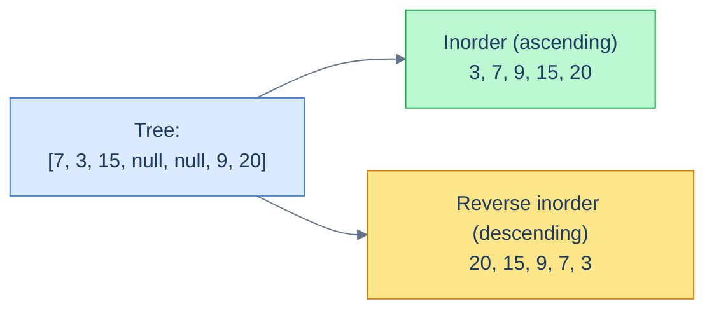

# 9. Iterators in Binary Search Trees

## The Hook

Every problem in this chapter so far has answered a single question. *Find this value. Insert this. Delete that.* But many real workloads need something different — they need to **walk through the entries** of a sorted structure one at a time, and stop early as soon as they have what they need.

Imagine paging through your contacts in alphabetical order, but only loading the next contact when you scroll to it. Or running a `SELECT … ORDER BY price LIMIT 10` against a database — the engine doesn't sort everything; it pulls items off an **iterator** until it has 10. Or running a streaming join over two sorted sets — you only ever look at the next value of each.

A naive in-order traversal of a BST can compute the sorted sequence — but it does *all of it*, *all at once*, and uses O(n) extra storage to hold the result. That's a non-starter when the tree has a million nodes and you only need the first three.

The fix is to build an **iterator**: an object that exposes two operations, `hasNext()` and `next()`, and lazily computes the in-order sequence one node at a time. The trick is that the recursive in-order traversal isn't actually pausable — the recursion runs to completion. We have to *unroll* the recursion into an explicit stack we control, so that we can stop, pause, hand a single value back, and resume later.

This lesson builds two such iterators — a **forward** iterator that walks ascending order and a **reverse** iterator that walks descending order — and analyses why each `next()` call is amortised O(1) despite worst-case O(h) work.

---

## Table of Contents

1. [Understanding iterators in binary search trees](#understanding-iterators-in-binary-search-trees)
2. [Understanding the forward BST iterator](#understanding-the-forward-bst-iterator)
3. [Design a forward BST iterator](#design-a-forward-bst-iterator)
4. [Understanding the reverse BST iterator](#understanding-the-reverse-bst-iterator)
5. [Design a reverse BST iterator](#design-a-reverse-bst-iterator)

***

# Understanding iterators in binary search trees

Recall: an **in-order** traversal of a BST visits values in ascending order; a **reverse in-order** traversal visits them in descending order. Both produce the *correct* sequence — but a naive recursive (or fully iterative) implementation visits every node before returning anything. We need a *lazy* version.



<p align="center"><strong>The same tree produces ascending order via in-order, descending via reverse in-order. Each is the foundation of one iterator.</strong></p>

> An **iterator** is an abstraction over a data structure that lets you traverse it one element at a time, on demand, by calling `next()` whenever the next element is wanted. Internally it carries just enough state to *resume* the traversal in O(1) (or amortised O(1)).

The contract we'll implement everywhere in this lesson:


```pseudocode
class BSTIterator:
    function BSTIterator(root):
        # initialise iterator state — does NOT walk the whole tree
        pass

    function hasNext() → bool:
        # are there any more nodes to visit?
        pass

    function next() → node:
        # return the next node in iteration order
        pass
```

```python run
class BSTIterator:
    def __init__(self, root):
        # Initialise iterator state — does NOT walk the whole tree.
        pass

    def has_next(self) -> bool:
        # Are there any more nodes to visit?
        pass

    def next(self):
        # Return the next node in the iteration order.
        pass
```

```java run
class BSTIterator {
    public BSTIterator(TreeNode root) { /* set up state, do NOT walk whole tree */ }
    public boolean hasNext()          { /* any nodes left? */ return false; }
    public TreeNode next()            { /* next node in order */ return null; }
}
```

```c run
// Iterator state opaque to callers; the API mirrors hasNext/next.
typedef struct BSTIterator BSTIterator;
BSTIterator *bstIteratorCreate(struct TreeNode *root);
int          bstIteratorHasNext(BSTIterator *it);
struct TreeNode *bstIteratorNext(BSTIterator *it);
void         bstIteratorFree(BSTIterator *it);
```

```scala run
class TreeNode(var value: Int, var left: TreeNode = null, var right: TreeNode = null)

object Main extends App {
  class BSTIterator(root: TreeNode) {
    def hasNext: Boolean = false              // any nodes left?
    def next:    TreeNode = null              // next node in order
  }

  val root = new TreeNode(1)
  println(new BSTIterator(root).hasNext)  // false
}
```


That's the surface area. The interesting work is in the constructor and `next()`, which together must produce the right values without ever walking the whole tree at once.

***

# Understanding the forward BST iterator

The standard *iterative* in-order traversal of a binary tree uses a stack like this:

1. Push the root and all its left descendants onto the stack.
2. Pop the top — that's the next in-order value.
3. Push that node's right child and all *its* left descendants.
4. Repeat until the stack is empty.

Look at the structure: between any two values, the entire algorithm is "pop one, push the right-spine". That's an *interruptable* pattern. We can stop the moment we pop a value, hand it to the caller, and resume (with the right-spine push) on the next call to `next()`.

So a forward BST iterator is just *the iterative in-order traversal, sliced into one-step calls*.

```mermaid
---
config:
  theme: base
  themeVariables:
    primaryColor: "#dbeafe"
    primaryBorderColor: "#3b82f6"
    primaryTextColor: "#1e3a5f"
    lineColor: "#64748b"
    secondaryColor: "#ede9fe"
    tertiaryColor: "#fef9c3"
---
flowchart TB
    subgraph Init["Constructor: pushAllLeft(root)"]
        I1["root = 7"]
        I1 --> I2["push 7"]
        I2 --> I3["go left → 3"]
        I3 --> I4["push 3"]
        I4 --> I5["3.left = null → stop"]
        I5 --> I6["stack = [7, 3]"]
        style I6 fill:#bbf7d0,stroke:#16a34a
    end
    subgraph N1["next() #1"]
        S1["top = 3"]
        S1 --> S2["pop → return 3"]
        S2 --> S3["pushAllLeft(3.right) — none"]
        S3 --> S4["stack = [7]"]
    end
    subgraph N2["next() #2"]
        T1["top = 7"]
        T1 --> T2["pop → return 7"]
        T2 --> T3["pushAllLeft(7.right = 15)"]
        T3 --> T4["push 15, push 9"]
        T4 --> T5["stack = [15, 9]"]
    end
```



<p align="center"><strong>Lazy in-order traversal of the tree <code>[7, 3, 15, null, null, 9, 20]</code>. The constructor primes the stack with the leftmost path; each <code>next()</code> pops, returns, then pushes the right-spine.</strong></p>

The state held between calls is the **stack** — at any moment it contains exactly the *right-spine* path from the next-to-visit node up toward the root. The size of the stack is at most the height of the tree.

## Algorithm

> **ForwardBstIterator**
>
> **constructor(root):**
>
> - **Step 1:** Initialise an empty stack `stack` as a member.
> - **Step 2:** Call `pushAllLeft(root)`.
>
> **pushAllLeft(node):**
>
> - **Step 1:** While `node` is not `null`, push it onto `stack` and set `node = node.left`.
>
> **hasNext():**
>
> - **Step 1:** Return `true` if `stack` is non-empty, else `false`.
>
> **next():**
>
> - **Step 1:** If the stack is empty, return `null`.
> - **Step 2:** Pop the top of the stack — call it `node`.
> - **Step 3:** `pushAllLeft(node.right)`.
> - **Step 4:** Return `node`.

## Why is `next()` amortised O(1)?

> *Friction prompt — predict before reading on. The worst-case cost of a single `next()` call is O(h), because `pushAllLeft` may walk down the tree all the way to a leaf. But we say each `next()` is *amortised* O(1). What's the argument?*

Each node is pushed onto the stack **exactly once** over the lifetime of the iterator. It is popped **exactly once**. So the total work over the entire iteration of `n` nodes is `2n` push/pop operations — `O(n)` total. Spread across `n` calls to `next()`, that's an amortised `O(1)` per call.

A specific call may do `O(h)` work (when it has to push a long left-spine), but every push it makes is a push that some *later* call won't have to do. The bookkeeping balances out.

## Complexity

| Operation | Time | Space |
|---|---|---|
| `constructor()` | O(h) | — |
| `hasNext()` | O(1) | — |
| `next()` | **amortised O(1)** | — |
| Iterator state | — | O(h) |

The space is O(h) because the stack only holds the path of unvisited ancestors of the next-to-emit node — at most one per level.

***

# Design a forward BST iterator

## Problem Statement

Given the skeleton of a `ForwardBstIterator` class, complete it by implementing the operations below.

> - **ForwardBstIterator(TreeNode root)** — initialise the iterator with the BST root.
> - **hasNext()** — return `true` if more nodes remain to be visited, `false` otherwise.
> - **next()** — advance the iterator and return the next node in in-order sequence.

### Example

> - **Input ops:** `[ForwardBstIterator, next, next, hasNext, next, hasNext, next, hasNext, next, hasNext]`
> - **Input args:** `[[7, 3, 15, null, null, 9, 20], [], [], [], [], [], [], [], [], []]`
> - **Output:** `[null, 3, 7, true, 9, true, 15, true, 20, false]`

## The Solution


```pseudocode
class ForwardBstIterator:
    function ForwardBstIterator(root):
        stack ← empty stack
        pushAllLeft(root)              # prime with the leftmost path

    function pushAllLeft(node):
        while node is NOT null:
            push node onto stack
            node ← node.left

    function hasNext() → bool:
        return stack is NOT empty

    function next() → node:
        if NOT hasNext(): return null
        node ← pop from stack          # top of stack = next in-order value
        pushAllLeft(node.right)        # prepare the right-spine for the next call
        return node
```

```python run
class ForwardBstIterator:
    def __init__(self, root):
        # Stack holds the path from the next-to-emit node up toward the root.
        self.stack = []
        # Prime the stack with the leftmost path.
        self.push_all_left(root)

    def push_all_left(self, node):
        # Push node + every left descendant onto the stack.
        while node is not None:
            self.stack.append(node)
            node = node.left

    def has_next(self):
        # Non-empty stack ⇔ at least one node remains.
        return len(self.stack) > 0

    def next(self):
        if not self.has_next():
            return None
        # Top of stack is the next in-order node.
        node = self.stack.pop()
        # Prepare for the *next* next() call: push the right-spine.
        self.push_all_left(node.right)
        return node
```

```java run
import java.util.*;

class ForwardBstIterator {
    private final Deque<TreeNode> stack = new ArrayDeque<>();                              // ancestor path

    public ForwardBstIterator(TreeNode root) { pushAllLeft(root); }                         // prime

    private void pushAllLeft(TreeNode node) {
        while (node != null) { stack.push(node); node = node.left; }                        // walk left-spine
    }

    public boolean hasNext() { return !stack.isEmpty(); }

    public TreeNode next() {
        if (!hasNext()) return null;
        TreeNode node = stack.pop();                                                         // top = next in-order
        pushAllLeft(node.right);                                                             // queue right-spine
        return node;
    }
}
```

```c run
#include <stdlib.h>

#define MAX_DEPTH 1024

typedef struct ForwardBstIterator {
    struct TreeNode **stack;
    int top;
} ForwardBstIterator;

static void push_all_left(ForwardBstIterator *it, struct TreeNode *node) {
    while (node != NULL) {
        it->stack[++it->top] = node;
        node = node->left;
    }
}

ForwardBstIterator *bSTIteratorCreate(struct TreeNode *root) {
    ForwardBstIterator *it = malloc(sizeof(*it));
    it->stack = malloc(sizeof(struct TreeNode *) * MAX_DEPTH);
    it->top = -1;
    push_all_left(it, root);                                                                  // prime
    return it;
}

int bSTIteratorHasNext(ForwardBstIterator *it) { return it->top >= 0; }

struct TreeNode *bSTIteratorNext(ForwardBstIterator *it) {
    if (!bSTIteratorHasNext(it)) return NULL;
    struct TreeNode *node = it->stack[it->top--];                                              // pop top
    push_all_left(it, node->right);                                                            // queue right-spine
    return node;
}

void bSTIteratorFree(ForwardBstIterator *it) { free(it->stack); free(it); }
```

```scala run
import scala.collection.mutable

class TreeNode(var value: Int, var left: TreeNode = null, var right: TreeNode = null)

object Main extends App {
  class ForwardBstIterator(root: TreeNode) {
    private val stack = mutable.Stack[TreeNode]()                                                   // ancestor path
    pushAllLeft(root)                                                                                // prime

    private def pushAllLeft(node: TreeNode): Unit = {
      var n = node
      while (n != null) { stack.push(n); n = n.left }                                                // walk left-spine
    }

    def hasNext: Boolean = stack.nonEmpty

    def next: TreeNode = {
      if (!hasNext) return null
      val node = stack.pop()                                                                          // top = next
      pushAllLeft(node.right)                                                                         // queue right
      node
    }
  }

  val root = new TreeNode(7,
    new TreeNode(3),
    new TreeNode(15, new TreeNode(9), new TreeNode(20)))
  val it = new ForwardBstIterator(root)
  println(s"${it.next.value} ${it.next.value} ${it.next.value} ${it.next.value} ${it.next.value}")  // 3 7 9 15 20
}
```


***

# Understanding the reverse BST iterator

A **reverse BST iterator** produces values in **descending** order. The mirror image of forward iteration: instead of pre-loading the *left*-spine and then pushing the *right*-spine after each pop, we pre-load the *right*-spine and push the *left*-spine after each pop.

```mermaid
---
config:
  theme: base
  themeVariables:
    primaryColor: "#dbeafe"
    primaryBorderColor: "#3b82f6"
    primaryTextColor: "#1e3a5f"
    lineColor: "#64748b"
    secondaryColor: "#ede9fe"
    tertiaryColor: "#fef9c3"
---
flowchart TB
    subgraph Init["Constructor: pushAllRight(root)"]
        I1["root = 7"]
        I1 --> I2["push 7"]
        I2 --> I3["go right → 15"]
        I3 --> I4["push 15"]
        I4 --> I5["go right → 20"]
        I5 --> I6["push 20"]
        I6 --> I7["20.right = null → stop"]
        I7 --> I8["stack = [7, 15, 20]"]
        style I8 fill:#fde68a,stroke:#d97706
    end
    subgraph N1["next() #1"]
        S1["top = 20"]
        S1 --> S2["pop → return 20"]
        S2 --> S3["pushAllRight(20.left) — none"]
        S3 --> S4["stack = [7, 15]"]
    end
```



<p align="center"><strong>Lazy reverse in-order traversal: pre-load the right-spine, then on each <code>next()</code> pop the top and push the left-spine of its left child.</strong></p>

## Algorithm

> **ReverseBstIterator**
>
> **constructor(root):**
>
> - **Step 1:** Initialise empty stack.
> - **Step 2:** Call `pushAllRight(root)`.
>
> **pushAllRight(node):**
>
> - **Step 1:** While `node` is not `null`, push it and set `node = node.right`.
>
> **hasNext():**
>
> - **Step 1:** Return `stack` not empty.
>
> **next():**
>
> - **Step 1:** If stack is empty, return `null`.
> - **Step 2:** Pop top — call it `node`.
> - **Step 3:** `pushAllRight(node.left)`.
> - **Step 4:** Return `node`.

## Complexity

Same as the forward iterator — every node is pushed and popped exactly once over the iterator's life.

| Operation | Time | Space |
|---|---|---|
| `constructor()` | O(h) | — |
| `hasNext()` | O(1) | — |
| `next()` | amortised O(1) | — |
| Iterator state | — | O(h) |

***

# Design a reverse BST iterator

## Problem Statement

Given the skeleton of a `ReverseBstIterator` class, complete it. Same surface as the forward iterator, but `next()` returns nodes in *descending* order.

### Example

> - **Input ops:** `[ReverseBstIterator, next, next, hasNext, next, hasNext, next, hasNext, next, hasNext]`
> - **Input args:** `[[7, 3, 15, null, null, 9, 20], [], [], [], [], [], [], [], [], []]`
> - **Output:** `[null, 20, 15, true, 9, true, 7, true, 3, false]`

## The Solution


```pseudocode
class ReverseBstIterator:
    function ReverseBstIterator(root):
        stack ← empty stack
        pushAllRight(root)             # prime with the rightmost path

    function pushAllRight(node):
        while node is NOT null:
            push node onto stack
            node ← node.right

    function hasNext() → bool:
        return stack is NOT empty

    function next() → node:
        if NOT hasNext(): return null
        node ← pop from stack          # top of stack = next in reverse-order
        pushAllRight(node.left)        # mirror of forward: push the left-spine
        return node
```

```python run
class ReverseBstIterator:
    def __init__(self, root):
        # Stack now tracks the *rightmost*-spine path from the next-to-emit node
        # up toward the root. Same shape as forward iterator, mirrored direction.
        self.stack = []
        self.push_all_right(root)

    def push_all_right(self, node):
        # Push node + every right descendant onto the stack.
        while node is not None:
            self.stack.append(node)
            node = node.right

    def has_next(self):
        return len(self.stack) > 0

    def next(self):
        if not self.has_next():
            return None
        node = self.stack.pop()
        # After emitting, prepare the next: the next-larger-but-smaller candidate
        # lives in the LEFT subtree, so descend the left-spine of node.left.
        self.push_all_right(node.left)
        return node
```

```java run
import java.util.*;

class ReverseBstIterator {
    private final Deque<TreeNode> stack = new ArrayDeque<>();

    public ReverseBstIterator(TreeNode root) { pushAllRight(root); }

    private void pushAllRight(TreeNode node) {
        while (node != null) { stack.push(node); node = node.right; }
    }

    public boolean hasNext() { return !stack.isEmpty(); }

    public TreeNode next() {
        if (!hasNext()) return null;
        TreeNode node = stack.pop();
        pushAllRight(node.left);                                                                       // mirror of forward
        return node;
    }
}
```

```c run
#include <stdlib.h>
#define MAX_DEPTH 1024

typedef struct ReverseBstIterator {
    struct TreeNode **stack;
    int top;
} ReverseBstIterator;

static void push_all_right(ReverseBstIterator *it, struct TreeNode *node) {
    while (node != NULL) {
        it->stack[++it->top] = node;
        node = node->right;
    }
}

ReverseBstIterator *reverseBSTIteratorCreate(struct TreeNode *root) {
    ReverseBstIterator *it = malloc(sizeof(*it));
    it->stack = malloc(sizeof(struct TreeNode *) * MAX_DEPTH);
    it->top = -1;
    push_all_right(it, root);
    return it;
}

int reverseBSTIteratorHasNext(ReverseBstIterator *it) { return it->top >= 0; }

struct TreeNode *reverseBSTIteratorNext(ReverseBstIterator *it) {
    if (!reverseBSTIteratorHasNext(it)) return NULL;
    struct TreeNode *node = it->stack[it->top--];
    push_all_right(it, node->left);                                                                      // mirror
    return node;
}

void reverseBSTIteratorFree(ReverseBstIterator *it) { free(it->stack); free(it); }
```

```scala run
import scala.collection.mutable

class TreeNode(var value: Int, var left: TreeNode = null, var right: TreeNode = null)

object Main extends App {
  class ReverseBstIterator(root: TreeNode) {
    private val stack = mutable.Stack[TreeNode]()
    pushAllRight(root)

    private def pushAllRight(node: TreeNode): Unit = {
      var n = node
      while (n != null) { stack.push(n); n = n.right }
    }

    def hasNext: Boolean = stack.nonEmpty

    def next: TreeNode = {
      if (!hasNext) return null
      val node = stack.pop()
      pushAllRight(node.left)                                                                                  // mirror
      node
    }
  }

  val root = new TreeNode(7,
    new TreeNode(3),
    new TreeNode(15, new TreeNode(9), new TreeNode(20)))
  val it = new ReverseBstIterator(root)
  println(s"${it.next.value} ${it.next.value} ${it.next.value} ${it.next.value} ${it.next.value}")  // 20 15 9 7 3
}
```


<details>
<summary><strong>Trace — root = [7, 3, 15, null, null, 9, 20], reverse iteration</strong></summary>

```
Constructor → pushAllRight(7) → push 7 → push 15 → push 20 → 20.right=null → stop
            stack = [7, 15, 20]

next() #1 │ pop 20 → pushAllRight(20.left = null) → stack = [7, 15]   → return 20
next() #2 │ pop 15 → pushAllRight(15.left = 9) → push 9 → 9.right=null → stack = [7, 9]
                                                                       → return 15
next() #3 │ pop 9  → pushAllRight(9.left = null)                        → stack = [7]
                                                                       → return 9
next() #4 │ pop 7  → pushAllRight(7.left = 3) → push 3 → 3.right=null   → stack = [3]
                                                                       → return 7
next() #5 │ pop 3  → pushAllRight(3.left = null)                        → stack = []
                                                                       → return 3
hasNext() → false ✓
```

</details>

***

## Final Takeaway

A BST iterator is a recursive in-order traversal *paused at every yield* — implemented by holding the recursion's call stack as an **explicit stack of ancestors**. The forward variant pre-loads the left-spine and pushes the right-spine after each pop; the reverse variant mirrors it. Each `next()` is **amortised O(1)** because every node is pushed and popped exactly once across the iterator's life.

Three big patterns:

1. **Lazy traversal via explicit stack** — appears whenever you need to walk a recursive structure on demand: parsing, JSON streaming, generators in Python, `IEnumerator` in C#, the `Iterator` trait in Rust.
2. **Forward and reverse are mirrors** — every iterator in this lesson is one swap (`left ↔ right`) away from its dual. Whenever you write code that works for one order, the descending version is a mechanical mirror.
3. **Amortised analysis is the right lens for iterators** — the per-operation worst case is misleading; what matters is the total work across the full iteration, which the stack-once invariant pins down nicely.

The next four lessons turn this iterator into a tool for solving problems. Lesson 10 (sorted traversal) uses *one* forward iterator to handle problems like "validate a BST" and "find the k-th smallest". Lesson 11 (reversed sorted traversal) does the same with a reverse iterator. Lesson 12 (range postorder) uses the BST property to *prune* during traversal. And lesson 13 (two-pointer) uses *both* iterators at once — a forward and a reverse — running toward each other across the sorted sequence the BST silently encodes.
