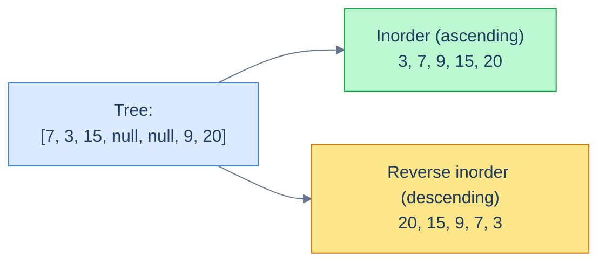

# 9. Iterators in Binary Search Trees

## The Hook

Every problem in this chapter so far has answered a single question. *Find this value. Insert this. Delete that.* But many real workloads need something different — they need to **walk through the entries** of a sorted structure one at a time, and stop early as soon as they have what they need.

Imagine paging through your contacts in alphabetical order, but only loading the next contact when you scroll to it. Or running a `SELECT … ORDER BY price LIMIT 10` against a database — the engine doesn't sort everything; it pulls items off an **iterator** until it has 10. Or running a streaming join over two sorted sets — you only ever look at the next value of each.

A naive in-order traversal of a BST can compute the sorted sequence — but it does *all of it*, *all at once*, and uses O(n) extra storage to hold the result. That's a non-starter when the tree has a million nodes and you only need the first three.

The fix is to build an **iterator**: an object that exposes two operations, `hasNext()` and `next()`, and lazily computes the in-order sequence one node at a time. The trick is that the recursive in-order traversal isn't actually pausable — the recursion runs to completion. We have to *unroll* the recursion into an explicit stack we control, so that we can stop, pause, hand a single value back, and resume later.

This lesson builds two such iterators — a **forward** iterator that walks ascending order and a **reverse** iterator that walks descending order — and analyses why each `next()` call is amortised O(1) despite worst-case O(h) work.

---

## Table of Contents

1. [Understanding iterators in binary search trees](#understanding-iterators-in-binary-search-trees)
2. [Understanding the forward BST iterator](#understanding-the-forward-bst-iterator)
3. [Design a forward BST iterator](#design-a-forward-bst-iterator)
4. [Understanding the reverse BST iterator](#understanding-the-reverse-bst-iterator)
5. [Design a reverse BST iterator](#design-a-reverse-bst-iterator)

***

# Understanding iterators in binary search trees

Recall: an **in-order** traversal of a BST visits values in ascending order; a **reverse in-order** traversal visits them in descending order. Both produce the *correct* sequence — but a naive recursive (or fully iterative) implementation visits every node before returning anything. We need a *lazy* version.



<p align="center"><strong>The same tree produces ascending order via in-order, descending via reverse in-order. Each is the foundation of one iterator.</strong></p>

> An **iterator** is an abstraction over a data structure that lets you traverse it one element at a time, on demand, by calling `next()` whenever the next element is wanted. Internally it carries just enough state to *resume* the traversal in O(1) (or amortised O(1)).

The contract we'll implement everywhere in this lesson:


```python run viz=binary-tree viz-root=root
"""
Definition for a binary tree node.
class TreeNode:
    def __init__(self, val):
        self.val = val
        self.left = None
        self.right = None
"""

from typing import Optional

class BSTIterator:
    def __init__(self, root: Optional[TreeNode]) -> None:
        pass

    def has_next(self) -> bool:
        # Is there a next item?
        pass

    def next(self) -> TreeNode:
        # Return the next node
        pass
```

```java run viz=binary-tree viz-root=root
/**
 * Definition for a binary tree node.
 * class TreeNode {
 *      int val;
 *      TreeNode left;
 *      TreeNode right;
 *      TreeNode() {}
 *      TreeNode(int val) { this.val = val; }
 * }
 */

class BSTIterator {
    public BSTIterator(TreeNode root) {

    }

    public boolean hasNext() {
        // Is there a next item?
    }

    public TreeNode next() {
        // Return the next node
    }
}
```


That's the surface area. The interesting work is in the constructor and `next()`, which together must produce the right values without ever walking the whole tree at once.

***

# Understanding the forward BST iterator

The standard *iterative* in-order traversal of a binary tree uses a stack like this:

1. Push the root and all its left descendants onto the stack.
2. Pop the top — that's the next in-order value.
3. Push that node's right child and all *its* left descendants.
4. Repeat until the stack is empty.

Look at the structure: between any two values, the entire algorithm is "pop one, push the right-spine". That's an *interruptable* pattern. We can stop the moment we pop a value, hand it to the caller, and resume (with the right-spine push) on the next call to `next()`.

So a forward BST iterator is just *the iterative in-order traversal, sliced into one-step calls*.

```mermaid
---
config:
  theme: base
  themeVariables:
    primaryColor: "#dbeafe"
    primaryBorderColor: "#3b82f6"
    primaryTextColor: "#1e3a5f"
    lineColor: "#64748b"
    secondaryColor: "#ede9fe"
    tertiaryColor: "#fef9c3"
---
flowchart TB
    subgraph Init["Constructor: pushAllLeft(root)"]
        I1["root = 7"]
        I1 --> I2["push 7"]
        I2 --> I3["go left → 3"]
        I3 --> I4["push 3"]
        I4 --> I5["3.left = null → stop"]
        I5 --> I6["stack = [7, 3]"]
        style I6 fill:#bbf7d0,stroke:#16a34a
    end
    subgraph N1["next() #1"]
        S1["top = 3"]
        S1 --> S2["pop → return 3"]
        S2 --> S3["pushAllLeft(3.right) — none"]
        S3 --> S4["stack = [7]"]
    end
    subgraph N2["next() #2"]
        T1["top = 7"]
        T1 --> T2["pop → return 7"]
        T2 --> T3["pushAllLeft(7.right = 15)"]
        T3 --> T4["push 15, push 9"]
        T4 --> T5["stack = [15, 9]"]
    end
```



<p align="center"><strong>Lazy in-order traversal of the tree <code>[7, 3, 15, null, null, 9, 20]</code>. The constructor primes the stack with the leftmost path; each <code>next()</code> pops, returns, then pushes the right-spine.</strong></p>

The state held between calls is the **stack** — at any moment it contains exactly the *right-spine* path from the next-to-visit node up toward the root. The size of the stack is at most the height of the tree.

## Algorithm

> **ForwardBstIterator**
>
> **constructor(root):**
>
> - **Step 1:** Initialise an empty stack `stack` as a member.
> - **Step 2:** Call `pushAllLeft(root)`.
>
> **pushAllLeft(node):**
>
> - **Step 1:** While `node` is not `null`, push it onto `stack` and set `node = node.left`.
>
> **hasNext():**
>
> - **Step 1:** Return `true` if `stack` is non-empty, else `false`.
>
> **next():**
>
> - **Step 1:** If the stack is empty, return `null`.
> - **Step 2:** Pop the top of the stack — call it `node`.
> - **Step 3:** `pushAllLeft(node.right)`.
> - **Step 4:** Return `node`.

## Why is `next()` amortised O(1)?

> *Friction prompt — predict before reading on. The worst-case cost of a single `next()` call is O(h), because `pushAllLeft` may walk down the tree all the way to a leaf. But we say each `next()` is *amortised* O(1). What's the argument?*

Each node is pushed onto the stack **exactly once** over the lifetime of the iterator. It is popped **exactly once**. So the total work over the entire iteration of `n` nodes is `2n` push/pop operations — `O(n)` total. Spread across `n` calls to `next()`, that's an amortised `O(1)` per call.

A specific call may do `O(h)` work (when it has to push a long left-spine), but every push it makes is a push that some *later* call won't have to do. The bookkeeping balances out.

## Complexity

| Operation | Time | Space |
|---|---|---|
| `constructor()` | O(h) | — |
| `hasNext()` | O(1) | — |
| `next()` | **amortised O(1)** | — |
| Iterator state | — | O(h) |

The space is O(h) because the stack only holds the path of unvisited ancestors of the next-to-emit node — at most one per level.

***

# Design a forward BST iterator

## Problem Statement

Given the skeleton of a `ForwardBstIterator` class, complete it by implementing the operations below.

> - **ForwardBstIterator(TreeNode root)** — initialise the iterator with the BST root.
> - **hasNext()** — return `true` if more nodes remain to be visited, `false` otherwise.
> - **next()** — advance the iterator and return the next node in in-order sequence.

### Example

> - **Input ops:** `[ForwardBstIterator, next, next, hasNext, next, hasNext, next, hasNext, next, hasNext]`
> - **Input args:** `[[7, 3, 15, null, null, 9, 20], [], [], [], [], [], [], [], [], []]`
> - **Output:** `[null, 3, 7, true, 9, true, 15, true, 20, false]`

<details>
<summary><h2>The Solution</h2></summary>


```python run viz=binary-tree viz-root=root
from typing import Optional, List


class TreeNode:
    def __init__(self, val=0, left=None, right=None):
        self.val = val
        self.left = left
        self.right = right


def from_level_order(values):
    """Build tree from list like [1, 2, 3, None, 4]. None means missing child."""
    if not values:
        return None
    root = TreeNode(values[0])
    queue = [root]
    i = 1
    while queue and i < len(values):
        node = queue.pop(0)
        if i < len(values) and values[i] is not None:
            node.left = TreeNode(values[i])
            queue.append(node.left)
        i += 1
        if i < len(values) and values[i] is not None:
            node.right = TreeNode(values[i])
            queue.append(node.right)
        i += 1
    return root


class ForwardBstIterator:
    def __init__(self, root: Optional[TreeNode]):

        # Create a stack to store tree nodes
        self.stack: List[TreeNode] = []
        self.push_all_left(root)

    # Helper function to push all left child nodes of the current node
    # onto the stack
    def push_all_left(self, node: Optional[TreeNode]) -> None:
        while node:

            # Push the node onto the stack
            self.stack.append(node)

            # Move to the left child
            node = node.left

    def has_next(self) -> bool:

        # If the stack is not empty, there are more elements
        return bool(self.stack)

    def next(self) -> Optional[TreeNode]:

        # If there are no more nodes to visit in the BST, return null
        # to indicate that next() has no valid node to return.
        if not self.has_next():
            return None

        # Get the top node from the stack
        node = self.stack.pop()

        # Push all left child nodes of the right subtree onto the stack
        self.push_all_left(node.right)

        # Return the current node
        return node


# Example from problem statement: [7, 3, 15, null, null, 9, 20]
it1 = ForwardBstIterator(from_level_order([7, 3, 15, None, None, 9, 20]))
print(it1.next().val)    # 3
print(it1.next().val)    # 7
print(it1.has_next())    # True
print(it1.next().val)    # 9
print(it1.has_next())    # True
print(it1.next().val)    # 15
print(it1.has_next())    # True
print(it1.next().val)    # 20
print(it1.has_next())    # False

# Edge cases
it2 = ForwardBstIterator(None)                         # empty tree
print(it2.has_next())    # False

it3 = ForwardBstIterator(from_level_order([5]))        # single node
print(it3.next().val)    # 5
print(it3.has_next())    # False

# Right-skew: 1 -> 2 -> 3
it4 = ForwardBstIterator(from_level_order([1, None, 2, None, 3]))
seq4 = []
while it4.has_next():
    seq4.append(it4.next().val)
print(seq4)              # [1, 2, 3]
```

```java run viz=binary-tree viz-root=root
import java.util.*;

public class Main {
    static class TreeNode {
        int val;
        TreeNode left;
        TreeNode right;
        TreeNode() {}
        TreeNode(int val) { this.val = val; }
    }

    static TreeNode fromLevelOrder(Integer... values) {
        if (values.length == 0 || values[0] == null) return null;
        TreeNode root = new TreeNode(values[0]);
        java.util.Deque<TreeNode> queue = new java.util.ArrayDeque<>();
        queue.add(root);
        int i = 1;
        while (!queue.isEmpty() && i < values.length) {
            TreeNode node = queue.poll();
            if (i < values.length && values[i] != null) {
                node.left = new TreeNode(values[i]);
                queue.add(node.left);
            }
            i++;
            if (i < values.length && values[i] != null) {
                node.right = new TreeNode(values[i]);
                queue.add(node.right);
            }
            i++;
        }
        return root;
    }

    static class ForwardBstIterator {

        // Create a stack to store tree nodes
        private Stack<TreeNode> stack;

        public ForwardBstIterator(TreeNode root) {
            stack = new Stack<>();

            // Push all left child nodes of the root onto the stack
            pushAllLeft(root);
        }

        // Helper function to push all left child nodes of the current node
        // onto the stack
        private void pushAllLeft(TreeNode node) {
            while (node != null) {

                // Push the node onto the stack
                stack.push(node);

                // Move to the left child
                node = node.left;
            }
        }

        public boolean hasNext() {

            // If the stack is not empty, there are more elements
            return !stack.empty();
        }

        public TreeNode next() {

            // If there are no more nodes to visit in the BST, return null
            // to indicate that next() has no valid node to return.
            if (!hasNext()) {
                return null;
            }

            // Get the top node from the stack
            TreeNode node = stack.pop();

            // Push all left child nodes of the right subtree onto the stack
            pushAllLeft(node.right);

            // Return the current node
            return node;
        }
    }

    public static void main(String[] args) {
        // Example from problem statement: [7, 3, 15, null, null, 9, 20]
        ForwardBstIterator it1 = new ForwardBstIterator(
            fromLevelOrder(7, 3, 15, null, null, 9, 20));
        System.out.println(it1.next().val);  // 3
        System.out.println(it1.next().val);  // 7
        System.out.println(it1.hasNext());   // true
        System.out.println(it1.next().val);  // 9
        System.out.println(it1.hasNext());   // true
        System.out.println(it1.next().val);  // 15
        System.out.println(it1.hasNext());   // true
        System.out.println(it1.next().val);  // 20
        System.out.println(it1.hasNext());   // false

        // Edge cases
        ForwardBstIterator it2 = new ForwardBstIterator(null); // empty tree
        System.out.println(it2.hasNext());   // false

        ForwardBstIterator it3 = new ForwardBstIterator(fromLevelOrder(5)); // single node
        System.out.println(it3.next().val);  // 5
        System.out.println(it3.hasNext());   // false

        // Right-skew: 1 -> 2 -> 3
        ForwardBstIterator it4 = new ForwardBstIterator(
            fromLevelOrder(1, null, 2, null, 3));
        List<Integer> seq4 = new ArrayList<>();
        while (it4.hasNext()) seq4.add(it4.next().val);
        System.out.println(seq4);            // [1, 2, 3]
    }
}
```

</details>


***

# Understanding the reverse BST iterator

A **reverse BST iterator** produces values in **descending** order. The mirror image of forward iteration: instead of pre-loading the *left*-spine and then pushing the *right*-spine after each pop, we pre-load the *right*-spine and push the *left*-spine after each pop.

```mermaid
---
config:
  theme: base
  themeVariables:
    primaryColor: "#dbeafe"
    primaryBorderColor: "#3b82f6"
    primaryTextColor: "#1e3a5f"
    lineColor: "#64748b"
    secondaryColor: "#ede9fe"
    tertiaryColor: "#fef9c3"
---
flowchart TB
    subgraph Init["Constructor: pushAllRight(root)"]
        I1["root = 7"]
        I1 --> I2["push 7"]
        I2 --> I3["go right → 15"]
        I3 --> I4["push 15"]
        I4 --> I5["go right → 20"]
        I5 --> I6["push 20"]
        I6 --> I7["20.right = null → stop"]
        I7 --> I8["stack = [7, 15, 20]"]
        style I8 fill:#fde68a,stroke:#d97706
    end
    subgraph N1["next() #1"]
        S1["top = 20"]
        S1 --> S2["pop → return 20"]
        S2 --> S3["pushAllRight(20.left) — none"]
        S3 --> S4["stack = [7, 15]"]
    end
```



<p align="center"><strong>Lazy reverse in-order traversal: pre-load the right-spine, then on each <code>next()</code> pop the top and push the left-spine of its left child.</strong></p>

## Algorithm

> **ReverseBstIterator**
>
> **constructor(root):**
>
> - **Step 1:** Initialise empty stack.
> - **Step 2:** Call `pushAllRight(root)`.
>
> **pushAllRight(node):**
>
> - **Step 1:** While `node` is not `null`, push it and set `node = node.right`.
>
> **hasNext():**
>
> - **Step 1:** Return `stack` not empty.
>
> **next():**
>
> - **Step 1:** If stack is empty, return `null`.
> - **Step 2:** Pop top — call it `node`.
> - **Step 3:** `pushAllRight(node.left)`.
> - **Step 4:** Return `node`.

## Complexity

Same as the forward iterator — every node is pushed and popped exactly once over the iterator's life.

| Operation | Time | Space |
|---|---|---|
| `constructor()` | O(h) | — |
| `hasNext()` | O(1) | — |
| `next()` | amortised O(1) | — |
| Iterator state | — | O(h) |

***

# Design a reverse BST iterator

## Problem Statement

Given the skeleton of a `ReverseBstIterator` class, complete it. Same surface as the forward iterator, but `next()` returns nodes in *descending* order.

### Example

> - **Input ops:** `[ReverseBstIterator, next, next, hasNext, next, hasNext, next, hasNext, next, hasNext]`
> - **Input args:** `[[7, 3, 15, null, null, 9, 20], [], [], [], [], [], [], [], [], []]`
> - **Output:** `[null, 20, 15, true, 9, true, 7, true, 3, false]`

<details>
<summary><h2>The Solution</h2></summary>


```python run viz=binary-tree viz-root=root
from typing import Optional, List


class TreeNode:
    def __init__(self, val=0, left=None, right=None):
        self.val = val
        self.left = left
        self.right = right


def from_level_order(values):
    """Build tree from list like [1, 2, 3, None, 4]. None means missing child."""
    if not values:
        return None
    root = TreeNode(values[0])
    queue = [root]
    i = 1
    while queue and i < len(values):
        node = queue.pop(0)
        if i < len(values) and values[i] is not None:
            node.left = TreeNode(values[i])
            queue.append(node.left)
        i += 1
        if i < len(values) and values[i] is not None:
            node.right = TreeNode(values[i])
            queue.append(node.right)
        i += 1
    return root


class ReverseBstIterator:
    def __init__(self, root: Optional[TreeNode]):

        # Create a stack to store tree nodes
        self.stack: List[TreeNode] = []
        self.push_all_right(root)

    # Helper function to push all right child nodes of the current node
    # onto the stack
    def push_all_right(self, node: Optional[TreeNode]) -> None:
        while node:

            # Push the node onto the stack
            self.stack.append(node)

            # Move to the right child
            node = node.right

    def has_next(self) -> bool:

        # If the stack is not empty, there are more elements
        return bool(self.stack)

    def next(self) -> Optional[TreeNode]:

        # If there are no more nodes to visit in the BST, return null
        # to indicate that next() has no valid node to return.
        if not self.has_next():
            return None

        # Get the top node from the stack
        node = self.stack.pop()

        # Push all left child nodes of the left subtree onto the stack
        self.push_all_right(node.left)

        # Return the current node
        return node


# Example from problem statement: [7, 3, 15, null, null, 9, 20]
it1 = ReverseBstIterator(from_level_order([7, 3, 15, None, None, 9, 20]))
print(it1.next().val)    # 20
print(it1.next().val)    # 15
print(it1.has_next())    # True
print(it1.next().val)    # 9
print(it1.has_next())    # True
print(it1.next().val)    # 7
print(it1.has_next())    # True
print(it1.next().val)    # 3
print(it1.has_next())    # False

# Edge cases
it2 = ReverseBstIterator(None)                          # empty tree
print(it2.has_next())    # False

it3 = ReverseBstIterator(from_level_order([5]))         # single node
print(it3.next().val)    # 5
print(it3.has_next())    # False

# Left-skew: 3 <- 2 <- 1
it4 = ReverseBstIterator(from_level_order([3, 2, None, 1]))
seq4 = []
while it4.has_next():
    seq4.append(it4.next().val)
print(seq4)              # [3, 2, 1]
```

```java run viz=binary-tree viz-root=root
import java.util.*;

public class Main {
    static class TreeNode {
        int val;
        TreeNode left;
        TreeNode right;
        TreeNode() {}
        TreeNode(int val) { this.val = val; }
    }

    static TreeNode fromLevelOrder(Integer... values) {
        if (values.length == 0 || values[0] == null) return null;
        TreeNode root = new TreeNode(values[0]);
        java.util.Deque<TreeNode> queue = new java.util.ArrayDeque<>();
        queue.add(root);
        int i = 1;
        while (!queue.isEmpty() && i < values.length) {
            TreeNode node = queue.poll();
            if (i < values.length && values[i] != null) {
                node.left = new TreeNode(values[i]);
                queue.add(node.left);
            }
            i++;
            if (i < values.length && values[i] != null) {
                node.right = new TreeNode(values[i]);
                queue.add(node.right);
            }
            i++;
        }
        return root;
    }

    static class ReverseBstIterator {

        // Create a stack to store tree nodes
        private Stack<TreeNode> stack;

        public ReverseBstIterator(TreeNode root) {
            stack = new Stack<>();

            // Push all right child nodes of the root onto the stack
            pushAllRight(root);
        }

        // Helper function to push all right child nodes of the current node
        // onto the stack
        private void pushAllRight(TreeNode node) {
            while (node != null) {

                // Push the node onto the stack
                stack.push(node);

                // Move to the right child
                node = node.right;
            }
        }

        public boolean hasNext() {

            // If the stack is not empty, there are more elements
            return !stack.empty();
        }

        public TreeNode next() {

            // If there are no more nodes to visit in the BST, return null
            // to indicate that next() has no valid node to return.
            if (!hasNext()) {
                return null;
            }

            // Get the top node from the stack
            TreeNode node = stack.pop();

            // Push all left child nodes of the left subtree onto the stack
            pushAllRight(node.left);

            // Return the current node
            return node;
        }
    }

    public static void main(String[] args) {
        // Example from problem statement: [7, 3, 15, null, null, 9, 20]
        ReverseBstIterator it1 = new ReverseBstIterator(
            fromLevelOrder(7, 3, 15, null, null, 9, 20));
        System.out.println(it1.next().val);  // 20
        System.out.println(it1.next().val);  // 15
        System.out.println(it1.hasNext());   // true
        System.out.println(it1.next().val);  // 9
        System.out.println(it1.hasNext());   // true
        System.out.println(it1.next().val);  // 7
        System.out.println(it1.hasNext());   // true
        System.out.println(it1.next().val);  // 3
        System.out.println(it1.hasNext());   // false

        // Edge cases
        ReverseBstIterator it2 = new ReverseBstIterator(null); // empty tree
        System.out.println(it2.hasNext());   // false

        ReverseBstIterator it3 = new ReverseBstIterator(fromLevelOrder(5)); // single node
        System.out.println(it3.next().val);  // 5
        System.out.println(it3.hasNext());   // false

        // Left-skew: 3 <- 2 <- 1
        ReverseBstIterator it4 = new ReverseBstIterator(
            fromLevelOrder(3, 2, null, 1));
        List<Integer> seq4 = new ArrayList<>();
        while (it4.hasNext()) seq4.add(it4.next().val);
        System.out.println(seq4);            // [3, 2, 1]
    }
}
```


<details>
<summary><strong>Trace — root = [7, 3, 15, null, null, 9, 20], reverse iteration</strong></summary>

```
Constructor → pushAllRight(7) → push 7 → push 15 → push 20 → 20.right=null → stop
            stack = [7, 15, 20]

next() #1 │ pop 20 → pushAllRight(20.left = null) → stack = [7, 15]   → return 20
next() #2 │ pop 15 → pushAllRight(15.left = 9) → push 9 → 9.right=null → stack = [7, 9]
                                                                       → return 15
next() #3 │ pop 9  → pushAllRight(9.left = null)                        → stack = [7]
                                                                       → return 9
next() #4 │ pop 7  → pushAllRight(7.left = 3) → push 3 → 3.right=null   → stack = [3]
                                                                       → return 7
next() #5 │ pop 3  → pushAllRight(3.left = null)                        → stack = []
                                                                       → return 3
hasNext() → false ✓
```

</details>

</details>
<details>
<summary><h2>Final Takeaway</h2></summary>


A BST iterator is a recursive in-order traversal *paused at every yield* — implemented by holding the recursion's call stack as an **explicit stack of ancestors**. The forward variant pre-loads the left-spine and pushes the right-spine after each pop; the reverse variant mirrors it. Each `next()` is **amortised O(1)** because every node is pushed and popped exactly once across the iterator's life.

Three big patterns:

1. **Lazy traversal via explicit stack** — appears whenever you need to walk a recursive structure on demand: parsing, JSON streaming, generators in Python, `IEnumerator` in C#, the `Iterator` trait in Rust.
2. **Forward and reverse are mirrors** — every iterator in this lesson is one swap (`left ↔ right`) away from its dual. Whenever you write code that works for one order, the descending version is a mechanical mirror.
3. **Amortised analysis is the right lens for iterators** — the per-operation worst case is misleading; what matters is the total work across the full iteration, which the stack-once invariant pins down nicely.

The next four lessons turn this iterator into a tool for solving problems. Lesson 10 (sorted traversal) uses *one* forward iterator to handle problems like "validate a BST" and "find the k-th smallest". Lesson 11 (reversed sorted traversal) does the same with a reverse iterator. Lesson 12 (range postorder) uses the BST property to *prune* during traversal. And lesson 13 (two-pointer) uses *both* iterators at once — a forward and a reverse — running toward each other across the sorted sequence the BST silently encodes.

</details>

<!-- ============================================== -->
<!-- SWEEP 2 — missing sections (placeholders only) -->
<!-- ============================================== -->

<!-- TODO: Understanding the Problem — missing, needs to be written -->
<!--       Guidance: frame the gap the structure/algorithm fills -->

<!-- TODO: Supported Operations — missing, needs to be written -->
<!--       Guidance: table: operation / time / notes -->

<!-- TODO: Internal Mechanics — missing, needs to be written -->
<!--       Guidance: how it actually works under the hood -->

<!-- TODO: Working Example — missing, needs to be written -->
<!--       Guidance: one fully worked end-to-end example -->

<!-- TODO: Edge Cases & Pitfalls — missing, needs to be written -->
<!--       Guidance: bulleted list of gotchas -->

<!-- TODO: Production Reality — missing, needs to be written -->
<!--       Guidance: 4–6 entries: System — uses X — because Y -->

<!-- TODO: Quiz — missing, needs to be written -->
<!--       Guidance: 3–5 questions, each labeled [Recall]/[Reasoning]/[Tradeoff] -->

<!-- TODO: Practice Ladder — missing, needs to be written -->
<!--       Guidance: table: 5 links into pattern problems + hints -->

<!-- TODO: Further Reading — missing, needs to be written -->
<!--       Guidance: annotated: ★ Essential / ◆ Advanced / → Reference -->

<!-- TODO: Cross-Links — missing, needs to be written -->
<!--       Guidance: Prerequisites | What comes next -->

<!-- TODO: Final Takeaway — missing, needs to be written -->
<!--       Guidance: exactly 3 typed bullets: Core mechanic / Dominant tradeoff / One thing to remember -->
