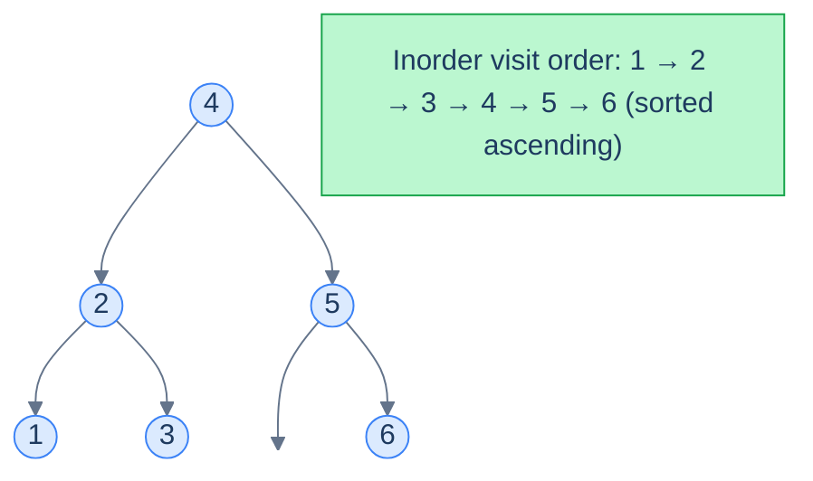
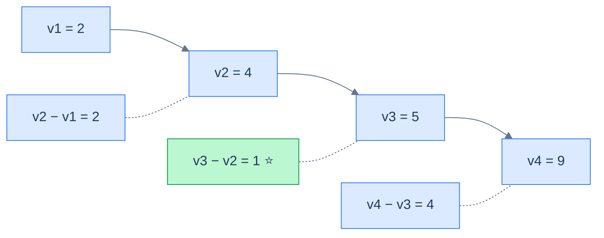
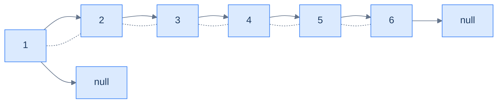

# 10. Pattern: Sorted Traversal

## The Hook

Half the BST problems you'll ever see have the same secret structure: *they are about a sorted array*. The "tree" is just a clever way to *store* that array — but the algorithm is happiest if it forgets the tree exists and pretends it's walking a sorted list.

The trick is the **in-order traversal**. Walk a BST left-node-right and you visit values in **ascending sorted order**, automatically. Suddenly tree problems become array problems. *"Smallest difference between any two values"* becomes *"smallest gap between adjacent elements of a sorted array"* — solved by a single pass remembering the previous element. *"Is this a valid BST?"* becomes *"is this in-order walk strictly increasing?"* — same single pass.

This is the **Sorted Traversal pattern**. It's the bread-and-butter pattern for the easier half of BST problems, and it scales to four classic problems we'll work through in this lesson.

---

## Table of Contents

1. [Understanding the sorted traversal pattern](#understanding-the-sorted-traversal-pattern)
2. [Identifying the sorted traversal pattern](#identifying-the-sorted-traversal-pattern)
3. [Lowest absolute variance](#lowest-absolute-variance)
4. [BST validator](#bst-validator)
5. [BST to sorted array](#bst-to-sorted-array)
6. [BST to DLL](#bst-to-dll)

***

# Understanding the sorted traversal pattern

The pattern is simple: **walk the BST in-order, processing each node as you go, carrying a small piece of running state**.



<p align="center"><strong>An in-order walk of a BST visits values in sorted ascending order. The "sorted traversal" pattern leans on this property to solve any problem that's really about the sorted sequence.</strong></p>

## The technique

Two ingredients, both simple:

- A **process function** `f(node)` that does whatever the problem requires for one element of the sorted sequence (e.g. compare with the previous one, append to an array, link to the previous node).
- An **aggregate function** `g(state, output)` that combines the per-node result into a running summary (e.g. minimum, list, head pointer).

Put them inside the standard recursive in-order template, with the running state held in the enclosing scope (or as instance fields, in OO languages):

> **Algorithm**
>
> - **Step 1:** Initialise running state in the enclosing scope.
> - **Step 2:** Call `inorder(root)`.
>
> **inorder(node):**
>
> - **Step 1:** If `node` is `null`, return.
> - **Step 2:** `inorder(node.left)`.
> - **Step 3:** Process the current node — apply `f(node.val)`; combine with running state via `g`.
> - **Step 4:** `inorder(node.right)`.

The reason this template works on every "sorted traversal" problem is that the **order of `f` calls is exactly the sorted order of values**. So whatever invariant you want to maintain about a sorted sequence, you maintain it with a single previous-pointer or running accumulator.

## Generic template


```pseudocode
aggregate ← 0

function inorder(node):
    if node is null: return
    inorder(node.left)                          # 1. visit left subtree (ascending)
    output ← f(node.val)                        # 2. process current node
    aggregate ← g(aggregate, output)            # 3. fold output into running state
    inorder(node.right)                         # 4. visit right subtree

function callingFunction(root):
    aggregate ← 0
    inorder(root)
    return aggregate
```

```python run
class Solution:
    def calling_function(self, root):
        # State shared across all recursive calls.
        self.aggregate = 0
        self.inorder(root)
        return self.aggregate

    def inorder(self, node):
        if node is None:
            return
        self.inorder(node.left)                        # 1. visit left subtree
        output = self.f(node.val)                      # 2. process node
        self.aggregate = self.g(self.aggregate, output)# 3. fold into running state
        self.inorder(node.right)                       # 4. visit right subtree
```

```java run
public class Main {
    static class TreeNode { int val; TreeNode left, right; TreeNode(int v){val=v;} }

    static class Solution {
        private int aggregate;

        public int callingFunction(TreeNode root) {
            aggregate = 0;
            inorder(root);
            return aggregate;
        }

        private void inorder(TreeNode node) {
            if (node == null) return;
            inorder(node.left);                                  // 1. left subtree
            int output = f(node.val);                            // 2. process node
            aggregate = g(aggregate, output);                    // 3. fold
            inorder(node.right);                                 // 4. right subtree
        }
        int f(int v) { return v; }
        int g(int agg, int out) { return agg + out; }
    }

    public static void main(String[] args) {
        TreeNode root = new TreeNode(4);
        root.left  = new TreeNode(2); root.right = new TreeNode(5);
        root.left.left  = new TreeNode(1); root.left.right = new TreeNode(3);
        root.right.right = new TreeNode(6);
        System.out.println(new Solution().callingFunction(root));  // 21
    }
}
```

```c run
static int aggregate;

static int f(int v)            { return v; }
static int g(int agg, int out) { return agg + out; }

static void inorder(struct TreeNode *node) {
    if (node == NULL) return;
    inorder(node->left);                                     // 1. left subtree
    int output = f(node->val);                               // 2. process node
    aggregate = g(aggregate, output);                        // 3. fold
    inorder(node->right);                                    // 4. right subtree
}

int callingFunction(struct TreeNode *root) {
    aggregate = 0;
    inorder(root);
    return aggregate;
}
```

```scala run
class TreeNode(var value: Int, var left: TreeNode = null, var right: TreeNode = null)

object Main extends App {
  class Solution {
    private var aggregate: Int = 0

    def callingFunction(root: TreeNode): Int = {
      aggregate = 0
      inorder(root)
      aggregate
    }

    private def inorder(node: TreeNode): Unit = {
      if (node == null) return
      inorder(node.left)                                          // 1. left subtree
      val output = f(node.value)                                  // 2. process node
      aggregate = g(aggregate, output)                            // 3. fold
      inorder(node.right)                                         // 4. right subtree
    }
    private def f(v: Int): Int            = v
    private def g(agg: Int, out: Int): Int = agg + out
  }

  val root = new TreeNode(4,
    new TreeNode(2, new TreeNode(1), new TreeNode(3)),
    new TreeNode(5, null, new TreeNode(6)))
  println(new Solution().callingFunction(root))  // 21
}
```


## Complexity

| Operation | Time | Space |
|---|---|---|
| In-order walk + O(1) work per node | **O(n)** | O(h) (call stack) |

If `f` and `g` are O(1), the total time is the cost of one in-order traversal: O(n). The recursion depth is the tree's height, contributing O(h) to space.

***

# Identifying the sorted traversal pattern

Use this pattern when the problem statement (or a quick reformulation of it) reduces to *"do something with the sorted sequence of values"*. Concrete signals:

- Anything about *minimum/maximum gaps*, *adjacent differences*, *pairs of close values* — the sorted order makes "adjacent" meaningful.
- *Validation* problems — "is this a BST?" reduces to "is the in-order walk strictly increasing?"
- *Format conversions* — "BST to sorted array", "BST to sorted doubly-linked list", "BST to a flat list of frequencies".
- *Position-based queries* — "k-th smallest" is just "stop at the k-th in-order visit".

If your solution starts with "if I had a sorted list of these values, I'd…", reach for the in-order traversal.

## Worked example — minimum absolute difference

> **Problem:** Given a BST, find the minimum absolute difference between any two distinct nodes' values.

> *Friction prompt — predict before reading on. Why is the answer always between two values that are *adjacent in sorted order*?*

In any sorted sequence `v1 < v2 < … < vn`, the differences between non-adjacent items are *always* greater than the differences between adjacent items: `v3 − v1 = (v3 − v2) + (v2 − v1) ≥ v2 − v1`. So we only have to look at adjacent pairs — and a sorted in-order walk gives them to us for free.



<p align="center"><strong>Adjacent gaps in sorted order are the only ones worth checking. The minimum is between <code>4</code> and <code>5</code>.</strong></p>

The fit with our template:

- **f** = "compute current.val − previous.val".
- **g** = "minimum".
- **state** = `(min_diff, prev_node)`, both held in the enclosing scope.

***

# Lowest absolute variance

## Problem Statement

Given the **root** of a binary search tree, return the lowest absolute variance — the minimum absolute difference — between the values of any two different nodes.

### Example 1

> - **Input:** `root = [5, 4, 8, 2, null, null, 10]`
> - **Output:** `1`
> - **Explanation:** The smallest gap is between `4` and `5`.

### Example 2

> - **Input:** `root = [10, 8, 14, 5, null, 12, 17]`
> - **Output:** `2`
> - **Explanation:** The smallest gap is `2` (between `8` and `10`, or between `12` and `14`).

## The Solution


```pseudocode
minDiff ← +∞
prevNode ← null

function inorder(root):
    if root is null: return
    inorder(root.left)
    if prevNode is NOT null:
        minDiff ← min(minDiff, root.val − prevNode.val)  # gap to previous in-order node
    prevNode ← root
    inorder(root.right)

function lowestAbsoluteVariance(root):
    inorder(root)
    return minDiff
```

```python run
class Solution:
    def __init__(self):
        self.min_diff = float("inf")
        self.prev_node = None        # last node seen during the in-order walk

    def inorder(self, root):
        if root is None:
            return
        self.inorder(root.left)
        # Process: gap to previous in-order node (if any).
        if self.prev_node is not None:
            self.min_diff = min(self.min_diff, root.val - self.prev_node.val)
        self.prev_node = root        # advance the "previous" pointer
        self.inorder(root.right)

    def lowest_absolute_variance(self, root) -> int:
        self.inorder(root)
        return self.min_diff
```

```java run
public class Main {
    static class TreeNode { int val; TreeNode left, right; TreeNode(int v){val=v;} }

    static class Solution {
        private int minDiff = Integer.MAX_VALUE;
        private TreeNode prevNode = null;

        private void inorder(TreeNode root) {
            if (root == null) return;
            inorder(root.left);
            if (prevNode != null) minDiff = Math.min(minDiff, root.val - prevNode.val);
            prevNode = root;
            inorder(root.right);
        }

        public int lowestAbsoluteVariance(TreeNode root) {
            inorder(root);
            return minDiff;
        }
    }

    public static void main(String[] args) {
        TreeNode root = new TreeNode(5);
        root.left  = new TreeNode(4); root.right = new TreeNode(8);
        root.left.left  = new TreeNode(2);
        root.right.right = new TreeNode(10);
        System.out.println(new Solution().lowestAbsoluteVariance(root));  // 1
    }
}
```

```c run
#include <limits.h>

static int minDiff;
static struct TreeNode *prevNode;

static void inorder(struct TreeNode *root) {
    if (root == NULL) return;
    inorder(root->left);
    if (prevNode != NULL) {
        int d = root->val - prevNode->val;
        if (d < minDiff) minDiff = d;
    }
    prevNode = root;
    inorder(root->right);
}

int lowestAbsoluteVariance(struct TreeNode *root) {
    minDiff  = INT_MAX;
    prevNode = NULL;
    inorder(root);
    return minDiff;
}
```

```scala run
class TreeNode(var value: Int, var left: TreeNode = null, var right: TreeNode = null)

object Main extends App {
  class Solution {
    private var minDiff: Int = Int.MaxValue
    private var prevNode: TreeNode = null

    private def inorder(root: TreeNode): Unit = {
      if (root == null) return
      inorder(root.left)
      if (prevNode != null) minDiff = math.min(minDiff, root.value - prevNode.value)
      prevNode = root
      inorder(root.right)
    }

    def lowestAbsoluteVariance(root: TreeNode): Int = {
      inorder(root)
      minDiff
    }
  }

  val root = new TreeNode(5,
    new TreeNode(4, new TreeNode(2), null),
    new TreeNode(8, null, new TreeNode(10)))
  println(new Solution().lowestAbsoluteVariance(root))  // 1
}
```


***

# BST validator

## Problem Statement

Given the **root** of a binary search tree, return `true` if the tree is a valid BST, `false` otherwise. A valid BST has these properties:

- Every node has a unique key.
- The left subtree contains only values strictly less than the node.
- The right subtree contains only values strictly greater than the node.
- Both subtrees are themselves BSTs.

### Example 1

> - **Input:** `root = [4, 2, 5, 1, 3, null, 6]`
> - **Output:** `true`

### Example 2

> - **Input:** `root = [9, 5, 12, 4, null, null, 11]`
> - **Output:** `false`
> - **Explanation:** Node `11` is in the right subtree of `12` but `11 < 12` — rule violated.

## The Strategy

A valid BST has a **strictly increasing** in-order traversal. So this is just: walk in-order, keep the previous value, and at every step assert `prev < current`. The moment any pair fails, the tree is invalid.

This is dramatically simpler than the recursive `(min, max)` bounds technique you may have seen — the in-order trick reduces tree validity to *list monotonicity*, which is a one-liner.

## The Solution


```pseudocode
isValid ← true
prevNode ← null

function inorder(root):
    if root is null OR NOT isValid: return
    inorder(root.left)
    if prevNode is NOT null AND root.val ≤ prevNode.val:
        isValid ← false   # in-order sequence must be strictly increasing
        return
    prevNode ← root
    inorder(root.right)

function bstValidator(root):
    inorder(root)
    return isValid
```

```python run
class Solution:
    def __init__(self):
        self.is_valid = True
        self.prev_node = None

    def inorder(self, root):
        # Skip work as soon as we know the tree is invalid.
        if root is None or not self.is_valid:
            return
        self.inorder(root.left)
        # In-order walk must be STRICTLY increasing — equal values also fail.
        if self.prev_node is not None and root.val <= self.prev_node.val:
            self.is_valid = False
            return
        self.prev_node = root
        self.inorder(root.right)

    def bst_validator(self, root) -> bool:
        self.inorder(root)
        return self.is_valid
```

```java run
public class Main {
    static class TreeNode { int val; TreeNode left, right; TreeNode(int v){val=v;} }

    static class Solution {
        private boolean isValid = true;
        private TreeNode prevNode = null;

        private void inorder(TreeNode root) {
            if (root == null || !isValid) return;
            inorder(root.left);
            if (prevNode != null && root.val <= prevNode.val) {
                isValid = false;
                return;
            }
            prevNode = root;
            inorder(root.right);
        }

        public boolean bstValidator(TreeNode root) {
            inorder(root);
            return isValid;
        }
    }

    public static void main(String[] args) {
        TreeNode root = new TreeNode(4);
        root.left  = new TreeNode(2); root.right = new TreeNode(5);
        root.left.left  = new TreeNode(1); root.left.right = new TreeNode(3);
        root.right.right = new TreeNode(6);
        System.out.println(new Solution().bstValidator(root));  // true
    }
}
```

```c run
#include <stdbool.h>

static bool isValid;
static struct TreeNode *prevNode;

static void inorder(struct TreeNode *root) {
    if (root == NULL || !isValid) return;
    inorder(root->left);
    if (prevNode != NULL && root->val <= prevNode->val) {
        isValid = false;
        return;
    }
    prevNode = root;
    inorder(root->right);
}

bool bstValidator(struct TreeNode *root) {
    isValid  = true;
    prevNode = NULL;
    inorder(root);
    return isValid;
}
```

```scala run
class TreeNode(var value: Int, var left: TreeNode = null, var right: TreeNode = null)

object Main extends App {
  class Solution {
    private var isValid: Boolean = true
    private var prevNode: TreeNode = null

    private def inorder(root: TreeNode): Unit = {
      if (root == null || !isValid) return
      inorder(root.left)
      if (prevNode != null && root.value <= prevNode.value) {
        isValid = false
        return
      }
      prevNode = root
      inorder(root.right)
    }

    def bstValidator(root: TreeNode): Boolean = {
      inorder(root)
      isValid
    }
  }

  val root = new TreeNode(4,
    new TreeNode(2, new TreeNode(1), new TreeNode(3)),
    new TreeNode(5, null, new TreeNode(6)))
  println(new Solution().bstValidator(root))  // true
}
```


***

# BST to sorted array

## Problem Statement

Given the **root** of a binary search tree, return a sorted array containing the values of every node.

### Example 1

> - **Input:** `root = [4, 2, 5, 1, 3, null, 6]`
> - **Output:** `[1, 2, 3, 4, 5, 6]`

### Example 2

> - **Input:** `root = [9, 5, 10, 4, null, null, 11]`
> - **Output:** `[4, 5, 9, 10, 11]`

## The Strategy

This is the canonical use of the pattern: **f** = "append `node.val` to the result list", **g** = identity. The in-order order *is* the sorted order, so emission == sorted output.

## The Solution


```pseudocode
function inorder(root, result):
    if root is null: return
    inorder(root.left, result)
    append root.val to result          # emit values in ascending order
    inorder(root.right, result)

function bstToSortedArray(root):
    result ← []
    inorder(root, result)
    return result
```

```python run
class Solution:
    def inorder(self, root, result):
        if root is None:
            return
        self.inorder(root.left, result)
        result.append(root.val)            # f: emit; g: list append (associative, order-preserving)
        self.inorder(root.right, result)

    def bst_to_sorted_array(self, root):
        result = []
        self.inorder(root, result)
        return result
```

```java run
import java.util.*;

public class Main {
    static class TreeNode { int val; TreeNode left, right; TreeNode(int v){val=v;} }

    static class Solution {
        private void inorder(TreeNode root, List<Integer> result) {
            if (root == null) return;
            inorder(root.left, result);
            result.add(root.val);
            inorder(root.right, result);
        }

        public List<Integer> bstToSortedArray(TreeNode root) {
            List<Integer> result = new ArrayList<>();
            inorder(root, result);
            return result;
        }
    }

    public static void main(String[] args) {
        TreeNode root = new TreeNode(4);
        root.left  = new TreeNode(2); root.right = new TreeNode(5);
        root.left.left  = new TreeNode(1); root.left.right = new TreeNode(3);
        root.right.right = new TreeNode(6);
        System.out.println(new Solution().bstToSortedArray(root));  // [1, 2, 3, 4, 5, 6]
    }
}
```

```c run
static void inorder(struct TreeNode *root, int *result, int *idx) {
    if (root == NULL) return;
    inorder(root->left, result, idx);
    result[(*idx)++] = root->val;
    inorder(root->right, result, idx);
}

int *bstToSortedArray(struct TreeNode *root, int *out_size) {
    int *result = malloc(sizeof(int) * 10000);                              // assume bounded
    int idx = 0;
    inorder(root, result, &idx);
    *out_size = idx;
    return result;
}
```

```scala run
import scala.collection.mutable

class TreeNode(var value: Int, var left: TreeNode = null, var right: TreeNode = null)

object Main extends App {
  object Solution {
    private def inorder(root: TreeNode, result: mutable.ArrayBuffer[Int]): Unit = {
      if (root == null) return
      inorder(root.left, result)
      result.append(root.value)
      inorder(root.right, result)
    }

    def bstToSortedArray(root: TreeNode): List[Int] = {
      val buf = mutable.ArrayBuffer[Int]()
      inorder(root, buf)
      buf.toList
    }
  }

  val root = new TreeNode(4,
    new TreeNode(2, new TreeNode(1), new TreeNode(3)),
    new TreeNode(5, null, new TreeNode(6)))
  println(Solution.bstToSortedArray(root))  // List(1, 2, 3, 4, 5, 6)
}
```


***

# BST to DLL

## Problem Statement

Given the **root** of a binary search tree, convert it **in place** into a sorted doubly-linked list. The DLL should reuse the BST's nodes — `left` becomes `prev`, `right` becomes `next` — and be ordered by ascending value. Return the **head** of the DLL.

### Example 1

> - **Input:** `root = [4, 2, 5, 1, 3, null, 6]`
> - **Output:** `[1, 2, 3, 4, 5, 6]` (as a DLL)

### Example 2

> - **Input:** `root = [9, 5, 10, 4, null, null, 11]`
> - **Output:** `[4, 5, 9, 10, 11]` (as a DLL)

## The Strategy

The in-order walk visits nodes in ascending order, which is exactly the order of a sorted DLL. So during the walk we simply *thread* each node onto the back of a growing list:

- Carry two pointers in the enclosing scope: `head` (the first node ever processed) and `tail` (the most recently processed node).
- For each visited node:
  - If `tail` is `null`, this is the first node — set `head = node`, `node.left = null`.
  - Else link `tail.right = node` and `node.left = tail`.
  - Set `tail = node`.
- After the walk, set `tail.right = null` to terminate the list.

The BST's `left`/`right` pointers are *reused* as the DLL's `prev`/`next` — no extra allocation.



<p align="center"><strong>The result of running the in-order walk over <code>[4, 2, 5, 1, 3, null, 6]</code>: <code>1 ↔ 2 ↔ 3 ↔ 4 ↔ 5 ↔ 6</code>. The original BST nodes have been re-wired in place.</strong></p>

## The Solution


```pseudocode
head ← null
tail ← null

function inorder(root):
    if root is null: return
    inorder(root.left)
    if tail is NOT null:
        tail.right ← root   # next pointer of the previous DLL tail
        root.left ← tail    # prev pointer of the new DLL tail
    else:
        head ← root         # first node visited becomes the DLL head
        root.left ← null
    tail ← root
    inorder(root.right)

function bstToSortedDLL(root):
    if root is null: return null
    inorder(root)
    tail.right ← null       # terminate the DLL
    return head
```

```python run
class Solution:
    def __init__(self):
        # head = first node visited; tail = most recent node visited.
        self.head = None
        self.tail = None

    def inorder(self, root):
        if root is None:
            return
        self.inorder(root.left)
        # Thread the current node onto the end of the list.
        if self.tail is not None:
            self.tail.right = root      # next pointer of the previous tail
            root.left = self.tail       # prev pointer of the new tail
        else:
            self.head = root            # very first node — record as head
            root.left = None
        self.tail = root
        self.inorder(root.right)

    def bst_to_sorted_dll(self, root):
        if root is None:
            return None
        self.inorder(root)
        # Terminate the list cleanly.
        if self.tail is not None:
            self.tail.right = None
        return self.head
```

```java run
public class Main {
    static class TreeNode { int val; TreeNode left, right; TreeNode(int v){val=v;} }

    static class Solution {
        private TreeNode head = null, tail = null;

        private void inorder(TreeNode root) {
            if (root == null) return;
            inorder(root.left);
            if (tail != null) {
                tail.right = root;
                root.left = tail;
            } else {
                head = root;
                root.left = null;
            }
            tail = root;
            inorder(root.right);
        }

        public TreeNode bstToSortedDll(TreeNode root) {
            if (root == null) return null;
            inorder(root);
            if (tail != null) tail.right = null;
            return head;
        }
    }

    public static void main(String[] args) {
        TreeNode root = new TreeNode(4);
        root.left  = new TreeNode(2); root.right = new TreeNode(5);
        root.left.left  = new TreeNode(1); root.left.right = new TreeNode(3);
        root.right.right = new TreeNode(6);
        TreeNode head = new Solution().bstToSortedDll(root);
        StringBuilder sb = new StringBuilder();
        for (TreeNode c = head; c != null; c = c.right) {
            if (sb.length() > 0) sb.append(' ');
            sb.append(c.val);
        }
        System.out.println(sb);  // 1 2 3 4 5 6
    }
}
```

```c run
static struct TreeNode *head, *tail;

static void inorder(struct TreeNode *root) {
    if (root == NULL) return;
    inorder(root->left);
    if (tail != NULL) {
        tail->right = root;
        root->left  = tail;
    } else {
        head = root;
        root->left = NULL;
    }
    tail = root;
    inorder(root->right);
}

struct TreeNode *bstToSortedDll(struct TreeNode *root) {
    if (root == NULL) return NULL;
    head = NULL; tail = NULL;
    inorder(root);
    if (tail != NULL) tail->right = NULL;
    return head;
}
```

```scala run
class TreeNode(var value: Int, var left: TreeNode = null, var right: TreeNode = null)

object Main extends App {
  class Solution {
    private var head: TreeNode = null
    private var tail: TreeNode = null

    private def inorder(root: TreeNode): Unit = {
      if (root == null) return
      inorder(root.left)
      if (tail != null) {
        tail.right = root
        root.left  = tail
      } else {
        head = root
        root.left = null
      }
      tail = root
      inorder(root.right)
    }

    def bstToSortedDll(root: TreeNode): TreeNode = {
      if (root == null) return null
      inorder(root)
      if (tail != null) tail.right = null
      head
    }
  }

  val root = new TreeNode(4,
    new TreeNode(2, new TreeNode(1), new TreeNode(3)),
    new TreeNode(5, null, new TreeNode(6)))
  val head = new Solution().bstToSortedDll(root)
  val sb = new StringBuilder
  var c = head
  while (c != null) {
    if (sb.nonEmpty) sb.append(' ')
    sb.append(c.value)
    c = c.right
  }
  println(sb)  // 1 2 3 4 5 6
}
```


<details>
<summary><strong>Trace — root = [4, 2, 5, 1, 3, null, 6]</strong></summary>

```
in-order visit sequence: 1, 2, 3, 4, 5, 6

After visiting 1 │ head = 1, tail = 1, list = [1]
After visiting 2 │ tail.right = 2; 2.left = tail; tail = 2; list = [1 ↔ 2]
After visiting 3 │ tail.right = 3; 3.left = tail; tail = 3; list = [1 ↔ 2 ↔ 3]
After visiting 4 │ tail.right = 4; 4.left = tail; tail = 4; list = [1 ↔ 2 ↔ 3 ↔ 4]
After visiting 5 │ tail.right = 5; 5.left = tail; tail = 5; list = [1 ↔ 2 ↔ 3 ↔ 4 ↔ 5]
After visiting 6 │ tail.right = 6; 6.left = tail; tail = 6; list = [1 ↔ 2 ↔ 3 ↔ 4 ↔ 5 ↔ 6]
Finalisation     │ tail.right = null
Return head = 1 ✓
```

</details>

***

## Final Takeaway

The Sorted Traversal pattern collapses an entire family of BST problems to *"do something to a sorted sequence"*. The algorithm is always the same: walk in-order, carry one or two pieces of state, fold each visit into the running answer. Validation, k-th smallest, ranges, gaps, conversions to other ordered structures — all of these are sorted-sequence problems hiding under tree dressing.

Two patterns to keep:

1. **"Carry the previous in-order node"** — the swiss-army idiom for any pairwise comparison along the sorted sequence. We used it in `lowest absolute variance` and `BST validator`. It's also the core of "is the BST nearly sorted?", "find any duplicates", "find swapped nodes" (recover-tree problems).
2. **"In-place re-wire during the walk"** — the same in-order skeleton can mutate the structure as it visits, turning a BST into a DLL or rebalancing into a vine. This is the foundation of the **threaded-tree** and **Morris traversal** ideas, and a stepping-stone to in-place tree manipulations in compilers and editors.

The next lesson mirrors this one with a *reverse* in-order traversal, opening up the descending-order analogues — k-th largest, sum of values greater than X, "max-greater BST" rewriting.
