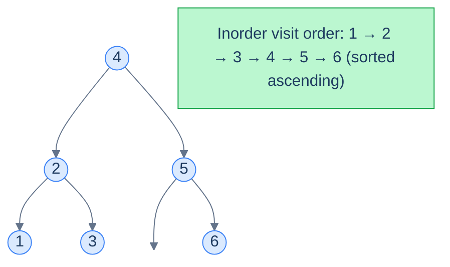
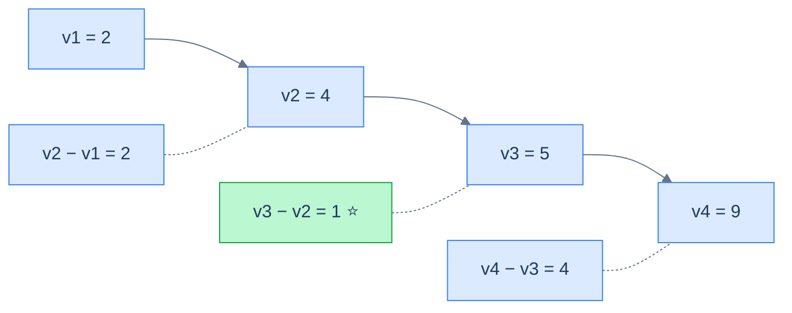
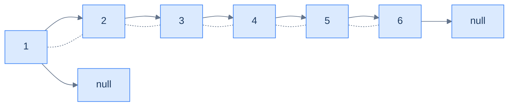

# 10. Pattern: Sorted Traversal

## The Hook

Half the BST problems you'll ever see have the same secret structure: *they are about a sorted array*. The "tree" is just a clever way to *store* that array — but the algorithm is happiest if it forgets the tree exists and pretends it's walking a sorted list.

The trick is the **in-order traversal**. Walk a BST left-node-right and you visit values in **ascending sorted order**, automatically. Suddenly tree problems become array problems. *"Smallest difference between any two values"* becomes *"smallest gap between adjacent elements of a sorted array"* — solved by a single pass remembering the previous element. *"Is this a valid BST?"* becomes *"is this in-order walk strictly increasing?"* — same single pass.

This is the **Sorted Traversal pattern**. It's the bread-and-butter pattern for the easier half of BST problems, and it scales to four classic problems we'll work through in this lesson.

---

## Table of Contents

1. [Understanding the sorted traversal pattern](#understanding-the-sorted-traversal-pattern)
2. [Identifying the sorted traversal pattern](#identifying-the-sorted-traversal-pattern)
3. [Lowest absolute variance](#lowest-absolute-variance)
4. [BST validator](#bst-validator)
5. [BST to sorted array](#bst-to-sorted-array)
6. [BST to DLL](#bst-to-dll)

***

# Understanding the sorted traversal pattern

The pattern is simple: **walk the BST in-order, processing each node as you go, carrying a small piece of running state**.



<p align="center"><strong>An in-order walk of a BST visits values in sorted ascending order. The "sorted traversal" pattern leans on this property to solve any problem that's really about the sorted sequence.</strong></p>

## The technique

Two ingredients, both simple:

- A **process function** `f(node)` that does whatever the problem requires for one element of the sorted sequence (e.g. compare with the previous one, append to an array, link to the previous node).
- An **aggregate function** `g(state, output)` that combines the per-node result into a running summary (e.g. minimum, list, head pointer).

Put them inside the standard recursive in-order template, with the running state held in the enclosing scope (or as instance fields, in OO languages):

> **Algorithm**
>
> - **Step 1:** Initialise running state in the enclosing scope.
> - **Step 2:** Call `inorder(root)`.
>
> **inorder(node):**
>
> - **Step 1:** If `node` is `null`, return.
> - **Step 2:** `inorder(node.left)`.
> - **Step 3:** Process the current node — apply `f(node.val)`; combine with running state via `g`.
> - **Step 4:** `inorder(node.right)`.

The reason this template works on every "sorted traversal" problem is that the **order of `f` calls is exactly the sorted order of values**. So whatever invariant you want to maintain about a sorted sequence, you maintain it with a single previous-pointer or running accumulator.

## Generic template


```python run
"""
Definition for a binary tree node.
class TreeNode:
    def __init__(self, val):
        self.val = val
        self.left = None
        self.right = None
"""

from typing import Optional, List

class Solution:
    def __init__(self):
        # Class-level variable to hold the aggregate value
        self.aggregate: int = 0

    def callingFunction(self, root: Optional[TreeNode]) -> int:

        # Initialize aggregate with a default value
        self.aggregate = 0

        # Traverse the binary tree in inorder traversal
        self.inorder(root)

        # Return the aggregated value
        return self.aggregate

    def inorder(self, node: Optional[TreeNode]) -> None:

        if not node:
            # Return if this is a null node
            return

        # Traverse the left subtree
        self.inorder(node.left)

        # Process the current node
        output = f(node.val)
        # Add contribution of current node
        self.aggregate = g(self.aggregate, output)

        # Traverse the right subtree
        self.inorder(node.right)
```

```java run
import java.util.*;

/**
 * Definition for a binary tree node.
 * class TreeNode {
 *      int val;
 *      TreeNode left;
 *      TreeNode right;
 *      TreeNode() {}
 *      TreeNode(int val) { this.val = val; }
 * }
 */

public class Solution {

    // Declare aggregate as a class-level variable since Java does not support pass-by-reference
    private int aggregate = 0;

    public int callingFunction(TreeNode root) {

        // Initialize aggregate with a default value
        aggregate = 0;

        // Traverse the binary tree in inorder traversal
        inorder(root);

        // Return the aggregated value
        return aggregate;
    }

    private void inorder(TreeNode node) {

        if (node == null) {
            // Return if this is a null node;
            return;
        }

        // Traverse the left subtree
        inorder(node.left);

        // Process the current node
        int output = f(node.val);

        // Add contribution of current node
        aggregate = g(aggregate, output);

        // Traverse the right subtree
        inorder(node.right);
    }
}
```


## Complexity

| Operation | Time | Space |
|---|---|---|
| In-order walk + O(1) work per node | **O(n)** | O(h) (call stack) |

If `f` and `g` are O(1), the total time is the cost of one in-order traversal: O(n). The recursion depth is the tree's height, contributing O(h) to space.

***

# Identifying the sorted traversal pattern

Use this pattern when the problem statement (or a quick reformulation of it) reduces to *"do something with the sorted sequence of values"*. Concrete signals:

- Anything about *minimum/maximum gaps*, *adjacent differences*, *pairs of close values* — the sorted order makes "adjacent" meaningful.
- *Validation* problems — "is this a BST?" reduces to "is the in-order walk strictly increasing?"
- *Format conversions* — "BST to sorted array", "BST to sorted doubly-linked list", "BST to a flat list of frequencies".
- *Position-based queries* — "k-th smallest" is just "stop at the k-th in-order visit".

If your solution starts with "if I had a sorted list of these values, I'd…", reach for the in-order traversal.

## Worked example — minimum absolute difference

> **Problem:** Given a BST, find the minimum absolute difference between any two distinct nodes' values.

> *Friction prompt — predict before reading on. Why is the answer always between two values that are *adjacent in sorted order*?*

In any sorted sequence `v1 < v2 < … < vn`, the differences between non-adjacent items are *always* greater than the differences between adjacent items: `v3 − v1 = (v3 − v2) + (v2 − v1) ≥ v2 − v1`. So we only have to look at adjacent pairs — and a sorted in-order walk gives them to us for free.



<p align="center"><strong>Adjacent gaps in sorted order are the only ones worth checking. The minimum is between <code>4</code> and <code>5</code>.</strong></p>

The fit with our template:

- **f** = "compute current.val − previous.val".
- **g** = "minimum".
- **state** = `(min_diff, prev_node)`, both held in the enclosing scope.

***

# Lowest absolute variance

## Problem Statement

Given the **root** of a binary search tree, return the lowest absolute variance — the minimum absolute difference — between the values of any two different nodes.

### Example 1

> - **Input:** `root = [5, 4, 8, 2, null, null, 10]`
> - **Output:** `1`
> - **Explanation:** The smallest gap is between `4` and `5`.

### Example 2

> - **Input:** `root = [10, 8, 14, 5, null, 12, 17]`
> - **Output:** `2`
> - **Explanation:** The smallest gap is `2` (between `8` and `10`, or between `12` and `14`).

<details>
<summary><h2>The Solution</h2></summary>


```python run
from typing import Optional, List


class TreeNode:
    def __init__(self, val=0, left=None, right=None):
        self.val = val
        self.left = left
        self.right = right


def from_level_order(values):
    """Build tree from list like [1, 2, 3, None, 4]. None means missing child."""
    if not values:
        return None
    root = TreeNode(values[0])
    queue = [root]
    i = 1
    while queue and i < len(values):
        node = queue.pop(0)
        if i < len(values) and values[i] is not None:
            node.left = TreeNode(values[i])
            queue.append(node.left)
        i += 1
        if i < len(values) and values[i] is not None:
            node.right = TreeNode(values[i])
            queue.append(node.right)
        i += 1
    return root


class Solution:
    def __init__(self):

        # Variable to keep track of the minimum difference
        self.min_diff = float("inf")

        # Reference to keep track of the previous node
        self.prev_node = None

    def inorder(self, root: Optional[TreeNode]):
        if root is None:
            return

        # Traverse left subtree
        self.inorder(root.left)

        # Check the difference with the previous node
        if self.prev_node is not None:
            self.min_diff = min(
                self.min_diff, root.val - self.prev_node.val
            )

        # Update the previous node
        self.prev_node = root

        # Traverse right subtree
        self.inorder(root.right)

    def lowest_absolute_variance(self, root: Optional[TreeNode]) -> int:

        # Perform in-order traversal
        self.inorder(root)

        # Return the minimum difference found
        return self.min_diff


# Example 1: [5, 4, 8, 2, null, null, 10] → 1
print(Solution().lowest_absolute_variance(
    from_level_order([5, 4, 8, 2, None, None, 10])))   # 1

# Example 2: [10, 8, 14, 5, null, 12, 17] → 2
print(Solution().lowest_absolute_variance(
    from_level_order([10, 8, 14, 5, None, 12, 17])))   # 2

# Edge cases
print(Solution().lowest_absolute_variance(
    from_level_order([5])))                             # inf (single node)

print(Solution().lowest_absolute_variance(
    from_level_order([3, 1, 5])))                      # 2

# Left-skew BST: 1, 2, 3, 4
root_skew = TreeNode(4)
root_skew.left = TreeNode(3)
root_skew.left.left = TreeNode(2)
root_skew.left.left.left = TreeNode(1)
print(Solution().lowest_absolute_variance(root_skew))  # 1

# Consecutive values: consecutive diffs of 1
print(Solution().lowest_absolute_variance(
    from_level_order([5, 3, 7, 2, 4, 6, 8])))         # 1
```

```java run
import java.util.*;

public class Main {
    static class TreeNode {
        int val;
        TreeNode left;
        TreeNode right;
        TreeNode() {}
        TreeNode(int val) { this.val = val; }
    }

    static TreeNode fromLevelOrder(Integer... values) {
        if (values.length == 0 || values[0] == null) return null;
        TreeNode root = new TreeNode(values[0]);
        java.util.Deque<TreeNode> queue = new java.util.ArrayDeque<>();
        queue.add(root);
        int i = 1;
        while (!queue.isEmpty() && i < values.length) {
            TreeNode node = queue.poll();
            if (i < values.length && values[i] != null) {
                node.left = new TreeNode(values[i]);
                queue.add(node.left);
            }
            i++;
            if (i < values.length && values[i] != null) {
                node.right = new TreeNode(values[i]);
                queue.add(node.right);
            }
            i++;
        }
        return root;
    }

    static class Solution {

        // Variable to keep track of the minimum difference
        private int minDiff = Integer.MAX_VALUE;

        // Reference to keep track of the previous node
        private TreeNode prevNode = null;

        private void inorder(TreeNode root) {
            if (root == null) {
                return;
            }

            // Traverse left subtree
            inorder(root.left);

            // Check the difference with the previous node
            if (prevNode != null) {
                minDiff = Math.min(minDiff, root.val - prevNode.val);
            }

            // Update the previous node
            prevNode = root;

            // Traverse right subtree
            inorder(root.right);
        }

        public int lowestAbsoluteVariance(TreeNode root) {

            // Perform in-order traversal
            inorder(root);

            // Return the minimum difference found
            return minDiff;
        }
    }

    public static void main(String[] args) {
        // Example 1: [5, 4, 8, 2, null, null, 10] → 1
        System.out.println(new Solution().lowestAbsoluteVariance(
            fromLevelOrder(5, 4, 8, 2, null, null, 10)));   // 1

        // Example 2: [10, 8, 14, 5, null, 12, 17] → 2
        System.out.println(new Solution().lowestAbsoluteVariance(
            fromLevelOrder(10, 8, 14, 5, null, 12, 17)));   // 2

        // Single node — no pair exists
        System.out.println(new Solution().lowestAbsoluteVariance(
            fromLevelOrder(5)));                             // Integer.MAX_VALUE

        // Balanced BST with min diff = 2
        System.out.println(new Solution().lowestAbsoluteVariance(
            fromLevelOrder(3, 1, 5)));                      // 2

        // Left-skew BST: 4-3-2-1
        TreeNode skew = new TreeNode(4);
        skew.left = new TreeNode(3);
        skew.left.left = new TreeNode(2);
        skew.left.left.left = new TreeNode(1);
        System.out.println(new Solution().lowestAbsoluteVariance(skew)); // 1

        // Consecutive values: min diff = 1
        System.out.println(new Solution().lowestAbsoluteVariance(
            fromLevelOrder(5, 3, 7, 2, 4, 6, 8)));         // 1
    }
}
```

</details>


***

# BST validator

## Problem Statement

Given the **root** of a binary search tree, return `true` if the tree is a valid BST, `false` otherwise. A valid BST has these properties:

- Every node has a unique key.
- The left subtree contains only values strictly less than the node.
- The right subtree contains only values strictly greater than the node.
- Both subtrees are themselves BSTs.

### Example 1

> - **Input:** `root = [4, 2, 5, 1, 3, null, 6]`
> - **Output:** `true`

### Example 2

> - **Input:** `root = [9, 5, 12, 4, null, null, 11]`
> - **Output:** `false`
> - **Explanation:** Node `11` is in the right subtree of `12` but `11 < 12` — rule violated.

<details>
<summary><h2>The Strategy</h2></summary>


A valid BST has a **strictly increasing** in-order traversal. So this is just: walk in-order, keep the previous value, and at every step assert `prev < current`. The moment any pair fails, the tree is invalid.

This is dramatically simpler than the recursive `(min, max)` bounds technique you may have seen — the in-order trick reduces tree validity to *list monotonicity*, which is a one-liner.

</details>
<details>
<summary><h2>The Solution</h2></summary>


```python run
from typing import Optional


class TreeNode:
    def __init__(self, val=0, left=None, right=None):
        self.val = val
        self.left = left
        self.right = right


def from_level_order(values):
    """Build tree from list like [1, 2, 3, None, 4]. None means missing child."""
    if not values:
        return None
    root = TreeNode(values[0])
    queue = [root]
    i = 1
    while queue and i < len(values):
        node = queue.pop(0)
        if i < len(values) and values[i] is not None:
            node.left = TreeNode(values[i])
            queue.append(node.left)
        i += 1
        if i < len(values) and values[i] is not None:
            node.right = TreeNode(values[i])
            queue.append(node.right)
        i += 1
    return root


class Solution:
    def __init__(self):

        # Variable to keep track of the validity of the BST
        self.is_valid = True

        # Reference to keep track of the previous node
        self.prev_node: Optional[TreeNode] = None

    def inorder(self, root: Optional[TreeNode]) -> None:
        if not root or not self.is_valid:
            return

        # Traverse left subtree
        self.inorder(root.left)

        # Current node must be greater than the prevNodeious one in
        # inorder
        if self.prev_node and root.val <= self.prev_node.val:
            self.is_valid = False
            return

        # Update prevNodeious node
        self.prev_node = root

        # Traverse right subtree
        self.inorder(root.right)

    def bst_validator(self, root: Optional[TreeNode]) -> bool:

        # Perform in-order traversal
        self.inorder(root)

        # Return the validity of the BST
        return self.is_valid


# Example 1: valid BST
print(Solution().bst_validator(
    from_level_order([4, 2, 5, 1, 3, None, 6])))   # True

# Example 2: invalid BST (11 < 12 but placed as right child)
print(Solution().bst_validator(
    from_level_order([9, 5, 12, 4, None, None, 11])))  # False

# Edge cases
print(Solution().bst_validator(None))              # True  (empty tree)
print(Solution().bst_validator(from_level_order([5])))  # True (single node)

# Left-skew valid BST: 1-2-3-4
root_skew = TreeNode(4)
root_skew.left = TreeNode(3)
root_skew.left.left = TreeNode(2)
root_skew.left.left.left = TreeNode(1)
print(Solution().bst_validator(root_skew))         # True

# Duplicate value makes it invalid
dup = TreeNode(5)
dup.left = TreeNode(5)
print(Solution().bst_validator(dup))               # False

# Subtree violation: right child less than root
bad = TreeNode(10)
bad.right = TreeNode(8)
print(Solution().bst_validator(bad))               # False
```

```java run
import java.util.*;

public class Main {
    static class TreeNode {
        int val;
        TreeNode left;
        TreeNode right;
        TreeNode() {}
        TreeNode(int val) { this.val = val; }
    }

    static TreeNode fromLevelOrder(Integer... values) {
        if (values.length == 0 || values[0] == null) return null;
        TreeNode root = new TreeNode(values[0]);
        java.util.Deque<TreeNode> queue = new java.util.ArrayDeque<>();
        queue.add(root);
        int i = 1;
        while (!queue.isEmpty() && i < values.length) {
            TreeNode node = queue.poll();
            if (i < values.length && values[i] != null) {
                node.left = new TreeNode(values[i]);
                queue.add(node.left);
            }
            i++;
            if (i < values.length && values[i] != null) {
                node.right = new TreeNode(values[i]);
                queue.add(node.right);
            }
            i++;
        }
        return root;
    }

    static class Solution {

        // Variable to keep track of the validity of the BST
        private boolean isValid = true;

        // Reference to keep track of the previous node
        private TreeNode prevNode = null;

        private void inorder(TreeNode root) {
            if (root == null || !isValid) {
                return;
            }

            // Traverse left subtree
            inorder(root.left);

            // Current node must be greater than the prevNodeious one in
            // inorder
            if (prevNode != null && root.val <= prevNode.val) {
                isValid = false;
                return;
            }

            // Update prevNodeious node
            prevNode = root;

            // Traverse right subtree
            inorder(root.right);
        }

        public boolean bstValidator(TreeNode root) {

            // Perform in-order traversal
            inorder(root);

            // Return the validity of the BST
            return isValid;
        }
    }

    public static void main(String[] args) {
        // Example 1: valid BST
        System.out.println(new Solution().bstValidator(
            fromLevelOrder(4, 2, 5, 1, 3, null, 6)));   // true

        // Example 2: invalid BST (11 < 12 but placed as right child)
        System.out.println(new Solution().bstValidator(
            fromLevelOrder(9, 5, 12, 4, null, null, 11)));  // false

        // Edge cases
        System.out.println(new Solution().bstValidator(null));          // true
        System.out.println(new Solution().bstValidator(fromLevelOrder(5))); // true

        // Left-skew valid BST: 4-3-2-1
        TreeNode skew = new TreeNode(4);
        skew.left = new TreeNode(3);
        skew.left.left = new TreeNode(2);
        skew.left.left.left = new TreeNode(1);
        System.out.println(new Solution().bstValidator(skew));          // true

        // Duplicate value makes it invalid
        TreeNode dup = new TreeNode(5);
        dup.left = new TreeNode(5);
        System.out.println(new Solution().bstValidator(dup));           // false

        // Subtree violation: right child less than root
        TreeNode bad = new TreeNode(10);
        bad.right = new TreeNode(8);
        System.out.println(new Solution().bstValidator(bad));           // false
    }
}
```

</details>


***

# BST to sorted array

## Problem Statement

Given the **root** of a binary search tree, return a sorted array containing the values of every node.

### Example 1

> - **Input:** `root = [4, 2, 5, 1, 3, null, 6]`
> - **Output:** `[1, 2, 3, 4, 5, 6]`

### Example 2

> - **Input:** `root = [9, 5, 10, 4, null, null, 11]`
> - **Output:** `[4, 5, 9, 10, 11]`

<details>
<summary><h2>The Strategy</h2></summary>


This is the canonical use of the pattern: **f** = "append `node.val` to the result list", **g** = identity. The in-order order *is* the sorted order, so emission == sorted output.

</details>
<details>
<summary><h2>The Solution</h2></summary>


```python run
from typing import Optional, List


class TreeNode:
    def __init__(self, val=0, left=None, right=None):
        self.val = val
        self.left = left
        self.right = right


def from_level_order(values):
    """Build tree from list like [1, 2, 3, None, 4]. None means missing child."""
    if not values:
        return None
    root = TreeNode(values[0])
    queue = [root]
    i = 1
    while queue and i < len(values):
        node = queue.pop(0)
        if i < len(values) and values[i] is not None:
            node.left = TreeNode(values[i])
            queue.append(node.left)
        i += 1
        if i < len(values) and values[i] is not None:
            node.right = TreeNode(values[i])
            queue.append(node.right)
        i += 1
    return root


class Solution:
    def inorder(
        self, root: Optional[TreeNode], result: List[int]
    ) -> None:

        # Base case: If the node is None, return
        if root is None:
            return

        # Recursively traverse the left subtree
        self.inorder(root.left, result)

        # Visit the current node and add its value to the result list
        result.append(root.val)

        # Recursively traverse the right subtree
        self.inorder(root.right, result)

    def bst_to_sorted_array(self, root: Optional[TreeNode]) -> List[int]:
        result: List[int] = []

        # Call the helper function to perform inorder traversal
        self.inorder(root, result)

        # Return the result list containing inorder traversal elements
        return result


# Example 1
print(Solution().bst_to_sorted_array(
    from_level_order([4, 2, 5, 1, 3, None, 6])))   # [1, 2, 3, 4, 5, 6]

# Example 2
print(Solution().bst_to_sorted_array(
    from_level_order([9, 5, 10, 4, None, None, 11])))  # [4, 5, 9, 10, 11]

# Edge cases
print(Solution().bst_to_sorted_array(None))         # []
print(Solution().bst_to_sorted_array(
    from_level_order([5])))                         # [5]

# Two-node tree
print(Solution().bst_to_sorted_array(
    from_level_order([3, 1])))                      # [1, 3]

# Right-skew BST
print(Solution().bst_to_sorted_array(
    from_level_order([1, None, 2, None, 3])))       # [1, 2, 3]

# Left-skew BST
root_left = TreeNode(4)
root_left.left = TreeNode(3)
root_left.left.left = TreeNode(2)
root_left.left.left.left = TreeNode(1)
print(Solution().bst_to_sorted_array(root_left))    # [1, 2, 3, 4]
```

```java run
import java.util.*;

public class Main {
    static class TreeNode {
        int val;
        TreeNode left;
        TreeNode right;
        TreeNode() {}
        TreeNode(int val) { this.val = val; }
    }

    static TreeNode fromLevelOrder(Integer... values) {
        if (values.length == 0 || values[0] == null) return null;
        TreeNode root = new TreeNode(values[0]);
        java.util.Deque<TreeNode> queue = new java.util.ArrayDeque<>();
        queue.add(root);
        int i = 1;
        while (!queue.isEmpty() && i < values.length) {
            TreeNode node = queue.poll();
            if (i < values.length && values[i] != null) {
                node.left = new TreeNode(values[i]);
                queue.add(node.left);
            }
            i++;
            if (i < values.length && values[i] != null) {
                node.right = new TreeNode(values[i]);
                queue.add(node.right);
            }
            i++;
        }
        return root;
    }

    static class Solution {
        private void inorder(TreeNode root, List<Integer> result) {

            // Base case: If the node is null, return
            if (root == null) {
                return;
            }

            // Recursively traverse the left subtree
            inorder(root.left, result);

            // Visit the current node and add its value to the result list
            result.add(root.val);

            // Recursively traverse the right subtree
            inorder(root.right, result);
        }

        public List<Integer> bstToSortedArray(TreeNode root) {
            List<Integer> result = new ArrayList<>();

            // Call the helper function to perform inorder traversal
            inorder(root, result);

            // Return the result list containing inorder traversal elements
            return result;
        }
    }

    public static void main(String[] args) {
        // Example 1
        System.out.println(new Solution().bstToSortedArray(
            fromLevelOrder(4, 2, 5, 1, 3, null, 6)));   // [1, 2, 3, 4, 5, 6]

        // Example 2
        System.out.println(new Solution().bstToSortedArray(
            fromLevelOrder(9, 5, 10, 4, null, null, 11)));  // [4, 5, 9, 10, 11]

        // Edge cases
        System.out.println(new Solution().bstToSortedArray(null));      // []
        System.out.println(new Solution().bstToSortedArray(
            fromLevelOrder(5)));                         // [5]

        // Two-node tree
        System.out.println(new Solution().bstToSortedArray(
            fromLevelOrder(3, 1)));                      // [1, 3]

        // Right-skew BST
        System.out.println(new Solution().bstToSortedArray(
            fromLevelOrder(1, null, 2, null, 3)));       // [1, 2, 3]

        // Left-skew BST
        TreeNode leftSkew = new TreeNode(4);
        leftSkew.left = new TreeNode(3);
        leftSkew.left.left = new TreeNode(2);
        leftSkew.left.left.left = new TreeNode(1);
        System.out.println(new Solution().bstToSortedArray(leftSkew));  // [1, 2, 3, 4]
    }
}
```

</details>


***

# BST to DLL

## Problem Statement

Given the **root** of a binary search tree, convert it **in place** into a sorted doubly-linked list. The DLL should reuse the BST's nodes — `left` becomes `prev`, `right` becomes `next` — and be ordered by ascending value. Return the **head** of the DLL.

### Example 1

> - **Input:** `root = [4, 2, 5, 1, 3, null, 6]`
> - **Output:** `[1, 2, 3, 4, 5, 6]` (as a DLL)

### Example 2

> - **Input:** `root = [9, 5, 10, 4, null, null, 11]`
> - **Output:** `[4, 5, 9, 10, 11]` (as a DLL)

<details>
<summary><h2>The Strategy</h2></summary>


The in-order walk visits nodes in ascending order, which is exactly the order of a sorted DLL. So during the walk we simply *thread* each node onto the back of a growing list:

- Carry two pointers in the enclosing scope: `head` (the first node ever processed) and `tail` (the most recently processed node).
- For each visited node:
  - If `tail` is `null`, this is the first node — set `head = node`, `node.left = null`.
  - Else link `tail.right = node` and `node.left = tail`.
  - Set `tail = node`.
- After the walk, set `tail.right = null` to terminate the list.

The BST's `left`/`right` pointers are *reused* as the DLL's `prev`/`next` — no extra allocation.



<p align="center"><strong>The result of running the in-order walk over <code>[4, 2, 5, 1, 3, null, 6]</code>: <code>1 ↔ 2 ↔ 3 ↔ 4 ↔ 5 ↔ 6</code>. The original BST nodes have been re-wired in place.</strong></p>

</details>
<details>
<summary><h2>The Solution</h2></summary>


```python run
from typing import Optional, List


class TreeNode:
    def __init__(self, val=0, left=None, right=None):
        self.val = val
        self.left = left
        self.right = right


def from_level_order(values):
    """Build tree from list like [1, 2, 3, None, 4]. None means missing child."""
    if not values:
        return None
    root = TreeNode(values[0])
    queue = [root]
    i = 1
    while queue and i < len(values):
        node = queue.pop(0)
        if i < len(values) and values[i] is not None:
            node.left = TreeNode(values[i])
            queue.append(node.left)
        i += 1
        if i < len(values) and values[i] is not None:
            node.right = TreeNode(values[i])
            queue.append(node.right)
        i += 1
    return root


def dll_to_list(head):
    out = []
    while head:
        out.append(head.val)
        head = head.right
    return out


class Solution:
    def __init__(self):

        # Pointer to keep track of the head of the doubly linked list
        self.head: Optional[TreeNode] = None

        # Pointer to keep track of the tail of the doubly linked list
        self.tail: Optional[TreeNode] = None

    def inorder(self, root: Optional[TreeNode]) -> None:

        # Base case: If the node is None, return
        if root is None:
            return

        # Recursively traverse the left subtree
        self.inorder(root.left)

        # If there is a tail, link it with the current root
        if self.tail is not None:

            # Link the right (next) pointer of the tail to the current
            # root
            self.tail.right = root

            # Link the left (previous) pointer of the current root to the
            # tail
            root.left = self.tail
        else:

            # Set the head to the current root
            self.head = root

            # Set the left (previous) pointer of the head to None
            root.left = None

        # Update the tail to the current root
        self.tail = root

        # Recursively traverse the right subtree
        self.inorder(root.right)

    def bst_to_sorted_dll(
        self, root: Optional[TreeNode]
    ) -> Optional[TreeNode]:

        # If the tree is empty, return None
        if root is None:
            return None

        # Call the helper function to perform inorder traversal
        self.inorder(root)

        # Ensure the right (next) pointer of the tail is None
        if self.tail is not None:
            self.tail.right = None

        # Return the head of the doubly linked list
        return self.head


# Example 1
head1 = Solution().bst_to_sorted_dll(
    from_level_order([4, 2, 5, 1, 3, None, 6]))
print(dll_to_list(head1))   # [1, 2, 3, 4, 5, 6]

# Example 2
head2 = Solution().bst_to_sorted_dll(
    from_level_order([9, 5, 10, 4, None, None, 11]))
print(dll_to_list(head2))   # [4, 5, 9, 10, 11]

# Edge cases
print(Solution().bst_to_sorted_dll(None))          # None

head3 = Solution().bst_to_sorted_dll(from_level_order([5]))
print(dll_to_list(head3))   # [5]

# Two-node tree
head4 = Solution().bst_to_sorted_dll(from_level_order([3, 1]))
print(dll_to_list(head4))   # [1, 3]

# Right-skew BST
head5 = Solution().bst_to_sorted_dll(
    from_level_order([1, None, 2, None, 3]))
print(dll_to_list(head5))   # [1, 2, 3]
```

```java run
public class Main {
    static class TreeNode { int val; TreeNode left, right; TreeNode(int v){val=v;} }

    static class Solution {
        private TreeNode head = null, tail = null;

        private void inorder(TreeNode root) {
            if (root == null) return;
            inorder(root.left);
            if (tail != null) {
                tail.right = root;
                root.left = tail;
            } else {
                head = root;
                root.left = null;
            }
            tail = root;
            inorder(root.right);
        }

        public TreeNode bstToSortedDll(TreeNode root) {
            if (root == null) return null;
            inorder(root);
            if (tail != null) tail.right = null;
            return head;
        }
    }

    public static void main(String[] args) {
        TreeNode root = new TreeNode(4);
        root.left  = new TreeNode(2); root.right = new TreeNode(5);
        root.left.left  = new TreeNode(1); root.left.right = new TreeNode(3);
        root.right.right = new TreeNode(6);
        TreeNode head = new Solution().bstToSortedDll(root);
        StringBuilder sb = new StringBuilder();
        for (TreeNode c = head; c != null; c = c.right) {
            if (sb.length() > 0) sb.append(' ');
            sb.append(c.val);
        }
        System.out.println(sb);  // 1 2 3 4 5 6
    }
}
```

</details>
<details>
<summary><strong>Trace — root = [4, 2, 5, 1, 3, null, 6]</strong></summary>

```
in-order visit sequence: 1, 2, 3, 4, 5, 6

After visiting 1 │ head = 1, tail = 1, list = [1]
After visiting 2 │ tail.right = 2; 2.left = tail; tail = 2; list = [1 ↔ 2]
After visiting 3 │ tail.right = 3; 3.left = tail; tail = 3; list = [1 ↔ 2 ↔ 3]
After visiting 4 │ tail.right = 4; 4.left = tail; tail = 4; list = [1 ↔ 2 ↔ 3 ↔ 4]
After visiting 5 │ tail.right = 5; 5.left = tail; tail = 5; list = [1 ↔ 2 ↔ 3 ↔ 4 ↔ 5]
After visiting 6 │ tail.right = 6; 6.left = tail; tail = 6; list = [1 ↔ 2 ↔ 3 ↔ 4 ↔ 5 ↔ 6]
Finalisation     │ tail.right = null
Return head = 1 ✓
```

</details>
<details>
<summary><h2>Final Takeaway</h2></summary>


The Sorted Traversal pattern collapses an entire family of BST problems to *"do something to a sorted sequence"*. The algorithm is always the same: walk in-order, carry one or two pieces of state, fold each visit into the running answer. Validation, k-th smallest, ranges, gaps, conversions to other ordered structures — all of these are sorted-sequence problems hiding under tree dressing.

Two patterns to keep:

1. **"Carry the previous in-order node"** — the swiss-army idiom for any pairwise comparison along the sorted sequence. We used it in `lowest absolute variance` and `BST validator`. It's also the core of "is the BST nearly sorted?", "find any duplicates", "find swapped nodes" (recover-tree problems).
2. **"In-place re-wire during the walk"** — the same in-order skeleton can mutate the structure as it visits, turning a BST into a DLL or rebalancing into a vine. This is the foundation of the **threaded-tree** and **Morris traversal** ideas, and a stepping-stone to in-place tree manipulations in compilers and editors.

The next lesson mirrors this one with a *reverse* in-order traversal, opening up the descending-order analogues — k-th largest, sum of values greater than X, "max-greater BST" rewriting.

</details>