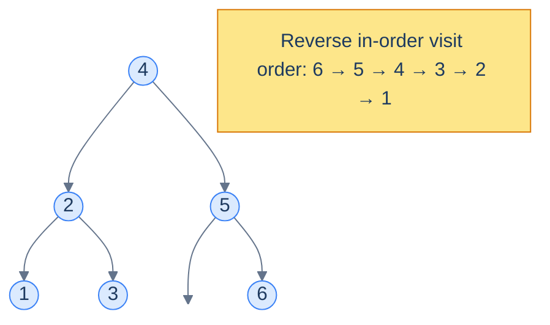
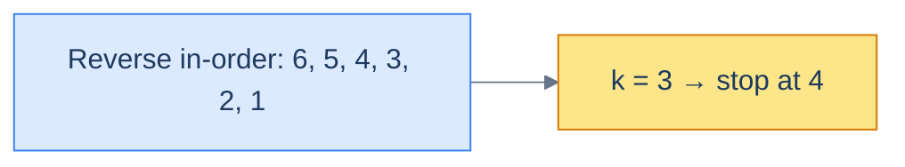

# 11. Pattern: Reversed Sorted Traversal

## The Hook

The previous lesson lit up half the BST landscape with one observation: an in-order walk emits values in ascending order. Mirror that observation — visit *right-node-left* instead of *left-node-right* — and you get the *descending* version for free.

That sounds trivial. It is — *and* it unlocks an entire family of problems whose elegant solutions are otherwise invisible. **K-th largest** rather than k-th smallest. **Greater-than-X sums** rather than less-than-X sums. **Ranks descending from the top** rather than from the bottom. **Tree mutations driven by running totals from the top end of the sorted sequence** instead of the bottom.

This lesson is the descending-order companion to lesson 10. Same template, different traversal direction. Four hands-on problems make the pattern stick.

---

## Table of Contents

1. [Understanding the reversed sorted traversal pattern](#understanding-the-reversed-sorted-traversal-pattern)
2. [Identifying the reverse sorted traversal pattern](#identifying-the-reverse-sorted-traversal-pattern)
3. [Rank nodes](#rank-nodes)
4. [Kth largest element](#kth-largest-element)
5. [Enriched sum tree](#enriched-sum-tree)
6. [Multiple replacement](#multiple-replacement)

***

# Understanding the reversed sorted traversal pattern

The **reverse in-order** traversal visits each node in the order *right → node → left*. Because the right subtree of any BST node holds *larger* values, the reverse-in-order walk lists values in **descending sorted order** — the perfect mirror of the in-order walk.



<p align="center"><strong>Reverse in-order traversal of a BST visits values in descending order. The pattern mirrors lesson 10's sorted traversal.</strong></p>

## The technique

Same structure as the sorted-traversal template, with the recursive calls swapped:

> **Algorithm**
>
> - **Step 1:** Initialise running state in the enclosing scope.
> - **Step 2:** Call `reverseInorder(root)`.
>
> **reverseInorder(node):**
>
> - **Step 1:** If `node` is `null`, return.
> - **Step 2:** `reverseInorder(node.right)` — visit larger values first.
> - **Step 3:** Process the current node — apply `f`; fold into the aggregate via `g`.
> - **Step 4:** `reverseInorder(node.left)`.

## Generic template


```python run
"""
Definition for a binary tree node.
class TreeNode:
    def __init__(self, val):
        self.val = val
        self.left = None
        self.right = None
"""

from typing import Optional, List

class Solution:
    def __init__(self):
        # Class-level variable to hold the aggregate value
        self.aggregate: int = 0

    def callingFunction(self, root: Optional[TreeNode]) -> int:

        # Initialize aggregate with a default value
        self.aggregate = 0

        # Traverse the binary tree in reverse_inorder traversal
        self.reverse_inorder(root)

        # Return the aggregated value
        return self.aggregate

    def reverse_inorder(self, node: Optional[TreeNode]) -> None:

        if not node:
            # Return if this is a null node
            return

        # Traverse the right subtree
        self.reverse_inorder(node.right)

        # Process the current node
        output = f(node.val)
        # Add contribution of current node
        self.aggregate = g(self.aggregate, output)

        # Traverse the left subtree
        self.reverse_inorder(node.left)
```

```java run
import java.util.*;

/**
 * Definition for a binary tree node.
 * class TreeNode {
 *      int val;
 *      TreeNode left;
 *      TreeNode right;
 *      TreeNode() {}
 *      TreeNode(int val) { this.val = val; }
 * }
 */

public class Solution {

    // Declare aggregate as a class-level variable since Java does not support pass-by-reference
    private int aggregate = 0;

    public int callingFunction(TreeNode root) {

        // Initialize aggregate with a default value
        aggregate = 0;

        // Traverse the binary tree in reverseInorder traversal
        reverseInorder(root);

        // Return the aggregated value
        return aggregate;
    }

    private void reverseInorder(TreeNode node) {

        if (node == null) {
            // Return if this is a null node;
            return;
        }

        // Traverse the right subtree
        reverseInorder(node.right);

        // Process the current node
        int output = f(node.val);

        // Add contribution of current node
        aggregate = g(aggregate, output);

        // Traverse the left subtree
        reverseInorder(node.left);
    }
}
```


## Complexity

| Operation | Time | Space |
|---|---|---|
| Reverse in-order walk + O(1) work per node | O(n) | O(h) |

Identical to the sorted-traversal pattern — same number of node visits, same recursion depth, mirrored direction.

***

# Identifying the reverse sorted traversal pattern

Use this pattern when the problem cares about *the sorted sequence in descending order* — i.e. you need to process larger values first, often because the result for a node depends on values strictly greater than itself.

Tell-tale signals:

- **K-th largest, top-K, percentile-from-top.**
- **Suffix sums / "sum of all values greater than this node"** — typical of problems that decorate every node with information about everything above it.
- **Descending ranks** — each node's rank is `1 + (number of strictly larger nodes already seen)`.
- **Pairwise checks against the *previous-larger* value** (the mirror of "previous-smaller" from lesson 10).

If your mental model is "iterate from biggest to smallest while remembering a running tally", reach for reverse in-order.

## Worked example — k-th largest element

> **Problem:** Given a BST and an integer `k`, return the value of the k-th largest element.

The reverse in-order walk emits nodes in descending order. So the k-th node it visits *is* the k-th largest. We just need a counter and an early-exit:

- Maintain a `count` (number of nodes processed so far) and a `result` slot.
- At each node, recurse right first, increment count, check if `count == k` (record `result`, stop). Otherwise recurse left.



<p align="center"><strong>For k = 3, the third value emitted by the reverse in-order walk is the answer (here, <code>4</code>). We can stop as soon as we hit it.</strong></p>

The "stop early" detail is what makes this O(h + k) rather than O(n) — we don't visit any node smaller than the answer.

***

# Rank nodes

## Problem Statement

Given the **root** of a binary search tree, replace each node's value with its **rank in descending order** (largest = rank 1).

### Example 1

> - **Input:** `root = [4, 2, 5, 1, 3, null, 6]`
> - **Output:** `[3, 5, 2, 6, 4, null, 1]`

### Example 2

> - **Input:** `root = [5, 4, 10, null, null, 9, 11]`
> - **Output:** `[4, 5, 2, null, null, 3, 1]`

<details>
<summary><h2>The Strategy</h2></summary>


Walk the tree in reverse in-order. The first node visited (the largest) gets rank `1`; the next gets `2`; and so on. Just maintain a running `rank` counter; every node overwrites its own value with the current `rank`, then increments it.

</details>
<details>
<summary><h2>The Solution</h2></summary>


```python run
from typing import Optional


class TreeNode:
    def __init__(self, val=0, left=None, right=None):
        self.val = val
        self.left = left
        self.right = right


def from_level_order(values):
    """Build tree from list like [1, 2, 3, None, 4]. None means missing child."""
    if not values:
        return None
    root = TreeNode(values[0])
    queue = [root]
    i = 1
    while queue and i < len(values):
        node = queue.pop(0)
        if i < len(values) and values[i] is not None:
            node.left = TreeNode(values[i])
            queue.append(node.left)
        i += 1
        if i < len(values) and values[i] is not None:
            node.right = TreeNode(values[i])
            queue.append(node.right)
        i += 1
    return root


def level_order_vals(root):
    """Collect values level-order (None for missing children)."""
    if not root:
        return []
    result, queue = [], [root]
    while queue:
        node = queue.pop(0)
        if node:
            result.append(node.val)
            queue.append(node.left)
            queue.append(node.right)
        else:
            result.append(None)
    # strip trailing Nones
    while result and result[-1] is None:
        result.pop()
    return result


class Solution:
    def __init__(self) -> None:

        # Variable to keep track of the running rank of the tree
        self.rank: int = 1

    def rank_nodes(self, root: Optional[TreeNode]) -> None:

        # Base case
        if root is None:
            return

        # Recursively process the right subtree
        self.rank_nodes(root.right)

        # Update the current node's value
        root.val = self.rank

        # Increment the rank for the next node
        self.rank += 1

        # Recursively process the left subtree
        self.rank_nodes(root.left)


# Example 1: [4, 2, 5, 1, 3, null, 6] → [3, 5, 2, 6, 4, null, 1]
t1 = from_level_order([4, 2, 5, 1, 3, None, 6])
Solution().rank_nodes(t1)
print(level_order_vals(t1))   # [3, 5, 2, 6, 4, 1]

# Example 2: [5, 4, 10, null, null, 9, 11] → [4, 5, 2, null, null, 3, 1]
t2 = from_level_order([5, 4, 10, None, None, 9, 11])
Solution().rank_nodes(t2)
print(level_order_vals(t2))   # [4, 5, 2, 3, 1]

# Edge cases
t3 = None
Solution().rank_nodes(t3)
print(t3)                     # None

t4 = from_level_order([7])
Solution().rank_nodes(t4)
print(t4.val)                 # 1

# Two-node tree: root=5, right=10 → root ranks 2, right ranks 1
t5 = from_level_order([5, None, 10])
Solution().rank_nodes(t5)
print(t5.val, t5.right.val)   # 2 1
```

```java run
import java.util.*;

public class Main {
    static class TreeNode {
        int val;
        TreeNode left;
        TreeNode right;
        TreeNode() {}
        TreeNode(int val) { this.val = val; }
    }

    static TreeNode fromLevelOrder(Integer... values) {
        if (values.length == 0 || values[0] == null) return null;
        TreeNode root = new TreeNode(values[0]);
        java.util.Deque<TreeNode> queue = new java.util.ArrayDeque<>();
        queue.add(root);
        int i = 1;
        while (!queue.isEmpty() && i < values.length) {
            TreeNode node = queue.poll();
            if (i < values.length && values[i] != null) {
                node.left = new TreeNode(values[i]);
                queue.add(node.left);
            }
            i++;
            if (i < values.length && values[i] != null) {
                node.right = new TreeNode(values[i]);
                queue.add(node.right);
            }
            i++;
        }
        return root;
    }

    static List<Integer> levelOrderVals(TreeNode root) {
        if (root == null) return List.of();
        List<Integer> result = new ArrayList<>();
        java.util.Deque<TreeNode> q = new java.util.ArrayDeque<>();
        q.add(root);
        while (!q.isEmpty()) {
            TreeNode node = q.poll();
            result.add(node.val);
            if (node.left != null) q.add(node.left);
            if (node.right != null) q.add(node.right);
        }
        return result;
    }

    static class Solution {

        // Variable to keep track of the running rank of the tree
        private int rank = 1;

        public void rankNodes(TreeNode root) {

            // Base case
            if (root == null) {
                return;
            }

            // Recursively process the right subtree
            rankNodes(root.right);

            // Update the current node's value
            root.val = rank;

            // Increment the rank for the next node
            rank++;

            // Recursively process the left subtree
            rankNodes(root.left);
        }
    }

    public static void main(String[] args) {
        // Example 1
        TreeNode t1 = fromLevelOrder(4, 2, 5, 1, 3, null, 6);
        new Solution().rankNodes(t1);
        System.out.println(levelOrderVals(t1));   // [3, 5, 2, 6, 4, 1]

        // Example 2
        TreeNode t2 = fromLevelOrder(5, 4, 10, null, null, 9, 11);
        new Solution().rankNodes(t2);
        System.out.println(levelOrderVals(t2));   // [4, 5, 2, 3, 1]

        // Edge cases
        new Solution().rankNodes(null);            // no-op

        TreeNode t4 = fromLevelOrder(7);
        new Solution().rankNodes(t4);
        System.out.println(t4.val);               // 1

        // Two-node tree: root=5, right=10 → root ranks 2, right ranks 1
        TreeNode t5 = fromLevelOrder(5, null, 10);
        new Solution().rankNodes(t5);
        System.out.println(t5.val + " " + t5.right.val);  // 2 1
    }
}
```

</details>


***

# Kth largest element

## Problem Statement

Given the **root** of a binary search tree and an integer `k`, return the k-th largest element. Return `0` if no such element exists.

### Example 1

> - **Input:** `root = [4, 2, 5, 1, 3, null, 6]`, `k = 3`
> - **Output:** `4`

### Example 2

> - **Input:** `root = [5, 4, 10, null, null, 9, 11]`, `k = 2`
> - **Output:** `10`

<details>
<summary><h2>The Strategy</h2></summary>


Walk reverse in-order; the k-th node visited is the k-th largest. Critically — **stop traversing the moment the answer is found**, so the cost is O(h + k), not O(n).

</details>
<details>
<summary><h2>The Solution</h2></summary>


```python run
from typing import Optional, List, Any


class TreeNode:
    def __init__(self, val=0, left=None, right=None):
        self.val = val
        self.left = left
        self.right = right


def from_level_order(values):
    """Build tree from list like [1, 2, 3, None, 4]. None means missing child."""
    if not values:
        return None
    root = TreeNode(values[0])
    queue = [root]
    i = 1
    while queue and i < len(values):
        node = queue.pop(0)
        if i < len(values) and values[i] is not None:
            node.left = TreeNode(values[i])
            queue.append(node.left)
        i += 1
        if i < len(values) and values[i] is not None:
            node.right = TreeNode(values[i])
            queue.append(node.right)
        i += 1
    return root


class Solution:
    def __init__(self):

        # Counter to keep track of the kth element
        self.count: int = 0

        # Variable to store the kth largest element
        self.result: int = 0

        # Perform reverse in-order traversal
        self.found: bool = False

    def reverse_in_order(self, root: Optional[TreeNode], k: int) -> None:

        # If the root is null or the kth largest element is already
        # found, we don't need to traverse further
        if root is None or self.found is True:
            return

        # Traverse the right subtree
        self.reverse_in_order(root.right, k)

        # Increment the count
        self.count += 1

        # If the count matches k, we have found the kth largest element
        if self.count == k:
            self.result = root.val
            self.found = True
            return

        # Traverse the left subtree
        self.reverse_in_order(root.left, k)

    def kth_largest_element(
        self, root: Optional[TreeNode], k: int
    ) -> int:

        # Perform reverse in-order traversal
        self.reverse_in_order(root, k)

        return self.result


# Example 1: k=3 → 4
print(Solution().kth_largest_element(
    from_level_order([4, 2, 5, 1, 3, None, 6]), 3))   # 4

# Example 2: k=2 → 10
print(Solution().kth_largest_element(
    from_level_order([5, 4, 10, None, None, 9, 11]), 2))  # 10

# Edge cases
print(Solution().kth_largest_element(
    from_level_order([5]), 1))                          # 5  (single node)

print(Solution().kth_largest_element(
    from_level_order([5]), 2))                          # 0  (k > size)

# k=1 → largest element
print(Solution().kth_largest_element(
    from_level_order([4, 2, 5, 1, 3, None, 6]), 1))   # 6

# k equals total number of nodes → smallest
print(Solution().kth_largest_element(
    from_level_order([4, 2, 5, 1, 3, None, 6]), 6))   # 1
```

```java run
import java.util.*;

public class Main {
    static class TreeNode {
        int val;
        TreeNode left;
        TreeNode right;
        TreeNode() {}
        TreeNode(int val) { this.val = val; }
    }

    static TreeNode fromLevelOrder(Integer... values) {
        if (values.length == 0 || values[0] == null) return null;
        TreeNode root = new TreeNode(values[0]);
        java.util.Deque<TreeNode> queue = new java.util.ArrayDeque<>();
        queue.add(root);
        int i = 1;
        while (!queue.isEmpty() && i < values.length) {
            TreeNode node = queue.poll();
            if (i < values.length && values[i] != null) {
                node.left = new TreeNode(values[i]);
                queue.add(node.left);
            }
            i++;
            if (i < values.length && values[i] != null) {
                node.right = new TreeNode(values[i]);
                queue.add(node.right);
            }
            i++;
        }
        return root;
    }

    static class Solution {

        // Counter to keep track of the kth element
        private int count = 0;

        // Variable to store the kth largest element
        private int result = 0;

        // Flag to indicate if the kth largest element has been found
        private boolean found = false;

        private void reverseInOrder(TreeNode root, int k) {

            // If the root is null or the kth largest element is already
            // found, we don't need to traverse further
            if (root == null || found) {
                return;
            }

            // Traverse the right subtree
            reverseInOrder(root.right, k);

            // Increment the count
            count++;

            // If the count matches k, we have found the kth largest element
            if (count == k) {
                result = root.val;
                found = true;
                return;
            }

            // Traverse the left subtree
            reverseInOrder(root.left, k);
        }

        public int kthLargestElement(TreeNode root, int k) {

            // Perform reverse in-order traversal
            reverseInOrder(root, k);

            return result;
        }
    }

    public static void main(String[] args) {
        // Example 1: k=3 → 4
        System.out.println(new Solution().kthLargestElement(
            fromLevelOrder(4, 2, 5, 1, 3, null, 6), 3));   // 4

        // Example 2: k=2 → 10
        System.out.println(new Solution().kthLargestElement(
            fromLevelOrder(5, 4, 10, null, null, 9, 11), 2));  // 10

        // Edge cases
        System.out.println(new Solution().kthLargestElement(
            fromLevelOrder(5), 1));                          // 5
        System.out.println(new Solution().kthLargestElement(
            fromLevelOrder(5), 2));                          // 0  (k > size)

        // k=1 → largest element
        System.out.println(new Solution().kthLargestElement(
            fromLevelOrder(4, 2, 5, 1, 3, null, 6), 1));   // 6

        // k equals total nodes → smallest
        System.out.println(new Solution().kthLargestElement(
            fromLevelOrder(4, 2, 5, 1, 3, null, 6), 6));   // 1
    }
}
```

</details>


***

# Enriched sum tree

## Problem Statement

Given the **root** of a binary search tree, replace every node's value with the sum of its original value and the values of *all nodes greater than it*. The resulting tree is called an **enriched sum tree** (sometimes "greater-tree").

### Example 1

> - **Input:** `root = [4, 2, 5, 1, 3, null, 6]`
> - **Output:** `[15, 20, 11, 21, 18, null, 6]`

### Example 2

> - **Input:** `root = [5, 4, 10, null, null, 9, 11]`
> - **Output:** `[35, 39, 21, null, null, 30, 11]`

<details>
<summary><h2>The Strategy</h2></summary>


Reverse in-order visits nodes from largest to smallest. Maintain a running `sum`; at each node:

1. Add the current node's value to `sum`.
2. Overwrite the current node's value with `sum`.

By the time we visit a node, `sum` already contains the total of every strictly larger node we've already passed *plus* the current node — exactly the value the problem asks for.

</details>
<details>
<summary><h2>The Solution</h2></summary>


```python run
from typing import Optional


class TreeNode:
    def __init__(self, val=0, left=None, right=None):
        self.val = val
        self.left = left
        self.right = right


def from_level_order(values):
    """Build tree from list like [1, 2, 3, None, 4]. None means missing child."""
    if not values:
        return None
    root = TreeNode(values[0])
    queue = [root]
    i = 1
    while queue and i < len(values):
        node = queue.pop(0)
        if i < len(values) and values[i] is not None:
            node.left = TreeNode(values[i])
            queue.append(node.left)
        i += 1
        if i < len(values) and values[i] is not None:
            node.right = TreeNode(values[i])
            queue.append(node.right)
        i += 1
    return root


def level_order_vals(root):
    if not root:
        return []
    result, queue = [], [root]
    while queue:
        node = queue.pop(0)
        if node:
            result.append(node.val)
            queue.append(node.left)
            queue.append(node.right)
        else:
            result.append(None)
    while result and result[-1] is None:
        result.pop()
    return result


class Solution:
    def __init__(self) -> None:

        # Variable to keep track of the running sum of the tree
        self.sum: int = 0

    def enriched_sum_tree(self, root: Optional[TreeNode]) -> None:

        # Base case
        if root is None:
            return

        # Recursively process the right subtree
        self.enriched_sum_tree(root.right)

        # Update the running sum with the current node's value
        self.sum += root.val

        # Update the current node's value
        root.val = self.sum

        # Recursively process the left subtree
        self.enriched_sum_tree(root.left)


# Example 1: [4, 2, 5, 1, 3, null, 6] → [15, 20, 11, 21, 18, null, 6]
t1 = from_level_order([4, 2, 5, 1, 3, None, 6])
Solution().enriched_sum_tree(t1)
print(level_order_vals(t1))   # [15, 20, 11, 21, 18, 6]

# Example 2: [5, 4, 10, null, null, 9, 11] → [35, 39, 21, null, null, 30, 11]
t2 = from_level_order([5, 4, 10, None, None, 9, 11])
Solution().enriched_sum_tree(t2)
print(level_order_vals(t2))   # [35, 39, 21, 30, 11]

# Edge cases
Solution().enriched_sum_tree(None)   # no-op

t3 = from_level_order([7])
Solution().enriched_sum_tree(t3)
print(t3.val)                 # 7  (single node, no larger values)

# Two-node tree: root=3, right=5 → root=8 (3+5), right=5
t4 = from_level_order([3, None, 5])
Solution().enriched_sum_tree(t4)
print(t4.val, t4.right.val)   # 8 5

# Three-node balanced: [2, 1, 3]
t5 = from_level_order([2, 1, 3])
Solution().enriched_sum_tree(t5)
print(level_order_vals(t5))   # [5, 6, 3]
```

```java run
import java.util.*;

public class Main {
    static class TreeNode {
        int val;
        TreeNode left;
        TreeNode right;
        TreeNode() {}
        TreeNode(int val) { this.val = val; }
    }

    static TreeNode fromLevelOrder(Integer... values) {
        if (values.length == 0 || values[0] == null) return null;
        TreeNode root = new TreeNode(values[0]);
        java.util.Deque<TreeNode> queue = new java.util.ArrayDeque<>();
        queue.add(root);
        int i = 1;
        while (!queue.isEmpty() && i < values.length) {
            TreeNode node = queue.poll();
            if (i < values.length && values[i] != null) {
                node.left = new TreeNode(values[i]);
                queue.add(node.left);
            }
            i++;
            if (i < values.length && values[i] != null) {
                node.right = new TreeNode(values[i]);
                queue.add(node.right);
            }
            i++;
        }
        return root;
    }

    static List<Integer> levelOrderVals(TreeNode root) {
        if (root == null) return List.of();
        List<Integer> result = new ArrayList<>();
        java.util.Deque<TreeNode> q = new java.util.ArrayDeque<>();
        q.add(root);
        while (!q.isEmpty()) {
            TreeNode node = q.poll();
            result.add(node.val);
            if (node.left != null) q.add(node.left);
            if (node.right != null) q.add(node.right);
        }
        return result;
    }

    static class Solution {

        // Variable to keep track of the running sum of the tree
        private int sum = 0;

        public void enrichedSumTree(TreeNode root) {

            // Base case
            if (root == null) {
                return;
            }

            // Recursively process the right subtree
            enrichedSumTree(root.right);

            // Update the running sum with the current node's value
            sum += root.val;

            // Update the current node's value
            root.val = sum;

            // Recursively process the left subtree
            enrichedSumTree(root.left);
        }
    }

    public static void main(String[] args) {
        // Example 1
        TreeNode t1 = fromLevelOrder(4, 2, 5, 1, 3, null, 6);
        new Solution().enrichedSumTree(t1);
        System.out.println(levelOrderVals(t1));   // [15, 20, 11, 21, 18, 6]

        // Example 2
        TreeNode t2 = fromLevelOrder(5, 4, 10, null, null, 9, 11);
        new Solution().enrichedSumTree(t2);
        System.out.println(levelOrderVals(t2));   // [35, 39, 21, 30, 11]

        // Edge cases
        new Solution().enrichedSumTree(null);      // no-op

        TreeNode t3 = fromLevelOrder(7);
        new Solution().enrichedSumTree(t3);
        System.out.println(t3.val);               // 7

        // Two-node tree: root=3, right=5
        TreeNode t4 = fromLevelOrder(3, null, 5);
        new Solution().enrichedSumTree(t4);
        System.out.println(t4.val + " " + t4.right.val);  // 8 5

        // Three-node balanced [2, 1, 3]
        TreeNode t5 = fromLevelOrder(2, 1, 3);
        new Solution().enrichedSumTree(t5);
        System.out.println(levelOrderVals(t5));   // [5, 6, 3]
    }
}
```


<details>
<summary><strong>Trace — root = [4, 2, 5, 1, 3, null, 6]</strong></summary>

```
sum = 0, visit order: 6, 5, 4, 3, 2, 1
visit 6 │ sum = 0 + 6 = 6   → node.val = 6
visit 5 │ sum = 6 + 5 = 11  → node.val = 11
visit 4 │ sum = 11 + 4 = 15 → node.val = 15
visit 3 │ sum = 15 + 3 = 18 → node.val = 18
visit 2 │ sum = 18 + 2 = 20 → node.val = 20
visit 1 │ sum = 20 + 1 = 21 → node.val = 21
Result: [15, 20, 11, 21, 18, null, 6] ✓
```

</details>

</details>

***

# Multiple replacement

## Problem Statement

Given the **root** of a binary search tree, replace each node's value with `0` if its **inorder predecessor's** value (the value just *larger* than it in sorted order) is a non-zero multiple of its own value.

### Example 1

> - **Input:** `root = [6, 2, 5, 1, 4, null, 10]`
> - **Output:** `[6, 0, 0, 0, 4, null, 10]`

### Example 2

> - **Input:** `root = [5, 4, 10, null, null, 9, 11]`
> - **Output:** `[5, 4, 10, null, null, 9, 11]`

<details>
<summary><h2>The Strategy</h2></summary>


The trick word is **predecessor**. Inside a reverse-in-order walk, each node's *previous-visited* node is the next-larger value in sorted order — exactly the "successor's value" the problem asks about (the problem statement's wording is slightly confusing, but the example outputs confirm: we compare each node to the value *larger* than it).

So:

- Maintain a `prev_val` that holds the most recently visited (i.e. larger) node's *original* value.
- At each node, if `prev_val % current.val == 0` and `prev_val != 0`, set the current node to `0`.
- *Then* update `prev_val` to the current node's original value (not the possibly-zeroed one) before recursing left.

The "save the original first" detail is the trap that catches careless implementations.

</details>
<details>
<summary><h2>The Solution</h2></summary>


```python run
from typing import Optional


class TreeNode:
    def __init__(self, val=0, left=None, right=None):
        self.val = val
        self.left = left
        self.right = right


def from_level_order(values):
    """Build tree from list like [1, 2, 3, None, 4]. None means missing child."""
    if not values:
        return None
    root = TreeNode(values[0])
    queue = [root]
    i = 1
    while queue and i < len(values):
        node = queue.pop(0)
        if i < len(values) and values[i] is not None:
            node.left = TreeNode(values[i])
            queue.append(node.left)
        i += 1
        if i < len(values) and values[i] is not None:
            node.right = TreeNode(values[i])
            queue.append(node.right)
        i += 1
    return root


def level_order_vals(root):
    if not root:
        return []
    result, queue = [], [root]
    while queue:
        node = queue.pop(0)
        if node:
            result.append(node.val)
            queue.append(node.left)
            queue.append(node.right)
        else:
            result.append(None)
    while result and result[-1] is None:
        result.pop()
    return result


class Solution:
    def __init__(self) -> None:

        # Variable to keep track of the previous node
        self.prev_node_val: int = 0

        # Flag to check if previous node exists
        self.has_prev_node: bool = False

    def multiple_replacement(self, root: Optional[TreeNode]) -> None:

        # Base case
        if root is None:
            return

        # Recursively process the right subtree
        self.multiple_replacement(root.right)

        # Store the original value of the current node
        original_val = root.val

        # If the previous node's value is a multiple of the current node's
        # value, replace the current node's value with 0
        if (
            self.has_prev_node
            and self.prev_node_val != 0
            and self.prev_node_val % root.val == 0
        ):
            root.val = 0

        # Update the previous node to the current node's original value
        self.prev_node_val = original_val

        # Set the flag to true indicating that previous
        # node exists
        self.has_prev_node = True

        # Recursively process the left subtree
        self.multiple_replacement(root.left)


# Example 1: [6, 2, 5, 1, 4, null, 10] → [6, 0, 0, 0, 4, null, 10]
t1 = from_level_order([6, 2, 5, 1, 4, None, 10])
Solution().multiple_replacement(t1)
print(level_order_vals(t1))   # [6, 0, 0, 0, 4, 10]

# Example 2: no replacements
t2 = from_level_order([5, 4, 10, None, None, 9, 11])
Solution().multiple_replacement(t2)
print(level_order_vals(t2))   # [5, 4, 10, 9, 11]

# Edge cases
Solution().multiple_replacement(None)   # no-op

t3 = from_level_order([7])
Solution().multiple_replacement(t3)
print(t3.val)                 # 7  (single node)

# Two-node tree: root=2, right=4 → 4 % 2 == 0, so root becomes 0
t4 = from_level_order([2, None, 4])
Solution().multiple_replacement(t4)
print(t4.val, t4.right.val)   # 0 4

# Two-node tree: root=3, right=5 → 5 % 3 != 0, no change
t5 = from_level_order([3, None, 5])
Solution().multiple_replacement(t5)
print(t5.val, t5.right.val)   # 3 5
```

```java run
import java.util.*;

public class Main {
    static class TreeNode {
        int val;
        TreeNode left;
        TreeNode right;
        TreeNode() {}
        TreeNode(int val) { this.val = val; }
    }

    static TreeNode fromLevelOrder(Integer... values) {
        if (values.length == 0 || values[0] == null) return null;
        TreeNode root = new TreeNode(values[0]);
        java.util.Deque<TreeNode> queue = new java.util.ArrayDeque<>();
        queue.add(root);
        int i = 1;
        while (!queue.isEmpty() && i < values.length) {
            TreeNode node = queue.poll();
            if (i < values.length && values[i] != null) {
                node.left = new TreeNode(values[i]);
                queue.add(node.left);
            }
            i++;
            if (i < values.length && values[i] != null) {
                node.right = new TreeNode(values[i]);
                queue.add(node.right);
            }
            i++;
        }
        return root;
    }

    static List<Integer> levelOrderVals(TreeNode root) {
        if (root == null) return List.of();
        List<Integer> result = new ArrayList<>();
        java.util.Deque<TreeNode> q = new java.util.ArrayDeque<>();
        q.add(root);
        while (!q.isEmpty()) {
            TreeNode node = q.poll();
            result.add(node.val);
            if (node.left != null) q.add(node.left);
            if (node.right != null) q.add(node.right);
        }
        return result;
    }

    static class Solution {

        // Variable to keep track of the value of the
        // previous node
        private int prevNodeVal;

        // Flag to check if previous node exists
        private boolean hasPrevNode = false;

        public void multipleReplacement(TreeNode root) {

            // Base case
            if (root == null) {
                return;
            }

            // Recursively process the right subtree
            multipleReplacement(root.right);

            // Store the original value of the current node
            int originalVal = root.val;

            // If the previous node's value is a multiple of the current
            // node's value, replace the current node's value with 0
            if (
                hasPrevNode &&
                prevNodeVal != 0 &&
                prevNodeVal % root.val == 0
            ) {
                root.val = 0;
            }

            // Update the previous node to the current node's original value
            prevNodeVal = originalVal;

            // Set the flag to true indicating that previous
            // node exists
            hasPrevNode = true;

            // Recursively process the left subtree
            multipleReplacement(root.left);
        }
    }

    public static void main(String[] args) {
        // Example 1
        TreeNode t1 = fromLevelOrder(6, 2, 5, 1, 4, null, 10);
        new Solution().multipleReplacement(t1);
        System.out.println(levelOrderVals(t1));   // [6, 0, 0, 0, 4, 10]

        // Example 2: no replacements
        TreeNode t2 = fromLevelOrder(5, 4, 10, null, null, 9, 11);
        new Solution().multipleReplacement(t2);
        System.out.println(levelOrderVals(t2));   // [5, 4, 10, 9, 11]

        // Edge cases
        new Solution().multipleReplacement(null);  // no-op

        TreeNode t3 = fromLevelOrder(7);
        new Solution().multipleReplacement(t3);
        System.out.println(t3.val);               // 7

        // root=2, right=4 → 4 % 2 == 0, root becomes 0
        TreeNode t4 = fromLevelOrder(2, null, 4);
        new Solution().multipleReplacement(t4);
        System.out.println(t4.val + " " + t4.right.val);  // 0 4

        // root=3, right=5 → 5 % 3 != 0, no change
        TreeNode t5 = fromLevelOrder(3, null, 5);
        new Solution().multipleReplacement(t5);
        System.out.println(t5.val + " " + t5.right.val);  // 3 5
    }
}
```

</details>
<details>
<summary><h2>Final Takeaway</h2></summary>


Reverse in-order is the descending dual of in-order. Whenever the problem cares about *the largest values first* — k-th largest, ranks from the top, suffix sums by value, comparisons against the next-larger node — flip the recursion direction and the same template applies. Most reverse-sorted-traversal problems are *easy* because the BST has done the sorting for you.

Three patterns to keep:

1. **"Carry the previous-larger value"** — mirror of lesson 10's "carry the previous-smaller". Useful for any pairwise check that runs against the next-larger value (multiples, ratios, ranges, monotonicity).
2. **"Running total over the descending sequence"** — solves *enriched sum tree*, but the same shape solves "sum of values strictly greater than X", "convert to suffix-sum array", "decorate node with `(num greater, sum greater)`".
3. **"Save original before overwriting"** — the trap in `multiple replacement`. When a traversal both *reads* and *writes* the same field, capture the read into a local before the write — your future self will thank you.

The next lesson introduces a new pattern that breaks the "always traverse all nodes" pattern from the last two lessons: **range postorder**, where the BST property lets us *prune* entire subtrees that can't contribute to the answer.

</details>