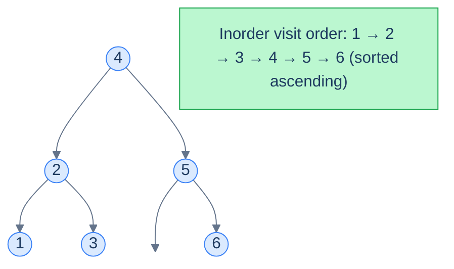
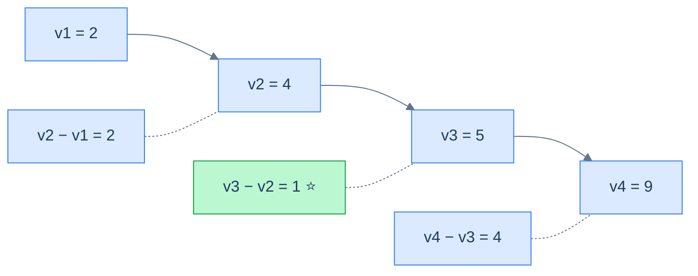

# Understanding the sorted traversal pattern

The pattern is simple: **walk the BST in-order, processing each node as you go, carrying a small piece of running state**.

> 🖼 Diagram — An in-order walk of a BST visits values in sorted ascending order. The "sorted traversal" pattern leans on this property to solve any problem that's really about the sorted sequence.


<p align="center"><strong>An in-order walk of a BST visits values in sorted ascending order. The "sorted traversal" pattern leans on this property to solve any problem that's really about the sorted sequence.</strong></p>

## The technique

Two ingredients, both simple:

- A **process function** `f(node)` that does whatever the problem requires for one element of the sorted sequence (e.g. compare with the previous one, append to an array, link to the previous node).
- An **aggregate function** `g(state, output)` that combines the per-node result into a running summary (e.g. minimum, list, head pointer).

Put them inside the standard recursive in-order template, with the running state held in the enclosing scope (or as instance fields, in OO languages):

> **Algorithm**
>
> - **Step 1:** Initialise running state in the enclosing scope.
> - **Step 2:** Call `inorder(root)`.
>
> **inorder(node):**
>
> - **Step 1:** If `node` is `null`, return.
> - **Step 2:** `inorder(node.left)`.
> - **Step 3:** Process the current node — apply `f(node.val)`; combine with running state via `g`.
> - **Step 4:** `inorder(node.right)`.

The reason this template works on every "sorted traversal" problem is that the **order of `f` calls is exactly the sorted order of values**. So whatever invariant you want to maintain about a sorted sequence, you maintain it with a single previous-pointer or running accumulator.

## Generic template


```python run viz=binary-tree viz-root=root
"""
Definition for a binary tree node.
class TreeNode:
    def __init__(self, val):
        self.val = val
        self.left = None
        self.right = None
"""

from typing import Optional, List

class Solution:
    def __init__(self):
        # Class-level variable to hold the aggregate value
        self.aggregate: int = 0

    def callingFunction(self, root: Optional[TreeNode]) -> int:

        # Initialize aggregate with a default value
        self.aggregate = 0

        # Traverse the binary tree in inorder traversal
        self.inorder(root)

        # Return the aggregated value
        return self.aggregate

    def inorder(self, node: Optional[TreeNode]) -> None:

        if not node:
            # Return if this is a null node
            return

        # Traverse the left subtree
        self.inorder(node.left)

        # Process the current node
        output = f(node.val)
        # Add contribution of current node
        self.aggregate = g(self.aggregate, output)

        # Traverse the right subtree
        self.inorder(node.right)
```

```java run viz=binary-tree viz-root=root
import java.util.*;

/**
 * Definition for a binary tree node.
 * class TreeNode {
 *      int val;
 *      TreeNode left;
 *      TreeNode right;
 *      TreeNode() {}
 *      TreeNode(int val) { this.val = val; }
 * }
 */

public class Solution {

    // Declare aggregate as a class-level variable since Java does not support pass-by-reference
    private int aggregate = 0;

    public int callingFunction(TreeNode root) {

        // Initialize aggregate with a default value
        aggregate = 0;

        // Traverse the binary tree in inorder traversal
        inorder(root);

        // Return the aggregated value
        return aggregate;
    }

    private void inorder(TreeNode node) {

        if (node == null) {
            // Return if this is a null node;
            return;
        }

        // Traverse the left subtree
        inorder(node.left);

        // Process the current node
        int output = f(node.val);

        // Add contribution of current node
        aggregate = g(aggregate, output);

        // Traverse the right subtree
        inorder(node.right);
    }
}
```


## Complexity

| Operation | Time | Space |
|---|---|---|
| In-order walk + O(1) work per node | **O(n)** | O(h) (call stack) |

If `f` and `g` are O(1), the total time is the cost of one in-order traversal: O(n). The recursion depth is the tree's height, contributing O(h) to space.

# Identifying the sorted traversal pattern

Use this pattern when the problem statement (or a quick reformulation of it) reduces to *"do something with the sorted sequence of values"*. Concrete signals:

- Anything about *minimum/maximum gaps*, *adjacent differences*, *pairs of close values* — the sorted order makes "adjacent" meaningful.
- *Validation* problems — "is this a BST?" reduces to "is the in-order walk strictly increasing?"
- *Format conversions* — "BST to sorted array", "BST to sorted doubly-linked list", "BST to a flat list of frequencies".
- *Position-based queries* — "k-th smallest" is just "stop at the k-th in-order visit".

If your solution starts with "if I had a sorted list of these values, I'd…", reach for the in-order traversal.

## Worked example — minimum absolute difference

> **Problem:** Given a BST, find the minimum absolute difference between any two distinct nodes' values.

> *Friction prompt — predict before reading on. Why is the answer always between two values that are *adjacent in sorted order*?*

In any sorted sequence `v1 < v2 < … < vn`, the differences between non-adjacent items are *always* greater than the differences between adjacent items: `v3 − v1 = (v3 − v2) + (v2 − v1) ≥ v2 − v1`. So we only have to look at adjacent pairs — and a sorted in-order walk gives them to us for free.

> 🖼 Diagram — Adjacent gaps in sorted order are the only ones worth checking. The minimum is between 4 and 5.


<p align="center"><strong>Adjacent gaps in sorted order are the only ones worth checking. The minimum is between <code>4</code> and <code>5</code>.</strong></p>

The fit with our template:

- **f** = "compute current.val − previous.val".
- **g** = "minimum".
- **state** = `(min_diff, prev_node)`, both held in the enclosing scope.

<!-- ============================================== -->
<!-- SWEEP 2 — missing sections (placeholders only) -->
<!-- ============================================== -->

<!-- TODO: Why Naive Isn't Enough — missing, needs to be written -->
<!--       Guidance: motivation for why the obvious approach fails -->

<!-- TODO: The Core Idea — missing, needs to be written -->
<!--       Guidance: one paragraph: the central trick -->

<!-- TODO: How the Pointers/Window Move — missing, needs to be written -->
<!--       Guidance: mechanics of the moving parts -->

<!-- TODO: The Generic Algorithm — missing, needs to be written -->
<!--       Guidance: numbered steps, no code -->

<!-- TODO: Generic Implementation — missing, needs to be written -->
<!--       Guidance: Python block + Java block of the skeleton -->

<!-- TODO: Complexity Analysis — missing, needs to be written -->
<!--       Guidance: table -->

<!-- TODO: Variants / Taxonomy — missing, needs to be written -->
<!--       Guidance: enumerate sub-shapes of this pattern -->

<!-- TODO: Recognition Checklist — missing, needs to be written -->
<!--       Guidance: 4-question diagnostic — the source of the Problem-section Diagnostic Questions -->

<!-- TODO: Canonical Example — missing, needs to be written -->
<!--       Guidance: fully worked example: brute force → optimised → template fit -->

<!-- TODO: Problems in This Category — missing, needs to be written -->
<!--       Guidance: table with links to the 02-problems/ files -->
