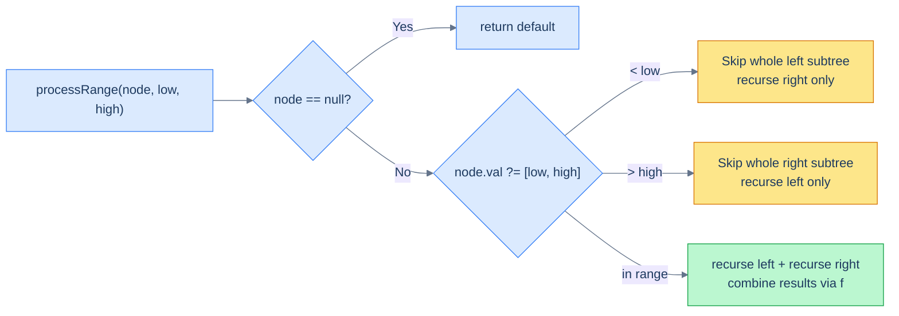
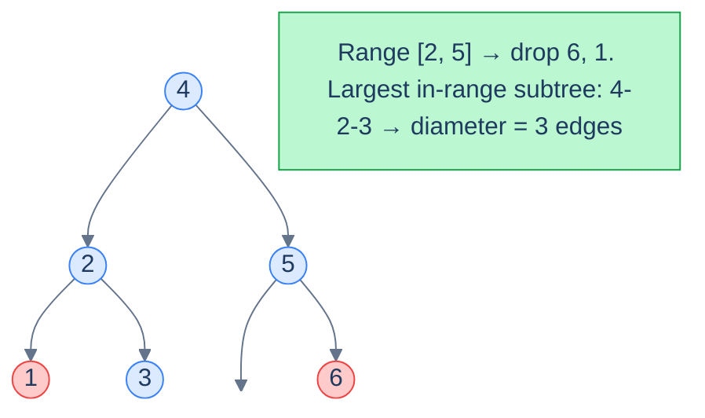

# 12. Pattern: Range Postorder

## The Hook

The previous two patterns let the BST silently sort the values for you, then walked the *whole* tree to compute things over the sorted sequence. They run in O(n) and visit every node — which is fine when the answer truly depends on every node, but **wasteful** the moment the question only cares about a *range*.

"Sum every node whose value is between 5 and 12." "Find the deepest path through nodes valued in [200, 500]." "Trim away everything outside [a, b] and return the resulting tree." If you walk every node you're doing too much work — *and the BST property tells you which subtrees you can skip entirely*. A node with value `v < low` puts its **whole left subtree** out of range. A node with `v > high` puts its **whole right subtree** out of range. We can prune.

This is the **Range Postorder** pattern: a postorder walk (left → right → process) augmented with two pruning rules from the BST property. It runs in O(out-of-range subtrees pruned + nodes touched) — usually much faster than O(n) — and it's the canonical pattern for any *range-bounded BST problem*: range sum, range diameter, range leaf count, range trim.

---

## Table of Contents

1. [Understanding the range postorder pattern](#understanding-the-range-postorder-pattern)
2. [Identifying the range postorder pattern](#identifying-the-range-postorder-pattern)
3. [Range summation](#range-summation)
4. [Range diameter](#range-diameter)
5. [Range leaves](#range-leaves)
6. [Range exclusive trim](#range-exclusive-trim)

***

# Understanding the range postorder pattern

The pattern combines two ideas you already know:

1. **Postorder traversal** (left → right → process the node) — used whenever a node's result depends on already-computed results from its subtrees. Sums, heights, diameters, leaf counts all fit this shape.
2. **BST search-style pruning** — a node's value tells us *which* subtree might contain in-range descendants, and discards the other.

Put them together: at every node, **first check the BST pruning rule**; only descend into both subtrees if the node itself is in range; combine subtree results in postorder fashion.



<p align="center"><strong>The decision diamond at every node. Out-of-range nodes prune one subtree entirely; in-range nodes recurse both ways and combine.</strong></p>

The pruning is what makes the pattern fast. If your range is narrow and your tree is balanced, you might touch only **O(log n + k)** nodes (path to range + size of range), not O(n).

## Why "postorder"?

Because the work happens *after* the children's results come back. The recursive calls to `processRange(left)` and `processRange(right)` produce aggregates; the parent combines them into its own aggregate before returning to *its* parent. Sum, max-depth, leaf count — these are all postorder reductions.

## Algorithm

> **processRange(node, low, high):**
>
> - **Step 1:** If `node` is `null`, return the default value.
> - **Step 2:** If `node.val < low`, return `processRange(node.right, low, high)` — entire left subtree is out of range.
> - **Step 3:** If `node.val > high`, return `processRange(node.left, low, high)` — entire right subtree is out of range.
> - **Step 4:** Else (`low ≤ node.val ≤ high`):
>   - `left = processRange(node.left, low, high)`
>   - `right = processRange(node.right, low, high)`
>   - Process this node (possibly mutating it) using `left` and `right`.
>   - Return `f(left, right, node)`.

## Generic template


```pseudocode
function processRange(node, low, high):
    if node is null: return 0
    if node.val < low:                           # BST prune: entire left is out of range
        return processRange(node.right, low, high)
    if node.val > high:                          # BST prune: entire right is out of range
        return processRange(node.left, low, high)
    # Both children may contribute — collect their results first (postorder)
    left  ← processRange(node.left,  low, high)
    right ← processRange(node.right, low, high)
    return f(left, right, node.val)              # combine children + this node
```

```python run
class Solution:
    def process_range(self, node, low, high):
        # Default contribution of an empty subtree.
        if node is None:
            return 0
        # BST prune: node too small → entire left subtree is < low.
        if node.val < low:
            return self.process_range(node.right, low, high)
        # BST prune: node too large → entire right subtree is > high.
        if node.val > high:
            return self.process_range(node.left, low, high)
        # In range: combine results from both children in postorder fashion.
        left  = self.process_range(node.left,  low, high)
        right = self.process_range(node.right, low, high)
        # Hook for whatever the specific problem needs (mutate node, etc.)
        # ...
        return self.f(left, right, node.val)
```

```java run
public class Main {
    static class TreeNode { int val; TreeNode left, right; TreeNode(int v){val=v;} }

    static class Solution {
        int f(int left, int right, int val) { return left + right + val; }

        public int processRange(TreeNode node, int low, int high) {
            if (node == null) return 0;                                                                                // empty
            if (node.val < low)  return processRange(node.right, low, high);                                           // prune left
            if (node.val > high) return processRange(node.left,  low, high);                                           // prune right
            int left  = processRange(node.left,  low, high);
            int right = processRange(node.right, low, high);
            return f(left, right, node.val);                                                                            // postorder combine
        }
    }

    public static void main(String[] args) {
        TreeNode root = new TreeNode(4);
        root.left  = new TreeNode(2); root.right = new TreeNode(5);
        root.left.left  = new TreeNode(1); root.left.right = new TreeNode(3);
        root.right.right = new TreeNode(6);
        System.out.println(new Solution().processRange(root, 2, 5));  // 14
    }
}
```

```c run
static int f(int left, int right, int val) { return left + right + val; }

int processRange(struct TreeNode *node, int low, int high) {
    if (node == NULL)        return 0;                                                                              // empty
    if (node->val < low)     return processRange(node->right, low, high);                                            // prune left
    if (node->val > high)    return processRange(node->left,  low, high);                                            // prune right
    int left  = processRange(node->left,  low, high);
    int right = processRange(node->right, low, high);
    return f(left, right, node->val);                                                                                // combine
}
```

```scala run
class TreeNode(var value: Int, var left: TreeNode = null, var right: TreeNode = null)

object Main extends App {
  object Solution {
    private def f(left: Int, right: Int, v: Int): Int = left + right + v

    def processRange(node: TreeNode, low: Int, high: Int): Int = {
      if (node == null)           return 0                                                                                  // empty
      if (node.value < low)       return processRange(node.right, low, high)                                                // prune left
      if (node.value > high)      return processRange(node.left,  low, high)                                                // prune right
      val left  = processRange(node.left,  low, high)
      val right = processRange(node.right, low, high)
      f(left, right, node.value)                                                                                            // combine
    }
  }

  val root = new TreeNode(4,
    new TreeNode(2, new TreeNode(1), new TreeNode(3)),
    new TreeNode(5, null, new TreeNode(6)))
  println(Solution.processRange(root, 2, 5))  // 14
}
```


## Complexity

| Aspect | Time | Space |
|---|---|---|
| Worst case (range = whole tree) | O(n) | O(h) |
| Typical case (narrow range) | O(h + k) | O(h) |

`k` is the number of in-range nodes. The worst case occurs when every node is in range (no pruning happens, full traversal). The typical case happens when the range covers a small fraction of the tree — pruning slashes the work to "path to range + range size".

***

# Identifying the range postorder pattern

Look for these signals:

- The problem mentions a **range `[low, high]`** of values.
- The result is some **aggregate** (sum, count, height/diameter, structural transformation) over nodes inside that range.
- A node's contribution depends on its in-range descendants — i.e. the recursion is naturally postorder.
- The problem says (or strongly implies) that **out-of-range nodes have only out-of-range descendants on one side** — exactly what the BST property guarantees.

If your sketched recursion looks like *"compute something at this node from results in its subtrees, but only consider in-range nodes"*, range postorder fits.

***

# Range summation

## Problem Statement

Given the **root** of a BST and a range `[low, high]`, update each in-range node's value by adding the values of all its descendants that are also in range. Return nothing — the tree is mutated in place.

> Guarantee: a node *outside* the range never has any in-range descendants on either side. (This follows from BST structure, but the problem states it explicitly so the pruning is safe.)

### Example 1

> - **Input:** `root = [4, 2, 5, 1, 3, null, 6]`, `low = 2`, `high = 5`
> - **Output:** `[14, 5, 5, 1, 3, null, 6]`

### Example 2

> - **Input:** `root = [5, 1, 8, null, null, 6, 9]`, `low = 6`, `high = 9`
> - **Output:** `[5, 1, 23, null, null, 6, 9]`

## The Strategy

Every in-range node accumulates `leftSum + rightSum + originalVal` and writes that back into `node.val`. The recursion returns the same total to its parent so parents can do the same.

## The Solution


```pseudocode
function rangeSummation(root, low, high):
    if root is null: return 0
    if root.val < low: return rangeSummation(root.right, low, high)  # prune left
    if root.val > high: return rangeSummation(root.left, low, high)  # prune right
    leftSum  ← rangeSummation(root.left,  low, high)
    rightSum ← rangeSummation(root.right, low, high)
    root.val ← root.val + leftSum + rightSum  # overwrite with subtree total
    return root.val
```

```python run
class Solution:
    def range_summation_helper(self, root, low, high):
        if root is None:
            return 0                                # empty subtree contributes nothing
        if root.val < low:
            return self.range_summation_helper(root.right, low, high)   # whole left subtree out of range
        if root.val > high:
            return self.range_summation_helper(root.left, low, high)    # whole right subtree out of range
        # In range: gather sums from both children.
        left_sum  = self.range_summation_helper(root.left,  low, high)
        right_sum = self.range_summation_helper(root.right, low, high)
        # Mutate this node to include the in-range descendants' sum.
        root.val += left_sum + right_sum
        return root.val                              # report the new total to the parent

    def range_summation(self, root, low, high):
        self.range_summation_helper(root, low, high)
```

```java run
public class Main {
    static class TreeNode { int val; TreeNode left, right; TreeNode(int v){val=v;} }

    static class Solution {
        public int rangeSummationHelper(TreeNode root, int low, int high) {
            if (root == null) return 0;                                                                                                 // empty
            if (root.val < low)  return rangeSummationHelper(root.right, low, high);                                                    // prune left
            if (root.val > high) return rangeSummationHelper(root.left,  low, high);                                                    // prune right
            int leftSum  = rangeSummationHelper(root.left,  low, high);
            int rightSum = rangeSummationHelper(root.right, low, high);
            root.val += leftSum + rightSum;                                                                                              // mutate
            return root.val;                                                                                                             // return new total
        }

        public void rangeSummation(TreeNode root, int low, int high) {
            rangeSummationHelper(root, low, high);
        }
    }

    public static void main(String[] args) {
        TreeNode root = new TreeNode(4);
        root.left  = new TreeNode(2); root.right = new TreeNode(5);
        root.left.left  = new TreeNode(1); root.left.right = new TreeNode(3);
        root.right.right = new TreeNode(6);
        new Solution().rangeSummation(root, 2, 5);
        System.out.println(root.val);  // 14
    }
}
```

```c run
int rangeSummationHelper(struct TreeNode *root, int low, int high) {
    if (root == NULL)         return 0;                                                                                                // empty
    if (root->val < low)      return rangeSummationHelper(root->right, low, high);                                                     // prune left
    if (root->val > high)     return rangeSummationHelper(root->left,  low, high);                                                     // prune right
    int leftSum  = rangeSummationHelper(root->left,  low, high);
    int rightSum = rangeSummationHelper(root->right, low, high);
    root->val += leftSum + rightSum;                                                                                                   // mutate
    return root->val;
}

void rangeSummation(struct TreeNode *root, int low, int high) {
    rangeSummationHelper(root, low, high);
}
```

```scala run
class TreeNode(var value: Int, var left: TreeNode = null, var right: TreeNode = null)

object Main extends App {
  object Solution {
    def rangeSummationHelper(root: TreeNode, low: Int, high: Int): Int = {
      if (root == null)           return 0
      if (root.value < low)       return rangeSummationHelper(root.right, low, high)
      if (root.value > high)      return rangeSummationHelper(root.left,  low, high)
      val leftSum  = rangeSummationHelper(root.left,  low, high)
      val rightSum = rangeSummationHelper(root.right, low, high)
      root.value += leftSum + rightSum
      root.value
    }

    def rangeSummation(root: TreeNode, low: Int, high: Int): Unit = {
      rangeSummationHelper(root, low, high)
    }
  }

  val root = new TreeNode(4,
    new TreeNode(2, new TreeNode(1), new TreeNode(3)),
    new TreeNode(5, null, new TreeNode(6)))
  Solution.rangeSummation(root, 2, 5)
  println(root.value)  // 14
}
```


***

# Range diameter

## Problem Statement

Given the **root** of a BST and a range `[low, high]`, return the **diameter** of the largest subtree in which every node's value lies in `[low, high]`. The diameter of a tree is the longest path (counted in edges) between any two of its nodes.

### Example 1

> - **Input:** `root = [4, 2, 5, 1, 3, null, 6]`, `low = 2`, `high = 5`
> - **Output:** `3`

### Example 2

> - **Input:** `root = [5, 1, 8, null, null, 6, 9]`, `low = 6`, `high = 9`
> - **Output:** `2`

## The Strategy

Standard "diameter of a binary tree" algorithm: at every node, recursively compute the *height* of each subtree, and update a global `diameter` candidate as `leftHeight + rightHeight`. Return `max(leftHeight, rightHeight) + 1` to the parent.

The only addition for this problem: **prune out-of-range nodes** the same way we did for sums. A subtree rooted outside the range contributes height `0` and is invisible to the diameter calculation.



<p align="center"><strong>Range <code>[2, 5]</code> excludes <code>1</code> and <code>6</code>. The longest path through in-range nodes is <code>3 → 2 → 4 → 5</code>, diameter <code>3</code>.</strong></p>

## The Solution


```pseudocode
diameter ← 0

function rangeDiameter(root, low, high):   # returns height of in-range subtree
    if root is null: return 0
    if root.val < low: return rangeDiameter(root.right, low, high)  # prune left
    if root.val > high: return rangeDiameter(root.left, low, high)  # prune right
    leftH  ← rangeDiameter(root.left,  low, high)
    rightH ← rangeDiameter(root.right, low, high)
    diameter ← max(diameter, leftH + rightH)   # path through this node
    return max(leftH, rightH) + 1              # height of this subtree
```

```python run
class Solution:
    def __init__(self):
        self.diameter = 0

    def range_diameter_helper(self, root, low, high):
        if root is None:
            return 0
        if root.val < low:
            return self.range_diameter_helper(root.right, low, high)    # prune left
        if root.val > high:
            return self.range_diameter_helper(root.left, low, high)     # prune right
        # In range: collect heights of both children.
        left_h  = self.range_diameter_helper(root.left,  low, high)
        right_h = self.range_diameter_helper(root.right, low, high)
        # Diameter through this node = path going down-left + path going down-right.
        self.diameter = max(self.diameter, left_h + right_h)
        # Height contributed by this node: 1 + tallest child.
        return max(left_h, right_h) + 1

    def range_diameter(self, root, low, high):
        self.diameter = 0
        self.range_diameter_helper(root, low, high)
        return self.diameter
```

```java run
public class Main {
    static class TreeNode { int val; TreeNode left, right; TreeNode(int v){val=v;} }

    static class Solution {
        private int diameter = 0;

        private int rangeDiameterHelper(TreeNode root, int low, int high) {
            if (root == null) return 0;
            if (root.val < low)  return rangeDiameterHelper(root.right, low, high);                                                          // prune left
            if (root.val > high) return rangeDiameterHelper(root.left,  low, high);                                                          // prune right
            int leftH  = rangeDiameterHelper(root.left,  low, high);
            int rightH = rangeDiameterHelper(root.right, low, high);
            diameter = Math.max(diameter, leftH + rightH);                                                                                    // candidate
            return Math.max(leftH, rightH) + 1;                                                                                                // height
        }

        public int rangeDiameter(TreeNode root, int low, int high) {
            diameter = 0;
            rangeDiameterHelper(root, low, high);
            return diameter;
        }
    }

    public static void main(String[] args) {
        TreeNode root = new TreeNode(4);
        root.left  = new TreeNode(2); root.right = new TreeNode(5);
        root.left.left  = new TreeNode(1); root.left.right = new TreeNode(3);
        root.right.right = new TreeNode(6);
        System.out.println(new Solution().rangeDiameter(root, 2, 5));  // 3
    }
}
```

```c run
static int diameter_;

static int helper(struct TreeNode *root, int low, int high) {
    if (root == NULL)     return 0;
    if (root->val < low)  return helper(root->right, low, high);
    if (root->val > high) return helper(root->left,  low, high);
    int leftH  = helper(root->left,  low, high);
    int rightH = helper(root->right, low, high);
    if (leftH + rightH > diameter_) diameter_ = leftH + rightH;
    return (leftH > rightH ? leftH : rightH) + 1;
}

int rangeDiameter(struct TreeNode *root, int low, int high) {
    diameter_ = 0;
    helper(root, low, high);
    return diameter_;
}
```

```scala run
class TreeNode(var value: Int, var left: TreeNode = null, var right: TreeNode = null)

object Main extends App {
  class Solution {
    private var diameter: Int = 0

    private def helper(root: TreeNode, low: Int, high: Int): Int = {
      if (root == null)           return 0
      if (root.value < low)       return helper(root.right, low, high)
      if (root.value > high)      return helper(root.left,  low, high)
      val leftH  = helper(root.left,  low, high)
      val rightH = helper(root.right, low, high)
      diameter = math.max(diameter, leftH + rightH)
      math.max(leftH, rightH) + 1
    }

    def rangeDiameter(root: TreeNode, low: Int, high: Int): Int = {
      diameter = 0
      helper(root, low, high)
      diameter
    }
  }

  val root = new TreeNode(4,
    new TreeNode(2, new TreeNode(1), new TreeNode(3)),
    new TreeNode(5, null, new TreeNode(6)))
  println(new Solution().rangeDiameter(root, 2, 5))  // 3
}
```


***

# Range leaves

## Problem Statement

Given the **root** of a BST and a range `[low, high]`, replace the value of each *non-leaf* in-range node with the count of in-range leaves in its subtree.

> A *leaf* here is a node whose subtree contains no in-range descendants — typically an actual leaf in the original tree.

### Example 1

> - **Input:** `root = [4, 2, 5, 1, 3, null, 6]`, `low = 2`, `high = 5`
> - **Output:** `[1, 1, 0, 1, 3, null, 6]`

### Example 2

> - **Input:** `root = [5, 1, 8, null, null, 6, 9]`, `low = 6`, `high = 9`
> - **Output:** `[5, 1, 2, null, null, 6, 9]`

## The Strategy

Same skeleton as range summation, but instead of returning the sum of in-range descendants, return the *count of in-range leaves*. A leaf returns `1`; an internal in-range node returns `leftLeaves + rightLeaves` and overwrites its own value with that count.

## The Solution


```pseudocode
function rangeLeaves(root, low, high):   # returns count of in-range leaves below
    if root is null: return 0
    if root.val < low: return rangeLeaves(root.right, low, high)  # prune left
    if root.val > high: return rangeLeaves(root.left, low, high)  # prune right
    if root.left is null AND root.right is null:
        return 1                          # in-range leaf
    leftLeaves  ← rangeLeaves(root.left,  low, high)
    rightLeaves ← rangeLeaves(root.right, low, high)
    root.val ← leftLeaves + rightLeaves  # overwrite internal node with leaf count
    return root.val
```

```python run
class Solution:
    def range_leaves_helper(self, root, low, high):
        if root is None:
            return 0
        if root.val < low:
            return self.range_leaves_helper(root.right, low, high)             # prune left
        if root.val > high:
            return self.range_leaves_helper(root.left, low, high)              # prune right
        # In range; check leaf-ness AFTER pruning, because the original tree's
        # leaves stay leaves regardless of range.
        if root.left is None and root.right is None:
            return 1                                                           # this is an in-range leaf
        left_leaves  = self.range_leaves_helper(root.left,  low, high)
        right_leaves = self.range_leaves_helper(root.right, low, high)
        # Internal in-range node: overwrite with count of in-range leaves below.
        root.val = left_leaves + right_leaves
        return root.val

    def range_leaves(self, root, low, high):
        self.range_leaves_helper(root, low, high)
```

```java run
public class Main {
    static class TreeNode { int val; TreeNode left, right; TreeNode(int v){val=v;} }

    static class Solution {
        public int rangeLeavesHelper(TreeNode root, int low, int high) {
            if (root == null) return 0;
            if (root.val < low)  return rangeLeavesHelper(root.right, low, high);
            if (root.val > high) return rangeLeavesHelper(root.left,  low, high);
            if (root.left == null && root.right == null) return 1;                                                                              // leaf
            int leftLeaves  = rangeLeavesHelper(root.left,  low, high);
            int rightLeaves = rangeLeavesHelper(root.right, low, high);
            root.val = leftLeaves + rightLeaves;                                                                                                 // mutate
            return root.val;
        }

        public void rangeLeaves(TreeNode root, int low, int high) {
            rangeLeavesHelper(root, low, high);
        }
    }

    public static void main(String[] args) {
        TreeNode root = new TreeNode(4);
        root.left  = new TreeNode(2); root.right = new TreeNode(5);
        root.left.left  = new TreeNode(1); root.left.right = new TreeNode(3);
        root.right.right = new TreeNode(6);
        new Solution().rangeLeaves(root, 2, 5);
        System.out.println(root.val);  // 1
    }
}
```

```c run
int rangeLeavesHelper(struct TreeNode *root, int low, int high) {
    if (root == NULL)     return 0;
    if (root->val < low)  return rangeLeavesHelper(root->right, low, high);
    if (root->val > high) return rangeLeavesHelper(root->left,  low, high);
    if (!root->left && !root->right) return 1;                                                                                                // leaf
    int leftLeaves  = rangeLeavesHelper(root->left,  low, high);
    int rightLeaves = rangeLeavesHelper(root->right, low, high);
    root->val = leftLeaves + rightLeaves;
    return root->val;
}

void rangeLeaves(struct TreeNode *root, int low, int high) {
    rangeLeavesHelper(root, low, high);
}
```

```scala run
class TreeNode(var value: Int, var left: TreeNode = null, var right: TreeNode = null)

object Main extends App {
  object Solution {
    def rangeLeavesHelper(root: TreeNode, low: Int, high: Int): Int = {
      if (root == null)           return 0
      if (root.value < low)       return rangeLeavesHelper(root.right, low, high)
      if (root.value > high)      return rangeLeavesHelper(root.left,  low, high)
      if (root.left == null && root.right == null) return 1                                                                                          // leaf
      val leftLeaves  = rangeLeavesHelper(root.left,  low, high)
      val rightLeaves = rangeLeavesHelper(root.right, low, high)
      root.value = leftLeaves + rightLeaves
      root.value
    }

    def rangeLeaves(root: TreeNode, low: Int, high: Int): Unit = {
      rangeLeavesHelper(root, low, high)
    }
  }

  val root = new TreeNode(4,
    new TreeNode(2, new TreeNode(1), new TreeNode(3)),
    new TreeNode(5, null, new TreeNode(6)))
  Solution.rangeLeaves(root, 2, 5)
  println(root.value)  // 1
}
```


***

# Range exclusive trim

## Problem Statement

Given the **root** of a BST and two values `low` and `high`, return a new BST that contains *only* the nodes whose values lie in `[low, high]`. The relative structure must be preserved — if `A` was a descendant of `B` in the original and both survive the trim, `A` must remain a descendant of `B` in the result.

### Example 1

> - **Input:** `root = [4, 2, 5, 1, 3, null, 6]`, `low = 2`, `high = 5`
> - **Output:** `[4, 2, 5, null, 3]`

### Example 2

> - **Input:** `root = [5, 1, 8, null, null, 6, 9]`, `low = 6`, `high = 9`
> - **Output:** `[8, 6, 9]`

## The Strategy

The same pruning rules drive a *structural rewrite*:

- If `node.val < low`, the entire left subtree is out of range; we **don't recurse left** at all. Return the trim of the right subtree as our replacement.
- If `node.val > high`, mirror — return the trim of the left subtree.
- Otherwise (`node.val` in range), the node survives. Trim both children recursively and re-attach.

The `return` value is the new root of *this* subtree after trimming, which the caller wires back into its own children pointers — exactly the same shape as the recursive insertion idiom we used in lesson 5.

## The Solution


```pseudocode
function rangeExclusiveTrim(root, low, high):
    if root is null: return null
    if root.val < low:                              # node + left subtree all out of range
        return rangeExclusiveTrim(root.right, low, high)
    if root.val > high:                             # node + right subtree all out of range
        return rangeExclusiveTrim(root.left, low, high)
    # In range — keep this node, but trim its children
    root.left  ← rangeExclusiveTrim(root.left,  low, high)
    root.right ← rangeExclusiveTrim(root.right, low, high)
    return root
```

```python run
class Solution:
    def range_exclusive_trim(self, root, low, high):
        if root is None:
            return None
        # Node too small → drop it AND its whole left subtree; return the trimmed right.
        if root.val < low:
            return self.range_exclusive_trim(root.right, low, high)
        # Node too large → drop it AND its whole right subtree; return the trimmed left.
        if root.val > high:
            return self.range_exclusive_trim(root.left, low, high)
        # In range: keep the node, trim both children, re-attach the results.
        root.left  = self.range_exclusive_trim(root.left,  low, high)
        root.right = self.range_exclusive_trim(root.right, low, high)
        return root
```

```java run
public class Main {
    static class TreeNode { int val; TreeNode left, right; TreeNode(int v){val=v;} }

    static class Solution {
        public TreeNode rangeExclusiveTrim(TreeNode root, int low, int high) {
            if (root == null) return null;
            if (root.val < low)  return rangeExclusiveTrim(root.right, low, high);                                                                                // drop node + left subtree
            if (root.val > high) return rangeExclusiveTrim(root.left,  low, high);                                                                                // drop node + right subtree
            root.left  = rangeExclusiveTrim(root.left,  low, high);                                                                                                // trim and re-attach
            root.right = rangeExclusiveTrim(root.right, low, high);
            return root;
        }
    }

    public static void main(String[] args) {
        TreeNode root = new TreeNode(4);
        root.left  = new TreeNode(2); root.right = new TreeNode(5);
        root.left.left  = new TreeNode(1); root.left.right = new TreeNode(3);
        root.right.right = new TreeNode(6);
        TreeNode result = new Solution().rangeExclusiveTrim(root, 2, 5);
        System.out.println(result.val);  // 4
    }
}
```

```c run
struct TreeNode *rangeExclusiveTrim(struct TreeNode *root, int low, int high) {
    if (root == NULL)     return NULL;
    if (root->val < low)  return rangeExclusiveTrim(root->right, low, high);
    if (root->val > high) return rangeExclusiveTrim(root->left,  low, high);
    root->left  = rangeExclusiveTrim(root->left,  low, high);
    root->right = rangeExclusiveTrim(root->right, low, high);
    return root;
}
```

```scala run
class TreeNode(var value: Int, var left: TreeNode = null, var right: TreeNode = null)

object Main extends App {
  object Solution {
    def rangeExclusiveTrim(root: TreeNode, low: Int, high: Int): TreeNode = {
      if (root == null)           return null
      if (root.value < low)       return rangeExclusiveTrim(root.right, low, high)
      if (root.value > high)      return rangeExclusiveTrim(root.left,  low, high)
      root.left  = rangeExclusiveTrim(root.left,  low, high)
      root.right = rangeExclusiveTrim(root.right, low, high)
      root
    }
  }

  val root = new TreeNode(4,
    new TreeNode(2, new TreeNode(1), new TreeNode(3)),
    new TreeNode(5, null, new TreeNode(6)))
  val result = Solution.rangeExclusiveTrim(root, 2, 5)
  println(result.value)  // 4
}
```


<details>
<summary><strong>Trace — root = [4, 2, 5, 1, 3, null, 6], range = [2, 5]</strong></summary>

```
trim(4, [2,5]) │ 4 in range → trim(2), trim(5), keep 4
trim(2, [2,5]) │ 2 in range → trim(1), trim(3), keep 2
trim(1, [2,5]) │ 1 < 2  → drop 1 (and its subtree); return trim(null) = null
trim(3, [2,5]) │ 3 in range → trim(null), trim(null) → keep 3 as leaf
trim(5, [2,5]) │ 5 in range → trim(null), trim(6), keep 5
trim(6, [2,5]) │ 6 > 5  → drop 6; return trim(null) = null
After all trims: [4, 2, 5, null, 3, null, null] ≡ [4, 2, 5, null, 3] ✓
```

</details>

***

## Final Takeaway

Range Postorder = postorder + BST pruning. Whenever a problem asks for an aggregate (sum, count, height, structural rewrite) over the nodes of a BST whose values fall in a range, this is the right tool. The pruning rules collapse out-of-range subtrees in O(1) — not by walking them — and the postorder structure cleanly reduces children's results into a parent's.

Three patterns to keep:

1. **The "two prunes + recurse" structure** is universal for range-bounded BST problems. Once you internalise it, range sum / range count / range diameter / range trim all collapse to a 4-line skeleton with one problem-specific reduction.
2. **Postorder is for "value depends on what's below me"** — diameter, sum, count of leaves, validity checks like "subtree is BST", segment-tree-style queries. Whenever the parent's answer is computed *from* the children's, you're in postorder territory.
3. **Returning the trimmed subtree to the parent** is the same idiom we used for insertion (lesson 5) and deletion (lesson 6): every recursive call returns a pointer to the (possibly modified) subtree, and the caller wires it into its own pointer field.

The next lesson swaps **one descent** for **two pointers** — running a forward iterator and a reverse iterator simultaneously across the BST's sorted sequence. That single move unlocks the classic "two values that sum to target" family of problems on a tree, in O(n) time and O(h) space.
