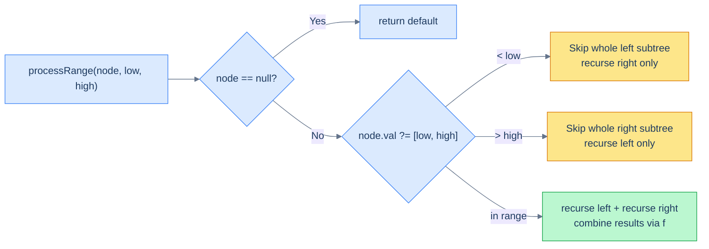
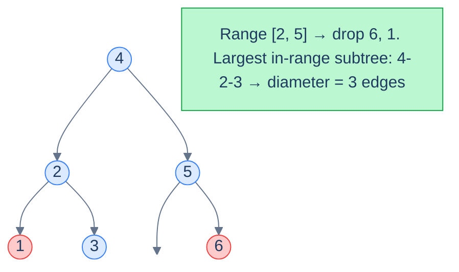

# 12. Pattern: Range Postorder

## The Hook

The previous two patterns let the BST silently sort the values for you, then walked the *whole* tree to compute things over the sorted sequence. They run in O(n) and visit every node — which is fine when the answer truly depends on every node, but **wasteful** the moment the question only cares about a *range*.

"Sum every node whose value is between 5 and 12." "Find the deepest path through nodes valued in [200, 500]." "Trim away everything outside [a, b] and return the resulting tree." If you walk every node you're doing too much work — *and the BST property tells you which subtrees you can skip entirely*. A node with value `v < low` puts its **whole left subtree** out of range. A node with `v > high` puts its **whole right subtree** out of range. We can prune.

This is the **Range Postorder** pattern: a postorder walk (left → right → process) augmented with two pruning rules from the BST property. It runs in O(out-of-range subtrees pruned + nodes touched) — usually much faster than O(n) — and it's the canonical pattern for any *range-bounded BST problem*: range sum, range diameter, range leaf count, range trim.

---

## Table of Contents

1. [Understanding the range postorder pattern](#understanding-the-range-postorder-pattern)
2. [Identifying the range postorder pattern](#identifying-the-range-postorder-pattern)
3. [Range summation](#range-summation)
4. [Range diameter](#range-diameter)
5. [Range leaves](#range-leaves)
6. [Range exclusive trim](#range-exclusive-trim)

***

# Understanding the range postorder pattern

The pattern combines two ideas you already know:

1. **Postorder traversal** (left → right → process the node) — used whenever a node's result depends on already-computed results from its subtrees. Sums, heights, diameters, leaf counts all fit this shape.
2. **BST search-style pruning** — a node's value tells us *which* subtree might contain in-range descendants, and discards the other.

Put them together: at every node, **first check the BST pruning rule**; only descend into both subtrees if the node itself is in range; combine subtree results in postorder fashion.



<p align="center"><strong>The decision diamond at every node. Out-of-range nodes prune one subtree entirely; in-range nodes recurse both ways and combine.</strong></p>

The pruning is what makes the pattern fast. If your range is narrow and your tree is balanced, you might touch only **O(log n + k)** nodes (path to range + size of range), not O(n).

## Why "postorder"?

Because the work happens *after* the children's results come back. The recursive calls to `processRange(left)` and `processRange(right)` produce aggregates; the parent combines them into its own aggregate before returning to *its* parent. Sum, max-depth, leaf count — these are all postorder reductions.

## Algorithm

> **processRange(node, low, high):**
>
> - **Step 1:** If `node` is `null`, return the default value.
> - **Step 2:** If `node.val < low`, return `processRange(node.right, low, high)` — entire left subtree is out of range.
> - **Step 3:** If `node.val > high`, return `processRange(node.left, low, high)` — entire right subtree is out of range.
> - **Step 4:** Else (`low ≤ node.val ≤ high`):
>   - `left = processRange(node.left, low, high)`
>   - `right = processRange(node.right, low, high)`
>   - Process this node (possibly mutating it) using `left` and `right`.
>   - Return `f(left, right, node)`.

## Generic template


```python run
"""
Definition for a binary tree node.
class TreeNode:
    def __init__(self, val):
        self.val = val
        self.left = None
        self.right = None
"""

from typing import Optional, List

class Solution:
    def process_range(self, node: Optional[TreeNode], low: int, high: int) -> int:

        # Return a default value if this is a null node
        if not node:
            return 0

        if node.val < low:
            # If the current node's value is less than low, discard the left subtree
            # and return the result from the right subtree
            return self.process_range(node.right, low, high)
        elif node.val > high:
            # If the current node's value is greater than high, discard the right subtree
            # and return the result from the left subtree
            return self.process_range(node.left, low, high)

        # Process the node using the values from left and right subtrees

        # If the current node's value is within range
        # find the aggregated values from left and right subtrees
        left = self.process_range(node.left, low, high)
        right = self.process_range(node.right, low, high)

        # Process the node using the aggregates from the left and right subtrees
        # ... Your code goes here
        # ...

        # Return the aggregated value of:
        # 1. aggregate from the left subtree
        # 2. aggregate from the right subtree
        # 3. the current node's value
        return f(left, right, node.val)
```

```java run
import java.util.*;

/**
 * Definition for a binary tree node.
 * class TreeNode {
 *      int val;
 *      TreeNode left;
 *      TreeNode right;
 *      TreeNode() {}
 *      TreeNode(int val) { this.val = val; }
 * }
 */

public class Solution {

    public int processRange(TreeNode node, int low, int high) {

        // Return a default value if this is a null node
        if (node == null) {
            return 0;
        }

        if (node.val < low) {
            // If the current node's value is less than low, discard the left subtree
            // and return the result from the right subtree
            return processRange(node.right, low, high);
        } else if (node.val > high) {
            // If the current node's value is greater than high, discard the right subtree
            // and return the result from the left subtree
            return processRange(node.left, low, high);
        }

        // Process the node using the values from left and right subtrees

        // If the current node's value is within range
        // find the aggregated values from left and right subtrees
        int left = processRange(node.left, low, high);
        int right = processRange(node.right, low, high);

        // Process the node using the aggregates from the left and right subtrees
        // ... Your code goes here
        // ...

        // Return the aggregated value of:
        // 1. aggregate from the left subtree
        // 2. aggregate from the right subtree
        // 3. the current node's value
        return f(left, right, node.val);
    }
}
```


## Complexity

| Aspect | Time | Space |
|---|---|---|
| Worst case (range = whole tree) | O(n) | O(h) |
| Typical case (narrow range) | O(h + k) | O(h) |

`k` is the number of in-range nodes. The worst case occurs when every node is in range (no pruning happens, full traversal). The typical case happens when the range covers a small fraction of the tree — pruning slashes the work to "path to range + range size".

***

# Identifying the range postorder pattern

Look for these signals:

- The problem mentions a **range `[low, high]`** of values.
- The result is some **aggregate** (sum, count, height/diameter, structural transformation) over nodes inside that range.
- A node's contribution depends on its in-range descendants — i.e. the recursion is naturally postorder.
- The problem says (or strongly implies) that **out-of-range nodes have only out-of-range descendants on one side** — exactly what the BST property guarantees.

If your sketched recursion looks like *"compute something at this node from results in its subtrees, but only consider in-range nodes"*, range postorder fits.

***

# Range summation

## Problem Statement

Given the **root** of a BST and a range `[low, high]`, update each in-range node's value by adding the values of all its descendants that are also in range. Return nothing — the tree is mutated in place.

> Guarantee: a node *outside* the range never has any in-range descendants on either side. (This follows from BST structure, but the problem states it explicitly so the pruning is safe.)

### Example 1

> - **Input:** `root = [4, 2, 5, 1, 3, null, 6]`, `low = 2`, `high = 5`
> - **Output:** `[14, 5, 5, 1, 3, null, 6]`

### Example 2

> - **Input:** `root = [5, 1, 8, null, null, 6, 9]`, `low = 6`, `high = 9`
> - **Output:** `[5, 1, 23, null, null, 6, 9]`

<details>
<summary><h2>The Strategy</h2></summary>


Every in-range node accumulates `leftSum + rightSum + originalVal` and writes that back into `node.val`. The recursion returns the same total to its parent so parents can do the same.

</details>
<details>
<summary><h2>The Solution</h2></summary>


```python run
from typing import Optional


class TreeNode:
    def __init__(self, val=0, left=None, right=None):
        self.val = val
        self.left = left
        self.right = right


def from_level_order(values):
    """Build tree from list like [1, 2, 3, None, 4]. None means missing child."""
    if not values:
        return None
    root = TreeNode(values[0])
    queue = [root]
    i = 1
    while queue and i < len(values):
        node = queue.pop(0)
        if i < len(values) and values[i] is not None:
            node.left = TreeNode(values[i])
            queue.append(node.left)
        i += 1
        if i < len(values) and values[i] is not None:
            node.right = TreeNode(values[i])
            queue.append(node.right)
        i += 1
    return root


def level_order_vals(root):
    if not root:
        return []
    result, queue = [], [root]
    while queue:
        node = queue.pop(0)
        if node:
            result.append(node.val)
            queue.append(node.left)
            queue.append(node.right)
        else:
            result.append(None)
    while result and result[-1] is None:
        result.pop()
    return result


class Solution:
    def range_summation_helper(
        self, root: Optional[TreeNode], low: int, high: int
    ) -> int:

        # Base Case : if root is null return 0
        if root is None:
            return 0

        # If the node's value is less than the lower bound,
        # discard the left subtree and move to the right subtree
        if root.val < low:
            return self.range_summation_helper(root.right, low, high)

        # If the node's value is greater than the upper bound,
        # discard the right subtree and move to the left subtree
        if root.val > high:
            return self.range_summation_helper(root.left, low, high)

        # If the node's value is within the range [low, high],
        # recursively compute the sum of valid left and right subtrees
        left_sum = self.range_summation_helper(root.left, low, high)
        right_sum = self.range_summation_helper(root.right, low, high)

        # Add sum of in-range descendants to the current node's value
        root.val += left_sum + right_sum

        # Return the updated value of the current node
        # (which now includes valid descendants)
        return root.val

    def range_summation(
        self, root: Optional[TreeNode], low: int, high: int
    ) -> None:
        self.range_summation_helper(root, low, high)


# Example 1: [4, 2, 5, 1, 3, null, 6], low=2, high=5 → [14, 5, 5, 1, 3, null, 6]
t1 = from_level_order([4, 2, 5, 1, 3, None, 6])
Solution().range_summation(t1, 2, 5)
print(level_order_vals(t1))   # [14, 5, 5, 1, 3, 6]

# Example 2: [5, 1, 8, null, null, 6, 9], low=6, high=9 → [5, 1, 23, null, null, 6, 9]
t2 = from_level_order([5, 1, 8, None, None, 6, 9])
Solution().range_summation(t2, 6, 9)
print(level_order_vals(t2))   # [5, 1, 23, 6, 9]

# Edge cases
Solution().range_summation(None, 1, 5)            # no-op

# Single node within range
t3 = from_level_order([5])
Solution().range_summation(t3, 1, 10)
print(t3.val)                 # 5  (leaf node, no descendants)

# Range excludes all nodes
t4 = from_level_order([4, 2, 5, 1, 3, None, 6])
Solution().range_summation(t4, 7, 10)
print(level_order_vals(t4))   # [4, 2, 5, 1, 3, 6]  (unchanged)

# Range covers all nodes
t5 = from_level_order([2, 1, 3])
Solution().range_summation(t5, 1, 3)
print(level_order_vals(t5))   # [5, 1, 3]  (root updated to 2+1+3=6? actually 2+(1)+(3)=6 but note postorder: left=1, right=3 returned; root.val += 1+3 → 6; returns 6)
```

```java run
import java.util.*;

public class Main {
    static class TreeNode {
        int val;
        TreeNode left;
        TreeNode right;
        TreeNode() {}
        TreeNode(int val) { this.val = val; }
    }

    static TreeNode fromLevelOrder(Integer... values) {
        if (values.length == 0 || values[0] == null) return null;
        TreeNode root = new TreeNode(values[0]);
        java.util.Deque<TreeNode> queue = new java.util.ArrayDeque<>();
        queue.add(root);
        int i = 1;
        while (!queue.isEmpty() && i < values.length) {
            TreeNode node = queue.poll();
            if (i < values.length && values[i] != null) {
                node.left = new TreeNode(values[i]);
                queue.add(node.left);
            }
            i++;
            if (i < values.length && values[i] != null) {
                node.right = new TreeNode(values[i]);
                queue.add(node.right);
            }
            i++;
        }
        return root;
    }

    static List<Integer> levelOrderVals(TreeNode root) {
        if (root == null) return List.of();
        List<Integer> result = new ArrayList<>();
        java.util.Deque<TreeNode> q = new java.util.ArrayDeque<>();
        q.add(root);
        while (!q.isEmpty()) {
            TreeNode node = q.poll();
            result.add(node.val);
            if (node.left != null) q.add(node.left);
            if (node.right != null) q.add(node.right);
        }
        return result;
    }

    static class Solution {
        private int rangeSummationHelper(TreeNode root, int low, int high) {

            // Base Case : if root is null return 0
            if (root == null) {
                return 0;
            }

            // If the node's value is less than the lower bound,
            // discard the left subtree and move to the right subtree
            if (root.val < low) {
                return rangeSummationHelper(root.right, low, high);
            }

            // If the node's value is greater than the upper bound,
            // discard the right subtree and move to the left subtree
            if (root.val > high) {
                return rangeSummationHelper(root.left, low, high);
            }

            // If the node's value is within the range [low, high],
            // recursively compute the sum of valid left and right subtrees
            int leftSum = rangeSummationHelper(root.left, low, high);
            int rightSum = rangeSummationHelper(root.right, low, high);

            // Add sum of in-range descendants to the current node's value
            root.val += leftSum + rightSum;

            // Return the updated value of the current node
            // (which now includes valid descendants)
            return root.val;
        }

        public void rangeSummation(TreeNode root, int low, int high) {
            rangeSummationHelper(root, low, high);
        }
    }

    public static void main(String[] args) {
        // Example 1
        TreeNode t1 = fromLevelOrder(4, 2, 5, 1, 3, null, 6);
        new Solution().rangeSummation(t1, 2, 5);
        System.out.println(levelOrderVals(t1));   // [14, 5, 5, 1, 3, 6]

        // Example 2
        TreeNode t2 = fromLevelOrder(5, 1, 8, null, null, 6, 9);
        new Solution().rangeSummation(t2, 6, 9);
        System.out.println(levelOrderVals(t2));   // [5, 1, 23, 6, 9]

        // Edge cases
        new Solution().rangeSummation(null, 1, 5);  // no-op

        // Single node within range
        TreeNode t3 = fromLevelOrder(5);
        new Solution().rangeSummation(t3, 1, 10);
        System.out.println(t3.val);               // 5

        // Range excludes all nodes
        TreeNode t4 = fromLevelOrder(4, 2, 5, 1, 3, null, 6);
        new Solution().rangeSummation(t4, 7, 10);
        System.out.println(levelOrderVals(t4));   // [4, 2, 5, 1, 3, 6]

        // Range covers all nodes [2,1,3]
        TreeNode t5 = fromLevelOrder(2, 1, 3);
        new Solution().rangeSummation(t5, 1, 3);
        System.out.println(levelOrderVals(t5));   // [6, 1, 3]
    }
}
```

</details>


***

# Range diameter

## Problem Statement

Given the **root** of a BST and a range `[low, high]`, return the **diameter** of the largest subtree in which every node's value lies in `[low, high]`. The diameter of a tree is the longest path (counted in edges) between any two of its nodes.

### Example 1

> - **Input:** `root = [4, 2, 5, 1, 3, null, 6]`, `low = 2`, `high = 5`
> - **Output:** `3`

### Example 2

> - **Input:** `root = [5, 1, 8, null, null, 6, 9]`, `low = 6`, `high = 9`
> - **Output:** `2`

<details>
<summary><h2>The Strategy</h2></summary>


Standard "diameter of a binary tree" algorithm: at every node, recursively compute the *height* of each subtree, and update a global `diameter` candidate as `leftHeight + rightHeight`. Return `max(leftHeight, rightHeight) + 1` to the parent.

The only addition for this problem: **prune out-of-range nodes** the same way we did for sums. A subtree rooted outside the range contributes height `0` and is invisible to the diameter calculation.



<p align="center"><strong>Range <code>[2, 5]</code> excludes <code>1</code> and <code>6</code>. The longest path through in-range nodes is <code>3 → 2 → 4 → 5</code>, diameter <code>3</code>.</strong></p>

</details>
<details>
<summary><h2>The Solution</h2></summary>


```python run
from typing import Optional


class TreeNode:
    def __init__(self, val=0, left=None, right=None):
        self.val = val
        self.left = left
        self.right = right


def from_level_order(values):
    """Build tree from list like [1, 2, 3, None, 4]. None means missing child."""
    if not values:
        return None
    root = TreeNode(values[0])
    queue = [root]
    i = 1
    while queue and i < len(values):
        node = queue.pop(0)
        if i < len(values) and values[i] is not None:
            node.left = TreeNode(values[i])
            queue.append(node.left)
        i += 1
        if i < len(values) and values[i] is not None:
            node.right = TreeNode(values[i])
            queue.append(node.right)
        i += 1
    return root


class Solution:
    def __init__(self):

        # Global variable to calculate the diameter of the tree
        self.diameter: int = 0

    def range_diameter_helper(
        self, root: Optional[TreeNode], low: int, high: int
    ) -> int:

        # Base Case : if root is null return null
        if root is None:
            return 0

        # If the node's value is less than the lower bound,
        # discard the left subtree and move to the right subtree
        if root.val < low:
            return self.range_diameter_helper(root.right, low, high)

        # If the node's value is greater than the upper bound,
        # discard the right subtree and move to the left subtree
        if root.val > high:
            return self.range_diameter_helper(root.left, low, high)

        # Calculate the height of the left and right subtrees
        # recursively
        left_height: int = self.range_diameter_helper(
            root.left, low, high
        )
        right_height: int = self.range_diameter_helper(
            root.right, low, high
        )

        # Update the diameter if the sum of the left and right subtree
        # heights is greater
        self.diameter = max(self.diameter, left_height + right_height)

        # Return the height of the current subtree
        # (maximum height of left or right subtree + 1)
        return max(left_height, right_height) + 1

    def range_diameter(
        self, root: Optional[TreeNode], low: int, high: int
    ) -> int:

        # Call the helper function to calculate the height of the tree
        # in the range [low, high] and update the diameter
        self.range_diameter_helper(root, low, high)

        return self.diameter


# Example 1: [4, 2, 5, 1, 3, null, 6], low=2, high=5 → 3
print(Solution().range_diameter(
    from_level_order([4, 2, 5, 1, 3, None, 6]), 2, 5))   # 3

# Example 2: [5, 1, 8, null, null, 6, 9], low=6, high=9 → 2
print(Solution().range_diameter(
    from_level_order([5, 1, 8, None, None, 6, 9]), 6, 9))  # 2

# Edge cases
print(Solution().range_diameter(None, 1, 5))              # 0  (empty tree)

# Single node in range
print(Solution().range_diameter(from_level_order([5]), 1, 10))  # 0

# Range excludes all nodes
print(Solution().range_diameter(
    from_level_order([4, 2, 5, 1, 3, None, 6]), 7, 10))  # 0

# Balanced BST, full range
print(Solution().range_diameter(
    from_level_order([4, 2, 6, 1, 3, 5, 7]), 1, 7))      # 4
```

```java run
import java.util.*;

public class Main {
    static class TreeNode {
        int val;
        TreeNode left;
        TreeNode right;
        TreeNode() {}
        TreeNode(int val) { this.val = val; }
    }

    static TreeNode fromLevelOrder(Integer... values) {
        if (values.length == 0 || values[0] == null) return null;
        TreeNode root = new TreeNode(values[0]);
        java.util.Deque<TreeNode> queue = new java.util.ArrayDeque<>();
        queue.add(root);
        int i = 1;
        while (!queue.isEmpty() && i < values.length) {
            TreeNode node = queue.poll();
            if (i < values.length && values[i] != null) {
                node.left = new TreeNode(values[i]);
                queue.add(node.left);
            }
            i++;
            if (i < values.length && values[i] != null) {
                node.right = new TreeNode(values[i]);
                queue.add(node.right);
            }
            i++;
        }
        return root;
    }

    static class Solution {

        // Global variable to calculate the diameter of the tree
        private int diameter = 0;

        private int rangeDiameterHelper(TreeNode root, int low, int high) {

            // Base Case : if root is null return null
            if (root == null) {
                return 0;
            }

            // If the node's value is less than the lower bound,
            // discard the left subtree and move to the right subtree
            if (root.val < low) {
                return rangeDiameterHelper(root.right, low, high);
            }

            // If the node's value is greater than the upper bound,
            // discard the right subtree and move to the left subtree
            if (root.val > high) {
                return rangeDiameterHelper(root.left, low, high);
            }

            // Calculate the height of the left and right subtrees
            // recursively
            int leftHeight = rangeDiameterHelper(root.left, low, high);
            int rightHeight = rangeDiameterHelper(root.right, low, high);

            // Update the diameter if the sum of the left and right subtree
            // heights is greater
            diameter = Math.max(diameter, leftHeight + rightHeight);

            // Return the height of the current subtree
            // (maximum height of left or right subtree + 1)
            return Math.max(leftHeight, rightHeight) + 1;
        }

        public int rangeDiameter(TreeNode root, int low, int high) {

            // Call the helper function to calculate the height of the tree
            // in the range [low, high] and update the diameter
            rangeDiameterHelper(root, low, high);

            return diameter;
        }
    }

    public static void main(String[] args) {
        // Example 1
        System.out.println(new Solution().rangeDiameter(
            fromLevelOrder(4, 2, 5, 1, 3, null, 6), 2, 5));   // 3

        // Example 2
        System.out.println(new Solution().rangeDiameter(
            fromLevelOrder(5, 1, 8, null, null, 6, 9), 6, 9));  // 2

        // Edge cases
        System.out.println(new Solution().rangeDiameter(null, 1, 5));   // 0

        // Single node in range
        System.out.println(new Solution().rangeDiameter(
            fromLevelOrder(5), 1, 10));                         // 0

        // Range excludes all nodes
        System.out.println(new Solution().rangeDiameter(
            fromLevelOrder(4, 2, 5, 1, 3, null, 6), 7, 10));   // 0

        // Balanced BST, full range
        System.out.println(new Solution().rangeDiameter(
            fromLevelOrder(4, 2, 6, 1, 3, 5, 7), 1, 7));       // 4
    }
}
```

</details>


***

# Range leaves

## Problem Statement

Given the **root** of a BST and a range `[low, high]`, replace the value of each *non-leaf* in-range node with the count of in-range leaves in its subtree.

> A *leaf* here is a node whose subtree contains no in-range descendants — typically an actual leaf in the original tree.

### Example 1

> - **Input:** `root = [4, 2, 5, 1, 3, null, 6]`, `low = 2`, `high = 5`
> - **Output:** `[1, 1, 0, 1, 3, null, 6]`

### Example 2

> - **Input:** `root = [5, 1, 8, null, null, 6, 9]`, `low = 6`, `high = 9`
> - **Output:** `[5, 1, 2, null, null, 6, 9]`

<details>
<summary><h2>The Strategy</h2></summary>


Same skeleton as range summation, but instead of returning the sum of in-range descendants, return the *count of in-range leaves*. A leaf returns `1`; an internal in-range node returns `leftLeaves + rightLeaves` and overwrites its own value with that count.

</details>
<details>
<summary><h2>The Solution</h2></summary>


```python run
from typing import Optional


class TreeNode:
    def __init__(self, val=0, left=None, right=None):
        self.val = val
        self.left = left
        self.right = right


def from_level_order(values):
    """Build tree from list like [1, 2, 3, None, 4]. None means missing child."""
    if not values:
        return None
    root = TreeNode(values[0])
    queue = [root]
    i = 1
    while queue and i < len(values):
        node = queue.pop(0)
        if i < len(values) and values[i] is not None:
            node.left = TreeNode(values[i])
            queue.append(node.left)
        i += 1
        if i < len(values) and values[i] is not None:
            node.right = TreeNode(values[i])
            queue.append(node.right)
        i += 1
    return root


def level_order_vals(root):
    if not root:
        return []
    result, queue = [], [root]
    while queue:
        node = queue.pop(0)
        if node:
            result.append(node.val)
            queue.append(node.left)
            queue.append(node.right)
        else:
            result.append(None)
    while result and result[-1] is None:
        result.pop()
    return result


class Solution:
    def range_leaves_helper(
        self, root: Optional[TreeNode], low: int, high: int
    ) -> int:

        # Base Case : if root is null return 0
        if root is None:
            return 0

        # If the node's value is less than the lower bound,
        # discard the left subtree and move to the right subtree
        if root.val < low:
            return self.range_leaves_helper(root.right, low, high)

        # If the node's value is greater than the upper bound,
        # discard the right subtree and move to the left subtree
        if root.val > high:
            return self.range_leaves_helper(root.left, low, high)

        # If it's a leaf node, return 1
        if root.left is None and root.right is None:

            # Return 1 since it's a leaf node
            return 1

        # If the node's value is within the range [low, high],
        # recursively trim its left and right subtrees
        left_leaves = self.range_leaves_helper(root.left, low, high)
        right_leaves = self.range_leaves_helper(root.right, low, high)

        # Update the current node's value with the count of leaves in
        # its subtrees
        root.val = left_leaves + right_leaves

        # Return the total count of leaves in the current subtree
        return root.val

    def range_leaves(
        self, root: Optional[TreeNode], low: int, high: int
    ) -> None:

        # Call the helper function to calculate the count of leaves
        # in the range [low, high] and update the node values
        self.range_leaves_helper(root, low, high)


# Example 1: [4, 2, 5, 1, 3, null, 6], low=2, high=5 → [1, 1, 0, 1, 3, null, 6]
t1 = from_level_order([4, 2, 5, 1, 3, None, 6])
Solution().range_leaves(t1, 2, 5)
print(level_order_vals(t1))   # [1, 1, 0, 1, 3, 6]

# Example 2: [5, 1, 8, null, null, 6, 9], low=6, high=9 → [5, 1, 2, null, null, 6, 9]
t2 = from_level_order([5, 1, 8, None, None, 6, 9])
Solution().range_leaves(t2, 6, 9)
print(level_order_vals(t2))   # [5, 1, 2, 6, 9]

# Edge cases
Solution().range_leaves(None, 1, 5)   # no-op

# Single node in range (leaf)
t3 = from_level_order([5])
Solution().range_leaves(t3, 1, 10)
print(t3.val)                 # 5  (leaf unchanged)

# Range excludes all nodes
t4 = from_level_order([4, 2, 5, 1, 3, None, 6])
Solution().range_leaves(t4, 7, 10)
print(level_order_vals(t4))   # [4, 2, 5, 1, 3, 6]  (unchanged)
```

```java run
import java.util.*;

public class Main {
    static class TreeNode {
        int val;
        TreeNode left;
        TreeNode right;
        TreeNode() {}
        TreeNode(int val) { this.val = val; }
    }

    static TreeNode fromLevelOrder(Integer... values) {
        if (values.length == 0 || values[0] == null) return null;
        TreeNode root = new TreeNode(values[0]);
        java.util.Deque<TreeNode> queue = new java.util.ArrayDeque<>();
        queue.add(root);
        int i = 1;
        while (!queue.isEmpty() && i < values.length) {
            TreeNode node = queue.poll();
            if (i < values.length && values[i] != null) {
                node.left = new TreeNode(values[i]);
                queue.add(node.left);
            }
            i++;
            if (i < values.length && values[i] != null) {
                node.right = new TreeNode(values[i]);
                queue.add(node.right);
            }
            i++;
        }
        return root;
    }

    static List<Integer> levelOrderVals(TreeNode root) {
        if (root == null) return List.of();
        List<Integer> result = new ArrayList<>();
        java.util.Deque<TreeNode> q = new java.util.ArrayDeque<>();
        q.add(root);
        while (!q.isEmpty()) {
            TreeNode node = q.poll();
            result.add(node.val);
            if (node.left != null) q.add(node.left);
            if (node.right != null) q.add(node.right);
        }
        return result;
    }

    static class Solution {
        private int rangeLeavesHelper(TreeNode root, int low, int high) {

            // Base Case : if root is null return 0
            if (root == null) {
                return 0;
            }

            // If the node's value is less than the lower bound,
            // discard the left subtree and move to the right subtree
            if (root.val < low) {
                return rangeLeavesHelper(root.right, low, high);
            }

            // If the node's value is greater than the upper bound,
            // discard the right subtree and move to the left subtree
            if (root.val > high) {
                return rangeLeavesHelper(root.left, low, high);
            }

            // If it's a leaf node, return 1
            if (root.left == null && root.right == null) {

                // Return 1 since it's a leaf node
                return 1;
            }

            // If the node's value is within the range [low, high],
            // recursively trim its left and right subtrees
            int leftLeaves = rangeLeavesHelper(root.left, low, high);
            int rightLeaves = rangeLeavesHelper(root.right, low, high);

            // Update the current node's value with the count of leaves in
            // its subtrees
            root.val = leftLeaves + rightLeaves;

            // Return the total count of leaves in the current subtree
            return root.val;
        }

        public void rangeLeaves(TreeNode root, int low, int high) {

            // Call the helper function to calculate the count of leaves
            // in the range [low, high] and update the node values
            rangeLeavesHelper(root, low, high);
        }
    }

    public static void main(String[] args) {
        // Example 1
        TreeNode t1 = fromLevelOrder(4, 2, 5, 1, 3, null, 6);
        new Solution().rangeLeaves(t1, 2, 5);
        System.out.println(levelOrderVals(t1));   // [1, 1, 0, 1, 3, 6]

        // Example 2
        TreeNode t2 = fromLevelOrder(5, 1, 8, null, null, 6, 9);
        new Solution().rangeLeaves(t2, 6, 9);
        System.out.println(levelOrderVals(t2));   // [5, 1, 2, 6, 9]

        // Edge cases
        new Solution().rangeLeaves(null, 1, 5);    // no-op

        // Single node in range (leaf)
        TreeNode t3 = fromLevelOrder(5);
        new Solution().rangeLeaves(t3, 1, 10);
        System.out.println(t3.val);               // 5

        // Range excludes all nodes
        TreeNode t4 = fromLevelOrder(4, 2, 5, 1, 3, null, 6);
        new Solution().rangeLeaves(t4, 7, 10);
        System.out.println(levelOrderVals(t4));   // [4, 2, 5, 1, 3, 6]
    }
}
```

</details>


***

# Range exclusive trim

## Problem Statement

Given the **root** of a BST and two values `low` and `high`, return a new BST that contains *only* the nodes whose values lie in `[low, high]`. The relative structure must be preserved — if `A` was a descendant of `B` in the original and both survive the trim, `A` must remain a descendant of `B` in the result.

### Example 1

> - **Input:** `root = [4, 2, 5, 1, 3, null, 6]`, `low = 2`, `high = 5`
> - **Output:** `[4, 2, 5, null, 3]`

### Example 2

> - **Input:** `root = [5, 1, 8, null, null, 6, 9]`, `low = 6`, `high = 9`
> - **Output:** `[8, 6, 9]`

<details>
<summary><h2>The Strategy</h2></summary>


The same pruning rules drive a *structural rewrite*:

- If `node.val < low`, the entire left subtree is out of range; we **don't recurse left** at all. Return the trim of the right subtree as our replacement.
- If `node.val > high`, mirror — return the trim of the left subtree.
- Otherwise (`node.val` in range), the node survives. Trim both children recursively and re-attach.

The `return` value is the new root of *this* subtree after trimming, which the caller wires back into its own children pointers — exactly the same shape as the recursive insertion idiom we used in lesson 5.

</details>
<details>
<summary><h2>The Solution</h2></summary>


```python run
from typing import Optional
from collections import deque

class TreeNode:
    def __init__(self, val=0, left=None, right=None):
        self.val = val
        self.left = left
        self.right = right


def from_level_order(values):
    """Build tree from list like [1, 2, 3, None, 4]. None means missing child."""
    if not values:
        return None
    root = TreeNode(values[0])
    queue = [root]
    i = 1
    while queue and i < len(values):
        node = queue.pop(0)
        if i < len(values) and values[i] is not None:
            node.left = TreeNode(values[i])
            queue.append(node.left)
        i += 1
        if i < len(values) and values[i] is not None:
            node.right = TreeNode(values[i])
            queue.append(node.right)
        i += 1
    return root


def to_level_order(root):
    if not root:
        return []
    result, queue = [], deque([root])
    while queue:
        node = queue.popleft()
        result.append(node.val)
        if node.left:
            queue.append(node.left)
        if node.right:
            queue.append(node.right)
    return result


class Solution:
    def range_exclusive_trim(
        self, root: Optional[TreeNode], low: int, high: int
    ) -> Optional[TreeNode]:

        # Base Case: If root is null, return null
        if root is None:
            return None

        # If the node's value is less than the lower bound,
        # discard the left subtree and trim the right subtree
        if root.val < low:
            return self.range_exclusive_trim(root.right, low, high)

        # If the node's value is greater than the upper bound,
        # discard the right subtree and trim the left subtree
        if root.val > high:
            return self.range_exclusive_trim(root.left, low, high)

        # If the node's value is within the range [low, high],
        # recursively trim its left and right subtrees
        root.left = self.range_exclusive_trim(root.left, low, high)
        root.right = self.range_exclusive_trim(root.right, low, high)

        # Return the trimmed root
        return root


# Examples from the problem statement
t1 = from_level_order([4, 2, 5, 1, 3, None, 6])
print(to_level_order(Solution().range_exclusive_trim(t1, 2, 5)))  # [4, 2, 5, 3]

t2 = from_level_order([5, 1, 8, None, None, 6, 9])
print(to_level_order(Solution().range_exclusive_trim(t2, 6, 9)))  # [8, 6, 9]

# Edge cases
print(Solution().range_exclusive_trim(None, 1, 5))               # None

t3 = from_level_order([5])
print(to_level_order(Solution().range_exclusive_trim(t3, 1, 5))) # [5]

t4 = from_level_order([5])
print(Solution().range_exclusive_trim(t4, 6, 10))                # None — root out of range

t5 = from_level_order([4, 2, 6, 1, 3, 5, 7])
print(to_level_order(Solution().range_exclusive_trim(t5, 3, 5))) # [4, 3, 5]

t6 = from_level_order([4, 2, 6, 1, 3, 5, 7])
print(to_level_order(Solution().range_exclusive_trim(t6, 1, 7))) # [4, 2, 6, 1, 3, 5, 7]
```

```java run
import java.util.*;

public class Main {
    static class TreeNode {
        int val;
        TreeNode left;
        TreeNode right;
        TreeNode() {}
        TreeNode(int val) { this.val = val; }
    }

    static TreeNode fromLevelOrder(Integer... values) {
        if (values.length == 0 || values[0] == null) return null;
        TreeNode root = new TreeNode(values[0]);
        java.util.Deque<TreeNode> queue = new java.util.ArrayDeque<>();
        queue.add(root);
        int i = 1;
        while (!queue.isEmpty() && i < values.length) {
            TreeNode node = queue.poll();
            if (i < values.length && values[i] != null) {
                node.left = new TreeNode(values[i]);
                queue.add(node.left);
            }
            i++;
            if (i < values.length && values[i] != null) {
                node.right = new TreeNode(values[i]);
                queue.add(node.right);
            }
            i++;
        }
        return root;
    }

    static List<Integer> toLevelOrder(TreeNode root) {
        List<Integer> result = new ArrayList<>();
        if (root == null) return result;
        java.util.Deque<TreeNode> queue = new java.util.ArrayDeque<>();
        queue.add(root);
        while (!queue.isEmpty()) {
            TreeNode node = queue.poll();
            result.add(node.val);
            if (node.left != null) queue.add(node.left);
            if (node.right != null) queue.add(node.right);
        }
        return result;
    }

    static class Solution {
        TreeNode rangeExclusiveTrim(
            TreeNode root,
            int low,
            int high
        ) {

            // Base Case: If root is null, return null
            if (root == null) {
                return null;
            }

            // If the node's value is less than the lower bound,
            // discard the left subtree and trim the right subtree
            if (root.val < low) {
                return rangeExclusiveTrim(root.right, low, high);
            }

            // If the node's value is greater than the upper bound,
            // discard the right subtree and trim the left subtree
            if (root.val > high) {
                return rangeExclusiveTrim(root.left, low, high);
            }

            // If the node's value is within the range [low, high],
            // recursively trim its left and right subtrees
            root.left = rangeExclusiveTrim(root.left, low, high);
            root.right = rangeExclusiveTrim(root.right, low, high);

            // Return the trimmed root
            return root;
        }
    }

    public static void main(String[] args) {
        // Examples from the problem statement
        TreeNode t1 = fromLevelOrder(4, 2, 5, 1, 3, null, 6);
        System.out.println(toLevelOrder(new Solution().rangeExclusiveTrim(t1, 2, 5)));  // [4, 2, 5, 3]

        TreeNode t2 = fromLevelOrder(5, 1, 8, null, null, 6, 9);
        System.out.println(toLevelOrder(new Solution().rangeExclusiveTrim(t2, 6, 9)));  // [8, 6, 9]

        // Edge cases
        System.out.println(new Solution().rangeExclusiveTrim(null, 1, 5));              // null

        TreeNode t3 = fromLevelOrder(5);
        System.out.println(toLevelOrder(new Solution().rangeExclusiveTrim(t3, 1, 5))); // [5]

        TreeNode t4 = fromLevelOrder(5);
        System.out.println(new Solution().rangeExclusiveTrim(t4, 6, 10));              // null — root out of range

        TreeNode t5 = fromLevelOrder(4, 2, 6, 1, 3, 5, 7);
        System.out.println(toLevelOrder(new Solution().rangeExclusiveTrim(t5, 3, 5))); // [4, 3, 5]

        TreeNode t6 = fromLevelOrder(4, 2, 6, 1, 3, 5, 7);
        System.out.println(toLevelOrder(new Solution().rangeExclusiveTrim(t6, 1, 7))); // [4, 2, 6, 1, 3, 5, 7]
    }
}
```


<details>
<summary><strong>Trace — root = [4, 2, 5, 1, 3, null, 6], range = [2, 5]</strong></summary>

```
trim(4, [2,5]) │ 4 in range → trim(2), trim(5), keep 4
trim(2, [2,5]) │ 2 in range → trim(1), trim(3), keep 2
trim(1, [2,5]) │ 1 < 2  → drop 1 (and its subtree); return trim(null) = null
trim(3, [2,5]) │ 3 in range → trim(null), trim(null) → keep 3 as leaf
trim(5, [2,5]) │ 5 in range → trim(null), trim(6), keep 5
trim(6, [2,5]) │ 6 > 5  → drop 6; return trim(null) = null
After all trims: [4, 2, 5, null, 3, null, null] ≡ [4, 2, 5, null, 3] ✓
```

</details>

</details>
<details>
<summary><h2>Final Takeaway</h2></summary>


Range Postorder = postorder + BST pruning. Whenever a problem asks for an aggregate (sum, count, height, structural rewrite) over the nodes of a BST whose values fall in a range, this is the right tool. The pruning rules collapse out-of-range subtrees in O(1) — not by walking them — and the postorder structure cleanly reduces children's results into a parent's.

Three patterns to keep:

1. **The "two prunes + recurse" structure** is universal for range-bounded BST problems. Once you internalise it, range sum / range count / range diameter / range trim all collapse to a 4-line skeleton with one problem-specific reduction.
2. **Postorder is for "value depends on what's below me"** — diameter, sum, count of leaves, validity checks like "subtree is BST", segment-tree-style queries. Whenever the parent's answer is computed *from* the children's, you're in postorder territory.
3. **Returning the trimmed subtree to the parent** is the same idiom we used for insertion (lesson 5) and deletion (lesson 6): every recursive call returns a pointer to the (possibly modified) subtree, and the caller wires it into its own pointer field.

The next lesson swaps **one descent** for **two pointers** — running a forward iterator and a reverse iterator simultaneously across the BST's sorted sequence. That single move unlocks the classic "two values that sum to target" family of problems on a tree, in O(n) time and O(h) space.

</details>