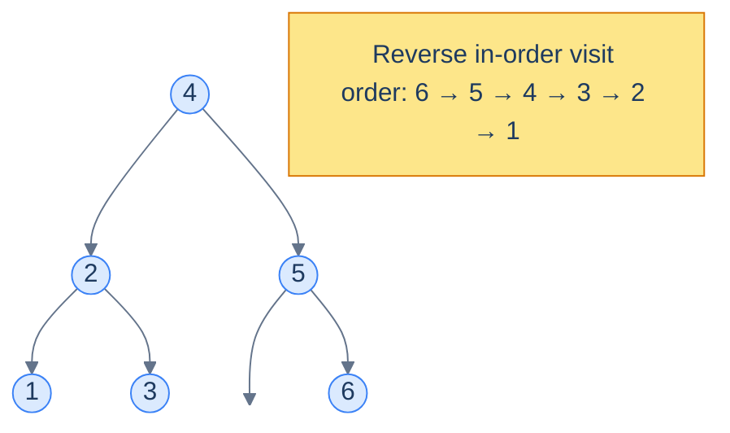
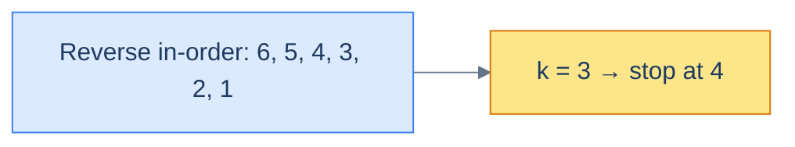

# Understanding the reversed sorted traversal pattern

The **reverse in-order** traversal visits each node in the order *right → node → left*. Because the right subtree of any BST node holds *larger* values, the reverse-in-order walk lists values in **descending sorted order** — the perfect mirror of the in-order walk.

> 🖼 Diagram — Reverse in-order traversal of a BST visits values in descending order. The pattern mirrors lesson 10's sorted traversal.


<p align="center"><strong>Reverse in-order traversal of a BST visits values in descending order. The pattern mirrors lesson 10's sorted traversal.</strong></p>

## The technique

Same structure as the sorted-traversal template, with the recursive calls swapped:

> **Algorithm**
>
> - **Step 1:** Initialise running state in the enclosing scope.
> - **Step 2:** Call `reverseInorder(root)`.
>
> **reverseInorder(node):**
>
> - **Step 1:** If `node` is `null`, return.
> - **Step 2:** `reverseInorder(node.right)` — visit larger values first.
> - **Step 3:** Process the current node — apply `f`; fold into the aggregate via `g`.
> - **Step 4:** `reverseInorder(node.left)`.

## Generic template


```python run
"""
Definition for a binary tree node.
class TreeNode:
    def __init__(self, val):
        self.val = val
        self.left = None
        self.right = None
"""

from typing import Optional, List

class Solution:
    def __init__(self):
        # Class-level variable to hold the aggregate value
        self.aggregate: int = 0

    def callingFunction(self, root: Optional[TreeNode]) -> int:

        # Initialize aggregate with a default value
        self.aggregate = 0

        # Traverse the binary tree in reverse_inorder traversal
        self.reverse_inorder(root)

        # Return the aggregated value
        return self.aggregate

    def reverse_inorder(self, node: Optional[TreeNode]) -> None:

        if not node:
            # Return if this is a null node
            return

        # Traverse the right subtree
        self.reverse_inorder(node.right)

        # Process the current node
        output = f(node.val)
        # Add contribution of current node
        self.aggregate = g(self.aggregate, output)

        # Traverse the left subtree
        self.reverse_inorder(node.left)
```

```java run
import java.util.*;

/**
 * Definition for a binary tree node.
 * class TreeNode {
 *      int val;
 *      TreeNode left;
 *      TreeNode right;
 *      TreeNode() {}
 *      TreeNode(int val) { this.val = val; }
 * }
 */

public class Solution {

    // Declare aggregate as a class-level variable since Java does not support pass-by-reference
    private int aggregate = 0;

    public int callingFunction(TreeNode root) {

        // Initialize aggregate with a default value
        aggregate = 0;

        // Traverse the binary tree in reverseInorder traversal
        reverseInorder(root);

        // Return the aggregated value
        return aggregate;
    }

    private void reverseInorder(TreeNode node) {

        if (node == null) {
            // Return if this is a null node;
            return;
        }

        // Traverse the right subtree
        reverseInorder(node.right);

        // Process the current node
        int output = f(node.val);

        // Add contribution of current node
        aggregate = g(aggregate, output);

        // Traverse the left subtree
        reverseInorder(node.left);
    }
}
```


## Complexity

| Operation | Time | Space |
|---|---|---|
| Reverse in-order walk + O(1) work per node | O(n) | O(h) |

Identical to the sorted-traversal pattern — same number of node visits, same recursion depth, mirrored direction.

# Identifying the reverse sorted traversal pattern

Use this pattern when the problem cares about *the sorted sequence in descending order* — i.e. you need to process larger values first, often because the result for a node depends on values strictly greater than itself.

Tell-tale signals:

- **K-th largest, top-K, percentile-from-top.**
- **Suffix sums / "sum of all values greater than this node"** — typical of problems that decorate every node with information about everything above it.
- **Descending ranks** — each node's rank is `1 + (number of strictly larger nodes already seen)`.
- **Pairwise checks against the *previous-larger* value** (the mirror of "previous-smaller" from lesson 10).

If your mental model is "iterate from biggest to smallest while remembering a running tally", reach for reverse in-order.

## Worked example — k-th largest element

> **Problem:** Given a BST and an integer `k`, return the value of the k-th largest element.

The reverse in-order walk emits nodes in descending order. So the k-th node it visits *is* the k-th largest. We just need a counter and an early-exit:

- Maintain a `count` (number of nodes processed so far) and a `result` slot.
- At each node, recurse right first, increment count, check if `count == k` (record `result`, stop). Otherwise recurse left.

> 🖼 Diagram — For k = 3, the third value emitted by the reverse in-order walk is the answer (here, 4). We can stop as soon as we hit it.


<p align="center"><strong>For k = 3, the third value emitted by the reverse in-order walk is the answer (here, <code>4</code>). We can stop as soon as we hit it.</strong></p>

The "stop early" detail is what makes this O(h + k) rather than O(n) — we don't visit any node smaller than the answer.

<!-- ============================================== -->
<!-- SWEEP 2 — missing sections (placeholders only) -->
<!-- ============================================== -->

<!-- TODO: Why Naive Isn't Enough — missing, needs to be written -->
<!--       Guidance: motivation for why the obvious approach fails -->

<!-- TODO: The Core Idea — missing, needs to be written -->
<!--       Guidance: one paragraph: the central trick -->

<!-- TODO: How the Pointers/Window Move — missing, needs to be written -->
<!--       Guidance: mechanics of the moving parts -->

<!-- TODO: The Generic Algorithm — missing, needs to be written -->
<!--       Guidance: numbered steps, no code -->

<!-- TODO: Generic Implementation — missing, needs to be written -->
<!--       Guidance: Python block + Java block of the skeleton -->

<!-- TODO: Complexity Analysis — missing, needs to be written -->
<!--       Guidance: table -->

<!-- TODO: Variants / Taxonomy — missing, needs to be written -->
<!--       Guidance: enumerate sub-shapes of this pattern -->

<!-- TODO: Recognition Checklist — missing, needs to be written -->
<!--       Guidance: 4-question diagnostic — the source of the Problem-section Diagnostic Questions -->

<!-- TODO: Canonical Example — missing, needs to be written -->
<!--       Guidance: fully worked example: brute force → optimised → template fit -->

<!-- TODO: Problems in This Category — missing, needs to be written -->
<!--       Guidance: table with links to the 02-problems/ files -->
