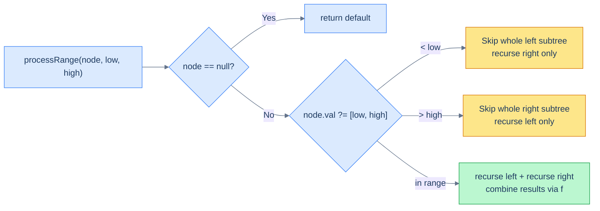

# Understanding the range postorder pattern

The pattern combines two ideas you already know:

1. **Postorder traversal** (left → right → process the node) — used whenever a node's result depends on already-computed results from its subtrees. Sums, heights, diameters, leaf counts all fit this shape.
2. **BST search-style pruning** — a node's value tells us *which* subtree might contain in-range descendants, and discards the other.

Put them together: at every node, **first check the BST pruning rule**; only descend into both subtrees if the node itself is in range; combine subtree results in postorder fashion.

> 🖼 Diagram — The decision diamond at every node. Out-of-range nodes prune one subtree entirely; in-range nodes recurse both ways and combine.


<p align="center"><strong>The decision diamond at every node. Out-of-range nodes prune one subtree entirely; in-range nodes recurse both ways and combine.</strong></p>

The pruning is what makes the pattern fast. If your range is narrow and your tree is balanced, you might touch only **O(log n + k)** nodes (path to range + size of range), not O(n).

## Why "postorder"?

Because the work happens *after* the children's results come back. The recursive calls to `processRange(left)` and `processRange(right)` produce aggregates; the parent combines them into its own aggregate before returning to *its* parent. Sum, max-depth, leaf count — these are all postorder reductions.

## Algorithm

> **processRange(node, low, high):**
>
> - **Step 1:** If `node` is `null`, return the default value.
> - **Step 2:** If `node.val < low`, return `processRange(node.right, low, high)` — entire left subtree is out of range.
> - **Step 3:** If `node.val > high`, return `processRange(node.left, low, high)` — entire right subtree is out of range.
> - **Step 4:** Else (`low ≤ node.val ≤ high`):
>   - `left = processRange(node.left, low, high)`
>   - `right = processRange(node.right, low, high)`
>   - Process this node (possibly mutating it) using `left` and `right`.
>   - Return `f(left, right, node)`.

## Generic template


```python run
"""
Definition for a binary tree node.
class TreeNode:
    def __init__(self, val):
        self.val = val
        self.left = None
        self.right = None
"""

from typing import Optional, List

class Solution:
    def process_range(self, node: Optional[TreeNode], low: int, high: int) -> int:

        # Return a default value if this is a null node
        if not node:
            return 0

        if node.val < low:
            # If the current node's value is less than low, discard the left subtree
            # and return the result from the right subtree
            return self.process_range(node.right, low, high)
        elif node.val > high:
            # If the current node's value is greater than high, discard the right subtree
            # and return the result from the left subtree
            return self.process_range(node.left, low, high)

        # Process the node using the values from left and right subtrees

        # If the current node's value is within range
        # find the aggregated values from left and right subtrees
        left = self.process_range(node.left, low, high)
        right = self.process_range(node.right, low, high)

        # Process the node using the aggregates from the left and right subtrees
        # ... Your code goes here
        # ...

        # Return the aggregated value of:
        # 1. aggregate from the left subtree
        # 2. aggregate from the right subtree
        # 3. the current node's value
        return f(left, right, node.val)
```

```java run
import java.util.*;

/**
 * Definition for a binary tree node.
 * class TreeNode {
 *      int val;
 *      TreeNode left;
 *      TreeNode right;
 *      TreeNode() {}
 *      TreeNode(int val) { this.val = val; }
 * }
 */

public class Solution {

    public int processRange(TreeNode node, int low, int high) {

        // Return a default value if this is a null node
        if (node == null) {
            return 0;
        }

        if (node.val < low) {
            // If the current node's value is less than low, discard the left subtree
            // and return the result from the right subtree
            return processRange(node.right, low, high);
        } else if (node.val > high) {
            // If the current node's value is greater than high, discard the right subtree
            // and return the result from the left subtree
            return processRange(node.left, low, high);
        }

        // Process the node using the values from left and right subtrees

        // If the current node's value is within range
        // find the aggregated values from left and right subtrees
        int left = processRange(node.left, low, high);
        int right = processRange(node.right, low, high);

        // Process the node using the aggregates from the left and right subtrees
        // ... Your code goes here
        // ...

        // Return the aggregated value of:
        // 1. aggregate from the left subtree
        // 2. aggregate from the right subtree
        // 3. the current node's value
        return f(left, right, node.val);
    }
}
```


## Complexity

| Aspect | Time | Space |
|---|---|---|
| Worst case (range = whole tree) | O(n) | O(h) |
| Typical case (narrow range) | O(h + k) | O(h) |

`k` is the number of in-range nodes. The worst case occurs when every node is in range (no pruning happens, full traversal). The typical case happens when the range covers a small fraction of the tree — pruning slashes the work to "path to range + range size".

# Identifying the range postorder pattern

Look for these signals:

- The problem mentions a **range `[low, high]`** of values.
- The result is some **aggregate** (sum, count, height/diameter, structural transformation) over nodes inside that range.
- A node's contribution depends on its in-range descendants — i.e. the recursion is naturally postorder.
- The problem says (or strongly implies) that **out-of-range nodes have only out-of-range descendants on one side** — exactly what the BST property guarantees.

If your sketched recursion looks like *"compute something at this node from results in its subtrees, but only consider in-range nodes"*, range postorder fits.

<!-- ============================================== -->
<!-- SWEEP 2 — missing sections (placeholders only) -->
<!-- ============================================== -->

<!-- TODO: Why Naive Isn't Enough — missing, needs to be written -->
<!--       Guidance: motivation for why the obvious approach fails -->

<!-- TODO: The Core Idea — missing, needs to be written -->
<!--       Guidance: one paragraph: the central trick -->

<!-- TODO: How the Pointers/Window Move — missing, needs to be written -->
<!--       Guidance: mechanics of the moving parts -->

<!-- TODO: The Generic Algorithm — missing, needs to be written -->
<!--       Guidance: numbered steps, no code -->

<!-- TODO: Generic Implementation — missing, needs to be written -->
<!--       Guidance: Python block + Java block of the skeleton -->

<!-- TODO: Complexity Analysis — missing, needs to be written -->
<!--       Guidance: table -->

<!-- TODO: Variants / Taxonomy — missing, needs to be written -->
<!--       Guidance: enumerate sub-shapes of this pattern -->

<!-- TODO: Recognition Checklist — missing, needs to be written -->
<!--       Guidance: 4-question diagnostic — the source of the Problem-section Diagnostic Questions -->

<!-- TODO: Canonical Example — missing, needs to be written -->
<!--       Guidance: fully worked example: brute force → optimised → template fit -->

<!-- TODO: Problems in This Category — missing, needs to be written -->
<!--       Guidance: table with links to the 02-problems/ files -->
