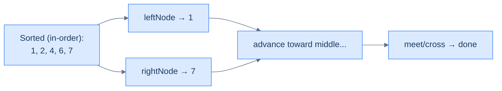
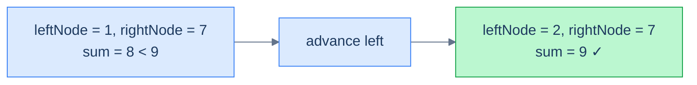

# 13. Pattern: Two Pointer

## The Hook

The previous lesson on iterators gave us *one* useful object: a way to walk a BST in sorted order, on demand, with O(h) memory. Useful — but not yet a superpower.

The superpower shows up the moment you spin up **two** of them. Run a *forward* iterator from the smallest value and a *reverse* iterator from the largest, and let them march toward each other. You're now walking the BST's hidden sorted sequence from **both ends simultaneously** — the same trick that powers two-sum on a sorted array, but **without ever materialising the array**.

Every classic two-pointer problem from the array world transfers directly: pair sum, pairs that satisfy a relation (multiple, GCD, distance), median computation by closing in from both ends, and even *cross-tree* pair sum where the left iterator runs over one BST and the right iterator over a different one. All in **O(n) time** and **O(h) space**, and all on tree-structured data with no array conversion.

This final lesson shows how. Four problems make the pattern click.

---

## Table of Contents

1. [Understanding the two pointer pattern](#understanding-the-two-pointer-pattern)
2. [Identifying the two pointer pattern](#identifying-the-two-pointer-pattern)
3. [Two sum on BST](#two-sum-on-bst)
4. [Multiple tree](#multiple-tree)
5. [Median in BST](#median-in-bst)
6. [BST pair sum](#bst-pair-sum)

***

# Understanding the two pointer pattern

A BST stores values in a structure that *implicitly* sorts them. The forward iterator emits ascending order, the reverse iterator descending. Run them simultaneously, and you have a working pair `(leftNode, rightNode)` that always satisfies `leftNode.val < rightNode.val` until they cross — i.e. you're holding the smallest unseen value and the largest unseen value at the same time.



<p align="center"><strong>Two pointers walking the implicit sorted sequence of a BST. Forward iterator advances from the small end; reverse iterator advances from the large end. They meet in the middle.</strong></p>

## The technique

The same logic as two-pointer on a sorted array — drive a decision at each step using both pointers, and advance whichever one the decision tells you to:

> **Algorithm**
>
> - **Step 1:** Build a forward iterator `left` over the BST.
> - **Step 2:** Build a reverse iterator `right` over the BST.
> - **Step 3:** Initialise `leftNode = left.next()`, `rightNode = right.next()`.
> - **Step 4:** While `leftNode.val < rightNode.val` (i.e. they haven't crossed):
>   - **Step 4.1:** Process the pair `(leftNode, rightNode)`.
>   - **Step 4.2:** Decide whether to advance the left or right pointer (or both).

The terminating condition `leftNode.val < rightNode.val` is the BST analogue of `i < j` in the array version. Once they cross, every pair has been considered.

## Complexity

| Operation | Time | Space |
|---|---|---|
| Initialising both iterators | O(h) | O(h) |
| Loop body per step | O(1) (amortised by the iterator) | — |
| Whole walk | O(n) | O(h) |

Each iterator visits every node at most once. Because both iterators never overlap (one walks ascending, the other descending), every node is visited at most twice across both iterators. Total time **O(n)**.

***

# Identifying the two pointer pattern

Use this pattern when:

- The problem reduces to **finding/checking pairs** of values from the BST that satisfy some relation (sum equals target, ratio is a multiple, distance ≤ d, etc.).
- The relation has a **monotone** property — increasing one operand makes the relation move in one direction, increasing the other moves it in the opposite direction. (Sum is the cleanest example: increase either operand, the sum goes up.)
- A naive O(n²) solution would compare every pair, but the BST's hidden sortedness lets us prune.
- The problem might involve **two BSTs** at once — one source for the left pointer, another for the right.

If you find yourself reaching for an in-memory hash set or a sorted array conversion to solve a "pair" problem on a BST, two-pointer iterators are usually the better answer: same time, much less memory.

## Worked example — two-sum on a BST

> **Problem:** Given a BST and a target, return `true` iff there exist two distinct nodes whose values sum to `target`.

The decision rule is exactly the array two-sum:

- If `leftNode.val + rightNode.val == target`, return `true`.
- If the sum is **too small**, the only way to grow it is to **move the left pointer** rightward (forward iterator → next, larger).
- If the sum is **too big**, the only way to shrink it is to **move the right pointer** leftward (reverse iterator → next, smaller).

Loop until the iterators cross.



<p align="center"><strong>Tree <code>[4, 2, 6, 1, null, null, 7]</code>, target <code>9</code>. Two pointers find the pair <code>(2, 7)</code> after one step.</strong></p>

The fit with the template:

- **f** = "compare sum to target → which way to step".
- **state** = the running pair.

***

# Two sum on BST

## Problem Statement

Given the **root** of a BST and an integer **target**, return `true` if some pair of nodes in the tree has values summing to `target`. Return `false` otherwise.

### Example 1

> - **Input:** `root = [4, 2, 6, 1, null, null, 7]`, `target = 9`
> - **Output:** `true`
> - **Explanation:** Nodes `2` and `7` sum to `9`.

### Example 2

> - **Input:** `root = [2, 1, 4, null, null, 3, 7]`, `target = 16`
> - **Output:** `false`

<details>
<summary><h2>The Solution</h2></summary>


```python run
from typing import Optional, List

class TreeNode:
    def __init__(self, val=0, left=None, right=None):
        self.val = val
        self.left = left
        self.right = right


def from_level_order(values):
    """Build tree from list like [1, 2, 3, None, 4]. None means missing child."""
    if not values:
        return None
    root = TreeNode(values[0])
    queue = [root]
    i = 1
    while queue and i < len(values):
        node = queue.pop(0)
        if i < len(values) and values[i] is not None:
            node.left = TreeNode(values[i])
            queue.append(node.left)
        i += 1
        if i < len(values) and values[i] is not None:
            node.right = TreeNode(values[i])
            queue.append(node.right)
        i += 1
    return root


class ForwardBstIterator:
    def __init__(self, root: Optional[TreeNode]):
        self.stack: List[TreeNode] = []
        self.push_all_left(root)

    def push_all_left(self, node: Optional[TreeNode]) -> None:
        while node:
            self.stack.append(node)
            node = node.left

    def has_next(self) -> bool:
        return bool(self.stack)

    def next(self) -> Optional[TreeNode]:
        if not self.has_next():
            return None

        node = self.stack.pop()
        self.push_all_left(node.right)
        return node

class ReverseBstIterator:
    def __init__(self, root: Optional[TreeNode]):
        self.stack: List[TreeNode] = []
        self.push_all_right(root)

    def push_all_right(self, node: Optional[TreeNode]) -> None:
        while node:
            self.stack.append(node)
            node = node.right

    def has_next(self) -> bool:
        return bool(self.stack)

    def next(self) -> Optional[TreeNode]:
        if not self.has_next():
            return None

        node = self.stack.pop()
        self.push_all_right(node.left)
        return node

class Solution:
    def two_sum_on_bst(
        self, root: Optional[TreeNode], target: int
    ) -> bool:
        if not root:
            return False

        # Initialize the left and right iterators
        left_iterator: ForwardBstIterator = ForwardBstIterator(root)
        right_iterator: ReverseBstIterator = ReverseBstIterator(root)

        left_node: Optional[TreeNode] = left_iterator.next()
        right_node: Optional[TreeNode] = right_iterator.next()

        while (
            left_node is not None
            and right_node is not None
            and left_node.val < right_node.val
        ):

            # Check if the sum of the two nodes equals the target
            if left_node.val + right_node.val == target:
                return True

            # If the sum is less than target, move the left pointer
            # to the right
            elif left_node.val + right_node.val < target:
                left_node = left_iterator.next()

            # If the sum is greater than target, move the right pointer
            # to the left
            else:
                right_node = right_iterator.next()

        # No pair found
        return False


# Examples from the problem statement
t1 = from_level_order([4, 2, 6, 1, None, None, 7])
print(Solution().two_sum_on_bst(t1, 9))   # True  (2+7)

t2 = from_level_order([2, 1, 4, None, None, 3, 7])
print(Solution().two_sum_on_bst(t2, 16))  # False

# Edge cases
print(Solution().two_sum_on_bst(None, 5)) # False — empty tree

t3 = from_level_order([5])
print(Solution().two_sum_on_bst(t3, 10))  # False — single node, no pair

t4 = from_level_order([4, 2, 6, 1, None, None, 7])
print(Solution().two_sum_on_bst(t4, 3))   # True  (1+2)

t5 = from_level_order([4, 2, 6, 1, None, None, 7])
print(Solution().two_sum_on_bst(t5, 13))  # True  (6+7)

t6 = from_level_order([4, 2, 6, 1, None, None, 7])
print(Solution().two_sum_on_bst(t6, 14))  # False — exceeds max pair sum
```

```java run
import java.util.*;

public class Main {
    static class TreeNode {
        int val;
        TreeNode left;
        TreeNode right;
        TreeNode() {}
        TreeNode(int val) { this.val = val; }
    }

    static TreeNode fromLevelOrder(Integer... values) {
        if (values.length == 0 || values[0] == null) return null;
        TreeNode root = new TreeNode(values[0]);
        java.util.Deque<TreeNode> queue = new java.util.ArrayDeque<>();
        queue.add(root);
        int i = 1;
        while (!queue.isEmpty() && i < values.length) {
            TreeNode node = queue.poll();
            if (i < values.length && values[i] != null) {
                node.left = new TreeNode(values[i]);
                queue.add(node.left);
            }
            i++;
            if (i < values.length && values[i] != null) {
                node.right = new TreeNode(values[i]);
                queue.add(node.right);
            }
            i++;
        }
        return root;
    }

    static class ForwardBstIterator {

        private Stack<TreeNode> stack;

        public ForwardBstIterator(TreeNode root) {
            stack = new Stack<>();
            pushAllLeft(root);
        }

        private void pushAllLeft(TreeNode node) {
            while (node != null) {
                stack.push(node);
                node = node.left;
            }
        }

        public boolean hasNext() {
            return !stack.empty();
        }

        public TreeNode next() {
            if (!hasNext()) {
                return null;
            }

            TreeNode node = stack.pop();
            pushAllLeft(node.right);
            return node;
        }
    }

    static class ReverseBstIterator {

        private Stack<TreeNode> stack;

        public ReverseBstIterator(TreeNode root) {
            stack = new Stack<>();
            pushAllRight(root);
        }

        private void pushAllRight(TreeNode node) {
            while (node != null) {
                stack.push(node);
                node = node.right;
            }
        }

        public boolean hasNext() {
            return !stack.empty();
        }

        public TreeNode next() {
            if (!hasNext()) {
                return null;
            }

            TreeNode node = stack.pop();
            pushAllRight(node.left);
            return node;
        }
    }

    static class Solution {
        public boolean twoSumOnBST(TreeNode root, int target) {
            if (root == null) {
                return false;
            }

            // Initialize the left and right iterators
            ForwardBstIterator leftIterator = new ForwardBstIterator(root);
            ReverseBstIterator rightIterator = new ReverseBstIterator(root);

            TreeNode leftNode = leftIterator.next();
            TreeNode rightNode = rightIterator.next();

            while (
                leftNode != null &&
                rightNode != null &&
                leftNode.val < rightNode.val
            ) {

                // Check if the sum of the two nodes equals the target
                if (leftNode.val + rightNode.val == target) {
                    return true;
                }

                // If the sum is less than target, move the left pointer
                // to the right
                else if (leftNode.val + rightNode.val < target) {
                    leftNode = leftIterator.next();
                }

                // If the sum is greater than target, move the right pointer
                // to the left
                else {
                    rightNode = rightIterator.next();
                }
            }

            // No pair found
            return false;
        }
    }

    public static void main(String[] args) {
        // Examples from the problem statement
        TreeNode t1 = fromLevelOrder(4, 2, 6, 1, null, null, 7);
        System.out.println(new Solution().twoSumOnBST(t1, 9));   // true  (2+7)

        TreeNode t2 = fromLevelOrder(2, 1, 4, null, null, 3, 7);
        System.out.println(new Solution().twoSumOnBST(t2, 16));  // false

        // Edge cases
        System.out.println(new Solution().twoSumOnBST(null, 5)); // false — empty tree

        TreeNode t3 = fromLevelOrder(5);
        System.out.println(new Solution().twoSumOnBST(t3, 10));  // false — single node, no pair

        TreeNode t4 = fromLevelOrder(4, 2, 6, 1, null, null, 7);
        System.out.println(new Solution().twoSumOnBST(t4, 3));   // true  (1+2)

        TreeNode t5 = fromLevelOrder(4, 2, 6, 1, null, null, 7);
        System.out.println(new Solution().twoSumOnBST(t5, 13));  // true  (6+7)

        TreeNode t6 = fromLevelOrder(4, 2, 6, 1, null, null, 7);
        System.out.println(new Solution().twoSumOnBST(t6, 14));  // false — exceeds max pair sum
    }
}
```


<details>
<summary><strong>Trace — root = [4, 2, 6, 1, null, null, 7], target = 9</strong></summary>

```
Sorted view: [1, 2, 4, 6, 7]

Step 1 │ leftNode=1, rightNode=7 │ sum=8 < 9 → advance left
Step 2 │ leftNode=2, rightNode=7 │ sum=9 ✓  → return true
```

</details>

</details>

***

# Multiple tree

## Problem Statement

Given the **root** of a BST, return `true` if for **every** pair of nodes formed by taking one from the start and one from the end of the in-order traversal, the *end* node's value is a positive multiple of the *start* node's value. Return `false` otherwise.

### Example 1

> - **Input:** `root = [4, 2, 6, 1, null, null, 7]`
> - **Output:** `true`
> - **Explanation:** Sorted: `[1, 2, 4, 6, 7]`. Pairs: `(1, 7)`, `(2, 6)`, `(4, 4)`. Each `right % left == 0`.

### Example 2

> - **Input:** `root = [2, 1, 5, null, null, 3, 7]`
> - **Output:** `false`
> - **Explanation:** Sorted: `[1, 2, 3, 5, 7]`. Pair `(2, 5)` fails (`5 % 2 ≠ 0`).

<details>
<summary><h2>The Strategy</h2></summary>


Same shape as two-sum, but the predicate is "right.val % left.val == 0", and we always advance both pointers (each iteration consumes a unique pair). Stop early on any failure.

</details>
<details>
<summary><h2>The Solution</h2></summary>


```python run
from typing import Optional, List

class TreeNode:
    def __init__(self, val=0, left=None, right=None):
        self.val = val
        self.left = left
        self.right = right


def from_level_order(values):
    """Build tree from list like [1, 2, 3, None, 4]. None means missing child."""
    if not values:
        return None
    root = TreeNode(values[0])
    queue = [root]
    i = 1
    while queue and i < len(values):
        node = queue.pop(0)
        if i < len(values) and values[i] is not None:
            node.left = TreeNode(values[i])
            queue.append(node.left)
        i += 1
        if i < len(values) and values[i] is not None:
            node.right = TreeNode(values[i])
            queue.append(node.right)
        i += 1
    return root


class ForwardBstIterator:
    def __init__(self, root: Optional[TreeNode]):
        self.stack: List[TreeNode] = []
        self.push_all_left(root)

    def push_all_left(self, node: Optional[TreeNode]) -> None:
        while node:
            self.stack.append(node)
            node = node.left

    def has_next(self) -> bool:
        return bool(self.stack)

    def next(self) -> Optional[TreeNode]:
        if not self.has_next():
            return None

        node = self.stack.pop()
        self.push_all_left(node.right)
        return node

class ReverseBstIterator:
    def __init__(self, root: Optional[TreeNode]):
        self.stack: List[TreeNode] = []
        self.push_all_right(root)

    def push_all_right(self, node: Optional[TreeNode]) -> None:
        while node:
            self.stack.append(node)
            node = node.right

    def has_next(self) -> bool:
        return bool(self.stack)

    def next(self) -> Optional[TreeNode]:
        if not self.has_next():
            return None

        node = self.stack.pop()
        self.push_all_right(node.left)
        return node

class Solution:
    def multiple_tree(self, root: Optional[TreeNode]) -> bool:
        if not root:
            return False

        # Initialize the left and right iterators
        left_iterator: ForwardBstIterator = ForwardBstIterator(root)
        right_iterator: ReverseBstIterator = ReverseBstIterator(root)

        left_node: Optional[TreeNode] = left_iterator.next()
        right_node: Optional[TreeNode] = right_iterator.next()

        while (
            left_node is not None
            and right_node is not None
            and left_node.val < right_node.val
        ):

            # Check if the right node's value is a multiple of the left
            # node's value
            if right_node.val % left_node.val != 0:
                return False

            # Move to the left node to the next node in in-order
            left_node = left_iterator.next()

            # Move the right node to the next node in reverse in-order
            right_node = right_iterator.next()

        # If all pairs satisfy the condition, return true
        return True


# Examples from the problem statement
t1 = from_level_order([4, 2, 6, 1, None, None, 7])
print(Solution().multiple_tree(t1))  # True  (7%1=0, 6%2=0)

t2 = from_level_order([2, 1, 5, None, None, 3, 7])
print(Solution().multiple_tree(t2))  # False (5%2 != 0)

# Edge cases
print(Solution().multiple_tree(None))                  # False — empty tree

t3 = from_level_order([6])
print(Solution().multiple_tree(t3))                    # True  — single node

t4 = from_level_order([3, 1, 6])
print(Solution().multiple_tree(t4))                    # True  (6%1=0, 6%3=0)

t5 = from_level_order([4, 2, 6, 1, None, None, 9])
print(Solution().multiple_tree(t5))                    # False (9%2 != 0)

t6 = from_level_order([6, 2, 12, 1, None, None, 24])
print(Solution().multiple_tree(t6))                    # True  (24%1=0, 12%2=0)
```

```java run
import java.util.*;

public class Main {
    static class TreeNode {
        int val;
        TreeNode left;
        TreeNode right;
        TreeNode() {}
        TreeNode(int val) { this.val = val; }
    }

    static TreeNode fromLevelOrder(Integer... values) {
        if (values.length == 0 || values[0] == null) return null;
        TreeNode root = new TreeNode(values[0]);
        java.util.Deque<TreeNode> queue = new java.util.ArrayDeque<>();
        queue.add(root);
        int i = 1;
        while (!queue.isEmpty() && i < values.length) {
            TreeNode node = queue.poll();
            if (i < values.length && values[i] != null) {
                node.left = new TreeNode(values[i]);
                queue.add(node.left);
            }
            i++;
            if (i < values.length && values[i] != null) {
                node.right = new TreeNode(values[i]);
                queue.add(node.right);
            }
            i++;
        }
        return root;
    }

    static class ForwardBstIterator {

        private Stack<TreeNode> stack;

        public ForwardBstIterator(TreeNode root) {
            stack = new Stack<>();
            pushAllLeft(root);
        }

        private void pushAllLeft(TreeNode node) {
            while (node != null) {
                stack.push(node);
                node = node.left;
            }
        }

        public boolean hasNext() {
            return !stack.empty();
        }

        public TreeNode next() {
            if (!hasNext()) {
                return null;
            }

            TreeNode node = stack.pop();
            pushAllLeft(node.right);
            return node;
        }
    }

    static class ReverseBstIterator {

        private Stack<TreeNode> stack;

        public ReverseBstIterator(TreeNode root) {
            stack = new Stack<>();
            pushAllRight(root);
        }

        private void pushAllRight(TreeNode node) {
            while (node != null) {
                stack.push(node);
                node = node.right;
            }
        }

        public boolean hasNext() {
            return !stack.empty();
        }

        public TreeNode next() {
            if (!hasNext()) {
                return null;
            }

            TreeNode node = stack.pop();
            pushAllRight(node.left);
            return node;
        }
    }

    static class Solution {
        public boolean multipleTree(TreeNode root) {
            if (root == null) {
                return false;
            }

            // Initialize the left and right iterators
            ForwardBstIterator leftIterator = new ForwardBstIterator(root);
            ReverseBstIterator rightIterator = new ReverseBstIterator(root);

            TreeNode leftNode = leftIterator.next();
            TreeNode rightNode = rightIterator.next();

            while (
                leftNode != null &&
                rightNode != null &&
                leftNode.val < rightNode.val
            ) {

                // Check if the right node's value is a multiple of the left
                // node's value
                if (rightNode.val % leftNode.val != 0) {
                    return false;
                }

                // Move to the left node to the next node in in-order
                leftNode = leftIterator.next();

                // Move the right node to the next node in reverse in-order
                rightNode = rightIterator.next();
            }

            // If all pairs satisfy the condition, return true
            return true;
        }
    }

    public static void main(String[] args) {
        // Examples from the problem statement
        TreeNode t1 = fromLevelOrder(4, 2, 6, 1, null, null, 7);
        System.out.println(new Solution().multipleTree(t1));  // true  (7%1=0, 6%2=0)

        TreeNode t2 = fromLevelOrder(2, 1, 5, null, null, 3, 7);
        System.out.println(new Solution().multipleTree(t2));  // false (5%2 != 0)

        // Edge cases
        System.out.println(new Solution().multipleTree(null));                   // false — empty tree

        TreeNode t3 = fromLevelOrder(6);
        System.out.println(new Solution().multipleTree(t3));                     // true  — single node

        TreeNode t4 = fromLevelOrder(3, 1, 6);
        System.out.println(new Solution().multipleTree(t4));                     // true  (6%1=0, 6%3=0)

        TreeNode t5 = fromLevelOrder(4, 2, 6, 1, null, null, 9);
        System.out.println(new Solution().multipleTree(t5));                     // false (9%2 != 0)

        TreeNode t6 = fromLevelOrder(6, 2, 12, 1, null, null, 24);
        System.out.println(new Solution().multipleTree(t6));                     // true  (24%1=0, 12%2=0)
    }
}
```

</details>


***

# Median in BST

## Problem Statement

Given the **root** of a BST, return the **median** value, rounded down to the nearest integer.

> The median is the middle value of the sorted in-order sequence. If the count is odd, it's the single middle value. If even, it's the average of the two middle values, rounded down (integer division).

### Example 1

> - **Input:** `root = [5, 4, 6, 2, null, null, 7]`
> - **Output:** `5`
> - **Explanation:** Sorted: `[2, 4, 5, 6, 7]`. Middle: `5`.

### Example 2

> - **Input:** `root = [10, 8, 14, 5, null, 13, 17]`
> - **Output:** `11`
> - **Explanation:** Sorted: `[5, 8, 10, 13, 14, 17]`. Middle pair: `(10, 13)`. Average: `11`.

<details>
<summary><h2>The Strategy</h2></summary>


The two-pointer pattern *naturally* finds the median: walk both iterators forward step-by-step. If the count is odd, eventually `leftNode == rightNode` — that single node's value is the median. If even, the loop ends when the two pointers cross, with `leftNode` and `rightNode` straddling the middle — the most recent pair's *average* is the median (rounded down).

</details>
<details>
<summary><h2>The Solution</h2></summary>


```python run
from typing import Optional, List

class TreeNode:
    def __init__(self, val=0, left=None, right=None):
        self.val = val
        self.left = left
        self.right = right


def from_level_order(values):
    """Build tree from list like [1, 2, 3, None, 4]. None means missing child."""
    if not values:
        return None
    root = TreeNode(values[0])
    queue = [root]
    i = 1
    while queue and i < len(values):
        node = queue.pop(0)
        if i < len(values) and values[i] is not None:
            node.left = TreeNode(values[i])
            queue.append(node.left)
        i += 1
        if i < len(values) and values[i] is not None:
            node.right = TreeNode(values[i])
            queue.append(node.right)
        i += 1
    return root


class ForwardBstIterator:
    def __init__(self, root: Optional[TreeNode]):
        self.stack: List[TreeNode] = []
        self.push_all_left(root)

    def push_all_left(self, node: Optional[TreeNode]) -> None:
        while node:
            self.stack.append(node)
            node = node.left

    def has_next(self) -> bool:
        return bool(self.stack)

    def next(self) -> Optional[TreeNode]:
        if not self.has_next():
            return None

        node = self.stack.pop()
        self.push_all_left(node.right)
        return node

class ReverseBstIterator:
    def __init__(self, root: Optional[TreeNode]):
        self.stack: List[TreeNode] = []
        self.push_all_right(root)

    def push_all_right(self, node: Optional[TreeNode]) -> None:
        while node:
            self.stack.append(node)
            node = node.right

    def has_next(self) -> bool:
        return bool(self.stack)

    def next(self) -> Optional[TreeNode]:
        if not self.has_next():
            return None

        node = self.stack.pop()
        self.push_all_right(node.left)
        return node

class Solution:
    def median_in_bst(self, root: Optional[TreeNode]) -> int:
        if not root:
            return -1

        # Initialize the left and right iterators
        left_iterator: ForwardBstIterator = ForwardBstIterator(root)
        right_iterator: ReverseBstIterator = ReverseBstIterator(root)

        left_node: Optional[TreeNode] = left_iterator.next()
        right_node: Optional[TreeNode] = right_iterator.next()

        # Variable to store the median value
        median = -1

        while (
            left_node is not None
            and right_node is not None
            and left_node.val < right_node.val
        ):

            # Update the median with the average of the two nodes, if the
            # tree has an even number of nodes, the median will be the
            # average of the two middle nodes before exiting the loop
            median = (left_node.val + right_node.val) // 2

            # Move to the left node to the next node in in-order
            left_node = left_iterator.next()

            # Move the right node to the next node in reverse in-order
            right_node = right_iterator.next()

        # If both iterators meet at the same node, it means the tree has
        # an odd number of nodes
        if left_node == right_node:
            return left_node.val

        # If the tree has an even number of nodes, return the last
        # computed median
        return median


# Examples from the problem statement
t1 = from_level_order([5, 4, 6, 2, None, None, 7])
print(Solution().median_in_bst(t1))  # 5  — odd count, middle node

t2 = from_level_order([10, 8, 14, 5, None, 13, 17])
print(Solution().median_in_bst(t2))  # 11 — even count, floor((10+13)/2)

# Edge cases
print(Solution().median_in_bst(None))                 # -1 — empty tree

t3 = from_level_order([7])
print(Solution().median_in_bst(t3))                   # 7  — single node

t4 = from_level_order([3, 1, 5])
print(Solution().median_in_bst(t4))                   # 3  — odd, three nodes

t5 = from_level_order([4, 2, 6, 1, 3])
print(Solution().median_in_bst(t5))                   # 3  — odd, five nodes, sorted [1,2,3,4,6]

t6 = from_level_order([4, 2, 6, 1, 3, 5, 7])
print(Solution().median_in_bst(t6))                   # 4  — odd, seven nodes, middle
```

```java run
import java.util.*;

public class Main {
    static class TreeNode {
        int val;
        TreeNode left;
        TreeNode right;
        TreeNode() {}
        TreeNode(int val) { this.val = val; }
    }

    static TreeNode fromLevelOrder(Integer... values) {
        if (values.length == 0 || values[0] == null) return null;
        TreeNode root = new TreeNode(values[0]);
        java.util.Deque<TreeNode> queue = new java.util.ArrayDeque<>();
        queue.add(root);
        int i = 1;
        while (!queue.isEmpty() && i < values.length) {
            TreeNode node = queue.poll();
            if (i < values.length && values[i] != null) {
                node.left = new TreeNode(values[i]);
                queue.add(node.left);
            }
            i++;
            if (i < values.length && values[i] != null) {
                node.right = new TreeNode(values[i]);
                queue.add(node.right);
            }
            i++;
        }
        return root;
    }

    static class ForwardBstIterator {

        private Stack<TreeNode> stack;

        public ForwardBstIterator(TreeNode root) {
            stack = new Stack<>();
            pushAllLeft(root);
        }

        private void pushAllLeft(TreeNode node) {
            while (node != null) {
                stack.push(node);
                node = node.left;
            }
        }

        public boolean hasNext() {
            return !stack.empty();
        }

        public TreeNode next() {
            if (!hasNext()) {
                return null;
            }

            TreeNode node = stack.pop();
            pushAllLeft(node.right);
            return node;
        }
    }

    static class ReverseBstIterator {

        private Stack<TreeNode> stack;

        public ReverseBstIterator(TreeNode root) {
            stack = new Stack<>();
            pushAllRight(root);
        }

        private void pushAllRight(TreeNode node) {
            while (node != null) {
                stack.push(node);
                node = node.right;
            }
        }

        public boolean hasNext() {
            return !stack.empty();
        }

        public TreeNode next() {
            if (!hasNext()) {
                return null;
            }

            TreeNode node = stack.pop();
            pushAllRight(node.left);
            return node;
        }
    }

    static class Solution {
        public int medianInBst(TreeNode root) {
            if (root == null) {
                return -1;
            }

            // Initialize the left and right iterators
            ForwardBstIterator leftIterator = new ForwardBstIterator(root);
            ReverseBstIterator rightIterator = new ReverseBstIterator(root);

            TreeNode leftNode = leftIterator.next();
            TreeNode rightNode = rightIterator.next();

            // Variable to store the median value
            int median = -1;

            while (
                leftNode != null &&
                rightNode != null &&
                leftNode.val < rightNode.val
            ) {

                // Update the median with the average of the two nodes, if
                // the tree has an even number of nodes, the median will be
                // the average of the two middle nodes before exiting the
                // loop
                median = (leftNode.val + rightNode.val) / 2;

                // Move to the left node to the next node in in-order
                leftNode = leftIterator.next();

                // Move the right node to the next node in reverse in-order
                rightNode = rightIterator.next();
            }

            // If both iterators meet at the same node, it means the tree has
            // an odd number of nodes
            if (leftNode == rightNode) {
                return leftNode.val;
            }

            // If the tree has an even number of nodes, return the last
            // computed median
            return median;
        }
    }

    public static void main(String[] args) {
        // Examples from the problem statement
        TreeNode t1 = fromLevelOrder(5, 4, 6, 2, null, null, 7);
        System.out.println(new Solution().medianInBst(t1));  // 5  — odd count, middle node

        TreeNode t2 = fromLevelOrder(10, 8, 14, 5, null, 13, 17);
        System.out.println(new Solution().medianInBst(t2));  // 11 — even count, floor((10+13)/2)

        // Edge cases
        System.out.println(new Solution().medianInBst(null));                  // -1 — empty tree

        TreeNode t3 = fromLevelOrder(7);
        System.out.println(new Solution().medianInBst(t3));                    // 7  — single node

        TreeNode t4 = fromLevelOrder(3, 1, 5);
        System.out.println(new Solution().medianInBst(t4));                    // 3  — odd, three nodes

        TreeNode t5 = fromLevelOrder(4, 2, 6, 1, 3);
        System.out.println(new Solution().medianInBst(t5));                    // 3  — odd, five nodes

        TreeNode t6 = fromLevelOrder(4, 2, 6, 1, 3, 5, 7);
        System.out.println(new Solution().medianInBst(t6));                    // 4  — odd, seven nodes
    }
}
```


<details>
<summary><strong>Trace — root = [10, 8, 14, 5, null, 13, 17]</strong></summary>

```
Sorted: [5, 8, 10, 13, 14, 17]  (even count = 6)

Step 1 │ l=5, r=17 │ 5 < 17 → median candidate = (5+17)/2 = 11 → advance both
Step 2 │ l=8, r=14 │ 8 < 14 → median candidate = (8+14)/2 = 11 → advance both
Step 3 │ l=10, r=13 │ 10 < 13 → median candidate = (10+13)/2 = 11 → advance both
Step 4 │ l=13, r=10 │ 13 > 10 → loop exits (crossed)
l != r → even count → return 11 ✓
```

</details>

</details>

***

# BST pair sum

## Problem Statement

Given the **roots** of two BSTs `rootA` and `rootB`, and an integer **target**, return `true` if there's a pair of nodes (one from each tree) whose values sum to `target`. Return `false` otherwise.

### Example 1

> - **Input:** `rootA = [4, 2, 6, 1, null, null, 7]`, `rootB = [2, 1, 4, null, null, 3, 8]`, `target = 15`
> - **Output:** `true`
> - **Explanation:** `7 (from A) + 8 (from B) = 15`.

### Example 2

> - **Input:** `rootA = [4, 2, 6, 1, null, null, 7]`, `rootB = [2, 1, 4, null, null, 3, 8]`, `target = 35`
> - **Output:** `false`

<details>
<summary><h2>The Strategy</h2></summary>


This is the multi-tree generalisation of "two sum on BST". Run the **forward iterator on the first tree** and the **reverse iterator on the second tree**, and apply the same step rule. The crossing condition no longer applies — we stop when *either* iterator runs out (it won't cross because the two trees are independent).

</details>
<details>
<summary><h2>The Solution</h2></summary>


```python run
from typing import Optional, List

class TreeNode:
    def __init__(self, val=0, left=None, right=None):
        self.val = val
        self.left = left
        self.right = right


def from_level_order(values):
    """Build tree from list like [1, 2, 3, None, 4]. None means missing child."""
    if not values:
        return None
    root = TreeNode(values[0])
    queue = [root]
    i = 1
    while queue and i < len(values):
        node = queue.pop(0)
        if i < len(values) and values[i] is not None:
            node.left = TreeNode(values[i])
            queue.append(node.left)
        i += 1
        if i < len(values) and values[i] is not None:
            node.right = TreeNode(values[i])
            queue.append(node.right)
        i += 1
    return root


class ForwardBstIterator:
    def __init__(self, root: Optional[TreeNode]):
        self.stack: List[TreeNode] = []
        self.push_all_left(root)

    def push_all_left(self, node: Optional[TreeNode]) -> None:
        while node:
            self.stack.append(node)
            node = node.left

    def has_next(self) -> bool:
        return bool(self.stack)

    def next(self) -> Optional[TreeNode]:
        if not self.has_next():
            return None

        node = self.stack.pop()
        self.push_all_left(node.right)
        return node

class ReverseBstIterator:
    def __init__(self, root: Optional[TreeNode]):
        self.stack: List[TreeNode] = []
        self.push_all_right(root)

    def push_all_right(self, node: Optional[TreeNode]) -> None:
        while node:
            self.stack.append(node)
            node = node.right

    def has_next(self) -> bool:
        return bool(self.stack)

    def next(self) -> Optional[TreeNode]:
        if not self.has_next():
            return None

        node = self.stack.pop()
        self.push_all_right(node.left)
        return node

class Solution:
    def bst_pair_sum(
        self,
        root_a: Optional[TreeNode],
        root_b: Optional[TreeNode],
        target: int,
    ) -> bool:
        if not root_a or not root_b:
            return False

        # Initialize the left and right iterators
        left_iterator: ForwardBstIterator = ForwardBstIterator(root_a)
        right_iterator: ReverseBstIterator = ReverseBstIterator(root_b)

        left_node: Optional[TreeNode] = left_iterator.next()
        right_node: Optional[TreeNode] = right_iterator.next()

        while left_node is not None and right_node is not None:

            # Check if the sum of the two nodes equals the target
            if left_node.val + right_node.val == target:
                return True

            # If the sum is less than target, move the left pointer
            # to the right
            elif left_node.val + right_node.val < target:
                left_node = left_iterator.next()

            # If the sum is greater than target, move the right pointer
            # to the left
            else:
                right_node = right_iterator.next()

        # No pair found
        return False


# Examples from the problem statement
rA = from_level_order([4, 2, 6, 1, None, None, 7])
rB = from_level_order([2, 1, 4, None, None, 3, 8])
print(Solution().bst_pair_sum(rA, rB, 15))  # True  (7+8)

rA2 = from_level_order([4, 2, 6, 1, None, None, 7])
rB2 = from_level_order([2, 1, 4, None, None, 3, 8])
print(Solution().bst_pair_sum(rA2, rB2, 35))  # False

# Edge cases
print(Solution().bst_pair_sum(None, rB, 5))   # False — rootA is None

t1 = from_level_order([3])
t2 = from_level_order([4])
print(Solution().bst_pair_sum(t1, t2, 7))     # True  (3+4)

t3 = from_level_order([3])
t4 = from_level_order([4])
print(Solution().bst_pair_sum(t3, t4, 8))     # False

rC = from_level_order([4, 2, 6, 1, None, None, 7])
rD = from_level_order([2, 1, 4, None, None, 3, 8])
print(Solution().bst_pair_sum(rC, rD, 2))     # False — min possible is 1+1=2? wait: 1+1=2 True
```

```java run
import java.util.*;

public class Main {
    static class TreeNode {
        int val;
        TreeNode left;
        TreeNode right;
        TreeNode() {}
        TreeNode(int val) { this.val = val; }
    }

    static TreeNode fromLevelOrder(Integer... values) {
        if (values.length == 0 || values[0] == null) return null;
        TreeNode root = new TreeNode(values[0]);
        java.util.Deque<TreeNode> queue = new java.util.ArrayDeque<>();
        queue.add(root);
        int i = 1;
        while (!queue.isEmpty() && i < values.length) {
            TreeNode node = queue.poll();
            if (i < values.length && values[i] != null) {
                node.left = new TreeNode(values[i]);
                queue.add(node.left);
            }
            i++;
            if (i < values.length && values[i] != null) {
                node.right = new TreeNode(values[i]);
                queue.add(node.right);
            }
            i++;
        }
        return root;
    }

    static class ForwardBstIterator {

        private Stack<TreeNode> stack;

        public ForwardBstIterator(TreeNode root) {
            stack = new Stack<>();
            pushAllLeft(root);
        }

        private void pushAllLeft(TreeNode node) {
            while (node != null) {
                stack.push(node);
                node = node.left;
            }
        }

        public boolean hasNext() {
            return !stack.empty();
        }

        public TreeNode next() {
            if (!hasNext()) {
                return null;
            }

            TreeNode node = stack.pop();
            pushAllLeft(node.right);
            return node;
        }
    }

    static class ReverseBstIterator {

        private Stack<TreeNode> stack;

        public ReverseBstIterator(TreeNode root) {
            stack = new Stack<>();
            pushAllRight(root);
        }

        private void pushAllRight(TreeNode node) {
            while (node != null) {
                stack.push(node);
                node = node.right;
            }
        }

        public boolean hasNext() {
            return !stack.empty();
        }

        public TreeNode next() {
            if (!hasNext()) {
                return null;
            }

            TreeNode node = stack.pop();
            pushAllRight(node.left);
            return node;
        }
    }

    static class Solution {
        public boolean bstPairSum(
            TreeNode rootA,
            TreeNode rootB,
            int target
        ) {
            if (rootA == null || rootB == null) {
                return false;
            }

            // Initialize the left and right iterators
            ForwardBstIterator leftIterator = new ForwardBstIterator(rootA);
            ReverseBstIterator rightIterator = new ReverseBstIterator(rootB);

            TreeNode leftNode = leftIterator.next();
            TreeNode rightNode = rightIterator.next();

            while (leftNode != null && rightNode != null) {

                // Check if the sum of the two nodes equals the target
                if (leftNode.val + rightNode.val == target) {
                    return true;
                }

                // If the sum is less than target, move the left pointer
                // to the right
                else if (leftNode.val + rightNode.val < target) {
                    leftNode = leftIterator.next();
                }

                // If the sum is greater than target, move the right pointer
                // to the left
                else {
                    rightNode = rightIterator.next();
                }
            }

            // No pair found
            return false;
        }
    }

    public static void main(String[] args) {
        // Examples from the problem statement
        TreeNode rA = fromLevelOrder(4, 2, 6, 1, null, null, 7);
        TreeNode rB = fromLevelOrder(2, 1, 4, null, null, 3, 8);
        System.out.println(new Solution().bstPairSum(rA, rB, 15));  // true  (7+8)

        TreeNode rA2 = fromLevelOrder(4, 2, 6, 1, null, null, 7);
        TreeNode rB2 = fromLevelOrder(2, 1, 4, null, null, 3, 8);
        System.out.println(new Solution().bstPairSum(rA2, rB2, 35));  // false

        // Edge cases
        System.out.println(new Solution().bstPairSum(null, rB, 5));    // false — rootA is null

        TreeNode t1 = fromLevelOrder(3);
        TreeNode t2 = fromLevelOrder(4);
        System.out.println(new Solution().bstPairSum(t1, t2, 7));      // true  (3+4)

        TreeNode t3 = fromLevelOrder(3);
        TreeNode t4 = fromLevelOrder(4);
        System.out.println(new Solution().bstPairSum(t3, t4, 8));      // false

        TreeNode rC = fromLevelOrder(4, 2, 6, 1, null, null, 7);
        TreeNode rD = fromLevelOrder(2, 1, 4, null, null, 3, 8);
        System.out.println(new Solution().bstPairSum(rC, rD, 2));      // true  (1+1)
    }
}
```


<details>
<summary><strong>Trace — rootA = [4, 2, 6, 1, null, null, 7], rootB = [2, 1, 4, null, null, 3, 8], target = 15</strong></summary>

```
A sorted: [1, 2, 4, 6, 7]
B sorted: [1, 2, 3, 4, 8]

Step 1 │ l=1 (from A), r=8 (from B) │ sum=9  < 15 → advance left
Step 2 │ l=2, r=8                  │ sum=10 < 15 → advance left
Step 3 │ l=4, r=8                  │ sum=12 < 15 → advance left
Step 4 │ l=6, r=8                  │ sum=14 < 15 → advance left
Step 5 │ l=7, r=8                  │ sum=15 ✓   → return true
```

</details>

</details>
<details>
<summary><h2>Final Takeaway</h2></summary>


The Two Pointer pattern on BSTs is the meeting of two ideas you've already mastered: **iterators** that walk a BST in sorted order on demand (lesson 9), and **two-pointer reductions** familiar from sorted arrays. Run a forward iterator and a reverse iterator simultaneously, and you have a working `(small, large)` pair you can use to drive any sum/multiple/distance/comparison decision — without ever materialising the sorted array.

The pay-off is striking: many "pair" problems on BSTs that would naively be O(n²) (compare every pair) or O(n) memory (flatten to array, then two-pointer) collapse to **O(n) time, O(h) space** with this pattern.

Three patterns to keep:

1. **Iterators turn BSTs into sorted streams.** Once you can `next()` and `hasNext()`, every algorithm that works on sorted arrays generalises directly to BSTs. The conversion is *free* in terms of memory.
2. **Two iterators, two directions.** This is the BST analogue of the array two-pointer template — and it solves the same problem family (sum-to-target, pair properties, median, ranges).
3. **Two BSTs at once.** Different sources of the left and right pointers gives us cross-tree operations like *bst-pair-sum*. The same trick scales further: streaming joins between two sorted indexes in a database use exactly this idea.

</details>
<details>
<summary><h2>Closing the Chapter</h2></summary>


You started this chapter with a static binary tree decorated with one extra rule, and you finish it able to **search, insert, delete, validate, range-query, iterate, and pair-traverse** with confidence. The single thread tying every lesson together is the **binary search property** — the small invariant that turns "look at every node" into "look at one path", and that turns ordered-set problems into single-pass tree walks. Every BST operation, every pattern, every pair of iterators in this chapter is a different way of leaning on that one rule.

Heaps, the next chapter, change the rule — instead of "left smaller, right larger" it's "parent smaller than children". The shape becomes a different tool, optimised not for sorted iteration but for repeatedly extracting the minimum (or maximum). The mental model you've built here will transfer cleanly: it's still a tree, still a property, still a discipline on where values live. Different rule, different superpower.

</details>