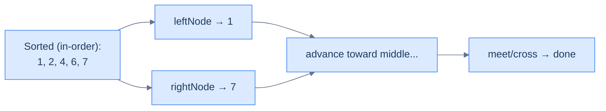
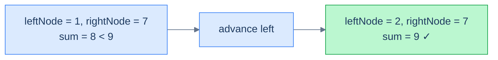

# Understanding the two pointer pattern

A BST stores values in a structure that *implicitly* sorts them. The forward iterator emits ascending order, the reverse iterator descending. Run them simultaneously, and you have a working pair `(leftNode, rightNode)` that always satisfies `leftNode.val < rightNode.val` until they cross — i.e. you're holding the smallest unseen value and the largest unseen value at the same time.

> 🖼 Diagram — Two pointers walking the implicit sorted sequence of a BST. Forward iterator advances from the small end; reverse iterator advances from the large end. They meet in the middle.

<strong>Two pointers walking the implicit sorted sequence of a BST. Forward iterator advances from the small end; reverse iterator advances from the large end. They meet in the middle.</strong>

## The technique

The same logic as two-pointer on a sorted array — drive a decision at each step using both pointers, and advance whichever one the decision tells you to:

> **Algorithm**
>
> - **Step 1:** Build a forward iterator `left` over the BST.
> - **Step 2:** Build a reverse iterator `right` over the BST.
> - **Step 3:** Initialise `leftNode = left.next()`, `rightNode = right.next()`.
> - **Step 4:** While `leftNode.val < rightNode.val` (i.e. they haven't crossed):
>   - **Step 4.1:** Process the pair `(leftNode, rightNode)`.
>   - **Step 4.2:** Decide whether to advance the left or right pointer (or both).

The terminating condition `leftNode.val < rightNode.val` is the BST analogue of `i < j` in the array version. Once they cross, every pair has been considered.

## Complexity

| Operation | Time | Space |
|---|---|---|
| Initialising both iterators | O(h) | O(h) |
| Loop body per step | O(1) (amortised by the iterator) | — |
| Whole walk | O(n) | O(h) |

Each iterator visits every node at most once. Because both iterators never overlap (one walks ascending, the other descending), every node is visited at most twice across both iterators. Total time **O(n)**.

# Identifying the two pointer pattern

Use this pattern when:

- The problem reduces to **finding/checking pairs** of values from the BST that satisfy some relation (sum equals target, ratio is a multiple, distance ≤ d, etc.).
- The relation has a **monotone** property — increasing one operand makes the relation move in one direction, increasing the other moves it in the opposite direction. (Sum is the cleanest example: increase either operand, the sum goes up.)
- A naive O(n²) solution would compare every pair, but the BST's hidden sortedness lets us prune.
- The problem might involve **two BSTs** at once — one source for the left pointer, another for the right.

If you find yourself reaching for an in-memory hash set or a sorted array conversion to solve a "pair" problem on a BST, two-pointer iterators are usually the better answer: same time, much less memory.

## Worked example — two-sum on a BST

> **Problem:** Given a BST and a target, return `true` iff there exist two distinct nodes whose values sum to `target`.

The decision rule is exactly the array two-sum:

- If `leftNode.val + rightNode.val == target`, return `true`.
- If the sum is **too small**, the only way to grow it is to **move the left pointer** rightward (forward iterator → next, larger).
- If the sum is **too big**, the only way to shrink it is to **move the right pointer** leftward (reverse iterator → next, smaller).

Loop until the iterators cross.

> 🖼 Diagram — Tree [4, 2, 6, 1, null, null, 7], target 9. Two pointers find the pair (2, 7) after one step.

<strong>Tree <code>[4, 2, 6, 1, null, null, 7]</code>, target <code>9</code>. Two pointers find the pair <code>(2, 7)</code> after one step.</strong>

The fit with the template:

- **f** = "compare sum to target → which way to step".
- **state** = the running pair.

<!-- ============================================== -->
<!-- SWEEP 2 — missing sections (placeholders only) -->
<!-- ============================================== -->

<!-- TODO: Why Naive Isn't Enough — missing, needs to be written -->
<!--       Guidance: motivation for why the obvious approach fails -->

<!-- TODO: The Core Idea — missing, needs to be written -->
<!--       Guidance: one paragraph: the central trick -->

<!-- TODO: How the Pointers/Window Move — missing, needs to be written -->
<!--       Guidance: mechanics of the moving parts -->

<!-- TODO: The Generic Algorithm — missing, needs to be written -->
<!--       Guidance: numbered steps, no code -->

<!-- TODO: Generic Implementation — missing, needs to be written -->
<!--       Guidance: Python block + Java block of the skeleton -->

<!-- TODO: Complexity Analysis — missing, needs to be written -->
<!--       Guidance: table -->

<!-- TODO: Variants / Taxonomy — missing, needs to be written -->
<!--       Guidance: enumerate sub-shapes of this pattern -->

<!-- TODO: Recognition Checklist — missing, needs to be written -->
<!--       Guidance: 4-question diagnostic — the source of the Problem-section Diagnostic Questions -->

<!-- TODO: Canonical Example — missing, needs to be written -->
<!--       Guidance: fully worked example: brute force → optimised → template fit -->

<!-- TODO: Problems in This Category — missing, needs to be written -->
<!--       Guidance: table with links to the 02-problems/ files -->
