# 2. Array Implementation of Heaps

## The Hook

In the previous lesson we drew heaps as binary trees. Beautiful, conceptual, easy to reason about — and **wildly inefficient in memory**. A linked tree node carries the value, a left pointer, and a right pointer; on a 64-bit machine that's 24 bytes for what should be a single integer. Every push allocates. Every pop frees. The CPU's L1 cache, which loves to prefetch sequential memory, gets zero benefit from the scattered allocations.

Now look at this fact again: **a heap is always a complete binary tree.** "Complete" means *every level fully filled, last level filling left-to-right, no gaps*. The structure is so rigid you don't need pointers to describe it — you can describe it with **arithmetic**.

Number the nodes in level-order starting at index `0`: root, root's left child, root's right child, then row 2 left to right, then row 3 left to right. Look at the indices. The root's children are at `1` and `2`. Node `1`'s children are at `3` and `4`. Node `2`'s children are at `5` and `6`. The pattern is **`children of i are at 2i+1 and 2i+2`**, and **`parent of i is at (i-1)/2`** (integer division).

That's it. Pointers gone. Allocations gone. The whole tree lives in a single flat array. Iterating "down a path" becomes a tight loop with `i = 2*i + 1`. The CPU prefetcher loves you. Every operation in this lesson — insert, delete, peek, extract, construct — collapses into 5–10 lines of array code with no recursion required.

This lesson is where the heap actually pays for its reputation. We'll derive the index formulas, then implement all five operations on top of them, watching each one preserve the *completeness* and *heap-ordering* invariants.

---

## Table of Contents

1. [Structure of array based heap](#structure-of-array-based-heap)
2. [Inserting an item in the heap](#inserting-an-item-in-the-heap)
3. [Deleting an item from the heap](#deleting-an-item-from-the-heap)
4. [Peeking the top item in the heap](#peeking-the-top-item-in-the-heap)
5. [Extracting the top item from the heap](#extracting-the-top-item-from-the-heap)
6. [Constructing a heap](#constructing-a-heap)
7. [Min heap to max heap](#min-heap-to-max-heap)
8. [Max heap to min heap](#max-heap-to-min-heap)

***

# Structure of array based heap

Number the nodes of a complete binary tree in level-order starting at `0`. The root is `0`, the second-row nodes are `1, 2`, the third-row nodes are `3, 4, 5, 6`, and so on.

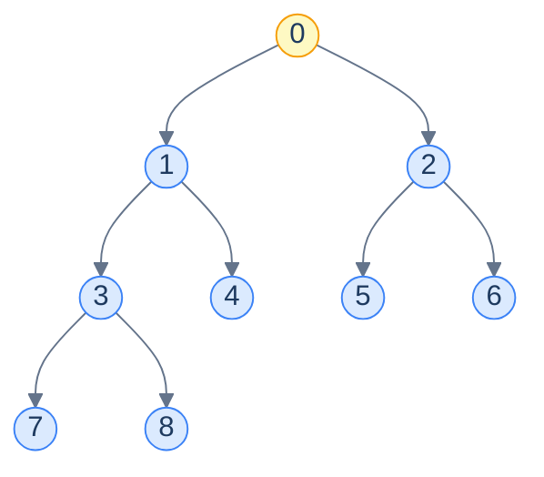

<p align="center"><strong>Level-order indices for a complete binary tree of 9 nodes. The labels here are the array positions, not values.</strong></p>

Now stare at the indices and find the pattern:

| Node | Index | Left child | Right child | Parent |
|---|---|---|---|---|
| Root | 0 | 1 | 2 | — |
| Node `1` | 1 | 3 | 4 | 0 |
| Node `2` | 2 | 5 | 6 | 0 |
| Node `3` | 3 | 7 | 8 | 1 |

The arithmetic falls out:

> For any node at index `i`:
>
> - **Parent** = `(i − 1) / 2` (integer division)
> - **Left child** = `2i + 1`
> - **Right child** = `2i + 2`

> *Friction prompt — predict before reading on. If we numbered from `1` instead of `0` (some textbooks do), what would the formulas become?*

Numbering from `1`: parent = `i/2`, left = `2i`, right = `2i+1`. Slightly cleaner — it's why some textbooks prefer 1-indexing — but every modern language defaults to 0-indexed arrays, so we'll stick with the 0-indexed forms.

Stored in an array, the level-order numbering becomes the *physical* layout — element `i` of the array IS the node at index `i` in the tree.

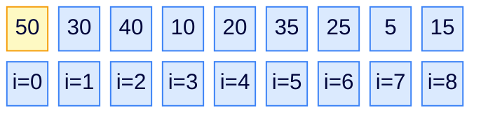

<p align="center"><strong>Array representation of a max-heap. Index <code>0</code> is the root. The tree structure is captured entirely by index arithmetic — no pointers stored.</strong></p>

## Structure of a node

A heap node is just an array slot — a value. No `left` field, no `right` field, no `parent` field. The tree topology is implicit in the indices. This is what gives heap operations their stupendous constant factors: every comparison, every swap, every navigation is a single array access, and every contiguous slice of the heap fits in a CPU cache line.

## Structure in memory

What looks like a tree on paper is, in RAM, a single contiguous block of elements:

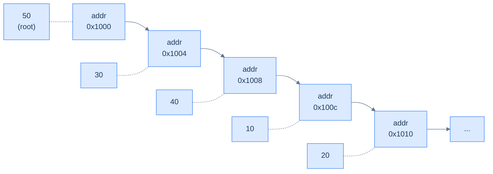

<p align="center"><strong>Heap in memory: just a contiguous int array. Cache-friendly, allocation-free per push.</strong></p>

With this single observation — *parent and child indices are arithmetic* — every heap operation in the rest of this lesson can be written without any tree code at all.

***

# Inserting an item in the heap

To insert a value into the heap, we have two invariants to preserve: completeness and heap-ordering. Completeness pins down *where* the new node has to go physically — the next free position in the array (i.e. just past the current last element). That preserves the "fill last level left-to-right" rule. The heap-ordering rule is what we have to *fix*, by bubbling the new value up if it out-prioritises its parent.

<details>
<summary><h2>Algorithm</h2></summary>


> **Algorithm**
>
> - **Step 1:** Append the new value at the end of the array.
> - **Step 2:** Bubble it up: while it has a parent and is bigger than the parent (max-heap), swap with the parent.

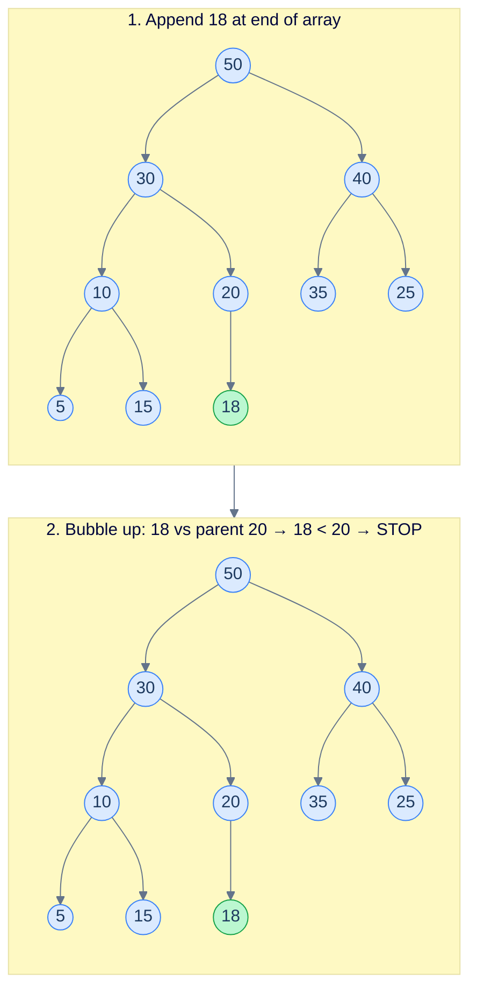

<p align="center"><strong>Insert <code>18</code> into a max-heap. It lands at the next complete slot (under <code>20</code>). Then check parent: <code>18 &lt; 20</code>, no swap needed — the heap rule already holds. Done in O(log n) worst case.</strong></p>

</details>
<details>
<summary><h2>Up Heapify</h2></summary>


The "bubble up" loop is called **up-heapify** (also "sift up"). It's the workhorse subroutine used whenever a node's value *increases* (e.g., after insert) and the *parents* might now be out of order. It walks up from a starting index, swapping with the parent each step, until either the parent is bigger or we hit the root.

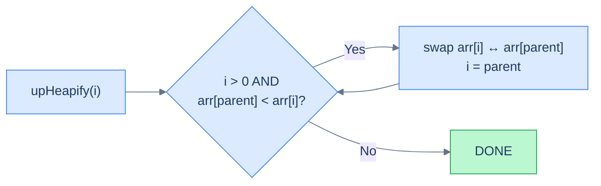

<p align="center"><strong>The up-heapify loop. Walk up from <code>i</code>, swap with parent whenever the heap rule is violated, stop at the root or when the rule is satisfied.</strong></p>

</details>
<details>
<summary><h2>Solution &amp; Analysis</h2></summary>

### Implementation

```python run viz=array viz-root=heap
from typing import List

class MaxHeap:
    def __init__(self) -> None:
        self.heap: List[int] = []

    # Helper function to restore heap property upwards (used in insert)
    def up_heapify(self, index: int) -> None:
        parent = (index - 1) // 2
        while index > 0 and self.heap[parent] < self.heap[index]:
            self.heap[parent], self.heap[index] = self.heap[index], self.heap[parent]
            index, parent = parent, (parent - 1) // 2

    def insert(self, val: int) -> None:

        # Insert the new value at the end of the heap
        self.heap.append(val)

        # Get the index of the new value
        index = len(self.heap) - 1

        # Restore the max heap property by comparing with parent nodes
        self.up_heapify(index)
```

```java run viz=array viz-root=heap
import java.util.*;

class MaxHeap {
    List<Integer> heap;

    public MaxHeap() {
        heap = new ArrayList<>();
    }

    private void swap(int i, int j) {
        int temp = heap.get(i);
        heap.set(i, heap.get(j));
        heap.set(j, temp);
    }

    // Helper function to restore heap property upwards (used in insert)
    private void upHeapify(int index) {
        int parent = (index - 1) / 2;
        while (index > 0 && heap.get(parent) < heap.get(index)) {
            swap(index, parent);
            index = parent;
            parent = (index - 1) / 2;
        }
    }

    public void insert(int val) {

        // Insert the new value at the end of the heap
        heap.add(val);

        // Get the index of the new value
        int index = heap.size() - 1;

        // Restore the max heap property by comparing with parent nodes
        upHeapify(index);
    }
}
```

### Complexity analysis

`insert` does an O(1) append, then walks at most one root-to-leaf path during up-heapify — that's at most `⌊log₂ n⌋` comparison-and-swap steps.

| Case | Time | Space |
|---|---|---|
| Best (new value ≤ parent) | O(1) | O(1) |
| Worst (new value > everything) | **O(log n)** | O(1) |

The space cost is constant — the heap grows in place, no auxiliary structures.

</details>

***

# Deleting an item from the heap

`delete(index)` removes the value at a specific index. The trick: we can't punch a hole in the middle of the array (it would break completeness). Instead, we **swap the doomed slot with the last element**, drop the (now-trailing) doomed value off the end, and then *fix* the slot we just over-wrote — which may need to bubble up *or* sift down depending on the new value.

For the most common case — deleting the root (which is what `extract` does) — the new root almost certainly needs to sift *down*. So we'll focus the operation around `down_heapify`.

<details>
<summary><h2>Algorithm</h2></summary>


> **Algorithm**
>
> - **Step 1:** Swap `heap[index]` with `heap[last]`.
> - **Step 2:** Pop the last element (now the value we wanted to delete).
> - **Step 3:** From `index`, run `down_heapify` to restore the heap rule downward. (For non-root index in a max-heap, also consider running `up_heapify` — the new value might be larger than the original parent. The simpler implementation just sifts down, which is correct for `extract` and for any case where the replacement is smaller.)

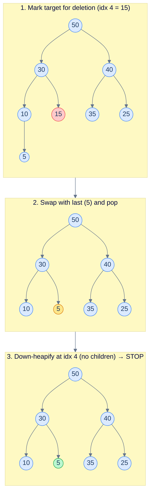

<p align="center"><strong>Delete the value at index 4 (<code>15</code>): swap with last (<code>5</code>), pop, then sift down from index 4 — here a leaf, so no further work.</strong></p>

</details>
<details>
<summary><h2>Down Heapify</h2></summary>


The "sift down" loop is called **down-heapify**. It's the dual of up-heapify — used whenever a node's value *decreases* and its descendants might now violate the heap rule. At each step, find the larger of the two children; if it's larger than the current node, swap, and continue from the swapped slot. Stop when both children are smaller or the node has no children.

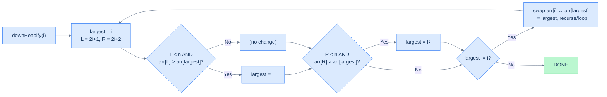

<p align="center"><strong>The down-heapify loop. At each step pick the larger of the two children and swap if it beats the parent.</strong></p>

</details>
<details>
<summary><h2>Solution &amp; Analysis</h2></summary>

### Implementation

```python run viz=array viz-root=heap
from typing import List

class MaxHeap:
    def __init__(self) -> None:
        self.heap: List[int] = []

    # Helper function to restore heap property upwards (used in insert)
    def up_heapify(self, index: int) -> None:
        parent = (index - 1) // 2
        while index > 0 and self.heap[parent] < self.heap[index]:
            self.heap[parent], self.heap[index] = self.heap[index], self.heap[parent]
            index, parent = parent, (parent - 1) // 2

    # Helper function to maintain the max heap property downwards
    def down_heapify(self, index: int) -> None:
        largest = index
        left, right = 2 * index + 1, 2 * index + 2

        # Find the largest among the node and its left child
        if left < len(self.heap) and self.heap[left] > self.heap[largest]:
            largest = left

        # Find the largest among the node and its right child
        if right < len(self.heap) and self.heap[right] > self.heap[largest]:
            largest = right

        # If the largest is not the current node, swap and continue heapify
        if largest != index:
            self.heap[index], self.heap[largest] = self.heap[largest], self.heap[index]
            self.down_heapify(largest)

    def insert(self, val: int) -> None:

        # Insert the new value at the end of the heap
        self.heap.append(val)

        # Get the index of the new value
        index = len(self.heap) - 1

        # Restore the max heap property by comparing with parent nodes
        self.up_heapify(index)

    def remove(self, index: int) -> None:

        # Replace the value at the given index with the value at the
        # last node, then heapify
        self.heap[index] = self.heap[-1]

        # Remove the last node
        self.heap.pop()

        # Restore the max heap property
        self.down_heapify(index)
```

```java run viz=array viz-root=heap
import java.util.*;

class MaxHeap {
    List<Integer> heap;

    public MaxHeap() {
        heap = new ArrayList<>();
    }

    private void swap(int i, int j) {
        int temp = heap.get(i);
        heap.set(i, heap.get(j));
        heap.set(j, temp);
    }

    // Helper function to restore heap property upwards (used in insert)
    private void upHeapify(int index) {
        int parent = (index - 1) / 2;
        while (index > 0 && heap.get(parent) < heap.get(index)) {
            swap(index, parent);
            index = parent;
            parent = (index - 1) / 2;
        }
    }

    // Helper function to maintain the max heap property downwards
    private void downHeapify(int index) {
        int largest = index;
        int left = 2 * index + 1;
        int right = 2 * index + 2;

        // Find the largest among the node and its left child
        if (left < heap.size() && heap.get(left) > heap.get(largest)) {
            largest = left;
        }

        // Find the largest among the node and its right child
        if (right < heap.size() && heap.get(right) > heap.get(largest)) {
            largest = right;
        }

        // If the largest is not the current node, swap and continue
        // heapify
        if (largest != index) {
            swap(index, largest);
            downHeapify(largest);
        }
    }

    public void insert(int val) {

        // Insert the new value at the end of the heap
        heap.add(val);

        // Get the index of the new value
        int index = heap.size() - 1;

        // Restore the max heap property by comparing with parent nodes
        upHeapify(index);
    }

    public void remove(int index) {

        // Replace the value at the given index with the value at the
        // last node, then heapify
        heap.set(index, heap.get(heap.size() - 1));

        // Remove the last node
        heap.remove(heap.size() - 1);

        // Restore the max heap property
        downHeapify(index);
    }
}
```

### Complexity analysis

`remove` does an O(1) swap-and-pop, then walks at most one root-to-leaf path during down-heapify.

| Case | Time | Space |
|---|---|---|
| Best (replacement value is the largest in its subtree) | O(1) | O(1) |
| Worst (replacement sifts to a leaf) | **O(log n)** | O(1) |

</details>

***

# Peeking the top item in the heap

Of the five operations, **`peek` is the easiest** — it doesn't even touch the heap. The root is `arr[0]` by definition, and the heap rule guarantees that's the maximum.

<details>
<summary><h2>Algorithm</h2></summary>


> **Algorithm**
>
> - **Step 1:** If the heap is empty, signal an error or return `null`.
> - **Step 2:** Return `heap[0]`.

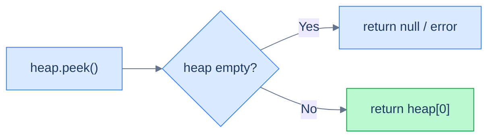

<p align="center"><strong>Peek is just an array read at index 0. O(1).</strong></p>

</details>
<details>
<summary><h2>Solution &amp; Analysis</h2></summary>

### Implementation

```python run viz=array viz-root=heap
from typing import List

class MaxHeap:
    def __init__(self) -> None:
        self.heap: List[int] = []

    # Helper function to restore heap property upwards (used in insert)
    def up_heapify(self, index: int) -> None:
        parent = (index - 1) // 2
        while index > 0 and self.heap[parent] < self.heap[index]:
            self.heap[parent], self.heap[index] = self.heap[index], self.heap[parent]
            index, parent = parent, (parent - 1) // 2

    # Helper function to maintain the max heap property downwards
    def down_heapify(self, index: int) -> None:
        largest = index
        left, right = 2 * index + 1, 2 * index + 2

        # Find the largest among the node and its left child
        if left < len(self.heap) and self.heap[left] > self.heap[largest]:
            largest = left

        # Find the largest among the node and its right child
        if right < len(self.heap) and self.heap[right] > self.heap[largest]:
            largest = right

        # If the largest is not the current node, swap and continue heapify
        if largest != index:
            self.heap[index], self.heap[largest] = self.heap[largest], self.heap[index]
            self.down_heapify(largest)

    def insert(self, val: int) -> None:

        # Insert the new value at the end of the heap
        self.heap.append(val)

        # Get the index of the new value
        index = len(self.heap) - 1

        # Restore the max heap property by comparing with parent nodes
        self.up_heapify(index)

    def remove(self, index: int) -> None:

        # Replace the value at the given index with the value at the
        # last node, then heapify
        self.heap[index] = self.heap[-1]

        # Remove the last node
        self.heap.pop()

        # Restore the max heap property
        self.down_heapify(index)

    def get_max(self) -> int:
        if not self.heap:
            return -1

        # Return the root node
        return self.heap[0]
```

```java run viz=array viz-root=heap
import java.util.*;

class MaxHeap {
    List<Integer> heap;

    public MaxHeap() {
        heap = new ArrayList<>();
    }

    private void swap(int i, int j) {
        int temp = heap.get(i);
        heap.set(i, heap.get(j));
        heap.set(j, temp);
    }

    // Helper function to restore heap property upwards (used in insert)
    private void upHeapify(int index) {
        int parent = (index - 1) / 2;
        while (index > 0 && heap.get(parent) < heap.get(index)) {
            swap(index, parent);
            index = parent;
            parent = (index - 1) / 2;
        }
    }

    // Helper function to maintain the max heap property downwards
    private void downHeapify(int index) {
        int largest = index;
        int left = 2 * index + 1;
        int right = 2 * index + 2;

        // Find the largest among the node and its left child
        if (left < heap.size() && heap.get(left) > heap.get(largest)) {
            largest = left;
        }

        // Find the largest among the node and its right child
        if (right < heap.size() && heap.get(right) > heap.get(largest)) {
            largest = right;
        }

        // If the largest is not the current node, swap and continue
        // heapify
        if (largest != index) {
            swap(index, largest);
            downHeapify(largest);
        }
    }

    public void insert(int val) {

        // Insert the new value at the end of the heap
        heap.add(val);

        // Get the index of the new value
        int index = heap.size() - 1;

        // Restore the max heap property by comparing with parent nodes
        upHeapify(index);
    }

    public void remove(int index) {

        // Replace the value at the given index with the value at the
        // last node, then heapify
        heap.set(index, heap.get(heap.size() - 1));

        // Remove the last node
        heap.remove(heap.size() - 1);

        // Restore the max heap property
        downHeapify(index);
    }

    public int getMax() {
        if (heap.isEmpty()) {
            return -1;
        }

        // Return the root node
        return heap.get(0);
    }
}
```

### Complexity analysis

| Case | Time | Space |
|---|---|---|
| All cases | **O(1)** | O(1) |

</details>

***

# Extracting the top item from the heap

`extract` is the workhorse of any priority queue: return the highest-priority value AND remove it. We've already built the pieces — extract is just `peek` followed by `delete(0)` (delete the root).

<details>
<summary><h2>Algorithm</h2></summary>


> **Algorithm**
>
> - **Step 1:** If the heap is empty, signal an error or return `null`.
> - **Step 2:** Save the root value (`heap[0]`).
> - **Step 3:** Move the last element to index `0`.
> - **Step 4:** Pop the last element.
> - **Step 5:** Run `down_heapify(0)` to restore the heap rule.
> - **Step 6:** Return the saved root value.

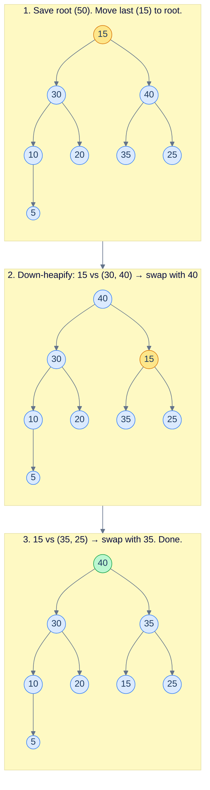

<p align="center"><strong>Extract: pull the root <code>50</code>, move <code>15</code> to the root, sift down twice. The new max <code>40</code> is now at the top.</strong></p>

</details>
<details>
<summary><h2>Solution &amp; Analysis</h2></summary>

### Implementation

```python run viz=array viz-root=heap
from typing import List

class MaxHeap:
    def __init__(self) -> None:
        self.heap: List[int] = []

    # Helper function to restore heap property upwards (used in insert)
    def up_heapify(self, index: int) -> None:
        parent = (index - 1) // 2
        while index > 0 and self.heap[parent] < self.heap[index]:
            self.heap[parent], self.heap[index] = self.heap[index], self.heap[parent]
            index, parent = parent, (parent - 1) // 2

    # Helper function to maintain the max heap property downwards
    def down_heapify(self, index: int) -> None:
        largest = index
        left, right = 2 * index + 1, 2 * index + 2

        # Find the largest among the node and its left child
        if left < len(self.heap) and self.heap[left] > self.heap[largest]:
            largest = left

        # Find the largest among the node and its right child
        if right < len(self.heap) and self.heap[right] > self.heap[largest]:
            largest = right

        # If the largest is not the current node, swap and continue heapify
        if largest != index:
            self.heap[index], self.heap[largest] = self.heap[largest], self.heap[index]
            self.down_heapify(largest)

    def insert(self, val: int) -> None:

        # Insert the new value at the end of the heap
        self.heap.append(val)

        # Get the index of the new value
        index = len(self.heap) - 1

        # Restore the max heap property by comparing with parent nodes
        self.up_heapify(index)

    def remove(self, index: int) -> None:

        # Replace the value at the given index with the value at the
        # last node, then heapify
        self.heap[index] = self.heap[-1]

        # Remove the last node
        self.heap.pop()

        # Restore the max heap property
        self.down_heapify(index)

    def get_max(self) -> int:
        if not self.heap:
            return -1

        # Return the root node
        return self.heap[0]

    def extract_max(self) -> int:
        if not self.heap:
            return -1

        # Extract the root node
        root = self.heap[0]

        # Delete the root node
        self.remove(0)

        # Return the extracted root node
        return root
```

```java run viz=array viz-root=heap
import java.util.*;

class MaxHeap {
    List<Integer> heap;

    public MaxHeap() {
        heap = new ArrayList<>();
    }

    private void swap(int i, int j) {
        int temp = heap.get(i);
        heap.set(i, heap.get(j));
        heap.set(j, temp);
    }

    // Helper function to restore heap property upwards (used in insert)
    private void upHeapify(int index) {
        int parent = (index - 1) / 2;
        while (index > 0 && heap.get(parent) < heap.get(index)) {
            swap(index, parent);
            index = parent;
            parent = (index - 1) / 2;
        }
    }

    // Helper function to maintain the max heap property downwards
    private void downHeapify(int index) {
        int largest = index;
        int left = 2 * index + 1;
        int right = 2 * index + 2;

        // Find the largest among the node and its left child
        if (left < heap.size() && heap.get(left) > heap.get(largest)) {
            largest = left;
        }

        // Find the largest among the node and its right child
        if (right < heap.size() && heap.get(right) > heap.get(largest)) {
            largest = right;
        }

        // If the largest is not the current node, swap and continue
        // heapify
        if (largest != index) {
            swap(index, largest);
            downHeapify(largest);
        }
    }

    public void insert(int val) {

        // Insert the new value at the end of the heap
        heap.add(val);

        // Get the index of the new value
        int index = heap.size() - 1;

        // Restore the max heap property by comparing with parent nodes
        upHeapify(index);
    }

    public void remove(int index) {

        // Replace the value at the given index with the value at the
        // last node, then heapify
        heap.set(index, heap.get(heap.size() - 1));

        // Remove the last node
        heap.remove(heap.size() - 1);

        // Restore the max heap property
        downHeapify(index);
    }

    public int getMax() {
        if (heap.isEmpty()) {
            return -1;
        }

        // Return the root node
        return heap.get(0);
    }

    public int extractMax() {
        if (heap.isEmpty()) {
            return -1;
        }

        // Extract the root node
        int root = heap.get(0);

        // Delete the root node
        remove(0);

        // Return the extracted root node
        return root;
    }
}
```

### Complexity analysis

| Case | Time | Space |
|---|---|---|
| Best (heap of size ≤ 1) | O(1) | O(1) |
| Worst (sift down to a leaf) | **O(log n)** | O(1) |

The root is *always* deleted, so unlike `remove(index)` for arbitrary index, `extract_max` doesn't have a hyper-fast best case — it always walks at least one comparison.

</details>

***

# Constructing a heap

Suppose you've already got an array of `n` values and you want to make it a heap. The naive approach is `n` separate `insert` calls — that's `O(n log n)` total.

There's a much cleaner approach that runs in **O(n)** total: think of the array as already being a *complete binary tree* (it is — the array layout *is* a complete binary tree, just in level-order), and **walk it bottom-up, calling `down_heapify` at every internal node**.

<details>
<summary><h2>Algorithm</h2></summary>


The crucial observation: **leaves are already valid one-element heaps**. They have no children, so the heap rule is satisfied trivially. So we don't need to call `down_heapify` on them — we can skip directly to the last *internal* node, which lives at index `n/2 − 1` in a 0-indexed array. From there, we walk backwards to index `0`.

By the time we reach any internal node, both of its subtrees are already heaps (because we processed them earlier in the bottom-up walk). A single `down_heapify` call from this node restores the heap rule across its whole subtree.

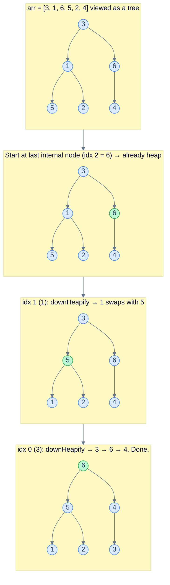

<p align="center"><strong>Bottom-up heap construction. Skip the leaves; from the last internal node (<code>n/2−1</code>) walk back to index 0 calling <code>down_heapify</code>. Total work is O(n) — proven below.</strong></p>

> **Algorithm**
>
> - **Step 1:** For `i = n/2 − 1` down to `0` (inclusive), call `down_heapify(i)`.

</details>
<details>
<summary><h2>Solution &amp; Analysis</h2></summary>

### Implementation

```python run viz=array viz-root=heap
from typing import List

class MaxHeap:

    # Helper function to maintain the max heap property downwards
    def down_heapify(self, arr: List[int], n: int, index: int) -> None:
        largest = index
        left, right = 2 * index + 1, 2 * index + 2

        # Find the largest among the node and its left child
        if left < n and arr[left] > arr[largest]:
            largest = left

        # Find the largest among the node and its right child
        if right < n and arr[right] > arr[largest]:
            largest = right

        # If the largest is not the current node, swap and continue heapify
        if largest != index:
            arr[index], arr[largest] = arr[largest], arr[index]
            self.down_heapify(arr, n, largest)

    def construct(self, arr: List[int]) -> None:
        n = len(arr)

        # Start from the last non-leaf node and perform max-heapify
        for i in range(n // 2 - 1, -1, -1):
            self.down_heapify(arr, n, i)
```

```java run viz=array viz-root=heap
import java.util.*;

class MaxHeap {

    // Helper function to maintain the max heap property downwards
    private void downHeapify(int[] arr, int n, int index) {
        int largest = index;
        int left = 2 * index + 1;
        int right = 2 * index + 2;

        // Find the largest among the node and its left child
        if (left < n && arr[left] > arr[largest]) {
            largest = left;
        }

        // Find the largest among the node and its right child
        if (right < n && arr[right] > arr[largest]) {
            largest = right;
        }

        // If the largest is not the current node, swap and continue heapify
        if (largest != index) {
            int temp = arr[index];
            arr[index] = arr[largest];
            arr[largest] = temp;

            downHeapify(arr, n, largest);
        }
    }

    public void construct(int[] arr) {
        int n = arr.length;

        // Start from the last non-leaf node and perform max-heapify
        for (int i = (n / 2) - 1; i >= 0; i--) {
            downHeapify(arr, n, i);
        }
    }
}
```

### Complexity analysis

The `n` separate inserts approach gives `O(n log n)`. The bottom-up construct gives **`O(n)`** — *strictly faster*. The reason is that **most nodes are leaves** (about half of them), and they cost zero. Internal nodes cost progressively more — the deepest internal nodes are *just above* the leaves and only do at most one swap; shallower internal nodes can do more swaps but there are *fewer of them*.

Formally: for a complete binary tree of height `h` with `n` nodes:

- Number of nodes at height `j` (counting from 0 at the leaves) ≈ `n / 2^(j+1)`.
- A `down_heapify` call from a node at height `j` does at most `j` swaps.

So the total cost is bounded by:

```
Σ (n / 2^(j+1)) × j  for j = 0 to log n
= n × Σ j / 2^(j+1)
= n × (1/2 × Σ j / 2^j)
< n × 2  (the infinite sum Σ j / 2^j converges to 2)
= O(n)
```

| Case | Time | Space |
|---|---|---|
| All cases | **O(n)** | O(1) (in place) |

This is one of the most surprising results in elementary algorithms: the bottom-up heap build is **linear**, not log-linear, despite each individual `down_heapify` being O(log n).

</details>

***

# Min heap to max heap

## Problem Statement

Given an array `arr` that is the array representation of a **min heap**, convert it to a **max heap** **in place** in amortised linear time.

### Example 1

> - **Input:** `arr = [-2, 1, 5, 9, 4, 6, 7]`
> - **Output:** `[9, 4, 7, 1, -2, 6, 5]`
> - **Explanation:** A valid max-heap rearrangement of the same multiset.

### Example 2

> - **Input:** `arr = [3, 5]`
> - **Output:** `[5, 3]`

<details>
<summary><h2>The Strategy</h2></summary>


**The input being a min heap doesn't help us at all** — the result has to be a max heap, and that's a different ordering. The fastest way to build a max heap from any starting array is the bottom-up `construct` algorithm we just built. So this problem reduces to: **call `construct` with max-heap semantics**.

The two invariants we change to `>`:

- `down_heapify` picks the *larger* of the two children (instead of smaller).
- We swap whenever the current node is *smaller* than the larger child.

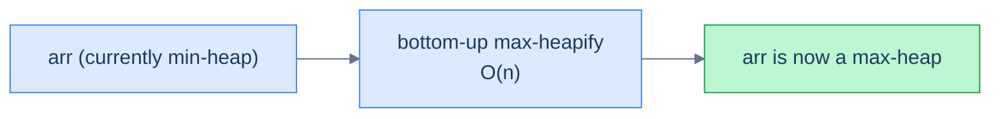

<p align="center"><strong>Min-to-max conversion is just bottom-up max-heapification of the same array. O(n).</strong></p>

</details>
<details>
<summary><h2>The Solution</h2></summary>


```python run viz=array viz-root=arr
from typing import List

class Solution:
    def max_heapify(self, arr: List[int], n: int, index: int) -> None:

        # Initialize the current node as the largest
        largest = index

        # Calculate the left child index
        left = 2 * index + 1

        # Calculate the right child index
        right = 2 * index + 2

        # Compare the current node with its left child
        if left < n and arr[left] > arr[largest]:
            largest = left

        # Compare the current node with its right child
        if right < n and arr[right] > arr[largest]:
            largest = right

        # If the largest is not the current node, swap the values and
        # recursively max-heapify the affected child
        if largest != index:
            arr[index], arr[largest] = arr[largest], arr[index]
            self.max_heapify(arr, n, largest)

    def min_heap_to_max_heap(self, arr: List[int]) -> None:
        n = len(arr)

        # Start from the last non-leaf node and perform max-heapify
        for i in range(n // 2 - 1, -1, -1):
            self.max_heapify(arr, n, i)


# Examples from the problem statement
a1 = [-2, 1, 5, 9, 4, 6, 7]
Solution().min_heap_to_max_heap(a1); print(a1)  # [9, 4, 7, 1, -2, 6, 5]

a2 = [3, 5]
Solution().min_heap_to_max_heap(a2); print(a2)  # [5, 3]

# Edge cases
a3: List[int] = []
Solution().min_heap_to_max_heap(a3); print(a3)  # []

a4 = [1]
Solution().min_heap_to_max_heap(a4); print(a4)  # [1]

a5 = [1, 2, 3]
Solution().min_heap_to_max_heap(a5); print(a5)  # [3, 2, 1]

a6 = [5, 5, 5, 5]
Solution().min_heap_to_max_heap(a6); print(a6)  # [5, 5, 5, 5] — all same

a7 = [1, 3, 2, 7, 5, 4, 6]
Solution().min_heap_to_max_heap(a7); print(a7)  # valid max heap rooted at 7
```

```java run viz=array viz-root=arr
import java.util.Arrays;

public class Main {
    static class Solution {
        private void maxHeapify(int[] arr, int n, int index) {

            // Initialize the current node as the largest
            int largest = index;

            // Calculate the left child index
            int left = 2 * index + 1;

            // Calculate the right child index
            int right = 2 * index + 2;

            // Compare the current node with its left child
            if (left < n && arr[left] > arr[largest]) {
                largest = left;
            }

            // Compare the current node with its right child
            if (right < n && arr[right] > arr[largest]) {
                largest = right;
            }

            // If the largest is not the current node, swap the values and
            // recursively max-heapify the affected child
            if (largest != index) {
                int temp = arr[index];
                arr[index] = arr[largest];
                arr[largest] = temp;
                maxHeapify(arr, n, largest);
            }
        }

        public void minHeapToMaxHeap(int[] arr) {
            int n = arr.length;

            // Start from the last non-leaf node and perform max-heapify
            for (int i = (n / 2) - 1; i >= 0; i--) {
                maxHeapify(arr, n, i);
            }
        }
    }

    public static void main(String[] args) {
        // Examples from the problem statement
        int[] a1 = {-2, 1, 5, 9, 4, 6, 7};
        new Solution().minHeapToMaxHeap(a1);
        System.out.println(Arrays.toString(a1));  // [9, 4, 7, 1, -2, 6, 5]

        int[] a2 = {3, 5};
        new Solution().minHeapToMaxHeap(a2);
        System.out.println(Arrays.toString(a2));  // [5, 3]

        // Edge cases
        int[] a3 = {};
        new Solution().minHeapToMaxHeap(a3);
        System.out.println(Arrays.toString(a3));  // []

        int[] a4 = {1};
        new Solution().minHeapToMaxHeap(a4);
        System.out.println(Arrays.toString(a4));  // [1]

        int[] a5 = {1, 2, 3};
        new Solution().minHeapToMaxHeap(a5);
        System.out.println(Arrays.toString(a5));  // [3, 2, 1]

        int[] a6 = {5, 5, 5, 5};
        new Solution().minHeapToMaxHeap(a6);
        System.out.println(Arrays.toString(a6));  // [5, 5, 5, 5] — all same

        int[] a7 = {1, 3, 2, 7, 5, 4, 6};
        new Solution().minHeapToMaxHeap(a7);
        System.out.println(Arrays.toString(a7));  // valid max heap rooted at 7
    }
}
```

</details>


***

# Max heap to min heap

## Problem Statement

Mirror image: given an array `arr` that is the array representation of a **max heap**, convert it to a **min heap** in place in amortised linear time.

### Example 1

> - **Input:** `arr = [9, 4, 7, 1, -2, 6, 5]`
> - **Output:** `[-2, 1, 5, 9, 4, 6, 7]`

### Example 2

> - **Input:** `arr = [5, 3]`
> - **Output:** `[3, 5]`

<details>
<summary><h2>The Strategy</h2></summary>


Same as the previous problem — just flip the comparator. Bottom-up `min_heapify` walks internal nodes from `n/2 − 1` to `0`, picking the **smaller** child each step.

</details>
<details>
<summary><h2>The Solution</h2></summary>


```python run viz=array viz-root=arr
from typing import List

class Solution:
    def min_heapify(self, arr: List[int], n: int, index: int) -> None:

        # Initialize the current node as the smallest
        smallest = index

        # Calculate the left child index
        left = 2 * index + 1

        # Calculate the right child index
        right = 2 * index + 2

        # Compare the current node with its left child
        if left < n and arr[left] < arr[smallest]:
            smallest = left

        # Compare the current node with its right child
        if right < n and arr[right] < arr[smallest]:
            smallest = right

        # If the smallest is not the current node, swap the values and
        # recursively min-heapify the affected child
        if smallest != index:
            arr[index], arr[smallest] = arr[smallest], arr[index]
            self.min_heapify(arr, n, smallest)

    def max_heap_to_min_heap(self, arr: List[int]) -> None:
        n = len(arr)

        # Start from the last non-leaf node and perform min-heapify
        for i in range(n // 2 - 1, -1, -1):
            self.min_heapify(arr, n, i)


# Examples from the problem statement
a1 = [9, 4, 7, 1, -2, 6, 5]
Solution().max_heap_to_min_heap(a1); print(a1)  # [-2, 1, 5, 9, 4, 6, 7]

a2 = [5, 3]
Solution().max_heap_to_min_heap(a2); print(a2)  # [3, 5]

# Edge cases
a3: List[int] = []
Solution().max_heap_to_min_heap(a3); print(a3)  # []

a4 = [7]
Solution().max_heap_to_min_heap(a4); print(a4)  # [7]

a5 = [3, 2, 1]
Solution().max_heap_to_min_heap(a5); print(a5)  # [1, 2, 3]

a6 = [4, 4, 4, 4]
Solution().max_heap_to_min_heap(a6); print(a6)  # [4, 4, 4, 4] — all same

a7 = [7, 5, 6, 3, 4, 1, 2]
Solution().max_heap_to_min_heap(a7); print(a7)  # valid min heap rooted at 1
```

```java run viz=array viz-root=arr
import java.util.Arrays;

public class Main {
    static class Solution {
        private void minHeapify(int[] arr, int n, int index) {

            // Initialize the current node as the smallest
            int smallest = index;

            // Calculate the left child index
            int left = 2 * index + 1;

            // Calculate the right child index
            int right = 2 * index + 2;

            // Compare the current node with its left child
            if (left < n && arr[left] < arr[smallest]) {
                smallest = left;
            }

            // Compare the current node with its right child
            if (right < n && arr[right] < arr[smallest]) {
                smallest = right;
            }

            // If the smallest is not the current node, swap the values and
            // recursively min-heapify the affected child
            if (smallest != index) {
                int temp = arr[index];
                arr[index] = arr[smallest];
                arr[smallest] = temp;
                minHeapify(arr, n, smallest);
            }
        }

        public void maxHeapToMinHeap(int[] arr) {
            int n = arr.length;

            // Start from the last non-leaf node and perform min-heapify
            for (int i = (n / 2) - 1; i >= 0; i--) {
                minHeapify(arr, n, i);
            }
        }
    }

    public static void main(String[] args) {
        // Examples from the problem statement
        int[] a1 = {9, 4, 7, 1, -2, 6, 5};
        new Solution().maxHeapToMinHeap(a1);
        System.out.println(Arrays.toString(a1));  // [-2, 1, 5, 9, 4, 6, 7]

        int[] a2 = {5, 3};
        new Solution().maxHeapToMinHeap(a2);
        System.out.println(Arrays.toString(a2));  // [3, 5]

        // Edge cases
        int[] a3 = {};
        new Solution().maxHeapToMinHeap(a3);
        System.out.println(Arrays.toString(a3));  // []

        int[] a4 = {7};
        new Solution().maxHeapToMinHeap(a4);
        System.out.println(Arrays.toString(a4));  // [7]

        int[] a5 = {3, 2, 1};
        new Solution().maxHeapToMinHeap(a5);
        System.out.println(Arrays.toString(a5));  // [1, 2, 3]

        int[] a6 = {4, 4, 4, 4};
        new Solution().maxHeapToMinHeap(a6);
        System.out.println(Arrays.toString(a6));  // [4, 4, 4, 4] — all same

        int[] a7 = {7, 5, 6, 3, 4, 1, 2};
        new Solution().maxHeapToMinHeap(a7);
        System.out.println(Arrays.toString(a7));  // valid min heap rooted at 1
    }
}
```

</details>
<details>
<summary><h2>Final Takeaway</h2></summary>


Three index formulas — `parent = (i−1)/2`, `left = 2i+1`, `right = 2i+2` — collapse the entire tree-shaped heap into a flat array. From there, every operation we sketched in lesson 1 fits in a tight loop with no recursion required:

| Operation | Idea | Time |
|---|---|---|
| `peek` | `heap[0]` | **O(1)** |
| `insert(v)` | append + bubble up | O(log n) |
| `remove(i)` / `extract()` | swap with last + sift down | O(log n) |
| `construct(arr)` | bottom-up sift downs | **O(n)** |

Three patterns to lock in:

1. **Two helpers do all the work.** `up_heapify` (after a value increases) and `down_heapify` (after a value decreases) cover every restoration scenario. Insert uses up; delete and extract use down; construct is just `n/2` calls to down. *That's the whole heap*.
2. **Bottom-up `construct` beats `n × insert`.** The `n × insert` approach is O(n log n); the bottom-up approach is O(n). The reason — most nodes are leaves, and they cost zero — is the canonical example of why amortised analysis matters in algorithm design.
3. **Min and max are mirrors.** Every algorithm in this lesson has a `<`-for-`>` mirror. Languages that ship one flavour (Python `heapq` is min; Java `PriorityQueue` is min; C++ is max) let you fake the other with a comparator inversion — which is the focus of lesson 4.

Now that we have a full priority queue at our fingertips, the next two lessons answer the natural question: **what do you actually do with it?** Lesson 3 introduces the **top-K elements pattern**, the single most common application of heaps in coding interviews and real systems. Lesson 4 generalises the heap to *any* ordering by way of comparators — opening the door to heaps of strings, structs, tuples, and anything else with a defined ordering relation.

</details>

<!-- ============================================== -->
<!-- SWEEP 2 — missing sections (placeholders only) -->
<!-- ============================================== -->

<!-- TODO: Understanding the Problem — missing, needs to be written -->
<!--       Guidance: frame the gap the structure/algorithm fills -->

<!-- TODO: Supported Operations — missing, needs to be written -->
<!--       Guidance: table: operation / time / notes -->

<!-- TODO: Internal Mechanics — missing, needs to be written -->
<!--       Guidance: how it actually works under the hood -->

<!-- TODO: Working Example — missing, needs to be written -->
<!--       Guidance: one fully worked end-to-end example -->

<!-- TODO: Edge Cases & Pitfalls — missing, needs to be written -->
<!--       Guidance: bulleted list of gotchas -->

<!-- TODO: Production Reality — missing, needs to be written -->
<!--       Guidance: 4–6 entries: System — uses X — because Y -->

<!-- TODO: Quiz — missing, needs to be written -->
<!--       Guidance: 3–5 questions, each labeled [Recall]/[Reasoning]/[Tradeoff] -->

<!-- TODO: Practice Ladder — missing, needs to be written -->
<!--       Guidance: table: 5 links into pattern problems + hints -->

<!-- TODO: Further Reading — missing, needs to be written -->
<!--       Guidance: annotated: ★ Essential / ◆ Advanced / → Reference -->

<!-- TODO: Cross-Links — missing, needs to be written -->
<!--       Guidance: Prerequisites | What comes next -->

<!-- TODO: Final Takeaway — missing, needs to be written -->
<!--       Guidance: exactly 3 typed bullets: Core mechanic / Dominant tradeoff / One thing to remember -->
