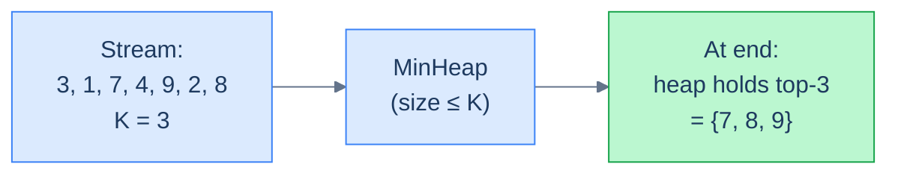
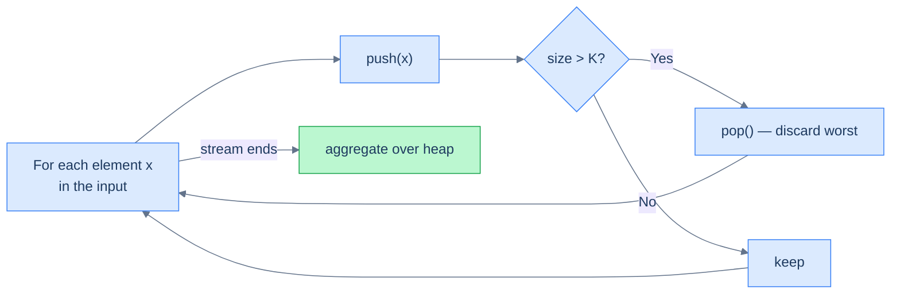
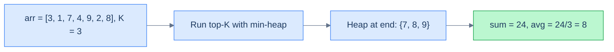
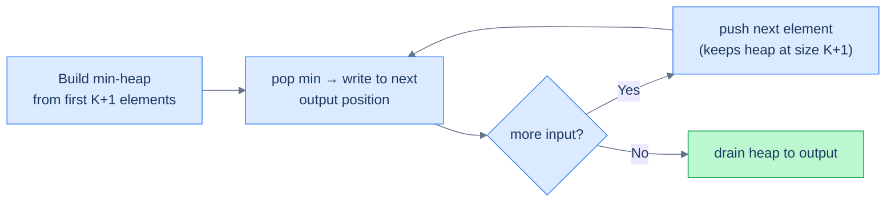

# 3. Pattern: Top K Elements

## The Hook

"Show me the top 10 highest-scoring users." "Find the 100 nearest restaurants." "Pull the 5 most expensive pending orders." Every backend you've ever touched runs this query a hundred times a minute.

The naive answer is **sort everything, take the first K**. That's `O(n log n)` time and `O(n)` extra space — fine for `n = 100`, ruinous for `n = 100 million`. And nine times out of ten you only care about the **top K**, where K is small. You're throwing away the work of sorting the other 99,999,990 elements that you never look at.

There's a much smarter trick. **Maintain a small heap of size exactly K**, and stream the elements through it. At any moment the heap holds *the best K candidates seen so far*. New elements either belong in the top K (push, then evict the worst) or don't (skip). When the stream ends, the heap *is* the answer. **Time: O(n log K). Space: O(K).** When K is much smaller than n, that's a dramatic win — and the algorithm works on streams you can't even store.

This is the **Top K Elements** pattern, and it's the single most common heap idiom in interviews and production systems alike. Once you internalise it — *fixed-size heap as a sliding-window over the sorted stream* — half the heap problems you'll ever see become formulaic.

---

## Table of Contents

1. [Understanding the top k elements pattern](#understanding-the-top-k-elements-pattern)
2. [Identifying the top k elements pattern](#identifying-the-top-k-elements-pattern)
3. [Kth largest element](#kth-largest-element)
4. [Kth smallest element](#kth-smallest-element)
5. [K range sum](#k-range-sum)
6. [K sorted array sorting](#k-sorted-array-sorting)

***

# Understanding the top K elements pattern

The pattern boils down to a counter-intuitive trick: **to track the K largest values, use a min-heap of size K, not a max-heap**.

> *Friction prompt — predict before reading on. Why min-heap for the K largest? It feels backwards.*

Because the heap's job is to **identify the smallest of your top-K-so-far** — that's the value you need to compare against to decide whether a new element belongs in the club. If the new element beats the current min of the top-K, it kicks the min out and joins the heap. If not, it's worse than everything you've already accepted, so it's discarded.



<p align="center"><strong>Top-K-largest with a min-heap of size K. Each element is pushed; if the heap exceeds K, the min is popped. The min of a heap that always holds the best K candidates is the K-th largest seen so far.</strong></p>

The mirror version is just as crucial: **for the K smallest, use a max-heap of size K**. The max of the top-K-smallest-so-far is the threshold you compare against.

| Want | Use a heap of type | Why |
|---|---|---|
| K **largest** | **Min**-heap of size K | The min of the top-K is the threshold to beat |
| K **smallest** | **Max**-heap of size K | The max of the bottom-K is the threshold to beat |

## The top K technique

For each element in the stream:

1. Push it into the heap.
2. If the heap now holds more than K elements, pop the top.

After the stream ends, the heap holds the K most-extreme values. To compute an aggregate (sum, average, list) over those K, drain the heap and apply your aggregation function `f`.



<p align="center"><strong>The top-K loop. Constant-size heap, O(log K) per element, single pass.</strong></p>

## Algorithm

> **Algorithm**
>
> - **Step 1:** Create an empty heap (min-heap for top-K-largest, max-heap for top-K-smallest).
> - **Step 2:** For each element `x` in the input:
>   - **Step 2.1:** Push `x` onto the heap.
>   - **Step 2.2:** If `heap.size() > K`, pop the top.
> - **Step 3:** Drain the heap, applying `f` to each popped element to build the aggregate.
> - **Step 4:** Return the aggregate.

## Complexity Analysis

For an array of `n` elements with the heap capped at size `K`:

| Step | Cost |
|---|---|
| Push + possible pop, per element | O(log K) |
| Total across `n` elements | **O(n log K)** |
| Final drain of the heap | O(K log K) |
| Space (heap of size K) | **O(K)** |

When `K << n`, that's dramatically better than `O(n log n)` from a full sort. When `K = n`, the two are equal. **You can never lose with the top-K trick.**

***

# Identifying the top k elements pattern

The pattern fits whenever the problem mentions:

- **"K largest" / "K smallest" / "K most/least frequent"** — the canonical phrasing.
- **"K-th"** anything — the K-th largest, K-th smallest, K-th frequent. (Just take the heap's top *after* processing the stream.)
- **"Closest K"** — for points to a target, words to a query, etc. The "score" is the distance, and you want the smallest distances.
- **"Top-K aggregate"** — average, sum, set of the top-K values.

If the problem boils down to *"compute something over the K extreme values of a stream/array"*, reach for the fixed-size heap.

## Worked example — average of K largest

> **Problem:** Given an array of integers and an integer K, return the average of the K largest values.

The fit:

- **Aggregation function `f`** = "running sum, divide by K at the end".
- **Heap type** = min-heap of size K (we want largest).



<p align="center"><strong>Average of the K largest. The pattern handles the "select" step; the aggregation step is whatever the problem needs.</strong></p>

***

# Kth largest element

## Problem Statement

Given an array `arr` and a positive integer `k`, return the K-th largest element. Use a heap.

### Example 1

> - **Input:** `arr = [5, 4, 2, 8]`, `k = 2`
> - **Output:** `5`

### Example 2

> - **Input:** `arr = [1, 2, 3, 4, 5]`, `k = 5`
> - **Output:** `1`

### Example 3

> - **Input:** `arr = [7, 5, 9]`, `k = 3`
> - **Output:** `5`

<details>
<summary><h2>The Strategy</h2></summary>


This is the rawest form of the pattern. After running the loop, the heap's *top* (the smallest element of the K largest) **is** the K-th largest in the original array.

</details>
<details>
<summary><h2>The Solution</h2></summary>


```python run
from typing import List
import heapq

class Solution:
    def kth_largest_element(self, arr: List[int], k: int) -> int:

        # Create a min heap to store the k largest elements
        min_heap: List[int] = []

        # Populate the min heap with the first k elements
        for i in range(k):
            heapq.heappush(min_heap, arr[i])

        # Compare the remaining elements with the top of the min heap
        for i in range(k, len(arr)):

            # Add the current element to the min heap
            heapq.heappush(min_heap, arr[i])

            # If the heap size exceeds k, remove the smallest element
            if len(min_heap) > k:
                heapq.heappop(min_heap)

        # The top of the min heap will be the kth largest element
        return min_heap[0]


# Examples from the problem statement
print(Solution().kth_largest_element([5, 4, 2, 8], 2))       # 5
print(Solution().kth_largest_element([1, 2, 3, 4, 5], 5))    # 1
print(Solution().kth_largest_element([7, 5, 9], 3))           # 5

# Edge cases
print(Solution().kth_largest_element([1], 1))                 # 1 — single element
print(Solution().kth_largest_element([3, 1], 1))              # 3 — largest of two
print(Solution().kth_largest_element([3, 1], 2))              # 1 — smallest of two
print(Solution().kth_largest_element([5, 5, 5, 5], 2))        # 5 — all same
print(Solution().kth_largest_element([10, 1, 2, 9, 3], 3))    # 3 — sorted: [10,9,3,2,1]
```

```java run
import java.util.*;

public class Main {
    static class Solution {
        public int kthLargestElement(int[] arr, int k) {

            // Create a min heap to store the k largest elements
            PriorityQueue<Integer> minHeap = new PriorityQueue<>();

            // Populate the min heap with the first k elements
            for (int i = 0; i < k; i++) {
                minHeap.add(arr[i]);
            }

            // Compare the remaining elements with the top of the min heap
            for (int i = k; i < arr.length; i++) {

                // Add the current element to the min heap
                minHeap.add(arr[i]);

                // If the heap size exceeds k, remove the smallest element
                if (minHeap.size() > k) {
                    minHeap.poll();
                }
            }

            // The top of the min heap will be the kth largest element
            return minHeap.peek();
        }
    }

    public static void main(String[] args) {
        // Examples from the problem statement
        System.out.println(new Solution().kthLargestElement(new int[]{5, 4, 2, 8}, 2));       // 5
        System.out.println(new Solution().kthLargestElement(new int[]{1, 2, 3, 4, 5}, 5));    // 1
        System.out.println(new Solution().kthLargestElement(new int[]{7, 5, 9}, 3));           // 5

        // Edge cases
        System.out.println(new Solution().kthLargestElement(new int[]{1}, 1));                 // 1 — single element
        System.out.println(new Solution().kthLargestElement(new int[]{3, 1}, 1));              // 3 — largest of two
        System.out.println(new Solution().kthLargestElement(new int[]{3, 1}, 2));              // 1 — smallest of two
        System.out.println(new Solution().kthLargestElement(new int[]{5, 5, 5, 5}, 2));        // 5 — all same
        System.out.println(new Solution().kthLargestElement(new int[]{10, 1, 2, 9, 3}, 3));    // 3
    }
}
```


<details>
<summary><strong>Trace — arr = [5, 4, 2, 8], k = 2</strong></summary>

```
Step 1 │ push(5)         → heap = [5]                    (size 1 ≤ 2)
Step 2 │ push(4)         → heap = [4, 5]                 (size 2 ≤ 2)
Step 3 │ push(2)         → heap = [2, 5, 4]              (size 3 > 2 → pop 2)
                         → heap = [4, 5]
Step 4 │ push(8)         → heap = [4, 5, 8]              (size 3 > 2 → pop 4)
                         → heap = [5, 8]
Result: heap.top() = 5  ✓ (the 2nd largest)
```

</details>

</details>

***

# Kth smallest element

## Problem Statement

Given an array `arr` and a positive integer `k`, return the K-th smallest element. Use a heap.

### Example 1

> - **Input:** `arr = [5, 4, 2, 8]`, `k = 2`
> - **Output:** `4`

### Example 2

> - **Input:** `arr = [1, 2, 3, 4, 5]`, `k = 5`
> - **Output:** `5`

### Example 3

> - **Input:** `arr = [7, 5, 9]`, `k = 3`
> - **Output:** `9`

<details>
<summary><h2>The Strategy</h2></summary>


The mirror image of the previous problem. To track the K *smallest* values, use a **max-heap** of size K — its top is the largest of the bottom-K, which (after we've seen everything) is the K-th smallest in the array.

</details>
<details>
<summary><h2>The Solution</h2></summary>


```python run
from typing import List
import heapq

class Solution:
    def kth_smallest_element(self, arr: List[int], k: int) -> int:

        # Create a max heap to store the k smallest elements
        max_heap: List[int] = []

        # Populate the max heap with the first k elements
        for i in range(k):

            # Push negative numbers to simulate max heap
            heapq.heappush(
                max_heap, -arr[i]
            )

        # Compare the remaining elements with the top of the max heap
        for i in range(k, len(arr)):

            # Add the current element to the max heap
            heapq.heappush(max_heap, -arr[i])

            # If the heap size exceeds k, remove the largest element
            if len(max_heap) > k:
                heapq.heappop(max_heap)

        # The top of the max heap will be the kth smallest element
        return -max_heap[0]


# Examples from the problem statement
print(Solution().kth_smallest_element([5, 4, 2, 8], 2))       # 4
print(Solution().kth_smallest_element([1, 2, 3, 4, 5], 5))    # 5
print(Solution().kth_smallest_element([7, 5, 9], 3))           # 9

# Edge cases
print(Solution().kth_smallest_element([1], 1))                 # 1 — single element
print(Solution().kth_smallest_element([3, 1], 1))              # 1 — smallest of two
print(Solution().kth_smallest_element([3, 1], 2))              # 3 — largest of two
print(Solution().kth_smallest_element([5, 5, 5, 5], 2))        # 5 — all same
print(Solution().kth_smallest_element([10, 1, 2, 9, 3], 3))    # 3 — sorted: [1,2,3,9,10]
```

```java run
import java.util.*;

public class Main {
    static class Solution {
        public int kthSmallestElement(int[] arr, int k) {

            // Create a max heap to store the k smallest elements
            PriorityQueue<Integer> maxHeap = new PriorityQueue<>(
                Collections.reverseOrder()
            );

            // Populate the max heap with the first k elements
            for (int i = 0; i < k; ++i) {
                maxHeap.add(arr[i]);
            }

            // Compare the remaining elements with the top of the max heap
            for (int i = k; i < arr.length; i++) {

                // Add the current element to the max heap
                maxHeap.add(arr[i]);

                // If the heap size exceeds k, remove the largest element
                if (maxHeap.size() > k) {
                    maxHeap.poll();
                }
            }

            // The top of the max heap will be the kth smallest element
            return maxHeap.peek();
        }
    }

    public static void main(String[] args) {
        // Examples from the problem statement
        System.out.println(new Solution().kthSmallestElement(new int[]{5, 4, 2, 8}, 2));       // 4
        System.out.println(new Solution().kthSmallestElement(new int[]{1, 2, 3, 4, 5}, 5));    // 5
        System.out.println(new Solution().kthSmallestElement(new int[]{7, 5, 9}, 3));           // 9

        // Edge cases
        System.out.println(new Solution().kthSmallestElement(new int[]{1}, 1));                 // 1 — single element
        System.out.println(new Solution().kthSmallestElement(new int[]{3, 1}, 1));              // 1 — smallest of two
        System.out.println(new Solution().kthSmallestElement(new int[]{3, 1}, 2));              // 3 — largest of two
        System.out.println(new Solution().kthSmallestElement(new int[]{5, 5, 5, 5}, 2));        // 5 — all same
        System.out.println(new Solution().kthSmallestElement(new int[]{10, 1, 2, 9, 3}, 3));    // 3
    }
}
```

</details>


***

# K range sum

## Problem Statement

Given an array `arr` and two positive integers `k1` and `k2`, return the **sum of all elements** whose values lie in the inclusive range bounded by the K1-th largest element and the K2-th smallest element.

### Example 1

> - **Input:** `arr = [4, 2, 5, 1, 3, 6]`, `k1 = 4`, `k2 = 5`
> - **Output:** `12`
> - **Explanation:** K1 (4)-th largest is `3`; K2 (5)-th smallest is `5`. Sum of all elements in `[3, 5]` = `3 + 4 + 5 = 12`.

### Example 2

> - **Input:** `arr = [1, 2, 6, 4, 5]`, `k1 = 3`, `k2 = 4`
> - **Output:** `9`

### Example 3

> - **Input:** `arr = [1, 2, 3, 4, 5]`, `k1 = 1`, `k2 = 1`
> - **Output:** `15`

<details>
<summary><h2>The Strategy</h2></summary>


This is *two* independent top-K queries followed by a linear sum:

1. Find the K1-th largest using a min-heap (the previous problem).
2. Find the K2-th smallest using a max-heap.
3. Walk the array once, summing elements whose value lies in `[min(a, b), max(a, b)]` (we use min/max to be defensive — the K1-th largest could in theory be larger or smaller than the K2-th smallest depending on inputs).

</details>
<details>
<summary><h2>The Solution</h2></summary>


```python run
from typing import List
import heapq

class Solution:
    def kth_largest_element(self, arr: List[int], k: int) -> int:

        # Create a min heap to store the k largest elements
        min_heap: List[int] = []

        # Populate the min heap with the first k elements
        for i in range(k):
            heapq.heappush(min_heap, arr[i])

        # Compare the remaining elements with the top of the min heap
        for i in range(k, len(arr)):

            # Add the current element to the min heap
            heapq.heappush(min_heap, arr[i])

            # If the heap size exceeds k, remove the smallest element
            if len(min_heap) > k:
                heapq.heappop(min_heap)

        # The top of the min heap will be the kth largest element
        return min_heap[0]

    def kth_smallest_element(self, arr: List[int], k: int) -> int:

        # Create a max heap to store the k smallest elements
        max_heap: List[int] = []

        # Populate the max heap with the first k elements
        for i in range(k):
            heapq.heappush(
                max_heap,
                -arr[i]

                # max heap using negative numbers
            )

        # Compare the remaining elements with the top of the max heap
        for i in range(k, len(arr)):

            # Add the current element to the max heap
            heapq.heappush(max_heap, -arr[i])

            # If the heap size exceeds k, remove the largest element
            if len(max_heap) > k:
                heapq.heappop(max_heap)

        # The top of the max heap will be the kth smallest element
        return -max_heap[0]

    def k_range_sum(self, arr: List[int], k1: int, k2: int) -> int:

        # Edge case: if the array is empty or k1 is greater than k2
        if not arr or k1 > k2 or k2 > len(arr):
            return 0

        # Find the k1-th largest element
        k1th_largest = self.kth_largest_element(arr, k1)

        # Find the k2-th smallest element
        k2th_smallest = self.kth_smallest_element(arr, k2)

        # Variable to store the sum of elements between the
        # two bounds
        sum: int = 0

        # Iterate through the array to calculate the sum of elements
        for num in arr:

            # Sum elements that are strictly between the two bounds
            if num >= min(k1th_largest, k2th_smallest) and num <= max(
                k1th_largest, k2th_smallest
            ):
                sum += num

        # Return the sum of elements between the k1-th and k2-th
        # smallest elements
        return sum


# Examples from the problem statement
print(Solution().k_range_sum([4, 2, 5, 1, 3, 6], 4, 5))     # 12
print(Solution().k_range_sum([1, 2, 6, 4, 5], 3, 4))         # 9
print(Solution().k_range_sum([1, 2, 3, 4, 5], 1, 1))         # 15

# Edge cases
print(Solution().k_range_sum([], 1, 1))                       # 0 — empty array
print(Solution().k_range_sum([3], 1, 1))                      # 3 — single element
print(Solution().k_range_sum([5, 5, 5, 5, 5], 2, 4))         # 15 — all same
print(Solution().k_range_sum([1, 2, 3, 4, 5], 2, 3))         # 12 — range [3,4], sum=3+4
```

```java run
import java.util.*;

public class Main {
    static class Solution {
        private int kthLargestElement(int[] arr, int k) {

            // Create a min heap to store the k largest elements
            PriorityQueue<Integer> minHeap = new PriorityQueue<>();

            // Populate the min heap with the first k elements
            for (int i = 0; i < k; i++) {
                minHeap.add(arr[i]);
            }

            // Compare the remaining elements with the top of the min heap
            for (int i = k; i < arr.length; i++) {

                // Add the current element to the min heap
                minHeap.add(arr[i]);

                // If the heap size exceeds k, remove the smallest element
                if (minHeap.size() > k) {
                    minHeap.poll();
                }
            }

            // The top of the min heap will be the kth largest element
            return minHeap.peek();
        }

        private int kthSmallestElement(int[] arr, int k) {

            // Create a max heap to store the k smallest elements
            PriorityQueue<Integer> maxHeap = new PriorityQueue<>(
                Collections.reverseOrder()
            );

            // Populate the max heap with the first k elements
            for (int i = 0; i < k; ++i) {
                maxHeap.add(arr[i]);
            }

            // Compare the remaining elements with the top of the max heap
            for (int i = k; i < arr.length; i++) {

                // Add the current element to the max heap
                maxHeap.add(arr[i]);

                // If the heap size exceeds k, remove the largest element
                if (maxHeap.size() > k) {
                    maxHeap.poll();
                }
            }

            // The top of the max heap will be the kth smallest element
            return maxHeap.peek();
        }

        public int kRangeSum(int[] arr, int k1, int k2) {

            // Edge case: if the array is empty or k1 is greater than k2
            if (arr.length == 0 || k1 > arr.length || k2 > arr.length) {
                return 0;
            }

            // Find the k1-th largest element
            int k1thLargest = kthLargestElement(arr, k1);

            // Find the k2-th smallest element
            int k2thSmallest = kthSmallestElement(arr, k2);

            // Variable to store the sum of elements between the
            // two bounds
            int sum = 0;

            // Iterate through the array to calculate the sum of elements
            for (int num : arr) {

                // Sum elements that are strictly between the two bounds
                if (
                    num >= Math.min(k1thLargest, k2thSmallest) &&
                    num <= Math.max(k1thLargest, k2thSmallest)
                ) {
                    sum += num;
                }
            }

            // Return the sum of elements between the k1-th and k2-th
            // smallest elements
            return sum;
        }
    }

    public static void main(String[] args) {
        // Examples from the problem statement
        System.out.println(new Solution().kRangeSum(new int[]{4, 2, 5, 1, 3, 6}, 4, 5));     // 12
        System.out.println(new Solution().kRangeSum(new int[]{1, 2, 6, 4, 5}, 3, 4));         // 9
        System.out.println(new Solution().kRangeSum(new int[]{1, 2, 3, 4, 5}, 1, 1));         // 15

        // Edge cases
        System.out.println(new Solution().kRangeSum(new int[]{}, 1, 1));                       // 0 — empty array
        System.out.println(new Solution().kRangeSum(new int[]{3}, 1, 1));                      // 3 — single element
        System.out.println(new Solution().kRangeSum(new int[]{5, 5, 5, 5, 5}, 2, 4));         // 15 — all same
        System.out.println(new Solution().kRangeSum(new int[]{1, 2, 3, 4, 5}, 2, 3));         // 12
    }
}
```

</details>


***

# K sorted array sorting

## Problem Statement

Given an array `arr` where every element is at most `k` positions away from its sorted position, sort the array in place in **`O(n log k)`** or better.

> A "K-sorted" array is *almost* sorted — every element is at most K positions out of place. Real-world example: data merged from `K` sorted streams; sensor readings with bounded jitter.

### Example 1

> - **Input:** `arr = [6, 5, 3, 2, 8, 10, 9]`, `k = 3`
> - **Output:** `[2, 3, 5, 6, 8, 9, 10]`

### Example 2

> - **Input:** `arr = [10, 9, 8, 7, 4, 70, 60, 50]`, `k = 4`
> - **Output:** `[4, 7, 8, 9, 10, 50, 60, 70]`

### Example 3

> - **Input:** `arr = [1, 2, 3]`, `k = 0`
> - **Output:** `[1, 2, 3]`

<details>
<summary><h2>The Strategy</h2></summary>


A general sort is `O(n log n)`. The K-sortedness *constraint* — every element is at most K positions misplaced — lets us do better.

**Key insight:** the smallest element of the entire array is somewhere in the **first K+1 positions** (it can be at most K positions out of place from index 0). So if we min-heapify the first K+1 elements, the heap's top **is** the global minimum. We pop it, write it to position 0, push `arr[K+1]` to keep the heap at size K+1, and now the heap's top is the second smallest. Repeat.



<p align="center"><strong>K-sorted sort with a sliding K+1 min-heap. Each step: pop the min into the output, push the next input.</strong></p>

> **Algorithm**
>
> - **Step 1:** Build a min-heap of size `K+1` from `arr[0..K]`.
> - **Step 2:** For `i = K+1` to `n-1`:
>   - Pop the min and write it to `arr[i - K - 1]`.
>   - Push `arr[i]` into the heap.
> - **Step 3:** Drain the remaining `K+1` elements from the heap into the tail of `arr`.

Total work: `n + 1` pushes, `n` pops, all on a heap of size at most `K+1` → **`O(n log K)`**.

</details>
<details>
<summary><h2>The Solution</h2></summary>


```python run
from typing import List
import heapq

class Solution:
    def k_sorted_array_sorting(self, arr: List[int], k: int) -> None:
        n = len(arr)

        # Create a min heap
        min_heap = []

        # Build a min heap of size k+1 with elements from the first
        # k+1 elements of the array
        for i in range(k + 1):
            heapq.heappush(min_heap, arr[i])

        # Process the remaining elements of the array
        for i in range(k + 1, n):

            # Replace the current element with the minimum element from
            # the min heap
            arr[i - k - 1] = heapq.heappop(min_heap)

            # Push the current element to the min heap
            heapq.heappush(min_heap, arr[i])

        # Replace the remaining elements with the minimum elements from
        # the min heap
        for i in range(n - k - 1, n):
            arr[i] = heapq.heappop(min_heap)


# Examples from the problem statement
a1 = [6, 5, 3, 2, 8, 10, 9]
Solution().k_sorted_array_sorting(a1, 3); print(a1)   # [2, 3, 5, 6, 8, 9, 10]

a2 = [10, 9, 8, 7, 4, 70, 60, 50]
Solution().k_sorted_array_sorting(a2, 4); print(a2)   # [4, 7, 8, 9, 10, 50, 60, 70]

a3 = [1, 2, 3]
Solution().k_sorted_array_sorting(a3, 0); print(a3)   # [1, 2, 3]

# Edge cases
a4 = [1]
Solution().k_sorted_array_sorting(a4, 0); print(a4)   # [1] — single element

a5 = [2, 1]
Solution().k_sorted_array_sorting(a5, 1); print(a5)   # [1, 2] — two elements, k=1

a6 = [4, 4, 4]
Solution().k_sorted_array_sorting(a6, 1); print(a6)   # [4, 4, 4] — all same

a7 = [5, 3, 4, 1, 2]
Solution().k_sorted_array_sorting(a7, 2); print(a7)   # [1, 2, 3, 4, 5]
```

```java run
import java.util.*;

public class Main {
    static class Solution {
        public void kSortedArraySorting(int[] arr, int k) {
            int n = arr.length;

            // Create a min heap
            PriorityQueue<Integer> minHeap = new PriorityQueue<>();

            // Build a min heap of size k+1 with elements from the first
            // k+1 elements of the array
            for (int i = 0; i <= k; i++) {
                minHeap.add(arr[i]);
            }

            // Process the remaining elements of the array
            for (int i = k + 1; i < n; i++) {

                // Replace the current element with the minimum element from
                // the min heap
                arr[i - k - 1] = minHeap.poll();

                // Push the current element to the min heap
                minHeap.add(arr[i]);
            }

            // Replace the remaining elements with the minimum elements from
            // the min heap
            int idx = n - k - 1;
            while (!minHeap.isEmpty()) {
                arr[idx++] = minHeap.poll();
            }
        }
    }

    public static void main(String[] args) {
        // Examples from the problem statement
        int[] a1 = {6, 5, 3, 2, 8, 10, 9};
        new Solution().kSortedArraySorting(a1, 3);
        System.out.println(Arrays.toString(a1));   // [2, 3, 5, 6, 8, 9, 10]

        int[] a2 = {10, 9, 8, 7, 4, 70, 60, 50};
        new Solution().kSortedArraySorting(a2, 4);
        System.out.println(Arrays.toString(a2));   // [4, 7, 8, 9, 10, 50, 60, 70]

        int[] a3 = {1, 2, 3};
        new Solution().kSortedArraySorting(a3, 0);
        System.out.println(Arrays.toString(a3));   // [1, 2, 3]

        // Edge cases
        int[] a4 = {1};
        new Solution().kSortedArraySorting(a4, 0);
        System.out.println(Arrays.toString(a4));   // [1] — single element

        int[] a5 = {2, 1};
        new Solution().kSortedArraySorting(a5, 1);
        System.out.println(Arrays.toString(a5));   // [1, 2] — two elements, k=1

        int[] a6 = {4, 4, 4};
        new Solution().kSortedArraySorting(a6, 1);
        System.out.println(Arrays.toString(a6));   // [4, 4, 4] — all same

        int[] a7 = {5, 3, 4, 1, 2};
        new Solution().kSortedArraySorting(a7, 2);
        System.out.println(Arrays.toString(a7));   // [1, 2, 3, 4, 5]
    }
}
```


<details>
<summary><strong>Trace — arr = [6, 5, 3, 2, 8, 10, 9], k = 3</strong></summary>

```
n = 7, build heap from arr[0..=3] = [6, 5, 3, 2] → heap = {2, 3, 5, 6}

Step 1 │ i = 4 │ pop 2 → arr[0] = 2 │ push 8  → heap = {3, 5, 6, 8}
Step 2 │ i = 5 │ pop 3 → arr[1] = 3 │ push 10 → heap = {5, 6, 8, 10}
Step 3 │ i = 6 │ pop 5 → arr[2] = 5 │ push 9  → heap = {6, 8, 9, 10}
Drain  │ pop 6 → arr[3] = 6
       │ pop 8 → arr[4] = 8
       │ pop 9 → arr[5] = 9
       │ pop 10 → arr[6] = 10
Result: [2, 3, 5, 6, 8, 9, 10] ✓
```

</details>

</details>
<details>
<summary><h2>Final Takeaway</h2></summary>


The Top-K pattern is one of the highest-leverage idioms in algorithms. **Maintain a fixed-size heap of size K**, stream the data through, and you've reduced an `O(n log n)` sort to **`O(n log K)`** — a strict improvement when `K << n`, and the foundation of every "leaderboard / closest-K / top-rated" feature in production.

Three patterns to internalise:

1. **Min-heap for K largest, max-heap for K smallest** — the heap holds the *threshold-keepers* of your top-K, so you want fast access to the *worst* of the kept ones.
2. **`heappushpop` is the magic primitive.** Pushing then immediately popping (when the heap is at capacity) is one operation in most heap libraries, and the most efficient way to write the "maybe replace the worst" pattern.
3. **K is a budget, not a hard limit.** Even when the problem doesn't explicitly bound K, this pattern works for any "top-K-of-a-stream" where the universe is too big to sort. Logging hot keys in a cache, top error messages by frequency, top-spending users — all the same shape.

The next lesson generalises away from `int` heaps: **comparators**. Once you can give your heap an arbitrary ordering function, "top K" applies to strings, structs, tuples, and any total-order domain you care about — opening the door to half the heap problems you'll meet in interviews and the wild.

</details>