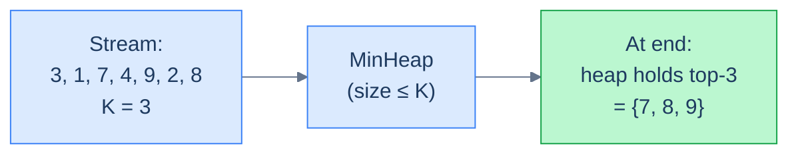
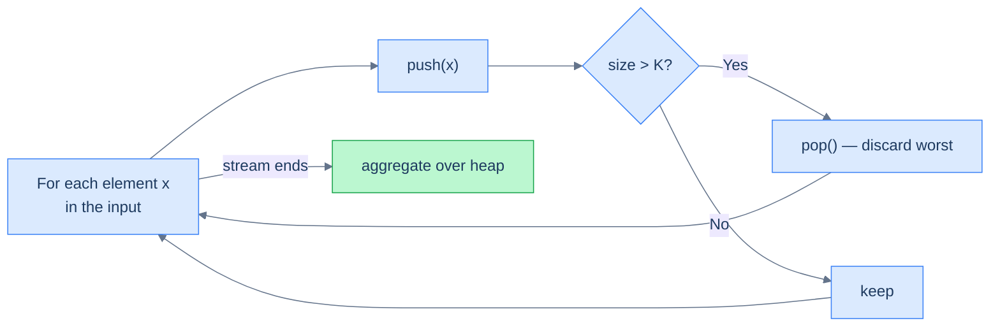
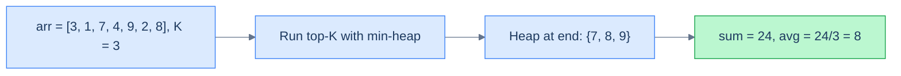
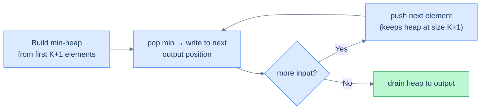

# 3. Pattern: Top K Elements

## The Hook

"Show me the top 10 highest-scoring users." "Find the 100 nearest restaurants." "Pull the 5 most expensive pending orders." Every backend you've ever touched runs this query a hundred times a minute.

The naive answer is **sort everything, take the first K**. That's `O(n log n)` time and `O(n)` extra space — fine for `n = 100`, ruinous for `n = 100 million`. And nine times out of ten you only care about the **top K**, where K is small. You're throwing away the work of sorting the other 99,999,990 elements that you never look at.

There's a much smarter trick. **Maintain a small heap of size exactly K**, and stream the elements through it. At any moment the heap holds *the best K candidates seen so far*. New elements either belong in the top K (push, then evict the worst) or don't (skip). When the stream ends, the heap *is* the answer. **Time: O(n log K). Space: O(K).** When K is much smaller than n, that's a dramatic win — and the algorithm works on streams you can't even store.

This is the **Top K Elements** pattern, and it's the single most common heap idiom in interviews and production systems alike. Once you internalise it — *fixed-size heap as a sliding-window over the sorted stream* — half the heap problems you'll ever see become formulaic.

---

## Table of Contents

1. [Understanding the top k elements pattern](#understanding-the-top-k-elements-pattern)
2. [Identifying the top k elements pattern](#identifying-the-top-k-elements-pattern)
3. [Kth largest element](#kth-largest-element)
4. [Kth smallest element](#kth-smallest-element)
5. [K range sum](#k-range-sum)
6. [K sorted array sorting](#k-sorted-array-sorting)

***

# Understanding the top K elements pattern

The pattern boils down to a counter-intuitive trick: **to track the K largest values, use a min-heap of size K, not a max-heap**.

> *Friction prompt — predict before reading on. Why min-heap for the K largest? It feels backwards.*

Because the heap's job is to **identify the smallest of your top-K-so-far** — that's the value you need to compare against to decide whether a new element belongs in the club. If the new element beats the current min of the top-K, it kicks the min out and joins the heap. If not, it's worse than everything you've already accepted, so it's discarded.



<p align="center"><strong>Top-K-largest with a min-heap of size K. Each element is pushed; if the heap exceeds K, the min is popped. The min of a heap that always holds the best K candidates is the K-th largest seen so far.</strong></p>

The mirror version is just as crucial: **for the K smallest, use a max-heap of size K**. The max of the top-K-smallest-so-far is the threshold you compare against.

| Want | Use a heap of type | Why |
|---|---|---|
| K **largest** | **Min**-heap of size K | The min of the top-K is the threshold to beat |
| K **smallest** | **Max**-heap of size K | The max of the bottom-K is the threshold to beat |

## The top K technique

For each element in the stream:

1. Push it into the heap.
2. If the heap now holds more than K elements, pop the top.

After the stream ends, the heap holds the K most-extreme values. To compute an aggregate (sum, average, list) over those K, drain the heap and apply your aggregation function `f`.



<p align="center"><strong>The top-K loop. Constant-size heap, O(log K) per element, single pass.</strong></p>

## Algorithm

> **Algorithm**
>
> - **Step 1:** Create an empty heap (min-heap for top-K-largest, max-heap for top-K-smallest).
> - **Step 2:** For each element `x` in the input:
>   - **Step 2.1:** Push `x` onto the heap.
>   - **Step 2.2:** If `heap.size() > K`, pop the top.
> - **Step 3:** Drain the heap, applying `f` to each popped element to build the aggregate.
> - **Step 4:** Return the aggregate.

## Complexity Analysis

For an array of `n` elements with the heap capped at size `K`:

| Step | Cost |
|---|---|
| Push + possible pop, per element | O(log K) |
| Total across `n` elements | **O(n log K)** |
| Final drain of the heap | O(K log K) |
| Space (heap of size K) | **O(K)** |

When `K << n`, that's dramatically better than `O(n log n)` from a full sort. When `K = n`, the two are equal. **You can never lose with the top-K trick.**

***

# Identifying the top k elements pattern

The pattern fits whenever the problem mentions:

- **"K largest" / "K smallest" / "K most/least frequent"** — the canonical phrasing.
- **"K-th"** anything — the K-th largest, K-th smallest, K-th frequent. (Just take the heap's top *after* processing the stream.)
- **"Closest K"** — for points to a target, words to a query, etc. The "score" is the distance, and you want the smallest distances.
- **"Top-K aggregate"** — average, sum, set of the top-K values.

If the problem boils down to *"compute something over the K extreme values of a stream/array"*, reach for the fixed-size heap.

## Worked example — average of K largest

> **Problem:** Given an array of integers and an integer K, return the average of the K largest values.

The fit:

- **Aggregation function `f`** = "running sum, divide by K at the end".
- **Heap type** = min-heap of size K (we want largest).



<p align="center"><strong>Average of the K largest. The pattern handles the "select" step; the aggregation step is whatever the problem needs.</strong></p>

***

# Kth largest element

## Problem Statement

Given an array `arr` and a positive integer `k`, return the K-th largest element. Use a heap.

### Example 1

> - **Input:** `arr = [5, 4, 2, 8]`, `k = 2`
> - **Output:** `5`

### Example 2

> - **Input:** `arr = [1, 2, 3, 4, 5]`, `k = 5`
> - **Output:** `1`

### Example 3

> - **Input:** `arr = [7, 5, 9]`, `k = 3`
> - **Output:** `5`

## The Strategy

This is the rawest form of the pattern. After running the loop, the heap's *top* (the smallest element of the K largest) **is** the K-th largest in the original array.

## The Solution


```pseudocode
function kthLargestElement(arr, k):
    minHeap ← empty min-heap
    for each v in arr:
        push v onto minHeap
        if size(minHeap) > k:
            pop from minHeap       # evict the smallest — keeps only the K largest
    return peek(minHeap)           # smallest of the K largest = K-th largest overall
```

```python run
import heapq
from typing import List

class Solution:
    def kth_largest_element(self, arr: List[int], k: int) -> int:
        # Min-heap of size K — its top is the K-th largest seen so far.
        min_heap: List[int] = []
        for v in arr:
            heapq.heappush(min_heap, v)
            # Heap must never exceed K elements; pop when it does.
            if len(min_heap) > k:
                heapq.heappop(min_heap)
        # After all pushes/pops, the smallest in the K-largest set is the answer.
        return min_heap[0]
```

```java run
import java.util.*;

class Solution {
    public int kthLargestElement(int[] arr, int k) {
        PriorityQueue<Integer> minHeap = new PriorityQueue<>();                    // min-heap by default
        for (int v : arr) {
            minHeap.add(v);
            if (minHeap.size() > k) minHeap.poll();                                // keep only top-K
        }
        return minHeap.peek();                                                      // heap top = K-th largest
    }
}
```

```c run
// Minimal binary min-heap on a fixed-size buffer (size cap = k+1 to allow overflow then pop).
#include <stdlib.h>

static void hswap(int *a, int *b) { int t = *a; *a = *b; *b = t; }

static void heap_push(int *h, int *n, int v) {
    h[(*n)++] = v;
    int i = *n - 1;
    while (i > 0) {
        int p = (i - 1) / 2;
        if (h[p] > h[i]) { hswap(&h[p], &h[i]); i = p; } else break;
    }
}

static void heap_pop(int *h, int *n) {
    h[0] = h[--(*n)];
    int i = 0;
    while (1) {
        int l = 2*i+1, r = 2*i+2, smallest = i;
        if (l < *n && h[l] < h[smallest]) smallest = l;
        if (r < *n && h[r] < h[smallest]) smallest = r;
        if (smallest == i) return;
        hswap(&h[i], &h[smallest]);
        i = smallest;
    }
}

int kthLargestElement(int *arr, int n, int k) {
    int *heap = malloc(sizeof(int) * (k + 1));
    int hsize = 0;
    for (int i = 0; i < n; i++) {
        heap_push(heap, &hsize, arr[i]);
        if (hsize > k) heap_pop(heap, &hsize);
    }
    int ans = heap[0];                                                              // K-th largest
    free(heap);
    return ans;
}
```

```scala run
import scala.collection.mutable.PriorityQueue

object Solution {
  def kthLargestElement(arr: Array[Int], k: Int): Int = {
    // PriorityQueue is max-heap by default; reverse to make a min-heap.
    val minHeap = PriorityQueue.empty[Int](Ordering[Int].reverse)
    for (v <- arr) {
      minHeap.enqueue(v)
      if (minHeap.size > k) minHeap.dequeue()
    }
    minHeap.head                                                                     // top of min-heap = K-th largest
  }
}
```


<details>
<summary><strong>Trace — arr = [5, 4, 2, 8], k = 2</strong></summary>

```
Step 1 │ push(5)         → heap = [5]                    (size 1 ≤ 2)
Step 2 │ push(4)         → heap = [4, 5]                 (size 2 ≤ 2)
Step 3 │ push(2)         → heap = [2, 5, 4]              (size 3 > 2 → pop 2)
                         → heap = [4, 5]
Step 4 │ push(8)         → heap = [4, 5, 8]              (size 3 > 2 → pop 4)
                         → heap = [5, 8]
Result: heap.top() = 5  ✓ (the 2nd largest)
```

</details>

***

# Kth smallest element

## Problem Statement

Given an array `arr` and a positive integer `k`, return the K-th smallest element. Use a heap.

### Example 1

> - **Input:** `arr = [5, 4, 2, 8]`, `k = 2`
> - **Output:** `4`

### Example 2

> - **Input:** `arr = [1, 2, 3, 4, 5]`, `k = 5`
> - **Output:** `5`

### Example 3

> - **Input:** `arr = [7, 5, 9]`, `k = 3`
> - **Output:** `9`

## The Strategy

The mirror image of the previous problem. To track the K *smallest* values, use a **max-heap** of size K — its top is the largest of the bottom-K, which (after we've seen everything) is the K-th smallest in the array.

## The Solution


```pseudocode
function kthSmallestElement(arr, k):
    maxHeap ← empty max-heap
    for each v in arr:
        push v onto maxHeap
        if size(maxHeap) > k:
            pop from maxHeap       # evict the largest — keeps only the K smallest
    return peek(maxHeap)           # largest of the K smallest = K-th smallest overall
```

```python run
import heapq
from typing import List

class Solution:
    def kth_smallest_element(self, arr: List[int], k: int) -> int:
        # Python's heapq is min-only. Negate to fake a max-heap.
        max_heap: List[int] = []
        for v in arr:
            heapq.heappush(max_heap, -v)         # store negated → smallest-of-negated = largest-of-original
            if len(max_heap) > k:
                heapq.heappop(max_heap)          # evict the most negative (largest original)
        # The top of the max-heap (smallest negated) is the K-th smallest original value.
        return -max_heap[0]
```

```java run
import java.util.*;

class Solution {
    public int kthSmallestElement(int[] arr, int k) {
        // reverseOrder() flips the natural ordering — gives us a max-heap.
        PriorityQueue<Integer> maxHeap = new PriorityQueue<>(Comparator.reverseOrder());
        for (int v : arr) {
            maxHeap.add(v);
            if (maxHeap.size() > k) maxHeap.poll();                                                       // evict the largest
        }
        return maxHeap.peek();                                                                             // K-th smallest
    }
}
```

```c run
#include <stdlib.h>

static void hswap2(int *a, int *b) { int t = *a; *a = *b; *b = t; }

static void max_push(int *h, int *n, int v) {
    h[(*n)++] = v;
    int i = *n - 1;
    while (i > 0) {
        int p = (i - 1) / 2;
        if (h[p] < h[i]) { hswap2(&h[p], &h[i]); i = p; } else break;
    }
}

static void max_pop(int *h, int *n) {
    h[0] = h[--(*n)];
    int i = 0;
    while (1) {
        int l = 2*i+1, r = 2*i+2, largest = i;
        if (l < *n && h[l] > h[largest]) largest = l;
        if (r < *n && h[r] > h[largest]) largest = r;
        if (largest == i) return;
        hswap2(&h[i], &h[largest]);
        i = largest;
    }
}

int kthSmallestElement(int *arr, int n, int k) {
    int *heap = malloc(sizeof(int) * (k + 1));
    int hsize = 0;
    for (int i = 0; i < n; i++) {
        max_push(heap, &hsize, arr[i]);
        if (hsize > k) max_pop(heap, &hsize);
    }
    int ans = heap[0];
    free(heap);
    return ans;
}
```

```scala run
import scala.collection.mutable.PriorityQueue

object Solution {
  def kthSmallestElement(arr: Array[Int], k: Int): Int = {
    val maxHeap = PriorityQueue.empty[Int]                                                                    // max-heap by default
    for (v <- arr) {
      maxHeap.enqueue(v)
      if (maxHeap.size > k) maxHeap.dequeue()
    }
    maxHeap.head                                                                                              // K-th smallest
  }
}
```


***

# K range sum

## Problem Statement

Given an array `arr` and two positive integers `k1` and `k2`, return the **sum of all elements** whose values lie in the inclusive range bounded by the K1-th largest element and the K2-th smallest element.

### Example 1

> - **Input:** `arr = [4, 2, 5, 1, 3, 6]`, `k1 = 4`, `k2 = 5`
> - **Output:** `12`
> - **Explanation:** K1 (4)-th largest is `3`; K2 (5)-th smallest is `5`. Sum of all elements in `[3, 5]` = `3 + 4 + 5 = 12`.

### Example 2

> - **Input:** `arr = [1, 2, 6, 4, 5]`, `k1 = 3`, `k2 = 4`
> - **Output:** `9`

### Example 3

> - **Input:** `arr = [1, 2, 3, 4, 5]`, `k1 = 1`, `k2 = 1`
> - **Output:** `15`

## The Strategy

This is *two* independent top-K queries followed by a linear sum:

1. Find the K1-th largest using a min-heap (the previous problem).
2. Find the K2-th smallest using a max-heap.
3. Walk the array once, summing elements whose value lies in `[min(a, b), max(a, b)]` (we use min/max to be defensive — the K1-th largest could in theory be larger or smaller than the K2-th smallest depending on inputs).

## The Solution


```pseudocode
function kRangeSum(arr, k1, k2):
    a ← kthLargestElement(arr, k1)  # k1-th largest (upper boundary)
    b ← kthSmallestElement(arr, k2) # k2-th smallest (lower boundary)
    lo ← min(a, b)
    hi ← max(a, b)
    total ← 0
    for each v in arr:
        if lo ≤ v ≤ hi: total ← total + v
    return total
```

```python run
import heapq
from typing import List

class Solution:
    def kth_largest(self, arr: List[int], k: int) -> int:
        h: List[int] = []
        for v in arr:
            heapq.heappush(h, v)
            if len(h) > k:
                heapq.heappop(h)
        return h[0]

    def kth_smallest(self, arr: List[int], k: int) -> int:
        # Negate to simulate a max-heap with heapq.
        h: List[int] = []
        for v in arr:
            heapq.heappush(h, -v)
            if len(h) > k:
                heapq.heappop(h)
        return -h[0]

    def k_range_sum(self, arr: List[int], k1: int, k2: int) -> int:
        n = len(arr)
        if n == 0 or k1 > n or k2 > n:
            return 0                                  # range out of bounds
        a = self.kth_largest(arr, k1)
        b = self.kth_smallest(arr, k2)
        lo, hi = min(a, b), max(a, b)
        # Sum every value in the (inclusive) range [lo, hi].
        return sum(v for v in arr if lo <= v <= hi)
```

```java run
import java.util.*;

class Solution {
    private int kthLargest(int[] arr, int k) {
        PriorityQueue<Integer> h = new PriorityQueue<>();
        for (int v : arr) { h.add(v); if (h.size() > k) h.poll(); }
        return h.peek();
    }
    private int kthSmallest(int[] arr, int k) {
        PriorityQueue<Integer> h = new PriorityQueue<>(Comparator.reverseOrder());
        for (int v : arr) { h.add(v); if (h.size() > k) h.poll(); }
        return h.peek();
    }

    public int kRangeSum(int[] arr, int k1, int k2) {
        int n = arr.length;
        if (n == 0 || k1 > n || k2 > n) return 0;
        int a = kthLargest(arr, k1);
        int b = kthSmallest(arr, k2);
        int lo = Math.min(a, b), hi = Math.max(a, b);
        int sum = 0;
        for (int v : arr) if (v >= lo && v <= hi) sum += v;
        return sum;
    }
}
```

```c run
// reuses heap_push/heap_pop (min-heap) and max_push/max_pop from earlier blocks
#include <stdlib.h>

extern void heap_push(int *h, int *n, int v);
extern void heap_pop (int *h, int *n);
extern void max_push (int *h, int *n, int v);
extern void max_pop  (int *h, int *n);

static int kth_largest_local(int *arr, int n, int k) {
    int *h = malloc(sizeof(int) * (k + 1)); int sz = 0;
    for (int i = 0; i < n; i++) { heap_push(h, &sz, arr[i]); if (sz > k) heap_pop(h, &sz); }
    int a = h[0]; free(h); return a;
}
static int kth_smallest_local(int *arr, int n, int k) {
    int *h = malloc(sizeof(int) * (k + 1)); int sz = 0;
    for (int i = 0; i < n; i++) { max_push(h, &sz, arr[i]); if (sz > k) max_pop(h, &sz); }
    int a = h[0]; free(h); return a;
}

int kRangeSum(int *arr, int n, int k1, int k2) {
    if (n == 0 || k1 > n || k2 > n) return 0;
    int a = kth_largest_local(arr, n, k1);
    int b = kth_smallest_local(arr, n, k2);
    int lo = a < b ? a : b, hi = a > b ? a : b;
    int sum = 0;
    for (int i = 0; i < n; i++) if (arr[i] >= lo && arr[i] <= hi) sum += arr[i];
    return sum;
}
```

```scala run
import scala.collection.mutable.PriorityQueue

object Solution {
  private def kthLargest(arr: Array[Int], k: Int): Int = {
    val h = PriorityQueue.empty[Int](Ordering[Int].reverse)
    for (v <- arr) { h.enqueue(v); if (h.size > k) h.dequeue() }
    h.head
  }
  private def kthSmallest(arr: Array[Int], k: Int): Int = {
    val h = PriorityQueue.empty[Int]
    for (v <- arr) { h.enqueue(v); if (h.size > k) h.dequeue() }
    h.head
  }

  def kRangeSum(arr: Array[Int], k1: Int, k2: Int): Int = {
    val n = arr.length
    if (n == 0 || k1 > n || k2 > n) return 0
    val a = kthLargest(arr, k1)
    val b = kthSmallest(arr, k2)
    val lo = math.min(a, b); val hi = math.max(a, b)
    arr.filter(v => v >= lo && v <= hi).sum
  }
}
```


***

# K sorted array sorting

## Problem Statement

Given an array `arr` where every element is at most `k` positions away from its sorted position, sort the array in place in **`O(n log k)`** or better.

> A "K-sorted" array is *almost* sorted — every element is at most K positions out of place. Real-world example: data merged from `K` sorted streams; sensor readings with bounded jitter.

### Example 1

> - **Input:** `arr = [6, 5, 3, 2, 8, 10, 9]`, `k = 3`
> - **Output:** `[2, 3, 5, 6, 8, 9, 10]`

### Example 2

> - **Input:** `arr = [10, 9, 8, 7, 4, 70, 60, 50]`, `k = 4`
> - **Output:** `[4, 7, 8, 9, 10, 50, 60, 70]`

### Example 3

> - **Input:** `arr = [1, 2, 3]`, `k = 0`
> - **Output:** `[1, 2, 3]`

## The Strategy

A general sort is `O(n log n)`. The K-sortedness *constraint* — every element is at most K positions misplaced — lets us do better.

**Key insight:** the smallest element of the entire array is somewhere in the **first K+1 positions** (it can be at most K positions out of place from index 0). So if we min-heapify the first K+1 elements, the heap's top **is** the global minimum. We pop it, write it to position 0, push `arr[K+1]` to keep the heap at size K+1, and now the heap's top is the second smallest. Repeat.



<p align="center"><strong>K-sorted sort with a sliding K+1 min-heap. Each step: pop the min into the output, push the next input.</strong></p>

> **Algorithm**
>
> - **Step 1:** Build a min-heap of size `K+1` from `arr[0..K]`.
> - **Step 2:** For `i = K+1` to `n-1`:
>   - Pop the min and write it to `arr[i - K - 1]`.
>   - Push `arr[i]` into the heap.
> - **Step 3:** Drain the remaining `K+1` elements from the heap into the tail of `arr`.

Total work: `n + 1` pushes, `n` pops, all on a heap of size at most `K+1` → **`O(n log K)`**.

## The Solution


```pseudocode
function kSortedArraySorting(arr, k):
    if arr is empty OR k = 0: return
    # Load first K+1 elements — the true arr[0] must be among them.
    heap ← min-heap of arr[0 .. k]
    outIdx ← 0
    for i from k+1 to length(arr) − 1:
        arr[outIdx] ← pop from heap   # smallest of the window → correct output slot
        push arr[i] onto heap         # slide window right by one
        outIdx ← outIdx + 1
    while heap is NOT empty:          # drain remaining elements
        arr[outIdx] ← pop from heap
        outIdx ← outIdx + 1
```

```python run
import heapq
from typing import List

class Solution:
    def k_sorted_array_sorting(self, arr: List[int], k: int) -> None:
        n = len(arr)
        if n == 0 or k == 0:
            return                                          # already sorted (k=0 means "exactly in place")
        # Build min-heap from the first K+1 elements (all candidates for arr[0]).
        heap = arr[:k + 1]
        heapq.heapify(heap)
        # Stream the remaining elements through, popping into the output.
        out_idx = 0
        for i in range(k + 1, n):
            arr[out_idx] = heapq.heappushpop(heap, arr[i])  # one-step push-then-pop
            out_idx += 1
        # Drain the rest.
        while heap:
            arr[out_idx] = heapq.heappop(heap)
            out_idx += 1
```

```java run
import java.util.*;

class Solution {
    public void kSortedArraySorting(int[] arr, int k) {
        int n = arr.length;
        if (n == 0 || k == 0) return;
        PriorityQueue<Integer> heap = new PriorityQueue<>();
        for (int i = 0; i <= k && i < n; i++) heap.add(arr[i]);                                                       // build size K+1

        int outIdx = 0;
        for (int i = k + 1; i < n; i++) {
            arr[outIdx++] = heap.poll();                                                                              // pop min → output
            heap.add(arr[i]);                                                                                          // push next
        }
        while (!heap.isEmpty()) arr[outIdx++] = heap.poll();                                                           // drain
    }
}
```

```c run
extern void heap_push(int *h, int *n, int v);
extern void heap_pop (int *h, int *n);

void kSortedArraySorting(int *arr, int n, int k) {
    if (n == 0 || k == 0) return;
    int *h = malloc(sizeof(int) * (k + 2));
    int hsize = 0;
    for (int i = 0; i <= k && i < n; i++) heap_push(h, &hsize, arr[i]);
    int out_idx = 0;
    for (int i = k + 1; i < n; i++) {
        int top = h[0];
        heap_pop(h, &hsize);
        arr[out_idx++] = top;
        heap_push(h, &hsize, arr[i]);
    }
    while (hsize) {
        arr[out_idx++] = h[0];
        heap_pop(h, &hsize);
    }
    free(h);
}
```

```scala run
import scala.collection.mutable.PriorityQueue

object Solution {
  def kSortedArraySorting(arr: Array[Int], k: Int): Unit = {
    val n = arr.length
    if (n == 0 || k == 0) return
    val heap = PriorityQueue.empty[Int](Ordering[Int].reverse)
    var i = 0
    while (i <= k && i < n) { heap.enqueue(arr(i)); i += 1 }
    var outIdx = 0
    while (i < n) {
      arr(outIdx) = heap.dequeue(); outIdx += 1
      heap.enqueue(arr(i)); i += 1
    }
    while (heap.nonEmpty) { arr(outIdx) = heap.dequeue(); outIdx += 1 }
  }
}
```


<details>
<summary><strong>Trace — arr = [6, 5, 3, 2, 8, 10, 9], k = 3</strong></summary>

```
n = 7, build heap from arr[0..=3] = [6, 5, 3, 2] → heap = {2, 3, 5, 6}

Step 1 │ i = 4 │ pop 2 → arr[0] = 2 │ push 8  → heap = {3, 5, 6, 8}
Step 2 │ i = 5 │ pop 3 → arr[1] = 3 │ push 10 → heap = {5, 6, 8, 10}
Step 3 │ i = 6 │ pop 5 → arr[2] = 5 │ push 9  → heap = {6, 8, 9, 10}
Drain  │ pop 6 → arr[3] = 6
       │ pop 8 → arr[4] = 8
       │ pop 9 → arr[5] = 9
       │ pop 10 → arr[6] = 10
Result: [2, 3, 5, 6, 8, 9, 10] ✓
```

</details>

***

## Final Takeaway

The Top-K pattern is one of the highest-leverage idioms in algorithms. **Maintain a fixed-size heap of size K**, stream the data through, and you've reduced an `O(n log n)` sort to **`O(n log K)`** — a strict improvement when `K << n`, and the foundation of every "leaderboard / closest-K / top-rated" feature in production.

Three patterns to internalise:

1. **Min-heap for K largest, max-heap for K smallest** — the heap holds the *threshold-keepers* of your top-K, so you want fast access to the *worst* of the kept ones.
2. **`heappushpop` is the magic primitive.** Pushing then immediately popping (when the heap is at capacity) is one operation in most heap libraries, and the most efficient way to write the "maybe replace the worst" pattern.
3. **K is a budget, not a hard limit.** Even when the problem doesn't explicitly bound K, this pattern works for any "top-K-of-a-stream" where the universe is too big to sort. Logging hot keys in a cache, top error messages by frequency, top-spending users — all the same shape.

The next lesson generalises away from `int` heaps: **comparators**. Once you can give your heap an arbitrary ordering function, "top K" applies to strings, structs, tuples, and any total-order domain you care about — opening the door to half the heap problems you'll meet in interviews and the wild.
