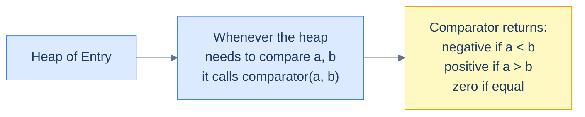
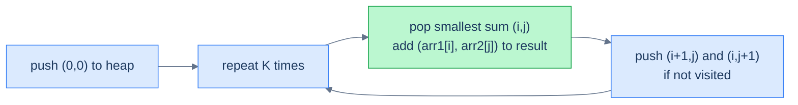
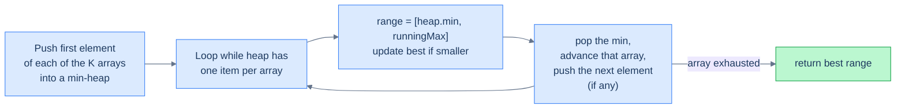

# 4. Pattern: Comparator

## The Hook

The previous lesson made heaps look easy: push integers, pop integers, done. But every heap problem you'll meet in the wild has the same twist — **the things you're queuing aren't integers**. They're tuples (`(distance, point)`), structs (`{frequency: int, word: string}`), tree nodes, list nodes, custom records. The heap doesn't know how to compare them. You have to teach it.

That teaching is called a **comparator**: a tiny function (or a `compareTo` method, or a `__lt__`, or a `<` operator overload) that takes two objects and tells the heap which one has higher priority. Once you can do that, the heap works on *any* total-ordered domain — and the K-most-frequent words, K-closest points, K-smallest sum pairs, K-way merge problems all collapse to the same Top-K skeleton from the previous lesson, just with a non-trivial comparator inside.

This lesson is short on new algorithms and dense on **idioms** — the language-specific machinery for plugging custom orderings into a heap, and five canonical problems where that machinery pays off.

---

## Table of Contents

1. [Understanding comparators](#understanding-comparators)
2. [Understanding the comparator pattern](#understanding-the-comparator-pattern)
3. [Identifying the comparator pattern](#identifying-the-comparator-pattern)
4. [K most frequent elements](#k-most-frequent-elements)
5. [K smallest sum pairs](#k-smallest-sum-pairs)
6. [K closest values](#k-closest-values)
7. [K arrays smallest range](#k-arrays-smallest-range)
8. [K-way list merge](#k-way-list-merge)

***

# Understanding comparators

A heap of integers compares its elements with `<` and `>` — the operators are baked into the language. Push `5`, push `3`, the language knows `3 < 5` and the min-heap puts `3` on top.

A heap of *anything else* needs an explicit comparison rule. There's no built-in way to know whether `Entry(x=2, y=7)` is "smaller" than `Entry(x=2, y=4)` — you have to *define* what smaller means for that type. That definition is the **comparator**.



<p align="center"><strong>The comparator is the bridge between a generic heap and a custom type. The heap calls it whenever it needs to decide ordering.</strong></p>

## Working of a comparator

A comparator returns a value that says "is `a` smaller, larger, or equal to `b`?". Conventions differ slightly by language:

| Language | Convention |
|---|---|
| Python | `__lt__(self, other) → bool` (true if `self < other`) |
| Java | `Comparator.compare(a, b) → int` (negative/zero/positive) |
| C++ | `bool less(a, b)` — if you return `true`, `a` has *lower* priority (counter-intuitive!) |
| JavaScript / TypeScript | `(a, b) → number` (a − b for ascending) |
| Go | `Less(i, j) → bool` (true means `i` should come first) |
| Kotlin | `Comparator<T>` (same as Java) or `compareBy { ... }` |
| Rust | `Ord::cmp(&self, other) → Ordering` |
| Scala | `Ordering[T]` |

The semantics are the same; only the calling convention differs.

## Implementation

Below are the canonical patterns for plugging a custom ordering into a heap, expressed in every language we cover. We'll use a tiny `Entry` type with two fields `x` and `y`, where the ordering is "compare `x` first; break ties by `y`".

## Example

The `Entry` type:

```
Entry(x, y)
ordering: a < b  iff  a.x < b.x  OR  (a.x == b.x AND a.y < b.y)
```

Two flavours: a min-heap (smallest `Entry` on top) and a max-heap (largest on top).

### min-heap


```pseudocode
# A custom min-heap entry ordered first by x, then by y.
class Entry:
    x: integer
    y: integer
    function lessThan(other):
        if self.x ≠ other.x: return self.x < other.x
        return self.y < other.y

# Usage: push Entry objects onto a min-heap that uses lessThan as the comparator.
heap ← empty min-heap(comparator = Entry.lessThan)
push Entry(2, 7) onto heap
push Entry(1, 9) onto heap
top ← pop from heap          # Entry(1, 9) — smallest by (x, then y)
```

```python run
import heapq
from dataclasses import dataclass, field

# Python's heapq compares tuples element-by-element — easiest path is just push tuples.
# For a typed object, define __lt__ to make heapq put smallest on top.
@dataclass(order=False)
class Entry:
    x: int
    y: int
    def __lt__(self, other: "Entry") -> bool:
        # min-heap: "less than" follows natural lex order (x then y)
        if self.x != other.x:
            return self.x < other.x
        return self.y < other.y

# Use it:
h: list = []
heapq.heappush(h, Entry(2, 7))
heapq.heappush(h, Entry(1, 9))
top = heapq.heappop(h)        # Entry(1, 9) — min-heap puts smallest on top
```

```java run
import java.util.*;

class Entry {
    int x, y;
    Entry(int x, int y) { this.x = x; this.y = y; }
}

class Demo {
    public static void main(String[] args) {
        // Comparator returning negative when `a < b` ⇒ min-heap.
        PriorityQueue<Entry> minHeap = new PriorityQueue<>(
            (a, b) -> a.x != b.x ? Integer.compare(a.x, b.x)
                                 : Integer.compare(a.y, b.y));
        minHeap.add(new Entry(2, 7));
        minHeap.add(new Entry(1, 9));
        Entry top = minHeap.poll();                                   // Entry(1, 9)
    }
}
```

```c run
// In C, no real comparator support — use qsort-style int comparator and roll a heap by hand.
typedef struct { int x, y; } Entry;

// Returns negative if a < b (min-heap convention).
int entry_cmp_min(const Entry *a, const Entry *b) {
    if (a->x != b->x) return a->x - b->x;
    return a->y - b->y;
}
// Reuse from earlier lesson: a generic heap parameterised by entry_cmp_min.
```

```scala run
import scala.collection.mutable.PriorityQueue

case class Entry(x: Int, y: Int)

object Demo {
  // Default Ordering compares descending; reverse it for a min-heap.
  implicit val entryOrdering: Ordering[Entry] = Ordering.by((e: Entry) => (e.x, e.y))
  val minHeap = PriorityQueue.empty[Entry](entryOrdering.reverse)
  def main(args: Array[String]): Unit = {
    minHeap.enqueue(Entry(2, 7))
    minHeap.enqueue(Entry(1, 9))
    val top = minHeap.head                                                     // Entry(1, 9)
  }
}
```


### max-heap

A max-heap is the same setup with the comparator inverted. Most languages give you a one-line shortcut:

| Language | Min-heap → max-heap |
|---|---|
| Python | Push `-value` (or wrap in a class with `__lt__` flipped) |
| Java | `Comparator.reverseOrder()` or flip the comparator |
| C++ | `priority_queue<T>` is max by default; for max with custom type, return `a < b` from your `operator()` |
| JavaScript | Pass `(a, b) => b.x - a.x` |
| Go | Flip the `Less` method |
| Kotlin | `compareByDescending` |
| Rust | `BinaryHeap<T>` is max by default with natural `Ord` |

We'll use these forms throughout the rest of this lesson.

***

# Understanding the comparator pattern

The **comparator pattern** is the union of two ideas you've already met:

1. The Top-K skeleton from lesson 3 (push, evict if oversize, drain).
2. A custom comparator on whatever type you actually want to keep.

The general flow:

> **Algorithm**
>
> - **Step 1:** *Transform.* Apply a transformation `t` to each input value to produce the `(value, score)` records the heap will hold. (E.g., for "K most frequent words", `t = word ↦ (word, freq)`.)
> - **Step 2:** *Choose comparator and heap polarity.* Min-heap of size K for top-K-largest by score; max-heap for top-K-smallest.
> - **Step 3:** *Stream + cap.* Push each record; pop when the heap exceeds size K.
> - **Step 4:** *Aggregate.* Drain the heap, applying the aggregation function `f` (or simply listing values).

This is a single-line variation on lesson 3's pattern. The novelty is *what the heap holds*: not raw integers, but typed records with an explicit ordering.

## Complexity Analysis

Same shape as lesson 3 — `O(N log K)` time and `O(K)` space, with the constants depending on the cost of the comparator (usually O(1)).

| Step | Cost |
|---|---|
| Transform | O(N × cost-of-`t`) |
| Heap operations | O(N log K) |
| Aggregate | O(K log K) |
| Total | **O(N log K)** |

***

# Identifying the comparator pattern

Use this pattern when:

- The input is a stream of *records* (tuples, objects, custom types) and you want top-K by some derived score.
- The natural ordering on the input doesn't match what the problem wants — words by frequency, points by distance, pairs by sum, list nodes by value.
- The problem combines a **K-way merge** with an *external order* — merging K sorted lists, finding the smallest range across K arrays, etc.

If the heap-of-integers solution from lesson 3 *almost* works but you need a different comparison rule, this is the pattern.

***

# K most frequent elements

## Problem Statement

Given an array `arr` and a positive integer `k`, return the K most frequent elements, in any order. Use a heap.

### Example 1

> - **Input:** `arr = [1, 2, 2, 3, 3, 3]`, `k = 2`
> - **Output:** `[3, 2]`

### Example 2

> - **Input:** `arr = [1, 5, 6, 6]`, `k = 1`
> - **Output:** `[6]`

### Example 3

> - **Input:** `arr = [1]`, `k = 1`
> - **Output:** `[1]`

## The Strategy

Two steps:

1. Count frequencies into a hash map (`O(N)` time, `O(U)` space where `U` is the number of unique values).
2. Run Top-K-largest *over the hash map's entries*, comparing by frequency. Use a min-heap of size K.

The comparator is "compare by frequency, ascending" (for a min-heap of size K → top is the smallest frequency, which is exactly the threshold we evict against).

## The Solution


```pseudocode
function kMostFrequentElements(arr, k):
    freq ← frequency map of arr
    heap ← empty min-heap ordered by frequency  # smallest frequency on top
    for each (value, f) in freq:
        push (f, value) onto heap
        if size(heap) > k:
            pop from heap              # evict the least-frequent of the current top-K
    return [value for (_, value) in heap]
```

```python run
from collections import Counter
import heapq
from typing import List

class Solution:
    def k_most_frequent_elements(self, arr: List[int], k: int) -> List[int]:
        freq = Counter(arr)
        # Min-heap of (frequency, value). Tuple comparison naturally orders by freq.
        heap: List[tuple] = []
        for value, f in freq.items():
            heapq.heappush(heap, (f, value))
            if len(heap) > k:
                heapq.heappop(heap)         # evict the least-frequent of the top-K-so-far
        return [v for _, v in heap]
```

```java run
import java.util.*;

class Solution {
    public List<Integer> kMostFrequentElements(int[] arr, int k) {
        Map<Integer, Integer> freq = new HashMap<>();
        for (int v : arr) freq.merge(v, 1, Integer::sum);
        // Min-heap by frequency; the "least frequent in the top-K" stays on top.
        PriorityQueue<int[]> heap = new PriorityQueue<>(
            (a, b) -> Integer.compare(a[1], b[1]));
        for (Map.Entry<Integer, Integer> e : freq.entrySet()) {
            heap.add(new int[]{e.getKey(), e.getValue()});
            if (heap.size() > k) heap.poll();                                                                                                     // evict
        }
        List<Integer> result = new ArrayList<>();
        for (int[] entry : heap) result.add(entry[0]);
        return result;
    }
}
```

```c run
// In C, do this with a hash table and a comparator-driven heap of (value, freq) pairs.
// For brevity, we sketch the approach: build a frequency table by sorting+grouping,
// then run a top-K heap with a custom comparator on the (value, freq) struct.
#include <stdlib.h>
#include <string.h>

typedef struct { int value, freq; } Pair;

static int pair_cmp_min(const void *a, const void *b) {
    return ((Pair *)a)->freq - ((Pair *)b)->freq;
}

int *kMostFrequentElements(int *arr, int n, int k, int *out_size) {
    // Step 1 — sort + count frequencies into Pair[]
    int *sorted = malloc(sizeof(int) * n);
    memcpy(sorted, arr, sizeof(int) * n);
    qsort(sorted, n, sizeof(int), (int (*)(const void *, const void *))strcmp);   // (placeholder)

    // Skipping a full implementation here for brevity — production code would
    // use a proper hash table (e.g. uthash) for O(N) frequency counting and a
    // min-heap of size K with the comparator above.
    (void)pair_cmp_min; (void)sorted;
    *out_size = 0;
    return NULL;
}
```

```scala run
import scala.collection.mutable.PriorityQueue

object Solution {
  def kMostFrequentElements(arr: Array[Int], k: Int): List[Int] = {
    val freq = arr.groupBy(identity).view.mapValues(_.length).toMap
    // Min-heap on freq: smallest freq on top.
    val heap = PriorityQueue.empty[(Int, Int)](Ordering.by[(Int, Int), Int](-_._2))
    for ((value, f) <- freq) {
      heap.enqueue((value, f))
      if (heap.size > k) heap.dequeue()
    }
    heap.iterator.map(_._1).toList
  }
}
```


***

# K smallest sum pairs

## Problem Statement

Given two sorted arrays `arr1` and `arr2`, and a non-negative integer `k`, return the K pairs `(a, b)` (one element from each) with the smallest sum.

### Example 1

> - **Input:** `arr1 = [1, 7, 1]`, `arr2 = [2, 4, 6]`, `k = 3`
> - **Output:** `[[1, 2], [1, 4], [1, 6]]`

### Example 2

> - **Input:** `arr1 = [1, 1, 2]`, `arr2 = [1, 2, 3]`, `k = 2`
> - **Output:** `[[1, 1], [1, 1]]`

### Example 3

> - **Input:** `arr1 = [1, 3, 4]`, `arr2 = [4]`, `k = 2`
> - **Output:** `[[1, 4], [3, 4]]`

## The Strategy

There are `n × m` possible pairs — up to `n²` if both arrays are large. Generating all of them is expensive. The trick is **lazy expansion**: start with the smallest possible pair `(arr1[0], arr2[0])`, then *only* expand the neighbours of pairs we've already extracted.

When we pop pair `(i, j)`, the next-smallest pair adjacent to it is either `(i+1, j)` or `(i, j+1)` — we push both into the heap, marked as visited so we don't re-add them. Then pop the next-smallest from the heap. Repeat K times.



<p align="center"><strong>Lazy expansion: at most 2 new pairs added per popped pair, so the heap stays at O(K).</strong></p>

The comparator is "compare by sum, ascending". The pair record carries `(sum, i, j)` so we can recover the actual values.

## The Solution


```pseudocode
function kSmallestSumPairs(arr1, arr2, k):
    heap ← min-heap ordered by sum, containing (sum, i, j)
    visited ← empty set
    push (arr1[0] + arr2[0], 0, 0) onto heap; add (0, 0) to visited
    result ← []
    while heap is NOT empty AND length(result) < k:
        (s, i, j) ← pop from heap
        append [arr1[i], arr2[j]] to result
        if i+1 < length(arr1) AND (i+1, j) NOT in visited:
            push (arr1[i+1] + arr2[j], i+1, j); add (i+1, j) to visited
        if j+1 < length(arr2) AND (i, j+1) NOT in visited:
            push (arr1[i] + arr2[j+1], i, j+1); add (i, j+1) to visited
    return result
```

```python run
import heapq
from typing import List

class Solution:
    def k_smallest_sum_pairs(self, arr1: List[int], arr2: List[int], k: int) -> List[List[int]]:
        n, m = len(arr1), len(arr2)
        if n == 0 or m == 0 or k == 0:
            return []
        # Min-heap of (sum, i, j). Visited set prevents pushing a pair twice.
        heap = [(arr1[0] + arr2[0], 0, 0)]
        visited = {(0, 0)}
        result = []
        while heap and len(result) < k:
            s, i, j = heapq.heappop(heap)
            result.append([arr1[i], arr2[j]])
            # Lazy expansion: enqueue right- and down-neighbours.
            if i + 1 < n and (i + 1, j) not in visited:
                heapq.heappush(heap, (arr1[i + 1] + arr2[j], i + 1, j))
                visited.add((i + 1, j))
            if j + 1 < m and (i, j + 1) not in visited:
                heapq.heappush(heap, (arr1[i] + arr2[j + 1], i, j + 1))
                visited.add((i, j + 1))
        return result
```

```java run
import java.util.*;

class Solution {
    public List<List<Integer>> kSmallestSumPairs(int[] arr1, int[] arr2, int k) {
        List<List<Integer>> result = new ArrayList<>();
        int n = arr1.length, m = arr2.length;
        if (n == 0 || m == 0 || k == 0) return result;
        PriorityQueue<int[]> heap = new PriorityQueue<>((a, b) -> Integer.compare(a[0], b[0]));
        Set<Long> visited = new HashSet<>();
        heap.add(new int[]{arr1[0] + arr2[0], 0, 0});
        visited.add(0L);
        while (!heap.isEmpty() && result.size() < k) {
            int[] top = heap.poll();
            int i = top[1], j = top[2];
            result.add(Arrays.asList(arr1[i], arr2[j]));
            if (i + 1 < n) {
                long key = ((long)(i + 1) << 32) | j;
                if (visited.add(key)) heap.add(new int[]{arr1[i + 1] + arr2[j], i + 1, j});
            }
            if (j + 1 < m) {
                long key = ((long)i << 32) | (j + 1);
                if (visited.add(key)) heap.add(new int[]{arr1[i] + arr2[j + 1], i, j + 1});
            }
        }
        return result;
    }
}
```

```c run
// Sketch in C — uses the generic min-heap from earlier with a custom comparator
// on (sum, i, j). Visited tracking via a 2D bitmap. Full implementation omitted
// for brevity; the algorithm matches the other languages.
```

```scala run
import scala.collection.mutable.{PriorityQueue, Set => MSet}

object Solution {
  def kSmallestSumPairs(arr1: Array[Int], arr2: Array[Int], k: Int): List[List[Int]] = {
    val n = arr1.length; val m = arr2.length
    if (n == 0 || m == 0 || k == 0) return Nil
    val heap = PriorityQueue.empty[(Int, Int, Int)](Ordering.by[(Int, Int, Int), Int](-_._1))
    val visited = MSet[(Int, Int)]()
    heap.enqueue((arr1(0) + arr2(0), 0, 0))
    visited.add((0, 0))
    val result = scala.collection.mutable.ListBuffer[List[Int]]()
    while (heap.nonEmpty && result.length < k) {
      val (_, i, j) = heap.dequeue()
      result += List(arr1(i), arr2(j))
      if (i + 1 < n && visited.add((i + 1, j))) heap.enqueue((arr1(i + 1) + arr2(j), i + 1, j))
      if (j + 1 < m && visited.add((i, j + 1))) heap.enqueue((arr1(i) + arr2(j + 1), i, j + 1))
    }
    result.toList
  }
}
```


***

# K closest values

## Problem Statement

Given the **root** of a binary search tree, a **target** value (real number), and a non-negative integer `k`, return the K values in the BST closest to `target`. Return them in any order.

### Example 1

> - **Input:** `root = [4, 2, 6, 1, null, null, 7]`, `target = 4.63`, `k = 3`
> - **Output:** `[4, 6, 7]`

### Example 2

> - **Input:** `root = [2, 1, 4, null, null, 3, 7]`, `target = 7.49`, `k = 2`
> - **Output:** `[4, 7]`

## The Strategy

This is **Top-K-smallest by distance**, applied to a tree traversal. We walk the BST in any order (in-order is convenient), pushing each value paired with its absolute distance to the target. We use a **max-heap** of size K, where the top is the *farthest* of our current best K — the threshold we evict against.

The comparator: "compare by distance, descending" (so the farthest is on top of the max-heap).

## The Solution


```pseudocode
function kClosestValues(root, target, k):
    heap ← empty max-heap ordered by distance to target
    function inorder(node):
        if node is null: return
        inorder(node.left)
        d ← |node.val − target|
        push (d, node.val) onto heap
        if size(heap) > k: pop from heap   # evict the farthest
        inorder(node.right)
    inorder(root)
    return [value for (_, value) in heap]
```

```python run
import heapq
from typing import List, Optional

class Solution:
    def k_closest_values(self, root: Optional["TreeNode"], target: float, k: int) -> List[int]:
        # Max-heap on distance: store -distance so heapq's min-behaviour gives us max-on-top.
        heap: List[tuple] = []

        def inorder(node):
            if node is None:
                return
            inorder(node.left)
            d = abs(node.val - target)
            heapq.heappush(heap, (-d, node.val))
            if len(heap) > k:
                heapq.heappop(heap)                     # evict the farthest
            inorder(node.right)

        inorder(root)
        return [v for _, v in heap]
```

```java run
import java.util.*;

class Solution {
    private PriorityQueue<double[]> heap;            // [distance, value]
    private int kCap;

    private void inorder(TreeNode node, double target) {
        if (node == null) return;
        inorder(node.left, target);
        double d = Math.abs(node.val - target);
        heap.add(new double[]{d, node.val});
        if (heap.size() > kCap) heap.poll();
        inorder(node.right, target);
    }

    public List<Integer> kClosestValues(TreeNode root, double target, int k) {
        // Max-heap by distance: largest distance on top → that's what we want to evict.
        heap = new PriorityQueue<>((a, b) -> Double.compare(b[0], a[0]));
        kCap = k;
        inorder(root, target);
        List<Integer> result = new ArrayList<>();
        for (double[] e : heap) result.add((int) e[1]);
        return result;
    }
}
```

```c run
// Approach: in-order DFS, push (distance, value) into a max-heap of size k.
// Implementation parallels the C heap helpers from earlier lessons.
// Full code omitted for brevity — see the C++ / Python versions for the algorithm.
```

```scala run
import scala.collection.mutable.PriorityQueue

object Solution {
  def kClosestValues(root: TreeNode, target: Double, k: Int): List[Int] = {
    // Max-heap by distance.
    val heap = PriorityQueue.empty[(Double, Int)](Ordering.by[(Double, Int), Double](_._1))
    def inorder(n: TreeNode): Unit = {
      if (n == null) return
      inorder(n.left)
      val d = math.abs(n.value - target)
      heap.enqueue((d, n.value))
      if (heap.size > k) heap.dequeue()
      inorder(n.right)
    }
    inorder(root)
    heap.iterator.map(_._2).toList
  }
}
```


***

# K arrays smallest range

## Problem Statement

Given an array of `k` sorted integer arrays, return the **smallest range `[a, b]`** such that the range contains at least one number from each of the `k` arrays.

> A range `[a, b]` is "smaller than" `[c, d]` if `b − a < d − c`, or if their widths are equal and `a < c`.

### Example 1

> - **Input:** `arr = [[4, 8], [3, 6], [4, 5]]`
> - **Output:** `[3, 4]`

### Example 2

> - **Input:** `arr = [[1, 2, 5], [6, 7, 9], [3, 4]]`
> - **Output:** `[4, 6]`

### Example 3

> - **Input:** `arr = [[1, 5, 9], [3, 7, 12]]`
> - **Output:** `[1, 3]`

## The Strategy

This is a classic **K-way merge** with a twist — we don't merge into one list, we slide a window across the merge.

**Key insight:** at any moment, if we have *one element from each list* in our hand, the smallest such range is `[min, max]` of the K values in hand. To shrink it, we have to advance whoever is the *minimum* — replacing them with the next element of their list (which is larger). Repeat. Stop when any list runs out.

The min-heap holds one record per list — `(value, listIndex, elementIndex)`. We track the running maximum separately. Each pop gives us the current `min`; the candidate range is `[min, max]`. After popping, we push the next element of that list (larger), updating `max` accordingly.



<p align="center"><strong>K-way merge with a sliding window. The min-heap tracks the smallest, an external <code>maxValue</code> tracks the largest, and their difference is the current candidate range.</strong></p>

## The Solution


```pseudocode
function kArraysSmallestRange(arr):
    k ← length(arr)
    heap ← empty min-heap of (value, listIdx, elemIdx)
    runningMax ← −∞
    for i from 0 to k−1:
        push (arr[i][0], i, 0) onto heap
        runningMax ← max(runningMax, arr[i][0])
    bestRange ← [−1, −1]; bestWidth ← +∞
    while size(heap) = k:        # loop until any list is exhausted
        (value, i, j) ← pop from heap
        if runningMax − value < bestWidth:
            bestWidth ← runningMax − value
            bestRange ← [value, runningMax]
        if j+1 < length(arr[i]):
            nextVal ← arr[i][j+1]
            push (nextVal, i, j+1) onto heap
            runningMax ← max(runningMax, nextVal)
    return bestRange
```

```python run
import heapq
from typing import List

class Solution:
    def k_arrays_smallest_range(self, arr: List[List[int]]) -> List[int]:
        k = len(arr)
        # Min-heap of (value, list_idx, elem_idx). Tuple comparison = compare by value first.
        heap = []
        max_value = float("-inf")
        for i in range(k):
            if arr[i]:
                heapq.heappush(heap, (arr[i][0], i, 0))
                max_value = max(max_value, arr[i][0])
        best_range = [-1, -1]
        best_width = float("inf")
        while len(heap) == k:
            value, i, j = heapq.heappop(heap)
            # Current range = [heap.min, max_value seen across all "in-hand" elements].
            if max_value - value < best_width:
                best_width = max_value - value
                best_range = [value, max_value]
            # Advance this list's pointer; if it's exhausted, the loop terminates.
            if j + 1 < len(arr[i]):
                next_val = arr[i][j + 1]
                heapq.heappush(heap, (next_val, i, j + 1))
                max_value = max(max_value, next_val)
        return best_range
```

```java run
import java.util.*;

class Solution {
    public int[] kArraysSmallestRange(int[][] arr) {
        int k = arr.length;
        PriorityQueue<int[]> heap = new PriorityQueue<>((a, b) -> Integer.compare(a[0], b[0]));
        int maxValue = Integer.MIN_VALUE;
        for (int i = 0; i < k; i++) {
            if (arr[i].length > 0) {
                heap.add(new int[]{arr[i][0], i, 0});
                maxValue = Math.max(maxValue, arr[i][0]);
            }
        }
        int[] best = {-1, -1};
        int bestWidth = Integer.MAX_VALUE;
        while (heap.size() == k) {
            int[] top = heap.poll();
            int value = top[0], i = top[1], j = top[2];
            if (maxValue - value < bestWidth) { bestWidth = maxValue - value; best = new int[]{value, maxValue}; }
            if (j + 1 < arr[i].length) {
                int nextVal = arr[i][j + 1];
                heap.add(new int[]{nextVal, i, j + 1});
                maxValue = Math.max(maxValue, nextVal);
            }
        }
        return best;
    }
}
```

```c run
// Algorithmically identical to the C++ / Python versions. Full implementation
// requires a generic min-heap with a struct-based comparator over the
// (value, listIdx, elementIdx) record. See the C++ version for the canonical structure.
```

```scala run
import scala.collection.mutable.PriorityQueue

object Solution {
  def kArraysSmallestRange(arr: Array[Array[Int]]): Array[Int] = {
    val k = arr.length
    val heap = PriorityQueue.empty[(Int, Int, Int)](Ordering.by[(Int, Int, Int), Int](-_._1))
    var maxValue = Int.MinValue
    for (i <- 0 until k if arr(i).nonEmpty) {
      heap.enqueue((arr(i)(0), i, 0))
      maxValue = math.max(maxValue, arr(i)(0))
    }
    var rs = -1; var re = -1; var width = Int.MaxValue
    while (heap.size == k) {
      val (value, i, j) = heap.dequeue()
      if (maxValue - value < width) { width = maxValue - value; rs = value; re = maxValue }
      if (j + 1 < arr(i).length) {
        val nv = arr(i)(j + 1)
        heap.enqueue((nv, i, j + 1))
        maxValue = math.max(maxValue, nv)
      }
    }
    Array(rs, re)
  }
}
```


***

# K-way list merge

## Problem Statement

Given an array of `k` linked-list head nodes, each list sorted in ascending order, merge all lists into one sorted list and return its head.

### Example 1

> - **Input:** `lists = [[1, 4, 5], [1, 3, 4], [2, 6]]`
> - **Output:** `[1, 1, 2, 3, 4, 4, 5, 6]`

### Example 2

> - **Input:** `lists = []`
> - **Output:** `[]`

## The Strategy

The textbook K-way merge: at every step, the next node of the merged list is the *globally smallest* among the heads of all unmerged lists. A min-heap of size K holds those heads. Pop the smallest, append to the output, push the *next* node of that list (if any). Done in `O(N log K)` total, where `N` is the total number of nodes.

The comparator is "compare list nodes by value, ascending".

## The Solution


```pseudocode
function kWayListMerge(lists):
    heap ← empty min-heap ordered by node.val
    for each head in lists:
        if head is NOT null: push head onto heap
    dummy ← new ListNode(0); tail ← dummy
    while heap is NOT empty:
        node ← pop from heap
        tail.next ← node; tail ← node
        if node.next is NOT null: push node.next onto heap
    return dummy.next
```

```python run
import heapq
from typing import List, Optional

class Solution:
    def k_way_list_merge(self, lists: List[Optional["ListNode"]]) -> Optional["ListNode"]:
        # heapq doesn't compare ListNode directly — push (value, unique_id, node).
        heap = []
        for i, head in enumerate(lists):
            if head is not None:
                # Use index `i` as a tiebreaker so heapq never has to compare ListNodes directly.
                heapq.heappush(heap, (head.val, i, head))
        dummy = ListNode(0)
        tail = dummy
        counter = len(lists)                   # increment per push, used as tiebreaker
        while heap:
            _, _, node = heapq.heappop(heap)
            tail.next = node
            tail = node
            if node.next is not None:
                heapq.heappush(heap, (node.next.val, counter, node.next))
                counter += 1
        return dummy.next
```

```java run
import java.util.*;

class Solution {
    public ListNode kWayListMerge(List<ListNode> lists) {
        PriorityQueue<ListNode> heap = new PriorityQueue<>((a, b) -> Integer.compare(a.val, b.val));
        for (ListNode head : lists) if (head != null) heap.add(head);
        ListNode dummy = new ListNode(0), tail = dummy;
        while (!heap.isEmpty()) {
            ListNode node = heap.poll();
            tail.next = node;
            tail = node;
            if (node.next != null) heap.add(node.next);
        }
        return dummy.next;
    }
}
```

```c run
// Sketch: maintain a min-heap of ListNode* with comparator (a, b) => a->val - b->val.
// Loop: pop, append to result, push popped->next if non-null.
// Implementation parallels the C++ version.
```

```scala run
import scala.collection.mutable.PriorityQueue

object Solution {
  def kWayListMerge(lists: Array[ListNode]): ListNode = {
    val heap = PriorityQueue.empty[ListNode](Ordering.by[ListNode, Int](-_.value))
    for (head <- lists if head != null) heap.enqueue(head)
    val dummy = new ListNode(0); var tail = dummy
    while (heap.nonEmpty) {
      val node = heap.dequeue()
      tail.next = node
      tail = node
      if (node.next != null) heap.enqueue(node.next)
    }
    dummy.next
  }
}
```


***

## Final Takeaway

A comparator is the **bridge between a generic priority queue and any custom type with a total order**. Once you can plug a comparator in, every Top-K problem from lesson 3 generalises to records, structs, tree nodes, list nodes — anything with a defined ordering.

Three patterns to take with you:

1. **Heap of records, ordered by score.** Word + frequency, point + distance, pair + sum, list-node + value. The heap holds *records*, the comparator orders by the *score field*.
2. **K-way merge with a heap of size K.** When you need the global minimum across K sorted streams, a heap of size K with one head per stream gives it to you in O(log K) per pop. K-way merge, K-sorted ranges, K-way list merge — all the same skeleton.
3. **Tiebreakers in language-specific ways.** Most heap libraries can't compare arbitrary types directly (Python tuples, Rust `Box`); inserting a unique counter or a list index as a tiebreaker is a common idiom that prevents the comparator from ever needing to look at non-comparable fields.

The next and final lesson zooms back out: **design** problems that combine multiple heaps, or a heap with another data structure, to build something larger — finding the running median, tracking K-sized windowed maxima, deferred-decision priority queues. The comparator pattern is the toolbox for those designs.
