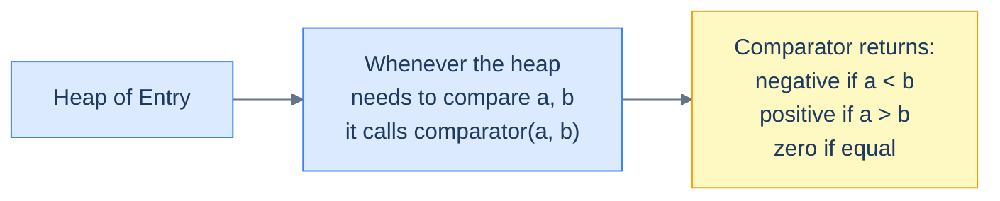
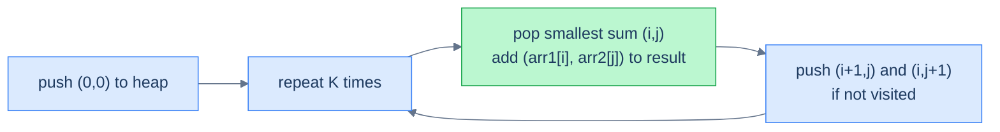
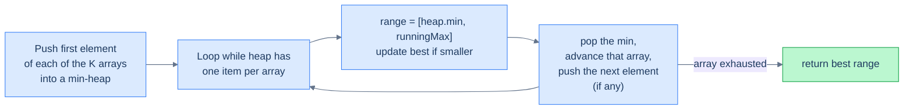

# 4. Pattern: Comparator

## The Hook

The previous lesson made heaps look easy: push integers, pop integers, done. But every heap problem you'll meet in the wild has the same twist — **the things you're queuing aren't integers**. They're tuples (`(distance, point)`), structs (`{frequency: int, word: string}`), tree nodes, list nodes, custom records. The heap doesn't know how to compare them. You have to teach it.

That teaching is called a **comparator**: a tiny function (or a `compareTo` method, or a `__lt__`, or a `<` operator overload) that takes two objects and tells the heap which one has higher priority. Once you can do that, the heap works on *any* total-ordered domain — and the K-most-frequent words, K-closest points, K-smallest sum pairs, K-way merge problems all collapse to the same Top-K skeleton from the previous lesson, just with a non-trivial comparator inside.

This lesson is short on new algorithms and dense on **idioms** — the language-specific machinery for plugging custom orderings into a heap, and five canonical problems where that machinery pays off.

---

## Table of Contents

1. [Understanding comparators](#understanding-comparators)
2. [Understanding the comparator pattern](#understanding-the-comparator-pattern)
3. [Identifying the comparator pattern](#identifying-the-comparator-pattern)
4. [K most frequent elements](#k-most-frequent-elements)
5. [K smallest sum pairs](#k-smallest-sum-pairs)
6. [K closest values](#k-closest-values)
7. [K arrays smallest range](#k-arrays-smallest-range)
8. [K-way list merge](#k-way-list-merge)

***

# Understanding comparators

A heap of integers compares its elements with `<` and `>` — the operators are baked into the language. Push `5`, push `3`, the language knows `3 < 5` and the min-heap puts `3` on top.

A heap of *anything else* needs an explicit comparison rule. There's no built-in way to know whether `Entry(x=2, y=7)` is "smaller" than `Entry(x=2, y=4)` — you have to *define* what smaller means for that type. That definition is the **comparator**.



<p align="center"><strong>The comparator is the bridge between a generic heap and a custom type. The heap calls it whenever it needs to decide ordering.</strong></p>

## Working of a comparator

A comparator returns a value that says "is `a` smaller, larger, or equal to `b`?". Conventions differ slightly by language:

| Language | Convention |
|---|---|
| Python | `__lt__(self, other) → bool` (true if `self < other`) |
| Java | `Comparator.compare(a, b) → int` (negative/zero/positive) |
| C++ | `bool less(a, b)` — if you return `true`, `a` has *lower* priority (counter-intuitive!) |
| JavaScript / TypeScript | `(a, b) → number` (a − b for ascending) |
| Go | `Less(i, j) → bool` (true means `i` should come first) |
| Kotlin | `Comparator<T>` (same as Java) or `compareBy { ... }` |
| Rust | `Ord::cmp(&self, other) → Ordering` |
| Scala | `Ordering[T]` |

The semantics are the same; only the calling convention differs.

## Implementation

Below are the canonical patterns for plugging a custom ordering into a heap, expressed in every language we cover. We'll use a tiny `Entry` type with two fields `x` and `y`, where the ordering is "compare `x` first; break ties by `y`".

## Example

The `Entry` type:

```
Entry(x, y)
ordering: a < b  iff  a.x < b.x  OR  (a.x == b.x AND a.y < b.y)
```

Two flavours: a min-heap (smallest `Entry` on top) and a max-heap (largest on top).

### min-heap


```python run
import heapq

# Definition of the custom class
class Entry:
    def __init__(self, x: int, y: int):
        self.x = x
        self.y = y

    # Override the __gt__ function. Python's heapq compares with `<`, and
    # when __lt__ is missing it falls back to the reflected `__gt__` on
    # the right-hand operand.

    # Return true if this instance should be placed BELOW `other` in the heap
    def __gt__(self, other):
        if self.x == other.x:
            return self.y < other.y
        return self.x < other.x

# Create a priority queue as regular list
max_priority_queue: List[Entry] = []

# Use heapq.heappush to push items to the priority queue
heapq.heappush(max_priority_queue, Entry(1, 2))

# Use heapq.heappop top pop values from the priority queue
heapq.heappop(max_priority_queue)
```

```java run
import java.util.*;

// Definition of the custom class
class Entry {
    // Data members here
    int x;
    int y;
}

// Comparator to use priority queue as max-heap
class MaxComparator implements Comparator<Entry> {

  // Return:
  // - positive integer if `a` should be placed BELOW `b` in the heap
  // - negative integer if `a` should be placed ABOVE `b` in the heap
  // - zero if they are equal
  public int compare(Entry a, Entry b) {
    if (a.x == b.x) {
      if (a.y == b.y) {
        return 0;
      }
      return a.y > b.y ? -1 : 1;
    }
    return a.x > b.x ? -1 : 1;
  }
}

// Create a priority queue using the MaxComparator
PriorityQueue<Entry> maxPriorityQueue = new PriorityQueue<>(new MaxComparator());
```


### max-heap

A max-heap is the same setup with the comparator inverted. Most languages give you a one-line shortcut:

| Language | Min-heap → max-heap |
|---|---|
| Python | Push `-value` (or wrap in a class with `__lt__` flipped) |
| Java | `Comparator.reverseOrder()` or flip the comparator |
| C++ | `priority_queue<T>` is max by default; for max with custom type, return `a < b` from your `operator()` |
| JavaScript | Pass `(a, b) => b.x - a.x` |
| Go | Flip the `Less` method |
| Kotlin | `compareByDescending` |
| Rust | `BinaryHeap<T>` is max by default with natural `Ord` |

We'll use these forms throughout the rest of this lesson.

***

# Understanding the comparator pattern

The **comparator pattern** is the union of two ideas you've already met:

1. The Top-K skeleton from lesson 3 (push, evict if oversize, drain).
2. A custom comparator on whatever type you actually want to keep.

The general flow:

> **Algorithm**
>
> - **Step 1:** *Transform.* Apply a transformation `t` to each input value to produce the `(value, score)` records the heap will hold. (E.g., for "K most frequent words", `t = word ↦ (word, freq)`.)
> - **Step 2:** *Choose comparator and heap polarity.* Min-heap of size K for top-K-largest by score; max-heap for top-K-smallest.
> - **Step 3:** *Stream + cap.* Push each record; pop when the heap exceeds size K.
> - **Step 4:** *Aggregate.* Drain the heap, applying the aggregation function `f` (or simply listing values).

This is a single-line variation on lesson 3's pattern. The novelty is *what the heap holds*: not raw integers, but typed records with an explicit ordering.

## Complexity Analysis

Same shape as lesson 3 — `O(N log K)` time and `O(K)` space, with the constants depending on the cost of the comparator (usually O(1)).

| Step | Cost |
|---|---|
| Transform | O(N × cost-of-`t`) |
| Heap operations | O(N log K) |
| Aggregate | O(K log K) |
| Total | **O(N log K)** |

***

# Identifying the comparator pattern

Use this pattern when:

- The input is a stream of *records* (tuples, objects, custom types) and you want top-K by some derived score.
- The natural ordering on the input doesn't match what the problem wants — words by frequency, points by distance, pairs by sum, list nodes by value.
- The problem combines a **K-way merge** with an *external order* — merging K sorted lists, finding the smallest range across K arrays, etc.

If the heap-of-integers solution from lesson 3 *almost* works but you need a different comparison rule, this is the pattern.

***

# K most frequent elements

## Problem Statement

Given an array `arr` and a positive integer `k`, return the K most frequent elements, in any order. Use a heap.

### Example 1

> - **Input:** `arr = [1, 2, 2, 3, 3, 3]`, `k = 2`
> - **Output:** `[3, 2]`

### Example 2

> - **Input:** `arr = [1, 5, 6, 6]`, `k = 1`
> - **Output:** `[6]`

### Example 3

> - **Input:** `arr = [1]`, `k = 1`
> - **Output:** `[1]`

<details>
<summary><h2>The Strategy</h2></summary>


Two steps:

1. Count frequencies into a hash map (`O(N)` time, `O(U)` space where `U` is the number of unique values).
2. Run Top-K-largest *over the hash map's entries*, comparing by frequency. Use a min-heap of size K.

The comparator is "compare by frequency, ascending" (for a min-heap of size K → top is the smallest frequency, which is exactly the threshold we evict against).

</details>
<details>
<summary><h2>The Solution</h2></summary>


```python run
from typing import List
import heapq
from collections import Counter

class Entry:
    def __init__(self, value: int, frequency: int):
        self.value = value
        self.frequency = frequency

    def __lt__(self, other):

        # min heap based on frequency
        return self.frequency < other.frequency

class Solution:
    def k_most_frequent_elements(
        self, arr: List[int], k: int
    ) -> List[int]:

        # Count the frequency of each element in arr
        frequency = Counter(arr)

        # Create a min heap with custom objects
        min_heap: List[Entry] = []

        # Add the elements to the min heap
        for value, freq in frequency.items():
            heapq.heappush(min_heap, Entry(value, freq))

            # If the heap size exceeds k, remove the element with the
            # lowest frequency
            if len(min_heap) > k:
                heapq.heappop(min_heap)

        # Extract the elements from the heap and return as a list
        result: List[int] = []
        while min_heap:
            result.append(heapq.heappop(min_heap).value)

        # Return the result
        return result


# Examples from the problem statement
print(sorted(Solution().k_most_frequent_elements([1, 2, 2, 3, 3, 3], 2)))  # [2, 3]
print(Solution().k_most_frequent_elements([1, 5, 6, 6], 1))                # [6]
print(Solution().k_most_frequent_elements([1], 1))                          # [1]

# Edge cases
print(Solution().k_most_frequent_elements([7, 7, 7], 1))                    # [7] — all same
print(sorted(Solution().k_most_frequent_elements([1, 1, 2, 2], 2)))         # [1, 2] — tie in frequency
print(Solution().k_most_frequent_elements([4, 4, 4, 4, 4], 1))              # [4]
print(sorted(Solution().k_most_frequent_elements([1, 2, 3, 4, 5], 3)))      # 3 elements each freq=1
```

```java run
import java.util.*;

public class Main {

    // Define a class to store the element and its frequency
    static class Entry {

        int value;
        int frequency;

        Entry(int value, int frequency) {
            this.value = value;
            this.frequency = frequency;
        }
    }

    // Comparator for the min heap
    static class CompareMinHeap implements Comparator<Entry> {
        public int compare(Entry a, Entry b) {

            // min heap based on frequency
            return a.frequency - b.frequency;
        }
    }

    static class Solution {
        public List<Integer> kMostFrequentElements(int[] arr, int k) {

            // Count the frequency of each element in arr
            Map<Integer, Integer> frequency = new HashMap<>();
            for (int num : arr) {
                frequency.put(num, frequency.getOrDefault(num, 0) + 1);
            }

            // Create a min heap with custom comparator
            PriorityQueue<Entry> minHeap = new PriorityQueue<>(
                new CompareMinHeap()
            );

            // Add elements to the min heap, maintaining only the top k
            frequency.forEach((key, value) -> {
                minHeap.add(new Entry(key, value));

                // If the heap size exceeds k, remove the element with the
                // lowest frequency
                if (minHeap.size() > k) {
                    minHeap.poll();
                }
            });

            // Extract the elements from the heap and return as a list
            List<Integer> result = new ArrayList<>();
            while (!minHeap.isEmpty()) {
                result.add(minHeap.poll().value);
            }

            // Return the result
            return result;
        }
    }

    public static void main(String[] args) {
        // Examples from the problem statement
        List<Integer> r1 = new Solution().kMostFrequentElements(new int[]{1, 2, 2, 3, 3, 3}, 2);
        Collections.sort(r1); System.out.println(r1);                             // [2, 3]

        System.out.println(new Solution().kMostFrequentElements(new int[]{1, 5, 6, 6}, 1));   // [6]
        System.out.println(new Solution().kMostFrequentElements(new int[]{1}, 1));             // [1]

        // Edge cases
        System.out.println(new Solution().kMostFrequentElements(new int[]{7, 7, 7}, 1));       // [7]

        List<Integer> r2 = new Solution().kMostFrequentElements(new int[]{1, 1, 2, 2}, 2);
        Collections.sort(r2); System.out.println(r2);                             // [1, 2]

        System.out.println(new Solution().kMostFrequentElements(new int[]{4, 4, 4, 4, 4}, 1)); // [4]

        List<Integer> r3 = new Solution().kMostFrequentElements(new int[]{1, 2, 3, 4, 5}, 3);
        Collections.sort(r3); System.out.println(r3);                             // 3 elements
    }
}
```

</details>


***

# K smallest sum pairs

## Problem Statement

Given two sorted arrays `arr1` and `arr2`, and a non-negative integer `k`, return the K pairs `(a, b)` (one element from each) with the smallest sum.

### Example 1

> - **Input:** `arr1 = [1, 7, 1]`, `arr2 = [2, 4, 6]`, `k = 3`
> - **Output:** `[[1, 2], [1, 4], [1, 6]]`

### Example 2

> - **Input:** `arr1 = [1, 1, 2]`, `arr2 = [1, 2, 3]`, `k = 2`
> - **Output:** `[[1, 1], [1, 1]]`

### Example 3

> - **Input:** `arr1 = [1, 3, 4]`, `arr2 = [4]`, `k = 2`
> - **Output:** `[[1, 4], [3, 4]]`

<details>
<summary><h2>The Strategy</h2></summary>


There are `n × m` possible pairs — up to `n²` if both arrays are large. Generating all of them is expensive. The trick is **lazy expansion**: start with the smallest possible pair `(arr1[0], arr2[0])`, then *only* expand the neighbours of pairs we've already extracted.

When we pop pair `(i, j)`, the next-smallest pair adjacent to it is either `(i+1, j)` or `(i, j+1)` — we push both into the heap, marked as visited so we don't re-add them. Then pop the next-smallest from the heap. Repeat K times.



<p align="center"><strong>Lazy expansion: at most 2 new pairs added per popped pair, so the heap stays at O(K).</strong></p>

The comparator is "compare by sum, ascending". The pair record carries `(sum, i, j)` so we can recover the actual values.

</details>
<details>
<summary><h2>The Solution</h2></summary>


```python run
from typing import List, Tuple
import heapq

# Define a class to store the sum and the indices of the pair
class PairWithSum:
    def __init__(self, sum_: int, index1: int, index2: int):
        self.sum = sum_
        self.index1 = index1
        self.index2 = index2

    # Define comparison based on sum
    def __lt__(self, other):
        return self.sum < other.sum

class Solution:
    def k_smallest_sum_pairs(
        self, arr_1: List[int], arr_2: List[int], k: int
    ) -> List[List[int]]:
        n = len(arr_1)
        m = len(arr_2)

        # Result list to store the k smallest pairs
        result = []

        # Set to keep track of visited pairs
        visited = set()

        # Create a min-heap (priority queue)
        min_heap = []

        # Push the first pair into the heap
        heapq.heappush(min_heap, PairWithSum(arr_1[0] + arr_2[0], 0, 0))

        # Mark the first pair as visited
        visited.add((0, 0))

        # Process the pairs until k pairs have been found or the min
        # heap is empty
        while k > 0 and min_heap:

            # Get the smallest pair
            top = heapq.heappop(min_heap)

            # Retrieve the indices of the pair
            i, j = top.index1, top.index2

            # Add the pair to the answer list
            result.append([arr_1[i], arr_2[j]])

            # Check adjacent pairs and add them to the min heap if not
            # visited
            if i + 1 < n and (i + 1, j) not in visited:
                heapq.heappush(
                    min_heap,
                    PairWithSum(arr_1[i + 1] + arr_2[j], i + 1, j),
                )
                visited.add((i + 1, j))
            if j + 1 < m and (i, j + 1) not in visited:
                heapq.heappush(
                    min_heap,
                    PairWithSum(arr_1[i] + arr_2[j + 1], i, j + 1),
                )
                visited.add((i, j + 1))

            k -= 1

        # Return the k smallest pairs
        return result


# Examples from the problem statement
print(Solution().k_smallest_sum_pairs([1, 7, 11], [2, 4, 6], 3))     # [[1,2],[1,4],[1,6]]
print(Solution().k_smallest_sum_pairs([1, 1, 2], [1, 2, 3], 2))      # [[1,1],[1,1]]
print(Solution().k_smallest_sum_pairs([1, 3, 4], [4], 2))             # [[1,4],[3,4]]

# Edge cases
print(Solution().k_smallest_sum_pairs([1], [1], 1))                   # [[1,1]]
print(Solution().k_smallest_sum_pairs([1, 2], [3, 4], 4))             # all 4 pairs
print(Solution().k_smallest_sum_pairs([1, 7, 11], [2, 4, 6], 1))     # [[1,2]] — k=1
```

```java run
import java.util.*;

public class Main {

    // Define a class to store the sum and the indices of the pair
    static class PairWithSum {

        int sum;
        int index1;
        int index2;

        PairWithSum(int sum, int index1, int index2) {
            this.sum = sum;
            this.index1 = index1;
            this.index2 = index2;
        }
    }

    // Comparator to create the min-heap based on sum
    static class CompareMinHeap implements Comparator<PairWithSum> {
        public int compare(PairWithSum a, PairWithSum b) {

            // For the priority queue to be a min-heap
            return Integer.compare(a.sum, b.sum);
        }
    }

    static class Solution {
        public List<List<Integer>> kSmallestSumPairs(
            int[] arr1,
            int[] arr2,
            int k
        ) {
            int n = arr1.length;
            int m = arr2.length;

            // Result list to store the k smallest pairs
            List<List<Integer>> result = new ArrayList<>();

            // Set to keep track of visited pairs
            Set<String> visited = new HashSet<>();

            // Create a priority queue (min-heap)
            PriorityQueue<PairWithSum> minHeap = new PriorityQueue<>(
                new CompareMinHeap()
            );

            // Push the first pair into the heap
            minHeap.add(new PairWithSum(arr1[0] + arr2[0], 0, 0));

            // Mark the first pair as visited
            visited.add("0,0");

            // Process the pairs until k pairs have been found or the min
            // heap is empty
            while (k > 0 && !minHeap.isEmpty()) {

                // Get the smallest pair
                PairWithSum top = minHeap.poll();

                // Retrieve the indices of the pair
                int i = top.index1;
                int j = top.index2;

                // Add the pair to the answer list
                result.add(List.of(arr1[i], arr2[j]));

                // Check adjacent pairs and add them to the min heap if not
                // visited
                if (i + 1 < n && !visited.contains((i + 1) + "," + j)) {
                    minHeap.add(
                        new PairWithSum(arr1[i + 1] + arr2[j], i + 1, j)
                    );
                    visited.add((i + 1) + "," + j);
                }

                if (j + 1 < m && !visited.contains(i + "," + (j + 1))) {
                    minHeap.add(
                        new PairWithSum(arr1[i] + arr2[j + 1], i, j + 1)
                    );
                    visited.add(i + "," + (j + 1));
                }

                k--;
            }

            // Return the k smallest pairs
            return result;
        }
    }

    public static void main(String[] args) {
        // Examples from the problem statement
        System.out.println(new Solution().kSmallestSumPairs(
            new int[]{1, 7, 11}, new int[]{2, 4, 6}, 3));     // [[1,2],[1,4],[1,6]]

        System.out.println(new Solution().kSmallestSumPairs(
            new int[]{1, 1, 2}, new int[]{1, 2, 3}, 2));      // [[1,1],[1,1]]

        System.out.println(new Solution().kSmallestSumPairs(
            new int[]{1, 3, 4}, new int[]{4}, 2));             // [[1,4],[3,4]]

        // Edge cases
        System.out.println(new Solution().kSmallestSumPairs(
            new int[]{1}, new int[]{1}, 1));                   // [[1,1]]

        System.out.println(new Solution().kSmallestSumPairs(
            new int[]{1, 2}, new int[]{3, 4}, 4));             // all 4 pairs

        System.out.println(new Solution().kSmallestSumPairs(
            new int[]{1, 7, 11}, new int[]{2, 4, 6}, 1));     // [[1,2]] — k=1
    }
}
```

</details>


***

# K closest values

## Problem Statement

Given the **root** of a binary search tree, a **target** value (real number), and a non-negative integer `k`, return the K values in the BST closest to `target`. Return them in any order.

### Example 1

> - **Input:** `root = [4, 2, 6, 1, null, null, 7]`, `target = 4.63`, `k = 3`
> - **Output:** `[4, 6, 7]`

### Example 2

> - **Input:** `root = [2, 1, 4, null, null, 3, 7]`, `target = 7.49`, `k = 2`
> - **Output:** `[4, 7]`

<details>
<summary><h2>The Strategy</h2></summary>


This is **Top-K-smallest by distance**, applied to a tree traversal. We walk the BST in any order (in-order is convenient), pushing each value paired with its absolute distance to the target. We use a **max-heap** of size K, where the top is the *farthest* of our current best K — the threshold we evict against.

The comparator: "compare by distance, descending" (so the farthest is on top of the max-heap).

</details>
<details>
<summary><h2>The Solution</h2></summary>


```python run
from typing import List, Optional
import heapq

class TreeNode:
    def __init__(self, val=0, left=None, right=None):
        self.val = val
        self.left = left
        self.right = right


def from_level_order(values):
    """Build tree from list like [1, 2, 3, None, 4]. None means missing child."""
    if not values:
        return None
    root = TreeNode(values[0])
    queue = [root]
    i = 1
    while queue and i < len(values):
        node = queue.pop(0)
        if i < len(values) and values[i] is not None:
            node.left = TreeNode(values[i])
            queue.append(node.left)
        i += 1
        if i < len(values) and values[i] is not None:
            node.right = TreeNode(values[i])
            queue.append(node.right)
        i += 1
    return root


# Struct to store the value and its distance from the target
class ValueDiff:
    def __init__(self, diff: float, value: int):
        self.diff = diff
        self.value = value

    # Custom comparison for heapq (max-heap)
    def __lt__(self, other):
        return self.diff > other.diff

class Solution:
    def __init__(self):

        # Max heap to store the closest k values
        self.max_heap: List[ValueDiff] = []

    def inorder(
        self, root: Optional[TreeNode], target: float, k: int
    ) -> None:
        if root is None:
            return

        self.inorder(root.left, target, k)

        # Compute the absolute difference between node value and target
        diff = abs(root.val - target)

        # Push the current value and its difference to the max heap
        heapq.heappush(self.max_heap, ValueDiff(diff, root.val))

        # Ensure the heap only contains k elements
        if len(self.max_heap) > k:

            # Remove the farthest element
            heapq.heappop(self.max_heap)

        self.inorder(root.right, target, k)

    def k_closest_values(
        self, root: Optional[TreeNode], target: float, k: int
    ) -> List[int]:
        result: List[int] = []

        # Perform inorder traversal and fill the max heap with the
        # closest k values
        self.inorder(root, target, k)

        # Extract k closest values from the max heap
        while self.max_heap:
            result.append(heapq.heappop(self.max_heap).value)

        # The result is in reverse order, so reverse it
        result.reverse()

        return result


# Examples from the problem statement
t1 = from_level_order([4, 2, 6, 1, None, None, 7])
print(sorted(Solution().k_closest_values(t1, 4.63, 3)))   # [4, 6, 7]

t2 = from_level_order([2, 1, 4, None, None, 3, 7])
print(sorted(Solution().k_closest_values(t2, 7.49, 2)))   # [4, 7]

# Edge cases
t3 = from_level_order([5])
print(Solution().k_closest_values(t3, 3.0, 1))            # [5] — single node

t4 = from_level_order([4, 2, 6, 1, None, None, 7])
print(sorted(Solution().k_closest_values(t4, 1.0, 1)))    # [1] — exact match

t5 = from_level_order([4, 2, 6, 1, None, None, 7])
print(sorted(Solution().k_closest_values(t5, 4.0, 2)))    # [4, 2] or [4, 6] — ties
```

```java run
import java.util.*;

public class Main {
    static class TreeNode {
        int val;
        TreeNode left;
        TreeNode right;
        TreeNode() {}
        TreeNode(int val) { this.val = val; }
    }

    static TreeNode fromLevelOrder(Integer... values) {
        if (values.length == 0 || values[0] == null) return null;
        TreeNode root = new TreeNode(values[0]);
        java.util.Deque<TreeNode> queue = new java.util.ArrayDeque<>();
        queue.add(root);
        int i = 1;
        while (!queue.isEmpty() && i < values.length) {
            TreeNode node = queue.poll();
            if (i < values.length && values[i] != null) {
                node.left = new TreeNode(values[i]);
                queue.add(node.left);
            }
            i++;
            if (i < values.length && values[i] != null) {
                node.right = new TreeNode(values[i]);
                queue.add(node.right);
            }
            i++;
        }
        return root;
    }

    // Struct to store the value and its distance from the target
    static class ValueDiff {

        double diff;
        int value;

        ValueDiff(double diff, int value) {
            this.diff = diff;
            this.value = value;
        }
    }

    // Comparator to create a max heap based on the difference
    static class CompareMaxHeap implements Comparator<ValueDiff> {
        public int compare(ValueDiff a, ValueDiff b) {

            // Max heap: larger diff has higher priority
            return Double.compare(b.diff, a.diff);
        }
    }

    static class Solution {

        // Max heap to store the closest k values
        private PriorityQueue<ValueDiff> maxHeap = new PriorityQueue<>(
            new CompareMaxHeap()
        );

        private void inorder(TreeNode root, double target, int k) {
            if (root == null) {
                return;
            }

            inorder(root.left, target, k);

            // Compute the absolute difference between node value and target
            double diff = Math.abs(root.val - target);

            // Push the current value and its difference to the max heap
            maxHeap.add(new ValueDiff(diff, root.val));

            // Ensure the heap only contains k elements
            if (maxHeap.size() > k) {

                // Remove the farthest element
                maxHeap.poll();
            }

            inorder(root.right, target, k);
        }

        public List<Integer> kClosestValues(
            TreeNode root,
            double target,
            int k
        ) {
            List<Integer> result = new ArrayList<>();

            // Perform inorder traversal and fill the max heap with the
            // closest k values
            inorder(root, target, k);

            // Extract k closest values from the max heap
            while (!maxHeap.isEmpty()) {
                result.add(maxHeap.poll().value);
            }

            // The result is in reverse order, so reverse it
            Collections.reverse(result);

            return result;
        }
    }

    public static void main(String[] args) {
        // Examples from the problem statement
        TreeNode t1 = fromLevelOrder(4, 2, 6, 1, null, null, 7);
        List<Integer> r1 = new Solution().kClosestValues(t1, 4.63, 3);
        Collections.sort(r1); System.out.println(r1);   // [4, 6, 7]

        TreeNode t2 = fromLevelOrder(2, 1, 4, null, null, 3, 7);
        List<Integer> r2 = new Solution().kClosestValues(t2, 7.49, 2);
        Collections.sort(r2); System.out.println(r2);   // [4, 7]

        // Edge cases
        TreeNode t3 = fromLevelOrder(5);
        System.out.println(new Solution().kClosestValues(t3, 3.0, 1));    // [5]

        TreeNode t4 = fromLevelOrder(4, 2, 6, 1, null, null, 7);
        List<Integer> r4 = new Solution().kClosestValues(t4, 1.0, 1);
        System.out.println(r4);                                            // [1]

        TreeNode t5 = fromLevelOrder(4, 2, 6, 1, null, null, 7);
        List<Integer> r5 = new Solution().kClosestValues(t5, 4.0, 2);
        Collections.sort(r5); System.out.println(r5);                     // 2 closest to 4.0
    }
}
```

</details>


***

# K arrays smallest range

## Problem Statement

Given an array of `k` sorted integer arrays, return the **smallest range `[a, b]`** such that the range contains at least one number from each of the `k` arrays.

> A range `[a, b]` is "smaller than" `[c, d]` if `b − a < d − c`, or if their widths are equal and `a < c`.

### Example 1

> - **Input:** `arr = [[4, 8], [3, 6], [4, 5]]`
> - **Output:** `[3, 4]`

### Example 2

> - **Input:** `arr = [[1, 2, 5], [6, 7, 9], [3, 4]]`
> - **Output:** `[4, 6]`

### Example 3

> - **Input:** `arr = [[1, 5, 9], [3, 7, 12]]`
> - **Output:** `[1, 3]`

<details>
<summary><h2>The Strategy</h2></summary>


This is a classic **K-way merge** with a twist — we don't merge into one list, we slide a window across the merge.

**Key insight:** at any moment, if we have *one element from each list* in our hand, the smallest such range is `[min, max]` of the K values in hand. To shrink it, we have to advance whoever is the *minimum* — replacing them with the next element of their list (which is larger). Repeat. Stop when any list runs out.

The min-heap holds one record per list — `(value, listIndex, elementIndex)`. We track the running maximum separately. Each pop gives us the current `min`; the candidate range is `[min, max]`. After popping, we push the next element of that list (larger), updating `max` accordingly.



<p align="center"><strong>K-way merge with a sliding window. The min-heap tracks the smallest, an external <code>maxValue</code> tracks the largest, and their difference is the current candidate range.</strong></p>

</details>
<details>
<summary><h2>The Solution</h2></summary>


```python run
import heapq
from typing import List

# Define a class to store the value, list index, and element index
class Element:
    def __init__(
        self, value: int, list_idx: int, element_idx: int
    ) -> None:
        self.value = value
        self.list_idx = list_idx
        self.element_idx = element_idx

    # For comparison in heapq
    def __lt__(self, other):
        return self.value < other.value

class Solution:
    def k_arrays_smallest_range(self, arr: List[List[int]]) -> List[int]:
        k = len(arr)

        # Define a min heap to store the elements from each list
        # The key of the heap is the value of the element
        # The value is a pair representing the list index and the
        # element index within the list
        min_heap = []

        # Initialize the maximum value seen so far
        max_value = float("-inf")

        # Initialize the heap with the first element from each list
        for i in range(k):
            if arr[i]:
                heapq.heappush(min_heap, Element(arr[i][0], i, 0))
                max_value = max(max_value, arr[i][0])

        # Initialize variables to track the smallest range
        range_start = -1
        range_end = -1
        range_length = float("inf")

        # Process the elements in the min heap until at least one element
        # from each list is included
        while len(min_heap) == k:

            # Extract the minimum element from the heap
            current = heapq.heappop(min_heap)

            value = current.value
            list_idx = current.list_idx
            idx = current.element_idx

            # Update the smallest range if the current range is smaller
            if max_value - value < range_length:
                range_start = value
                range_end = max_value
                range_length = range_end - range_start

            # Move to the next element in the list and update the maximum
            # value seen so far
            if idx + 1 < len(arr[list_idx]):
                heapq.heappush(
                    min_heap,
                    Element(arr[list_idx][idx + 1], list_idx, idx + 1),
                )
                max_value = max(max_value, arr[list_idx][idx + 1])

        # Return the smallest range as a list
        return [range_start, range_end]


# Examples from the problem statement
print(Solution().k_arrays_smallest_range([[4, 8], [3, 6], [4, 5]]))       # [3, 4]
print(Solution().k_arrays_smallest_range([[1, 2, 5], [6, 7, 9], [3, 4]])) # [4, 6]
print(Solution().k_arrays_smallest_range([[1, 5, 9], [3, 7, 12]]))        # [1, 3]

# Edge cases
print(Solution().k_arrays_smallest_range([[1], [2], [3]]))                # [1, 3] — single-element arrays
print(Solution().k_arrays_smallest_range([[1, 2], [1, 2]]))               # [1, 1] — identical arrays
print(Solution().k_arrays_smallest_range([[5], [5]]))                     # [5, 5] — same values
```

```java run
import java.util.*;

public class Main {

    // Define an internal class to store the value, list index, and
    // element index
    static class Element {

        int value;
        int listIdx;
        int elementIdx;

        Element(int value, int listIdx, int elementIdx) {
            this.value = value;
            this.listIdx = listIdx;
            this.elementIdx = elementIdx;
        }
    }

    // Define an internal comparator class to compare the elements based
    // on their value
    static class CompareMinHeap implements Comparator<Element> {
        public int compare(Element a, Element b) {

            // Min-heap based on the value
            return Integer.compare(a.value, b.value);
        }
    }

    static class Solution {
        public List<Integer> kArraysSmallestRange(List<List<Integer>> arr) {
            int k = arr.size();

            // Define a min heap to store the elements from each list
            // The key of the heap is the value of the element
            // The value is a pair representing the list index and the
            // element index within the list
            PriorityQueue<Element> minHeap = new PriorityQueue<>(
                new CompareMinHeap()
            );

            // Initialize the maximum value seen so far
            int maxValue = Integer.MIN_VALUE;

            // Initialize the heap with the first element from each list
            for (int i = 0; i < k; i++) {
                if (!arr.get(i).isEmpty()) {
                    minHeap.add(new Element(arr.get(i).get(0), i, 0));
                    maxValue = Math.max(maxValue, arr.get(i).get(0));
                }
            }

            // Initialize variables to track the smallest range
            int rangeStart = -1;
            int rangeEnd = -1;
            int rangeLength = Integer.MAX_VALUE;

            // Process the elements in the min heap until at least one
            // element from each list is included
            while (minHeap.size() == k) {

                // Extract the minimum element from the heap
                Element current = minHeap.poll();

                int value = current.value;
                int listIdx = current.listIdx;
                int idx = current.elementIdx;

                // Update the smallest range if the current range is smaller
                if (maxValue - value < rangeLength) {
                    rangeStart = value;
                    rangeEnd = maxValue;
                    rangeLength = rangeEnd - rangeStart;
                }

                // Move to the next element in the list and update the
                // maximum value seen so far
                if (idx + 1 < arr.get(listIdx).size()) {
                    minHeap.add(
                        new Element(
                            arr.get(listIdx).get(idx + 1),
                            listIdx,
                            idx + 1
                        )
                    );
                    maxValue = Math.max(
                        maxValue,
                        arr.get(listIdx).get(idx + 1)
                    );
                }
            }

            // Return the smallest range as an array
            return List.of(rangeStart, rangeEnd);
        }
    }

    public static void main(String[] args) {
        // Examples from the problem statement
        System.out.println(new Solution().kArraysSmallestRange(
            List.of(List.of(4, 8), List.of(3, 6), List.of(4, 5))));       // [3, 4]

        System.out.println(new Solution().kArraysSmallestRange(
            List.of(List.of(1, 2, 5), List.of(6, 7, 9), List.of(3, 4)))); // [4, 6]

        System.out.println(new Solution().kArraysSmallestRange(
            List.of(List.of(1, 5, 9), List.of(3, 7, 12))));               // [1, 3]

        // Edge cases
        System.out.println(new Solution().kArraysSmallestRange(
            List.of(List.of(1), List.of(2), List.of(3))));                 // [1, 3]

        System.out.println(new Solution().kArraysSmallestRange(
            List.of(List.of(1, 2), List.of(1, 2))));                       // [1, 1]

        System.out.println(new Solution().kArraysSmallestRange(
            List.of(List.of(5), List.of(5))));                             // [5, 5]
    }
}
```

</details>


***

# K-way list merge

## Problem Statement

Given an array of `k` linked-list head nodes, each list sorted in ascending order, merge all lists into one sorted list and return its head.

### Example 1

> - **Input:** `lists = [[1, 4, 5], [1, 3, 4], [2, 6]]`
> - **Output:** `[1, 1, 2, 3, 4, 4, 5, 6]`

### Example 2

> - **Input:** `lists = []`
> - **Output:** `[]`

<details>
<summary><h2>The Strategy</h2></summary>


The textbook K-way merge: at every step, the next node of the merged list is the *globally smallest* among the heads of all unmerged lists. A min-heap of size K holds those heads. Pop the smallest, append to the output, push the *next* node of that list (if any). Done in `O(N log K)` total, where `N` is the total number of nodes.

The comparator is "compare list nodes by value, ascending".

</details>
<details>
<summary><h2>The Solution</h2></summary>


```python run
from typing import List, Optional, Tuple
import heapq

class ListNode:
    def __init__(self, val=0, nxt=None):
        self.val = val
        self.next = nxt


def from_list(values):
    if not values:
        return None
    head = ListNode(values[0])
    cur = head
    for v in values[1:]:
        cur.next = ListNode(v)
        cur = cur.next
    return head


def to_list(head):
    out = []
    while head is not None:
        out.append(head.val)
        head = head.next
    return out


class Solution:
    def k_way_list_merge(
        self, lists: List[Optional[ListNode]]
    ) -> Optional[ListNode]:

        # Create a new head and tail node to build the merged list
        dummy: ListNode = ListNode(0)
        tail: ListNode = dummy

        # Define the heap type as a list of tuples: (node value, list
        # index, ListNode)
        min_heap: List[Tuple[int, int, ListNode]] = []

        # Push the first node of each list into the heap
        for i, head in enumerate(lists):
            if head:
                heapq.heappush(min_heap, (head.val, i, head))

        # Extract the smallest item and add the next node from that list
        # to the heap
        while min_heap:
            val, i, node = heapq.heappop(min_heap)

            # Add the node to the merged list
            tail.next = node
            tail = tail.next

            # If there's a next node, push it to the heap
            if node.next:
                heapq.heappush(min_heap, (node.next.val, i, node.next))

        return dummy.next


# Examples from the problem statement
l1 = [from_list([1, 4, 5]), from_list([1, 3, 4]), from_list([2, 6])]
print(to_list(Solution().k_way_list_merge(l1)))   # [1, 1, 2, 3, 4, 4, 5, 6]

print(to_list(Solution().k_way_list_merge([])))   # []

# Edge cases
l2 = [from_list([1, 2, 3])]
print(to_list(Solution().k_way_list_merge(l2)))   # [1, 2, 3] — single list

l3 = [from_list([1]), from_list([2]), from_list([3])]
print(to_list(Solution().k_way_list_merge(l3)))   # [1, 2, 3] — single-node lists

l4 = [None, from_list([1, 2])]
print(to_list(Solution().k_way_list_merge(l4)))   # [1, 2] — one null list

l5 = [from_list([1, 1, 1]), from_list([1, 1])]
print(to_list(Solution().k_way_list_merge(l5)))   # [1, 1, 1, 1, 1] — all same
```

```java run
import java.util.*;

public class Main {
    static class ListNode {
        int val;
        ListNode next;
        ListNode() {}
        ListNode(int val) { this.val = val; }
        ListNode(int val, ListNode next) { this.val = val; this.next = next; }
    }

    static ListNode fromList(int... values) {
        if (values.length == 0) return null;
        ListNode head = new ListNode(values[0]);
        ListNode cur = head;
        for (int i = 1; i < values.length; i++) {
            cur.next = new ListNode(values[i]);
            cur = cur.next;
        }
        return head;
    }

    static java.util.List<Integer> toList(ListNode head) {
        java.util.List<Integer> out = new java.util.ArrayList<>();
        while (head != null) { out.add(head.val); head = head.next; }
        return out;
    }

    static class CompareMinHeap implements Comparator<ListNode> {
        public int compare(ListNode nodeA, ListNode nodeB) {

            // Custom comparison function used by the PriorityQueue.
            // It compares the values of the nodes and returns a negative
            // value if nodeA's value is less than nodeB's value, zero if
            // they are equal, and a positive value if nodeA's value is
            // greater than nodeB's value.
            return Integer.compare(nodeA.val, nodeB.val);
        }
    }

    static class Solution {
        public ListNode kWayListMerge(java.util.List<ListNode> lists) {

            // Create a PriorityQueue with ListNode as the type and use the
            // CompareNodes class as the comparator.
            PriorityQueue<ListNode> minHeap = new PriorityQueue<>(
                new CompareMinHeap()
            );

            // Push all non-null heads of the input lists into the priority
            // queue.
            for (ListNode head : lists) {
                if (head != null) minHeap.add(head);
            }

            // Create a dummy and tail pointers for building the merged list.
            ListNode dummy = new ListNode(0);
            ListNode tail = dummy;

            // Continue until the priority queue is empty.
            while (!minHeap.isEmpty()) {

                // Get the node with the smallest value from the priority
                // queue.
                ListNode node = minHeap.poll();

                // Add the node to the merged list.
                tail.next = node;
                tail = tail.next;

                // If the current node has a next node, push the next node
                // into the priority queue for further processing.
                if (node.next != null) {
                    minHeap.add(node.next);
                }
            }

            // Return the head of the merged list (excluding the dummy node).
            return dummy.next;
        }
    }

    public static void main(String[] args) {
        // Examples from the problem statement
        java.util.List<ListNode> l1 = List.of(fromList(1, 4, 5), fromList(1, 3, 4), fromList(2, 6));
        System.out.println(toList(new Solution().kWayListMerge(l1)));   // [1, 1, 2, 3, 4, 4, 5, 6]

        System.out.println(toList(new Solution().kWayListMerge(List.of())));   // []

        // Edge cases
        java.util.List<ListNode> l2 = List.of(fromList(1, 2, 3));
        System.out.println(toList(new Solution().kWayListMerge(l2)));   // [1, 2, 3]

        java.util.List<ListNode> l3 = List.of(fromList(1), fromList(2), fromList(3));
        System.out.println(toList(new Solution().kWayListMerge(l3)));   // [1, 2, 3]

        java.util.List<ListNode> l4 = new ArrayList<>();
        l4.add(null); l4.add(fromList(1, 2));
        System.out.println(toList(new Solution().kWayListMerge(l4)));   // [1, 2]

        java.util.List<ListNode> l5 = List.of(fromList(1, 1, 1), fromList(1, 1));
        System.out.println(toList(new Solution().kWayListMerge(l5)));   // [1, 1, 1, 1, 1]
    }
}
```

</details>
<details>
<summary><h2>Final Takeaway</h2></summary>


A comparator is the **bridge between a generic priority queue and any custom type with a total order**. Once you can plug a comparator in, every Top-K problem from lesson 3 generalises to records, structs, tree nodes, list nodes — anything with a defined ordering.

Three patterns to take with you:

1. **Heap of records, ordered by score.** Word + frequency, point + distance, pair + sum, list-node + value. The heap holds *records*, the comparator orders by the *score field*.
2. **K-way merge with a heap of size K.** When you need the global minimum across K sorted streams, a heap of size K with one head per stream gives it to you in O(log K) per pop. K-way merge, K-sorted ranges, K-way list merge — all the same skeleton.
3. **Tiebreakers in language-specific ways.** Most heap libraries can't compare arbitrary types directly (Python tuples, Rust `Box`); inserting a unique counter or a list index as a tiebreaker is a common idiom that prevents the comparator from ever needing to look at non-comparable fields.

The next and final lesson zooms back out: **design** problems that combine multiple heaps, or a heap with another data structure, to build something larger — finding the running median, tracking K-sized windowed maxima, deferred-decision priority queues. The comparator pattern is the toolbox for those designs.

</details>