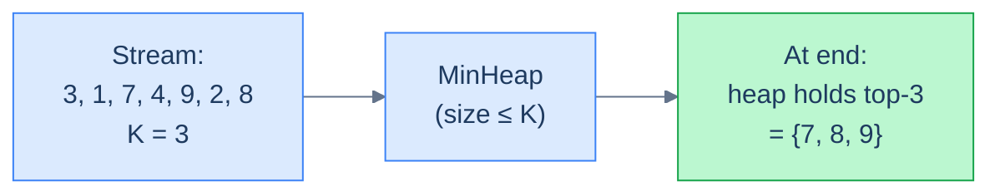
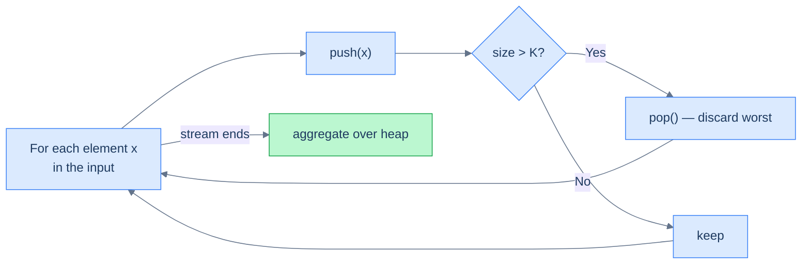
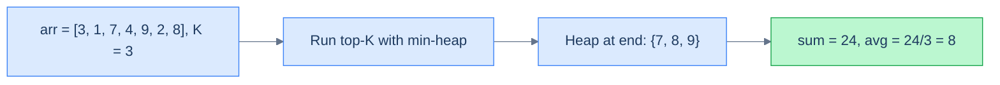

# Understanding the top K elements pattern

The pattern boils down to a counter-intuitive trick: **to track the K largest values, use a min-heap of size K, not a max-heap**.

> *Friction prompt — predict before reading on. Why min-heap for the K largest? It feels backwards.*

Because the heap's job is to **identify the smallest of your top-K-so-far** — that's the value you need to compare against to decide whether a new element belongs in the club. If the new element beats the current min of the top-K, it kicks the min out and joins the heap. If not, it's worse than everything you've already accepted, so it's discarded.

> 🖼 Diagram — Top-K-largest with a min-heap of size K. Each element is pushed; if the heap exceeds K, the min is popped. The min of a heap that always holds the best K candidates is the K-th largest seen so far.

<strong>Top-K-largest with a min-heap of size K. Each element is pushed; if the heap exceeds K, the min is popped. The min of a heap that always holds the best K candidates is the K-th largest seen so far.</strong>

The mirror version is just as crucial: **for the K smallest, use a max-heap of size K**. The max of the top-K-smallest-so-far is the threshold you compare against.

| Want | Use a heap of type | Why |
|---|---|---|
| K **largest** | **Min**-heap of size K | The min of the top-K is the threshold to beat |
| K **smallest** | **Max**-heap of size K | The max of the bottom-K is the threshold to beat |

## The top K technique

For each element in the stream:

1. Push it into the heap.
2. If the heap now holds more than K elements, pop the top.

After the stream ends, the heap holds the K most-extreme values. To compute an aggregate (sum, average, list) over those K, drain the heap and apply your aggregation function `f`.

> 🖼 Diagram — The top-K loop. Constant-size heap, O(log K) per element, single pass.

<strong>The top-K loop. Constant-size heap, O(log K) per element, single pass.</strong>

## Algorithm

> **Algorithm**
>
> - **Step 1:** Create an empty heap (min-heap for top-K-largest, max-heap for top-K-smallest).
> - **Step 2:** For each element `x` in the input:
>   - **Step 2.1:** Push `x` onto the heap.
>   - **Step 2.2:** If `heap.size() > K`, pop the top.
> - **Step 3:** Drain the heap, applying `f` to each popped element to build the aggregate.
> - **Step 4:** Return the aggregate.

## Complexity Analysis

For an array of `n` elements with the heap capped at size `K`:

| Step | Cost |
|---|---|
| Push + possible pop, per element | O(log K) |
| Total across `n` elements | **O(n log K)** |
| Final drain of the heap | O(K log K) |
| Space (heap of size K) | **O(K)** |

When `K << n`, that's dramatically better than `O(n log n)` from a full sort. When `K = n`, the two are equal. **You can never lose with the top-K trick.**

# Identifying the top k elements pattern

The pattern fits whenever the problem mentions:

- **"K largest" / "K smallest" / "K most/least frequent"** — the canonical phrasing.
- **"K-th"** anything — the K-th largest, K-th smallest, K-th frequent. (Just take the heap's top *after* processing the stream.)
- **"Closest K"** — for points to a target, words to a query, etc. The "score" is the distance, and you want the smallest distances.
- **"Top-K aggregate"** — average, sum, set of the top-K values.

If the problem boils down to *"compute something over the K extreme values of a stream/array"*, reach for the fixed-size heap.

## Worked example — average of K largest

> **Problem:** Given an array of integers and an integer K, return the average of the K largest values.

The fit:

- **Aggregation function `f`** = "running sum, divide by K at the end".
- **Heap type** = min-heap of size K (we want largest).

> 🖼 Diagram — Average of the K largest. The pattern handles the "select" step; the aggregation step is whatever the problem needs.

<strong>Average of the K largest. The pattern handles the "select" step; the aggregation step is whatever the problem needs.</strong>

<!-- ============================================== -->
<!-- SWEEP 2 — missing sections (placeholders only) -->
<!-- ============================================== -->

<!-- TODO: Why Naive Isn't Enough — missing, needs to be written -->
<!--       Guidance: motivation for why the obvious approach fails -->

<!-- TODO: The Core Idea — missing, needs to be written -->
<!--       Guidance: one paragraph: the central trick -->

<!-- TODO: How the Pointers/Window Move — missing, needs to be written -->
<!--       Guidance: mechanics of the moving parts -->

<!-- TODO: The Generic Algorithm — missing, needs to be written -->
<!--       Guidance: numbered steps, no code -->

<!-- TODO: Generic Implementation — missing, needs to be written -->
<!--       Guidance: Python block + Java block of the skeleton -->

<!-- TODO: Variants / Taxonomy — missing, needs to be written -->
<!--       Guidance: enumerate sub-shapes of this pattern -->

<!-- TODO: Recognition Checklist — missing, needs to be written -->
<!--       Guidance: 4-question diagnostic — the source of the Problem-section Diagnostic Questions -->

<!-- TODO: Canonical Example — missing, needs to be written -->
<!--       Guidance: fully worked example: brute force → optimised → template fit -->

<!-- TODO: Problems in This Category — missing, needs to be written -->
<!--       Guidance: table with links to the 02-problems/ files -->
