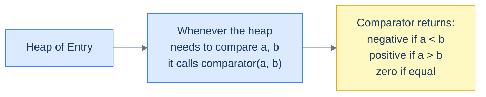

# Understanding comparators

A heap of integers compares its elements with `<` and `>` — the operators are baked into the language. Push `5`, push `3`, the language knows `3 < 5` and the min-heap puts `3` on top.

A heap of *anything else* needs an explicit comparison rule. There's no built-in way to know whether `Entry(x=2, y=7)` is "smaller" than `Entry(x=2, y=4)` — you have to *define* what smaller means for that type. That definition is the **comparator**.

> 🖼 Diagram — The comparator is the bridge between a generic heap and a custom type. The heap calls it whenever it needs to decide ordering.


<p align="center"><strong>The comparator is the bridge between a generic heap and a custom type. The heap calls it whenever it needs to decide ordering.</strong></p>

## Working of a comparator

A comparator returns a value that says "is `a` smaller, larger, or equal to `b`?". Conventions differ slightly by language:

| Language | Convention |
|---|---|
| Python | `__lt__(self, other) → bool` (true if `self < other`) |
| Java | `Comparator.compare(a, b) → int` (negative/zero/positive) |
| C++ | `bool less(a, b)` — if you return `true`, `a` has *lower* priority (counter-intuitive!) |
| JavaScript / TypeScript | `(a, b) → number` (a − b for ascending) |
| Go | `Less(i, j) → bool` (true means `i` should come first) |
| Kotlin | `Comparator<T>` (same as Java) or `compareBy { ... }` |
| Rust | `Ord::cmp(&self, other) → Ordering` |
| Scala | `Ordering[T]` |

The semantics are the same; only the calling convention differs.

## Implementation

Below are the canonical patterns for plugging a custom ordering into a heap, expressed in every language we cover. We'll use a tiny `Entry` type with two fields `x` and `y`, where the ordering is "compare `x` first; break ties by `y`".

## Example

The `Entry` type:

```
Entry(x, y)
ordering: a < b  iff  a.x < b.x  OR  (a.x == b.x AND a.y < b.y)
```

Two flavours: a min-heap (smallest `Entry` on top) and a max-heap (largest on top).

### min-heap


```python run viz=array viz-root=heap
import heapq

# Definition of the custom class
class Entry:
    def __init__(self, x: int, y: int):
        self.x = x
        self.y = y

    # Override the __gt__ function. Python's heapq compares with `<`, and
    # when __lt__ is missing it falls back to the reflected `__gt__` on
    # the right-hand operand.

    # Return true if this instance should be placed BELOW `other` in the heap
    def __gt__(self, other):
        if self.x == other.x:
            return self.y < other.y
        return self.x < other.x

# Create a priority queue as regular list
max_priority_queue: List[Entry] = []

# Use heapq.heappush to push items to the priority queue
heapq.heappush(max_priority_queue, Entry(1, 2))

# Use heapq.heappop top pop values from the priority queue
heapq.heappop(max_priority_queue)
```

```java run viz=array viz-root=heap
import java.util.*;

// Definition of the custom class
class Entry {
    // Data members here
    int x;
    int y;
}

// Comparator to use priority queue as max-heap
class MaxComparator implements Comparator<Entry> {

  // Return:
  // - positive integer if `a` should be placed BELOW `b` in the heap
  // - negative integer if `a` should be placed ABOVE `b` in the heap
  // - zero if they are equal
  public int compare(Entry a, Entry b) {
    if (a.x == b.x) {
      if (a.y == b.y) {
        return 0;
      }
      return a.y > b.y ? -1 : 1;
    }
    return a.x > b.x ? -1 : 1;
  }
}

// Create a priority queue using the MaxComparator
PriorityQueue<Entry> maxPriorityQueue = new PriorityQueue<>(new MaxComparator());
```


### max-heap

A max-heap is the same setup with the comparator inverted. Most languages give you a one-line shortcut:

| Language | Min-heap → max-heap |
|---|---|
| Python | Push `-value` (or wrap in a class with `__lt__` flipped) |
| Java | `Comparator.reverseOrder()` or flip the comparator |
| C++ | `priority_queue<T>` is max by default; for max with custom type, return `a < b` from your `operator()` |
| JavaScript | Pass `(a, b) => b.x - a.x` |
| Go | Flip the `Less` method |
| Kotlin | `compareByDescending` |
| Rust | `BinaryHeap<T>` is max by default with natural `Ord` |

We'll use these forms throughout the rest of this lesson.

# Understanding the comparator pattern

The **comparator pattern** is the union of two ideas you've already met:

1. The Top-K skeleton from lesson 3 (push, evict if oversize, drain).
2. A custom comparator on whatever type you actually want to keep.

The general flow:

> **Algorithm**
>
> - **Step 1:** *Transform.* Apply a transformation `t` to each input value to produce the `(value, score)` records the heap will hold. (E.g., for "K most frequent words", `t = word ↦ (word, freq)`.)
> - **Step 2:** *Choose comparator and heap polarity.* Min-heap of size K for top-K-largest by score; max-heap for top-K-smallest.
> - **Step 3:** *Stream + cap.* Push each record; pop when the heap exceeds size K.
> - **Step 4:** *Aggregate.* Drain the heap, applying the aggregation function `f` (or simply listing values).

This is a single-line variation on lesson 3's pattern. The novelty is *what the heap holds*: not raw integers, but typed records with an explicit ordering.

## Complexity Analysis

Same shape as lesson 3 — `O(N log K)` time and `O(K)` space, with the constants depending on the cost of the comparator (usually O(1)).

| Step | Cost |
|---|---|
| Transform | O(N × cost-of-`t`) |
| Heap operations | O(N log K) |
| Aggregate | O(K log K) |
| Total | **O(N log K)** |

# Identifying the comparator pattern

Use this pattern when:

- The input is a stream of *records* (tuples, objects, custom types) and you want top-K by some derived score.
- The natural ordering on the input doesn't match what the problem wants — words by frequency, points by distance, pairs by sum, list nodes by value.
- The problem combines a **K-way merge** with an *external order* — merging K sorted lists, finding the smallest range across K arrays, etc.

If the heap-of-integers solution from lesson 3 *almost* works but you need a different comparison rule, this is the pattern.

<!-- ============================================== -->
<!-- SWEEP 2 — missing sections (placeholders only) -->
<!-- ============================================== -->

<!-- TODO: Why Naive Isn't Enough — missing, needs to be written -->
<!--       Guidance: motivation for why the obvious approach fails -->

<!-- TODO: The Core Idea — missing, needs to be written -->
<!--       Guidance: one paragraph: the central trick -->

<!-- TODO: How the Pointers/Window Move — missing, needs to be written -->
<!--       Guidance: mechanics of the moving parts -->

<!-- TODO: The Generic Algorithm — missing, needs to be written -->
<!--       Guidance: numbered steps, no code -->

<!-- TODO: Generic Implementation — missing, needs to be written -->
<!--       Guidance: Python block + Java block of the skeleton -->

<!-- TODO: Variants / Taxonomy — missing, needs to be written -->
<!--       Guidance: enumerate sub-shapes of this pattern -->

<!-- TODO: Recognition Checklist — missing, needs to be written -->
<!--       Guidance: 4-question diagnostic — the source of the Problem-section Diagnostic Questions -->

<!-- TODO: Canonical Example — missing, needs to be written -->
<!--       Guidance: fully worked example: brute force → optimised → template fit -->

<!-- TODO: Problems in This Category — missing, needs to be written -->
<!--       Guidance: table with links to the 02-problems/ files -->
